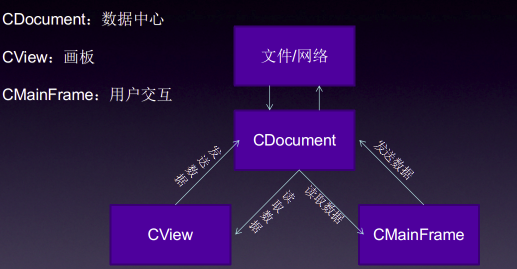

# 全局线程管理器

一个机器学习系统，需要管理一些公共的配置信息，如何存储这些配置信息，是一个难题。   

## 设计模式

### 1. MVC 框架

在传统的 MVC 编程框架中，通常采取设立数据中心的做法，将所有配置信息存在其中。同时，将 `数据中心指针共享` 至所有类，形成一个以数据为中心，多重引用的设计模式。  

如图，以 MFC 默认编程思路为例：    

    

这种编程框架，虽然思路清晰，但是需要将共享指针传来传去，显得相当赘余。   

### 2. 全局静态框架

这是一种新手程序员经常习惯干的事。不设立封装型的数据中心，而是将配置信息写在 `全局静态变量` 中。必要时，直接用 Get() 函数获取。   

Caffe 恰恰使用了这种 naive 的做法，不过配上 Boost 的 boost::thread_specific_ptr (线程独立存储资源指针) 之后，就相当 powerful 了。   

## 多线程  

一个线程除了需要些基础的配置信息，还需要什么？ 在机器学习系统中，还需要随机数发生器。

### 1. 随机数难题   

产生一个随机数很简单，time(0) 看起来不错，但是波动很有规律，是质量很低的随机数种子。计算领域最常用的随机数发生器是 **梅森旋转法**， Caffe 也使用了，这是一个兼有速度和质量的发生器。  

ACM 大神 [ACdreamers](http://blog.csdn.net/ACdreamers/article/details/44656743) 给出了一段模仿代码，ACM 选手大概写了 40 行。在 CPU 串行情况下，这 40 行代码怎么跑都行，但是在异步多线程中，问题就来了。   

假设一个管理器中包含梅森旋转法实例对象，实例 `对象里` 有生成函数，且这个管理器只属于主进程，当一个线程 A 需要随机数时，它可以访问主进程的梅森旋转法实例对象，执行该实例对象的产生函数。  

梅森发生器每执行一次，其内部数据将有一次变动，我们可以将其视为对发生器的修改操作。这个修改操作的 `触发对象` 大致有两个来源：   

① DataTransformer，它在一个线程中调用。   
② 所有Layer参数的初始化，它在主进程中调用。   

这样，如果梅森发生器只有一份，必然成为线程争夺的临界资源，它还包含修改操作。临界资源不加 mutex 是危险的，如果我们为其加 mutex，又有两处不便：

① 编程复杂，写 mutex 需要一番精力。   
② 对临界资源产生阻塞访问，一定程度上降低了多线程的效率。   

综合以上两点，随机数发生器最好设计成 `线程独立` 的资源。     

### 2. 设备难题 

在多 GPU 情况下，我们需要为每一个 GPU 准备一个 CPU 线程来监督工作. 全局管理器会包含 GPU 设备信息。假设只有一个管理器，那么多个 GPU 该怎么去访问这个管理器，获得自己的设备编号？  

显然，如果将管理器设计成 `线程独立` 的，那么这个问题就很好解决了。   

同理，可以推广到 root_solver 这个属性。显然，在主进程中，root_solver 应该为 true，默认它调度 GPU0。而在监督其它 GPU 的 CPU 线程中，root_solver 应该为 false。如果只有一个管理器，显然也是不妥的。   

因为，随机数发生器必须具有线程独立性，进而，全局管理器必须有线程独立性。   

Boost 库提供了一个线程独立性智能指针，方便了线程独立资源的设计。

### 线程智能指针

`boost::thread_specific_ptr<Class>` 是较为特殊的一个智能指针，但它不属于智能指针组， 位于 `"boost/thread/tss.hpp"` 下，属于 boost::thread 组。  

通常将 thread_specific_ptr 指针设为全局 static 变量, 这样进程和线程访问该指针时，将提供不同的结果。  

其内部实现原理，应该是记录进程 pid 和线程 tid，来做一个 hash，以达到线程独立资源的管理。  
```cpp
// Make sure each thread can have different values.
static boost::thread_specific_ptr<Caffe> thread_instance_;

Caffe& Caffe::Get() {
  if (!thread_instance_.get()) {
    thread_instance_.reset(new Caffe());
  }
  return *(thread_instance_.get());
}
```

将类静态函数 Get 封装之后，我们可以获得线程独立的管理器对象 Caffe 。

实例对象的代码空间将由 boost::thread 控制, 即 InternalThread， 它不在主进程的控制范围. 这样， Caffe 管理器里的复杂代码，在执行时不会因为异步而被截断。   

## 代码实战

### 1. 随机数系统设计

建立 rng.hpp，包含 `"boost/random/mersenne_twister.hpp"`.  

```cpp
typedef boost::mt19937 rng_t;
```

mt19937 是梅森旋转法的一个 32 位实现版本，由 boost 提供，将至重命名为 rng_t.   
 
建立 common.hpp，创建管理器类 Caffe.   

首先，我们需要一个低质量的随机数种子，来初始化梅森旋转法。同时，这个随机数种子，还必须是进程相关而不是线程相关的，避免多线程造成梅森随机数数值波动。    

在 Caffe 管理器内部，声明静态成员函数：`static int64_t cluster_seedgen()`;   

建立common.cpp，实现这个低质量随机数种子发生器：

```cpp
int64_t Caffe::cluster_seedgen(){
    int64_t seed, pid, t;
    pid = _getpid();
    t = time(0);
    seed = abs(((t * 181) *((pid - 83) * 359)) % 104729); 
    
    //set it as you want casually
    return seed;
}
```
Caffe 利用 pid, 默认时间、以及几个奇怪的数计算了一个低质量的随机数种子， 最外层的 104729 保证了种子的范围，你可以随便改成任何喜欢的数。  

在 Caffe 内部声明且定义 RNG 类：   

```cpp
// RNG(random number generator) 正面隐藏了 boost 和 CUDA rng 各自的实现过程
class RNG {
public:
    RNG();
    explicit RNG(unsigned int seed);
    explicit RNG(const RNG&);
    RNG& operator=(const RNG&);
    void* generator();
private:
    class Generator;
    shared_ptr<Generator> generator_;
};
```

RNG 类内嵌一个 Generator 发生器类，Generator 内部又封装一个 rng_t。梅森发生器支持两种构造模式，指定种子或使用进程相关的低质量种子。  

梅森发生器以动态内存的形式管理 rng_t，`caffe::rng_t* rng()` 函数需要特别注意。Boost 的 rng_t，也就是 boost::mt19937， 本质是一个类，这个类内部设置了复制构造函数。复制构造函数的内容很有趣 -- 重置梅森算法状态，这意味着，如下代码会是个灾难：   

```cpp
rng_t a;
rng_t b=a;
```

如果梅森发生器 a 已经产生了一定随机数，那么将 a 赋值给 b，b 将重复 a 的前几个值，因为发生器被重置了。如果需要获得发生器a的副本，应当使用指针来获取，这是为什么 rng() 要返回指针的原因。   

在 Caffe 里定义一个静态成员函数的 get_rng()，方便外部直接调用：   
```cpp
static rng_t* get_rng(){
    if (!Get().random_generator_){
        Get().random_generator_.reset(new RNG());
    }
    rng_t* rng = Get().random_generator_.get()->get_rng();
    return rng;
}
```

它利用了线程独立管理器来构建管理器内部的 RNG 对象，并返回 rng_t 指针。  

获得一个随机数很简单：  
```cpp
static unsigned int get_random_value(){
    rng_t* rng = get_rng();
    return (*rng)();
}
```

boost::mt19937 同时重载了 `() 函数`，调用它直接可产生随机数，切记以指针解引用形式调用。  

### 2. 数据结构

Caffe 类的实现使用了单例模式(因为网络的一些数据需要共享), Caffe 类中保存了 caffe 通用的数据结构, 比如 cublas, curand handler.   

```cpp
class Caffe {
 public:
  ~Caffe();

  // Caffe 的线程本地上下文属性.  
  static Caffe& Get();

  enum Brew { CPU, GPU };

  class RNG {
   public:
    RNG();
    explicit RNG(unsigned int seed);
    explicit RNG(const RNG&);
    RNG& operator=(const RNG&);
    void* generator();
   private:
    class Generator;
    shared_ptr<Generator> generator_;
  };

  // Getters for boost rng, curand, and cublas handles
  inline static RNG& rng_stream() {
    if (!Get().random_generator_) {
      Get().random_generator_.reset(new RNG());
    }
    return *(Get().random_generator_);
  }
#ifndef CPU_ONLY
  inline static cublasHandle_t cublas_handle() { return Get().cublas_handle_; }
  inline static curandGenerator_t curand_generator() {
    return Get().curand_generator_;
  }
#endif

  inline static Brew mode() { return Get().mode_; }
  inline static void set_mode(Brew mode) { Get().mode_ = mode; }
  static void set_random_seed(const unsigned int seed);
  static void SetDevice(const int device_id);
  static void DeviceQuery();
  static bool CheckDevice(const int device_id);
  static int FindDevice(const int start_id = 0);
  
  // solver_count 和 root_solver 用于并行训练  
  inline static int solver_count() { return Get().solver_count_; }
  inline static void set_solver_count(int val) { Get().solver_count_ = val; }
  inline static bool root_solver() { return Get().root_solver_; }
  inline static void set_root_solver(bool val) { Get().root_solver_ = val; }

 protected:
#ifndef CPU_ONLY
  cublasHandle_t cublas_handle_;
  curandGenerator_t curand_generator_;
#endif
  shared_ptr<RNG> random_generator_;

  Brew mode_;
  int solver_count_;
  bool root_solver_;

 private:
  // 构造函数声明为私有方法, 保证只能实例化一次, 避免多次实例化.
  Caffe();
  DISABLE_COPY_AND_ASSIGN(Caffe);
};
```

成员变量包括：

- 工作设备模式：mode, CPU or GPU, 最好不要在线程启动后切换模式.   
- solver 相关：solver_count 和 root_solver  
- RNG：random_generator  
- CUDA 相关：cublas 句柄 cublas_handle、curand 发生器 curand_generator.  

成员函数包括：   

- get系封装  
- set系封装  
- 随机数系统相关  

———————————————————————————————分割线————————————————————————————

比较难以理解的是 solver_count 和 root_solver，这涉及到分布式计算. 新版 Caffe 允许多 GPU 间并行，与 AlexNet 不同，多 GPU 模式的内涵在于：“不共享数据，却共享网络”. 所以，允许多个 solver 存在，且应用到不同的 GPU 上去。总结一下网络和 solver 之间的关系: 数据在多个 solver 中维护, 每个 GPU 对应一个 solver, 多个 solver 共享同一个网络.  

直接使用 solver_count 的地方是 DataReader，每一个 DataLayer 都有一个 DataReader， DataReader 工作在异步线程，我们允许在一个主程序上跑多个 DataLayer， 但是不可以有多个 ConvLayer。   

> 关于多 GPU 的介绍请看 << Internal Thread >>.  

第一个 solver 会成为 root_solver，第二、第三个 solver 就会成为 shared_solver。  

root_solver 有很大一部分特权，具体有以下几点：   
- LOG(INFO)允许信息：显然我们不需要让几个 GPU，产生几份重复的信息。   
- 测试：只有 root_solver 才能测试，猜测是为了减少冗余计算？  
- 统计结果：只有 root_solver 才能输出统计结果，这点同第一点。   

———————————————————————————————分割线————————————————————————————

CUDA 则需要做 cublas 和 curand 的初始化。默认提供了更改当前 `GPU设备` 的函数 set_device(), 更改 device 的时候，会让当前 cublas_handle_ 和 curand_generator_ 无效，即先释放再重新申请。   

### 3. 宏

common.hpp，如其名“通用”二字，我们可以将一些重要的通用宏放置其中。   

这些宏如下：  

```cpp
// Disable the copy and assignment operator for a class.
#define DISABLE_COPY_AND_ASSIGN(classname) \
private:\
  classname(const classname&);\
  classname& operator=(const classname&)

//    MACRO: Instance a class
#define INSTANTIATE_CLASS(classname) \
  template class classname<float>; \
  template class classname<double>

//    instance for forward/backward in cu file
//    note that INSTANTIATE_CLASS is meaningless in NVCC complier
//    you must INSTANTIATE again
#define INSTANTIATE_LAYER_GPU_FORWARD(classname) \
  template void classname<float>::forward_gpu( \
      const vector<Blob<float>*>& bottom, \
      const vector<Blob<float>*>& top); \
  template void classname<double>::forward_gpu( \
      const vector<Blob<double>*>& bottom, \
      const vector<Blob<double>*>& top);

#define INSTANTIATE_LAYER_GPU_BACKWARD(classname) \
  template void classname<float>::backward_gpu( \
      const vector<Blob<float>*>& top, \
      const vector<bool> &data_need_bp, \
      const vector<Blob<float>*>& bottom); \
  template void classname<double>::backward_gpu( \
      const vector<Blob<double>*>& top, \
      const vector<bool> &data_need_bp, \
      const vector<Blob<double>*>& bottom)

#define INSTANTIATE_LAYER_GPU_FUNCS(classname) \
  INSTANTIATE_LAYER_GPU_FORWARD(classname); \
  INSTANTIATE_LAYER_GPU_BACKWARD(classname)

#define NOT_IMPLEMENTED LOG(FATAL) << "Not Implemented Yet"   

// 这个不是在 common.hpp 文件中, 而是在 layer_factory.hpp 中. 
#define REGISTER_LAYER_CLASS(type)                                             \
  template <typename Dtype>                                                    \
  shared_ptr<Layer<Dtype> > Creator_##type##Layer(const LayerParameter& param) \
  {                                                                            \
    return shared_ptr<Layer<Dtype> >(new type##Layer<Dtype>(param));           \
  }                                                                            \
  REGISTER_LAYER_CREATOR(type, Creator_##type##Layer)
```

Caffe 通过宏，大概减少了 1000~2000 行代码。   

宏函数大致有如下几种：

① `#define DISABLE_COPY_AND_ASSIGN(classname)`   

俗称禁止拷贝和赋值宏，如果你熟悉 Qt，就会发现 Qt 中大部分数据结构都用了这个宏来保护。这个宏算是最没用的宏，用在了所有 Caffe 大型数据结构上(Blob、Layer、Net、Solver), 目的是禁止两个大型数据结构直接复制、构造、然后赋值。  

实际上，Caffe 也没有去编写复制构造函数代码，所以最终还是会被编译器拦下。两个大型数据结构之间的复制会导致程序运行效率极大下降，这是绝对应该被禁止的。如果你要使用一个数据结构，请用指针或是引用指向它。   

如果你有乱赋值的编程陋习，请及时打上这个宏，避免自己手贱。反之，可以暂时无视它。当然，从库的完整性角度，这个宏是明智的。Java/Python 不需要这个宏，因为 Java 对大型数据结构，默认是浅拷贝，也就是直接引用。而 Python， 这个没有数据类型的奇怪语言，则默认全部是浅拷贝。   

② `#define INSTANTIATE_CLASS(classname)`   

非常非常非常重要的宏，重要的事说三遍。

由于 Caffe 采用分离式模板编程方法（据说也是Google倡导的), 模板未类型实例化的定义空间和实例化的定义空间是不同的。实际上，编译器并不会理睬分离在 cpp 里的未实例化的定义代码，而是将它放置在一个虚拟的空间。   

一旦一段明确类型的代码，访问这段虚拟代码空间，就会被编译器拦截。如果你想要让模板的声明和定义分离编写，就需要在 cpp 定义文件里，将定义指定明确的类型，实例化。这个宏的作用正是如此。 

③ `#define INSTANTIATE_LAYER_GPU_FUNCS(classname)`   

通样是实例化宏，专门写这个宏的原因，是因为 NVCC 编译器相当傲娇。打在 cpp 文件里的INSTANTIATE_CLASS宏，NVCC 在编译 cu 文件时，可不会知道。所以，你需要在cu文件里，为这些函数再次实例化。其实也没几个函数，也就是 forward_gpu() 和 backward_gpu().  

④ `#define NOT_IMPLEMENTED`   

俗称偷懒宏，你要是这段代码不想写了，打个 NOT_IMPLEMENTED 就行了。就是宣告：“老子就是不想写这段代码，留空，留空！” 但是注意，宏封装了 LOG(FATAL)，这是个 Assert(断言)，会引起 CPU 硬件中断. 一旦代码空间转到你没写的这段，整个程序就会被终止。所以，偷懒有度，还是认真写代码吧。   

⑤ `#define REGISTER_LAYER_CLASS(type)`    

Layer 工厂模式用的宏，也就是将这个 Layer 的信息写到工厂的管理数据库里。此宏省了不少代码，在使用工厂之前，记得要为每个成品(Layer)打上这个宏。   


### 4. 实现

大部分简短实现都和成员函数声明写在了一起。这里完善一下 Caffe 管理器的构造和析构函数。  

```cpp
#ifdef CPU_ONLY  // CPU-only Caffe.

Caffe::Caffe()
    : random_generator_(), mode_(Caffe::CPU),
      solver_count_(1), root_solver_(true) { }

Caffe::~Caffe() { }

#else  // Normal GPU + CPU Caffe.

Caffe::Caffe()
    : cublas_handle_(NULL), curand_generator_(NULL), random_generator_(),
    mode_(Caffe::CPU), solver_count_(1), root_solver_(true) {
  // Try to create a cublas handler, and report an error if failed (but we will
  // keep the program running as one might just want to run CPU code).
  if (cublasCreate(&cublas_handle_) != CUBLAS_STATUS_SUCCESS) {
    LOG(ERROR) << "Cannot create Cublas handle. Cublas won't be available.";
  }
  // Try to create a curand handler.
  if (curandCreateGenerator(&curand_generator_, CURAND_RNG_PSEUDO_DEFAULT)
      != CURAND_STATUS_SUCCESS ||
      curandSetPseudoRandomGeneratorSeed(curand_generator_, cluster_seedgen())
      != CURAND_STATUS_SUCCESS) {
    LOG(ERROR) << "Cannot create Curand generator. Curand won't be available.";
  }
}

Caffe::~Caffe() {
  if (cublas_handle_) CUBLAS_CHECK(cublasDestroy(cublas_handle_));
  if (curand_generator_) {
    CURAND_CHECK(curandDestroyGenerator(curand_generator_));
  }
}
#endif
```
CPU 和 GPU 用宏隔开编译了，默认模式是 CPU，solver_count 为 1，root_sovler 为真. GPU 的构造和析构函数还需要追加 cublas 和 curand 的初始化和释放。   

当 CUDA 人工强制切换设备后(通常不建议这么做)，原有的 cublas 句柄和 curand 发生器会失效。因为它们是绑定 GPU 设备的，这时候需要销毁重新构造，绑定新的 GPU 设备。另外，在 Windows 上，短时间内关闭打开，多次启动程序，绑定 cublas 句柄频率过快，也可能导致绑定失败。   
