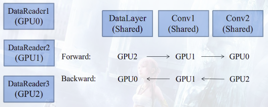

# 线程系统 - Internal Thread   

> 不精通多线程优化的程序员，不是好程序员，连码农都不是。
> 　　　　　　　　　　　　　　　　　　　　　　——并行计算时代掌握多线程的重要性

## 线程与操作系统

### 1. 用户线程与内核线程　　

广义上线程分为用户线程和内核线程。前者已经绝迹，它一般只存在于早期不支持多线程的系统中。它是用模拟的方式实现一个模拟的多线程系统，不支持异步。即，一个线程被阻塞了，其它线程也会被阻塞。   

当今的操作系统几乎都默认提供了内核线程API，底层由操作系统实现。内核线程的好处在于，它们之间支持异步，是"真"多线程。

### 2. 操作系统的流氓软件

不过，内核线程也给线程的使用带来了操作系统捆绑性。不同操作系统平台，其内核线程的实现与提供的API不同，给跨平台带来麻烦。比如在 Windows上，MFC 就是封装了 Windows 内核线程。   

在 Linux上，广泛使用的 pThread 就是 POSIX 系列系统流传下来的内核线程。   

### 3. 第三方跨平台内核线程库

有幸的是，历史上有许多跨平台的项目库。 我最早知道是 Qt，GTK，这俩个比较特殊，因为它们是 Application Framework, 是在90年代左右， C++ 为了对抗 Java 等后期开发之秀，而专门写成的跨平台 C++ 库, 主要以 GUI 为作战武器，对抗 Java。  

Caffe 就是使用了 Boost 线程库, Boost 库提供了优秀了内核线程库，还是跨平台的。所以 Caffe 移植到 Windows，是不需要改动线程系统的。  

## 何以线程用？

### 1. 生产者与消费者

生产者与消费者是一个经典的资源分配问题。它的核心要点主要体现在两方面：   
① 阻塞  
② 临界  

首先看①：   
为什么需要阻塞?因为生产者比较快，消费者比较慢。一次消费过程，包括整个正向传播和反向传播，这需要不少的时间。而一次生产过程，就是对一个 Batch 数据的预缓冲，这不需要很多时间。生产者总不能一直生产下去，然后爆掉缓冲区吧？   

所以，生产者在检测到缓冲区满了之后，就要进入阻塞状态。那么问题来了，如果我们不用多线程，将阻塞代码放在主进程中执行，会怎么样？   

读取，阻塞，前向传播失败，反向传播不可能，死锁。这是为什么 I/O 代码需要多线程处理的根本原因。   
   
再来看②:   
为什么需要临界？ 因为生产者和消费者之间必然是异步的， 也就是说它们隶属于不同的线程。   

证明如下：
生产者有一定概率被阻塞，假设生产者和消费者在同一个线程实体中，那么必然触发死锁(线程不能自己唤醒自己)。又因为系统执行必然不应该有死锁，所以假设不成立。   

结论：生产者和消费者之间必然是异步的。   

异步临界资源问题，则需要加锁(Mutex)来维持资源的一致性，具体在第陆章中详解。   

### 2. 破除因果律

多线程程序设计的 `核心原则` 就是：将非因果连续的代码，并行化。也就是说，只要代码前后不是上下文相关的，都能够并行执行。   

那么 Caffe 的 I/O 模型中，有哪几处不是上下文相关的？   

答案有二：
① Datum 和 Blob(Batch) 不是上下文相关的。   
Blob 包含着正向传播的 shape 信息，这些信息只有初始化网络在初始化时才能确定。而 Datum 则只是与输入样本有关。   

所以，Datum 的读取工作可以在网络未初始化之前就开始，这就是 DataReader 采用线程设计的内涵。同时，这种不相关性，也为生产者和消费者对于临界资源访问的设计埋下伏笔。   

② GPU 之间不是上下文相关的。   

Caffe 的多 GPU 方案，是让不同 GPU 覆盖不同段的数据，最后不在网络结构上做融合。这点和 AlexNet 略有不同（AlexNet 两个 GPU 的网络结构最后交叉了）. 这样的多 GPU 方案，使得每个 GPU 至少存在一个 DataReader，覆盖不一样的数据段。   

在网络结构上，通过共享 root 网络即可，如图所示：  

  

上图是一个经典的多 GPU 流水线编程方案。3 个 GPU 拥有各自的 DataReader，但是共享所有 Layer。GPU0 由主进程控制，GPU1 由线程 1 控制，GPU2 由线程 2 控制。  
 
Caffe 在主机端，也就是 CPU 主进程和次线程，每个 Layer 的前向传播被一个 mutex 锁住，而反向传播却没有。这样，尽管主进程、线程1、线程2 是并行调用 Layer.Foward()，但不能同时访问同一 Layer，此时 Layer 为互斥临界资源。  

这种行为会构造出一个人工的流水线，比如：   
- GPU0 在 Conv1 时，GPU1、GPU2 会被锁住。  
- GPU0 在 Conv3 时，Conv1 和 Conv2 是空闲的，会被其它 GPU 占用。   

反向传播之所以不锁，是因为前向传播和反向传播是符合因果律的，前向传播成流水线，反向传播自然也是流水线，非常优美的设计。   

### 3. 影分身之术

本篇所述的多线程，均指的是 CPU 多线程。实际上，由于 GPU 的异构计算引入，CPU 线程基本都在做一些后勤工作。主要是数据的读取、与 GPU 显存的数据交换。  

CPU 主进程负责全程调度 GPU 执行计算代码，在这点上，CPU 利用率并不高。而从线程对数据的预缓冲任务也不是很艰难。   

所以，相对于计算密集型 CPU 多线程设计而言，Caffe 的多线程任务相对轻松。我们很难将 CPU 的利用率榨到 100%，在这点上，为深度学习 Online 应用系统埋下伏笔。

试想一下，在后台构建一个基于 Socket 的深度学习应用服务器，同时 CPU 并发线程可达几千，我觉得只有这样，才能真正榨干 CPU 计算力。至于 Caffe 的训练，其实对 CPU 的要求不是很高。    

## 代码实战

### 1. Boost线程的创建   

使用 boost::thread,  需要 `#include "boost/thread/thread.hpp"`.    

与 Qt、MFC 等 Application Framework 提供的线程库不同，boost::thread 的封装性比较强，一般不建议继承和改写 boost::thread 类(没见过有人这么用).   

为了线程能够执行自定义代码，需要在其 `构造` 时，传入执行函数的函数指针。   

函数指针分为两类：
① 普通函数指针   
② 类成员函数指针   

- boost::function 结合 bind 函数提供了一个函数指针的载体。(style1)   
- 也可以直接将函数指针的构造方式传入thread。(style2)   
- 建议配合boost::shared_ptr使用。(style3)   

若是普通函数指针，可用：
```cpp
// style 1
void helloworld(int a,string b);
boost::function<void()> f=bind(helloworld,1,"helloworld");
boost::thread(f);

// style 2
boost::thread(helloworld,1,"helloworld")

// style 3(Caffe style)
boost::shared_ptr<boost::thread> thread_;
thread_.reset(new boost::thread(helloworld,1,"helloworld"));
```
当然，为了系统的开发，我们显然需要一个封装类，如将 boost::thread 封装为 InternalThread类。  

即，将 boost::shared_ptr<boost::thread> thread_ 作为类成员。   

基于类的函数指针绑定需要传入 `类 this 指针`， 写法做如下更改：    

```cpp
class InternalThread{
void helloworld(int a,string b);
};

// style 1
boost::function<void()> f=bind(&InternalThread::helloworld,this,1,"helloworld");
boost::thread(f);

// style 2
boost::thread(&InternalThread::helloworld,this,1,"helloworld");

// style 3(Caffe style)
boost::shared_ptr<boost::thread> thread_;
thread_.reset(new boost::thread(&InternalThread::helloworld,this,1,"helloworld"));
```
### 2. Boost线程的生与死

boost::thread 一旦被构造后，就会立刻以异步的方式执行传入的函数。在 debug 线程的过程中，注意 boost::thread 将晚于主进程的代码的执行。如果不在 main 函数中循环等待，很有可能 boost::thread 还没有执行，main 函数已经退出了。  

想要立刻终结一个 boost 线程是不可能的，一些强大的 Application Framework 的线程库通常会提供 thread.terminate()，来立刻终结线程的执行（比如 Qt），但是 boost 没有提供。因为这种方式是相当不安全的，在 Java 设计模式中，更鼓励开发者让线程函数自动检测终结条件而退出。  

这种检测函数在 Caffe 里是 must_stop() 函数，它使用了 boost::thread 提供的中断点检测功能(interruption_requested() 函数)。   
```cpp
bool InternalThread::must_stop(){
    return boost::this_thread::interruption_requested();
}
```

注意，中断请求的检测只能在异步线程执行函数中执行，主进程从外部调用是无效的。  

主进程可以从外部触发 interrupt 操作，通知正在异步执行的线程，该方法封装为 StopInternalThread 函数：
```cpp
void InternalThread::StopInternalThread(){
    if (is_start()){
        thread->interrupt();
    }
    try{thread->join();}
    catch (boost::thread_interrupted&) {}
    catch (std::exception& e){
        LOG(FATAL) << "Thread exception: " << e.what(); 
    }
}
```

有时候，interrupt 的线程可能处于阻塞睡眠状态，我们需要从外部立即唤醒它，让其检测中断请求. 所以在 interrupt 操作后，需要立即后接 join 操作。最后，还可以选择性地补上异常检测。  

### 3. 数据结构  

建立 internal_thread.hpp。  
```CPP
/**
 提前声明 boost::thread, 如果只是简单的包含 boost/thread.hpp 头文件, 可能会在 OSX 出现 boost/NVCC issues (#1009, #1010). 
 */
namespace boost { class thread; }

namespace caffe {

/**
 * 子类需要重新实现 InternalThreadEntry() 函数完成特定的功能.
 */
class InternalThread {
 public:
  InternalThread() : thread_() {}
  virtual ~InternalThread();

  /**
   * Caffe's 线程的本地属性是通过下面这些值指定的: 
   *         device id, solver index etc. 
   */
  void StartInternalThread();

  void StopInternalThread();   // 直到线程退出之后才返回

  bool is_started() const;

 protected:
  virtual void InternalThreadEntry() {}  // 如果想运行其他功能, 重写这个函数

  /* Should be tested when running loops to exit when requested. */
  bool must_stop();

 private:
  void entry(int device, Caffe::Brew mode, int rand_seed, int solver_count,
      bool root_solver);

  shared_ptr<boost::thread> thread_;
};

}  // namespace caffe
```
因为全局管理器是线程独立的， 因此每一个线程，需要从主管理器转移一些参数，包括(GPU设备、计算模式、随机种子、root_solver & solver_count).   

成员函数包括：  

boost::thread 的传入函数 StartInternalThread， 这个函数里最后又嵌套了 InternalThreadEntry() 函数. 前者负责设置线程本地属性参数，后者默认是一个空函数，你也可以写成纯虚函数。   

由于 boost::thread 没有继承的用法，所以 Caffe 二度封装以后，提供了这种用法。所有继承 InternalThread 的类，只要重载 InternalThreadEntry() 这个虚函数就行了。  
 
StartInternalThread 应该最先被执行， 它包括获取主进程管理器参数，以及构造 thread。由于 thread 构造结束，就会立刻执行，所以 StartInternalThread 在构造结束后就直接启动了线程。  

StopInternalThread 的功能如上所述。   

### 4. 实现

建立 internal_thread.cpp。   

首先是 thread 的传入函数 entry()：   

```cpp
void InternalThread::entry(int device, Caffe::Mode mode, int rand_seed, int solver_count, bool root_solver){
#ifndef CPU_ONLY
    CUDA_CHECK(cudaSetDevice(device));
#endif
    Caffe::set_random_seed(rand_seed);
    Caffe::set_mode(mode);
    Caffe::set_solver_count(solver_count);
    Caffe::set_root_solver(root_solver);

    InternalThreadEntry();  // default: do nothing
}
```

然后是外部调用的 StartInternalThread() 函数：   

```cpp
void InternalThread::StartInternalThread() {
  CHECK(!is_started()) << "Threads should persist and not be restarted.";

  int device = 0;
#ifndef CPU_ONLY
  CUDA_CHECK(cudaGetDevice(&device));
#endif
  Caffe::Brew mode = Caffe::mode();
  int rand_seed = caffe_rng_rand();
  int solver_count = Caffe::solver_count();
  bool root_solver = Caffe::root_solver();

  try {
    thread_.reset(new boost::thread(&InternalThread::entry, this, device, mode,
          rand_seed, solver_count, root_solver));
  } catch (std::exception& e) {
    LOG(FATAL) << "Thread exception: " << e.what();
  }
}
```

由于该函数是在 `主进程` 中执行，Caffe::get() 与 InternalThreadEntry() 里的 Caffe::set() 操作的其实不是同一个全局管理器，所以需要这样麻烦的转移参数过程。

最后是线程控制与析构：   

```cpp
void InternalThread::StopInternalThread() {
  if (is_started()) {
    thread_->interrupt();
    try {
      thread_->join();
    } catch (boost::thread_interrupted&) {
    } catch (std::exception& e) {
      LOG(FATAL) << "Thread exception: " << e.what();
    }
  }
}

InternalThread::~InternalThread() {
  StopInternalThread();
}

bool InternalThread::is_started() const {
  return thread_ && thread_->joinable();
}

bool InternalThread::must_stop() {
  return thread_ && thread_->interruption_requested();
}
```

