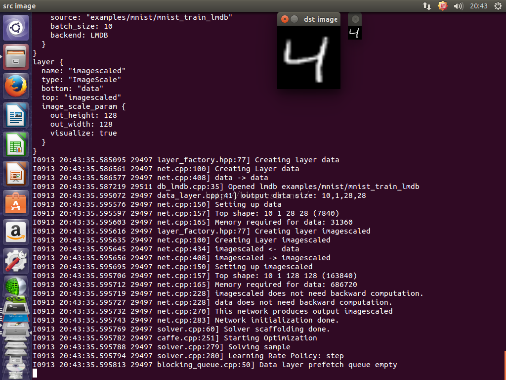

# 添加自己的 ImageScale 网络层  
原创 2016年09月13日 21:00:01 标签：caffe实战 /写自己的层 /gpu /caffe源码解析 5330
由于之前介绍过一次关于实现自己的网络层的文章，但是那篇文章偏难，这次我以最简单的对图像进行缩放的层为例进行实现。

在进行讲解之前，有一些必要条件你需要掌握，那就是你已经很了解怎么安装caffe，并且知道caffe里头的各个目录。

首先我们设计我们层所拥有的参数
out_height，即输出的图像的高度
out_width，即输出图像的宽度
visualize,是否需要将图像显示出来

那么可以在src/caffe/proto/caffe.proto文件中加入如下代码：

[cpp] view plain copy
message ImageScaleParameter {  
  // Specify the output height and width  
  optional uint32 out_height = 1;  
  optional uint32 out_width = 2;  
   
  // for debug you can see the source images and scaled images  
  optional bool visualize = 3 [default = false];  
}  

这里就指定了参数的名称以及参数的类型，optional说明该参数是可选的可以出现也可以不出现，此外[default=false]表明该参数的默认值是false
每个参数都指定一个数字表明参数的标识。

接着，我们可以将我们设计好的参数放入LayerParameter里头：
[cpp] view plain copy
optional HingeLossParameter hinge_loss_param = 114;  
optional ImageDataParameter image_data_param = 115;  
optional ImageScaleParameter image_scale_param = 147;  
optional InfogainLossParameter infogain_loss_param = 116;  
optional InnerProductParameter inner_product_param = 117;  

注意加入的时候看一看LayerParameter的注释，当你修改完毕了也要注意加入这样提示，这样方便后人更加方便地添加自定义层
// LayerParameter next available layer-specific ID: 148 (last added: image_scale_param)

接下来我们实现我们自己的层的头文件：

（1）实现的首先需要设置不允许头文件重复加入的宏定义：

[cpp] view plain copy
#ifndef CAFFE_IMAGE_SCALE_LAYER_HPP_  
#define CAFFE_IMAGE_SCALE_LAYER_HPP_  

（2）加入必要的头文件
[cpp] view plain copy
#include "caffe/blob.hpp"  
#include "caffe/layer.hpp"  
#include "caffe/proto/caffe.pb.h"  
#include "caffe/layer.hpp"  

（3）加入返回的层的类型字符串
[cpp] view plain copy
virtual inline const char* type() const { return "ImageScale"; }  

（4）告诉caffe本层的输入有几个，输出有几个
[cpp] view plain copy
virtual inline int ExactNumBottomBlobs() const { return 1; }  
virtual inline int ExactNumTopBlobs() const { return 1; }  

（5）由于本层实现是图像的缩放，所以不需要反传，因此直接写一个空的虚函数的实现
[cpp] view plain copy
virtual void Backward_cpu(const vector<Blob<Dtype>*>& top,  
  const vector<bool>& propagate_down, const vector<Blob<Dtype>*>& bottom) {};  

（6）定义在使用过程中所使用的类中的成员变量，注意类的成员变量的命名最后是以下划线结束，这样能够保持与caffe的代码一致性
[cpp] view plain copy
int out_height_;  
int out_width_;  
int height_;  
int width_;  
bool visualize_;  
int num_images_;  
int num_channels_;  

（7）最后别忘记加入endif这个宏，此外注意加入必要的注释，以表明这个endif所对应的开头是什么
[cpp] view plain copy
#endif  // CAFFE_IMAGE_SCALE_LAYER_HPP_  

下面给出详细的头文件代码：
[cpp] view plain copy
#ifndef CAFFE_IMAGE_SCALE_LAYER_HPP_  
#define CAFFE_IMAGE_SCALE_LAYER_HPP_  
#include "caffe/blob.hpp"  
#include "caffe/layer.hpp"  
#include "caffe/proto/caffe.pb.h"  
#include "caffe/layer.hpp"  
namespace caffe {  
// written by xizero00 2016/9/13  
template <typename Dtype>  
class ImageScaleLayer : public Layer<Dtype> {  
 public:  
  explicit ImageScaleLayer(const LayerParameter& param)  
      : Layer<Dtype>(param) {}  
  virtual void LayerSetUp(const vector<Blob<Dtype>*>& bottom,  
      const vector<Blob<Dtype>*>& top);  
  virtual void Reshape(const vector<Blob<Dtype>*>& bottom,  
      const vector<Blob<Dtype>*>& top);  
  virtual inline const char* type() const { return "ImageScale"; }  
  virtual inline int ExactNumBottomBlobs() const { return 1; }  
  virtual inline int ExactNumTopBlobs() const { return 1; }  
 protected:  
  /// @copydoc ImageScaleLayer  
  virtual void Forward_cpu(const vector<Blob<Dtype>*>& bottom,  
      const vector<Blob<Dtype>*>& top);  
  virtual void Backward_cpu(const vector<Blob<Dtype>*>& top,  
      const vector<bool>& propagate_down, const vector<Blob<Dtype>*>& bottom) {};  
  int out_height_;  
  int out_width_;  
  int height_;  
  int width_;  
  bool visualize_;  
  int num_images_;  
  int num_channels_;  
};  
}  // namespace caffe  
#endif  // CAFFE_IMAGE_SCALE_LAYER_HPP_  

接下来写具体的层的设置以及层的前传的实现：
（8）加入必要的头文件
[cpp] view plain copy
#include "caffe/layers/image_scale_layer.hpp"  
#include "caffe/util/math_functions.hpp"  
#include <opencv2/opencv.hpp>  

（9）实现层的设置函数LayerSetUp，在该函数中将网络的配置参数读取到类中的成员变量中，便于前传的时候以及对层进行设置的时候使用，并且检查参数的合法性
[cpp] view plain copy
template <typename Dtype>  
void ImageScaleLayer<Dtype>::LayerSetUp(const vector<Blob<Dtype>*>& bottom,  
      const vector<Blob<Dtype>*>& top) {  
  // get parameters  
  const ImageScaleParameter& param = this->layer_param_.image_scale_param();  
  // get the output size  
  out_height_ = param.out_height();  
  out_width_ = param.out_width();  
  visualize_ = param.visualize();  
   
  // get the input size  
  num_images_ = bottom[0]->num();  
  height_ = bottom[0]->height();  
  width_ = bottom[0]->width();  
  num_channels_ = bottom[0]->channels();  
  // check the channels must be images  
  // channel must be 1 or 3, gray image or color image  
  CHECK_EQ( (num_channels_==3) || (num_channels_ == 1), true);  
  // check the output size  
  CHECK_GT(out_height_, 0);  
  CHECK_GT(out_height_, 0);  
   
}  

（10）实现层的Reshape函数，来设定该层的输出的大小，我们使用从网络配置文件中的参数类设置输出的大小
[cpp] view plain copy
template <typename Dtype>  
void ImageScaleLayer<Dtype>::Reshape(const vector<Blob<Dtype>*>& bottom,  
      const vector<Blob<Dtype>*>& top) {  
  // reshape the outputs  
  top[0]->Reshape(num_images_, num_channels_, out_height_, out_width_);  
}  

（11）实现前向传播函数Forward_cpu,我实现的就是将图像一幅一幅地进行缩放到配置文件中所给的大小。
[cpp] view plain copy
template <typename Dtype>  
void ImageScaleLayer<Dtype>::Forward_cpu(  
    const vector<Blob<Dtype>*>& bottom, const vector<Blob<Dtype>*>& top) {  
  const Dtype* bottom_data = bottom[0]->cpu_data();  
  Dtype * top_data = top[0]->mutable_cpu_data();  
  cv::Mat srcimage, dstimage;  
   
  // precompurte the index  
  const int srcimagesize = width_ * height_;  
  const int dstimagesize = out_width_ *  out_height_;  
  const int srcchimagesize = srcimagesize * num_channels_;  
  const int dstchimagesize = dstimagesize * num_channels_;  
  for  ( int idx_img = 0; idx_img < num_images_; idx_img++ )  
  {  
        // zeros source images and scaled images  
        srcimage = cv::Mat::zeros(height_, width_, CV_32FC1);  
        dstimage = cv::Mat::zeros(out_height_, out_width_, CV_32FC1);  
        // read from bottom[0]  
        for  ( int idx_ch = 0; idx_ch < num_channels_; idx_ch++ )  
        {  
                for  (int i = 0; i < height_; i++)  
                {  
                        for ( int j=0; j < width_; j++ )  
                        {  
                                int image_idx = idx_img * srcchimagesize + srcimagesize * idx_ch + height_ *i + j;  
                                srcimage.at<float>(i,j) = (float)bottom_data[image_idx];  
                        }  
                }  
        }  
        // resize to specified size  
        // here we use linear interpolation  
        cv::resize(srcimage, dstimage, dstimage.size());  
        // store the resized image to top[0]  
        for (int idx_ch = 0; idx_ch < num_channels_; idx_ch++)  
        {  
                for (int i = 0; i < out_height_; i++)  
                {  
                        for (int j = 0; j < out_width_; j++)  
                        {  
                                int image_idx = idx_img * dstchimagesize + dstimagesize * idx_ch + out_height_*i + j;  
                                top_data[image_idx] = dstimage.at<float>(i,j);  
                        }  
                }  
        }  
        if (visualize_)  
        {  
                cv::namedWindow("src image", CV_WINDOW_AUTOSIZE);  
                cv::namedWindow("dst image", CV_WINDOW_AUTOSIZE);  
                cv::imshow("src image", srcimage);  
                cv::imshow("dst image", dstimage);  
                cv::waitKey(0);  
        }  
  }  
}  

最后给出完整的实现：

[cpp] view plain copy
#include "caffe/layers/image_scale_layer.hpp"  
#include "caffe/util/math_functions.hpp"  
#include <opencv2/opencv.hpp>  
namespace caffe {  
template <typename Dtype>  
void ImageScaleLayer<Dtype>::LayerSetUp(const vector<Blob<Dtype>*>& bottom,  
      const vector<Blob<Dtype>*>& top) {  
  // get parameters  
  const ImageScaleParameter& param = this->layer_param_.image_scale_param();  
  // get the output size  
  out_height_ = param.out_height();  
  out_width_ = param.out_width();  
  visualize_ = param.visualize();  
   
  // get the input size  
  num_images_ = bottom[0]->num();  
  height_ = bottom[0]->height();  
  width_ = bottom[0]->width();  
  num_channels_ = bottom[0]->channels();  
  // check the channels must be images  
  // channel must be 1 or 3, gray image or color image  
  CHECK_EQ( (num_channels_==3) || (num_channels_ == 1), true);  
  // check the output size  
  CHECK_GT(out_height_, 0);  
  CHECK_GT(out_height_, 0);  
   
}  
template <typename Dtype>  
void ImageScaleLayer<Dtype>::Reshape(const vector<Blob<Dtype>*>& bottom,  
      const vector<Blob<Dtype>*>& top) {  
  // reshape the outputs  
  top[0]->Reshape(num_images_, num_channels_, out_height_, out_width_);  
}  
template <typename Dtype>  
void ImageScaleLayer<Dtype>::Forward_cpu(  
    const vector<Blob<Dtype>*>& bottom, const vector<Blob<Dtype>*>& top) {  
  const Dtype* bottom_data = bottom[0]->cpu_data();  
  Dtype * top_data = top[0]->mutable_cpu_data();  
  cv::Mat srcimage, dstimage;  
   
  // precompurte the index  
  const int srcimagesize = width_ * height_;  
  const int dstimagesize = out_width_ *  out_height_;  
  const int srcchimagesize = srcimagesize * num_channels_;  
  const int dstchimagesize = dstimagesize * num_channels_;  
  for  ( int idx_img = 0; idx_img < num_images_; idx_img++ )  
  {  
        // zeros source images and scaled images  
        srcimage = cv::Mat::zeros(height_, width_, CV_32FC1);  
        dstimage = cv::Mat::zeros(out_height_, out_width_, CV_32FC1);  
        // read from bottom[0]  
        for  ( int idx_ch = 0; idx_ch < num_channels_; idx_ch++ )  
        {  
                for  (int i = 0; i < height_; i++)  
                {  
                        for ( int j=0; j < width_; j++ )  
                        {  
                                int image_idx = idx_img * srcchimagesize + srcimagesize * idx_ch + height_ *i + j;  
                                srcimage.at<float>(i,j) = (float)bottom_data[image_idx];  
                        }  
                }  
        }  
        // resize to specified size  
        // here we use linear interpolation  
        cv::resize(srcimage, dstimage, dstimage.size());  
        // store the resized image to top[0]  
        for (int idx_ch = 0; idx_ch < num_channels_; idx_ch++)  
        {  
                for (int i = 0; i < out_height_; i++)  
                {  
                        for (int j = 0; j < out_width_; j++)  
                        {  
                                int image_idx = idx_img * dstchimagesize + dstimagesize * idx_ch + out_height_*i + j;  
                                top_data[image_idx] = dstimage.at<float>(i,j);  
                        }  
                }  
        }  
        if (visualize_)  
        {  
                cv::namedWindow("src image", CV_WINDOW_AUTOSIZE);  
                cv::namedWindow("dst image", CV_WINDOW_AUTOSIZE);  
                cv::imshow("src image", srcimage);  
                cv::imshow("dst image", dstimage);  
                cv::waitKey(0);  
        }  
  }  
}  
#ifdef CPU_ONLY  
STUB_GPU(ImageScaleLayer);  
#endif  
INSTANTIATE_CLASS(ImageScaleLayer);  
REGISTER_LAYER_CLASS(ImageScale);  
}  // namespace caffe  

请把上述代码，保存为image_scale_layer.hpp和cpp。然后放入到对应的include和src/caffe/layers文件夹中。

那么在使用的时候可以进行如下配置
[cpp] view plain copy
layer {  
  name: "imagescaled"  
  type: "ImageScale"  
  bottom: "data"  
  top: "imagescaled"  
  image_scale_param {  
    out_height: 128  
    out_width: 128  
    visualize: true  
  }  
}  

上述配置中out_height和out_width就是经过缩放之后的图片的大小，而visualize表明是否显示的意思。
至此，我们就完成了一个很简单的caffe自定义层的实现,怎么样，很简单吧？
我测试的模型（我想你肯定知道怎么用caffe所听的工具将mnist数据集转换为lmdb吧）是：
[cpp] view plain copy
# Simple single-layer network to showcase editing model parameters.  
name: "sample"  
layer {  
  name: "data"  
  type: "Data"  
  top: "data"  
  include {  
    phase: TRAIN  
  }  
  transform_param {  
    scale: 0.0039215684  
  }  
  data_param {  
    source: "examples/mnist/mnist_train_lmdb"  
    batch_size: 10  
    backend: LMDB  
  }  
}  
  
layer {  
  name: "imagescaled"  
  type: "ImageScale"  
  bottom: "data"  
  top: "imagescaled"  
  image_scale_param {  
    out_height: 128  
    out_width: 128  
    visualize: true  
  }  
}  

测试所用的solver.prototxt
[cpp] view plain copy
net: "examples/imagescale/sample.prototxt"  
  
  
base_lr: 0.01  
lr_policy: "step"  
gamma: 0.1  
stepsize: 10000  
display: 1  
max_iter: 1  
weight_decay: 0.0005  
snapshot: 1  
snapshot_prefix: "examples/imagescale/sample"  
momentum: 0.9  
# solver mode: CPU or GPU  
solver_mode: GPU  

然后运行的时候仅仅需要写个bash文件到caffe的目录：
[plain] view plain copy
#!/usr/bin/env sh  
set -e  
  
snap_dir="examples/imagescale/snapshots"  
  
mkdir -p $snap_dir  
  
TOOLS=./build/tools  
  
  
$TOOLS/caffe train \  
--solver=examples/imagescale/solver.prototxt 2>&1 | tee -a $snap_dir/train.log  

下面给出我的结果：

  

小的是输入的原始图像，大的是经过缩放之后的图像。

好了，到此结束。

代码打包下载，请戳这里
http://download.csdn.net/detail/xizero00/9629898
