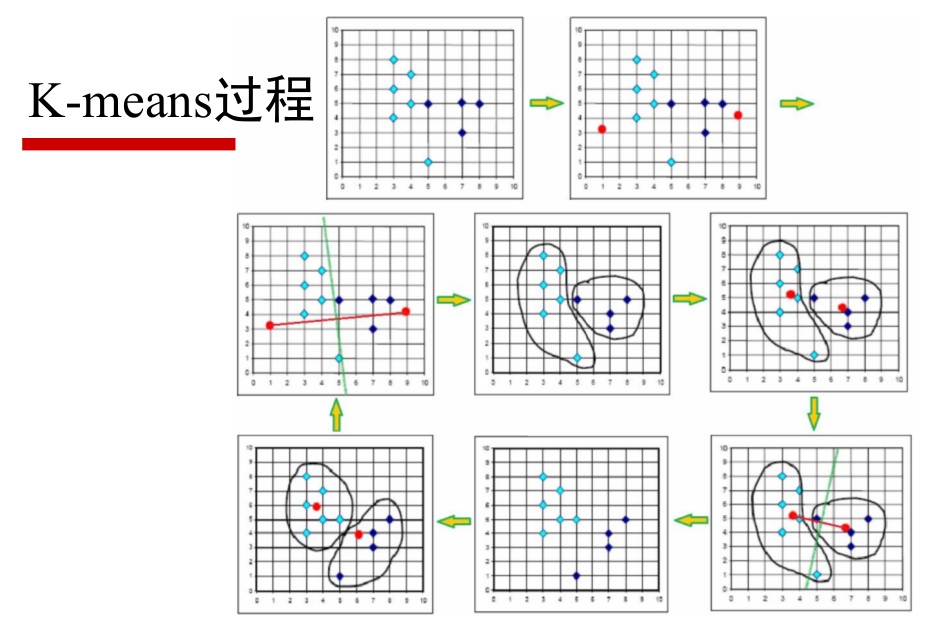
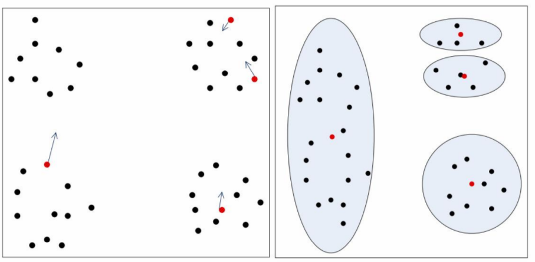

# K-means 聚类     

**基本实现**:    
1. 算法首先随机的选取 k 个对象, 每个对象初始化地代表了一个族的均值或中心;   
2. 对其余对象计算其与 k 个簇中心的距离, 并把它赋给最近的簇;  
3. 重新计算刚刚添加过对象的簇的平均值;
4. 重复步骤1, 直到准则函数(最小平方误差MSE函数)收敛.    
需要注意的是: 算法最后一定会收敛, 但是不一定收敛到最优结果.    

## 度量距离的常用方法        
相对熵(KL 距离)     

直观的理解一下 k = 2 时的 K-means 的迭代过程(取巧的话可以使用垂直平分线).    

    

K-means 是初值敏感的.     

    

那么如何改善 K-means 的敏感问题呢?    

把两个最后距离最近的中心点合并, 把距离其他中心点最远的中心点分割为 2 个.     
