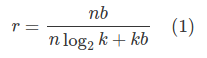

# 深度压缩 - Song Han   

> [论文下载地址](https://arxiv.org/abs/1510.00149):  
@article{han2015deep_compression,   
  title={Deep Compression: Compressing Deep Neural Networks with Pruning, Trained Quantization and Huffman Coding},   
  author={Han, Song and Mao, Huizi and Dally, William J},   
  journal={International Conference on Learning Representations (ICLR)},   
  year={2016}   
}     

> 参考博客    
https://blog.csdn.net/u013082989/article/details/77915375    

## 概述

本篇论文是 ICLR2016 年的 best paper，主要讲述关于深度学习网络参数的压缩工作。论文主要从下三点出发：  

- pruning   
- train quantization   
- huffman coding  

本文首先对网络进行剪枝，只保留重要的连接；第二步通过参数共享量化权重矩阵；第三步对量化值进行 huffman 编码，进一步压缩。整个网络在不影响性能的情况下，能够将参数量降低到原来的 1/49~1/35。  
在 ImageNet 数据集上，压缩后的网络的实验结果如下所示：   
1. AlexNet 在不影响精度的前提下，参数从 240MB 减少到 6.9MB，35×  
2. VGG-16 在不影响精度的前提下，参数量从 552MB 减少到 11.3MB，49×  
3. 模型能够在 DRAM 运行。   
4. 运行速度提高 3-4 倍。  
5. 能耗降低到原来的 1/7~1/3。  

## Pipline
下图描述了论文的模型压缩流程.   

  
    

从图 1 可以看出网络压缩的基本流程:    
首先移除冗余的连接，只保留权值比较大的连接，得到剪枝后的网络;    
第二步，权重进行量化，然后多个连接共享一个参数，只保存码本和索引;    
第三步，使用 huffman 编码，压缩量化的值.  

## 剪枝
在深度学习训练的过程中，会学到层与层之间连接的参数。剪枝的方法也很简单: 如果连接的参数(也就是权值)小于一定阈值的直接置零(相当于移除)，这样就会使权重矩阵变成稀疏矩阵, 最终就得到了稀疏的网络连接。    
剪枝这一步骤能够将 VGG-16（AlexNet)模型大小降低到原来的 1/13 (1/9)。    

稀疏矩阵用 compressed sparse row(CSR) 和 compressed sparse column(CSC) 的格式进行压缩，总共需要 2a+n+1 个存储单元，a 是非零元素个数，n 是行数或者列数。 
网络剪枝的过程如图 2 所示：   

  

一个 `4*4` 的矩阵可以用一维 16 数组表示，剪枝时候只保留权值大于指定阈值的数. 在这里我们保存的是相对距离而不是绝对距离，例如 idx = 4 和 idx = 1 之间的位置差为 3. 如果位置差大于设定的长度(span)，那么就在 span 位置插入 0. 例如 15 和 4 之间的距离为 11(大于 span = 8)，所以在 4 + 8 的位置插入 0, idx = 15 相对 idx = 12 的距离为 3. 这里 span 阈值在卷积层设置为 8, 全连接层为 5.   

关于系数矩阵的 CSR 和 CSC.   
主要包括 3 个数组，浮点值数组 val，两个整形数组 col_index, row_ptr.   
val(k) = a(i,j), col_index(k) = j   
row_ptr 是每行数据第一个非0元素在val中的索引，最后加上一位非0元素的个数，即row_ptr(n+1) = a+1   
比如    

  

val	10	-2	3	9	3	7	8	7	3 … 9	13	4	2	-1   
col_index	1	5	1	2	6	2	3	4	1 … 5	6	2	5	6   
row_ptr	1	3	6	9	13	17	20   
- 所以总共需要的大小为：2a+n+1   
- a为矩阵非零元素的个数   
- n为行数  

## Trained Quantization And Weight Shared

  

图 3 假定某层有 4 个输入单元 4 个输出单元，权重矩阵的维度为 `4*4`，梯度矩阵的维度同样为 `4*4`.    
假设权重被量化(quantized)为 4 类(用四种不同的颜色标识), 即相同颜色的权重值共享相同的量化中心(即 centroids).    
用量化得到的类别的索引代表每类的权值，得到量化后的权值矩阵(图 3 中的白色矩阵)。用 4 个量化中心和 16 个索引就可以计算得到 `4*4` 权值矩阵。   
梯度矩阵同样量化为 4 类，但是不同于权值矩阵的处理方式, 这里是对每类的梯度进行求和得到每类的偏置, 然后用量化中心减去得到的偏置和学习率的乘积即可得到微调后的量化中心。    

对于 Alex-Net, 我们将每个 CONV 层量化为 8-bits(256 个共享权值, 即量化中心), 每个 FC 层量化为 5-bits(32 个共享权值, 即量化中心), 而最后网络的性能并没有损失.     

### 1. 压缩率    
计算方法如下公式所示：    

  
       

其中:   
n 代表权值的个数, 即权值矩阵的元素个数;   
b 代表每一个权值需要用 b bits 表示, 即浮点数为 32 位;   
k 表示量化 k 个类;  
因此 k 类只需要用 log2(k) 个 bit 表示, n 个权值元素需要 `n * log2(k)` 个索引，还需要用 kb 表示量化中心的数值。   

以图 3 为例分析压缩率的计算方法.    
权值矩阵有 16 个元素, 即 n = 16;   
每个权值为 float 类型, 需要用 32 位的数值表示, 即 b = 32;   
权值中心被量化为 4 类，因此每个权值元素对应的量化中心类别的索引只用 2 个 bit 就可表示;   
最后的计算公式如下:       

  

### 2. 权值共享    
在将权值矩阵量化为 k 类时, 作者采用了 K-means 聚类方法, 即把原始的 n 个权重 W = {w1, w2, ..., wn} 使用聚类算法变为 k 个聚类中心 C = {c1, c2, ..., ck}. 这样落在相同 cluster 中的那些权值就会共享该类的量化中心值.   

聚类算法最小化类内误差, 目标函数如下所示： 

  

### 3. 聚类中心(共享权值)的初始化    
聚类中心的初始化也会影响网络的精度，作者提出了三种初始化方法，分别为：   
- Forgy： 从原始的数据集中随机选取 k 个值作为聚类中心，从 figure4 可以看出, 原始的数据符合双峰曲线，所以初始化的值集中在两个峰顶附近。   
- Density-based：在 Y 轴平分 CDF 曲线，然后找到对应的 X 轴位置，作为初始化聚类中心。这种方法初始化距离中心也是在双峰附近，但是比 Forgy 要相对稀疏。   
- Linear：找到权值的最大值和最小值，在 [min,max] 区间内平均划分 k 份，作为原始的聚类中心。   

但是在深度学习中，大的权值说明对该因素的影响大，但是实际上大的权值在参数中很少，如果采用 1 或 2 的方法进行初始化, 可能会把大的权值量化为小的值，影响实际效果。所以线性的初始化效果最好。    

### 4. Feed-Forward and Back-Propagation   
量化后聚类中心的值的梯度计算公式：   

  

是指示函数。

## 哈夫曼编码
Huffman 编码是一种经常用于无损压缩的优化前缀编码. 它使用变长 codewords 来编码原始符号, table 是根据每个符号发生的概率得到, 越是常见的符号就需要越少的位数表示. 对应到模型压缩场景中就是按照聚类中心的出现的概率从大到小排序进行 Huffman 编码.   

  

根据上面的结果，权重大都分布在两个峰值附近，所以利于 huffman 编码; 而稀疏矩阵的索引大都小于 20. Huffman 编码对于这种非正态分布的数据编码可以减少 20% - 30% 的网络存储空间.  

## 结果及讨论
作者把上述方法分别在 Lenet，AlexNet 和 VGG 上，在 MNIST 和 ImageNet 的数据集测试实验结果：    

  

深度学习最近几年很火热，但是终究由于需要资源过多的原因，并没有在移动设备上大量应用，这也是深度学习的缺陷之一，这也是很多科研人员努力的解决的问题。本文就是基于网络参数压缩作的工作，还有相关研究从硬件出发设计符合深度学习的芯片.   
最后推荐一下 ICLR 这个会议，大牛都在上面发表文章。

## 自己的一些理解   
- 剪枝和权值共享其实是能够防止过拟合的, 所以准确度没有损失;    
- 权值共享只是当前层的权值共享, 不是整个网络的权值共享;    
- 缺点就是在运行时现有的 GPU 不能进行间接的矩阵输入查找，以及相对索引 CSC 或 CSR(下篇论文中也有提及);   