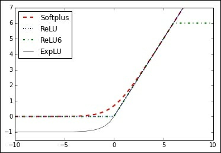
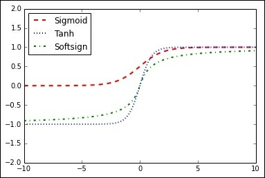

# Chapter 1. Getting Started with TensorFlow

In this chapter, we will cover basic recipes in order to understand how
TensorFlow works and how to access data for this book and additional
resources. By the end of the chapter, you should have knowledge of the
following:   

- How TensorFlow Works  
- Declaring Variables and Tensors  
- Using Placeholders and Variables  
- Working with Matrices  
- Declaring Operations  
- Implementing Activation Functions  
- Working with Data Sources  
- Additional Resources  

## Declaring Variables and Tensors - 定义 Tensors

## 1. Fixed tensors   
```python
zero_tsr = tf.zeros([row_dim, col_dim])
ones_tsr = tf.ones([row_dim, col_dim])
filled_tsr = tf.fill([row_dim, col_dim], 42)
constant_tsr = tf.constant([1,2,3])
# Note that the tf.constant() function can be used to broadcast a valueinto an 
# array, mimicking the behavior of tf.fill() by writing:   
tf.constant(42, [row_dim, col_dim])
```
## 2. Tensors of similar shape   
We can also initialize variables based on the shape of other tensors, as follows:   
```python
zeros_similar = tf.zeros_like(constant_tsr)
ones_similar = tf.ones_like(constant_tsr)
```
Note that since these tensors depend on prior tensors, we must  
initialize them in order. Attempting to initialize all the tensors all at  
once willwould result in an error.   

## 3. Sequence tensors  

TensorFlow allows us to specify tensors that contain defined
intervals. The following functions behave very similarly to the
range() outputs and numpy's linspace() outputs. See the
following function:
```python
linear_tsr = tf.linspace(start=0, stop=1, num=3)
```
The resulting tensor is the sequence [0.0, 0.5, 1.0] . Note that
this function `includes` the specified stop value. See the following
function:
```python
integer_seq_tsr = tf.range(start=6, limit=15, delta=3)
```
The result is the sequence [6, 9, 12]. Note that this function `does not include` 
the limit value.

## 4. Random tensors  
The following generated random numbers are from a uniform
distribution:
```python
randunif_tsr = tf.random_uniform([row_dim, col_dim],
minval=0, maxval=1)
```
Note that this random uniform distribution draws from the interval
that includes the minval but not the maxval ( minval <= x <
maxval ).
To get a tensor with random draws from a normal distribution, as
follows:
```python
randnorm_tsr = tf.random_normal([row_dim, col_dim],
mean=0.0, stddev=1.0)
```
There are also times when we wish to generate normal random
values that are assured within certain bounds. The
truncated_normal() function always picks normal values within
two standard deviations of the specified mean. See the following:
```python
runcnorm_tsr = tf.truncated_normal([row_dim, col_dim],
mean=0.0, stddev=1.0)
```
We might also be interested in randomizing entries of arrays. To
accomplish this, there are two functions that help us:
random_shuffle() and random_crop() . See the following:
```python
shuffled_output = tf.random_shuffle(input_tensor)
cropped_output = tf.random_crop(input_tensor, crop_size)
```
Later on in this book, we will be interested in randomly cropping
an image of size (height, width, 3) where there are three color
spectrums. To fix a dimension in the cropped_output , you must
give it the maximum size in that dimension:
```python
cropped_image = tf.random_crop(my_image, [height/2,
width/2, 3])
```

## Using Placeholders and Variables

While each variable has an initializer method, the most common way to do this is to use the
helper function, which is global_variables_initializer() . This function
creates an operation in the graph that initializes all the variables we have
created, as follows:
initializer_op = tf.global_variables_initializer ()

```python
print(sess.run(tf.matmul(B, identity_matrix)))
print(sess.run(tf.transpose(C)))
print(sess.run(tf.matrix_determinant(D)))
print(sess.run(tf.matrix_inverse(D)))

print(sess.run(tf.cholesky(identity_matrix)))
print(sess.run(tf.self_adjoint_eig(D))  # Eigenvalues and eigenvectors
```

add() , sub() , mul() , and div()

print(sess.run(tf.div(3,4)))
print(sess.run(tf.truediv(3,4)))
print(sess.run(tf.floordiv(3.0,4.0)))
print(sess.run(tf.mod(22.0, 5.0)))

The cross-product between two tensors is achieved by the cross()
function. Remember that the cross-product is only defined for two
three-dimensional vectors, so it only accepts two three-dimensional
tensors. The function is shown as follows:
print(sess.run(tf.cross([1., 0., 0.], [0., 1., 0.])))

|函数|功能|
|---|----||
|abs() | Absolute value of one input tensor|
|ceil() | Ceiling function of one input tensor|
|cos() | Cosine function of one input tensor|
|exp() | Base e exponential of one input tensor|
|floor() | Floor function of one input tensor|
|inv() | Multiplicative inverse (1/x) of one input tensor|
|log() | Natural logarithm of one input tensor|
|maximum() | Element-wise max of two tensors|
|minimum() | Element-wise min of two tensors|
|neg() | Negative of one input tensor|
|pow() | The first tensor raised to the second tensor element-wise|
|round() | Rounds one input tensor|
|rsqrt() | One over the square root of one tensor|
|sign() | Returns -1, 0, or 1, depending on the sign of the tensor|
|sin() | Sine function of one input tensor|
|sqrt() | Square root of one input tensor|
|square() | Square of one input tensor|


Specialty mathematical functions: There are some special math
functions that get used in machine learning that are worth mentioning
and TensorFlow has built in functions for them. Again, these functions
operate element-wise, unless specified otherwise:
digamma() Psi function, the derivative of the lgamma() function
erf() Gaussian error function, element-wise, of one tensor
erfc() Complimentary error function of one tensor
igamma() Lower regularized incomplete gamma function
igammac() Upper regularized incomplete gamma function
lbeta() Natural logarithm of the absolute value of the beta function
lgamma() Natural logarithm of the absolute value of the gamma function
squared_difference() Computes the square of the differences between two tensors

```
# Tangent function (tan(pi/4)=1)
print(sess.run(tf.div(tf.sin(3.1416/4.), tf.cos(3.1416/4.))))
```

If we wish to add other operations to our graphs that are not listed here,
we must create our own from the preceding functions. Here is an example
of an operation not listed previously that we can add to our graph. We
choose to add a custom polynomial function,
:
```
def custom_polynomial(value):
    return(tf.sub(3 * tf.square(value)), value) + 10)
```

## Activation Functions

The activation functions live in the `neural network (nn)` library in
TensorFlow. Besides using built-in activation functions, we can also design
our own using TensorFlow operations. We can import the predefined
activation functions ( import tensorflow.nn as nn ) or be explicit and
write .nn in our function calls. Here, we choose to be explicit with each
function call:    

print(sess.run(tf.nn.relu([-3., 3., 10.])))
print(sess.run(tf.nn.relu6([-3., 3., 10.])))
print(sess.run(tf.nn.sigmoid([-1., 0., 1.])))
print(sess.run(tf.nn.tanh([-1., 0., 1.])))
print(sess.run(tf.nn.softsign([-1., 0., -1.])))
print(sess.run(tf.nn.softplus([-1., 0., -1.])))
print(sess.run(tf.nn.elu([-1., 0., -1.])))

   

   


## data

1. Iris data: This dataset is arguably the most classic dataset used in
machine learning and maybe all of statistics. It is a dataset that
measures sepal length, sepal width, petal length, and petal width of
three different types of iris flowers: Iris setosa, Iris virginica, and Iris
versicolor. There are 150 measurements overall, 50 measurements of
each species. To load the dataset in Python, we use Scikit Learn's
dataset function, as follows:
```python
from sklearn import datasets
iris = datasets.load_iris()
print(len(iris.data))
print(len(iris.target))
print(iris.data[0]) # Sepal length, Sepal width, Petal length, Petal width
print(set(iris.target)) # I. setosa, I. virginica, I. versicolor
```
150  
150  
[ 5.1 3.5 1.4 0.2]  
{0, 1, 2}  

2. Birth weight data: The University of Massachusetts at Amherst has 
compiled many statistical datasets that are of interest (1). One such
dataset is a measure of child birth weight and other demographic and
medical measurements of the mother and family history. There are 189
observations of 11 variables. Here is how to access the data in Python:
```python
import requests
birthdata_url = 'https://www.umass.edu/statdata/statdata/data/lowbwt.dat'
birth_file = requests.get(birthdata_url)
birth_data = birth_file.text.split('\'r\n') [5:]
birth_header = [x for x in birth_data[0].split('') if len(x)>=1]
birth_data = [[float(x) for x in y.split('') if len(x)>=1] for y in birth_data[1:] if len(y)>=1]
print(len(birth_data))
print(len(birth_data[0]))
```
189
11