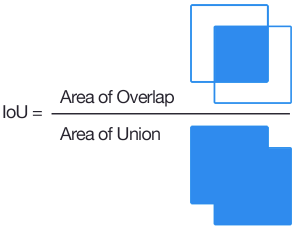

# 理解 YOLOv3 的训练输出日志信息  

最近有人问起在 YOLOv3 训练过程中输出在终端的不同的参数分别代表什么含义, 如何去理解这些参数？   

本文将尝试着去回答这个问题, 下边是我训练中使用的 .cfg 文件（你可以在cfg文件夹下找到它）：  

~~~conf
[net]
# Training
batch=64
subdivisions=8
height=416
width=416
channels=3
momentum=0.9
decay=0.0005
angle=0
saturation = 1.5
exposure = 1.5
hue=.1

learning_rate=0.001
burn_in=1000
max_batches = 80200
policy=steps
steps=40000,60000
scales=.1,.1
~~~

以下是训练过程中终端输出的一个截图：  

以上截图显示了所有训练图片的一个批次（batch）, 批次大小的划分根据我们在 .cfg 文件中设置的subdivisions 参数。在我使用的 .cfg 文件中 batch = 64 , subdivision = 8, 所以在训练输出中, 训练迭代包含了 8 组, 每组又包含了 8 张图片, 跟设定的 batch 和 subdivision 的值一致。  
 
（注： 也就是说每轮迭代会从所有训练集里随机抽取 batch = 64 个样本参与训练, 所有这些 batch 个样本又被均分为 subdivision = 8 次送入网络参与训练, 以减轻内存占用的压力）.   

## Batch 输出

针对上图中最后一行中的信息, 我们来一步一步的分析。如下的输出是由 detector.c 生成的, 具体代码见：[点击打开链接](https://github.com/pjreddie/darknet/blob/56d69e73aba37283ea7b9726b81afd2f79cd1134/examples/detector.c#L136).   

部分关键代码如下:  

~~~cpp
...
i = get_current_batch(net);

printf("%d: %f, %f avg, %f rate, %lf seconds, %d images\n", 
                        get_current_batch(net), loss, 
                        avg_loss, get_current_rate(net), 
                        sec(clock()-time), i*imgs);

if (avg_loss < 0) avg_loss = loss;
avg_loss = avg_loss*.9 + loss*.1;

i = get_current_batch(net);

printf("%ld: %f, %f avg, %f rate, %lf seconds, %d images\n", get_current_batch(net), loss, avg_loss, get_current_rate(net), what_time_is_it_now()-time, i*imgs);
...
~~~

9798： 指示当前训练的迭代次数   
0.370096： 是总体的 Loss(损失）   
0.451929 avg： 是平均 Loss, 这个数值应该越低越好, 一般来说, 一旦这个数值低于 `0.060730 avg` 就可以终止训练了。  
0.001000 rate： 代表当前的学习率, 是在.cfg文件中定义的。  
3.300000 seconds： 表示当前批次训练花费的总时间。  
627072 images： 这一行最后的这个数值是 9798*64 的大小, 表示到目前为止, 参与训练的图片的总量。   

以下输出是我在训练 VOC 时达到 283234 次迭代时候的输出:   

~~~
283234: 0.783273, 0.827796 avg, 0.000020 rate, 1.650999 seconds, 33988080 images
~~~

可以看到 28W 次的训练之后, Loss 和 Avg Loss 依然很高.  但是模型检测目标的准确率也已经很高了, 这就说明 Loss 和 Avg Loss 并不是判断模型好坏的指标.  

## Subdivision 输出

在分析 Subdivision 之前, 我们得了解一下 IOU（Intersection over Union, 也被称为交并集之比：[点击打开链接](https://en.wikipedia.org/wiki/Jaccard_index)）, 这样就能理解为什么 Subdivision 中的参数是一些重要且必须要输出的参数了.  

可以看到, IOU（交集比并集）是一个衡量我们的模型检测特定的目标好坏的重要指标。100% 表示我们拥有了一个完美的检测, 即我们的矩形框跟目标完美重合。很明显, 我们需要优化这个参数。  

回归正题, 我们来分析一下这些用来描述训练图集中的一个 Batch 的训练结果的输出。那些想自己深入源代码验证我所说的内容的同学注意了, 这段代码：[点击打开链接](https://github.com/pjreddie/darknet/blob/56d69e73aba37283ea7b9726b81afd2f79cd1134/src/region_layer.c#L306), 重要的部分摘录如下:　

~~~
*(l.cost) = pow(mag_array(l.delta, l.outputs * l.batch), 2);
printf("Region %d Avg IOU: %f, Class: %f, ＼　
        Obj: %f, No Obj: %f, 　＼
        .5R: %f, .75R: %f, count: %d\n", 
        net.index, avg_iou/count, avg_cat/class_count, 
        avg_obj/count, avg_anyobj/(l.w*l.h*l.n*l.batch), 
        recall/count, recall75/count, count);
~~~

但是此处有 `subdivisions * ngpus * 3` 条信息, 每组包含三条信息, 分别是：  

~~~bash
Region 82 Avg IOU: 0.759600, Class: 0.809470, Obj: 0.732717, No Obj: 0.002799, .5R: 1.000000, .75R: 0.500000,  count: 4
Region 94 Avg IOU: 0.699416, Class: 0.917663, Obj: 0.226457, No Obj: 0.000643, .5R: 1.000000, .75R: 0.333333,  count: 6
Region 106 Avg IOU: 0.667185, Class: 0.959919, Obj: 0.089371, No Obj: 0.000099, .5R: 1.000000, .75R: 0.000000,  count: 1
~~~

三个尺度(82, 94, 106)上预测不同大小的框.  

82 卷积层为最大的预测尺度, 使用较大的 mask, 但是可以预测出较小的物体;  
94 卷积层为中间的预测尺度, 使用中等的 mask;  
106卷积层为最小的预测尺度, 使用较小的 mask, 可以预测出较大的物体.  

上述输出信息的各个参数含义是:   

Region Avg IOU: 0.326577： 表示在当前 subdivision 内的图片的平均 IOU, 代表预测的矩形框和真实目标的交集与并集之比, 这里是32.66%, 这个模型需要进一步的训练.  
Class: 0.742537: 标注物体分类的正确率, 期望该值趋近于1。
Obj: 0.033966： 越接近 1 越好。
No Obj: 0.000793： 期望该值越来越小, 但不为零。   
Avg Recall: 0.12500： 是在 recall/count 中定义的, 是当前模型在所有 subdivision 图片中检测出的正样本与实际的正样本的比值。在本例中, 只有八分之一的正样本被正确的检测到。  
count: 8： 所有当前 subdivision 图片（本例中一共8张）中包含正样本的图片的数量。 在输出 log 中的其他行中, 可以看到其他subdivision 也有的只含有 6 或 7 个正样本, 说明在 subdivision 中含有不包含在检测对象 classes 中的图片。  

## 总结 

在这篇短文里, 我们回顾了一下 YOLOv3 在终端输出的不同的参数的含义, 这些参数也在告诉我们 YOLOv3 的训练过程是怎样进行的。这个能在一定程度上解答大家关于 YOLOv3 的训练输出的大部分问题, 但请记住,  对 YOLOv3 的探索决不应该到此为止。  

## 参考资料  

[1] : https://blog.csdn.net/dcrmg/article/details/78565440  
[2] : https://timebutt.github.io/static/understanding-YOLOv3-training-output/  
