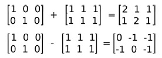
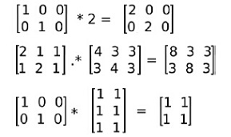

# OpenCV 基础   

[TOC]

## 1. OpenCV 数据结构及其对应的基本方法    

OpenCV 使用的基本数据结构是 Mat(或者是Mat_). 

### 1.1 Mat 数据结构   

对于一个彩色图像, 图像数据缓存区中的前三个字节对应图像左上角像素的三个通道值, 接下来三个字节对应第一行的第二个像素, 依此类推.   

OpenCV 默认使用的是 BGR 顺序, 即第一个通道通常是蓝色.       

一个宽为 W, 高为 H 的图像需要一个大小由  W x H x 3 个 uchar 构成的内存块. 但是为了便于某些 CPU 的高效处理, 一般会对图像的 ``行`` 进行填补. 图像的真实宽度就是未填补之前的宽度.   

成员变量 cols 代表图像的宽度, rows 代表图像的高度.    

成员变量 step 以字节为单位的图像的有效宽度. 即使你的图像元素类型不是 uchar, step 仍然代表着行的字节数. 像素的大小可以使用 elemSize() 方法得到.   

|数据类型编码 |描述|
|:---|:----|   
|CV_8UC1    |   8位无符号单通道  |
|CV_8UC3    |   8位无符号3通道  |
|CV_8UC4    |   8位无符号4通道|
|CV_32FC1   |   32位浮点型单通道  |
|CV_32FC3   |    32位浮点型3通道  |
|CV_32FC4   |    32位浮点型4通道|

其中每个字符的含义: 数字代表`位深度8位、32位`，数据类型`U:uchar、F:float`型以及通道数`C1：单通道、C3：三通道、C4：四通道`。        

### 1.2 创建 Mat 的基本方法   

最好提前给 Mat 分配好存储空间.    

```cpp
// 不初始化矩阵数据，因此将出现随机值
cv::Mat a(cv::Size(5,5),CV_8UC1);           // 单通道  
a.setTo(Scalar(0));
cv::Mat b = cv::Mat(cv::Size(5,5),CV_8UC3); // 3 通道,每个矩阵元素包含3个变量    
b.setTo(Scalar(1, 1, 1));
cv::Mat c;

// 默认初始化方法
cv::Mat mz = cv::Mat::zeros(cv::Size(5,5),CV_8UC1); // 全零矩阵  
cv::Mat mo = cv::Mat::ones(cv::Size(5,5),CV_8UC1);  // 全1矩阵  
cv::Mat me = cv::Mat::eye(cv::Size(5,5),CV_32FC1);  // 对角线为1的对角矩阵  
```

### 1.3 Mat 成员方法

|成员方法|功能|
|:----|:----|
|channels()        |通道数|
|type()            |图像矩阵的像素值数据类型|
|row(i) 和 col(j)  |返回某一行的矩阵|  
|size()            |返回图像的长和宽|
|elemSize()|返回每个图像像素值占的字节数|
|total()|所有像素元素的个数|
|create() |创建一个 Mat|
|clone() |硬拷贝|
|ptr(j) |返回图像的第 j 行首指针|
|at(int, int)|访问一个像素点的值|
|isContinuous()  |图像像素是否存在填补|
|copyTo()|拷贝赋值|
|setTo()|像素值初始化|

#### channels()    
返回图像的通道数.   

#### type()    
返回图像元素的类型.    

#### row(i) 和 col(j)      
返回第 i 行(或列) 的矩阵数据. 返回值类型为 Mat.   

#### size()   
返回图像的尺寸，长和宽, 对应的成员分别为 cols 和 rows.   

#### elemSize()  
返回像素所占字节的个数. 例如对于一个 3 通道的 short 型矩阵(CV16SC3), 像素所占字节的个数为 6.    

#### total()   
返回图像矩阵的像素个数.   

#### create()   
根据图像属性创建 Mat. 创建的图像内存是连续的, 并且不会对图像的行进行填补. 即分配的内存大小为 total() * elemSize().      
```cpp
void create(int rows, int cols, int type);   // 
void create(Size size, int type);
void create(int ndims, const int* sizes, int type);
```   
#### clone()     
图片数据硬拷贝. Mat 对象在赋值操作的时候执行的是浅拷贝, 即共用一片内存空间.       

#### ptr(j)    
返回图像任意行的首地址, ptr() 是一个模板函数. 可以使用这个指针遍历所在行的列元素.      
```cpp
uchar * data = image.ptr<uchar>(j);
*data++ = 0;   // 范围 j 行的第一个元素
```

#### at(int, int)    
获取矩阵中的一个值.    
```cpp
// 单通道像素点；
image.at<uchar>(j, i); 

// 三通道像素点；
image.at<cv::Vec3b>(j, i)[0];
image.at<cv::Vec3b>(j, i)[1]; 
image.at<cv::Vec3b>(j, i)[2]; 
```

#### isContinuous()   
判断图像是否进行了填补, 返回值为 bool 类型. **在一些图像处理算法中, 我们可以利用图像的连续性, 把真个处理过程使用一个循环完成**.   
```cpp
if(image.isContinuous()) {
    image.reshape(1,             // 通道数
        image.cols*image.rows);  // 行数
}

int n_cols = image.rows;    // 列数
int n_rows = image.cols*image.channels();
```

#### copyTo()    
拷贝像素值, 常用于 ROI 操作.   
```cpp
// m – 输出矩阵. mask – 矩阵中的非零元素代表要拷贝的像素值.
void Mat::copyTo(OutputArray m, InputArray mask) const
```

#### setTo()     
为矩阵元素设置像素值, 常用于初始化或边界像素操作.   


## 2. 操作像素   

这里使用的都是一些基本的方法。   

### 2.1 操作像素的方法

#### 2.1.1 指针遍历   


#### 2.1.2 迭代器

```cpp
/// 使用 Mat 类型的实例
Mat image;
MatIterator_<uchar> it;     // 单通道
MatIterator_<Vec3b> it_3b;  // 3 通道
MatConstIterator_<uchar> it;     // 常量迭代器

// 或者使用定义在 Mat_ 内部的迭代器, 但是其 begin() 和 end() 方法也要使用模板化版本  
Mat_<uchar>::iterator _it;
Mat_<Vec3b>::iterator _it_3b = image.begin<Vec3b>(); 
Mat_<uchar>::const_iterator _it;


/// 使用 Mat_ 类型的实例   
Mat_<Vec3b> image;
Mat_<Vec3b>::iterator _it_3b_ = image.begin(); 

```
#### 2.1.3 图像处理中对像素值的处理        

对于运算后的像素值取值, 应该限定在 0 ~ 255 之间, 使用 `cv::saturate_cast<uchar>(value)` 函数.   

对于边界像素的处理, 一般都是直接置零. 可以使用 `result.row(0).setTo(cv::Scalar(0))`. 如果是三通道的彩色图像, 应该使用 cv::Scalar(0, 0, 0) 来指定.    

## 3. 高级操作

Mat.data 表示的是矩阵的首地址；   

### 3.1 简单的图像算术-融合两张图片    
```cpp
// 实现的运算为 dst = src1 * alpha + src2 * beta + gamma;
void addWeighted(InputArray src1, double alpha, InputArray src2, double beta, double gamma, OutputArray dst, int dtype=-1)

// 实现的运算为 dst = src1 + src2 & mask;
void add(InputArray src1, InputArray src2, OutputArray dst, InputArray mask=noArray(), int dtype=-1)

// 实现的运算为 dst = src1 * alpha + src2;
void scaleAdd(InputArray src1, double alpha, InputArray src2, OutputArray dst)
```

### OpenCV 支持的图像操作符    

被重载了的运算符:    
 
```cpp
// 四则运算 + - * /   
cv::substract()
cv::absdiff()
cv::multiply()
cv::divide()

// bit:  & | ^ ~
cv::bitwise_and()
cv::bitwise_or()
cv::bitwise_xor()
cv::bitwise_not()

// < <= == != > >=
cv::min()
cv::max()

cv::saturate_cast<>()

cv::sqrt()
cv::pow()
cv::abs()
cv::cuberoot()
cv::exp()
cv::log()

// 
inv()       // 逆
t()         //转置
determinant()// 行列式
norm()      // 模
cross()     // 叉乘
dot()       // 点乘

//
=
+=
```

### 3.2 图像通道的分离和合并   
`split()`将图像中的3个通道分离为单通道矩阵，并保存在一个`vector`中；这样就可以直接操作图像的某一个通道了，一般选用vector<Mat>().at(n)访问对应的通道数据。   

将3个单通道矩阵合并为一张图片；   
```cpp
void split(const Mat& m, vector<Mat>& mv );
void merge(const vector<Mat>& mv, OutputArray dst );
...
cv::split(image1, planes);
cv::merge(planes, result)；
```

### 3.3 图像 ROI    

```cpp
Rect_(_Tp _x, _Tp _y, _Tp _width, _Tp _height);
void copyTo( OutputArray m, InputArray mask );
...
cv::Mat imageROI = image(cv::Rect(385, 270, logo.cols, logo.rows));  // 获取图片中的某一区域
cv::addWeighted(imageROI, 1.0, logo, 0.3, 0., imageROI); // 对该区域进行处理
logo.copyTo(imageROI, mask);  // 将logo图像矩阵拷贝到imageROI；
...
imageROI = channels.at(1);  // 获取第二通道(G通道)对应的图像数据；
```

imageROI 返回值是指向原图的 ROI 区域的指针(即 ROI 和原图共享数据缓存区)，因此所有的改变会体现在原图中相应的区域。
Rect_()是模板类，参数为矩形框左上角的坐标和矩形框的长和宽。

4. 比较几种遍历图像方法的效率
获取当前系统的运行时间：
`cv::getTickCount()`可以获取系统当前`tick`的个数；
`cv::getTickFrequency()`可以获取一个`tick`的频率，即一秒包含几个`tick`；
因此计算程序运行时间(单位为ms)的代码为：
```cpp
double exec_time = (double)getTickCount();
// do something ...
exec_time = ((double)getTickCount() - exec_time)*1000./getTickFrequency();
```

5. 获取像素的前后左右行
 限制像素值在[0,255]之间，`cv::saturate_cast<uchar>()`;
 将图像看成是一个宽度x高度的矩阵，那么可以有以下3种方式来获取当前行：
 <1>Mat.ptr()，

3. 矩阵运算   
`OpenCV`的`Mat`类允许所有的矩阵运算。   
3.1 矩阵加减法   
```cpp 
cv::Mat a= Mat::eye(Size(3,2), CV_32F);  
cv::Mat b= Mat::ones(Size(3,2), CV_32F);  
cv::Mat c= a+b;  
cv::Mat d= a-b;
```
   

3.2 矩阵乘法   
使用"*"号计算矩阵与标量相乘(矩阵元素值缩放)，矩阵与矩阵相乘（必须满足矩阵相乘的行列数对应规则）。     
```cpp
Mat m1= Mat::eye(2,3, CV_32F);            // 使用cv命名空间可省略cv::前缀，下同  
Mat m2= Mat::ones(3,2, CV_32F);  

// Scalar by matrix  
cout << "\nm1.*2 = \n" << m1*2 << endl;   // scale

// matrix per element multiplication  
cout << "\n(m1+2).*(m1+3) = \n" << (m1+1).mul(m1+3) << endl;   // .mul()方法

// Matrix multiplication  
cout << "\nm1*m2 = \n" << m1*m2 << endl;  
```
    

3.3 矩阵转置       
矩阵转置是将矩阵的行与列顺序对调（第i行转变为第i列）形成一个新的矩阵。`OpenCV`通过`Mat`类的`t()函数`实现。    
```cpp
// 转置  
Mat m1= Mat::eye(2,3, CV_32F);    
Mat m1t = m1.t();  
```
3.4 求逆矩阵    
逆矩阵在某些算法中经常出现，在`OpenCV`中通过`Mat`类的`inv()`方法实现。   
```cpp
// 求逆  
Mat meInv = me.inv();  
```
3.5 计算矩阵非零元素个数     
计算物体的像素或面积常需要用到计算矩阵中的非零元素个数，`OpenCV`中使用`countNonZero()`函数实现。    
```cpp
// 统计非零元素个数  
int nonZerosNum = countNonZero(me); // me为输入矩阵或图像  
```
3.6 均值和标准差     
`OpenCV`提供了矩阵均值和标准差计算功能，可以使用`meanStdDev(src,mean,stddev)`函数实现。以下是参数说明：    
```
src – 输入矩阵或图像
mean – 均值，OutputArray
stddev – 标准差，OutputArray
```
```cpp
// 均值方差  
Mat mean;  
Mat stddev;  
meanStdDev(me, mean, stddev); 
``` 
需要说明的是，如果`src`是多通道图像或多维矩阵，则函数分别计算不同通道的均值与标准差，因此返回值`mean`和`stddev`为对应维度的向量。        
3.7 求最大最小值     
求输入矩阵的全局最大最小值及其位置，可使用函数：   
```cpp
void minMaxLoc(InputArray src, CV_OUT double* minVal,  
                           CV_OUT double* maxVal=0, CV_OUT Point* minLoc=0,  
                           CV_OUT Point* maxLoc=0, InputArray mask=noArray());  
参数：
src – 输入单通道矩阵（图像）.
minVal – 指向最小值的指针， 如果未指定则使用NULL
maxVal – 指向最大值的指针， 如果未指定则使用NULL
minLoc – 指向最小值位置（2维情况）的指针， 如果未指定则使用NULL
maxLoc – 指向最大值位置（2维情况）的指针， 如果未指定则使用NULL
mask – 可选的蒙版，用于选择待处理子区域
```


1. 读取图片到一个矩阵中；
```cpp
Mat imread(const string& filename, int flags=1)
...
cv::Mat image = cv::imread("boldt.jpg", 0);
```
imread()返回的是保存图片的像素矩阵`Mat`。其中第二个参数为0表示返回的是灰度图，>1返回的是3-通道图片。
2. 在一个图像框中显示图片，可以对这个图形框命名；
```cpp
cv::imshow("Image", image);
```
3. 将像素矩阵保存为图片，保存的图片名和格式可以指定；
```cpp
cv::imwrite("salted.bmp", image);
```
4. 等待用户输入;
```cpp
cv::waitKey(5000);
```
5. cv::Mat常用属性
```cpp
cv::Mat image；
image.cols;
image.rows;
image.channels();
image.at<uchar>(j, i); // 单通道像素点；
image.at<cv::Vec3b>(j, i)[0] // 三通道像素点；
```


