# 豆瓣书单  

## 名著  

1) 红楼梦: 9.6  

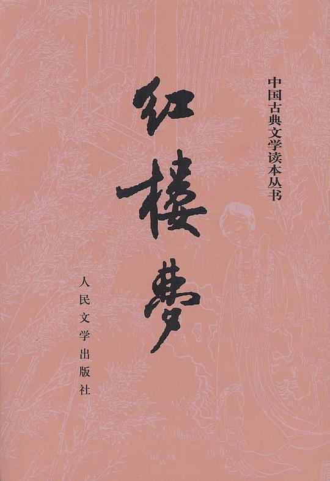  

**内容简介**:  

《红楼梦》是一部百科全书式的长篇小说。以宝黛爱情悲剧为主线，以四大家族的荣辱兴衰为背景，描绘出18世纪中国封建社会的方方面面，以及封建专制下新兴资本主义民主思想的萌动。结构宏大、情节委婉、细节精致，人物形象栩栩如生，声口毕现，堪称中国古代小说中的经 典。
由红楼梦研究所校注、人民文学出版社出版的《红楼梦》以庚辰（1760）本《脂砚斋重评石头记》为底本，以甲戌（1754）本、已卯（1759）本、蒙古王府本、戚蓼生序本、舒元炜序本、郑振铎藏本、红楼梦稿本、列宁格勒藏本（俄藏本）、程甲本、程乙本等众多版本为参校本，是一个博采众长、非常适合大众阅读的本子；同时，对底本的重要修改，皆出校记，读者可因以了解《红楼梦》的不同版本状况。
红学所的校注本已印行二十五年，其间1994年曾做过一次修订，又十几年过去，2008年推出修订第三版，体现了新的校注成果和科研成果。
关于《红楼梦》的作者，原本就有多种说法及推想，“前八十回曹雪芹著、后四十回高鹗续”的说法只是其中之一，这次修订中校注者改为“前八十回曹雪芹著；后四十回无名氏续，程伟元、高鹗整理”，应当是一种更科学的表述，体现了校注者对这一问题的新的认识。
现在这个修订后的《红楼梦》是更加完善。

**作者简介**:  

曹雪芹,（？-1763，一作1764）清小说家。名霑，字梦阮，号雪芹、芹圃、芹溪。为满洲正白旗“包衣”人。自曾祖起，三代任江宁织造，其祖曹寅尤为康熙帝所信用。雍正初年，在统计阶级内部政治斗争牵连下，雪芹家受到重大打击，其父免职，产业被抄，遂随家迁居北京。他早年经历了一段封建大官僚地主家庭的繁华生活，后因家道衰落，趋于艰困。晚期居北京西郊，贫病而卒，年未及五十。性情高傲，嗜酒健谈。具有深厚的文化修养和卓越的艺术才能。他生活在我国已有资本主义生产萌芽的封建末世，在其后期又有机会接触到下层人民，因而对当时社会阶级斗争和思想斗争有较具体的感受，看到了统治阶级的腐朽凶残和内部的分崩离析。曾以十年时间，从事《石头记》（即《红楼梦》）的创作。书中通过一个贵族官僚大家庭的盛衰历史的描写，塑造了许多典型人物形象，对当时社会的黑暗腐败，进行了深刻的解剖和批判，并热情地歌颂了具有异端思想的男女青年，成为我国古典小说中伟大的现实主义作品。但其中也反映了作者为封建制度“补天”的幻想和找不到出路的悲观情绪。据称先后曾增删五次，但未成全书而卒；今流行本一百二十回，后四十回一般认为是高鹗所续。也能诗，又善画石，但作品流传绝少。

2) 月亮和六便士: 9.0  

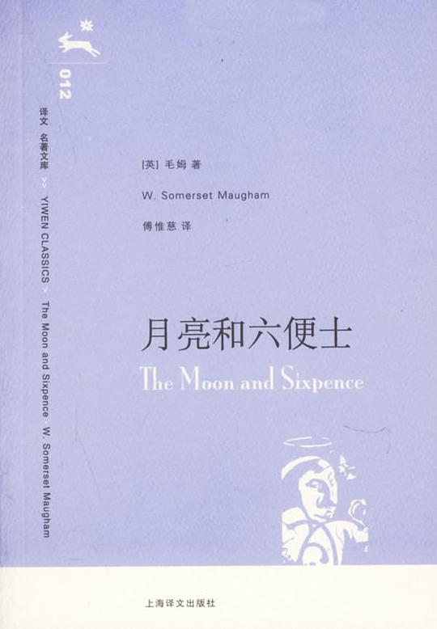  

**内容简介**:  

一个英国证券交易所的经纪人，本已有牢靠的职业和地位、美满的家庭，但却迷恋上绘画，像“被魔鬼附了体”，突然弃家出走，到巴黎去追求绘画的理想。他的行径没有人能够理解。他在异国不仅肉体受着贫穷和饥饿煎熬，而且为了寻找表现手法，精神亦在忍受痛苦折磨。经过一番离奇的遭遇后，主人公最后离开文明世界，远遁到与世隔绝的塔希提岛上。他终于找到灵魂的宁静和适合自己艺术气质的氛围。他同一个土著女子同居，创作出一幅又一幅使后世震惊的杰作。在他染上麻风病双目失明之前，曾在自己住房四壁画了一幅表现伊甸园的伟大作品。但在逝世之前，他却命令土著女子在他死后把这幅画作付之一炬。通过这样一个一心追求艺术、不通人性世故的怪才，毛姆探索了艺术的产生与本质、个性与天才的关系、艺术家与社会的矛盾等等引人深思的问题。同时这本书也引发了人们对摆脱世俗束缚逃离世俗社会寻找心灵家园这一话题的思考，而关于南太平洋小岛的自然民风的描写也引人向往。
《月亮和六便士》说问世后，以情节入胜、文字深刻在文坛轰动一时，人们争相传看。在小说中，毛姆用第一人称的叙述手法，借“我”之口，叙述整个故事，有人认为这篇小说的原型是法国印象派画家高更，这更增加了它的传奇色彩，受到了全世界读者的关注。

**作者简介**:  

威廉·萨默赛特·毛姆（William Somerset Maugham）于1874年1月25日出生在巴黎。父亲是律师，当时在英国驻法使馆供职。小毛姆不满十岁，父母就先后去世，他被送回英国由伯父抚养。毛姆进坎特伯雷皇家公学之后，由于身材矮小，且严重口吃，经常受到大孩子的欺凌和折磨，有时还遭到冬烘学究的无端羞辱。孤寂凄清的童年生活，在他稚嫩的心灵上投下了痛苦的阴影，养成他孤僻、敏感、内向的性格。幼年的经历对他的世界观和文学创作产生了深刻的影响。
1892年初，他去德国海德堡大学学习了一年。在那儿，他接触到德国哲学史家昆诺·费希尔的哲学思想和以易卜生为代表的新戏剧潮流。同年返回英国，在伦敦一家会计师事务所当了六个星期的练习生，随后即进伦敦圣托马斯医学院学医。为期五年的习医生涯，不仅使他有机会了解到底层人民的生活状况，而且使他学会用解剖刀一样冷峻、犀利的目光来剖视人生和社会。他的第一部小说《兰贝斯的丽莎》，正是根据他从医实习期间的所见所闻写成的。
从1897年起，毛姆弃医专事文学创作。在接下来的几年里，他写了若干部小说，但是，用毛姆自己的话来说，其中没有一部能够“使泰晤士河起火“。他转向戏剧创作，获得成功，成了红极一时的剧作家，伦敦舞台竟同时上演他的四个剧本。他的第十个剧本《弗雷德里克夫人》连续上演达一年之久。这种空前的盛况，据说只有著名剧作家肖伯纳才能与之比肩。但是辛酸的往事，梦魇似地郁积在他心头，不让他有片刻的安宁，越来越强烈地要求他去表现，去创作。他决定暂时中断戏剧创作，用两年时间潜心写作酝酿已久的小说《人生的枷锁》。
第一次大战期间，毛姆先在比利时火线救护伤员，后入英国情报部门工作，到过瑞士、俄国和远东等地。这段经历为他后来写作间谍小说《埃申登》提供了素材。战后他重游远东和南太平洋诸岛；1920年到过中国，写了一卷《中国见闻录》。1928年毛姆定居在地中海之滨的里维埃拉，直至1940年纳粹入侵时，才仓促离去。
两次大战的间隙期间，是毛姆创作精力最旺盛的时期。二十年代及三十年代初期，他写了一系列揭露上流社会尔虞我诈、勾心斗角、道德堕落、讽刺，如《周而复始》、《比我们高贵的人们》和《坚贞的妻子》等。这三个剧本被公认为毛姆剧作中的佳品。1933年完稿的《谢佩》是他的最后一个剧本。毛姆的戏剧作品，情节紧凑而曲折，冲突激烈而合乎情理；所写人物，着墨不多而形象鲜明突出；对话生动自然，幽默俏皮，使人感到清新有力。但总的来说，内容和人物刻画的深度，及不上他的长、短篇小说，虽然他的小说作品也算不上深刻。这一时期的重要小说有：反映现代西方文明束缚、扼杀艺术家个性及创作的《月亮和六便士》；刻画当时文坛上可笑可鄙的现象的《寻欢作乐》；以及以大英帝国东方殖民地为背景、充满异国情调的短篇集《叶之震颤》等。短篇小说在毛姆的创作活动中占有重要位置。他的短篇小说风格接近莫泊桑，结构严谨，起承转落自然，语言简洁，叙述娓娓动听。作家竭力避免在作品中发表议论，而是通过巧妙的艺术处理，让人物在情节展开过程中显示其内在的性格。
第二次大战期间，毛姆到了美国，在南卡罗莱纳、纽约和文亚德岛等地呆了六年。1944年发表长篇小说《刀锋》。在这部作品里，作家试图通过一个青年人探求人生哲理的故事，揭示精神与实利主义之间的矛盾冲突。小说出版后，反响强烈，特别受到当时置身于战火的英、美现役军人的欢迎。
1946年，毛姆回到法国里维埃拉。1948年写最后一部小说《卡塔丽娜》。此后，仅限于写作回忆录和文艺评论，同时对自己的旧作进行整理。毛姆晚年享有很高的声誉，英国牛津大学和法国图鲁兹大学分别授予他颇为显赫的“荣誉团骑士“称号。同年1月25日，英国著名的嘉里克文学俱乐部特地设宴庆贺他的八十寿辰；在英国文学史上受到这种礼遇的，只有狄更斯、萨克雷、特罗洛普三位作家。1961年，他的母校，德国海德堡大学，授予他名誉校董称号。
1965年12月15日，毛姆在法国里维埃拉去世，享年91岁。骨灰安葬在坎特伯雷皇家公学内。死后，美国著名的耶鲁大学建立了档案馆以资纪念。

3) 飘: 9.3  

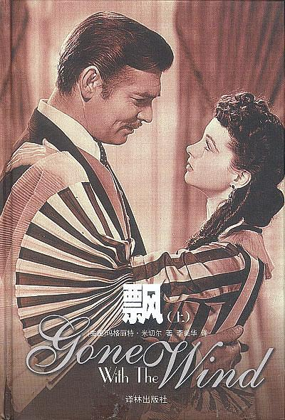  

**内容简介**:  

小说中的故事发生在1861年美国南北战争前夕。生活在南方的少女郝思嘉从小深受南方文化传统的熏陶，可在她的血液里却流淌着野性的叛逆因素。随着战火的蔓廷和生活环境的恶化，郝思嘉的叛逆个性越来越丰满，越鲜明，在一系列的的挫折中她改造了自我，改变了个人甚至整个家族的命运，成为时代时势造就的新女性的形象。
作品在描绘人物生活与爱情的同时，勾勒出南北双方在政治，经济，文化各个层次的异同，具有浓厚的史诗风格，堪称美国历史转折时期的真实写照，同时也成为历久不衰的爱情经典。

**作者简介**:  

4) 百年孤独: 9.2  

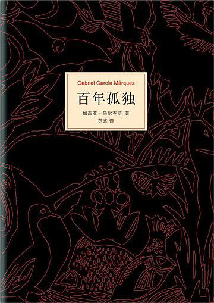  

**内容简介**:  

《百年孤独》是魔幻现实主义文学的代表作，描写了布恩迪亚家族七代人的传奇故事，以及加勒比海沿岸小镇马孔多的百年兴衰，反映了拉丁美洲一个世纪以来风云变幻的历史。作品融入神话传说、民间故事、宗教典故等神秘因素，巧妙地糅合了现实与虚幻，展现出一个瑰丽的想象世界，成为20世纪最重要的经典文学巨著之一。1982年加西亚•马尔克斯获得诺贝尔文学奖，奠定世界级文学大师的地位，很大程度上乃是凭借《百年孤独》的巨大影响。

**作者简介**:  

5) 基督山伯爵: 9.0  

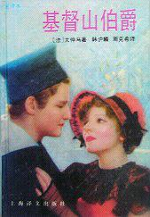  

**内容简介**:  

小说以法国波旁王朝和七月王朝两大时期为背景，描写了一个报恩复仇的故事。法老号大副唐泰斯受船长的临终嘱托，为拿破仑送了一封信，受到两个对他嫉妒的小人的陷害，被打入死牢，狱友法里亚神甫向他传授了各种知识，还在临终前把一批宝藏的秘密告诉了他。他设法越狱后找到了宝藏，成为巨富。从此他化名为基督山伯爵，经过精心策划，报答了他的恩人，惩罚了三个一心想置他于死地的仇人。

**作者简介**:  

法国19世纪积极浪漫主义作家。其祖父是候爵德·拉·巴那特里，与黑奴结合生下其父，名亚历山大，受洗时用母姓仲马。法国大革命爆发后，亚历山大·仲马屡建奇功，当上共和政府将军。大仲马终生信守共和政见，一贯反对君主专政，憎恨复辟王朝，不满七月王朝，反对第二帝国。他饱尝种族歧视，心中受到创伤。家庭出身和经历使大仲马形成了反对不平、追求正义的叛逆性格。大仲马自学成才，一生写的各种类型作品达300卷之多，主要以小说和剧作著称于世。大仲马的剧本《享利第三及其宫廷》（1829）比雨果的《欧那尼》还早问世一年。这出浪漫主义戏剧，完全破除了古典主义“三一律”。大仲马小说多达百部，大都以真实的历史作背景，以主人公的奇遇为内容，情节曲折生动，处处出人意外，堪称历史惊险小说。异乎寻常的理想英雄，急剧发展的故事情节，紧张的打斗动作，清晰明朗的完整结构，生动有力的语言，灵活机智的对话等构成了大仲马小说的特色。最著名的是《三个火枪手》旧译《三剑客》，（1844）、《基督山伯爵》。大仲马被别林斯基称为“一名天才的小说家”，他也是马克思 “最喜欢”的作家之一。

6) 三国演义（全二册）: 9.2  

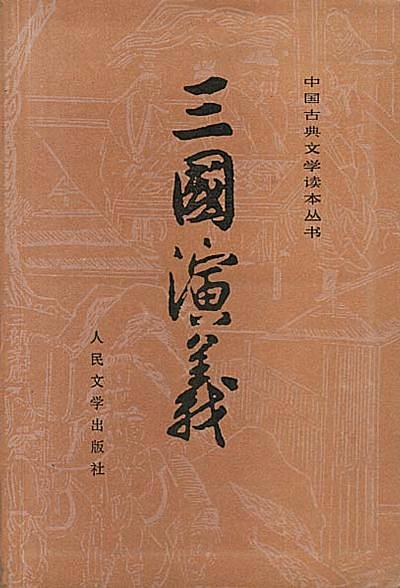  

**内容简介**:  

《三国演义》又名《三国志演义》、《三国志通俗演义》，是我国小说史上最著名最杰出的长篇章回体历史小说。 《三国演义》的作者是元末明初人罗贯中，由毛纶，毛宗岗父子批改。在其成书前，“三国故事”已经历了数百年的历史发展过程。在唐代，三国故事已广为流传，连儿童都很熟悉。随着市民文艺的发展，宋代的“说话”艺人，已有专门说三国故事的，当时称为“说三分”。元代出现的《三国志平话》，实际上是从说书人使用的本子，虽较简略粗糙，但已初肯《三国演义》的规模。罗贯中在群众传说和民间艺人创作的基础上，又依据陈寿《三国志》及裴松之注中所征引的资料（还包括《世说新语》及注中的资料），经过巨大的创作劳动，写在了规模宏伟的巨著——《三国志通俗演义》全书24卷，240回。后来经过毛纶，毛宗岗父子批改，形成我们现在所见的《三国演义》120回版

    由于人文出版社选取的毛批版本和明嘉靖版的《三国志通俗演义》颇有出入，将拥刘抑曹的思想发展到一个几乎病态的角度，且大量地删除了原文中赞扬曹操一方人物的诗词和评论，所以给世人造成一种三国演义打击曹操、歌颂刘备的错误印象，且该批改版将刘备一方无限神化，甚至将诸葛亮准备将魏延烧死在上方谷这样的情节统统删除，将诸葛说成是一个完美近乎神人的形象，这是大家阅读时候值得注意的地方。

    由于该版本选用的是毛批改版，而且没有将毛家父子的批语选入，就会给人造成一种错觉，认为该版本和毛批本是不相同的，其实本书和毛批本完全一致，不过是删除了批语部分，加入了编者的注脚。请读者朋友们阅读时注意

**作者简介**:  

7) 四世同堂: 9.3  

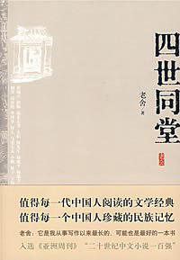  

**内容简介**:  

值得每一代中国人阅读的文学经典，值得每一个中国人珍藏的民族记忆。老舍：它是我从事写作以来最长的、可能也是最好的一本书。入选《亚洲周刊》“二十世纪中文小说一百强”。
这是一部中国现代长篇小说经典名著，是老舍先生的代表作之一。
小说在卢沟桥事变爆发、北平沦陷的时代背景下，以祁家四世同堂的生活为主线，形象、真切地描绘了以小羊圈胡同住户为代表的各个阶层、各色人等的荣辱浮沉、生死存亡。作品记叙了北平沦陷后的畸形世态中，日寇铁蹄下广大平民的悲惨遭遇，那一派古老、宁静生活被打破后的不安、惶惑与震撼，鞭挞了附敌作恶者的丑恶灵魂，揭露了日本军国主义的残暴罪行，更反映出百姓们面对强敌愤而反抗的英勇无畏，讴歌、弘扬了中国人民伟大的爱国主义精神和坚贞高尚的民族气节，史诗般地展现了第二次世界大战期间，中国人民为世界反法西斯战争做出的杰出贡献，气度恢弘，可歌可泣。
老舍先生以深厚精湛的艺术功力和炉火纯青的小说技艺刻画了祁老人、瑞宣、大赤包、冠晓荷等一系列栩栩如生的艺术形象，展现了风味浓郁的北平生活画卷，至今传读不衰，历久弥新……

**作者简介**:  

8) 刀锋: 9.0  

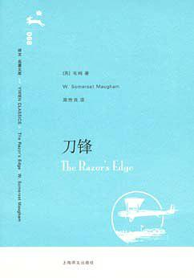  

**内容简介**:  

威廉·萨默塞特·毛姆（1874-1965），英国著名小说家、戏剧家。《刀锋》是他的主要作品之一。
小说写一个参加第一次世界大战的美国青年飞行员拉里·达雷尔。在军队里，拉里结识了一个爱尔兰好友：这人平时是那样一个生龙活虎般的置生死于度外的飞行员，但在一次遭遇战中，因趋救拉里而中弹牺牲。拉里因此对人生感到迷惘，弄不懂世界上为什么有恶和不幸，拉里开始了他令人匪夷所思的转变……

**作者简介**:  

威廉·萨默赛特·毛姆（William Somerset Maugham）（1874-1965），英国著名小说家、戏剧家。
毛姆作品列表
一．选集
《毛姆作品选》
弗雷德里克·T·贝森编（1931）
《威廉·萨姆塞特·毛姆作品选》
本书包括毛姆的全部作品和他发表在一些杂志上的文章，并附有这些刊物对此所作的介绍和注释。由雷蒙德·图尔·斯托特编（1950）
《威廉·萨姆塞特·毛姆作品选》
K．W．乔纳斯编，美国新泽西州新布伦思维克，卢特格斯大学出版。（1950）
二．全集
《毛姆戏剧集》6卷本（1931—1934）
《毛姆全集》20卷本（1934—1950）
《毛姆全集》袖珍版 14卷本（1936—1938）
《短篇小说全集》3卷本（1951年）
三．单行本
《兰姆贝思的丽莎》(Liza of Lambeth)（1897年）长篇小说
《一个圣徒发迹的奥秘》(The making of a saint)（1898年）长篇小说
《东向礼拜》(Orientations)（1899年）短篇小说集
《英雄》(The hero)（1901年）长篇小说
《克雷杜克夫人》(Mrs. Craddock)（1902年）长篇小说
《一个体面的男人》四幕话剧（1903年）
《旋转木马》(The merry-go-round)（1904年）长篇小说
《圣洁的天国：安大路西亚见闻和印象》（1905年）游记
《主教的围巾：一个大家庭的来龙去脉》（1906年）长篇小说
《调情》(Flirtation)（1906年）短篇小说
《探索者》(The explorer)（1908年）长篇小说
《魔术师》(The magician)（1908年）长篇小说
《弗雷德里克夫人》三幕喜剧（1912年）
《杰克·斯特洛》（1912年）戏剧
《朵特夫人》（1912年）戏剧
《珀涅罗珀》（1912年）戏剧
《探索者》（1912年）戏剧
《第十个人》（1913年）戏剧
《跻身上流社会的人们》（1913年）戏剧
《史密斯》（1913年）戏剧
《可指望的土地》四幕喜剧（1913年）
《人生的枷锁》（1915年）长篇小说
《月亮和六便士》（1919年）长篇小说
《陌生人》（1920年）戏剧
《一片树叶的颤动》（1921年）
《周而复始》三幕喜剧（1921年）
《凯撒之妻》（1922年）戏剧
《中国剪影》（1922年）游记
《苏伊士之东》（1922年）戏剧
《比我们高贵的人们》（1923年）三幕喜剧
《家庭和美人》三幕滑稽剧（1923年）
《不可企求的人》三幕滑稽剧（1923年）
《私利》四幕喜剧（1924年）
《彩巾》(The painted veil)（1925年）长篇小说
《短篇小说六篇》（1926年）
《信》三幕剧（1927年）戏剧
《忠实的妻子》三幕喜剧（1927年）
《圣火》三幕剧（1928年）
《阿申登故事集》或《一个英国间谍》（1928年）短篇小说集
《客厅里的绅士：从仰光到海防旅途纪实》（1930年）游记
《寻欢作乐》(Cakes and ale) or (The skeleton in thd cupboard)（1930年）长篇小说
《养家活口的人》一幕喜剧（1930年）
《第一人称短篇小说六篇》（1931年）
《因为效了劳》三幕剧（1932年）戏剧
《书包》（1932年）短篇小说
《偏僻的角落》（1932年）长篇小说
《谢佩》三幕剧（1933年）戏剧
《啊，国王》短篇小说六篇 （1933年）
《法庭》（1934年）短篇小说
《堂·弗尔南多：西班牙主旋律变奏曲》（1935年）游记
《四海为家的人们》微型短篇小说（1936年）
《我的南太平洋诸岛》芝加哥出版（1936年）随笔
《戏院》(Theatre)（1937年）长篇小说
《总结》(The summing up)（1938年）自传
《圣诞节》(Christmas holiday)（1939年）长篇小说
《喜剧六种》纽约出版（1939年）
《九月公主和夜莺》多伦多出版（1939年）短篇小说
《书与你》（1940年）随笔
《战争中的法国》（1940年）随笔
《象从前那样的杂拌》（1940年）短篇小说集
《一打短篇》(The round dozen)（1940年）短篇小说集
《别墅里红运高照之人》(Up at the villa)（1941年）长篇小说
《纯属私事》(Strictly personal) 纽约版（1941年）伦敦版（1942年）自传
《黎明前的时分》(The hour before the dawn)（1942年）长篇小说
《不可征服的人》(The unconquered) 或 (Creatures of Circumstance) 纽约出版（1944年）短篇小说
《刀锋》(The razor’s edge)（1944年）长篇小说
《时常》(Then and now)（1946年）长篇小说
《环境的产物》（1947年）短篇小说集
《卡塔琳娜—— 一段罗曼史》(Catalina.A Romance)（1948年）长篇小说
《这里和那里》（1948年）短篇小说集
《四部曲》（1948年）R.C.雪弗雷根据毛姆的原著改编的电影剧本
《一个作家的札记》（1949年）文艺理伦
《三部曲》——《教堂司事》，《娄威尔先生》，《疗养院》(1950)

9) 安徒生童话故事集: 9.2  

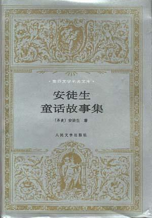  

**内容简介**:  

**作者简介**:  

安徒生是丹麦19世纪著名童话作家，世界文学童话创始人。他生于欧登塞城一个贫苦鞋匠家庭，早年在慈善学校读过书，当过学徒工。受父亲和民间口头文学影响，他自幼酷爱文学。
“为了争取未来的一代”，安徒生决定给孩子写童话，出版了《讲给孩子们听的故事》。此后数年，每年圣诞节都出版一本这样的童话集。其后又不断发表新作，直到1872年因患癌症才逐渐搁笔。近40年间，共计写了童话168篇。
安徒生的创作可分早、中、晚三个时期。早期童话多充满绮丽的幻想、乐观的精神，体现现实主义和浪漫主义相结合的特点。代表作有《打火匣》、《小意达的花儿》、《拇指姑娘》、《海的女儿》、《野天鹅》、《丑小鸭》等。中期童话，幻想成分减弱，现实成分相对增强。在鞭挞丑恶、歌颂善良中，表现了对美好生活的执着追求，也流露了缺乏信心的忧郁情绪。代表作有《卖火柴的小女孩》、《白雪皇后》、《影子》、《一滴水》、《母亲的故事》、《演木偶戏的人》等。晚期童话比中期更加面对现实，着力描写底层民众的悲苦命运，揭露社会生活的阴冷、黑暗和人间的不平。作品基调低沉。代表作有《柳树下的梦》、《她是一个废物》、《单身汉的睡帽》、《幸运的贝儿》等。

10) 地下室手记: 9.1  

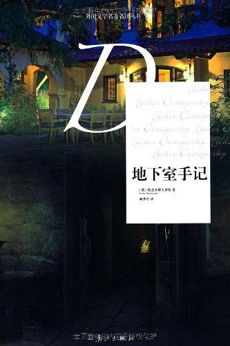  

**内容简介**:  

《地下室手记》体现了陀思妥耶夫斯基诗学的全部艺术特色，内容深刻，形式诡异，既像小说，又像忏悔录，又像哲学论文。作品主人公既像坏人，又像好人；既像小人，又像一个饱经沧桑、逆来顺受的人；既像英雄，又像“非英雄”，又什么都不像。……“地下室人”被认为是“自我中心主义者的典型”，但是又有人认为，  “地下室人”是俄国的哈姆雷特，是“多余人”的当代变形。
陀思妥耶夫斯基是他那个时代的“真理的探求者”。《地下室手记》成为一本越来越受到世人追捧的书，被认为是陀思妥耶夫斯基五部长篇小说的总序，是其创作中的里程碑。

**作者简介**:  

11) 热爱生命: 9.0  

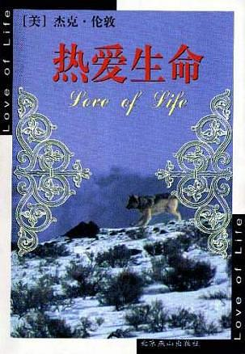  

**内容简介**:  

本书是杰克・伦敦的短片小说集，他的这些作品表现了强烈的个人风格，在人与自然的残酷斗争中，赞美了勇敢、内心的力量、坚毅和爱这些人类高贵的品质，而不是一味地揭示"物竞天择、弱肉强食、适者生存"的自然法则，着重指出人类的爱的重要与神圣。

**作者简介**:  

12) 斯·茨威格中短篇小说选: 9.1  

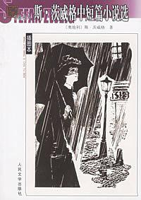  

**内容简介**:  

茨威格初登文坛时，是以抒情诗人的面貌出现的，接着又进行戏剧创作。奥地利作家，不少是诗人、小说家兼剧作家，施尼茨勒、霍夫曼斯塔尔和茨威格均是如此。早在大学时代，茨威格已先后发表了两部诗集《银弦集》和《早年的花环》。茨威格作为作家，可以说是少年得志。大学二年级时，茨威格到柏林去学习了一个学期，主要时间不是用在课堂里听讲，而是用来认识社会，认识人生。柏林之行开阔了茨威格的视野。他生活在富裕的维也纳市民阶层，来往的都是有教养有地位的上层社会男女，何尝接触过被社会唾弃、生活在社会底层的人物，何尝认识过那些离经叛道、用自己怪异荒诞的艺术作品来和现存社会抗争的现代派诗人和艺术家，又何尝了解社会的阴暗面、臭气冲天的阴暗角落。他走进那些未来派的俱乐部，接触到他从未打过交道的酒鬼、同性恋者和吸毒分子等遭到社会摒弃的人，接触到一个他见所未见闻所未闻的世界。人生是那样的广袤无垠，光怪陆离，五光十色，有光明有黑暗，有善有恶。更重要的是善中有恶，恶中有善。一切闪光的并非全是金子，而一切乌黑的也并不全是粪土!他于是懂得了生活的广度和深度，也懂得了文学应有的广度和深度，当时初次接触到的陀斯妥耶夫斯基的长篇小说《卡拉玛佐夫兄弟》就是活生生的典范，茨威格于是深思了。

**作者简介**:  

13) 霍乱时期的爱情: 9.0  

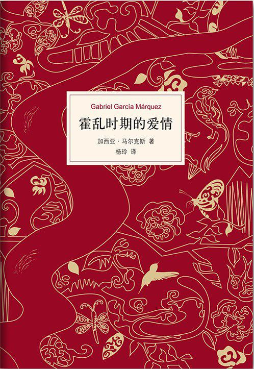  

**内容简介**:  

★马尔克斯唯一正式授权，首次完整翻译
★《霍乱时期的爱情》是我最好的作品，是我发自内心的创作。——加西亚•马尔克斯
★这部光芒闪耀、令人心碎的作品是人类有史以来最伟大的爱情小说。——《纽约时报》
《霍乱时期的爱情》是加西亚•马尔克斯获得诺贝尔文学奖之后完成的第一部小说。讲述了一段跨越半个多世纪的爱情史诗，穷尽了所有爱情的可能性：忠贞的、隐秘的、粗暴的、羞怯的、柏拉图式的、放荡的、转瞬即逝的、生死相依的……再现了时光的无情流逝，被誉为“人类有史以来最伟大的爱情小说”，是20世纪最重要的经典文学巨著之一。

**作者简介**:  

14) 白痴: 9.2  

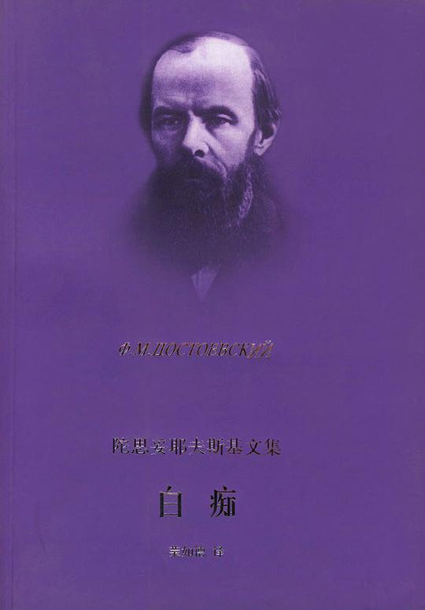  

**内容简介**:  

《白痴》：陀思妥耶夫斯基文集。

**作者简介**:  

陀思妥耶夫斯基（Ф.М.Достоевкий，1821～1881），俄国19世纪文坛上享有世界声誉的一位小说家，他的创作具有极其复杂、矛盾的性质。 
陀思妥耶夫斯基生于医生家庭，自幼喜爱文学。遵父愿入大学学工程，但毕业后不久即弃工从文。在法国资产阶级革命思潮影响下，他醉心于空想社会主义，参加了彼得堡进步知识分子组织的彼得拉舍夫斯基小组的革命活动，与涅克拉索夫、别林斯基过往甚密。 
1846年发表处女作《穷人》，继承并发展了普希金《驿站长》和果戈里《外套》写“小人物”的传统，对他们在物质、精神上备受欺凌、含垢忍辱的悲惨遭遇表示深切同情。唤醒他们抗议这个不合理的社会制度。 
《双重人格》（1846）、《女房东》（1847）、《白夜》（1848）和《脆弱的心》（1848）等几个中篇小说使陀思妥耶夫斯基与别林斯基分歧日益加剧，乃至关系破裂。后者认为上述小说流露出神秘色彩、病态心理以及为疯狂而写疯狂的倾向，“幻想情调”使小说脱离了当时的进步文学。 
1849～1859年陀思妥耶夫斯基因参加革命活动被沙皇政府逮捕并流放西伯利亚。十年苦役、长期脱离进步的社会力量，使他思想中沮丧和悲观成分加强，从早年的空想社会主义滑到“性恶论”，形成了一套以唯心主义和宗教反对唯物主义和无神论，以温顺妥协反对向专制制度进行革命斗争的矛盾世界观。 
他流放回来后创作重点逐渐转向心理悲剧。长篇小说《被伤害与被侮辱的人们》（1861）继承了“小人物”的主题。《穷人》里偶尔还能发出抗议的善良的人，已成了听任命运摆布的驯良的人；人道主义为宗教的感伤主义所代替。《死屋手记》（1861～1862）记载了作者对苦役生活的切身感受，小说描写了苦役犯的优秀道德品质，控诉了苦役制对犯人肉体的、精神的惨无人道的摧残，无情揭露了沙皇俄国的黑暗统治。 
《罪与罚》（1866）是一部使作者获得世界声誉的重要作品。 
《白痴》（1868）发展了“被侮辱与被损害的”主题，女主人公娜斯塔西亚强烈的叛逆性和作为正面人物的梅什金公爵的善良与纯洁，使小说透出光明的色调。但一些用以攻击革命者的“虚无主义者”形象，削弱了小说的揭露力量。 
在《鬼》（1871～1872）中已没有被伤害与被侮辱者的形象，而只有对革命者的攻击了。 
最后一部作品《卡拉马佐夫兄弟》（1880）是作者哲学思考的总结。作者以巨大的艺术力量描写了无耻、卑鄙的卡拉马佐夫家族的堕落崩溃。对颠沛流离、生活在水深火热之中的人们表示深厚同情，但也流露出消极的一面，例如认为只有皈依宗教才能保全道德的价值，只有宽恕和仁慈才能拯救人类社会等说教。 
陀思妥耶夫斯基擅长心理剖析，尤其是揭示内心分裂。他对人类肉体与精神痛苦的震撼人心的描写是其他作家难以企及的。他的小说戏剧性强，情节发展快，接踵而至的灾难性事件往往伴随着复杂激烈的心理斗争和痛苦的精神危机，以此揭露资产阶级关系的纷繁复杂。矛盾重重和深刻的悲剧性。陀思妥耶夫斯基的善恶矛盾性格组合、深层心理活动描写都对后世作家产生深刻影响。

15) 莎士比亚喜剧悲剧集: 9.0  

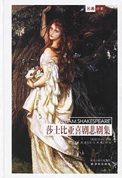  

**内容简介**:  

《莎士比亚喜剧悲剧集》(精装)是一出深受普通观众喜爱的莎剧。波顿的戏中戏，再蹩脚的伶人来演也会令人捧腹。小精灵在舞台上则必定是舞姿翩翩的曼妙少女。原有民歌之外，华美的词句和怪异的情节引得后世音乐家乐思如涌，仲夏夜而森林中，这充满魔力和魅力的时间和地点也使舞美师们能尽情发挥想象运用技艺。
故事轻快、文辞艳丽、人物设置匀称整齐、结尾处祝词又曲意奉承，这使人怀疑它是为某位贵人的婚礼特制的。但至今还没有发现任何史实能证实这一揣测。话虽如此，它确实带有浓重的宫廷假面剧的气息；同时专家们发现它的形式也受到了民间仲夏节和五月庆祝活动的影响。

**作者简介**:  

16) 人间喜剧: 9.1  

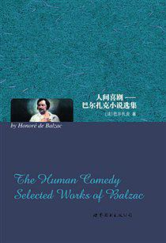  

**内容简介**:  

《人间喜剧:巴尔扎克小说选集》内容简介：巴尔扎克是十九世纪法国最伟大的作家之一，也是世界闻名的现实主义大师。他以毕生心血创作的由九十多部独立而又有所联系的小说组成的巨著《人间喜剧》，是人类文学宝库中的一朵奇葩。他用生花妙笔使几千个人物活跃在书中，而且对这些人物之间的本质关系进行了深刻的剖析，展现了法国社会从封建主义向资本义过渡时期的历史画卷。

**作者简介**:  

17) 孙子兵法: 9.2  

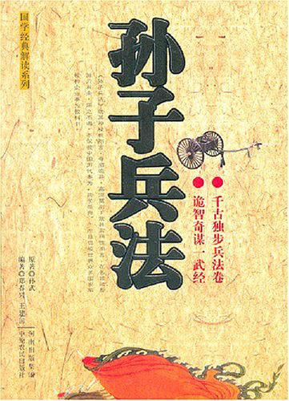  

**内容简介**:  

孙子，名武，字长卿，是春秋末期齐国人，我国古代伟大的军事家。孙子的七世祖是陈国公子完，公子完为避难而逃离陈国来到齐国。由于古代称氏不称姓，公子完在齐国定居后即称陈完，“陈”与“田”音同义通，所以又称田完。田完即后来田氏齐国的始祖。孙子的祖父陈书，字子占，齐大夫，因代莒有功，景公赐姓孙氏，由此孙子这一支以孙为氏。
孙子的家族虽然在齐国名声显赫，但孙子却通过齐景公的昏庸腐化、贪婪剥削、残暴统治，以及贵族阶层间的残酷斗争，看到了社会危机。于是他毅然离开齐国来到了吴国，希望能在吴国施展自己的才华并宴现自己的远大理想。
《史记》载孙子进兵法十三篇与吴王阖闾，吴王看后大悦。吴王让孙子用宫女演练兵法，宫女不听将令，于是孙子斩吴王喜爱的两个妃子以示众，演练终于成功。吴王虽然心痛，但也看到了孙子的军事才能，于是拜孙子为将军。吴王在孙子的辅佐下终于实现了“西破强楚，北威齐、晋，南服越人”的霸业。
孙子所著的《孙子兵法》是中国古代军事著作的代表，是中华民族优秀传统文化中的精萃。不仅是我国现存最早的兵书，也是世界上最早的兵书，在世界军事学术史上占有十分重要的地位。《孙子兵法》被称为“武经”，早在7世纪就传入日本，18世纪以后，英、法、德、俄等国均作了翻译，影响巨大。
本书共十三章，每章分为四部分。第一部分为原文，第二部分为译文，第三部分为事典，第四部分为思悟。为给读者一个全新的感觉，也为了使读者更加容易理解《孙子兵法》的精髓，编者把重心放在了事典上。同时把思悟建立在对原文的理解上，以有利于读者更深入地理解《孙子兵法》的内容和精华。

**作者简介**:  

18) 世界文学名著连环画 欧美部分（全十册）: 9.8  

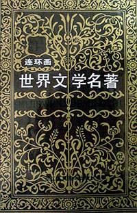  

**内容简介**:  

软精装，雷德祖，朱植人，魏新燕，黄云松，孙愚等绘，一页两图或一图，每册均有400多页，一共包括50部欧美的世界文学名著，具有很强的可读性及收藏价值。

**作者简介**:  

19) 新月集·飞鸟集: 9.0  

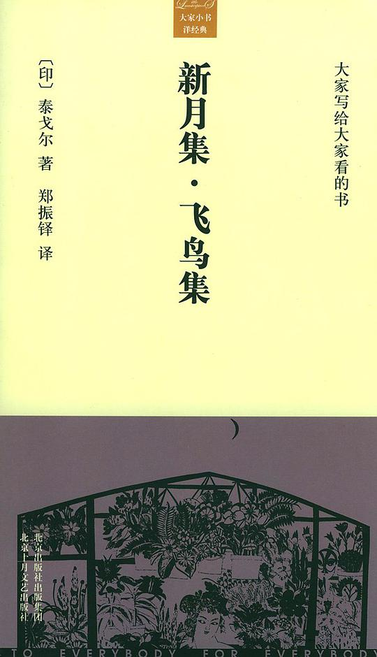  

**内容简介**:  

《新月集》（The Crescent Moon，1903）主要译自1903年出版的孟加拉文诗集《儿童集》，也有的是用英文直接创作的。诗集中，诗人生动描绘了儿童们的游戏，巧妙地表现了孩子们的心理，以及他们活泼的想象。它的特殊的隽永的艺术魅力，把我们带到了一个纯洁的儿童世界，勾起了我们对于童年生活的美好回忆。
《飞鸟集》是泰戈尔的代表作之一，也是世界上最杰出的诗集之一，它包括300余首清丽的小诗。白昼和黑夜、溪流和海洋、自由和背叛，都在泰戈尔的笔下合二为一，短小的语句道出了深刻的人生哲理，引领世人探寻真理和智慧的源泉。初读这些小诗，如同在暴风雨过后的初夏清晨，推开卧室的窗户，看到一个淡泊清透的世界，一切都是那样的清新、亮丽，可是其中的韵味却很厚实，耐人寻味。

**作者简介**:  

20) 简·奥斯汀经典作品集: 9.2  

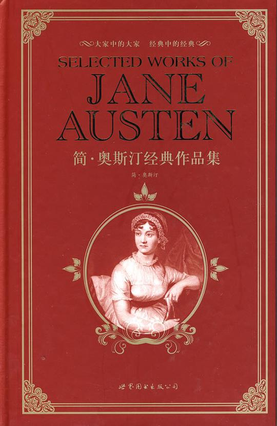  

**内容简介**:  

《简·奥斯汀经典作品集》(精)：简·奥斯汀，英国著名女作家。从18世纪末到19世纪初，庸俗无聊的“感伤小说”和“哥特式小说”充斥英国文坛，而奥斯汀的小说破旧立新，一反常规地展现了当时尚未受到资本主义工业革命冲击的英国乡村中产阶级的日常生活和田园风光。她的作品往往通过喜剧性的场面嘲讽人们的愚蠢、自私、势利和盲目自信等可鄙可笑的弱点。奥斯汀的小说出现在19世纪初叶，一扫风行一时的假浪漫主义潮流，继承和发展了英国18世纪优秀的现实主义传统，为19世纪现实主义小说的高潮做了准备。虽然其作品反映的广度和深度有限，但她的作品如“两寸牙雕”，从一个小窗口中窥视到整个社会形态和人情世故，对改变当时小说创作中的庸俗风气起了好的作用，在英国小说的发展史上有承上启下的意义，被誉为地位“可与莎士比亚平起平坐”的作家。本书收录了简·奥斯汀的六部经典作品。本书为英文版。本书收集奥斯汀的所有小说作品，包括《傲慢与偏见》《理智与情感》《曼斯菲尔德庄园》《爱玛》《诺桑觉寺》《劝导》《苏珊夫人》和《爱情和友谊》。《傲慢与偏见》故事围绕贝内特家中几位待嫁女孩婚姻问题展开。作者巧妙地刻画出先入为主的“第一印象”的荒谬和迷失，以及经过认识然后洞察真相的过程。毛姆将此书列入“世界十大小说”金榜内。《理智与情感》是奥斯汀写的第一部小说，它属于奥斯汀最富于幽默情趣的作品之一。小说以两位女主角曲折复杂的婚事风波为主线，透过“理智与情感”的幽默对比，提出了道德与行为的规范问题。《曼斯菲尔德庄园》是奥斯汀的转型之作，仍以男女青年的恋爱婚姻为题材。但是比较而言，本书情节更为复杂，突发性事件更加集中，社会讽刺意味也更加浓重。《曼斯菲尔德庄园》是奥斯丁生前获利最多的小说，销售速度也比《傲慢与偏见》快。《爱玛》被认为是奥斯汀最成功、最伟大的作品。一个喜欢给人做媒的可爱的姑娘，在为别人安排“良缘”时发现自己爱上了对方。本书结构精微巧妙，喜剧气氛弥漫全书，趣味横生。《诺桑觉寺》除了爱情纠纷之外，小说自始至终还贯穿着对“哥特小说”的嘲讽，因此可谓“双主题”小说。《劝导》奥斯汀最后一部完整的小说，比以前的作品写得更有思想和感情深度，被许多评论家视为奥斯丁最好的作品。《苏珊夫人》和《爱情和友谊》是奥斯汀的两部短篇小说，本书一并收录。本书附有大量精美插图，符合读者审美。 
　　据讲解员介绍，奥斯汀出生于一个乡村牧师家庭，父亲能即兴赋诗。奥斯汀从小在家阅读父亲收藏的古典文学书籍和流行小说，并练习各种文体的写作。14岁时，她就写成了她的处女作《爱情和友谊》。1801年夏，奥斯汀热恋中的男友不幸去世，使她深陷痛苦之中。翌年，她曾接受一个大地产主的求婚，但第二天早晨又改变了主意。因为奥斯汀意识到：单纯为了财产和地位而结婚是错误的；何况，自己根本不爱他，怎能共同生活？结果，她终生未婚。简·奥斯汀的小说蜚声世界文坛，在18世纪—19世纪英国小说的发展史上，起着承上启下的重要作用。她的作品中关于年轻女性婚姻和爱情的别具一格的描写给人留下最深刻的印象。尽管没有财产的妇女的社会出路问题是英国小说中的“老生常谈”，但奥斯汀在其小说中对这一主题却旧题新做，作了独特的喜剧性处理。在名著《傲慢与偏见》里，她曾用戏谑的口吻说班奈特太太的“毕生大志”就是把五个女儿都嫁出去。这部小说著名的第一章描写班奈特太太一听说有个阔少定居在附近，就盘算着如何把一个女儿打发给他。不管是哪一个，任他挑选。这段鞭辟入里的刻画，便是奥斯汀喜剧风格的典范。

**作者简介**:  

21) 诺贝尔文学奖金获奖作家作品选: 9.2  

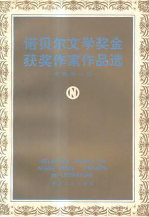  

**内容简介**:  

灯塔看守人、尼尔斯骑鹅历险记、摩诃摩耶、克兰比尔、沉重的时刻、品质、从旧金山来的先生、纪念艾米丽的一朵玫瑰花、青鱼、老人与海、局外人、珍珠、墙、一个人的遭遇、危地马拉的周末、伊豆的舞女、苔蕾丝德斯盖鲁、约翰娜的故事、丧失了名誉的卡塔琳娜勃罗姆、白鹦鹉、寻找格林先生、市场街的斯宾诺莎。

**作者简介**:  

22) 契诃夫小说选: 9.1  

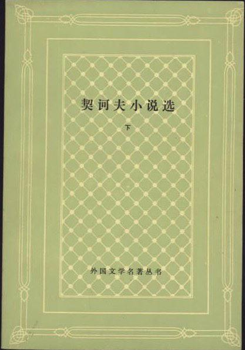  

**内容简介**:  

**作者简介**:  

24) 群魔: 9.3  

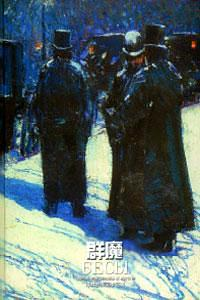  

**内容简介**:  

《群魔》是陀思妥耶夫斯基的代表作之一。他在这部作品中塑造了19世纪40年代的自由主义者及70年代初民主青年的群像。作者着重探索了恐怖分子的内心活动。《群魔》的主人公之一是自称为革命者的彼得·韦尔霍文斯基。他通过其领导的秘密组织进行恐吓、讹诈、纵火、暗杀等恐怖活动，企图动摇社会基础，以便发起暴动，夺取政权。作者以令人惊叹的洞察力和独特的心理描写拆穿了他的骗局；他是个阴谋家和恶棍。

**作者简介**:  

陀思妥耶夫斯基（Dostoieevsky, 1821-1881）是19世纪群星灿烂的俄国文坛上一颗耀眼的明星，与列夫·托尔斯泰、屠格涅夫等人齐名，是俄国文学的卓越代表，他所走过的是一条极为艰辛、复杂的生活与创作道路，是俄国文学史上最复杂、最矛盾的作家之一。即如有人所说“托尔斯泰代表了俄罗斯文学的广度，陀思妥耶夫斯基则代表了俄罗斯文学的深度”。
1821年，陀思妥耶夫斯基出生在的一个医生家庭。他的童年是在父亲的庄园里度过的，因而接触到了农奴的实际生活。1834年他进入莫斯科契尔马克寄宿中学，毕业后入彼得堡军事工程学校，在该校工程部制图局工作。一年后，他自动离职，专门从事文学创作。1846年，他写出了自己的第一部作品《穷人》。小说一出版，即轰动文坛，受到读者的普遍赞扬。文学批评家别林斯基称之为“社会小说的第一次尝试”。之后，他又先后写出了《双重人格》、《女房东》、《白昼》和《脆弱的心》等几个中篇小说。
1849-1859年，陀思妥耶夫斯基因参加革命活动被沙丘政府逮捕并流放西伯利亚。
流放回来后，陀思妥耶夫斯基继续拿起笔进行创作。经过了长期身体和心灵折磨，陀思妥耶夫斯基对于生活的反思更为深刻，思想也更为深邃。从1861年起，他先后发表了《被侮辱与被损害的》、《死屋手记》、《罪与罚》、《白痴》、《群魔》、《卡拉马佐夫兄弟》等重要作品。
其中，1866年发表的《罪与罚》，为作者赢得了世界性的声誉。
而1880年发表的《卡拉马佐夫兄弟》（或译《卡拉马助夫兄弟们》），更是作者哲学思考的总结，被称为人类有文明历史以来最为伟大的小说。有作家点评：“陀思妥耶夫斯基一生执著于研讨人与上帝的关系，经常摆荡于天堂与地狱之间，穿梭于神性与魔性的两极，直到他年届六十，终于写下《卡拉马助夫兄弟们》，在人类精神领域中，竖立了一座高峰。”
陀思妥耶夫斯基并非开创心理叙事的鼻祖，但他绝对是发展心理和意识描写的一代宗师，其于身后影响巨大，西方的众多作家都将其奉为圭臬，以至于在他们的作品中都可或多或少地发现陀氏的影子。
陀思妥耶夫斯基是心理描写的专家，醉心于病态的心理描写，不仅写行为的结果，而且着重描述行为发生的心理活动过程，特别是那些自觉不自觉的反常行为、近乎昏迷与疯狂的反常状态。而人物的思想行为反常，恰恰又是他作品的特点。他对人类肉体与精神痛苦的震撼人心的描写是其他作家难以企及的。他的小说戏剧性强，情节发展快，接踵而来的灾难性事件往往伴随归档心理斗争和痛苦的精神危机，以此揭露阙关系的纷繁复杂、矛盾重重和深刻的悲剧性。陀思妥耶夫斯基的善恶矛盾性格组合、深层心理活动描写都对后世作家产生深刻影响。
陀思妥耶夫斯基的创作影响，远远走出俄国以外。现实主义派的作家从他的创作中可以吸收到有益的营养，现代派作家则把他的作品奉为经典，而称他本人为他们的先驱和导师。

25) 中国古代文化常识: 9.0  

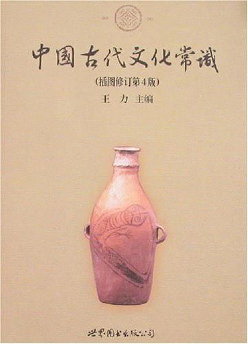  

**内容简介**:  

《中国古代文化常识》(插图修订第4版)是北京大学王力教授主持并召集众多专家共同编写的关于中国古代文化常识的简明读本，出版46年来前后历经4次重要修订。到今天仍然是大众认识中国古代文化面貌最重要、最全面的基础参考书。全书分礼俗、宗法、饮食、衣饰等十四个方面。本书曾在港台地区出版．并被译成日、韩等语言流行于海内外。第四次修订版特聘请在美国任教的汉学专家刘乐园(LewisEden)。以中国考古学黄金时代的成果为出发点．精选图片．改谬补漏．从考古学和人类学的角度增补最新文化研究成果，通过近世考古发现与传统文献相结合的“古史新证”，勾勒出情趣盎然的中国古代文化生活图景。

**作者简介**:  

主编简介
王力（1900～1986），字了一，广西博白人。北京大学中文系一级教授，中国现代语言学的奠基人之一，中国科学院哲学社会科学部委员。早年就读于清华大学国学研究院，师从梁启超、王国维、赵元任、陈寅恪等。后留学法国，获巴黎大学文学博士学位。回国后历任清华大学、西南联合大学、中山大学、北京大学等校教授。著有《汉语诗律学》《汉语史稿》《中国语言学史》《同源字典》等四十余部，主编有《古代汉语》《王力古汉语字典》等，•译有波德莱尔的《恶之花》（诗集）等三十余部。
执笔者简介（部分）
马汉麟（1919～1978），毕业于西南联合大学，师从王力等先生，先后执教于清华大学中文系、南开大学中文系。1961年，马汉麟先生应邀参加王力先生主编的《古代汉语》的编写工作，为这一学科的教学与教材建设作出了重要贡献。
审校者简介（部分）
姜亮夫(1902～1995)，国学大师。著有《楚辞书目五种》《古文字学》《敦煌学概论》等。
叶圣陶（1894～1988），著名作家、教育家。曾主编《小说月报》。著有《倪焕之》《稻草人》《古代英雄的石像》等。
修订者简介
刘乐园，北京大学教师。

26) 论语: 9.0  

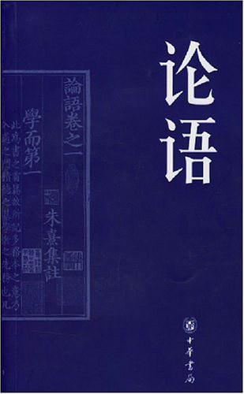  

**内容简介**:  

《论语》是一部语录体思想散文集。早在春秋后期孔子设坛讲学时期，其主体内容就已初始创成；孔子去世以后，他的辫子和再传弟子代代传授他的言论，并逐渐将这些口头记诵的语录言行记录下来，集腋成裘，最终在战国初年汇辑论纂成书，因此称“论”。《论语》主要记载孔子及其弟子的言行，因此称为“语”。
孔子思想以立身为出发点，而人能立身于世的首要条件就是具有“君子”人格。君子具备仁爱之心，自重自律；表里如一，言行一致；积极进取，德才兼备；孜孜于学，注重实践；安贫乐道，谨守正义等等；始终坚守人之间的相处之道，遵从不同的伦理关系，构建着和谐友爱的人际关系和社会环境。
这本书以权威版本为底本，约请张燕婴作了晓畅通俗的白话翻译。文白对照，并以对开的方式排版，以为读者提供阅读最方便的文本。

**作者简介**:  

27) 红轮（第三卷）: 9.0  

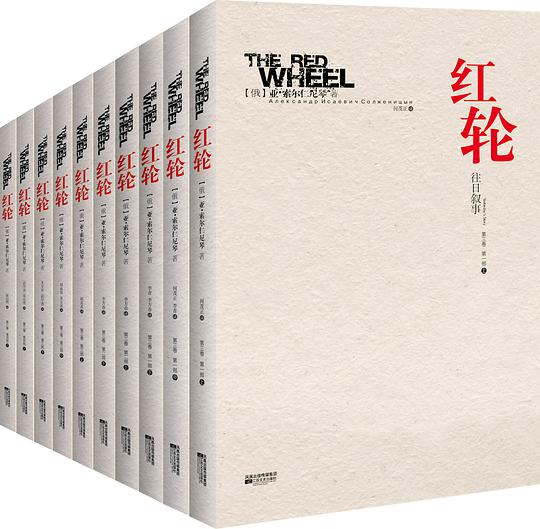  

**内容简介**:  

诺贝尔文学奖获得者索尔仁尼琴创作生涯中最大的一部鸿篇巨制，也是目前世界文学史上篇幅最宏大、卷帙最浩繁、所反映的历史事件时间跨度最长的一部小说。
《红轮》从1914年8月的一战到1916年的俄国民权运动、俄国资产阶级二月革命、无产阶级十月革命、1918-1919外国武装干涉和苏联国内战争，一直写到1920-1922水兵叛乱，、新经济政策及1928工业化、1931农业集体化、1937新宪法、1941苏联卫国战争和1945年苏联卫国战争的胜利。涉及俄国及欧洲历史上的一些列重大事件，作者极力把历史事件和历史人物重现在读者面前，用文学笔调对其意义做出自己的解释和评价，力求全方面、多层次、多方位反映历史现实，构成一部俄罗斯的百科全书。
《红轮》是一个神话，一部史诗，一幅全景式展现俄国战争和革命时代的历史画卷，一部深入反思俄国革命史的多主题、多声部的史诗性长篇小说，也是一部再也无法超越的世纪巨著！
本卷为《红轮》系列最核心的一卷，也是中国大陆出版的最后一卷！

**作者简介**:  

28) 坂田荣男围棋全集（共12册）: 9.8  

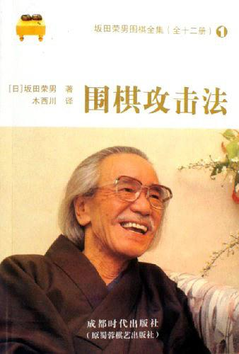  

29) 儒勒·凡尔纳小说作品选集: 9.2  

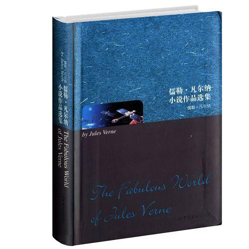  

**内容简介**:  

《儒勒·凡尔纳小说作品选集》精选了法国科幻小说作家儒勒·凡尔纳的两部经典之作，其中《八十天环游地球》是凡尔纳最著名的小说之一，也是世界科幻小说的经典之作，笔调生动活泼，富有幽默感。小说叙述了英国人福格先生因和朋友打赌，而在八十天克服重重困难完成环游地球一周的壮举。书中不仅详细描写了福格先生一行在途中的种种离奇经历和他们所遇到的千难万险，而且还在情节的展开中使人物的性格逐渐立体化。沉默寡言、机智、勇敢、充满人道精神的福格，活泼好动易冲动的仆人等等。作品发表后，引起了轰动，多次再版。1874年由作者本人改编成剧本后，同样受到广泛欢迎。

**作者简介**:  

30) 红楼梦: 9.4  

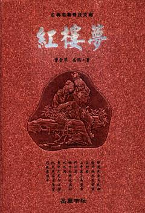  

**内容简介**:  

《红楼梦》是中国最具文学成就的古典文学巨著，它是中国古典文学创作的颠峰之作，是全人类的文化瑰宝。通过对“贾、史、王、薛”四大家族荣衰的描写，展示了广阔的社会生活视野，森罗万象，囊括了多姿多彩的世俗人情。人称《红楼梦》内蕴着一个时代的历史容量，是封建末世的百科全书。

**作者简介**:  

曹雪芹（1715？～1763？），清代小说家，《红楼梦》的作者。字梦阮，号雪芹，又号芹圃、芹溪。祖籍辽阳。祖先原为汉人，后入旗籍，为正白旗。清朝建立后，曹家成为管理宫廷杂务的“内务府”成员。曹振彦因建立军功，官至两浙都转运盐使司盐法道。从曹振彦之子曹玺（即雪芹曾祖父）开始，曹家三代四人相继担任江宁织造60多年。康熙南巡六次，有四次住在曹氏任职期间的织造府内。曹玺之妻孙氏做过康熙的保姆。曹雪芹的祖父曹寅做过康熙的伴读。曹家与皇帝有着一种特殊的关系，属于最高统治层中的成员。
曹寅有很好的文学修养，是有名的藏书家和刻书家，工诗词，又兼作戏曲。曹雪芹出生在南京，少年时代过了一段富贵荣华的生活。雍正五年（1727），大约由于统治阶级内部斗争的牵连，曹雪芹之父曹以“行为不端”、“骚扰驿站”和“亏空”等罪名，被人参奏，革职抄家。次年曹家从南京迁回北京。大约在乾隆元年（1736），曹家家道稍有复苏，但不久便彻底败落。晚年流落到北京西郊，生活十分穷困，靠朋友接济和卖画维持生计。他性格豪放，喜欢饮酒，多才多艺，工诗善画。“诗笔有奇气”，诗风接近唐代诗人李贺。他有气骨，孤傲不屈，嫉恶如仇。在穷困艰难的环境里，他“披阅十载，增删五次”，坚持写作长篇小说《红楼梦》。死后遗留下《红楼梦》前80回的稿子（生前已传抄行世），80回以后也可能有部分残稿，但佚失不传。今传后40回，一般认为是高鹗所续。

31) 雨果文集（全12卷）: 9.3  

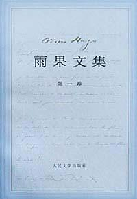  

**内容简介**:  

**作者简介**:  

32) 人间喜剧 第三卷: 9.5  

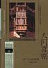  

**内容简介**:  

人间喜剧第三卷，ISBN：9787020018901，作者：（法）巴尔扎克 著，多人 译

**作者简介**:  

33) 红楼梦: 9.5  

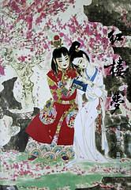  

**内容简介**:  

《红楼梦》是中国古典小说举世公认的巅峰，是封建社会的百科全书，也是中华文化的结晶。二百多年来，深受广大读者的欢迎，历久而不衰。这次推出的豪华本《红楼梦》，心版本价值较高的程乙本为底本，并请著名红学家、作家蒋和森先生撰写了怎样读《红楼梦》的前言，著名画家刘旦宅先生创作了精美的插图。全书装帧典雅豪华，版式疏朗大方，既有很高的阅读收藏豪华，版式疏朗大方，既有很高的阅读收藏价值，又是馈赠亲友的最佳礼品。

**作者简介**:  

34) 清.孙温绘全本红楼梦: 9.1  

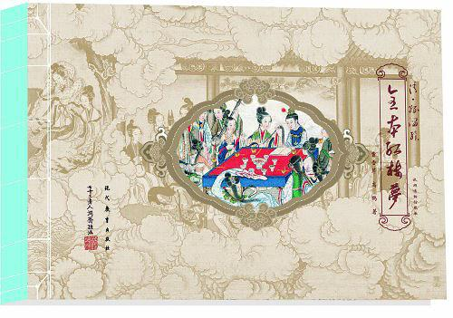  

**内容简介**:  

《清·孙温绘全本红楼梦(套装共2册)》采用图文并茂的形式，文字以亚东版为底本、图片以清代工笔大家孙温绘制的章回工笔画相结合的图文版全本《红楼梦》，全面再现《红楼梦》场景、人物、活动细致入微。使读者在阅读红学经典的同时，能够欣赏到与之相匹配的精美的画面。亚东图书馆本配孙温画，可谓文以图丰，图以文茂，珠联璧合，相得益彰。
为便于读者了解《红楼梦》中的人物关系，《清·孙温绘全本红楼梦(套装共2册)》在正文前编有《〈红楼梦〉人物表》，以备查阅。为增加直观效果，将孙温绘制的《红楼梦》主要人物64位，做成绣像，分为“金陵十二钗”、“荣国府”、“宁国府”、“大观园”四部分，置于正文前，以便观览。

**作者简介**:  

35) 一块牛排: 9.0  

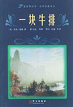  

**内容简介**:  

本书所选的二十篇短篇小说，其主题几乎涵盖了杰克·伦敦一生创作所及。
    在本书中，拳手汤姆·金已经过了他拳击生涯的高峰期，穷困潦倒。后来他最终倒下了。那时因为穷，他连买一块牛排的钱都没有。他想，要是有一块牛排充饥，他一定能打败对手。其实，他缺少的不是一块牛排的力气，而是缺少失去的岁月：斗转星移，后浪推前浪，没有人能永远是生活的强者——每个人的生命中都有一个瓶颈，那是人生最寒冷的冬天。它就在前路等着你，你躲不过它。汤姆·金与其说同饥饿和死亡抗争，不如说是与恐惧抗争，文学大师杰克·伦敦，出色地描绘了这种抗争。让我们从字里行间看到了生命本身那巨大的潜在能量，这种能量是无法诋毁的，它会让你活下去。不管你面对的是什么，哪怕是吞噬你的荒野，是吃掉你的野兽，还是饥饿、疲惫，生命都会帮助你战胜它。

**作者简介**:  

36) 卡拉马佐夫兄弟: 9.4  

  

**内容简介**:  

老卡拉马佐夫贪婪好色，独占妻子留给儿子们的遗产，并与长子德米特里为一个风流女子争风吃醋。一天黑夜，德米特里疑心自己的情人去跟老头儿幽会，便闯入家园，一怒之下，差点把老头儿砸死。他仓皇逃离后，躲在暗中装病的老卡拉马佐夫的私生子斯乜尔加科夫悄然杀死老爷，造成了一桩震惊全俄的扑朔迷离的血案，从而引发一连串惊心动魄的事件。作品展示了错综复杂的社会、家庭矛盾和人性悲剧，体现了作家一生的最高艺术成就。

**作者简介**:  

陀思妥耶夫斯基（Ф.М.Достоевкий，1821～1881），俄国19世纪文坛上享有世界声誉的一位小说家，他的创作具有极其复杂、矛盾的性质。 
陀思妥耶夫斯基生于医生家庭，自幼喜爱文学。遵父愿入大学学工程，但毕业后不久即弃工从文。在法国资产阶级革命思潮影响下，他醉心于空想社会主义，参加了彼得堡进步知识分子组织的彼得拉舍夫斯基小组的革命活动，与涅克拉索夫、别林斯基过往甚密。 
1846年发表处女作《穷人》，继承并发展了普希金《驿站长》和果戈里《外套》写“小人物”的传统，对他们在物质、精神上备受欺凌、含垢忍辱的悲惨遭遇表示深切同情。唤醒他们抗议这个不合理的社会制度。 
《双重人格》（1846）、《女房东》（1847）、《白夜》（1848）和《脆弱的心》（1848）等几个中篇小说使陀思妥耶夫斯基与别林斯基分歧日益加剧，乃至关系破裂。后者认为上述小说流露出神秘色彩、病态心理以及为疯狂而写疯狂的倾向，“幻想情调”使小说脱离了当时的进步文学。 
1849～1859年陀思妥耶夫斯基因参加革命活动被沙皇政府逮捕并流放西伯利亚。十年苦役、长期脱离进步的社会力量，使他思想中沮丧和悲观成分加强，从早年的空想社会主义滑到“性恶论”，形成了一套以唯心主义和宗教反对唯物主义和无神论，以温顺妥协反对向专制制度进行革命斗争的矛盾世界观。 
他流放回来后创作重点逐渐转向心理悲剧。长篇小说《被伤害与被侮辱的人们》（1861）继承了“小人物”的主题。《穷人》里偶尔还能发出抗议的善良的人，已成了听任命运摆布的驯良的人；人道主义为宗教的感伤主义所代替。《死屋手记》（1861～1862）记载了作者对苦役生活的切身感受，小说描写了苦役犯的优秀道德品质，控诉了苦役制对犯人肉体的、精神的惨无人道的摧残，无情揭露了沙皇俄国的黑暗统治。 
《罪与罚》（1866）是一部使作者获得世界声誉的重要作品。 
《白痴》（1868）发展了“被侮辱与被损害的”主题，女主人公娜斯塔西亚强烈的叛逆性和作为正面人物的梅什金公爵的善良与纯洁，使小说透出光明的色调。但一些用以攻击革命者的“虚无主义者”形象，削弱了小说的揭露力量。 
在《鬼》（1871～1872）中已没有被伤害与被侮辱者的形象，而只有对革命者的攻击了。 
最后一部作品《卡拉马佐夫兄弟》（1880）是作者哲学思考的总结。作者以巨大的艺术力量描写了无耻、卑鄙的卡拉马佐夫家族的堕落崩溃。对颠沛流离、生活在水深火热之中的人们表示深厚同情，但也流露出消极的一面，例如认为只有皈依宗教才能保全道德的价值，只有宽恕和仁慈才能拯救人类社会等说教。 
陀思妥耶夫斯基擅长心理剖析，尤其是揭示内心分裂。他对人类肉体与精神痛苦的震撼人心的描写是其他作家难以企及的。他的小说戏剧性强，情节发展快，接踵而至的灾难性事件往往伴随着复杂激烈的心理斗争和痛苦的精神危机，以此揭露资产阶级关系的纷繁复杂。矛盾重重和深刻的悲剧性。陀思妥耶夫斯基的善恶矛盾性格组合、深层心理活动描写都对后世作家产生深刻影响。

37) 王尔德作品选: 9.5  

  

**内容简介**:  

王尔德作品选，ISBN：9787510036392，作者：（英）王尔德 著

**作者简介**:  

38) 三国演义连环画(1-60): 9.4  

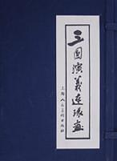  

**内容简介**:  

从桃园结义到三国归晋，全套60本，插图，装祯都和小时候读过的一模一样，值得重温，值得收藏。

**作者简介**:  

39) 安娜·卡列尼娜: 9.0  

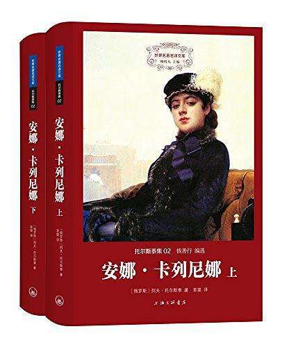  

**内容简介**:  

《安娜·卡列尼娜》是俄国著名作家列夫·托尔斯泰的代表作品。小说由两条线索构成：一条是安娜与卡列宁、伏伦斯基之间的家庭、婚姻和爱情纠葛；一条是列文和吉娣的爱情生活及列文进行的庄园改革。上流社会的贵妇人安娜，年轻漂亮，追求个性解放、爱情自由，丈夫卡列宁却性情冷漠。与年轻军官伏伦斯基在火车站的邂逅，改变了安娜的生活。伏伦斯基被她的美貌所吸引，热烈追求，最终两人相爱同居。但对儿子的思念及周围环境的压力使安娜陷入痛苦和不安中，绝望的安娜选择了卧轨自杀。小说既揭露了19世纪六七十年代俄罗斯上流社会的丑恶与虚伪，同时也表达了作者处在社会转型期时所进行的复杂的道德探索和思想探索。

**作者简介**:  

40) 世界文学名著连环画（亚非部分全五册）: 9.7  

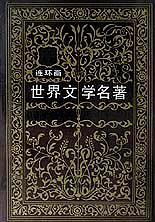  

**内容简介**:  

本书是世界文学名著连环画的简装本。这套书，是一部由引人兴趣，到引人深读原著的好书。该书以世界文学发展史为线索，精选了各国享有声誉作家的代表著作，生动的图画，精炼的文章，把世界名著的文学性、艺术性、知识性融合在一起，是一套让人通过看图认识世界文学的好书。
《世界文学名著连环画》亚非部分全书分5册，气势恢弘，包括了埃及、印度、中国、朝鲜、日本等国家最著名的文学名著，由著名画家操刀力作，是《世界文学名著连环画》欧美部分（10册）的姊妹篇。具有非常高的艺术和收藏价值。

**作者简介**:  

41) 莎士比亚全集: 9.3  

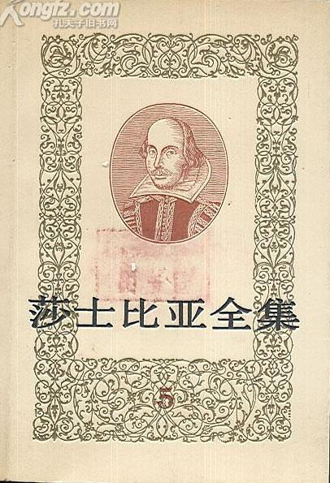  

**内容简介**:  

《暴风雨》
《维洛那二绅士》
《温莎的风流娘儿们》
《一报还一报》

**作者简介**:  

42) 算术探索: 9.8  

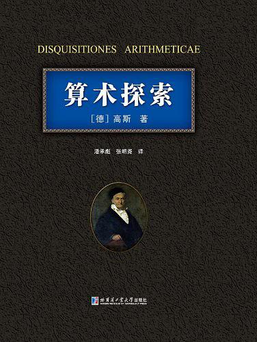  

**内容简介**:  

《算术研究》是被誉为“数学王子”的德国大数学家高斯的第一部杰作，该书写于1797年，1801年正式出版，这是一部用拉丁文写成的巨著，是数论的最经典及最具权威性的著作。在随后的200年时间中被翻译成多国文字，如德文、英文、俄文等。这部著作在数学中的重要地位不亚于《圣经》在基督教中的地位，只有欧几里得的《几何原本》堪与之相比，因为高斯有一句名言：“数学是科学的女皇，数论是数学的女皇。”这部著作共七篇。
第一篇讨论一般的数的同余：并首次引进了同余记号，这是现代数学中无处不在的等价和分类概念出现在代数中的最早的意义重大的例子。
第二篇讨论一次同余方程：其中严格证明了算术基本定理。
第三篇讨论幂的同余式：此篇详细讨论了高次同余式。
第四篇“二次同余方程”意义非同寻常：因为其中给出了二次互反律的证明，有人统计到21世纪初，二次互反律的证明已经超过200种，其中柯西、雅可比、迪利克雷、艾森斯坦、刘维尔、库默尔、克罗内克、戴德金、瓦莱－布桑、希尔伯特、弗罗贝尼乌斯、斯蒂尔切斯、M•里斯、韦伊都给出了新证法，可见问题之重要。
第五篇是“二次型与二次不定方程”在这一篇中关于二次型的特征的研究，标志着群特征标理论的肇始，使高斯成为群论的先驱者之一。
第六篇把前面的理论应用到各种特殊情形，并引入了超越函数。
第七篇是“分圆方程”，不少人认为此篇是《算术研究》的顶峰。
《算术研究》当时对于数学家也很难读，它曾被称为“七印封严之书”（这是西方人对难解之书喜用的词，近于中国人所谓的“天书”，典出《圣经•启示录》第五章第一节：“我看见坐宝座的右手中有书卷，里外都写着书，用七印封严了”）后来迪利克雷作了详细注释。此书简洁完美的风格多少减慢了它的传播速度，而最终当富有才华的年轻人开始深入研读它时，由于出版商的破产，又买不到它了，甚至高斯最喜欢的学生艾森斯坦从未能拥有一本，有些学生不得不从头到尾抄录全书。

**作者简介**:  

作者：（德国）高斯 译者：潘承彪 张明尧
潘承彪，1938年生于江苏省苏州市，1960年毕业于北京大学数学力学系数学专业，1961年起在北京农业机化学院（后改名为北京农业工程大学、中国农业大学）工作，从1977年起同时在北京大学数学系工作。主要从事数学，特别是数论的教学科研工作。与胞兄潘承洞合著有《哥德巴赫猜想》、《解析数论基础》、《素数定理的初等证明》、《代数数论》、《初等数论》及《模形式导引》等。
张明尧，1945年12月生于山东省菏泽市，1967年毕业于安徽大学数学系，1981年获得硕士学位后在安徽大学工作；1987年获得博士学位后在中国科技大学工作；1994年调海南大学工作；1996年调上海华东理工大学工作。译著有《数论中未解决的问题（第二版）》（原著者R.K.Guy）、《纯数学教程(纪念版)》（原著者G.H.Hardy）以及《哈代数论(第六版)》（原著者G.H.Hardy以及E.M.Wright修订者D.R.Heath-Brown以及J.H.Silverman）等。

43) 赤道环游记: 9.2  

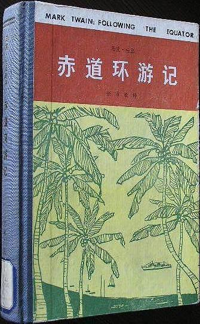  

**内容简介**:  

**作者简介**:  

44) 四朝代（上下）: 9.3  

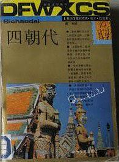  

**内容简介**:  

长篇历史小说《四朝代》（1953）是泰国著名政治家、作家克立·巴莫的代表作，是泰国历史小说中一部出类拔率的作品。在同类作品中，就反映生活的深度、广度和作品的艺术价值而言，直到目前还没有哪一部作品能与《四朝代》媲美。小说通过一位贵族女子帕瑞的一生，展现了曼谷王朝五世王到八世王（1868—1946）几十年间的社会生活，描写了泰国的重大历史事件。宫廷的礼仪和习尚，以及西方影响所导致的社会变迁。作者赋予历史的血肉和灵魂，编织了一幅壮丽的历史画卷。历史小说有不同的流派和多种写法。作者采用的是构筑了一个符合史实的枢架，造成了一个特定的历史氛围，但情节和主要人物却是虚构的，这就为自己保留了艺术想象、艺术创造的巨大空间。作者以宫廷的变化为背景，具体写的是帕瑞出生的这个贵族家庭及其子女们的历史命运，这是颇具眼光的。18世纪中时，东方来的西方殖民者敲开了暹罗的大门，暹罗的古老生产关系开始解体，踏上了半殖民地化的进程。西方的物质文明和精神文明冲击着泰国的占老风俗习惯和传统的生后方式。无论是四世王的倡导学习西方，五世王的重大政治和社会改革，六世王的宫廷新风，还是七世王的内外交困和资产阶级革令的爆发，都表明这个时代的本质特征是新与旧的交替，是王权的衰落和贵族的失势，是资产阶级意识形态的入侵和生活方式的现代化。这是不可逆转的。而自上而下又是这一时期泰国社会变动的一个特点，它并没有搅动下层人民，首当其冲的是宫廷和贵族。可以这样说，不写宫廷和贵族便难于反映那个时代，但是时代的变比又有违人意，宫廷和贵族倡导的变革却加速了自己衰亡的这一历史进程。我们在小说中可以看到，帕瑞幼年目睹的是官殿巍峨壮观，门前车水马龙的“太平盛世”，晚年旧地重游，见到的却是王宫的残破们荒凉，贵人已逝，宫女生活无着，成了被人忘却的遗民，这不发人深思吗？几乎与王权衰落，王府荒凉同步，读者也看到了一个名门望族的败落和解体。腐朽也许是没落阶级的一种普遍现象。一家之主的老皮皮特就是骄奢淫逸的，这个家也从未停止过妻妾分争、子女相斗。它还自然地繁育出蛀虫。坤琪小小年纪就吸毒嫖妓，鼠窃狗偷，成了这个家庭的另一种掘墓人。皮皮特生前还能成为这个家庭统一的象征，他一死便分崩离析。自以为得计的坤文虽然打败了所有对手，成了这个家庭的主宰，但她万万没想到阴险和专横却抵挡不住亲弟弟这个无癞汉的榨取，家产被荡涤一空，昔日雄伟壮观的贵族之家成了一个贼窝和荒凉的晒衣场。这也可以说是揭示了封建贵族没落的内在原因。《四朝代》的最为成功之处是塑造了一批具有浓重时代色彩的人物群像，写出了他们在特定历史条件下和特定环境中所形成的性格，写出了他们不同的命运和遭遇。作者不是从概念出发，而是给人们以审美的直觉，从人物的生活史，人物的思想变迁史“化”出了历史。它引导读者探寻了历史的奥秘，又可以把历史做为一面镜子反照今天，给人以思考和咀嚼的余地。帕瑞是小说贯穿始终的人物，她纯洁、美丽、温柔、善良，但又循规蹈矩，逆来顺受，是那个时代典型的闺阁淑女、贤妻良母的形象。面对时代的新风，她也曾怦然心动，但是家教和性格却没有使她再前进一步，她惶惑、迷茫，处处感到不习惯，又听命于别人的安排。她被时代的潮流所裹胁，但从未理解那个时代。但帕瑞没做到的事，她同义异母的妹妹翠却做到了，翠冲出了封建家庭的牢笼，生活得充实而愉快。帕瑞童年的挚友璀是个乐观、活泼、大胆的姑娘，照理说她应当有光明的前途和较好的境遇。但是封闭的宫中生活，使她变成了笼中鸟，古老的宫殿埋葬了她的青春，爱情，送走了她的年华。坤文这个人物塑造得也极为成功。她可以说是封建家族中专横、毒辣、阴险、自私的典型。她掌握家庭大权的时候不过19岁，上有父母，下有弟妹，但是父亲惧她三分，弟妹见她如见阎王。她为自己的私利不讲什么伦常，她是权力和财产的化身，似乎不是血肉之躯。《四朝代》写了大大小小二十几个人物，而言于个性，跃然纸上的就有十几个。主要人物自不必说，次要人物中精神面貌和性格特点也不相同，这些人物展现了一个时代，和今天又是相连相通的。克立·巴莫的作品有自己独特的风格。他构思巧妙，手法夸张，情节起伏跌宕，富于浪漫色彩，人物性格鲜明，讽刺辛辣，语言流畅，诙谐，《四朝代》也具有这些特点。

**作者简介**:  

蒙拉查翁·克立·巴莫（1911—）是泰国一位著名政治家和杰出作家，诞主于停泊在湄南河岸的一条船上。故乡是信武里府因武里县班玛村。祖父是曼谷王朝二世王的儿子，祖母有中国血统，父亲是泰国第一任警察总监。由于出身的关系，克立·巴莫与王室一直保持着密切的关系。在故乡接受了启蒙教育后，进入一所有名的贵皮学校玫瑰国中学，后留学英国9年，曾在牛津大学攻读哲学。经济学和政治学，获学士学位。回国后服过兵役，先后在税务厅，泰国商业银行、泰国银行工作。他至今仍然是泰国商业银行的最大股东。克立的生涯一直与政治密不可分。回国后他便投入政治活动，先后与人合作成立过进步党、民主党，现今仍是社会行动党主席。第二次世界大战以后，他辞去银行工作，竞选过两次者员，出任过两届政府的部长，担任过议长，1975年至1976年担任过总理。他涉足文坛是战后的事，而创作的旺盛时期是50年代。1948年以后克立·巴莫的政治生涯受挫，因而余暇很多，这也促使他把脚踏到文学创作这条船上。他创办了《沙炎叻报》，自任董事长，作为言论和作品的发表阵地，接连写出了《四朝代》、《妄吝众生》、《红竹村》等长篇小说以及短篇小说、戏剧、通俗文学、散文、政论等作品，一时声名赫赫成了文坛上的大家。对克立·巴莫说来，政治和文学也许是相辅相成的。他经历丰富，知识渊博，能言善辩，会演古典舞剧，还拍过电影，这有利于作为政治家的知名度。对文学上的成功这也并非不是基础

45) 莎士比亚全集（全8册）: 9.4  

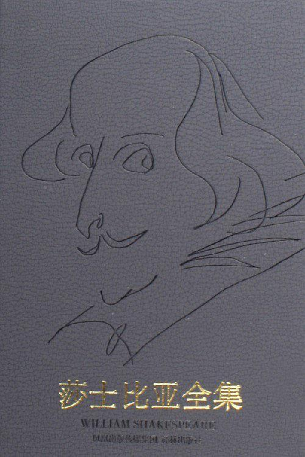  

46) 圣灵论: 9.2  

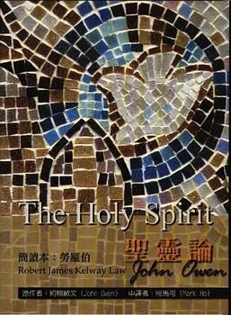  

**内容简介**:  

本书在属灵伦理学方面展现高超的技巧，欧文有意要否定“任何人可以自行选择如何过基督徒生活”的这种想法，并且探索真理对真心的影响，信徒在经过上帝恩典的调整与他话语的考验之后，究竟应如何面对每天的生活。
一、 圣灵的工作
二、 上帝的灵
三、 圣灵如何临到我们并动工
四、 旧约时代圣灵的特别预备工作
五、 圣灵的新造的人身上的工作
六、 圣灵与基督的人性
七、 圣灵在基督奥秘的身体中的工作
八、 圣灵重生的工作
九、 圣灵如何预备人心接受重生工作
十、 罪如何使人心败坏堕落
十一、 肉身之死与属灵之死的比较
十二、 重生
十三、 回转的工作
十四、 成圣的本质与福音的圣洁
十五、 成圣是一生的事
十六、 唯有信徒得以成圣
十七、 成圣本身的工作
十八、 圣灵为信徒除罪的洁净工作
十九、 圣灵更新信徒灵命的工作
二十、 圣洁的行为与本分
二十一、 对付罪
二十二、 圣洁的必要
二十三、 拣选是圣洁的动机
二十四、 上帝命令我们成圣
二十五、 圣洁与基督的工作
二十六、 在浊世中保持圣洁

**作者简介**:  

47) 悲惨世界(上下): 9.0  

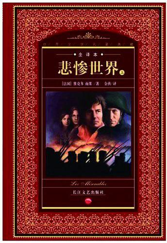  

**内容简介**:  

本小说以浪漫主义和现实主义相结合的手法，叙述了刑满释放犯让·瓦利的悲惨故事，对社会进行了抨击。 本书是法国大作家雨果的代表作之一，讲述了主人公冉阿让带有传奇色彩的故事。全书情节精彩、扣人心弦，既是一部动人的史诗，又体现了一种浩博的精神、充沛的激情，非常值得欣赏。

**作者简介**:  

48) 红楼梦（连环画）1-16: 9.2  

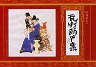  

**内容简介**:  

《红楼梦》一个让人遐想的名字，一个让中国人骄傲的名字。记得小时侯，常听大人谈起毛泽东说过的一句话“我们中国有两个骄傲：一个是万里长城，一个是《红楼梦》。”在这份好奇的心境下匆匆地知道了宝玉和林妹妹爱情悲剧，当时随不懂那些风月情浓，却也流了些许的泪。
如今，重温旧梦，捧起《红楼梦绘画本》，黛玉葬花！宝钗扑蝶！湘云醉酒！一幅幅凄凉柔美伴着童年的回忆再一次走进那难以言表的“大观园”。

**作者简介**:  

49) 莎士比亚喜剧选: 9.4  

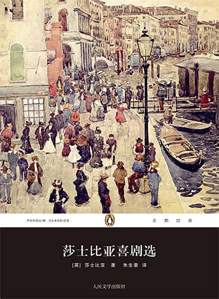  

**内容简介**:  

这本喜剧集收入了莎士比亚最脍炙人口的五部喜剧：《仲夏夜之梦》、《威尼斯商人》、《无事生非》、《温莎的风流娘们儿》和《第十二夜》。作品中洋溢着文艺复兴时期的乐观精神，充满对人、而非神的赞美和信心。人的个性、追求、尊严得以彰显，真挚的爱情得到歌颂，民主平等的精神初见端倪。莎士比亚喜剧的主题大同小异，多贯穿着一条有情人历经磨难、终成眷属的主线，同时又以笑声为武器，讽刺社会陋习偏见，揭露人性中的可笑与可鄙，是以散发出永不褪色的魅力。

**作者简介**:  

50) The Odyssey: 9.0  

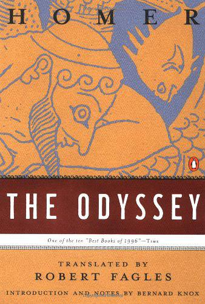  

51) 李白诗: 9.6  

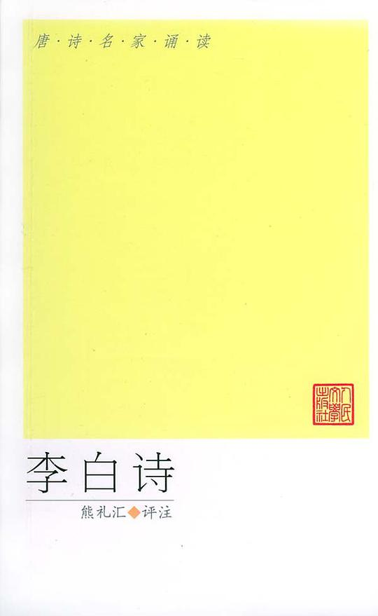  

**内容简介**:  

《李白诗选》选诗一百六十多首，约占李白现存诗歌的六分之一。原文以王琦注《李太白全集》为底本，参用相关文献资料。书中注释和赏评借鉴或取用了古今众多专家的研究成果。

**作者简介**:  

52) 猎犬星座: 9.1  

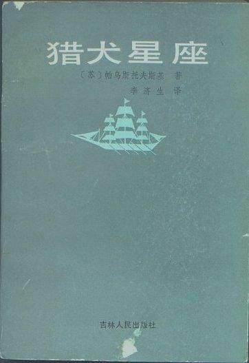  

**内容简介**:  

目录
北方故事
春汛
塔拉斯·谢甫琴科
伊萨克·列维坦
猎犬星座
查理·伦瑟维的命运
奥列斯特·基普林斯基
湖滨防线
梅肖尔地区

**作者简介**:  

帕乌斯托夫斯基（1892～1968）
苏联俄罗斯作家。出身于莫斯科一个铁路员工家庭。从中学时代起他就醉心于文学，1912年发表了第一个短篇小说。在十月革命和国内战争时期他比较广泛地接触俄国的社会生活，参加过红军，当过记者及报社编辑。这期间他创作了许多作品。使他一举成名的是中篇小说《卡拉－布加兹海湾》（1932）。后来他还写了一系列画家、作家的传记小说和历史题材的作品，如《伊萨克·列维坦》（1937）、《塔拉斯·谢甫琴柯》（1939）、《北方故事》（1938）等。卫国战争时期他当过战地记者。他于1956年发表的《金蔷蔽》是一本创作札记，其中谈了许多创作体会和经历，受到广泛欢迎。后期他致力于创作长篇自传体小说《一生的故事》（1945～1963），反映了19世纪末直到20世纪30年代作者的经历，是作者对创作历程和道德、精神内容的思考、探索的总结。
帕乌斯托夫斯基的作品多以普通人、艺术家为主人公，突出地表现了对人类美好品质的赞颂，具有动人的抒情风格。他的短篇小说写得优美如诗，艺术水平很高，如《雪》、《雨濛濛的黎明》、《一篮云杉果》等。
我国对他的作品译介较多，先后出版过《卡拉－布加兹海湾》、二卷本的《帕乌斯托夫斯基选集》以及《金蔷蔽》、《北方故事》、《猎犬星座》、《面向秋野》，《祖国的炊烟》等小说、散文集。

53) 世界文学名著全书·世界奇书文库: 9.0  

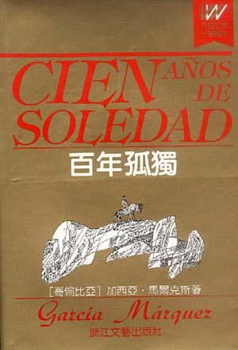  

**内容简介**:  

《百年孤独》是哥伦比亚著名的作家马尔克斯的巨著，它作为“魔幻现实主义”的代表作品闻名于世，智利诗人聂鲁达曾称赞他是“塞万提斯之后最伟大的语言大师”。马尔克斯也因此获得1982年诺贝尔文学奖。
何塞·阿卡迪奥·布恩迪亚是西班牙人的后裔，住在远离海滨的一个印第安人的村庄。他与乌苏拉新婚时，由于害怕像姨母与叔父结婚那样生出长尾巴的孩子，乌苏拉每夜都穿上特制的紧身衣，拒绝与丈夫同房。因此遭到邻居阿吉拉尔的耻笑，何塞杀死了阿吉拉尔。从此，死者的鬼魂经常出现在他眼前，鬼魂那痛苦而凄凉的眼神，使他日夜不得安宁。他们只好离开村子，外出寻找安身之所。经过了两年多的奔波，来到一片滩地上，由于受到梦的启示决定定居下来。后来又有许多人迁移至此，建立村镇，这景是马孔多。布恩迪亚家族在马孔多的历史由此开始。
何塞是个极富创造性的人，他从吉卜赛人那里看到磁铁，便想用它来开采金子。看到放大镜可以聚焦太阳光，便试图研制一出种威力无比的武器。他从吉卜赛人那里得到航海用的观像仪和六分仪，通过实验认识到“地球是圆的，像橙子”。他不满于自己所过的贫穷落后的生活，他向妻子抱怨说：“世界上正在发生不可思议的事情，咱们旁边，就在河流对岸，已有许多各式各样神奇的机器，可咱们仍在这儿像蠢驴一样过日子。”因为马孔多隐没在宽广的沼泽地中，与世隔绝。他决心要开辟出一条道路，把马孔多与外界的伟大发明连接起来。
他带一帮人披荆斩棘干了两个多星期，却以失败告终。他痛苦地说：“咱们再也去不了任何地方啦，咱们会在这儿活活地烂掉，享受不到科学的好处了。”后来他又沉迷于炼金术，整天把自己关在实验室里。由于他的精神世界与马孔多狭隘、落后、保守的现实格格不入，他陷入孤独之中不能自拨，以至于精神失常，被家人绑在一棵大树上，几十年后才在那棵树上死去。乌苏拉成为家里的顶梁柱，她活了115至120岁。
布恩迪亚家族的第二代有两男一女。老大何塞·阿卡迪奥是在来马孔多的路上出生的，在那里长大，像他父亲一样固执，但没有他父亲那样的想象力。和一个叫皮拉苔列娜的女人私通，有了孩子，他十分害怕，后来与家里的养孩子蕾蓓卡结婚。但他一直对人们怀着戒心，渴望浪迹天涯，最后随吉卜赛人出走，回来后变得放荡不羁，最后的莫明其妙地被人暗杀了。
老二奥良诺生于马孔多，在娘肚里就会哭，睁着眼睛出世，从小就赋有预见事物的本领，少年时就像父亲一样沉默寡言，整天埋头在父亲的实验室里做首饰。长大后爱上镇长千金雷梅苔丝，在此之前，他与哥哥的情人生有一子，名叫奥雷良诺·何塞。妻子暴病而亡后，他参加了内战，当上上校。他一生遭遇过14次暗杀，73次埋伏和一次枪决，均幸免于难，当他认识到这场战争是毫无意义的时候，便于政府签订和约，停止战争，然后对准心窝天枪自杀，可他却奇迹般的活了下来。
与17个外地女子姘居，生下17个男孩。这些男孩以后不约而同回马孔多寻根，却在一星期内全被打死。奥雷良诺年老归家，和父亲一样对炼金术痴迷不已，每日炼金子作小金鱼，每天做两条，达到25条时便放到坩锅里熔化，重新再做。他像父亲一样过着与世隔绝、孤独的日子，一直到死。
老三是女儿阿马兰塔，爱上了意大利技师，因爱情的不如意，她故意烧伤一只手，终生用黑色绷带缠起来，决心永不嫁人。但她内心感到异常孤独、苦闷，甚至和刚刚成年的侄儿厮混，想用此作为“治疗病的临时药剂”。然而她终于无法摆脱内心的孤独，她把自己终日关在房中缝制殓衣，缝了拆，拆了缝，直至生命的最后一刻。
第三代人只有何塞·阿卡迪奥的儿子阿卡迪奥和奥良诺的儿子奥雷良诺·何塞。前者不知生母为谁，竟狂热地爱上自己的生母，几乎酿成大错，后来成为马孔多的从未有过的暴君，贪赃枉法，最后被保守派军队枪毙。后者过早成熟，热恋着自己的姑母阿马兰塔，因无法得到满足而陷入孤独之中，于是参军。进入军队之后仍然无法排遣对姑母的恋情，便去找妓女寻求安慰，借以摆脱孤独，最终也死于乱军之中。
第四代即是阿卡迪奥与人私通生下的一女两男。女儿俏姑娘雪梅苔丝楚楚动人，她身上散发着引人不安的气味，这种气味曾将几个男人置于死地。她总愿意裸体，把时间耗费在反复洗澡上面，尽管她很漂亮，但因不懂家务，不晓世事得不到人们的信任和理解，因此只能“在孤独的沙漠里徘徊”。最后神奇地抓着一个雪白的床单乘风而去，永远消失在空中。
她的孪生子弟弟阿卡迪奥第二和奥雷良诺第二。阿卡迪奥第二在美国人开办的香蕉公司里当监工，鼓动工人罢工，成为劳工领袖。后来，他带领三千多工人罢工，遭到军警的镇压，三千多人只他一人幸免。他目击政府用火车把工人们的尸体运往海边丢到大海，又通过电台宣布工人们暂时调到别处工作。阿卡迪奥四处诉说他亲历的这场大屠杀揭露真象，反被认为神智不清。他无比恐惧失望，把自己关在房子里潜心研究吉卜赛人留下的羊皮手稿。吃饭、睡觉、大小便全在一间房内，弄得臭气熏天，一直到死他都呆在这个房间里。
奥雷良诺第二没有正当的职业，终日纵情酒色，弃妻子于不顾，在情妇家中厮混。奇怪的是每当他与情妇同居时，他家的牲畜迅速地繁殖，给他带来了财富，一旦回到妻子身边，便家业破败。他与妻子生有二女一男，最后在病痛中与阿卡迪奥一同死去，从生到死，人们一直没有认清他们兄弟俩儿谁是谁。
布恩迪亚家族的第五代是奥雷良诺第二的二女一男，长子何赛·阿卡迪奥儿时便被送往罗马神学院去学习，母亲希望他日后能当主教，但他对此毫无兴趣，只是为了那假想中的遗产，才欺骗母亲说他在神学院学习。母亲死后，他回家靠变卖家业为生。后发现乌苏拉藏在地窖里的7000多个金币，从此过着更加放荡的生活，不久便被抢劫金币的歹徒杀死。
大女儿梅·雷梅苔丝爱上了香蕉公司汽车库的机修工毛里西奥·巴比洛尼亚，母亲禁止他们来往，他们史好暗中在浴室相会，母亲发现后以偷鸡贼为名打死了毛里西奥·巴比洛尼亚。梅万念俱灰，怀着身孕被送往修道院。
小女儿阿马兰塔·乌苏娜早年在布鲁塞尔上学，在那里与资产者加斯东结婚，婚后二人回到马孔多，见到一片凋敝，决心重整家园。她朝气蓬勃，充满活力仅在三个月就使家园焕然一新。她的到来，使马孔多出现了一个最特别的人，她的情绪比这家族的人都好，她想把一切陈规陋习打入十八层地狱。她决定定居下来，拯救这个灾难深重的村镇。
布恩迪亚家的第六代是梅送回的私生子奥雷良诺·布恩迪亚。他出生后一直在孤独中长大。他唯一的嗜好是躲在吉卜赛梅尔加德斯的房间里研究各种神秘的书籍和手稿。他甚至能与死去多年的老吉卜赛人对话，并受到指示学习梵文。他一直对周围的世界莫不关心，但对中世纪的学问却了如指掌。他不知不觉地爱上了姨母阿玛兰塔·乌苏娜，并发生了乱伦关系，尽管他们受到了孤独与爱情的折磨，但他们认为他们毕竟是人世间唯一最幸福的人。后来阿玛兰塔·乌苏娜生下了一个男孩：“他是百年里诞生的布恩迪亚当中唯一由于爱情而受胎的婴儿”，然而，他身上竟长着一条猪尾巴。阿玛兰塔·乌苏娜也因产后大出血而死。
那个长猪尾巴的男孩就是布恩迪亚家族的第七代继承人。他被一群蚂蚁围攻并被吃掉。就在这时，奥雷良诺·布恩迪亚终于破译出了梅尔德斯的手稿。手稿卷首的题辞是：“家庭中的第一个人将被绑在树上，家族中的最后一个人将被蚂蚁吃掉。”原来，这手稿记载的正是布恩迪亚家族的历史。在他译完最后一章的瞬间，一场突如其来的飓风把整个儿马孔多镇从地球上刮走，从此这个村镇就不复存在了。

**作者简介**:  

55) 雪虎: 9.2  

  

**内容简介**:  

与《荒野的呼唤》相反，《雪虎》描写了一只狼怎样通过各种遭遇变成了一只家犬。

**作者简介**:  

美国作家。生于破产农民家庭，从小出卖劳力为生，曾卖报、卸货、当童工。成年后当过水手、工人，曾去阿拉斯加淘金，得了坏血症。从此埋头读书写作，成为职业作家。他共写了19部长篇小说、150多篇短篇小说和故事，3部剧本，以及论文、特写等。早期作品有描写北方淘金者生活的短篇小说集（包括1900至1902年发表的《狼的儿子》等3部集子，通称“北方故事”）；描写伦敦贫民生活的特写集《深渊中的人们》（1903）；描写兽性般残忍和利己主义的长篇小说《海狼》（1904）。作品揭露了资本主义社会的弊端，表现了对劳动人民顽强意志的歌颂和苦难生活的同情，也显示了作者的“适者生存”的社会进化论思想和尼采式“超人”哲学观念。19世纪90年代他参加社会主义运动，1905年后参加社会党的活动，此间创作了一些优秀的现实主义作品，如号召工人阶级抛开幻想、准备坚持长期武装斗争的政治幻想小说《铁蹄》（1908）；描写劳动者出身的现实主义作家因理想破灭而投海自杀的自传体长篇小说《马丁·伊登》（1909）。小说描写了劳动人民的苦难生活，展示了工人阶级的革命斗争，揭露了资产阶级的虚伪、势利和自私，但小说的主人公却是强调个人意志和脱离群众的“超人”。到后期，杰克·伦敦逐渐脱离社会斗争，追求个人享受。虽创作了《一块排骨》（1911）、《在甲板的天蓬下面》（1913）等优秀小说，也写了《埃尔西诺尔号的叛变》（1914）、《红死病》（1915）等诬蔑工人运动及宣扬世界未日的作品。1916年他在精神极度苦闷空虚中服毒自杀。

56) 围城 / 人·兽·鬼: 9.3  

  

**内容简介**:  

将钱锺书先生的长篇小说《围城》和短篇小说集《人·兽·鬼》合为一书出版。

**作者简介**:  

57) 苹果树上的外婆: 9.3  

  

**内容简介**:  

《国际大奖小说:苹果树上的外婆(升级版)》内容简介：几乎所有的孩子都有外婆和奶奶，可是安迪没有，这令他很伤心。然而有一天，外婆从天而降，来到了安迪家的苹果树上。外婆和他一起去游乐场、去套野马、去海上冒险……外婆的打扮很奇怪，裙边下总是露出好笑的白色衬裤花边。她总有些大胆新鲜的主意，就算被警察处罚也不在乎——嘿！这个外婆还真“另类”。
有一天，邻居家搬来了一位新奶奶，她的故事也很奇特，而安迪在两位老人的爱护中懂得了许多许多。《苹果树上的外婆》荣获1965年奥地利国家儿童与青少年文学奖，是作者众多儿童文学作品中被翻译介绍到国外最多的一部，已经有了26种语言的版本。历经40余年，
它已成为世界儿童文学宝库中的经典之一，受到各国孩子的喜爱。

**作者简介**:  

58) 悲惨世界: 9.0  

  

**内容简介**:  

《悲惨世界》被誉为“人类苦难的百科全书”，悲惨遭遇和苦难生活使苦役犯冉阿让仇视社会，冥顽不化。米里哀主教的感化，使他感受到人间的真、善、美。从而洗心革面，重新做人。他隐姓埋名，成了一个成功的商人、受人敬重的市长。后身份被人揭穿，重新人狱。为救生活在水深火热中的珂赛特，他从狱中逃脱。将珂赛特抚养长大成人后，为了珂赛特的幸福，他又再一次地牺牲了自己，冒险救出了珂赛特的爱人，并在他们完婚后悄然隐退，在孤独中死去。作品以敏锐的笔触，揭示了社会的矛盾和丑恶。以饱满的激情讴歌了人性的光辉。

**作者简介**:  

59) 三十六计: 9.0  

  

**内容简介**:  

《三十六计》素有兵法、谋略奇书之称，是中国历代无数次战争的实践经验总结，被古今中外许多军事家广泛研习和应用，在千变万化的战争中取得了辉煌的胜利，为后世留下一个个精彩绝伦的成功战例。《三十六计》虽说是一部军事著作，但其蕴涵的深刻哲理在现代军事、政治、经济等领域都是得到广泛的应用，是历代政治家、军事家和商业巨子都潜心研究的著作之一。

**作者简介**:  

60) 老舍短篇小说选: 9.1  

  

**内容简介**:  

目次：

黑白李
断魂枪
牺牲
上任
柳屯的
善人
马裤先生
微神
柳家大院
老字号
月牙儿
且说屋里
不成问题的问题
后记

后记：
   这里选用的十三篇小说都是我在解放前写成的，有几篇已经是二十五、六岁了
   用今天的眼光看，这些作品实在有些过景了。那么，就请读者以古董看待它们把。我希望：古董也有古董的某一些好处。
   十三篇的排列次序并不足以说明它们发表的前后，因为我已经忘了哪一篇是在某年某月写成的了。
   。。。

老舍
1956年初夏于北京

**作者简介**:  

老舍（1899.2.3－1966.8.24），原名舒庆春，字舍予，现代著名作家、人民艺术家、杰出的语言大师。满族正红旗人，北京人，父亲是一名满族的护军，阵亡在八国联军攻打北京城的时候。老舍这一笔名最初在小说《老张的哲学》中使用，其他笔名还有舍予、絜青、絜予、非我、鸿来等。曾任小学校长、中学教员、大学教授。
我是文艺界中的一名小卒，十几年来日日操练在书桌上与小凳之间，笔是枪，把热血洒在纸上。可以自傲的地方，只是我的勤苦；小卒心中没有大将的韬略，可是小卒该作的一切，我确是做到了。以前如是，现在如是，希望将来也如是。在我入墓的那一天，我愿有人赠给我一块短碑，上刻：文艺界尽责的小卒，睡在这里。－－老舍
1918年老舍毕业于北京师范学校。1924年夏，赴伦敦大学东方学院任华语教员，并从事文学创作。1926年发表了第一部长篇小说《老张的哲学》在《小说月报》17卷第7号上连载时，署名为“舒庆春”。但自第8号起连载上的署名改为“老舍”，直一小说全部载完。这标志着老舍文学创作道路的开端。接着，又发表了《赵子曰》、《二马》，从而奠定了他在现代文学史上的地位。
1929年，老舍取道新加坡回国。在新加坡写了中篇小说《小坡的生日》，这是一部儿童文学作品，描写了生活在新加坡的华侨少年与各被压迫民族的小伙伴一起，反对强权奴役的故事，体现了团结奋斗、强国救民的思想境界。
1930－1936年，老舍先后在山东济南齐鲁大学和青岛山东大学任教。此间，他看到第一次国内革命战争失败后日本帝国主义的肆意侵略和国民党反动派的卖国行径，创作了长篇小说《大明湖》，为济南人民以及所有蒙受侵略之苦的祖国人民抒发愤慨。在这部小说里，他第一次描写了共产党人的形象。此后四年，他先后创作了长篇小说《猫城记》、《离婚》、《牛天赐传》。还出版了包括《黑白李》、《微神》等15部短篇小说在内的短篇小说集《赶集》以及幽默诗文集《老舍幽默诗文集》。1936年老舍辞职，从事专业写作。在青岛工作和生活的这段时期，是他一生中创作的旺盛期之一。他先后编了两个短篇集《樱海集》、《蛤藻集》，收入中短篇小说17篇。创作了《选民》（后改题为《文博士》）、《我这一辈子》、《老牛破车》和中国现代文学史上的长篇杰作《骆驼祥子》。
《骆驼祥子》是以北平（今北京）一个人力车夫祥子的行踪为线索，向人们展示军阀混战、黑暗统治下的北京底层贫苦市民生活于痛苦深渊中的图景。从祥子力图通过个人奋斗摆脱悲惨生活命运，最后失败以至于坠落的故事，告诫人们，城市贫农要翻身做主人，单靠个人奋斗是不行的。
1937年“七七”卢沟桥事变爆发，老舍别妻抛子，只身前往武汉，投入到文艺界的抗日洪流之中。在1938年成立的“中华全国文艺界抗敌协会”中，老舍担任负责人――总务部主任。之后，又转到重庆，“文协”在艰难困苦中顽强坚持七年时间，直到抗日战争取得彻底胜利。老舍以满腔热情和耐心细致的工作，团结各个方面的文艺家，共同致力于推动抗战的文艺活动。并以笔为武器，进行多种文艺形式的创作。长诗《剑北篇》用大鼓体写成，《王家镇》、《忠烈图》用京剧形式写成，《残雾》、《归去来兮》、《面子问题》用话剧形式写成。先后出版了短篇集《火车集》、《贫血集》，长篇小说《火葬》，完成了长篇巨著《四世同堂》的前两部《偷生》和《惶惑》。同时，还撰写了大量杂文、散文、诗歌。
抗战胜利后，1946年，老舍和曹禺作为我国民间第一批文化人应邀赴美国访问和讲学。在美国，做了多次公开演讲，为增强大洋彼岸的人们了解中国人民和中国文学，发挥了积极的作用。并在此写成《四世同堂》第三部《饥荒》和另一部长篇小说《鼓书艺人》。还协助美国友人翻译他的一些作品。《四世同堂》是老舍完成的规模最宏大的作品，约一百万字。以北平一叫“小羊圈”胡同里多种人物，特别是以祁家祖孙四代为中心，展开错综复杂的画面与情节的描写，表现了沦陷区人民的苦难经历，以及他们在幻想破灭后，终于觉醒，坚决抗战的过程。揭露了日本侵略者的残暴和汉奸的无耻，也写出了知识分子的善良、懦弱和苦闷，以及下层市民坚强不屈的意志和决心。包含着老舍强烈的爱国主义精神，为中华民族全民抗战留下了一座伟岸的纪念碑。
1949年10月，老舍回到祖国。创作话剧《方珍珠》。1951年，又创作了歌颂人民政府为普通市民办实事的《龙须沟》。该剧上演后，老舍获得了北京市政府授予的“人民艺术家”荣誉称号。之后，他还创作了歌剧《消灭细菌》、《大家评理》，话剧《生日》、《春华秋实》等。
建国后，老舍政治热情十分高涨，他先后担任中国民间文艺研究会副理事长，北京市文联主席，华北行政委员会委员，全国文联主席团成员，中国作家协会副主席，北京市第一、二届人大代表，全国人民代表大会第一、二、三届主席团成员，全国政协三届会议常务委员等职。自1950年至1955年，老舍创作了大量的话剧、京剧、儿童剧。其中话剧《茶馆》把老舍的话剧艺术推向了高峰，成为我国戏剧艺术殿堂的一颗璀璨明珠。
1961年至1962年，老舍创作自传体小说《正红旗下》。遗憾的是未完成，就被迫停笔。
文革中，同许多老一辈爱国文艺家一样，老舍遭到了恶毒攻击和迫害。1966年，他被逼无奈，含冤自沉于北京太平湖，享年67岁。

61) 普希金文集: 9.1  

  

**内容简介**:  

**作者简介**:  

62) 安娜·卡列尼娜: 9.3  

  

**内容简介**:  

**作者简介**:  

63) 海的女儿: 9.2  

  

**内容简介**:  

《海的女儿》(07版)故事中“海的女儿”生活在海里。她可以在那深蓝色的海底世界自由自在地度过三百年的岁月，然后化为泡沫，结束她无忧无虑的一生。她的寿命比人类长好几倍，但她却是一个低级生物，没有人类所特有的那种“不灭的灵魂”。为了获得这个灵魂、进入生命较高级的境界，她放弃了无忧无虑的生活，忍受着把自己的鱼尾换成一双美丽的人腿后所带来的巨大痛苦，而热恋一个人间的王子，希望通过和他的爱情能分得一份人类的灵魂。但这个王子最后同一个人间的女子结了婚。她的希望破灭了。如果她仍然想成为“海的女儿”，继续度过她那无忧无虑的三百年的岁月，就得在那王子结婚的早上，用尖刀刺进他的胸膛，让他的热血流到她的腿上，这时她的双腿就可以恢复成鱼尾，她就能再度回到海底世界，回到她的家人中去。但是她没有这样做，却自己投进海里，化为泡沫。从孩提时代起，安徒生童话就成为我们的精神食粮，我们寂寞的童年被这些童话照亮了。一提起安徒生，我们马上会想到《卖火柴的小女孩》、《丑小鸭》、《海的女儿》、《皇帝的新装》、《光荣的荆棘路》等名篇。这些童话有着很强的艺术感染力和吸引力，我们常常沉迷于这些童话的美丽幻想和深邃内涵中，从小到大，甚至到白发苍苍，这些吸引都不曾消失，并且还要持续下去。作为中国人，看到安徒生童话几乎都无一例外地遇到翻译家叶君健先生的名字。叶君健先生是中译本安徒生童话躲不过去的一座山峰，可谓“高山仰止，景行行止”。首先安徒生是伟大的，他的生动、风趣而又富含哲理的童话具有超强的艺术感染力，但是作为翻译家的叶君健先生也是不可忽视的，叶先生强调对原著的“再解释”过程，力求传神、贴切地译出原著，并且让译文保持原有的诗的效果。在世界文学宝库中，两者的珠联璧合是一个典范。叶先生的中文译本是直接从丹麦原文翻译而来的，翻译时是把安徒生当成哲学家、诗人、大作家来对待的，保持了作者的诗情、幽默感和生动活泼的形象化语言，被世界文坛公认为是两个(另一译本为美国珍·赫叔尔特女士所译)最好的译本之一。叶先生也成为世界上唯一一位因此获得丹麦女王授予“丹麦国旗勋章”的翻译家。叶君健与安徒生有着相似的经历，从小家境贫寒，历尽坎坷走上文学道路，但是两个人都对文学有着一种强烈的热爱，有一种赤子之心。天赋加上汗水，终于在文学的道路上成为光荣的一员，正如安徒生所写(叶君健所翻译)的那种情形：“光荣的荆棘路看起来像环绕地球的一条灿烂的光带。只有幸运的人才被送到这条带上行走，才能指定为建筑那座连接上帝与人间的桥梁的、没有薪水的总工程师。”无疑，这是人类的荣耀。中国读者是有福的，因为他们看到了“中国的安徒生”，中国的读者应该感谢安徒生和叶君健，是他们两个人心灵的碰撞使中国人读到了如此优美、如此伟大的童话，在整个人类的荆棘路上，他们两人都是这条灿烂光带上的闪光点。

**作者简介**:  

安徒生，被尊为现代童话之父，以诗意而又幽默的笔调，改变了现代童话的面貌，并开启了创作童话的先河。最可贵的是，安徒生的作品中闪耀着普遍的人性的光辉，超越了不同国家、种族与文化，因此历久弥新，被世界各地的人们反复传诵。安徒生童话所取得的巨大艺术成就和思想成就，至今仍无人能够企及。
汉斯·克里斯蒂安·安徒生(Andersen,1805—1875)丹麦作家，童话大师。1805年4月2日生于丹麦菲英岛欧登塞的贫民区,受过大学教育。父亲是个穷鞋匠，曾志愿服役，抗击拿破仑·波拿巴的侵略，退伍后于1816年病故。当洗衣工的母亲不久即改嫁。安徒生从小就为贫困所折磨，先后在几家店铺里做学徒，没有受过正规教育。少年时代即对舞台发生兴趣，幻想当一名歌唱家、演员或剧作家。1819年在哥本哈根皇家剧院当了一名小配角。后因嗓子失润被解雇。从此开始学习写作，但写的剧本完全不适宜于演出，没有为剧院所采用。1822年得到剧院导演约纳斯·科林的资助，就读于斯莱厄尔瑟的一所文法学校。这一年他写了书，有些故事表现了善和美必胜的乐观信念，有些则非常悲观，结局极为不幸,他的故事之所以有着强烈吸引力，部分原因是他们同情不幸者和流浪者。他还写过戏剧、小说、诗歌、游记和几本自传。1875年8月4日上午11时，因肝癌逝世于朋友的乡间别墅。丧礼备极哀荣，享年70岁。
安徒生是一个穷苦鞋匠的儿子，母亲是一个濒于讨饭境地的、靠为人洗衣过活的寡妇。安徒生小时不仅经常和饥饿打交道，同时还处处遭到人们的鄙视。但他却有一个在当时被认为是与他出身不相称的、“异想天开”的“志愿”——他想当一个艺术家，一个芭蕾舞演员，一个歌唱家，一个在舞台上表演人生、创造“美”的艺术家。为此，他在一般庸俗人的眼中就成了一个天大的笑柄。但他却一点也不感到气馁。安徒生14岁就离开了家乡奥登塞市，在当时那个世态炎凉的社会里，等待他的是一种什么命运。饥饿和精神上的打击与他结了不解之缘。但他以顽强的毅力，克服了种种困难。虽然由于贫困和由此而带来的疾病折磨了他的身体，毁坏了他的体形和声音，使他不能成为一个舞台艺术家，但他以坚强的意志最后还是达到了他的目的：他成为全世界亿万儿童所喜爱的童话作家。他在童话作品中所创造出的美和诗，成为人类永远享受不尽的精神财富和艺术宝藏。
安徒生是丹麦19世纪著名童话作家，世界文学童话创始人。他生于欧登塞城一个贫苦鞋匠家庭，早年在慈善学校读过书，当过学徒工。受父亲和民间口头文学影响，他自幼酷爱文学。安徒生终生未成家室，1875年8月4日病逝于朋友——商人麦尔乔家中。
安徒生文学生涯始于1822年。早期主要撰写诗歌和剧本。进入大学后，创作日趋成熟。曾发表游记和歌舞喜剧，出版诗集和诗剧。“为了争取未来的一代”，安徒生决定给孩子写童话，出版了《讲给孩子们听的故事》。此后数年，每年圣诞节都出版一本这样的童话集。其后又不断发表新作，直到1872年因患癌症才逐渐搁笔。近40年间，共计写了童话168篇!安徒生童话具有独特的艺术风格：即诗意的美和喜剧性的幽默。前者为主导风格，多体现在歌颂性的童话中，后者多体现在讽刺性的童话中。安徒生的创作可分早、中、晚三个时期。早期童话多充满绮丽的幻想、乐观的精神，体现现实主义和浪漫主义相结合的特点。中期童话，幻想成分减弱，现实成分相对增强。在鞭挞丑恶、歌颂善良中，表现了对美好生活的执着追求，也流露了缺乏信心的忧郁情绪。晚期童话比中期更加面对现实，着力描写底层民众的悲苦命运，揭露社会生活的阴冷、黑暗和人间的不平。作品基调低沉。安徒生写过三部自传，反映了他自己不幸的身世和遭遇，同时也表现了丹麦的社会矛盾，具有深刻的现实性和人民性。这位童话大师一生坚持不懈地进行创作，把他的天才和生命献给“未来的一代”，直到去世前三年，共写了168篇童话和故事。他的作品被译成80多种语言。
1805年4月2日出生于丹麦费恩岛奥登塞小镇
1816年11岁时父亲过世
1819年14岁时独自离家到哥本哈根，寻求创作机会　　1822年8月发表作品《尝试集》，含诗剧及故事共三篇。此集子因其出身寒微而无出版机会，但已引起文化界某些人士的注意。10月，进入中等教会学校补习文化，共读六年，对其教育方式感到痛苦不已；不过这六年中大量阅读名家作品，也练习创作诗篇、歌剧。
1827年，离开学校回到哥本哈根。发表诗歌，受到 上流社会 评论家称赞，鼓起安徒生对写作的信心。
1829年，写出长篇幻想游记《阿马格岛漫游记》出版，第一版销售一空。出版商立刻以优厚条件买下第二版，安徒生因此从饥饿的压迫中解脱。喜剧《在尼古拉耶夫塔上的爱情》在皇家歌剧院上演。同年也出版第一本诗集。 　　1830年，初恋失败。开始旅行；第二本诗集出版。 　　1831－1834年，恋爱再度失败，遭逢母丧，不久出版长篇自传体小说《即兴诗人》。
1835年30岁时开始写童话，出版第一本童话集，仅61页的小册子，内含《打火匣》《小克劳斯和大克劳斯》《豌豆上的公主》《小意达的花儿》共四篇。作品并未获得一致好评，甚至有人认为他没有写童话的天份，建议他放弃，但安徒生说：“这才是我不朽的工作呢！”
1844年，写出自传性作品《丑小鸭》。
1846年，写出《卖火柴的小女孩》。
1867年，被故乡奥登塞选为荣誉市民。
1870年出版晚期最长一篇作品《幸运的贝儿》，共七万余字，是以他自己的生活感受为基础写成的，但不完全是自传。
1875年8月4日上午11时，因肝癌逝世于朋友的乡间别墅。丧礼备极哀荣，享年70岁。

64) 自然哲学之数学原理: 9.1  

  

**内容简介**:  

在科学史上，《自然哲学之数学原理》是经典力学的第一部经典著作，划时代的巨著，也是人类掌握的第一个完整的科学的宇宙论和科学理论体系，其影响所及，遍布经典自然科学的所有领域，并在其后300年里一再取得丰硕成果。
  就人类文明史而言，它成就了英国工业革命，在法国诱发了启蒙运动和大革命，在社会生产力和基本社会制度两方面都有直接而丰富的成果。迄今为止，还没有第二个重要的科学和学术理论，取得过如此之大的成就和影响。  从科学研究内部来看，《自然哲学之数学原理》示范了一种现代科学理论体系的样板，包括理论体系的结构、研究方法和研究态度、如何处理人与自然的关系等多方面内容。
  《自然哲学之数学原理》达到的理论高度是前所未有的，其后也不多见。爱因斯坦说：“至今还没有可能用一个同样无所不包的统一概念，来替代牛顿的关于宇宙的统一概念。而要是没有牛顿的明晰的体系，我们到现在为止所取得的收获就会成为不可能。”
  内容涉及天文、物理、生物、心理、政治、经济、法律与军事等领域。这些领域是过运河、现在和将来人类认识世界与发行世界必然从事的、关系人类命运与前途的事业。

**作者简介**:  

66) 往事与随想: 9.4  

  

**内容简介**:  

屠格涅夫曾指出，赫尔岑“在刻画他所遇到的人物的性格方面是没有敌手的”。本书艺术地再现了19世纪欧洲解放运动的许多历史人物，如马志尼、加里波第、科苏特、蒲鲁东、路易·勃朗等，思想界和文学界的一些知名人士，如罗伯特。欧文、雨果、密茨凯维奇等，40年代俄国知识分子的优秀代表，如别林斯基、恰达耶夫和许多十二月党人。赫尔岑的人物画像从来不着重外表，他总是选择具有典型意义的事件或细节，在适当的场合刻画他们的精神面貌，因此有时寥寥数笔，便能使人物栩栩如生，给读者留下深刻的印象。
赫尔岑经历了错综复杂的一生，他的回忆录包含着十分丰富的内容，它的艺术感染力更使它不仅成为俄罗斯文学中，也成为世界文学中一份珍贵的遗产。我们今天阅读这样一部书，除了它在文学写作上的卓越成就外，还可以了解到许多东西。
《往事与随想》是赫尔岑用血和泪写成的回忆录，它不仅忠实而真诚地记载了他的一生，而且正如他所说，这是“历史在一个偶然走上它的道路的人身上的反映”。全书的覆盖面相当广，从1812年的卫国战争，十二月党人的起义，40年代俄国先进知识分子的生活和思想，1848年欧洲的革命风云，反动的资产阶级政权对人民的血腥镇压，直到50年代伦敦各国流亡者的活动和宗派斗争，60年代俄国的社会政治面貌和新一代革命者——赫尔岑所说的“未来风暴的年轻舵手”的成长，几乎包括了19世纪初叶至巴黎公社前夕的整个历史时期。赫尔岑在俄国的经历使他接触了上自王公大臣，下至贩夫走卒的形形色色的人们，他的描绘构成了一部“俄罗斯生活的百科全书”。他来到西欧后，又碰到了1848年的革命高潮，目睹了欧洲民族民主运动波澜壮阔的群众场面，也经历了斗争失败后的惨痛景象。他是作为历史见证人写他的回忆录的，它的一个最显著的特点，便在于他不是从个人的角度，而是从社会发展的角度来描绘一切，评价一切。按照他自己的说法，这不是简单的编年史或大事记；它有统一的出发点，那就是对人民解放事业的深切关怀和对进步社会思想的热情探索。
赫尔岑不仅是艺术家，也是政论家。早在40年代别林斯基即已指出，赫尔岑的艺术作品的最大特点在于“思想的威力”。他的回忆录也是这样。赫尔岑总是站在维护进步事业的高度，评价一切历史事件和人物的活动。在赫尔岑看来，一个作家的社会责任是首要的，这规定了他的写作意图和目的，写作不是作家个人的事，而是人类整个社会事业的一部分，因此在他的回忆录中，政论性和哲理性插话几乎随处可见，这也构成了本书的一个基本特点。他把书名定为“往事与随想”，便是这个道理。

**作者简介**:  

赫尔岑（1812～1870）Herzen，Aleksandr 俄国哲学家，作家，革命家。1812年4月6日生于莫斯科一个富裕的官僚贵族家庭，1870年1月21日卒于巴黎。少年时代受十二月党人思想影响，立志走反对沙皇专制制度的道路。1829年秋进莫斯科大学哲学系数理科学习。学习期间，他和朋友奥加辽夫一起组织政治小组，研究社会政治问题，宣传空想社会主义和共和政体思想。1833年大学毕业后，曾计划出版宣传革命思想的刊物，因1834年被捕入狱未实现。1835年，他以“对社会有极大危险的自由思想者”的罪名被流放。在长达6年的流放期间，他目睹外省官场的腐败和广大劳动者的苦难生活，进一步加深了对农奴制罪恶的认识。1842年回到莫斯科，立即重新投入战斗。努力研究哲学、历史和自然科学，写了《科学上的一知半解》和《自然科学研究通信》等哲学著作，认为自然界的事物是不依赖人的意识而存在的，它的存在是无限的。意识是自然界派生的，思维的规律是被意识到的存在的规律。宣传辩证法和唯物主义，鼓吹“社会革命的必要性”，很快和当时在彼得堡的别林斯基齐名，成了俄国进步思想界领袖。
赫尔岑于30年代末被流放时开始文学创作。早期中篇小说《一个年轻人的札记》带自传性质。40年代中后期，他在别林斯基主编的《现代人》杂志上接连发表3部小说。长篇《谁之罪？》写3个男女主人公来自3个不同的社会阶层，都是俄罗斯的优秀分子，最后却都陷入同样的“灾祸和不幸”。谁之罪？小说没有正面回答。但作者通过3人的不同身世、经历和社会关系的具体描写，清楚地表明铸成主人公们悲剧命运的主要原因，在于当时俄国的封建农奴制度。另两部都是中篇小说，《克鲁波夫医生》和《偷东西的喜鹊》。这3部中长篇小说显示了赫尔岑卓越的艺术才能，具有广泛的代表性和典型意义，立场鲜明却又不给人以说教之感。作品的丰富深刻的思想内容和比较完美的艺术技巧，使他成为19世纪中叶俄国现实主义文学的优秀代表之一。
1847年初，赫尔岑携家到欧洲，大部分时间住在英国和法国，成了政治流亡者。1848年欧洲革命的失败，使赫尔岑思想上发生危机。他对西欧的社会主义运动感到失望，转而寄希望于日益高涨的俄国农民斗争，错误地认为俄国可以在保留宗法制的情况下通过农民村社实现社会主义，这又为后来的民粹主义奠定了基础。但即使在思想最矛盾甚至悲观失望的时候，他也没有停止过反对封建专制的斗争。1853年他在伦敦建立自由俄罗斯印刷所，后又和奥加辽夫一起在那里出版《北极星》和《警钟》期刊，登载揭露沙皇专制制度的文学作品和各种文章、资料，宣传打倒地主、解放农民的民主思想。这些刊物当时被大量秘密运回俄国，促进了解放运动的发展。到了1870年，由于马克思和恩格斯领导下第一国际的积极活动，他又在工人阶级身上看到未来社会的希望。
在流亡期间，赫尔岑还写了一部包括日记、书信、随笔、政论和杂感的长篇回忆录《 往事与随想 》。作者自称它是“历史在偶然出现于其道路上的一个人身上的反映”。全书共7卷，记述了从十二月党人起义到巴黎公社前夕的半个世纪里俄国和西欧的社会生活及革命事件，在广阔的历史背景下描写了形形色色的人物，把重大社会事件同作家个人的生活道路、思想发展紧密结合在一起，而贯穿其中的主要线索，是他一生对革命真理的不倦探索和对光明未来的坚定信念。这是一部独特的文学作品，它不仅内容丰富，思想深广，文笔也生动活泼。
由于各种条件的局限，赫尔岑一生未能达到历史唯物主义的高度。但是无论作为革命家、哲学家或文学家，他的作用都是巨大的。列宁在评价赫尔岑时，一方面指出他的错误和弱点，另一方面一再肯定他“是通过向群众发表自由的俄罗斯言论，举起伟大旗帜来反对沙皇专制制度这个蠹贼的第一人”，称赞他是“在俄国革命的准备上起了伟大作用的作家”。

67) 小公主: 9.0  

  

**内容简介**:  

世界少年文学精选。
根据中小学新课程标准编选，中小学生课外阅读权威读本，全球华语地区发行量最大的名著少年版。
要当一个穿着上好衣裳，为所欲为的公主星很容易的事。但是当境遇改变了，穿一身破烂衣服的时候，如果还能保持崇高的风度，那才是最伟大的呢！
《小公主》是美国女作家白涅德夫人的作品。
集万千宠爱于一身的“小公主”，忽然沦为一文不名的小女佣。在残酷的现实考验下，她还能维持公主的风度吗？又是什么样的奇迹，令她重拾幸福呢？

**作者简介**:  

68) 罪与罚: 9.1  

  

**内容简介**:  

《世界文学名著典藏:罪与罚(全译插图本)》是陀思妥耶夫斯基最伟大的代表作品之一，一部揭示人物内心道德冲突、善恶交替的心理小说，是作家完全走向独创性的一个成熟的标志。作品发表后，引起社会的广泛关注，为作者赢得了世界性的赞誉，被誉为“俄罗斯式的新长篇小说”。陀思妥耶夫斯基是19世纪欧洲最具原创力的作家之一，与巴尔扎克、狄更斯一起被誉为“欧洲小说艺术高不可攀的大师”。其作品侧重心理分析和意识表露，通过对人世罪恶的深入探究，对人性犀利的、无情的解剖，使叙事艺术达到一个全新的境界，体现了他作为俄国现实主义心理流派大师在艺术上的独创性，并被许多现代文学流派尊奉为宗师。

**作者简介**:  

69) 莎士比亚全集(一): 9.3  

  

**内容简介**:  

威廉·莎士比亚是英国文艺复兴时期伟大的戏剧家和诗人。他的创作除早期写的诗歌外，主要是用无韵体写的诗剧三十七部。革命导师马克思和恩格斯者很喜欢莎士比亚的戏剧，不仅在自己的著作中经常引用莎士比亚的戏剧作品和人物，而且在论及戏剧艺术时充分肯定莎士比亚在戏剧发展史上的地位指出他在现实主义创作方法上的杰出成就，提出“莎士比亚化”的创作原则，即不从抽象概念而是从现实生活出发，通过生动丰富的情节去塑造性格鲜明的典型人物。

**作者简介**:  

70) 列夫·托尔斯泰文集: 9.2  

  

**内容简介**:  

列夫·托尔斯泰几乎是所有现实主义作家无法逾越的高峰，自比为荷马的托尔斯泰，可说是史诗的创造者，他的作品往往如奥德赛般奇异，却又和海明威的作品一样亲切，陌生又熟悉的结合，正是他作品中的独特氛围；而在各种独特角色的形塑与深广的戏剧效应上，托尔斯泰的作品又深具浓厚的莎士比亚风格，托尔斯泰不仅是俄国大文豪，也是道德哲学家及社会改革家，更是19世纪杰出的思想家。全集的思想与艺术力量，为世界文学留下不可磨灭的印记。珍藏《托尔斯泰全集》，承继一位杰出的大文豪、道德哲学家、社会改革家及思想家的精神遗产。

**作者简介**:  

71) 數論導引: 9.0  

  

**内容简介**:  

**作者简介**:  

72) 泰坦尼克号: 9.1  

  

**内容简介**:  

**作者简介**:  

73) 局外人·鼠疫: 9.2  

  

**内容简介**:  

本书收入作者的长篇小说一部、中篇小说二部、短篇小说集一部、文学随笔一部、散文三篇。

**作者简介**:  

75) 押沙龙，押沙龙！: 9.0  

  

**内容简介**:  

《押沙龙，押沙龙！》是福克纳最重要，也是最复杂、深奥，最具史诗风格的一部作品。它讲述的是美国南方一个家庭从1860年到1910年左右所经历的激烈的分崩离析的故事，深刻地表现了人与人、人与自己内心的种种冲突，触及与人类境遇有关的诸多带普遍性的问题。小说叙述方式独特；书中各人物从不同的角度，带着不同的主观感情“解释”过去，但共同体现出整部作品的悲剧格调。　　本书书名源自《圣经》典故，书中描述的亲子之间的爱与恨、兄妹之间的暧昧感情等，具有《圣经》故事的色彩。

**作者简介**:  

威廉・福克纳（Willian　Faulkner l897～1962），美国小说家。出生于没落地主家庭，第一次世界大战时在加拿大空军中服役，战后曾在大学肄业一年，1925年后专门从事创作。他被西方文学界视作“现代的经典作家”。共写了19部长篇小说和70多篇短篇小说。其中绝大多数故事发生在虚构的约克纳帕塔法县，被称为“约克纳帕塔法世系”。这部世系主要写该县及杰弗逊镇不同社会阶层的若干家庭几代人的故事。时间从独立战争前到第二次世界大战以后，出场人物有600多人，其中主要人物在他的不同作品中交替出现，实为一部多卷体的美国南方社会变迁的历史。其最著名的作品有描写杰弗逊镇望族康普生家庭的没落及成员的精神状态和生活遭遇的《喧哗与骚动》（又译《声音与疯狂》1929）；写安斯・本德仑偕儿子运送妻子灵柩回杰弗逊安葬途中经历种种磨难的《我弥留之际》（1930）；写孤儿裘・克里斯默斯在宗教和种族偏见的播弄、虐待下悲惨死去的《八月之光》（1932）；写一个有罪孽的庄园主塞德潘及其子女和庄园的毁灭性结局的《押沙龙，押沙龙！》（1936）；写新兴资产阶级弗莱姆・斯诺普斯的冷酷无情及其必然结局的《斯诺普斯三部曲》（《村子》1940，《小镇》1957，《大宅》1959）等。福克纳1949年获诺贝尔文学奖。

76) 追忆似水年华（上下册）: 9.1  

  

**内容简介**:  

小说以回忆的形式对往事作了回顾，有童年的回忆、家庭生活、初恋与失恋、历史事件的观察、以及对艺术的见解和对时空的认识等等。时间是这部小说的主人公。作者凭着智慧和想象力，使时间变得具体、生动、完美。它就像一首由多种主题构成的交响乐，爱情、嫉妒、死亡、回忆、时光，时而交叉重叠在一起，时而又游离开来，然而在宏观上，整个作品浑然一体，具有蓬勃的生命力。
普鲁斯特的《追忆似水年华》被公认为文学创作的一次新的尝试，开意识流小说之先河。

**作者简介**:  

77) 奥狄浦斯王: 9.0  

  

**内容简介**:  

悲剧《奥狄浦斯王》的剧情发生地是在特拜，这个故事是安提戈涅的故事的前因。特拜城创建者卡德摩斯的儿孙相继是：第二代波吕多罗斯，第三代拉布达科斯，第四代拉伊奥斯。拉伊奥斯曾诱拐佩洛普斯之子克律西波斯，这孩子离家不久即自杀。佩洛普斯诅咒拉伊奥斯一家不得好报。这就是祸根。拉伊奥斯取伊奥卡斯特，婚后无子，就去得尔斐求问阿波罗，祭司宣布的神示说：“布拉达科斯的儿子拉伊奥斯啊，我答应你的请求，给你一个儿子，但是你要小心，你命中注定会死在你儿子手中。这命运是宙斯注定的，因为他听了佩洛普斯的诅咒，说你杀死了他的儿子，想要报仇，他这才求宙斯给你这样的命运。”

**作者简介**:  

78) 罗摩衍那（六）: 9.8  

  

**内容简介**:  

**作者简介**:  

79) 一个陌生女人的来信: 9.0  

  

**内容简介**:  

本书为茨威格中篇小说集，《一个陌生女人的来信》讲述一位男子在四十一岁生日当天收到一封厚厚的没有署名的信，信出自一位临终女子之手，字里行间是她对他十八年刻骨铭心的爱，而收信男子对此毫无所知。此外还收录名篇《灼人的秘密》、《热带癫狂症患者》、《一个女人一生中的二十四小时》、《国际象棋的故事》等。

**作者简介**:  

斯特凡•茨威格是奥地利著名作家、小说家、传记作家。擅长写小说、人物传记，也写诗歌戏剧、散文特写和翻译作品。以描摹人性化的内心冲动，比如骄傲、虚荣、妒忌、仇恨等朴素情感著称，煽情功力十足。他的小说多写人的下意识活动和人在激情驱使下的命运遭际。他的作品以人物的性格塑造及心理刻画见长，他比较喜欢某种戏剧性的情节。但他不是企图以情节的曲折、离奇的去吸引读者，而是在生活的平淡中烘托出使人流连忘返的人和事。
韩耀成，曾长期在外文局从事对外宣传工作，除负责《人民画报》德文版的翻译出版外，还参加了《毛泽东选集》、《毛主席诗词》以及党和国家重要文件的德文翻译、定稿工作。在主持《外国文学评论》工作期间，为把刊物办成一流的外国文学研究和评论阵地做出了卓有成效的努力。编辑工作之余，一直坚持研究和翻译德语文学，写有《走向内心：20世纪德语文学中的心理小说》、《弗里德：杰出的政治诗人》、《维特：“反叛的受难者”》、《剑与火的诗人—享利希•海涅》、《说不尽的〈城堡〉》、《茨威格：对人道的孜孜不倦的追求》、《里尔克“伟大诗歌的源泉”》等60余篇研究、评论和赏析文章；翻译了歌德的《少年维特的烦恼》、卡夫卡的《城堡》、布莱德尔的《埃布罗河上的遭遇战》、茨威格小说集《一个陌生女人的来信》、博歇特的《蒲公英》等；主编或编选的作品有《外国争议作家•作品大观》、《世界心理小说名著选•德语国家部分》、《世界短篇小说精品文库•德语国家卷》等多种。

80) 毛批三国演义（全二卷）: 9.0  

  

**内容简介**:  

《毛批三国演义》是由毛宗岗和他的父亲毛纶二人综合古本，对《三国志通俗演义》重新整理回目， 合两则为一回，逐回加以评论，增删琐事，改换诗文，进一步突出了蜀汉的正统地位。毛氏父子的修删使全书紧凑畅达，可读书生更强，毛氏父子修订、评点的《三国演义》刊刻以后，逐渐取代嘉靖本《三国志通俗演义》以及明末清初的其他版本而风行全国。毛宗岗的评改实际上已经成了《三国演义》中不可或缺的一部分。本书即毛纶、毛宗岗父子评点本《三国演义》的整理普及本，以简体字横排出版。本书点校以毛评《四大奇书第一种》 19卷本为底本，校以明嘉靖本、李卓吾评本、毛评60卷本，并参考了各出版社排印的毛评本。对诸本择善而从，明显的错讹之处则予以改正。底本评语卷前有讲法，正文中有毛纶、毛宗岗父子的回前总评和双行小字夹批。

**作者简介**:  

81) 大师和玛格丽特: 9.0  

  

**内容简介**:  

《大师和玛格丽特》究竟是怎样一部书？它是一本“对二三十年代苏联社会现实进行恶意嘲讽”、“主张向恶势力投降并为它服务”的怪诞小说呢？抑或是“启迪人们内心的善，净化人的心灵”、“帮助人们牢牢把握住自己内心的道德准绳”、歌颂“人对真善美的大胆追求的”“当代苏联文学中的一部主要杰作”呢？众说纷纭。本书作者布尔加科夫又究竟是一个“不理解无产阶级十月革命”、“暴露了本身的人道主义弱点”的平庸作家呢？还是一位思想深邃、“以大无畏精神向一切恶提出挑战”、“集讽刺作家、幻想题材作家、现实主义作家的天才于一身”的文学大师呢？他为何曾把花费两年心血写到第十五章的这部作品的原稿付之一炬，后来又重新握笔，前后历时十二载，八易其稿呢？他在自知身患绝症、不久人世的情况下，在生活困苦、精神压力沉重、明知这部作品不可能发表的处境中，是什么力量支持他坚持修改并补充它，直至生命之烛燃尽呢？现在看来，至少可以说：盖棺时某些人论定他为“反政治的小说家和不严肃的幽默家”，把他的作品说成是“存心取悦于读者”、“恶意讽刺现实”等，这些结论是下得过于仓促了。为布尔加科夫恢复名誉成为苏联文艺界一桩重要事件，他的作品在八十年代仍如此畅销，这里必定有其内在原因。我们应该努力通过作者的思想、生活及创作道路探索他的创作意图，在作品本身中寻找其艺术魅力的源泉及上述问题的答案。

**作者简介**:  

82) 西游记：老版连环画: 9.7  

  

**内容简介**:  

中国四大名著之一 ，历险神话经典之作，传统绘画白描经典，优美语言详解名著。
当当网全国独家赠送《紧箍咒》一册。
本套书纸张精良、印刷精美，外设函套，内含书签，经典64开，更方便读者阅读和收纳。
《西游记》是中国四大古典著作之一，历险神话经典之作。由明代小说家吴承恩编撰而成。其中描写的是孙悟空、猪八戒、沙和尚保护唐僧西天取经、历经九九八十一难的传奇历险神话故事。本套连环画内容精选唐僧师徒取经的经典故事，经过名家改编，文字简练优美，通俗易懂。图画由我国著名画家钱笑呆、池振亚、刘汉宗等多位名家创作而成。图画线条优美、形象生动、画面精细，如临其境，深深受到各年龄段读者的喜爱。

**作者简介**:  

84) 教父: 9.0  

  

85) 莎士比亚全集㈠: 9.4  

  

86) 海蒂: 9.5  

  

**内容简介**:  

**作者简介**:  

87) 三国演义: 9.7  

  

**内容简介**:  

《三国演义》长篇白话小说。故事起自黄巾起义，终于西晋统一，以魏、蜀、吴三国的兴亡为线索，描绘了三国时期尖锐复杂的统治军事斗争，表现出鲜明的拥刘反曹的正统思想和儒家的仁政思想。同时也谴责了雄豪混战及暴君的苛政，寄托了人民渴求明君仁政，社会安定的愿望。

**作者简介**:  

88) 四大名著: 9.2  

  

**内容简介**:  

《四大名著(聚珍版)(套装共8本)》包括《红楼梦(上)》、《红楼梦(中)》、《红楼梦(下)》、《三国演义(上)》、《三国演义(下)》、《水浒传(上)》、《水浒传(下)》、《西游记》。《西游记》内容简介：这部整理点校提供给读者的《西游记》，正式名称叫做《古本西游证道书》。它的原刻本收藏在北京图书馆和日本的内阁文库、京都大学东方文化研究所。台湾天一出版社的《明清善本小说丛刊》曾据日本藏本影印，只是印得不甚清晰。现在这个新印本就以影印本为底本整理点校，残缺模糊的地方用北京图书馆藏本补足，并改用简化字横排重印，使它成为一个既能保存原刻文字而又清晰可读、雅俗共赏的本子。
《红楼梦》内容简介：每部文学作品，无论在生活背景、语言词汇各方面，都有它的时代和地区的特点，《红楼梦》自然不会例外。但《红楼梦》由于作者的水平高，成书的时代近，用的语言又基本是北京话，因此今天广大的读者并不觉得难懂。
《三国演义》内容简介：小说家的社会地位，在中国古代的封建社会里，得不到应有的尊重。尽管他们的作品流传普及，他们塑造的人物形象和他们编织的故事情节脍炙人口，但他们的姓名和生活情况，却鲜为人知。因此，有关他们的资料很少保存下来，以致我们今天对他们的生平事迹还是知之不多，有些方面甚或是一片空白。
《水浒传》内容简介：《水浒传》与《三国演义》、《西游记》、《金瓶梅》并列为我国古代长篇小说的“四大奇书”。《水浒传》以其酷爱自由、富于反抗斗争的民主思想和性格鲜明、栩栩如生的人物形象，赢得了万千读者的喜爱，成为家喻户晓、妇孺皆知的作品。《水浒传》在明代社会上流行的时候，就受到了学者的重视，进行了评点式的研究。我国学术界对《水许传》进行严格意义上的研究，肇始于本世纪二十年代，发展于三四十年代，深化于中华人民共和国成立以后。经过半个世纪以来几代人的不懈努力，对《水浒传》的作者、成书、版本、思想、艺术、影响等各个方面的问题，都作了全面、深入地发掘、整理和分析、评论，取得了丰硕的成果。这是必须充分肯定的。但是，也应当看到，迄今为至，我们对《水浒传》的许多问题，或是众说纷纭，或是不甚了了。这种状况，固然与研究者视角有异、理解不同有关，但更重要的是历史给我们留下了太多的空白。

**作者简介**:  

89) 审判.城堡-世界文学名著典藏-全译插图本: 9.3  

  

**内容简介**:  

审判·城堡（精装），ISBN：9787535457028，作者：（奥）卡夫卡 著，韩瑞祥，张荣昌 译

**作者简介**:  

90) 基督山伯爵: 9.1  

  

**内容简介**:  

《基督山伯爵》主要内容：1815年初春拿破仑复辟前夕，马赛的青年水手爱德蒙·唐泰斯遭人诬陷，被安上“拿破仑党”的罪名关进伊夫堡监狱的地下黑牢。关在隔壁的意大利神甫法利亚挖掘一条逃跑地道因计算误差而延伸到了他的牢里，从此两人开始了长达数年的秘密来往。法利亚对唐泰斯的高尚、纯朴、无私、忠诚十分钦佩和感激，并将在基督山岛的宝藏的一半赠给了这位青年朋友，之后暴病而亡。唐泰斯利用这个机会，逃出伊夫堡监狱，化身为基督山伯爵，凭在狱中14年的身心修炼和一笔巨大财富，不动声色地实施了他“替天行道，扬善惩恶”的复仇计划。

**作者简介**:  

91) 茨威格中短篇小说选: 9.3  

  

**内容简介**:  

《茨威格:中短篇小说选》打破传统的插图形式，将作家与作品、历史与现实有机地链接。大量珍贵的图片，展示历史风貌，评析作品　特色，揭示作家个性。茨威格受他朋友弗洛伊德精神分析学的影响，对潜意识有着特殊的偏爱。他着重刻画人物的性格特征和精神气质，揭示人物的心路历程，他不写在现实生活中取得成功的人物，写的大多是“小人物”和那些保持着崇高道德精神的人。
茨威格的作品文笔细腻，语言优美，结构轻巧，情节生动。《茨威格中短篇小说选》选取了茨威格的代表作《一个女人一生中的二十四小时》、《一个陌生女人的来信》、《国际象棋的故事》等六部最具代表性的作品。

**作者简介**:  

92) 蒙学十篇: 9.6  

  

**内容简介**:  

**作者简介**:  

93) 三国演义(绘画本1-5): 9.8  

  

**内容简介**:  

**作者简介**:  

94) 福尔摩斯四大奇案: 9.0  

  

**内容简介**:  

《福尔摩斯四大奇案》：自从一九八一年八月群众出版社印出《福尔摩斯探案全集》以来，在这二十余年中，类似作品层出不穷。有资料指出约十余家出版社出版过此书，印数已达五百万册。仅在二00三年后半年，笔者又见到两家出版社印出《福尔摩斯探案全集》。

**作者简介**:  

95) 格林童话全集(上): 9.2  

  

**内容简介**:  

**作者简介**:  

96) 莎士比亚全集(六): 9.1  

  

**内容简介**:  

本书主要内容包安东尼与克莉奥佩特拉、辛白林、泰尔亲王配力克里斯、维纳斯与阿都尼、鲁克丽与阿都尼、十四行诗、情女怨、爱情的礼赞、乐曲杂咏、凤凰和斑鸠。这次校订和补译所采用的版本，主要仍根据朱生豪所用的一卷本《莎士比亚全集》牛津旧片，个别是地方参照了一九五五年出版的一卷本牛津新片、威尔逊编的剑桥版注释本和其他各种版本的注释本。各剧的编排次序也依据牛津版。

**作者简介**:  

97) 外国短篇小说经典100篇: 9.1  

  

**内容简介**:  

所说经典,指的是传统的具有权威性的著作。本书的选编工作正是严格遵照这一定义进行的。它以十九世纪――欧美文学的黄金时代为主,兼顾二十世纪外国文学经过反复筛选,最终确定了近百位作家不同题材、不同风格、不同流派的短篇小说经典100篇,荟萃于一集。

**作者简介**:  

98) 吉檀迦利:泰戈尔散文诗选: 9.2  

  

99) 福尔摩斯探案精选: 9.5  

  

**内容简介**:  

《福尔摩斯探案精选(全译本)》由广州出版社出版。世界上最聪明的侦探，人间最诡秘的案情，福尔摩斯——令人在黑暗中热血沸腾的名字，像猎犬一样跟踪罪犯的蛛丝马迹，在烟斗和小提琴的陪伴下让思路重现凶案现场。《福尔摩斯探案精选(全译本)》精选福尔摩斯探案经典案例，情节离奇曲折，内容扣人心弦。

**作者简介**:  

101) 鲁迅文集（全两册）: 9.2  

  

**内容简介**:  

本套书收录了著名文学家鲁迅不同时期的经典杂文、小说、美文、散文诗数篇，这些作品具有高度的精神特征和艺术境界，构思清新、激情真挚、意象丰富、风格秀丽。语言生动娴熟，层次分明，对人物的刻画独具特色。思想内容丰富，大都是时代的产物。有些作品都是传世的经典之作，堪称大师之笔。

**作者简介**:  

102) 契诃夫短篇小说选: 9.2  

  

**内容简介**:  

《契诃夫短篇小说选(插图本)》内容简介：在契诃夫的22年创作生涯中。他独具匠心地创造了契诃夫式的“言简意赅”的文风，那正是短篇小说的灵魂。作者真实地告诉世人，写作并不神秘，写作的艺术就是提炼艺术；天才的姊妹就是简练，写作的本领就是去劣存真。《契诃夫短篇小说选(插图本)》选收的数十篇优秀短篇小说，代表着契诃夫各个不同时期的创作成就。

**作者简介**:  

103) 鼠疫: 9.0  

  

**内容简介**:  

《鼠疫》是加缪最重要的代表作之一，通过描写北非一个叫奥兰的城市在突发鼠疫后以主人公里厄医生为代表的一大批人面对瘟疫奋力抗争的故事，淋漓尽致地表现出那些敢于直面惨淡的人生、拥有“知其不可而为之”的大无畏精神的真正勇者不绝望不颓丧，在荒诞中奋起反抗，在绝望中坚持真理和正义的伟大的自由人道主义精神。

**作者简介**:  

104) 世界经典小说100篇: 9.0  

  

**内容简介**:  

《世界经典小说100篇》是由陈登颐翻译的西方文学系中短篇小说教材，分为上中下三册，约170万字，全书以19世纪小说黄金时代的欧美文学为主，兼顾18世纪的古典小说和20世纪的现代小说，将近百位作家不同题材、不同风格、不同流派的经典短篇小说100篇荟萃于一集。这些作家既有文学泰斗，也有西方现代文学流派的祖师爷和诺贝尔文学奖获得者等，例如卡夫卡、菲茨杰拉德、加缪、福克纳、海明威、毛姆、茨威格、乔伊斯、雨果、狄更斯、托尔斯泰、陀思妥耶夫斯基、爱伦•坡、马克•吐温、莫泊桑、巴尔扎克等。本书所选的小说或以内容情节的曲折跌宕引人入胜，或以小说技巧的另类独特令读者耳目一新，加之译文优美流畅，是读者在较短时间内了解世界文学的理想读本。

**作者简介**:  

105) 大鼻子情圣: 9.1  

  

**内容简介**:  

《大鼻子情圣》讲述了：大鼻子情圣西哈诺既是一位锐不可当的无敌剑客，又是一位不拘一格的天才诗人，连斗剑时都能配合动作吟出漂亮的诗句。不过，恃才傲物的他却也有软弱的一面——那就是占了整张脸孔四分之三的大鼻子，令他自惭形秽而不敢向暗恋已久的表妹示爱。于是他帮助才华并不出众却英俊潇洒的情敌代写情书，促成表妹的姻缘，自己则始终隐身幕后，直到临终才向表妹吐露真情。
该剧以其无懈可击的戏剧效果，睿智诙谐的诗意语言，诚挚无比的浪漫深情，上演后即被誉为“法国人的骄傲与希望”，迄今仍是剧坛上最光彩夺目的珍宝。这个在法国妇孺皆知的人物曾先后八次被搬上银幕，并作为舞台剧改编电影的经典而载入了电影史册。

**作者简介**:  

106) 福尔摩斯探案集: 9.2  

  

**内容简介**:  

《福尔摩斯探案集》(全译本)是柯南道尔侦探小说的集大成之作，也是世界文坛中脍炙人口的作品。其主人公福尔摩斯成为大侦探的代称、众人崇拜的英雄，一度令众多侦探小说的主人公黯然失色，同时他也是英国小说中刻画最生动的人物之一。

**作者简介**:  

107) 悲惨世界（三）: 9.4  

  

**内容简介**:  

**作者简介**:  

108) 卡夫卡小说选: 9.1  

  

**内容简介**:  

《世界文学名著文库》旨在汇总世界文学创作的精华，全面反映包括我国在内的世界文学的最高成就，为读者提供世界第一流的文学精品。它以最能代表一个时代文学成就的长篇小说为骨干，同时全面地反映其他体裁如中短篇小说、诗歌、散文、戏剧、童话、寓言等各方面最优秀的成果。选收作品的时限，外国 文学部分，自古代英雄史诗至第二次世界大战结束；中国文学部分，自《诗经》至中华人民共和国成立。它是包容古今、囊括中外的珍贵的文学图书系统。

**作者简介**:  

109) 李尔王: 9.1  

  

**内容简介**:  

《李尔王》也是威廉•莎士比亚四大悲剧之一，叙述了年事已高的李尔王意欲把国土分给3个女儿，口蜜腹剑的大女儿戈那瑞和二女儿里甘赢其宠信而瓜分国土，小女儿科迪莉亚却因不愿阿谀奉承而一无所得。前来求婚的法兰西国王慧眼识人，娶考科迪莉亚为皇后。李尔王离位，大女儿和二女儿居然不给其栖身之地，当年的国王只好到荒郊野外……科迪莉亚率队攻入，父女团圆。但战事不利，科迪莉亚被杀死，李尔王守着心爱的小女儿的尸体悲痛地死去。

**作者简介**:  

作者简介
威廉•莎士比亚（William Shakespeare，1564—1616），英国文艺复兴时期伟大的剧作家、诗人，欧洲文艺复兴时期人文主义文学的集大成者，全世界最卓越的文学家之一。英国戏剧家本•琼森称他为“时代的灵魂”，马克思称他和古希腊的埃斯库罗斯为“人类最伟大的戏剧天才”。他流传下来的作品包括38部剧本、154首十四行诗、两首长叙事诗和其他诗作。他的剧本被翻译成所有主要语言，并且表演次数远远超过其他剧作家。直至今日，他的作品依然广受欢迎。
译者简介
朱生豪（1912—1944），著名的莎士比亚戏剧翻译家、诗人。浙江嘉兴人，毕业于杭州之江大学中国文学系和英文系，曾在上海世界书局任英文编辑。他是中国翻译莎士比亚作品较早和最多的一人，共译莎士比亚悲剧、喜剧、杂剧与历史剧31部半，其译文质量和风格卓具特色，颇受好评，为国内外莎士比亚研究者所公认。

110) 海底两万里: 9.2  

  

**内容简介**:  

（节选）1866年发生了一件很奇特的事情，这件事的不可思议之处，人们至今还记忆犹新。那些住在海滨城市或住在内陆的人对种种传闻深感兴趣，但是，真正为之激动的却是那些以海为业的人。欧洲和美洲的商人、船主、船长、港务长们，两大洲所有的国家的海军军官和政府无不深切关注这件事。这件事是这样的，几艘船最近在海上遇上了一种“凶恶的东西”，它有时是一个细长的磷光体，但有时又比一头鲸鱼大得多、快得多。……

**作者简介**:  

112) 大圆满前行释修宝典: 9.0  

  

**内容简介**:  

大圆满前行释修宝典，ISBN：9787500476610，作者：根让仁波切 著

**作者简介**:  

113) 动物农场: 9.2  

  

**内容简介**:  

《动物农场》是奥威尔最优秀的作品之一，是一则入木三分的反乌托的政治讽喻寓言。
农场的一群动物成功地进行了一场“革命”，将压榨他们的人类东家赶出农场，建立起一个平等的动物社会。然而，动物领袖，那些聪明的猪们最终却篡夺了革命的果实，成为比人类东家更加独裁和极权的统治者。

**作者简介**:  

乔治·奥威尔（George Orwell），本名埃里克·亚瑟·布莱尔（Eric Arthur Blair）。1903年生于印度，当时，他的父亲在当地的殖民地政府供职，用他自己的话说，他家属于“中产阶级的下层，或没有钱财的中产家庭”。
1904年，由母亲带他先回到了英国。他自幼天资聪颖，11岁时就在报纸上发表了一篇诗作《醒来吧，英格兰的小伙子们》。14岁又考入著名的伊顿（Eton）公学，并获取了奖学金。但早在小学时期，他就饱尝了被富家子弟歧视的苦涩，从他后来的回顾中可以看出，凭他那天生就很敏感的心灵，这时已经对不平等有了初步的体验。
1921年，布莱尔从伊顿毕业后考取了公职，到缅甸当了一名帝国警察，在那里，被奴役的殖民地人民的悲惨生活无时不在刺激着他的良知。看着他们在饥寒交迫中、在任人宰割的被奴役中挣扎，他深深感到“帝国主义是一种暴虐”。身为一名帝国警察，他为此在良心上备受煎熬，遂于1927年辞了职，并在后来写下了《绞刑》（A Hanging,1931年，此为正式出版年代，下同），《缅甸岁月》（Burmese Days,1934年）和《猎象记》(Shooting an Elephant，1936年)，这些纪实性作品，对帝国主义的罪恶作了无情的揭露。
但是，这一段生活经历仍使布莱尔内疚不已。为了用行动来表示忏悔，也为了自我教育，他从1928年1月回国时起，就深入到社会最底层，四处漂泊流落。尽管他自幼就体弱多病，但在巴黎、伦敦两地，他当过洗盘子的杂工，住过贫民窟，并常常混迹在流浪汉和乞丐之中。次年，布莱尔写下了关于这段经历的纪实性作品《巴黎伦敦落魄记》（Down and Out in Paris and London,1933年），真切地描述了生活在社会底层的人民的苦难。正是在为这部作品署名时，布莱尔用了“乔治·奥威尔”这一笔名。某种程度上说，“奥威尔”的出现，开始了布莱尔的新生活。
这时的奥威尔已经把自己深切的情感系于无产阶级的命运上，在思想上也开始倾向社会主义。他不能容忍劳苦大众在英国处于一种“被忽视的”地位，他曾这样深情地写道：“他们才是真正的英国人。”赶巧，在1936年，有一位进步出版商聘请一位属于“不是受害者自己，而是见证人”的作家，去北部工业区（兰开郡，约克郡）对工人的穷困状况作实地调查。被认为是最合适的人选的奥威尔欣然应聘，历时数月，通过自己的亲眼所见，并参考了包括恩格斯《通往威根码头之路》（The Road to Wigan Pier,1937年）--其中记述了大量的事实，深切地反映出工业区人民生活的悲惨和世道的黑暗。奥威尔不但据此愤怒地谴责资本主义工业化对人性的摧残，还主张用社会主义来拯治社会的弊端。
1936年7月，西班牙内战爆发。同年年底，奥威尔与新婚的妻子一同奔赴西班牙，投身于保卫共和政府的光荣战斗。奥威尔在前线担任少尉，喉部曾经受过重伤。他为记述西班牙内战而写的《向卡特洛尼亚致敬》（Homage to Catalonia,1938年）一书，后来成为关于这场内战的一个权威性文献。
但是，这场正义的战争，由于左翼共和政府内部分裂，最后竟失败了。没有死于法西斯枪弹下的奥威尔，竟差一点丧身在共和政府内部党派之争的倾轧中。这个惨痛的经验对奥威尔影响巨大。他曾说自己“从1930年起就是一个社会主义者了”，而这时候，他又开始考虑“捍卫民主社会主义”的问题了。这个思想出发点，一直影响到他后期的两部名作《动物庄园》和《1984》（Nineteen Eighty-Four,1949）创作。
他为后人留下了大量的作品，仅以《动物庄园》和《1984》而言，他的影响已经不可估量。以至于为了指代某些奥威尔所描述过的社会现象，现代英语中还专门有一个词叫“奥威尔现象（Orwellian）”。如果说，贯穿奥威尔一生的作品主要是反映“贫困”和“政治”这两个主题，那么激发他这样写作的主要动力就是良知和真诚。1950年1月，奥威尔病逝，享年46岁。

114) 福尔摩斯探案全集（上中下）: 9.2  

  

**内容简介**:  

最经典的群众出版社的翻译版本，一经出版，立即风靡成千上万的中国人。离奇的情节，扣人的悬念，世界上最聪明的侦探，人间最诡秘的案情，福尔摩斯不但让罪犯无处藏身，也让你的脑细胞热情激荡，本套书获第一届全国优秀外国文学图书奖。

**作者简介**:  

115) 老子·庄子: 9.0  

  

**内容简介**:  

《老子》又名《道德经》，是道家的主要经典著作之一，被梁启超誉为 “道家最精要之书”。作者老聃，姓李名耳，字伯阳，春秋末期楚国苦县( 今鹿邑县)人，被后世称为老子，曾做过周朝管理图书的史官，后因不满于当时动荡变革的社会现实而悄然隐退，不知所终。
关于《老子》的成书年代，一直存在着争议，比较流行的观点是奠基于春秋末年，定型于战国初年。成书后共分上篇《道经》和下篇《德经》两个部分，八十一章，约五千字，集中体现了老子的哲学系统，即由论宇宙而论人生，再由沦人生而论政治。老子日：“人法地，地法天，天法道，道法自然。”此语如长河瀑布，催人警醌。他的整个思想中，“道”是最高范畴，也是宇宙万物的本体，含有朴素的辩证法思想；其社会政治观则集中体现为 “无为而治”，后世帝王采取“休养生息”的政策，多多少少地体现了老子的政治思想。
通观《老子》全篇，洋洋五千言全用韵文写成，多有对偶，以古音读之，大致合韵，今音读来亦有诗歌之节奏韵味。细细品读，却又不得不感叹其文字简约而意境深远。
《庄子》又称《南华经》，被誉为先秦最有文采的哲学著作。作者庄子，名周，战国时期睢阳蒙县人，曾做过漆园吏，后厌恶仕途，隐居著述。书成后，共五十二篇，后散逸，只剩得三十三篇，其中内篇七，外篇十五，杂篇十一。全书以内篇为核心，其中的《齐物论》、《逍遥游》和《大宗师》等集中反映了庄子的哲学思想。
庄子继承和发展老子“道法自然”的观点，认为“道”是无限的，强调事物的自生自化，否认有神的主宰。他的思想包含着朴素的辩证法因素，看到一切事物都处在“无动而不变，无时而不移”中。他主张齐物我、齐是非、齐生死、齐贵贱，幻想一种“天地与我并生，万物与我为一”的精神境界，安时处顺，逍遥自得。
在写作上，庄子以“寓言”、“重言”和“卮言”为主要表现形式，文风恣肆汪洋、意出尘外，论说诡谲神秘、奇妙瑰丽，篇篇都成为先秦散文的典范，被鲁迅先生叹为“晚周诸子之作，莫能先也”。
因庄子的思想和老子的学说有一脉相承性，故二人被后世并称为“老庄 ”。本书将《老子》和《庄子》辑录在一起，让读者在阅读的同时，感受到先秦道家思想的传承和沿袭。

**作者简介**:  

116) 法老: 9.4  

  

**内容简介**:  

波兰作家波莱斯拉夫·普鲁斯创作于1895年的同名长篇小说，副标题是《古埃及宫廷的传奇故事》，借用古埃及历史资料，反映当时波兰农民的贫苦生活和教士的反动面目。
此书翻译历时长达6年之久，为尊重原著，参考大量文献，为求还原真实的古埃及宫廷生活，此书于2009年与读者见面。

**作者简介**:  

117) 夏蒂: 9.2  

  

**内容简介**:  

瑞士著名作家斯比丽夫人的小说《夏蒂》出版至今已过百年，对青少年读者仍有巨大的吸引力。书中的主人公夏蒂极受青少年朋友的喜爱，《夏蒂》已作为一本经典性的青少年读物成为世界性的畅销书。 

  《夏蒂》分为第一部“夏蒂的学习和漫游岁月”和第二部“夏蒂学以致用”。小说以风景如画的阿尔卑斯山为背景，第一部描写了小夏蒂童年时期的成长历程，第二部描写了成长起来的夏蒂帮助瘫痪姑娘克拉拉重新站起来的故事。 

  夏蒂是一个天真活泼、善良淳朴的小姑娘，她热爱生活，热爱自然，助人为乐，年纪不大却有着感人的人格魅力。正是在她纯真的感情感染下，饱经沧桑、心情忧郁的爷爷变得开朗起来。也正是在她的爱心帮助下，瘫痪姑娘克拉拉又有了生活的勇气，重新站立起来。 

  本书作者用极其生动的笔触描绘了阿尔卑斯山多姿多彩的自然风光、朴实淳厚的风土民情以及夏蒂对美好家园的热爱，向读者展示了一幅美好的阿尔卑斯山画卷。 

  夏蒂真挚感人的艺术形象栩栩如生、跃然纸上，值得大家一读。

**作者简介**:  

119) 人间喜剧(第四卷): 9.3  

  

**内容简介**:  

**作者简介**:  

120) 最后的常春藤叶: 9.1  

  

**内容简介**:  

内容简介：
《最后的常春藤叶》讲述了老画家贝尔曼为了鼓励贫病交加的青年画家顽强地活下去，在风雨之夜挣扎着往墙上画了一片永不凋零的常春藤叶。他为此用生命绘制的杰作付出了生命的代价，但青年画家却因此获得勇气而活了下来。歌颂了艺术家之间相濡以沫的友谊和苍凉人生中那种崇高的艺术家品格——舍己救人。 品味魔方 这篇小说，表面上看像一泓静静的秋水，水面上却拂过一丝透骨的寒意。读着它，就像乘着一叶小舟从秋水上划过。但是，当我们弃舟上岸，再来顾盼这秋水时，才发现在它的底层，奔涌着一股股汹涌的波涛，这涛声撞击着你的心弦，拍打着你的肺腑。贝尔曼，这位在美术园地辛勤耕耘了四十载却一无所获的老艺术家，凭着他博大的爱心，用他的生命为代价，完成了一幅不朽的杰作。 课堂小结： 通过对这篇小说的情节讨论、形象分析，我们对贝尔曼也怀有深深的敬意，苏艾的细心关怀又使我们感到一阵阵暖意，现在中国也处于一个社会的转型期，刘欢为下岗工人唱的一首歌中有这么一句：“天地之间还有真爱 ”，也是呼唤这种相濡以沫真诚互助的精神。如何做一个大写的“人”，贝尔曼用生命回答了这个问题，我们又应该如何回答呢？

**作者简介**:  

122) 飘（下）: 9.3  

  

**内容简介**:  

魅力四射、倾倒众生、传奇女子郝思嘉在美国南北战争期间，面对不幸坚强生活，从一个受人仰慕的庄园娇小姐到自食其力的女商人。虽执着的爱着一个人，却又三嫁他人，仍无法得到梦想的爱情.

**作者简介**:  

大约是在1926年底的某一天，玛格丽特·米切尔驾车外出，天下着雨，她一时走神使汽车开出公路，撞在道旁的树干上，造成脚踵的严重扭伤。她决心写一部长篇小说，第二天她就为小说拟好了初略的故事大纲和人物关系，至此，“玛格丽特·米切尔也许还不知道，随着她手中笔的落下，她已无可逆转地改变了她一生的道路。” 

    从1927年玛格丽特·米切尔提笔到1936年《飘》的问世，历时10年时间里.我们可以从约翰·马什给其妹妹的一封短信中窥见到他的良苦用心，信中这样写道： 

    “对于我们而言，它特别令人感兴趣，因为它是内战中那些大事的现场，并且写进了佩吉的小说。想着那些七月和八月的大热天在这儿打仗并拖拽大炮翻山越岭的士兵们，这给了我们怜悯之心。佩吉书中最为有趣的部分之一，便是讲述了北方军队沿着铁路线向亚特兰大进逼，而南方军队一边抵抗一边自多尔顿、雷萨卡、大千特镇及克涅棱山节节败退时，南部同盟也许最终会战败的恐惧，头一次在人们的脑海中领悟到了。” 
当时钟转到1936年初，也就是玛格丽特·米切尔历时10年心血完成的《飘》就要轰然面世的时候，广告才真真切切的介入了她的生活。 

    《飘》本身的厚重和坚实，让出版商看到了未来的发行市场，出版前的各种广告宣传纷纷登场。就在当年的二月，麦克米伦出版公司公布它的春夏图书出版系列广告时，将《飘》置于一个非常抢眼的位置。 

    《纽约世界电讯》的图书专栏里写道：“即将出版的内战小说《飘》将毫无疑问会从它问世起便统帅畅销书排行榜。” 

    《纽约邮报》写道：“……惊人的小说杰作，它太坚实太重要，以至不能不进入美国文学的永恒躯体内……在所有关于内战及其后岁月的小说里，它是远远走在前头的最优秀的一部。” 

    《出版商周刊》宣称：“《飘》很有可能是迄今为止最伟大的美国小说。” 

    …… 
30年代的美国正处在经济大萧条时期，在玛格丽特·米切尔看来她的书只要能卖出去5000册就心满意足了，而麦克米伦出版公司对于《飘》的发行期望值也仅是27500册。 

    伴着炎炎的夏季，《飘》终于问世了，仅仅三周就买出了178000册，到1936年的岁末就已经销售了大约一百万册，骄人的发行量让出版商和玛格丽特·米切尔瞠目、惊喜。 

    《飘》的出版发行正值二战期间，麦克米伦出版公司为《飘》的定价是每本三美元，已大大超出了原先预定的50美分的价格。 

    战争阴云密布整个欧州，《飘》在德国纳粹占领区禁止销售，但阅读《飘》的热切期望促成了《飘》在图书黑市上的流传，当时占领区图书黑市上《飘》的每本价格被炒为六十美元一本。 

    为了资助正义、拯救难民，一些社会慈善机构也看到了《飘》的好处，纷纷把手伸向了玛格丽特·米切尔，以求得一些她签名的书作为向公众抽签售卖的奖品。 

    一本三美元的《飘》经玛格丽特·米切尔签名后的市场价格就成为20美元一本，现在在世界上大约有3500册题写了“玛格丽特·米切尔”的《飘》。 

    20美元于今天看来算不上一个让人咋舌的数字，可是在当时的美国，你若是租用一处不错的旅馆，其月租金也不过30美元而已，足见《飘》当时的价值。 

    截止1938年春，也就是在《飘》出版后不到两年的时间里，《飘》已在美国国内售出两百多万册，国外售出约一百万册。《飘》已成为人们争相阅读、谈论人生、感慨世事、掩卷沉思的主题。 

    当时的美国总统富兰克林·罗斯福在战事繁忙的情况下也阅读了《飘》，他意味深长地评价到：“没有一本书需要写的这么长”。

123) 傲慢与偏见: 9.5  

  

**内容简介**:  

《傲慢与偏见(世界文学名著全译本)(精)》由奥斯丁所著，《傲慢与偏见(世界文学名著全译本)(精)》围绕着班纳特太太如何把女儿嫁出去的主题展开故事。其中又以二女儿的婚事为主线。男主人公达西富有、高贵但却十分高高傲；二女儿伊丽莎白年轻、任性且聪明活泼，对达西心存偏见。爱情在两人之间忽隐忽现、步履维艰，但终于打破了这种傲慢与偏见。小说最终在两人幸福美满的婚姻中落下帷幕。
    小说不仅在文字和语言风格上令读者沉迷与陶醉，更以其严谨的结构、饱满的人物形象，深刻的心理描写，以及引人入胜的爱情故事，吸引读者步步深入，逐渐进入小说的美妙世界。

**作者简介**:  

125) 莎士比亚戏剧集（全八册）: 9.7  

  

**内容简介**:  

《莎士比亚戏剧集(共8册)》：莎士比亚，英国诗人、戏剧家。1564年4月23日生于沃里克郡埃文河畔的斯特拉特福镇。其父约翰·莎士比亚经营羊毛、皮革制造及谷物生意，1565年任镇民政官，3年后被选为镇长。莎士比亚幼年在当地文法学校读书，1582年同邻乡农家女安·哈瑟维结婚。1585～1592年莎士比亚经历不详，传说他当过乡村教师、兵士、贵族家仆，并因偷猎乡绅T.路希爵士之鹿逃往伦敦，先在剧院门前为人看马，后逐渐成为剧院杂役、演员并开始剧作生涯。1592年，剧院经理P.亨斯娄首先提到莎士比亚的剧作《亨利六世》上篇。同年，剧作家R.格林在其《千悔得一智》中影射莎士比亚姓氏，并引用《亨利六世》下篇台词，骂莎士比亚是“一只暴发户式的乌鸦”，可见他当时已颇有名望。1594年，他和当时名演员W.坎普、J.伯比奇同属宫内大臣剧团，同当时新贵族骚桑普顿伯爵、埃塞克斯伯爵等均有来往。他的剧团除在天鹅剧场、环球剧场演出外，也到宫廷演出，夏季或瘟疫流行期间，则到外省演出。1596年，莎士比亚以其他名义申请到“绅士”称号及家徽，1597年在斯特拉特福购置了房产，1599年成为环球剧场拥有1／10股份的股东。1610年莎士比亚卖出了他的股份,回乡隐居。1616年4月23日在家乡病逝，葬于镇上的圣三一教堂。
莎士比亚在22或23年间共写了37部戏剧，其中只有16部在他生前以4开本盗印版出版。原因是因当时作家将剧本卖给剧团，剧团为垄断便不发表，被盗印的剧本则是由演员口授，或在演出时被人速记下来，故而版本多有遗漏和错误。1623年，莎士比亚去世7年后，曾与他在国王供奉剧团（前身即宫内大臣剧团）共事的演员海明和康德尔收集莎士比亚遗作36部（其中有20部是首次付印），出版了第一个莎士比亚戏剧集，即后人所谓第一对开本，其中的剧目不是按创作年代，而是按喜剧、历史剧和悲剧3类编排的。从18世纪后期开始学者们研究了莎剧的创作年代、分类和分期问题，但说法不一。一般来说，莎士比亚的戏剧创作可分以下3个时期：
第一时期（1590～1600）以写作历史剧、喜剧为主，有9部历史剧、10部喜剧和2部悲剧。9部历史剧中除《约翰王》是写13世纪初英国历史外，其他8部是内容相衔接的两个4部曲：《亨利六世》上 、中、下篇与《理查三世》；《理查二世》、《亨利四世》上、下篇与《亨利五世》。这些历史剧概括了英国历史上百余年间的动乱，塑造了一系列正、反面君主形象，反映了莎士比亚反对封建割据，拥护中央集权，谴责暴君暴政，要求开明君主进行自上而下改革，建立和谐社会关系的人文主义政治与道德理想。10部喜剧《错误的喜剧》、《驯悍记》、《维洛那二绅士》、《爱的徒劳》、《仲夏夜之梦》、《威尼斯商人》、《 温莎的风流娘儿们》、《无事生非》、《皆大欢喜》和《第十二夜》大都以爱情、友谊、婚姻为主题，主人公多是一些具有人文主义智慧与美德的青年男女，通过他们争取自由、幸福的斗争，歌颂进步、美好的新人新风，同时也温和地揭露和嘲讽旧事物的衰朽和丑恶，如禁欲主义的虚矫、清教徒的伪善和高利贷者的贪鄙等。莎士比亚这一时期戏剧创作的基本情调是乐观、明朗的，充满着以人文主义理想解决社会矛盾的信心，以致写在这一时期的悲剧《罗密欧与朱丽叶》中，也洋溢着喜剧气氛。尽管主人公殉情而死，但爱的理想战胜死亡，换来了封建世仇的和解。然而，这一时期较后的成熟喜剧《威尼斯商人》中，又带有忧郁色彩和悲剧因素，在鼓吹仁爱、友谊和真诚爱情的同时，反映了基督教社会中弱肉强食的阶级压迫、种族歧视问题，说明作者已逐渐意识到理想与现实之间存在着难以解决的矛盾。
第二时期（1601～1607）以悲剧为主，写了3部罗马剧、5部悲剧和3部“阴暗的喜剧”或“问题剧”。罗马剧《尤利乌斯·凯撒》、《安东尼和克莉奥佩特拉》和《科里奥拉努斯》是取材于普卢塔克《希腊罗马英雄传》的历史剧。四大悲剧《哈姆雷特》、《奥赛罗》、《李尔王》、《麦克白》和悲剧《雅典的泰门》标志着作者对时代、人生的深入思考，着力塑造了这样一些新时代的悲剧主人公：他们从中世纪的禁锢和蒙昧中醒来，在近代黎明照耀下，雄心勃勃地想要发展或完善自己，但又不能克服时代和自身的局限，终于在同环境和内心敌对势力的力量悬殊斗争中，遭到不可避免的失败和牺牲。哈姆雷特为报父仇而发现“整个时代脱榫”了，决定担起“重整乾坤”的责任，结果是空怀大志，无力回天。奥赛罗正直淳朴，相信人而又嫉恶如仇，在奸人摆布下杀妻自戕，为追求至善至美反遭恶报。李尔王在权势给他带来的尊荣、自豪、自信中迷失本性，丧失理智，幻想以让权分国来证明自己不当国王而做一个普通人，也能同样或更加伟大，因而经受了一番痛苦的磨难。麦克白本是有功的英雄，性格中有善和美的一面，只因王位的诱惑和野心的驱使，沦为“从血腥到血腥”、懊悔无及的罪人。这些人物的悲剧，深刻地揭示了在资本原始积累时期已开始出现的种种社会罪恶和资产阶级的利己主义，表现了人文主义理想与残酷现实之间矛盾的不可调和，具有高度的概括意义。由于这一时期剧作思想深度和现实主义深度的增强，使《特洛伊罗斯与克瑞西达》、《终成眷属》和《一报还一报》等“喜剧”也显露出阴暗的一面，笼罩着背信弃义、尔虞我诈的罪恶阴影，因而被称为“问题剧”或“阴暗的喜剧”。
第三时期（1608～1613）主要作品是4部悲喜剧或传奇剧《泰尔亲王里克里斯》、《辛白林》、《冬天的故事》、《暴风雨》。这些作品多写失散、团聚、诬陷、昭雪。尽管仍然坚持人文主义理想，对黑暗现实有所揭露，但矛盾的解决主要靠魔法、幻想、机缘巧合和偶然事件，并以宣扬宽恕、容忍、妥协、和解告终。
莎士比亚还与弗莱彻合作写了历史剧《亨利八世》和传奇剧《两位贵亲》，后者近年来被有的莎士比亚戏剧集收入。
莎士比亚的戏剧大都取材于旧有剧本、小说、编年史或民间传说，但在改写中注入了自已的思想，给旧题材赋予新颖、丰富、深刻的内容。在艺术表现上，他继承古代希腊罗马、中世纪英国和文艺复兴时期欧洲戏剧的三大传统并加以发展，从内容到形式进行了创造性革新。他的戏剧不受三一律束缚，突破悲剧、喜剧界限，努力反映生活的本来面目，深入探索人物内心奥秘，从而能够塑造出众多性格复杂多样、形象真实生动的人物典型，描绘了广阔的、五光十色的社会生活图景，并以其博大、深刻、富于诗意和哲理著称。
莎士比亚的戏剧是为当时英国的舞台和观众写作的大众化的戏剧。因而，它的悲喜交融、雅俗共赏以及时空自由、极力调动观众想象来弥补舞台的简陋等特点，曾在18世纪遭到以伏尔泰为代表的古典主义者的指摘，并在演出时被任意删改。莎剧的真正价值，直到19世纪初，在柯尔律治和哈兹里特等批评家的阐发下，才开始为人们所认识。然而当时的莎剧演出仍常被纳入5幕结构剧的模式。19世纪末，W.波埃尔和H.格兰威尔-巴克强烈反对当时莎剧演出的壮观传统，提倡按伊丽莎白时代剧场不用布景的方式演出，以恢复其固有特点。

**作者简介**:  

126) Metamorphosis and Other Stories: 9.3  

  

**内容简介**:  

This collection of new translations brings together the small proportion of Kafka's works that he thought worthy of publication. It includes 'Metamorphosis', his most famous work, an exploration of horrific transformation and alienation; 'Meditation', a collection of his earlier studies; 'The Judgement', written in a single night of frenzied creativity; 'The Stoker', the first chapter of a novel set in America and a fascinating occasional piece and 'The Aeroplanes at Brescia', Kafka's eyewitness account of an air display in 1909. Together, these stories reveal the breadth of Kafka's literary vision and the extraordinary imaginative depth of his thought.

**作者简介**:  

127) 莎士比亚戏剧集: 9.2  

  

**内容简介**:  

**作者简介**:  

128) 悲惨世界（五）: 9.4  

  

**内容简介**:  

这套书一共五册，直到84年全部出完，感谢这对老翻译家夫妇。周克希，这位敢于挑战李健吾的巴黎高师才子，比较过后也自叹不敢重译。

**作者简介**:  

129) 世界名著百部: 9.0  

  

**内容简介**:  

全108部112卷大32开本软精装豪华锦箱装。

**作者简介**:  

130) 悲惨世界（四）: 9.4  

  

**内容简介**:  

**作者简介**:  

131) 中央 卡拉马佐夫兄弟（上下）: 9.0  

  

**内容简介**:  

《名家名译•卡拉马佐夫兄弟(套装上下册)》讲述的是老卡拉马佐夫年轻时是寄食于富户的丑角，后来靠不正当的手段发家，晚年成了富豪。他贪婪阴险，性情暴戾，迷恋女色，曾娶过两次妻，一个逃亡，另一个被他折磨致死。所生的三个儿子也都被他弃置不顾，孩子们长大后都憎恨父亲，并且为争夺财产和女人而明争暗斗。

**作者简介**:  

132) 格林童话全集(下): 9.3  

  

133) 三国演义: 9.3  

  

**内容简介**:  

**作者简介**:  

134) 悲惨世界（二）: 9.4  

  

**内容简介**:  

**作者简介**:  

136) 格林童话全集(中): 9.4  

  

**内容简介**:  

**作者简介**:  

137) 一千零一夜（三）: 9.0  

  

**内容简介**:  

1958年8月北京第1版，1983年6月湖北第1次印刷。印数10万册。

**作者简介**:  

138) 基督山恩仇记: 9.2  

  

**内容简介**:  

《基督山恩仇记》：法国著名作家大仲马最受世人欢迎、流行最广的作品。
埃德蒙·丹特斯因遭人陷害而饱受十五年的牢狱之苦。逃出监狱后，他发誓报仇，由此开始了一连串的复仇行动……跌宕起伏的情节、奇特新颖的想象、快意恩仇的激情、充满异域情调的生动描绘……

**作者简介**:  

139) 战争与和平（第三卷）: 10.0  

  

**内容简介**:  

**作者简介**:  

141) 野草: 9.3  

  

**内容简介**:  

《野草》是鲁迅的最薄、最美、再版最多的一本散文诗集，写于“五四”退潮时期。作品以隐晦的象征表达了一个启蒙思想家在白色恐怖下孤军奋战的孤寂、迷茫与疑惧，同时表达出对“糊里糊涂生、乱七八糟死的”民众的失望与希望之情。此作品区别于鲁迅其他作品的最大特征是隐含着深邃的哲理性，包含了鲁迅的全部哲学。

**作者简介**:  

142) 战争与和平（第二卷）: 9.9  

  

**内容简介**:  

**作者简介**:  

143) 李健吾译包法利夫人: 9.1  

  

**内容简介**:  

《包法利夫人》于1856-1857年在《巴黎杂志》连载，轰动文坛，社会上引起轩然大波。司法当局对作者提起公诉，指控小说“伤风败俗、亵渎宗教”，传唤作者到庭受审，终以“宣判无罪”收场，而隐居乡野、籍籍无名的作者从此奠定了自己的文学声誉和文学史地位。

**作者简介**:  

144) 傲慢与偏见: 9.1  

  

145) 飘（中）: 9.5  

  

**内容简介**:  

此封面之上中下三冊《飄》，此條目曰浙江人民出版社1980年2月版，當係初版。此後有完全相同封面的新版，版權頁（中冊）作“浙江文藝出版社出版 江西印刷公司印刷 1985年10月新1版 1985年10月第1次印刷”。書號10317.209，中册定價1.65元。

**作者简介**:  

146) Selected Poems of Byron: 9.1  

  

147) 百年中国小说精选: 9.0  

  

**内容简介**:  

本书选的是“20世纪中国小说”，编选者都是专家，每一篇都写有阅读提示。
这一百年，不说中国的政治、经济、文化、社会的变迁，单就是中国文学特别是小说的发展，就经历了不知多少风风雨雨，一言难尽。但仔细想想，“多变”中也有“一以贯之”的追求，或者说目标，而且至今也在实现的过程中，说不定还要延续到已经到来的新世纪。

**作者简介**:  

148) 莎士比亚全集㈤: 9.4  

  

149) 世界经典名著文库 第三辑: 9.0  

  

**内容简介**:  

世界经典名著文库·第三辑/程源主编

**作者简介**:  

150) 凡尔纳海洋科幻三部曲: 9.3  

  

**内容简介**:  

格兰特船长的儿女
海底两万里
神秘岛

**作者简介**:  

152) 四大名著（套装全4册）: 9.3  

  

**内容简介**:  

《四大名著:典藏本(套装全4册)》内容简介：《红楼梦》是一部百科全书式的长篇小说。以宝黛爱情悲剧为主线，以四大家族的荣辱兴衰为背景，描绘出18世纪中国社会的方方面面。结构宏大、情节委婉、细节精致，人物形象栩栩如生，声口毕现，堪称中国古代小说中的经典。 
《水浒传》是一部以农民起义为题材的优秀长篇小说，取材于北宋末年宋江起义的历史事件及由此繁衍的民间传说。小说以水泊梁山为背景，以人物性格描写为主线，刻画出一大批有血有肉、仗义豪勇的英雄好汉。
《三国演义》是中国古代第一部长篇章回小说，是历史演义小说的经典之作。小说描写了东汉末年和整个三国时代以曹操、刘备、孙权为首的魏、蜀、吴三个政治集团之间的矛盾和斗争。情节跌宕起伏，人物极具张力。
《西游记》由明代小说家吴承恩在民间流传的唐僧取经故事和相关话本、杂剧的基础上编撰而成。这部神魔小说的代表作以孙悟空出世、大闹天宫为开端，以唐僧师徒四人西天取经、历经九九八十一难的故事为主线，融合了佛、道、儒三家的思想和内容，既让佛、道两教的仙人们同时登场表演，又在神佛的世界里注入了现实社会的人情世态，亦庄亦谐，妙趣横生。

**作者简介**:  

153) 世界童话名著连环画: 9.9  

  

**内容简介**:  

总目录
第一册
[阿拉伯]伊本·穆加发——卡里来和笛木乃 、 教士和鼬鼠(绘画：谭小勇)
鸽子（绘画：江健文）
[阿拉伯]一千零一夜——辛巴达航海历险记（绘画：梁平波）
阿里巴巴和四十大盗（绘画：庞邦本 庞 超）
[法]阿希-季浩——狐狸列那的故事(绘画：谭小勇 谭小平)
[德]拉斯伯——敏豪生奇游记（绘画：钱贵荪 金 骋）
[法]沙尔·贝洛——睡美人（绘画：王重为）
仙女、 一簇发里盖（绘画：刘 健）
小拇指（绘画：陶文杰）
穿靴子的猫（绘画：候春洋）
[法]博蒙夫人——美人和怪兽（绘画：胡曰龙）
[德]霍夫曼——咬核桃小人和老鼠国王（绘画：钱定华 楼东山）
-------------------------------------------------------------------------
第二册
[德]格林兄弟——白雪公主（绘画：高 燕）
青蛙王子（绘画：李全华）
布勒门镇的音乐家（绘画：王鸿翔）
灰姑娘（绘画：高 燕）
小红帽、 勇敢的小裁缝 、莴苣（绘画：冀维静）
[德]威廉·豪夫——小穆克（绘画：陈为明）
一个出卖心的人（绘画：陆元林）
[俄]亚历山大·普希金——渔夫和金鱼的故事（绘画：赵隆义）
[丹麦]安徒生——丑小鸭（绘画：段 蓝）
卖火柴的小女孩 、豌豆上的公主（绘画：冀维静）
坚定的锡兵（绘画：潘 含）
野天鹅（绘画：李新华）
皇帝的新装（绘画：凌云志）
夜莺（绘画：徐 夏）
海的女儿（绘画：张定华）
[俄]波戈列利斯基——黑母鸡（绘画：万昌平）
[捷克]聂姆佐娃——三株金苹果树（绘画：王重为）
[罗马尼亚]伊昂·克里昂格——小猪的故事（绘画：张昭济）
[美]霍桑——女妖头（绘画：杨 杰 家 澎）
[法]保罗·缪塞——风先生和雨太太（绘画：刘文沪 冬 鑫）
-------------------------------------------------------------------------
第三册
[英]查理·金斯莱——水孩子（绘画：张新国 张秋敏）
[英]刘易士·卡罗尔——艾丽丝漫游奇境记（绘画：尚 飞 晓 勇）
[法]爱德华·拉布莱依——牧人总督（绘画：张卫民）
[美]乔尔·钱德勒·哈里斯——白兔和他的敌人（绘画：诸侠军 何 侠）
[意]卡洛·科罗狄——木偶奇遇记（绘画：王重义 王重圭）
[法]阿纳托尔·法朗士——蜜蜂公主（绘画：夏书玉 夏 征）
[英]奥斯卡·王尔德——自私的巨人（绘画：王鸿翔）
快乐王子（绘画：梁培龙）
[瑞典]塞里玛·拉盖洛夫——尼尔斯奇游记（绘画：王 建 梁 平）
-------------------------------------------------------------------------
第四册
[美]莱曼·弗兰克·鲍姆——绿野仙踪（绘画：黄云松 乐 伊）
[俄]迦尔洵——旅行的蛙（绘画：车 进）
[英]詹姆斯·巴利——彼得·潘（绘画：钱逸敏 马方路）
[英]肯尼思·格雷厄姆——柳林风声（绘画：曾佑玮 张广庆）
[比利时]梅特林克原著 莱勃伦克改写——青鸟（绘画：王 烈 扬 榛）
[英]约翰·罗斯金——金河王（绘画：王鸣泉）
[日]小川未明——红蜡烛和人鱼姑娘（绘画：姚延林）
远方传来的雷声（绘画：张 健）
月夜和眼镜（绘画：裘兆平）
[苏联]高尔基——小叶夫塞的奇遇（绘画：魏新燕）
[乌拉圭]奥拉西奥·基罗加——鳄鱼之战 、大乌龟（绘画：董小明）
[英]休·约·罗夫丁——多立德医生的冒险故事（绘画：徐 瑜 徐 畅）
[英]艾伦·亚历山大·米尔恩——小熊历险记（绘画：周宪彻）
[捷克]卡雷尔·恰佩克——邮递员的童话 、流浪汉的童话（绘画：余东东）
-------------------------------------------------------------------------
第五册
[保加利亚]埃林·彼林——扬·比比扬历险记（绘画：丘 玮 丘 斌）
[法]马塞尔·艾梅——会搔耳朵的猫（绘画：戎念竹）
鹿子和猎犬（绘画：王鸣泉）
[英]帕梅拉·林登·特拉弗斯——玛丽·波平斯阿姨（绘画：涤 江 琴 月）
[苏联]阿列克谢·托尔斯泰——布拉基诺历险记（绘画：朱植人 魏新燕）
[美]爱尔温·布鲁克斯·怀特——小老鼠斯图亚特（绘画：张昌洵 张毅清）
夏洛的网（绘画：魏天定）
[捷克]约瑟夫·拉达——聪明的小狐狸（绘画：车 进）
[苏联]卡达耶夫——七色花（绘画：何 侠）
[法]圣-埃克絮佩利——小王子（绘画：张 帆）
[美]以萨克·辛格——拉比智斗女妖（绘画：崔玉豹）
[印度]克里希南·钱达尔——倒长的树（绘画：维 明 之 川 力 力）
-------------------------------------------------------------------------
第六册
[瑞典]阿斯特里德·林格伦——长袜子皮皮（绘画：王金泰）
小飞人（绘画：孙达明）
[日]坪田让治——狐狸和葡萄（绘画：姚延林）
[芬兰]托夫·扬森——精灵帽（绘画：关守信 岭 岭）
[俄]克拉夫靖斯奇——一个戈比的故事（绘画：姜启才）
[英]克利弗·刘易斯——纳尼亚神魔国之魔橱（绘画：孙 愚）
[意]罗大里——洋葱头历险记（绘画：峭 崚 金 戈 肖 晨）
假话国历险记（绘画：董小明 王小明）
天上掉下来的大蛋糕（绘画：靳 斌 迟京华）
不肯长大的小泰莱莎（绘画：张定华）
北极的一棵紫罗兰（绘画：裘兆明）
-------------------------------------------------------------------------
第七册
[日]滨田广介——红鬼的眼泪（绘画：励国仪）
[法]贝阿特丽·白克——“公主怨”鸟（绘画：江健文）
空心树（绘画：大 川）
小熊星 、蒂丽玲河 、月光宝剑（绘画：钱继伟 郑凯军）
[苏联]尼古拉·尼·诺索夫——小无知和他的朋友历险记（绘画：川 石 南 为）
[巴西]蒙特伊鲁·洛巴图——小狐狸（绘画：颜志强）
没有尾巴的小鸡（绘画：江健文）
豹和兔子（绘画：夏 炎）
[挪威]土尔皮仑·埃格纳——豆蔻镇的居民和强盗（绘画：王桂保）
[意]卡尔维诺——金丝鸟王子（绘画：周文庆）
小鹅（绘画：李全华）
幸福人的衬衣（绘画：姜启才）
[澳大利亚]莱斯利·里斯——小脚趾水中旅行记（绘画：王庆余）
[德]奥特利特·普雷斯勒——小魔女（绘画：雪 秋 邓 兵）
大盗贼（绘画：赵一宁）
-------------------------------------------------------------------------
第八册
[日]松谷美代子——龙子太郎（绘画：曾成金）
[爱沙尼亚]恩诺·拉乌德——小矮人的奇遇（绘画：王祖民）
[美]乔治·塞尔登——蟋蟀奇遇记（绘画：叶乃飞 毛秀君）
[以色列]露丝·芙尔——不愿开花的秋海棠（绘画：励国仪）
蟋蟀、蚯蚓、蝴蝶和蚂蚁（绘画：王鸿翔）
野东西 （绘画：张卫民）
[英]罗尔德·达尔——小詹姆和大仙桃（绘画：郑凯军 郑 诃）
[日]中川李枝子——大狼（绘画：裘兆明）
[美]奥力佛·巴特沃司——奇异的蛋（绘画：朱植人 魏新燕）
[英]琼·艾肯——面包房里的猫（绘画：姚延林）
雨滴项链（绘画：魏新燕）
[奥地利]克里斯蒂娜·内斯特林格——康拉德（绘画：岷 杉 立 德 大 军）
[德]米夏埃尔·爱恩德——嫫嫫（绘画：王惟震）

**作者简介**:  

154) Pride and Prejudice: 9.1  

  

**内容简介**:  

在线阅读本书

**作者简介**:  

156) 张谷若译德伯家的苔丝: 9.0  

  

**内容简介**:  

《张谷若译德伯家的苔丝》是哈代小说代表作。小说对主人公苔丝不幸命运的描述，表现了人的命运、人与社会的关系、社会的等级差异和贫富不公等丰富深刻的内容，给人以众多的认知、启迪和警示。

**作者简介**:  

157) 野性的呼唤: 9.1  

  

**内容简介**:  

《世界文学名著宝库:野性的呼唤(青少版)》内容简介：杰克·伦敦的作品有一股强烈的雄性荷尔蒙气息，扑面而来，无法抗拒。《世界文学名著宝库:野性的呼唤(青少版)》中巴克的形象是强者的象征，他在严酷的生态中具有坚韧的生存意志、顽强的生存力量和机敏的生存智慧。信奉“大棒”和“利齿”法则，野狼之王才是他生命与灵魂的最后归宿；它还是那个赌博人生的男人毒日头（《毒日头》），遵守游戏的规则，肌肉似铁，意志如钢。“多情未必不丈夫。”桑顿主人的疼爱曾让巴克挣脱狼群的召唤，沉溺膝前身后的温柔快乐；黛第的犹豫终使毒日头放弃万贯家财，回归与世无争的田园生活。

**作者简介**:  

158) 卡夫卡小说全集（全三册）: 9.0  

  

159) 基督山伯爵（上下全译本）: 9.2  

  

**内容简介**:  

大仲马（1802-1870），法国著名通俗历史小说家。《基督山伯爵》是他的代表作。
    法老大副堂泰斯船长委托，为拿破仑党人送了一封信，遭到两个卑鄙小人和法官的陷害，被打死牢。狱友法里亚神甫向他传授各种知识，并在临终前把埋于基督山岛上的一批宝藏秘密告诉了他。堂泰斯越狱后找到了宝藏，成为巨富。从此名基督山伯爵，经过精心策划，报答了恩人，惩罚了仇人。《基督山伯爵》充满浪漫的传奇色彩，章章奇特新颖，引人入胜。

**作者简介**:  

161) 一千零一夜（二）: 9.1  

  

**内容简介**:  

1957年12月北京第1版，1983年6月湖北第1次印刷。印数10万册。

**作者简介**:  

162) 象棋的故事(文学小丛书): 9.4  

  

**内容简介**:  

**作者简介**:  

163) 基督山伯爵: 9.4  

  

**内容简介**:  

《博集典藏馆043•基督山伯爵(权威全译典藏版)(套装共2册)》主要内容简介：《基督山伯爵》（又称《基督山恩仇记》）主要讲述19世纪一位名叫埃德蒙•当泰斯的大副即将获得幸福却遭到无端陷害后的悲惨遭遇，以及日后以基督山伯爵身份成功复仇的故事。哥特式的故事情节、充满哲理的人性慨叹、生动的人物形象、引人入胜的结局，吸引了无数读者，是大仲马小说中的经典之作。

**作者简介**:  

165) 莎士比亚全集㈦: 9.1  

  

166) 外国短篇小说（上）: 9.1  

  

**内容简介**:  

伟大领袖和导师毛主席早就明确指示我们，我们必须继承一切优秀的文学艺术遗产，批判吸收其中一切有益的东西，作为我们从此时此地的人民生活中的文学艺术原料创造作品时候的借鉴。

**作者简介**:  

168) 鲁迅小说全集: 9.1  

  

**内容简介**:  

迄今发现，鲁迅一生写了33篇小说。《呐喊》14篇，《彷徨》11篇，《故事新编》8篇。本次以《鲁迅小说全集》名义出版，旨在展现鲁迅小说的全貌。
《呐喊》是鲁迅的第一部小说集，1923年8月北京新潮社初版。它多角度、多层面地揭示了中国社会的沉闷和国人灵魂的扭曲，显示了“五四”时期鲁迅的战斗姿态。
第二部小说集《彷徨》写作于新文化运动落潮期，1926年8月北京北新书局初版。《彷徨》显示了作者从激越到

**作者简介**:  

169) 人间喜剧 第七卷: 9.4  

  

**内容简介**:  

人间喜剧，ISBN：9787020018949，作者：（法）巴尔扎克（H.Balzac）著；傅雷译

**作者简介**:  

170) 漫画世界文学名（7）著:呼啸山庄(平): 9.0  

  

**内容简介**:  

本书是《漫画世界文学名著》丛书中的一本。在这本书里，日本少女漫画家向你讲述了“呼啸山庄”的故事。希刺克厉夫的独特个性、对凯瑟琳爱恨交织的复杂心情表现得淋漓尽致。

**作者简介**:  

171) 悲惨世界（上下）: 9.2  

  

**内容简介**:  

《名家名译•悲惨世界(套装上下册)》是法国作家维克多·雨果于1862年所发表的一部长篇小说。是十九世纪最著名的小说之一。小说涵盖了拿破仑战争和之后的十几年的时间。故事的主线围绕主人公获释罪犯冉阿让（Jean Valjean）试图赎罪的历程，融进了法国的历史、建筑、政治、道德哲学、法律、正义、宗教信仰。1958年法国导演让.保罗·李塞诺拍摄过同名电影，2006年日本出品了根据原著改编的动画片《悲惨世界少女珂塞特》。

**作者简介**:  

172) 红楼梦: 9.5  

  

**内容简介**:  

《红楼梦(精)》内容为：源远流长、丰富多彩的中国古典文学，是我国伟大文化宝库中的绚丽瑰宝。为弘扬民族传统文化，把古典文学名著普及到广大群众中去，我们组织出版了一套“中国古典文学普及读本”。这套普及读本的特点是：（一）选材精当。从浩如烟海的古代散文和代表古代诗、词、曲最高艺术成就的唐诗、宋词、元曲中，精选出意境高雅、千古传诵的名篇；从广为流传的古代小说中精选出思想性、艺术性都好的经典著作，如《红楼梦》、《三国演义》、《水浒传》、《西游记》等等。这套书可使读者以较经济的时间对我国古典文学的精华有一个基本的了解。（二）注释通俗。对难懂的词语、典故等用浅显通俗的文字作简明扼要的注解，对难认的字加注拼音及同音字，使具有初中文化程度的读者能够读懂。（三）物美价廉。书籍的装帧设计既美观大方，又简朴实用。书的定价较低，一般读者能够买得起。我们期望这套书能受到广大读者的喜爱。 
《红楼梦》是清代乾隆年间诞生的一部长篇小说。该书的前八十回，其作者是伟大作家曹雪芹；对高鹗续作后四十回，目前学术界尚有争议。这部巨著以贾宝玉、林黛玉的爱情悲剧为中心，联系广阔的社会背景，着重描写了贾家荣、宁二府由盛到衰的过程，深刻暴露了封建统治阶级的奢靡丑恶，揭示了封建社会必然崩溃的历史命运。书中所表现的以反封建主义的叛逆精神为思想内容的爱情，富有深刻的社会意义。此书在创作艺术上成就巨大，塑造了众多人物形象，血肉丰满，个性鲜明，栩栩如生，成为不朽的艺术典型。结构宏大完整而又自然浑成，使千头万绪、参差错综的种种事件和众多的人物活动，紧密联系贯通，成为不可分割的整体。语言洗练、自然、形象，极富艺术表现力。《红楼梦》无论在思想内容上，还是在创作艺术上，都代表了中国古典长篇小说的最高成就，它是民族文化遗产中光华四射的瑰宝。红楼梦也存在着时代的、阶级的局限，如作者解释现实生活的“色空”观，所反映在作品中的太虚幻境、青石埂、空空道人的形象活动，都带有悲观主义的、宿命论的色彩，从而损伤了作品艺术的光彩。这种局限性在宝黛两个男女主人公身上表现得也很明显。

**作者简介**:  

173) 故乡: 9.1  

  

**内容简介**:  

《故乡:鲁讯专集(经典彩绘本)》分为“散文辑”和“小说辑”两部分。“散文辑”的作品选自鲁迅先生的散文集《朝花夕拾》。作品都是鲁迅温馨的回忆，是对滋养过他的生命的人和物的深情怀念。文章的语言清新、朴实、亲切感人，是现代回忆性散文的典范之作，非常适合青少年朋友阅读。“小说辑”的作品选自鲁迅先生的小说集《呐喊》，其中的《孔乙己》、《药》、《阿Q正传》、《故乡》等都是鲁迅先生的最有分量的代表作，相信一定会受到读者的喜爱。
为便于青少年读者更好地理解作品的深刻含义，编者在每篇作品前附“导读”，介绍作品的时代背景、创作背景及写作特点；在每辑前附“导语”，介绍鲁迅先生散文或小说的创作特点及成就、影响等。

**作者简介**:  

## 历史  

1) 人类简史: 9.1  

  

**内容简介**:  

十万年前，地球上至少有六种不同的人
但今日，世界舞台为什么只剩下了我们自己？
从只能啃食虎狼吃剩的残骨的猿人，到跃居食物链顶端的智人，
从雪维洞穴壁上的原始人手印，到阿姆斯壮踩上月球的脚印，
从认知革命、农业革命，到科学革命、生物科技革命，
我们如何登上世界舞台成为万物之灵的？
从公元前1776年的《汉摩拉比法典》，到1776年的美国独立宣言，
从帝国主义、资本主义，到自由主义、消费主义，
从兽欲，到物欲，从兽性、人性，到神性，
我们了解自己吗？我们过得更快乐吗？
我们究竟希望自己得到什么、变成什么？
------------------------------------------------------------------------------------------------
【编辑推荐】
1、由书改变而成的人类简史课程风靡全球，成为希伯来大学最受欢迎课程 Coursera最受欢迎课程 ，mooc最受欢迎课程。学界和大众都一致认可，戴蒙德推荐。
2、一大开创性：打通文字发明前后历史的界限。
文字发明之前的年代，是生物学家、考古学家的专长；文字发明之后的年代，是历史学家、政治学家和经济学家的专长；
许多著名史家的作品，欠缺遗传学或生态学的视野，如何让这两大段历史之间没有断层，能够有一以贯之的宏观解读？
本书不同于《枪炮、病菌与钢铁》从生物与环境的角度看人类社会的发展，也不同于麦克尼尔的《世界史》以文明为单位绘制的人类文明交织的世界。 他笔下的历史，在科学中有深沉的人文关怀。
3、填补传统人类史的三大鸿沟：
历史观与哲学观之间的鸿沟（提供有史实根据的深刻哲学思考）；人类和生态系统之间的鸿沟（作者多从生态来思考，而不是只讲人类的利益）；集体和个人之间的鸿沟（检视历史事件如何影响到当时一般人的生活）。
4、四大部分描述人类大历史：
7万年前的大脑认知革命（有能力谈八卦，想象不存在的事物，让陌生人开始合作、建立组织）
1.2万年前的农业革命（让我们渴求更多、生产更多，分工分职愈趋细腻）、
500年前的科学革命（带来快速进步，让我们拥有上帝的力量，也带来毁灭）
全球大一统、人类大融合的关键因素——金钱、帝国、宗教
5、一部个人幸福探索之书。
用通俗的语言和新鲜的视角，将个体的幸福放在人类发展的过程中审视，不再错过历史中最关键、最有意思的部分。涵盖了生物学，人类学，哲学，心理学，艺术，文学，伦理学等众多领域。涉及幸福，生命的意义等众多话题，有人说这是一部个人幸福探索之书。
6、一部“瘦身版”人类简史。
如果说给我一本书，不到五百页，没有一堆令人晕头转向的年份、人名、地名、称号，就能涵盖了人类如何崛起、影响现代生活甚巨的资本主义、一神教、自由人文主义、基因工程如何兴盛的人类历史重大脉络……这是仅有的一部！
7、一部引发多国版权大战的神秘大书。
获得波兰斯基人文学科创造力与独创性奖。 100周蝉联以色列畅销书排行榜第一，在英国，9家出版商疯狂竞价。 23个国家竞相购买版权。台湾上市一周，金石堂、诚品历史类畅销书榜第一 ，诚品总榜第八，西班牙上市两周总榜第一。
------------------------------------------------------------------------------------------------
【内容简介】
《人类简史：从动物到上帝》是以色列新锐历史学家的一部重磅作品。从十万年前有生命迹象开始到21世纪资本、科技交织的人类发展史。十万年前，地球上至少有六个人种，为何今天却只剩下了我们自己？我们曾经只是非洲角落一个毫不起眼的族群，对地球上生态的影响力和萤火虫、猩猩或者水母相差无几。为何我们能登上生物链的顶端，最终成为地球的主宰？
从认知革命、农业革命到科学革命，我们真的了解自己吗？我们过得更加快乐吗？我们知道金钱和宗教从何而来，为何产生吗？人类创建的帝国为何一个个衰亡又兴起？为什么地球上几乎每一个社会都有男尊女卑的观念？为何一神教成为最为广泛接受的宗教？科学和资本主义如何成为现代社会最重要的信条？理清影响人类发展的重大脉络，挖掘人类文化、宗教、法律、国家、信贷等产生的根源。这是一部宏大的人类简史，更见微知著、以小写大，让人类重新审视自己。
------------------------------------------------------------------------------------------------
【各界评论】
《人类简史：从动物到上帝》为什么能够在国际畅销书榜上爆冲？原因很简单，它处理的是历史的大问题、现代世界的大问题，而且，它的写作风格是刻骨铭心的生动。你会爱上它！
——普利策奖得主  《枪炮、病菌与钢铁》作者戴蒙德
这是此类大历史中最好的一本：规模宏大但绝非泛泛而谈；具有时代性又不花哨，观念惊世骇俗但绝不是个简单的反对者。每个人都能在书里找到一部分和另外的人开始讨论，但是弄清楚是哪部分、为什么，对我们都有好处。
——牛津大学历史学院院长 斯蒂文·刚尼
我拿起这本《人类简史》立刻“着道”了——拿起了就放不下，几乎一口气读完。吸引力主要来自作者才思的旷达敏捷，还有译者文笔的生动晓畅，而书中屡屡提及中国的相关史实，也能让人感到一种说不出的亲切，好像自己也被融入其中，读来欲罢不能。
——北京大学历史系教授 高毅
《人类简史》的目的不是传授人类考古学的所有研究成果，而是提供一种看历史的视角，一种全局的观点。当你不再执着于科学、政治或宗教等某一个领域的发展过程，而是关注人类社会的整体演变，观察这些领域之间的相互作用，你会感到你脑海中零碎的历史知识忽然像拼图一样各就各位，构成一幅宏大的图景，这样的视角非常新鲜。
——果壳网 姬十三
读完这本书，有一种跟着人类一同走过十万年的感觉！
——读者
这本书如果要用“宏伟史诗”来形容一点也不过分，其中包含了很多学科的内容，例如考古学、生物学、物理学、经济学、宗教、社会学甚至计算机科学等等。书里里面的大部分观点都是从不同的角度进行介绍，其中很多都是经无数人严格验证过的，讲师很多时候仅仅是通过自己的表达希望尽量客观地介绍一些内容，至于每个人怎么理解并没有统一的标准了。
——读者
超级好的课程，付费都坚持下来了，观点独特，从来没想到能从这个角度理解我们人类自己。
——读者

**作者简介**:  

2) 夹边沟记事: 9.2  

  

**内容简介**:  

这是一段尘封四十年的历史，当年的幸存者散落在各个角落，没有人问过他们到底发生了什么，当年的死难者早已化为白骨，连他们的后代也不知道埋在何处。幸亏杨显惠这位有良知的作家，不辞辛劳，四处寻访，历经数载，终于揭开了历史的盖子。
本书是《定西孤儿院纪事》的姊妹篇，被誉为“中国的《古拉格群岛》”。书中所指的夹边沟，为甘肃酒泉一个羁押右派分子的劳改农场，从1957年开始关押的近三千人，至1960年底幸存者已不足一半，是一处充满了苦难、饥饿和死亡的伤痛之地。作者历经数年，大海捞针般搜寻和采访了近百名当事人，并在高度忠于历史事实的基础上，完成了这部极具震撼历的纪实性小说。全书通过近20个故事，对众多受难者命运的来龙去脉进行了深沉的揭示，对绝境中的人性有着十分出色的绘状，更直视了这一历史悲剧的精神本质和深刻教训。
从2000年春季《上海文学》开始连载《夹边沟记事》至今，时间已经过去了九年。其间天津古籍出版社出过一册《夹边沟记事》，但其内容不全是“夹边沟”，还有几篇作者早期的中短篇小说。后来上海文艺出版社出版了全部的“夹边沟”故事，书名变成了《告别夹边沟》。现在花城出版社要重新出版这本书，且恢复了它的原名。

**作者简介**:  

3) 中国历代政治得失: 9.1  

  

**内容简介**:  

《中国历代政治得失》为作者的专题演讲合集，分别就中国汉、唐、宋、明、清五代的政府组织、百官职权、考试监察、财经赋税、兵役义务等种种政治制度作了提要勾玄的概观与比照，叙述因革演变，指陈利害得失。既高屋建瓴地总括了中国历史与政治的精要大义，又点明了近现代国人对传统文化和精神的种种误解。言简意赅，语重心长，实不失为一部简明的“中国政治制度史”。

**作者简介**:  

4) 叫魂: 9.0  

  

**内容简介**:  

《叫魂:1768年中国妖术大恐慌》中在中国的千年帝制时代，清高宗弘历可谓是空前绝后的一人，然而在乾隆盛世达到登峰造极的时候，整个大清的政治与社会生活却被一股名为“叫魂”的妖术搅得天昏地暗。在1768年从春天到秋天的那几个月里，这股妖风冲击到了半个中国，百姓为之人心惶惶，官员为之疲于奔命，皇帝为之寝食不宁。在讲述叫魂故事的过程中，《叫魂:1768年中国妖术大恐慌》重在讨论这背后的历史意蕴。叫魂故事可以帮助我们理解传统中国政治和中国社会的一些基本问题。

**作者简介**:  

5) 國史大綱（上下）: 9.3  

  

**内容简介**:  

這是一部中國通史，因用大學教科書體例寫成，不得不力求簡要，僅舉大納，刪其瑣節。內容於學術思想，政治制度，社會風氣，國際形勢，兼有顧及，惟但求其通為一體，明其治亂盛衰之所由，聞其一貫相承之為統，以指陳吾國家民族生命精神之所寄。至其人物之詳，事業之備，則待教者讀者之自加參考，自為引伸。本書主旨則在發明其相互影響，及先後之演變發展，以作國人如何應付現時代之種種事變作根據之借鑒。

**作者简介**:  

錢穆(1895—1990)，中國現代歷史學家、。江蘇省無錫人。字賓四。筆名公沙、梁隱、與忘、孤雲。錢穆九歲入私塾，熟習中國的傳統文獻典籍。十三歲入常州府中學堂學習，1912年因家貧輟學，後自學。1913-1919年任小學教員。1923年後，曾在廈門、無錫、蘇州等地任中學教員。1930年以後，歷任燕京、北京、清華、四川、齊魯、西南聯大等大學教授，也曾任無錫江南大學文學院院長。1949年遷居香港，創辦了新亞書院，任院長，從事教學和研究工作至1964年退休為止，期間曾獲得香港大學、美國耶魯大學名譽博士稱號。1966年，錢穆移居臺灣臺北市，在“中國文化書院（今中國文化大學）”任職，為中央研究院院士，臺灣故宮博物院特聘研究員。1990年8月在臺北逝世。錢穆著述頗豐，專著多達80種以上。其代表作有《先秦諸子系年》、《中國近三百年學術史》、《國史大綱》、《中國文化史導論》、《文化學大義》、《中國歷代政治得失》、《中國歷史精神》、《中國思想史》、《宋明理學概述》、《中國學術通義》和《從中國歷史來看中國民族性及中國文化》等。此外還有結集出版論文集多種，如《中國學術思想史論叢》、《中國文化叢談》等。

6) 明朝那些事儿（1-9）: 9.1  

  

**内容简介**:  

《明朝那些事儿》讲述从1344年到1644年，明朝三百年间的历史。作品以史料为基础，以年代和具体人物为主线，运用小说的笔法，对明朝十七帝和其他王公权贵和小人物的命运进行全景展示，尤其对官场政治、战争、帝王心术着墨最多。作品也是一部明朝政治经济制度、人伦道德的演义。

**作者简介**:  

7) 天朝的崩溃: 9.1  

  

**内容简介**:  

《天朝的崩溃》是作者系统研究鸦片战争十余年所得的成果。作者详尽考订了与战争相关的一系列重要史实，力图以当时的道德观念、思维方式与行为规范去理解历史，使许多在今人看来是荒谬的现象得以显示其在当时环境中的“合理性”。同时，通过对有关人物及其言行活动分析，观察清王朝在历史转折关头的作为，揭示历史进程中的偶然与必然。鸦片战争在中国近代史上影响重大，有关著述已出版不少。这本书的研究可谓推陈出新，作者一系列独到创见可能在学术界引起争议，相信这种争议将有助于深化中国近代史研究。

**作者简介**:  

8) 史记（全十册）: 9.5  

  

9) 大英博物馆世界简史（全3册）: 9.2  

  

**内容简介**:  

◎ 从大英博物馆800万件馆藏中精选100件藏品 / 讲述人类200万年历史
◎ 大英博物馆、英国国家广播公司（BBC） 联手打造
◎ 大英博物馆馆长尼尔•麦格雷戈亲自撰写 / 历时4年，动员100多名馆员，400余位专家参与
◎ 以广播形式在BBC播出时，创下1100万人口同时收听的纪录
◎ 全世界只有大英博物馆才能办到的世界史撰写计划，人类史上空前绝后的巨献。——《纽约时报》
《大英博物馆世界简史》由大英博物馆和BBC联合打造，由大英博物馆馆长尼尔•麦格雷戈亲自撰写，动员100多名馆员、400多名专家，编撰时间长达4年，从大英博物馆800万件馆藏中精选了100件最具代表性的物品，全面展现 了人类200万年文明史。
这是一项“全世界只有大英博物馆才能办到的世界史撰写计划”，以广播形式在BBC播出时，创下了1100万人口同时收听的纪录，《纽约时报》盛赞其为“空前绝后的巨献”。
以完美的冷静笔触穿越各个大陆、各种文化与各个时期，本书是以收藏全球文物为宗旨的博物馆在当今世界上何以仍能保有重要地位的明证。本书让人欲罢不能，充满了深厚的人文关怀，文明社会中的每个成员都应该阅读。——《华尔街日报》
世上其他的博物馆可能想要效仿大英博物馆的这项巨献，但恐怕“没有一个能够与大英博物馆的收藏广度相比拟”。——《纽约时报》
大英博物馆拥有真正的全球视野，既具严谨的智识，又有开放的心胸，这个项目所达到的成就远远超过了博物馆的藩篱。——“艺术基金奖”颁奖委员会

**作者简介**:  

10) 被淹没和被拯救的: 9.2  

  

**内容简介**:  

本书是意大利最具知识分子良心的天才作家普里莫•莱维的最后作品。莱维以生命完成了对纳粹暴行的见证，他的简明易懂的作品是对生活奇妙的赞颂，证明了人类的精神无法被战胜，以及人类通过富有意义的作品、道德和艺术击败死亡的能力。
人们一定记得，当时距离奥斯维辛解放仅仅过去了15年： 我这本书的读者正是“那些人”，而不是他们的继承者。之前他们是压迫者或冷漠的旁观者，而现在他们将是我的读者：我要将他们逼进困境，把他们绑在镜子前。算账的时刻到了，摊牌的时刻到了，而最重要的，对话的时刻到了。
我并不相信人的一生必然存在明确的目的；但如果我思索我的生活和我直到现在才为自己树立的目标，我认为在它们中只有一个目标是明确而自觉的。而它就是：去作证，让德国人民听到我的声音，去“回应”那个在我的肩头擦手的“卡波”、潘维茨博士，那些绞死尤尔提姆的人，以及他们的后代。
——普里莫•莱维
我们时代最重要和最有天赋的作家之一。 ——伊泰洛·卡尔维诺
莱维的证词超出一般体验。他的叙事是复杂、敏感、沉静的。它通常比其他人的回忆录“更冷静”——这就是为什么当它突然带着抑制愤怒的能量而迸发热情与闪光时，比所有的回忆录都有力的原因。 ——托尼·朱特
莱维的最后一部宏伟巨著…是对他所有作品浓缩而优雅的总结。 ——《纽约客》
关于犹太人、德国人、大屠杀及其它相关主题的著作。它是一场令人沉思的讨论，虽然在一定程度上能够被我们理解，但它远远超越了我们理解的极限，就像我们无法开启的古代文明的石头废墟。 ——《纽约书评》
在人生接近尾声之时，莱维越来越坚信人们会忘记大屠杀的教训，仿佛这场大屠杀只是人类历史中司空见惯的暴行之一。《被淹没和被拯救的》一书是在四十年之后对纳粹种族灭绝意义的阴郁思索。 ——《纽约时报》

**作者简介**:  

普里莫·莱维 (Primo Levi，1919—1987) 意大利最重要的作家、化学家以及奥斯维辛174517号囚犯，这两种身份与经历建立了他写作的基础。 莱维1919年出生于意大利都灵，1944年因参与反法西斯运动被捕，后被遣送至奥斯维辛集中营。战争结束后，他回到故 乡都灵生活。1987年自杀身亡。他的作品曾被选入意大利语文教材，涉及诗歌、小说、回忆录等各个领域。著有《活在奥斯维辛》（Survival in Auschwitz）、《再度觉醒》(The Reawakening)、《缓刑时刻》(Moments of Reprieve)、《元素周期表》(The Periodic Table)、《如果不是现在，那么何时？》(If Not Now, When?)、《猴子的忧伤》(The Monkey’s Wrench)等。《被淹没和被拯救的》（The Drowned and the Saved）是他生前完成的最后一部著作。

11) 昨日的世界: 9.2  

  

**内容简介**:  

作者以饱满真挚的感情、平实顺畅的文宇叙述了他所认识的特定时期的各种人物，他亲身经历的社会政治事件，他对那个动荡不安的时代的感受，记录了当时欧洲从一战前夜到二战欧洲危局的社会现实，批露了世界文化名人鲜为人知的生活轶事，同时穿插了作者各种细腻的心迹。...

**作者简介**:  

12) 阿拉伯的劳伦斯: 9.1  

  

**内容简介**:  

1914年第一次世界大战爆发以后，德国的盟友土耳其趁机侵入阿拉伯半岛，而该地区的各个部族处于一盘散沙的状态，无力抵抗土耳其侵略军。英国军方派了“阿拉伯通”陆军情报军官劳伦斯到那里进行活动。英国在阿拉伯半岛的意图是给阿拉伯人有限的枪支弹药，使其牵制土耳其的兵力，同时将阿拉伯各部族置于自己的控制之下，劳伦斯基本上是按照这一战略采取行动的，但做法上非常讲究策略。他换上阿拉伯人的服装，尽量在生活上接近阿拉伯人，由于突击队屡建战功，威震中东，劳伦斯因此被誉称为“阿拉伯的劳伦斯”。书中描写了劳伦斯以气魄发动的长途奔袭亚喀巴、大马士革土耳其守军的英勇事迹，以及他与阿拉伯枭雄费萨尔王子的友谊等诸多历史细节，突出剖析劳伦斯的丰富的内心世界，特别是他内心对于英帝国中东政策的反抗与挣扎。为了突出劳伦斯的空前也可能是绝后的壮举，作者还以并行线索叙述两位杰出的美国与德国情报人员的努力，实际上是一种对劳伦斯的衬托。 总之，这是一部出色的传记，传主充满魅力，传记本身也文笔优美流畅，情节曲折，而不失真，它是了解一战东线史、英帝国外交政策、中东现代史的钥匙。

**作者简介**:  

13) 邓小平时代: 9.0  

  

**内容简介**:  

邓小平深刻影响了中国历史和世界历史的走向，也改变了每一当代中国人的命运。解读邓小平的政治生涯及其行为逻辑，就是解读当代中国，解读个人命运背后的历史变局。
哈佛大学傅高义教授倾十年心力完成的权威巨著《邓小平时代》，是对邓小平跌宕起伏的一生以及中国惊险崎岖的改革开放之路的全景式描述。作者对邓小平个人性格及执政风格进行了深层分析，并对中国改革开放史进行了完整而独到的阐释。书中涵盖丰富的中外档案资料和研究成果，以及为数众多的作者独家访谈。对中美建交、华国锋历史评估、改革开放的幕后曲折、邓小平和诸多当时关键人物之关系、香港问题、邓小平南巡等重大议题均有详述及剖析。本书既具学院研究的严谨专精，又对中国现实政治与事理人情有透彻把握，被誉为邓小平研究“纪念碑式”的著作。

**作者简介**:  

14) 历史深处的忧虑: 9.0  

  

**内容简介**:  

美国的面积和中国差不多。和大多数留学生及新移民一样，当我们一脚踏上这块广袤的陌生土地时，最初落脚点的选择是十分偶然的。我们落在了一个普通的地方，居住的环境平常而宁静。周围的美国人老老少少都在辛勤劳作，过着普通得不能再普通的生活。要想谋出一番好的光景，对他们也不是一件轻而易举的事情。
还来不及作任何思索，新移民所面临的生活压力就立即把我们投入了同样的辛勤劳作之中。这样，我们和周围的普通美国人之间，自然就有了共同谋生而产生的共同语言，也有了共同的经历，共同的喜怒哀乐。不少美国人还成了我们的好朋友。我们无形中发现，美国已经渐渐地从一堆抽象的概念中走出来，变成了脚下实实在在的土地，变成了一片片森林牧场，变成了一个一个美国人。
我们也有过被称之为“边缘人”的苦闷。我们显然不可能在进入这一块国土的同时，就在一瞬间也进入它的文化，而原来的文化背景又由于天长地远而渐显陌生。在实际生活中，两种截然不同的文化，会经常骤然直率地在我们面前相遇碰撞，一开始真有无所适从亦无可躲避的窘迫。然而，时间长了，我们开始对“边缘人”的处境逐渐坦然，甚至悟出了些什么。冷静下来，我们发现自己第一次能够这样坐在一个安静的地方，同时和两个文化保持一个不远也不近的距离，它们不仅开始有可能化为一片风景，而且第一次向我们呈现出前所未有的意义。
“边缘人”的苦恼在新移民中十分普遍，它只是两个强势文化聚焦在一个小人物身上而产生的悲剧性效应。我们庆幸自己能够脱身出来。但是，我们的处境使我们不可能不想到，作为一个夹缝中的移民，尚且感受到矛盾与压力，那么，当这两种文化两个大国真的正面遭遇，彼此实际上是多么陌生和困惑，说是危机四伏似乎也并不过分。我们所处的位置，使我们有可能更多地看到它们的差异。我们发现，它们不仅有各自圆满的价值体系，甚至有各自不同的语汇、语境和逻辑。有时，从一个大前提出发，顺着各自的逻辑走去，竟会走出风马牛不相及的结果来。在这样的基础上，对话只可能显得痛苦而吃力。
因此，好像在作出举手相迎或严辞相拒的决定之前，还有一段相当艰苦而漫长的互相了解的路必须去走。否则，轻易称“是”显得没有根据，动辄言“不”也容易文不对题。更何况，历史已经规定了它们不可能永远回避。它们都已尝试过这样做，但是，眼看着毫无结果，于是，它们又试图相互走近。有时，如果不暂时和自己的习惯思维方式生生拉开一段距离，就无法在相互了解的路上走出一步。
我们则是以一个普通新移民的身份去了解这个陌生的国家。既来之则安之，这也是我们的必由之路，我们也别无选择。
美国不是一个善于遮羞的国家，它投出一片阳光，就落下一片阴影。它全部的阴影都毫无遮掩地暴露在所有的人面前，哪怕你是一个陌生人。所以，即使是像我们这样的平常外来者，也会一眼就看出～大堆毛病来。但是我们马上就明白自己必须从沾沾自喜中醒来，因为后来很快发现，这并不见得就～定是自己比美国人更高明且目光更敏锐。他们似乎也很清楚有这么一片阴影，他们只是迫不得已在承认一个简单的道理，如果你追求阳光，你就躲不开身后的阴影。我们开始奇怪，美国人在容忍这片阴影的时候(这种容忍常常使他们痛苦不堪)，什么是他们心中不熄的光明呢?他们在寻求着什么，以至于不惜支付出沉重的代价呢?对于我们，这真是一个问题。在了解它的过程中，我们对这个历史短短的陌生国家产生了与日俱增的兴趣。
根据自己作为一个平民的经验，我们发现，了解的第一步就是简单的交往。不论一个大国看上去有着多么坚硬的外壳，它的人民都是一个个平平常常，而再大的大国也就是这些平常人组成的。当人民成为朋友，交流变成友谊，相互了解自然就开始了。任何一方，能以更宽广的视角去看这个世界， 总是一件好事情。
去年，我们逐渐给自己在国内的好朋友写了这些信。希望能和朋友们分享我们的所读所见所闻所思。在此，衷心感谢三联书店的编辑和所有帮助这本书出版的朋友。

**作者简介**:  

15) 1453: 9.0  

  

**内容简介**:  

本书是罗杰·克劳利著名的“地中海史诗三部曲”之一。
1453
君士坦丁堡的战火，两个文明的撞击
《今日美国》夏季最佳图书  《旧金山纪事报》夏季最佳图书
克劳利引人入胜的叙述……读之更像生动的小说。人物……描摹极其细致，全都是基于历史文献，栩栩如生，跃然纸上。
——《洛杉矶时报》
克劳利对君士坦丁堡攻城战的重述极富戏剧性，激动人心。
——《旧金山纪事报》
出神入化……罗杰•克劳利为一个古老而永远引人入胜的故事注入了新活力。《1453》融合了军事史的令人着迷的细节和对宗教意象的丰富指涉，这些意象对战争的双方都有极大影响。
——《经济学人》
节奏轻快，是了解伊斯兰教和基督教之间长期敌对关系的入门必读书。
——《科克斯书评》
拜占庭帝国的千年都城君士坦丁堡一直是西方世界的中心和基督教世界抵御伊斯兰世界的堡垒。但在1453年，奥斯曼帝国苏丹穆罕默德二世集中了伊斯兰世界的力量，力图攻克这座城市。1453年4月，八万名装备了新式武器的穆斯林战士开始攻城，而守城的是拜占庭末代皇帝君士坦丁堡十一世麾下的区区八千名基督徒士兵。在一连数周的炮火之后，城市轰然陷落，这一事件改变了世界，也标志着拜占庭的灭亡和中世纪世界的终结。《1453》背后的研究无可挑剔，它是一个讲述勇气、残忍、技术革新、忍耐和运气的生动而跌宕起伏的故事。但它同样是当下的故事，是将中东的对抗与现代世界连接起来的一系列事件中的关键链条。

**作者简介**:  

16) 文明之光（第一册）: 9.0  

  

**内容简介**:  

人类的历史，是从野蛮蒙昧一步步走向文明进步的过程。在文明的进程中，人类创造出多元的文化，它们有着各自的特长。要实现人类和平发展的终极理想，一个重要的前提是承认文化的多元性，并且取长补短，相互融合。
吴军博士写作《文明之光》系列，希望能开阔人们的视野，让我们看到各种各样的人类文明。虽然今天不同的地区发达程度不同，文明历史的长短不一，国家亦有大小之分，但是文明之光从世界的每一个角落发出，对人类的进步产生着影响，并且成为了奠定我们今天发达世界的基石。
吴军博士从来不坐在书斋里编书。为了创作《文明之光》，他走遍世界各地寻访当年文明的遗迹，并到各大博物馆参观了大量的文物。加上他在不同文化、不同机构下科研工作的积累，这一切赋予了他难得的史料厚度和相关知识底蕴；而从科学家向投资家身份的成功转型，使得他常常能道出超越同侪的见识。
书中文字轻松优美，图文并茂，引人入胜。毫不夸张地讲，这是一本在今天快速消费时代，适合人们拿在手上慢慢欣赏品读的好书。

**作者简介**:  

吴军博士，毕业于清华大学和美国约翰·霍普金斯大学，是著名自然语言处理和搜索专家，硅谷风险投资人。获奖畅销书《浪潮之巅》及《数学之美》的作者。
吴军博士是谷歌公司早期员工之一。在谷歌，他和辛格（美国工程院院士，世界著名搜索专家）、Matt Cutts（谷歌反作弊官方发言人）等三位同事一起开创了网络搜索反作弊的研究领域，并因此获得谷歌工程奖。2003年，他和谷歌全球架构的总工程师朱会灿博士等共同成立了中日韩文搜索部门。吴军博士是当前谷歌中日韩文搜索算法的主要设计者。在谷歌期间，他还领导了许多研发项目，得到了当时公司首席执行官埃里克?施密特和创始人谢尔盖?布林的高度评价。
2010年—2012年，他加盟腾讯公司，出任负责搜索和搜索广告的副总裁，同时担任国家重大专项“新一代搜索引擎和浏览器”项目的总负责人。2012年回到谷歌，负责开发了被认为是“下一代搜索”的谷歌自动问答系统。同年，他作为创始合伙人共同创立了中关村硅谷风险投资基金（ZPark Venture）。
吴军博士在国内外发表过数十篇论文，曾获得全国人机语音智能接口会议的最佳论文奖和Eurospeech的最佳论文奖。他还获得了十余项美国和国际专利。
吴军博士还担任约翰?霍普金斯大学工学院董事会董事和校国际事务委员会顾问，他也长期担任中国工业和信息化部的专家顾问。同时，他也是数家投资基金、创业公司的董事和顾问。

17) 世界的演变: 9.2  

  

**内容简介**:  

一部经典之作！
·
【内容简介】
从19世纪开始，人类现代史即将拉开序幕。这是一个重大政治理念汇聚的时代，是“此在”科学化的时代，是铁路与工业的时代，是各大陆之间的大规模移民以及第一波经济和通信全球化浪潮的时代，是民族主义和欧洲帝国主义向全球扩张的时代。但同时，在今人眼 中，19世纪却已变得遥远而陌生：一个辉煌的昨日世界。本书从世界史的角度描绘和剖析了这段历史，一个欧亚美非各大洲经历剧变与全球化诞生的时代。国际历史学会前主席于尔根•科卡称此书是“德国历史写作中的里程碑”， 奥斯特哈默也因此被誉为“有关19世纪的布罗代尔”。
·
【获奖情况】
2010年莱布尼茨奖（Gottfried Wilhelm Leibniz Prize）（德国研究基金会）
2012年格尔达･汉高奖(Gerda Henkel Prize)（格尔达･汉高基金会）
2017年汤因比奖（Toynbee Prize）（汤因比奖基金会）
德国语言与文学创作学会弗洛伊德科学散文奖
北德广播电视台文化频道非虚构类图书奖
权威期刊《选择》（Choice）2014年度“杰出学术著作”之一
《彭博商业周刊》2014度最佳图书之一，由萨蒂亚吉特･达斯（Satiyajit Das）选出
Marginal Revolution.com网站（泰勒･科文）2014年最佳非虚构图书
·
【媒体推荐】
奥斯特哈默写成了后冷战时代一部最重要、最具影响力的历史著作。它一经完成便成为时下经典……这部经典应是历史学家和政治上充满好奇心的世界公民的必读物。它会让我们成为更好、更广博的公民，对我们生活的世界有更多的了解。 ——弗里茨･斯特恩（Fritz Stern），《纽约图书评论》
·
一部极具概念准确性、广度和洞见的著作，一部为关于世界社会的争论设立新基准的作品。 ——本杰明･齐曼（Benjamin Ziemann），《泰晤士报文学增刊》
·
在任何意义上都堪称巨著……一个充满全景式创造物的时代值得拥有一位具备全景式倾向的历史记录者。于尔根•奥斯特哈默正是这样一位有能力的记录者。 ——华志坚（Jeffrey Wasserstrom），《华尔街日报》
·
德国历史写作的里程碑，过去几十年中最重要的历史著作之一……一幅拼图式的时代画像。 ——于尔根･科卡（Jürgen Kocka），《德国时代周报》（Die Zeit）
·
字字珠玑，掷地有声……一幅史诗般的、精巧的和蔓延式的时代马赛克拼图。这一时代，如果作为一种反应，是以启蒙运动为基础的……奥斯特哈默令人信服的建构清楚说明了我们理解今日世界的方式在很大程度上取决于19世纪的制度和创新，以及它们所提供的一种独特的欧洲视角。意识到这种视角不可避免地潜藏着偏见，这位德国历史学家尽心竭力地书写一部真正的19世纪全球史……他最终编织出的这块难以想象的人类经验织锦既灵巧精致，又易于看懂。 ——本･理查森（Ben Richardson），《南华早报》
·
一部德国布罗代尔式的著作呈现出19世纪的重要意义。 ——泰勒･科文（Tyler Cowen），《边际革命》（Marginal Revolution）
·
广博浩大、分量十足、新颖独创、引人入胜、面面俱到、令人生畏……即使像我这样长篇大论，也不足以全面而恰当地评价这部著作。一半怪物，一半大师，它不可避免地与那些全球史类型的作品一样具有局限性……它源于作者惊人的学识和毅力；在其主题的范围内，它将全球史研究的学术复杂性和地理综合性提升至新的水平；它富于令人难忘的短语和警句，这代表着一种生动而幽默的精神；此外，它还提供了关于19世纪如何塑造了我们今日世界的充满智慧和独创性的观点。如果今年夏天你只能阅读一本历史书（相信我，读完这本书将占用你整个长长的夏天），那么就选择《世界的演变》吧。 ——大卫･康纳汀爵士（Sir David Cannadine），《金融时报》
·
厚重、有趣、令人印象深刻……它的覆盖范围在很多方面都超过了布罗代尔的著作，不仅是在地理上，还在概念上……奥斯特哈默的雄心、勤勉和规模呈现出了集其他众多历史学家之大成的作品。针对其他世纪，类似的著作也应该被创作出来。让我们期待英国的历史学家能够接受挑战，把它们写出来。 ——杰里米･布莱克（Jeremy Black），《支点》（Standpoint）
·
这一极佳的研究形成了一部从18世纪末到20世纪的全球史，而且没有过于简单化。找到这样一位对细微差别和巨大差异拥有如此感知能力的体系构建者，真让人高兴。唯一能与之相提并论的是克里斯托弗･贝利的《现代世界的诞生》。学者将从这部厚重、知识密集的著作中获益；历史热衷者也将发现没有比这更完备的资料。在这部书中，有很多地方可圈可点。 ——《图书馆学刊》（Library Journal）（星级评论）
·
一部全景式视角却鲜有历史想象的著作。 ——托尼･巴伯（Tony Barber），《金融时报》
·
于尔根･奥斯特哈默的《世界的演变：19世纪史》……将历史事实写得跌宕起伏、抑扬顿挫，为读者呈现出关于复杂和混乱的19世纪的独到见解。在这部杰出的学术作品中，奥斯特哈默教授……已经塑造出一幅卓越非凡的19世纪图景……它为畅销品这一名词赋予了新的含义。 ——萨蒂亚吉特･达斯（Satyajit Das），《赤裸的资本主义》（Naked Capitalism）
·
于尔根･奥斯特哈默丰富而深刻的著作《世界的演变》……仔细解释了在整个19世纪什么发生了演变，什么没有发生演变。 ——弗雷德里克･库珀（Frederick Cooper），《公共图书》（Public Books）
·
有意义地书写全球历史充其量可以算作一种野心，但是这部关于19世纪的著作成功了……几乎每一页都提供了关于世界历史和特定国家的全球背景的新见解。这本书十分适合于高级普通读者和大学本科学生，也应该成为所有现代历史研究生的必读书目，让他们在这一更宽泛的背景中确定自己的研究专长。 ——《选择》（Choice）
·
今年有两部厚重的历史著作值得被广泛阅读。其中之一就是德国历史学家于尔根･奥斯特哈默的《世界的演变：19世纪史》。 ——克里斯托弗･西尔维斯特（Christopher Sylvester），《金融时报》
·
于尔根･奥斯特哈默教授的这部杰作绝不是历史事件的平铺直叙。相反，它将史实写得跌宕起伏、抑扬顿挫，为读者描绘了一幅无与伦比的19世纪图景，而正是这一世纪在很大程度上塑造了当前世界。 ——萨蒂亚吉特･达斯（Satyajit Das），《彭博商业周刊》
·
完成了1000页19世纪之旅的耐心读者会对当下全球村和全球亚洲真正的独特之处形成更丰富、更深刻和更充分的理解和认识。这才是最好的世界历史。 ——鲁乐汉（John Delury），《全球亚洲》（Global Asia）
·
在这幅包含一切的全景图中，奥斯特哈默抓住了19世纪人们生活和理解生活之道中的巨变……奥斯特哈默提供了一部丰富的19世纪“全球历史”，一部凸显了西方却用非西方民族和社会的生动画像避开了欧洲中心主义的著作。 ——《外交事务》（Foreign Affairs）
·
《世界的演变》凭借关键的组织结构（这在翻译时应该下了很大功夫，真实地说，我从未期待看到这本书的英译本）极大地强化了自身，但是就目前而言，它最大的吸引力在于作者的思考能力，以及更重要的是，他的智慧。这是一项任何认真的读者都不可错过的卓越成就。——史蒂夫･多诺霍（Steve Donoghue），《开放文学月刊》（Open Letters Monthly）
·
一项巨大的成就……《世界的演变》既是这个星球19世纪人类文明的知识大纲，也是历史艺术的不朽之作。 ——马修･卡普（Matthew Karp），《美国历史学刊》（Journal of American History）
·
任何欢喜于独创思想的学者将爱上这本大部头。它是令人着迷的存在……这绝对是我书架上的必备之书。 ——伊恩･利普克（Ian Lipke），MediaCulture.org
·
于尔根･奥斯特哈默是19世纪的布罗代尔。他的全球性宏景是这位历史学家学术手艺的桂冠。在优雅而清晰的文字中，他穿越整个世界，审视了那个时代的两面性：既是遥远的过去，又是我们当代环境的起源。 ——乔纳森･施佩贝尔（Jonathan Sperber），著有《卡尔･马克思：一个19世纪的人》
·
与布罗代尔的代表作相提并论没有任何的不恰当。奥斯特哈默的《世界的演变》是一部杰出的作品，充满了历史想象、绝对抢风头的博学和分量十足的独到见解！反思空间与时间、帝国与奴隶制、战争与和平、经济与外交、君主制与歌剧等，奥斯特哈默改变了我们对19世纪的全部理解。 ——赫尔穆特･W.史密斯（Helmut W. Smith），范德堡大学
·
这部宏大、万花筒式的著作记述了一整个世纪演变的多条变化线路。它属于我们理解今天众多挑战起源的重要书单。 ——约翰･E.威尔斯（John E. Wills, Jr.），南加利福尼亚大学
·
可以说，这是过去四分之一世纪出版的、由一位德国历史学家完成的最重要的著作。它是19世纪全球史真正的权威记述，强有力地论证和漂亮出色地描述。 ——斯文･贝克特（Sven Beckert）， 著有《棉花帝国：一部全球史》
·
这不仅是一场知识与智慧的焰火，同时也是一种莫大的阅读享受。 ——安德里亚斯•法尔迈耶，《法兰克福汇报》
·
德语历史学著作中的一个里程碑。 ——安德里亚斯•艾科尔特，《文学杂志》

**作者简介**:  

【作者简介】
于尔根•奥斯特哈默（Jürgen Osterhammel），1952年生，曾在伦敦德国史研究所和弗莱堡大学工作，现为康斯坦茨大学近现代史教授。他出版过大量有关18世纪以来的欧亚历史著作。其作品包括《中国与世界：十八世纪至当代》（获得德国史学家协会奖）《中国革命: 1925年5月30日, 上海》《世界的演变：19世纪史》等。于尔根•奥斯特哈默因其在历史学研究中的卓越成就分别于2010年和2016年获得莱布尼茨奖、汤因比奖。目前，他正在从事2 0世纪的去殖民化史研究，并和入江昭（Akira Iriye）合作主编6卷本《世界史》（A History of the World）。
·
【译者简介】
强朝晖，职业译者，译有《中国冲击》《水的政治》等。
刘风，北京外国语大学德语系毕业，德语同传译员，自由职业翻译，译有《正午的单车》、《完美三月》和《奢侈带来富足》。

18) 奥斯维辛: 9.5  

  

**内容简介**:  

有奥斯维辛，就不能有上帝的存在。——普里莫•莱维
无论我在思考什么，总要思考奥斯维辛。感谢那些要求、甚至逼迫我们讲述一切的人，因为他们想听到、想知道发生在奥斯维辛的那些人、那些事。——凯尔泰斯•伊姆莱
我们要知道“人”真正是什么，毕竟，这是发明奥斯维辛毒气室，也是祈祷着走进毒气室的“存在”。——维克多•弗兰克
本书力图以一个具体场所为切入点，对人类历史上最深重的罪行进行最透彻的诠释，这就是奥斯维辛。
历史不是剧本，真相永远不止一个。奥斯维辛并不是专门用于杀害犹太人的灭绝营，也不仅仅与“最终解决”有关——奥斯维辛，是集中营指挥官霍斯等纳粹官员的奋斗史；是波兰人、吉卜赛人、苏联战俘、耶和华见证人的情感炼狱；它是一个八岁德国女孩一天起床，突然发现自己成了吉卜赛人，被扔进奥斯维辛的故事；它是战后幸存者回到家乡，却发现外面的世界比奥斯维辛更糟的故事……这部书没有孤证，每一个说出来的字，都出自两处以上的历史记录，包括苏联解体后的解密档案和亲历者访谈。
“人们问我，你在奥斯维辛学到了什么？我想我只能确定一件事：没人真正了解自己。”1944年11月，希姆莱要求艾希曼停止驱逐匈牙利犹太人，并说：“到目前为止你一直都在灭绝犹太人，但我现在命令你从今天起变成犹太人的拥护者。”人的行为和信念能顷刻颠倒，因应自身处境（situation）而朝着没有预料到的方向演变，这恰恰是所谓的“人性”。
奥斯维辛是一个更大的故事，我们从未真正了解它。这里所涉及的故事，有不少可以让我们更好地认识我们自己。

**作者简介**:  

19) 东晋门阀政治: 9.4  

  

**内容简介**:  

本书以丰富的史料和周密的考证分析，对中国中古历史中的门阀政治问题作了再探索，认为中外学者习称的魏晋南北朝门阀政治，实际上只存在于东晋一朝；门阀政治是皇权政治在特定历史条件下出现的变态，具有暂时性和过渡性，其存在形式是门阀士族与皇权的共治。本书不落以婚宦论门阀士族的窠臼，对中国中古政治史中的这一重要问题提供了精辟的见解，具有很高的学术价值。

**作者简介**:  

20) 野蛮大陆: 9.0  

  

**内容简介**:  

《星期日泰晤士报》十佳畅销书
荣获英国笔会/赫塞尔-提尔曼历史图书奖
立足于八种语言的原始档案、访谈记录、学术著作，《野蛮大陆》如同一扇窗户，让我们得以窥见二战结束后、冷战开始前那个稍纵即逝的混乱年代。这是关于那个年代的第一部重要历史著作。
刻骨痛心。动人心弦、落笔审慎、荡气回肠。一幅引人注目的图画，描绘了一片在物质上、道德上因为残忍屠戮而变得残酷无情的欧洲大陆。
——多米尼克•桑德布鲁克，《星期日泰晤士报》
形象生动而笔调冷峻。这部杰出著作，为这片陷入无序和混乱的大陆，描绘了一幅鲜为人知、令人胆寒的画面。
——伊恩•克肖
精彩绝伦。才华横溢的构思，一丝不苟的研究……呈现出天才般的历史叙事。
——BBC历史频道
第二次世界大战给欧洲留下一片混乱。地形地貌被彻底改变，许多城市被夷为平地，数千万人惨遭屠戮。在欧洲大陆绝大多数地方，我们今天习以为常的机构——比如警察、传媒、交通、地方政府和全国政府——要么付之阙如，要么破败不堪。罪恶横行，经济崩溃，欧洲人挣扎在饥饿边缘。
在这部研究战后初年历史的开创性著作中，基思•罗威描绘了一片仍然被暴力缠绕的大陆，在那里，有相当部分民众仍未相信战争已然结束。他勾勒了道德败坏的沦亡景象，以及永不餍足的复仇渴望，这是长期冲突的后遗症。他描绘了种族清洗和国内战争，这些事件撕裂了从波罗的海到地中海的普通民众的生活，他还描绘了重新建立的世界秩序，最终为这片支离破碎的大陆带来稳定。他告诉我们，上述情形存在于整个欧洲——东欧如此，西欧亦然。

**作者简介**:  

21) 古拉格：一部历史: 9.2  

  

**内容简介**:  

在这部受到普遍称赞的权威性的《古拉格:一部历史》著作中，安妮•阿普尔鲍姆第一次对古拉格——一个大批关押了成百上千万政治犯和刑事犯的集中营——进行了完全纪实性的描述，从它在俄国革命中的起源，到斯大林治下的扩张，再到公开性时代的瓦解。阿普尔鲍姆深刻地再现了劳改营生活的本质并且将其与苏联的宏观历史联系起来。
《古拉格:一部历史》出版之后立即被认为是一部人们期待已久的里程碑式的学术著作，对于任何一个希望了解二十世纪历史的人来说，它都是一本必读书。

**作者简介**:  

22) 撒马尔罕的金桃: 9.0  

  

**内容简介**:  

本书是薛爱华《撒马尔罕的金桃》最新修订译本，内含24页彩色图片，另保留原书风格20幅黑白题图。本书是西方汉学的一部名著，被视为西方学者研究中国古代社会、古代文化的必读之作。本书选取中华民族最值得骄傲的朝代——唐代为研究对象，详细研究了当时的世界文化交流和文明引进。内容涉及了唐朝生活的各个方面，家畜、野兽、飞禽、植物、木材、食物、香料、药品、纺织品、颜料、矿石、金属制品、世俗器物、宗教器物、书籍等，共18类170余种，举凡生活所需、日常所用，几乎无所不包。此书不仅展现了大唐时期的社会文化、物质生活的生动画面，为认识唐朝的社会生活史和文化史提供了极有价值的参考，也是了解中华文明和文明交流史的必读书籍。
本书可能是我们这个时代中，在研究中国方面资料最翔实、最博学精深，并且写得最赏心悦目的著作。
——《亚洲研究杂志》
完全是赏心乐事……薛爱华先生几乎没有漏掉唐代生活的任何一个方 面，以至于一点一滴地为整个文明建立起一幅合情合理的全景画卷……谢弗先生文笔优雅，睿智。他喜欢这些 天方夜谭式的故事，而且把它们讲得非常好。
——《星期六评论》
对唐代文化一次令人着迷的考察，这可以从唐代对舶来品的使用和需要中反映出来……我们很难得看到这么一本令人愉快而内容丰富翔实的书。
——《美国东方学会会刊》
美国学者薛爱华的《撒马尔罕的金桃》，是西方汉学的一部名著，被视为西方学者研究中国古代社会、古代文化的必读著作。……从本书我们可以看到，唐朝的外来物品是何等的丰富多彩，而这些外来物品对中国社会、中国原有的文化又发生着复杂的、多方面的影响，其中很多逐步溶入中国原有文化之中，最终成为中国文化的组成部分。今天的中国文化是多元的文化。中国文化既包含汉族的，也包含其他兄弟民族的；既有本土的，也有外来的成分。
——陈高华（中国社会科学院学术委员会委员，中国海外交通史研究会会长）
《撒马尔罕的金桃——唐朝的舶来品研究》是西方汉学的一部名著，被视为西方学者研究中国古代社会、古代文化的必读之作。本书选取中华民族最值得骄傲的朝代——唐代为研究对象，详细研究了当时的世界文化交流和文明引进。内容涉及了唐朝生活的各个方面，家畜、野兽、飞禽、植物、木材、食物、香料、药品、纺织品、颜料、矿石、金属制品、世俗器物、宗教器物、书籍等，共18类170余种，举凡生活所需、日常所用，几乎无所不包。此书不仅展现了大唐时期的社会文化、物质生活的生动画面，为认识唐朝的社会生活史和文化史提供了极有价值的参考，也是了解中华文明和文明交流史的必读书籍。

**作者简介**:  

薛爱华（Edward Hetzel Schafer，1913—1991，旧译爱德华•谢弗），美国著名汉学家和语言学家，二十世纪下半叶美国唐代研究乃至整个西方唐代研究的领军人物。1938年获伯克利加州大学学士学位，攻读人类学；1947年获哈佛大学东方语言学博士学位。之后一直任教于柏克莱加州大学，直至1984年退休。曾出任美国东方学会会长，并长期主编《美国东方学会会刊》（JAOS）。
他深受传统欧洲汉学影响，重视历史语言文献的研究（精通十几种古今语言），加之他在民族学、民俗学和人类学方面的丰厚学养，使他的中国中古研究呈现出开阔的视野与多视角融合的特点。他的主要研究领域在中外史学界均享有盛誉，如：唐代的社会文化史，尤其是物质文化（名物）研究、唐代的外来文明、中原汉文化与周边民族文化的融合、道教与文学的关系，尤其是唐诗与道教在唐代文化中的作用等。
译者简介
吴玉贵 男，汉族，1956年10月生，籍贯新疆奇台。1974年参加工作。1985年中国社会科学院研究生院历史系获硕士学位后来进入历史研究所工作。现任马克思主义史学理论与史学史研究室主任、研究员、博士生导师。主要研究方向历史文献学、隋唐史、西北民族史。
主要成果《资治通鉴疑年录》、《突厥汗国与隋唐关系史研究》（获中国社会科学院第三届优秀科研成果二等奖、所优秀科研成果奖）、《突厥第二汗国汉文史料编年辑考》、《中国风俗通史•隋唐五代卷》、《唐书辑校》、《唐代文化》（合著）等专著；发表《西突厥新考》、《试论两件高昌供食文书》、《〈资治通鉴〉记事时间失误略析》、《〈旧唐书〉斠补举例》（获中国社会科学院第六届优秀科研成果三等奖、所优秀科研成果奖）、《〈新唐书〉“四夷传”证误》等论文。

23) 魏晋之际的政治权力与家族网络: 9.1  

  

**内容简介**:  

对魏晋之际的诸种研究，大体是站在陈寅恪先生相关论述的延长线上加以发展、修正，运用政治集团学说所具有的利弊在这一时段的研究中也有充分的体现。自从1980年代以来，涌现了不少从个别历史事件的考证入手，通过细节的考证复原魏晋之际政治变局的佳作，本书之作亦得益于此。本书采取将政治史与家族史研究相结合的方式，一方面在政治史的脉络中探讨西晋权力结构从形成到崩溃的过程，另一方面考察魏晋大族之间的政治、婚姻、交往网络，探究这一网络在魏晋政治变局中发挥的作用。

**作者简介**:  

24) 中国古代文化常识: 9.0  

  

**内容简介**:  

《中国古代文化常识》(插图修订第4版)是北京大学王力教授主持并召集众多专家共同编写的关于中国古代文化常识的简明读本，出版46年来前后历经4次重要修订。到今天仍然是大众认识中国古代文化面貌最重要、最全面的基础参考书。全书分礼俗、宗法、饮食、衣饰等十四个方面。本书曾在港台地区出版．并被译成日、韩等语言流行于海内外。第四次修订版特聘请在美国任教的汉学专家刘乐园(LewisEden)。以中国考古学黄金时代的成果为出发点．精选图片．改谬补漏．从考古学和人类学的角度增补最新文化研究成果，通过近世考古发现与传统文献相结合的“古史新证”，勾勒出情趣盎然的中国古代文化生活图景。

**作者简介**:  

主编简介
王力（1900～1986），字了一，广西博白人。北京大学中文系一级教授，中国现代语言学的奠基人之一，中国科学院哲学社会科学部委员。早年就读于清华大学国学研究院，师从梁启超、王国维、赵元任、陈寅恪等。后留学法国，获巴黎大学文学博士学位。回国后历任清华大学、西南联合大学、中山大学、北京大学等校教授。著有《汉语诗律学》《汉语史稿》《中国语言学史》《同源字典》等四十余部，主编有《古代汉语》《王力古汉语字典》等，•译有波德莱尔的《恶之花》（诗集）等三十余部。
执笔者简介（部分）
马汉麟（1919～1978），毕业于西南联合大学，师从王力等先生，先后执教于清华大学中文系、南开大学中文系。1961年，马汉麟先生应邀参加王力先生主编的《古代汉语》的编写工作，为这一学科的教学与教材建设作出了重要贡献。
审校者简介（部分）
姜亮夫(1902～1995)，国学大师。著有《楚辞书目五种》《古文字学》《敦煌学概论》等。
叶圣陶（1894～1988），著名作家、教育家。曾主编《小说月报》。著有《倪焕之》《稻草人》《古代英雄的石像》等。
修订者简介
刘乐园，北京大学教师。

25) 罗马人的故事（礼品装，全15册）: 9.1  

  

26) 危机与重构: 9.2  

  

**内容简介**:  

聂隐娘身处的时代与周遭具体如何？
诸侯割据怎样促成了大唐帝国的重建并走向了自身的终结？
作者于盘根错节之中抽丝剥笋，给人以读推理小说的奇妙感
“安史之乱”无疑是中国中古史上的大事关键，但相对于其重要性，既往的研究却还远远不够。本书从政治地理学切入，通过对唐代后半期   最为重要的政治群体之一——藩镇的实证性考 察，对唐帝国得以成功度过“安史之乱”这一中古史上之剧变，并在由此创发的新兴的藩镇体制下，重建其政治权威与统治力的问题，给出了一个合理的历史解释，为我们重新认识中古史提供了一条重要的线索。

**作者简介**:  

27) 海洋帝国: 9.0  

  

**内容简介**:  

海洋帝国
从马耳他到勒班陀，夺取世界的中心
《纽约时报》最佳畅销图书  《经济学人》年度最佳图书
在整个欧洲史中，没有任何故事比基督教和伊斯兰教两个世界争夺地中海的较量更令人热血沸腾……本书是讲述这个故事的翘楚之作。
——《华尔街日报》
克劳利的洞见极其精妙，描写波澜起伏。很少有一本书能如此鞭策我们重新审视自己对历史的评判。克劳利的《海洋帝国》是关于一个被人低估、常被忽视的主题的诚实记载，是一本罕见的奇书。
——《基督教科学箴言报》
大手笔！准确捕捉了争夺世界中心的激烈斗争的宗教狂热、残暴和大浩劫。
——《科克斯书评》（星级评论）
《海洋帝国》确立了克劳利地中海历史大师的地位……他渊博而引人入胜地描绘了奥斯曼海盗和十字军航海家，他对这些人的理解就像他们对海潮的精通一样。
——《文学评论》
1521年，苏莱曼大帝，奥斯曼帝国统治者，派遣一支军队远征罗得岛。海洋的另一端，基督教世界在教皇的感召下，枕戈待旦。这将是互相竞争的帝国和信仰之间，为争夺地中海和世界中心主宰权所进行的史诗级别的斗争的第一枪。《海洋帝国》绘声绘色地描摹了基督教世界和伊斯兰教世界争夺欧洲灵魂的长达数十年的残酷战争，这个快节奏的故事越来越激烈，范围从伊斯坦布尔一直到直布罗陀海峡。在这个奴隶制、桨帆船战争、绝望与勇气和惨无人道的暴行的故事里，克劳利令人信服地勾勒出一系列为了权势和生存而战斗的海盗、十字军武士和宗教战士。《海洋帝国》是一个色彩纷呈、惊心动魄的故事，为当代的文明冲突提供了一个关键的背景。

**作者简介**:  

28) 陈寅恪魏晋南北朝史讲演录: 9.0  

  

**内容简介**:  

此书首版，乃黄山书社于1987年4月出的那个版本，贵州人民出版社此书系新版。
此书是作者整理了陈寅恪老的笔记而成。它虽然不能把陈老师的精彩论述，一一如实地反映出来，但我想这部笔记的发表，对于研究陈老师在近代史学上地位与贡献，对于研究魏晋南北朝的历史，将能起到它的作用。
第一篇 魏晋统治者的社会阶级（附论吴、蜀）
第二篇 罢州郡武备与封建制度
第三篇 清谈误国（附“格义”）
第四篇 西晋末年的天师道活动
第五篇 徙戎问题
第六篇 五胡种族问题
第七篇 胡族的汉化及胡汉分治
第八篇 晋代人口的流动及其影响（附坞）
第九篇 东晋与江南士族之结合
第十篇 孙恩、卢循之乱
第十一篇 东晋与江南士族之结合
第十二篇 楚子集团与江左政权的转移
第十三篇 南朝官制的变迁与社会阶段转变的关系
第十四篇 南北对立形势分析
第十五篇 北魏前期的汉化（崔浩问题）
第十六篇 北魏后期的汉化（孝文帝的汉化政策）
第十七篇 六镇问题（附魏齐之兵）
第十八篇 北齐的鲜卑化及西胡化
第十九篇 宇文氏之府兵及关陇集团（附乡兵）
第二十篇 南北社会的差异与学术的沟通
第二十一篇 佛教三题

**作者简介**:  

29) 姚著中国史: 9.7  

  

**内容简介**:  

《姚著中国史》是台湾著名历史学者姚大中先生毕生精力创作的著作。本书打破了经济史、政治史、文化史、民族史的界线，以全新的架构叙述了从远古到清代的中国历史。作者具有罕见的理性概括能力，能从复杂的历史表象中找出脉动的主线，透彻、清晰、具体；引用资料宏富，文笔古雅，带有20世纪30年代钱穆《国史大纲》的叙事风格。一般的中国学者写的中国通史是将中原作为一个核心，一层一层向外看，而这部书则是从匈奴、月氏、日本、朝鲜等向内看，角度新颖，堪称世界史视野下的大历史。
《黄河文明之光》剖析了中华帝国秦汉的勃兴与崩解；
《古代西北中国》全景透视了“游牧中国”和“农业中国”的竞争、共生与融合；
《南方的奋起》描绘了历史的曲线——正统朝代南移与北方民族大融合，熔炼、孕育着一个新帝国；
《中国世界的全盛》诠释了隋唐帝国确立中国在东亚秩序的轴心地位的历程；
《近代中国的成立》展示了宋以后中华民族诸成员全部登上舞台的场景，及中国内部的重新整合。

**作者简介**:  

30) 暮日耀光: 9.3  

  

**内容简介**:  

本书不同于前人作品的最大特点，在于作者运用大量罕见的丰富史料，除实录、政书等官方出版品外，引用的私人笔记、文集、书信达150余种，以明代为主的地方志达65种。因此能深入许多以前学者所未谈到的细节。
对张居正在改革中所要面对的错综复杂的人际关系，作者分别立档，上有皇帝、太后，旁及宦阉权竖、外戚、各派言官，特别是与居正曾共事的历届内阁大学士、重要文臣僚佐都有叙及，涉及人物之多，探求研究之细，皆为同类著述所罕见。
同时，书中提出了“隆万改革”的新判断和新概念，重新审视后发现，高拱和张居正在隆庆时期已经联手进行重大的改革，在吏治、经济、军事上都取得过重大的成就，使垂危的明王朝出现了起死回生的希望。可以说，万历初叶张居正所进行的改革是隆庆改革的继续。这一成果无疑是研究明代中后期历史的新突破和新贡献。
尤其要指出的是，该书对张居正主持改革的过程作了动态式的叙述，不但写了张居正如何运筹帷幄、选贤任能、妥为部署，而且写出了他在改革和反改革的矛盾冲突中如何坚定指挥、鼓舞士气的实况。在充分肯定张居正的伟大历史作用的同时，对他的“失误、失律和失德”的一面也给以实事求是的直书。
张居正要推行改革，不得不集中权力，但权力集中在一人手中而无所制约，势必要引来皇权的反噬，酿成悲剧，张居正死后的凄惨正好诠释了此点。在个人专权独断的体制下，这也是必然结局。

**作者简介**:  

31) 南明史: 9.3  

  

**内容简介**:  

本书特点是基本上以大顺军、大西军余部及郑成功等民众抗清斗争为主线；贯串全书的脉络是强调历时二十年的抗清斗争失败的主要原因是抗清势力内部矛盾重重，严重分散，抵销了抗清力量。南明的历史，包括了大顺军攻克北京及消军入关问鼎中原以来，直到康熙一年夔东抗清基地覆灭的各地地反清运动的历史。它是群雄争霸又是明朝的延续，也是清初历史的一个主要组成部分称之为南明,是因为以北京为都城的明朝业已覆亡这段时期的战斗主要在南方展开，又是在复兴明朝的旗帜下进行，而弘光、隆武、鲁监国 、永历朝廷都是在南方建立的。但是，抗击清朝的暴虐统治，并不仅限于南方，陕、甘、晋、冀、鲁、豫等地的抗清运动连绵不断。

**作者简介**:  

32) 三国志（全五册）: 9.3  

  

**内容简介**:  

《三国志》的版本很多，常见的有百衲本、清武英殿刻本、金陵活字本、江南书局刻本，其中百衲本是影印的，其余三种是刻本。当今最为通行的是中华书局新式校点本，它是对以上四种版本作了校勘而成的，还容纳了自清代以来所有专家考证修订的各方面的成果，可以说是当今最完善的版本。

**作者简介**:  

33) 东京梦华录: 9.1  

  

**内容简介**:  

《东京梦华录》多记崇宁以后所见，时方以逸豫临下，故若彩山灯火，水殿争标，宝津男女诸戏，走马角射，及天宁节女队归骑，年少争迎，虽事隔前载，犹令人想见其盛。至如都人探春，游娱池苑，京瓦奏技，茶酒坊肆，晓贩夜市，交易琐细，率皆依准方俗，尢强藻润，自能详不尽杂，质不坠俚，可谓善记风土者。

**作者简介**:  

34) 传统十论: 9.1  

  

**内容简介**:  

本书所收的系列文章主要是对传统社会与文化本身的结构性研究。作者不满于过去流行的“租佃神话”和“宗族神话”，主张在社会-经济分析与思想-文化分析的综合与融会中把握传统时代真正具有规定性的那些规则，跳出“反儒”与“尊儒”对峙的传统观之争，在社会结构上摆脱大共同体本位的传统桎梏而走向公民社会，在文化-象征符号体系中主张“西儒会融，解构法道互补”，以穷则兼济天下、达则独善其身的人格资源与民主宪政-人权保障的现代制度安排来消除那种专制制度下强权-犬儒互补的人格弊病。

**作者简介**:  

35) 古拉格群岛（上中下）: 9.2  

  

**内容简介**:  

“献给没有生存下来的诸君，要叙述此事他们已无能为力。但愿他们原谅我，没有看到一切，没有想起一切，没有猜到一切。”
1970年诺贝尔文学奖得主亚历山大・索尔仁尼琴的史诗般巨著《古拉格群岛》就是以这样沉痛的题辞开篇。1973年，索尔仁尼琴决定将这本书秘密送往西方发表，这成了苏联政治史研究的一个重要事件。可以说，苏联当局决定剥夺索尔仁尼琴的国籍，并将其强行驱逐到欧洲，与这本书的出版关系极大。
这部长达140 万字的巨著，堪称苏联列宁和斯大林时期法制历史最精炼的描摹。所谓“古拉格”，即“劳动改造营管理总局”，原是苏联劳改制度的象征。作者将其比喻为“群岛”，意在指出这种制度已经渗透到苏联政治生活的每个领域，变成了苏联的“第二领土”。全书分监狱工业、永恒的运动、劳动消灭营、灵魂与铁丝网、苦役刑、流放、斯大林死后7部，既以“群岛居民”的经历为线索，又穿插了苏联劳改制度发展史中的大量资料，结构宏大，卷帙浩繁，充分显示了诺贝尔文学奖得主驾驭材料的能力。书中有激昂的控诉，愤怒的谴责，也有尖锐的嘲讽，深切的诉说，是深刻理解苏联政治体制重要的参考著作。

**作者简介**:  

亚历山大·索尔仁尼琴（1918～2008.8.3）前苏联俄罗斯作家。生于北高加索的基斯洛沃茨克市。1924年，随寡母迁居到顿河上的罗斯托夫市。在这里，他读完了中学，考入罗斯托夫大学的物理数学系，1941年以优异成绩毕业。与此同时，因酷爱文学，他还在莫斯科文史哲学院函授班攻习文学。
苏德战争爆发后，索尔仁尼琴应征入伍，曾任大尉炮兵连长，两次立功受奖。1945年2月，作者在东普鲁士的前线被捕，因为他同一个老朋友通信中批评了斯大林，内务人民委员部以“进行反苏宣传和阴谋建立反苏组织”的罪名判处他8年劳改。刑满后被流放到哈萨克斯坦。1956年解除流放，次年恢复名誉，后定居梁赞市，任中学数学教员。
1962年11月，经赫鲁晓夫亲自批准，索尔仁尼琴的处女作中篇小说《伊凡·杰尼索维奇的一天》在《新世界》上刊出。这部苏联文学中第一部描写斯大林时代劳改营生活的作品，立即引起国内外的强烈反响。1963年，作者加入苏联作协。这以后，他又写了好些作品，但随着政治形势的变化，除了《马特辽娜的家》等四个短篇外，其余均未能在苏联境内发表。1965年3月，《伊凡·杰尼索维奇的一天》受到公开批判。
1967年5月，第四次苏联作家代表大会前夕，索尔仁尼琴给大会写了一封公开信，要求“取消对文艺创作的一切公开和秘密的检查制度”，遭到当局指责。1968年，长篇小说《癌病房》和《第一圈》在西欧发表。1969年11月，作家被苏联作协开除会籍。
1970年，“因为他在追求俄罗斯文学不可或缺的传统时所具有的道义力量”，索尔仁尼琴获诺贝尔文学奖。但迫于形势，索尔仁尼琴没有前往斯德哥尔摩领奖。1971年，德、法两国同时出版他的长篇小说《1914年8月》。1973年12月，巴黎出版了他的《古拉格群岛》第一卷，披露了从1918年到1956年间苏联监狱与劳改营的内幕。1974年2月12日，苏联最高苏维埃主席团宣布剥夺其苏联国籍，把他驱逐出境。同年10月，美国参议院授予他“美国荣誉公民”称号，随后他移居美国。
1989年，苏联作协书记处接受《新世界》杂志社和苏联作家出版社的倡议，撤消作协书记处于1969年11月5日批准的把索尔仁尼琴开除出苏联作协的“不公正的、与社会主义民主原则相抵触的决定”，同时委托当选为苏联人民代表的作家们向最高苏维埃提出撤消最高苏维埃主席团1974年2月12日的命令。根据苏联作协的决定，索尔仁尼琴的作品开始在苏联国内陆续出版。

36) 資治通鑑（全二十冊）: 9.4  

  

**内容简介**:  

《资治通鉴》是一部集体编写的历史巨著，主编是司马光，协修是刘恕、刘�和范祖禹，司马光的儿子司马康担任检阅文字的工作。它上起周威烈王二十三年（前400年），下止五代后周显德六年（959年），共1362年的历史，分为294卷，共计300多万字；另外《目录》30卷，《考异》30卷。《资治通鉴》是我国一部极为重要的编年史，它不仅给封建统治阶级提供了统治经验，同时它还具有很高的史料价值，为历代政治家、军事家、文学家和史学家所重视。

**作者简介**:  

37) 冰雪王国: 9.4  

  

**内容简介**:  

1879年7月8日，德隆告别了年轻的妻子，带领美国军舰珍妮特号从旧金山启航了，时逢“北极热 ”，前来送行的人群欢呼雀跃。德隆领导着33人的团队——带着一个年轻国家想要跻身世界强国的远大抱负——深入那些从未有人探索过的海域。
船刚到白令海峡以北，便陷入一块大浮冰中动弹不得。经过两年的困顿航行，船体受损严重，珍妮特号最终葬身北冰洋底。探险队员们彼时身在西伯利亚以北近1000英里的冰盖上，孤立无援，只有三条敞篷船和勉强维持的补给。
他们就这样开始了漫长的、决定命运的冰海远征——历尽艰险，被视为有史以来人类为生存而战的最伟大战斗之一。面对从雪盲症和冻疮到肆虐的寒风暴雪和神秘的冰上迷宫，探险队与疯狂和饥饿搏斗着，孤注一掷地朝西伯利亚海岸行进。

**作者简介**:  

38) 大明王朝1566: 9.1  

  

**内容简介**:  

揭开中国历史上最另类的皇帝嘉靖数十年不上朝的执政之谜
揭示中国历史上清官海瑞以“智忠”代“愚忠”的为官之道
揭露清修明史列为奸臣之最首辅严嵩权极而衰的真相
揭破明朝特殊的政治机构宦官集团最深层的秘密
该作品以“扳倒严嵩”为主要线索，全面展现了这一时期空前尖锐的矛盾斗争——从朝廷到各级官府惊心动魄的政治搏杀；从官场到商场波谲云诡的尔虞我诈；国与家的休戚与共；敌和友关系的错综变化……嘉靖、海瑞、严嵩、严世蕃、徐阶、高拱、张居正、胡宗宪、戚继光、李时珍等诸多赫赫有名的历史人物，从如烟的历史迷雾中清晰而现……同名电视连续剧在全国热播。

**作者简介**:  

39) 国王的两个身体: 9.0  

  

**内容简介**:  

对嗣后的思考是人类最基本的思考，政治体亦然。
“国王的两个身体”是伊丽莎白一世时期英国法学家创制的概念：国王有一个“自然之体”，他个体的肉身，可生病、会疲弱、可朽坏；同时，国王另有一个“政治之体”，永远存续、不可朽坏。然而，政治体世俗化的下发展历史塑造了超越时间的“祖国 ”和“人民”这样的观念，并自然地引向这个身体的“头”，即国王的永久性问题。这个问题是古今政治体的根本问题。
康托洛维茨耗时十年，展开了一系列令人目眩的研究，深入探索了“两个身体”的中世纪渊源，从浩瀚的史料中清理出各种与“二体”有关联的思想谱系——都指向一个根本问题：政治体永久性，即人民政体的“头”的永久性问题。他精心雕琢自己一生的巅峰之作，试图用历史材料本身散发出的魅力，抵御激进主义的思潮，揭示现代国家的生成问题。
必须指出：英国剑桥史学派和法国年鉴史学派所建构的西方史学强大话语权，让《国王的两个身体》作为政治思想史经典的谱系，被某些意识形态的蜘蛛网所遮蔽。《国王的两个身体》会让今天的读者想到这样的道理：斩首作为政治体的人民身体的“头”，无异于斩除一个人民国家应该景仰的高贵精神——这意味着一个民族的文明传统的珍珠彻底破碎。

**作者简介**:  

40) 生活与命运: 9.3  

  

**内容简介**:  

★梁文道“最想为读者推荐的一本书”。《纽约时报》《华盛顿邮报》《华尔街日报》《卫报》《世界报》等全球媒体鼎力推荐，欧美书界誉为“当代的《战争与和平》”，“20世纪最伟大的俄语小说”。人失去自由，究竟意味着什么？ ★
1960年，瓦西里•格罗斯曼（Васи́лий Гро́ссман，1905—1964）完成长篇历史小说《生活与命运》。苏联当局负责意识形态的执鞭苏斯洛夫称此书“比帕斯捷尔纳克的《日瓦戈医生》更加危险”，要“过二三百年才可能出版”。1980年，该书在被封锁二十年后历经坎坷首度出版，引起巨大轰动。
关于斯大林苏联社会生活的真实面貌，没有比《生活与命运》更为全面的描写：它是一整个时代的画像和心灵史，极权体制下复杂多面生活的一部百科全书，20世纪最黑暗的一段历史的深刻反思。
一如《战争与和平》，《生活与命运》围绕一个家族在时代变迁中的故事展开。格罗斯曼以托尔斯泰式的宏大视角和写实笔法，讲述了沙波什尼科夫一家在苏联卫国战争时期的经历，并通过家族成员各自的遭际串起上百位出场人物与一系列交叉延伸的历史事件。历史的创痛、现实的积弊，极权与战争双重碾压之下人性的艰难处境，都以栩栩如生的深刻细节纳入其中。
格罗斯曼是世界上用文字记录犹太灭绝营惨况的第一人，也是“二战后首位起而反抗苏联极权的作家”，其独一无二的经历和人道主义勇气，使本书具有足以令强权胆寒的震撼力。书中对战争真情实况的描写，对纳粹灭绝营、苏联古拉格的哀歌与沉思，对人生、政治和历史命运的哲思与探讨，对人性的极端邪恶与细微的善良之间斗争的刻画……至今读来依然具有深刻的感染力。
格罗斯曼女儿叶卡捷琳娜•科罗特卡娃唯一授权中文版。著名俄苏文学翻译家力冈经典译本，译者序言首次完整发布。独家收入罗伯特•钱德勒长文导读《为长眠者发声》。
知名媒体人梁文道作序力荐：“这大概是我做读书节目，从广播电台到电视，到现在做视频十来年来，最想最想给我的观众们介绍的一本书。”
英国著名历史学家、《耳语者》作者奥兰多•费吉斯倾情推荐：“《生活与命运》比我知道的任何一本书更能让读者了解二战时期的苏联。但最重要的是，它迫使我们思考极权主义的本质（无论它在何地出现），以及人性善与恶之间更大的斗争。”
● 媒体推荐
“20世纪俄罗斯文学的一部经典。”《纽约时报》
“正如所有真正伟大的艺术创作，《生活与命运》令人压抑沉痛，它毫不妥协地展示了人类所能造就的恶与他们在危难中成就的辉煌。一本伟大的书，只有一位俄罗斯人能完成的杰作。”《华尔街日报》
“分毫不让的现实主义和深具远见的道德张力，这部小说是现代俄罗斯文学的最高成就之一。”《纽约书评》
“格罗斯曼不是一个天生的文体家。但他所写皆是亲眼所见，足以惊心动魄。”《卫报》
“格罗斯曼讲述的苏联生活是百科全书式的，毫不妥协……令人叹服……又一部俄罗斯文学的遗珠得以重见天日。”《纽约时报书评周刊》
“阅读这部书令人欣喜：20世纪诞生了这样一位思想深远的人道主义作家。书中人物经历的苦难与自我发现，是当代文学中关于人类心灵考验最令人不安又使人振奋的故事。”《华盛顿邮报》
“在当代俄国文学中没有可与《生活与命运》相匹敌者……格罗斯曼是苏联的第一个自由之声。”《评论杂志》
● 名人推荐
“作为索尔仁尼琴的先行者，格罗斯曼是第二次世界大战后首位起而反抗苏联极权的作家。”——弗朗索瓦•富勒（著名史学家）
“格罗斯曼是苏联时代的托尔斯泰。”——马丁•艾米斯（英国著名作家）
“格罗斯曼真正的主题是善的力量：不经意的、平庸的、充满英雄气概的，正是善对抗着极权主义的人性丧失。”——琳达•格兰特
“《生活与命运》比我知道的任何一本书更能让读者了解二战时期的苏联。但最重要的是，它迫使我们思考极权主义的本质（无论它在何地出现），以及人性善与恶之间更大的斗争。”——奥兰多•费吉斯（英国著名历史学家、《耳语者》作者）

**作者简介**:  

瓦西里·格罗斯曼 Васи́лий Гро́ссман (1905 - 1964)，苏俄记者、作家。1905年生于乌克兰别尔基切夫，早年毕业于莫斯科大学数学物理系，当过化学工程师，1930年代投身写作行列，得到高尔基、巴别尔等文坛大家赏识，入选苏联国家作协。第二次世界大战期间作为《红星报》战 地记者随军四年，大量报道莫斯科、库斯克、斯大林格勒和柏林等地前线战况，是揭露纳粹德国死亡集中营真相的第一人。战后发表小说《人民是不朽的》《为了正义的事业》等。1960年完成长篇小说《生活与命运》，手稿被苏联当局抄没并禁止出版。1964年格罗斯曼因癌症病逝。1974 年，在安德烈·萨哈罗夫、弗拉基米尔·沃伊诺维奇等人帮助下，手稿被拍摄在缩微胶卷上偷运出苏联。1980 年代初，《生活与命运》在欧美各国相继问世，1988年在苏联出版。
译者 力冈 (1926 - 1997)，俄苏文学翻译家，1953年毕业于哈尔滨外国语专门学校俄语专业，后任教于安徽师范大学，翻译了《静静的顿河》《安娜·卡列尼娜》等近七百万字俄苏文学作品。

41) 历史研究: 9.1  

  

**内容简介**:  

英国著名史学家阿诺德·汤因比的名著《历史研究》已为读者所熟悉，本书在内容和形式上与已出版的《历史研究》有所不同。它收入了支撑作者论点的大量历史例证，保留了更多细节。同时，作为第一部插图本，配合文字说明的各个插图（共计90幅彩图，400多幅黑白串文图）赋予了本书新的内容。图片不仅增强了文本的效果，而且能传递大量文字所无法充分表达的信息。汤因比在本书中将人类史作为一个整体来加以考察，以极其宏大的视角展现了诸多文明的成长、碰撞、融合的历程，在这一令人着迷的历史画卷中，作者以其博大精深的历史学知识和哲学睿智为读者带来了吸收知识和进行思考的快乐。

**作者简介**:  

阿诺尔德·J·汤因比，1889年4月14日生于伦敦，卒于1975年10月22日。英国历史学家。牛津大学毕业，曾任该校研究员（1912-1915）。第一次世界大战时期曾在英国外交部情报部工作（1915）；战后作为英国代表团的成员出席过巴黎和会（1919）。二十世纪二十年代先后担任过伦敦大学教授（1924）、皇家国际问题研究所部长（1925）、伦敦大学国际关系史教授。二次大战时期曾任英国外交部调查部长（1943-1946）。1921年他计划巨著《历史研究》，1927-1928年着手写作。 1934-1961年出版了12卷，评述世界历史。注重无文字记载的文明和欧洲以外地区文明。提出一种以分析各种文明的循环和衰落为基础的历史哲学。因其他事务(1939-1943年任皇家国际事务学会外事部研究室主任、1943-1946年任外交部研究司司长等)而中断巨著的继续写作。一生著作颇多，主要有《历史研究》12卷，先后于1934-1961年出版，以综合观点对人类历史进行了新的展望。另外还有《民族与战争》（1915）、《希腊的历史思想》（1924）、《1924-1938年国际事务概述》、《经受考验的文明》（1948）以及《一个历史学家的宗教观》等。1975年10月22日，逝世。

42) 思虑20世纪: 9.1  

  

**内容简介**:  

【内容简介】
《思虑20世纪》是当代最重要的历史学家、思想家托尼·朱特的绝唱，它将一个时代相互冲突的智识史统一进了一段高蹈的叙事当中。
20世纪是作为一个理念的时代出现的，在朱特与蒂莫西·斯奈德的一系列长谈之中，朱特精到地解释了这些理念以及它们政治许诺的危险之处。他复活了那些思想和思想家，指引我们穿越那些塑造了我们这个世界的论辩。随着对那些被遗忘的观念的重访和对时髦思潮的仔细检视，20世纪的轮廓得以浮现。朱特和斯奈德将我们带入他们的分析当中，使我们开始意识到现在对于过去的责任，以及历史视角和道德考量在对社会的批判和改革中一直所具有的力量。
在对20世纪最好的智识生活的恢复和示范中，《思虑20世纪》敞开了一条通往21世纪道德生活的道路。这是一部关于过去之书，但也是关于我们应为之努力的未来的一份申辩。
【本书看点】
从少年往事到史学技艺   从犹太复国主义到东欧自由主义
一场贯串朱特生平、时代状况和理念沉思的长谈
一部20世纪智识生活史
◎“全球百大思想家”、奥威尔终身成就奖得主、《战后欧洲史》作者托尼·朱特的绝唱；
◎艾瑞克·霍布斯鲍姆、弗朗西斯·福山、伊恩·克肖、伊恩·布鲁玛等欧美著名学者真诚推荐；
◎《纽约时报》《纽约书评》《经济学人》《金融时报》《泰晤士报》《卫报》《独立报》《每日电讯报》《洛杉矶时报》《出版人周刊》等欧美媒体一致推荐。
【编辑推荐】
1、本书的两位作者举足轻重。托尼·朱特是西方学界最著名的公共知识分子之一。他曾入选《外交政策》杂志评选的“全球百大思想家”，并于2009年获得奥威尔终身成就奖。朱特在《纽约时报》《纽约时报书评》《新共和》等媒体上的文章令其蜚声知识界和文化界，其著作《战后欧洲史》连续荣获2006年亚瑟•罗斯图书奖、2007年汉娜•阿伦特奖、2008年欧洲图书奖等奖项。另一位作者蒂莫西·斯奈德也是西方学界在东欧历史领域的新锐学者，其著作《血色大地：希特勒和斯大林之间的欧洲》荣获2014年安东诺维奇奖以及2013年汉娜·阿伦特奖。
2、这是一本托尼·朱特的个人传记，同时也是一部20世纪思想史，更是一部精心打磨的思想对谈。对话的发起者蒂莫西·斯奈德既高明又敏锐，他引导被病痛剥夺了写作能力的朱特重新审视自己的生平以及对历史和政治的思索。因此，每一章都由两个部分所充实：朱特的自述，及朱特与斯奈德对欧洲历史和政治的讨论。话题涵盖纳粹大屠杀、马克思主义、犹太复国运动及其欧洲起源、欧洲及美国的社会规划等。
3、朱特是一位真正的思想者。他亲身观察了20世纪发生的一些最有趣的事件，和大多数历史学家不同，他认为历史的“在场感”可以提供鲜活的视角，观察者自身的偏见和记忆并非一无是处。他在生命尽头最关心的不仅是作为历史学家如何“思虑20世纪”，还有在面对全球化、移民、伊斯兰恐怖主义等复杂问题的21世纪，我们如何“避免更坏的世界”。
【媒体、名人推荐】
对所有想了解当代历史学家想跟人们说些什么的人来说，本书都是必读。它也是全球学术界文明对话的模板。这本书展现了，历史学家能够探入他们自己的设想，检视他们所认定的事，看到他们自己的人生被他们所生活的世纪一次又一次塑形的方式。这是对一个非凡的人和他所力图争取的生活颇为相称的纪念。
——艾瑞克·霍布斯鲍姆
本书是一位学者与知识分子的重要成就，他的英年早逝将是我们所有人的遗憾。
——弗朗西斯•福山
斯奈德的提议促成了这段火花四溅的对话，谈到了朱特各个人生阶段以及他如何成为一位特立独行的历史学家，向读者呈现了对20世纪主要政治思潮的重要反思。
——伊恩·克肖
朱特的时间用完了，这不光对他的家人和朋友而言是悲剧，也是公众的悲剧，因为我们需要他的思考。一个智者的去世，也意味着他经年积累的经验和学术智慧 的逝去。朱特永远不会声称他给出了所有答案。但是他问对了所有问题。对此我们唯有感激。
——伊恩·布鲁玛
朱特的勇气无时不在，但从未真正表露。就在斯奈德先生在本书序言中所说，这是一本关于精神生活与用心生活的著作。
——《经济学人》
对历史的掌握，即便不能保证权力滥用，对维持自由亦有贡献——关于这点，朱特是正确的。他浓墨重彩的一生都在践行这一真理。
——《金融时报》
在这本卓然不凡的书中，两位探索者踏上了一场只有一人得以归来的旅程。他们涉入的未知土地是一片通常令人畏惧的大陆，我们称其为20世纪。他们的路途穿过他们自己的思想与记忆……才思出众、洋洋洒洒，两位历史学家近乎回忆了每一本他们读过的书，对几乎所有事物都说出了一些让人印象深刻而新颖的见解。
——《卫报》
本书是那种最棒的类型：你可以在书中同时发现作者想要告诉你的，以及他们的弦外之音。
——《泰晤士报》
这本书展示了一位拥有世界视野、对历史充满热枕以及不惮于扭转观念的学者。
——《每日电讯报》
本书是一场知识盛宴——充满学识、清晰易懂、极具挑战性。
——《旧金山纪事报》
《思虑20世纪》有许多地方称得上是一部杰作：一生的学术和智性承诺凝集于书名中“思虑”二字；两位作者言谈中擦出的智慧火花；积极介入政治议题和争议事件的讨论……
——《洛杉矶时报》
《思虑20世纪》是朱特最后的精彩之作，书中包含了他对被忽视的历史以及政治冷漠的反思，本书字字珠玑，和作者本人一样具有创造力且毫不妥协。
——美国公共广播电台
本书的每一页都闪耀着知识的光彩。
——英国《前景》杂志
才华横溢……这位非常值得纪念的公共知识分子对近代历史的沉思令人信服、视野广阔。
——《出版人周刊》

**作者简介**:  

【作者简介】
托尼·朱特（Tony Judt）
著名历史学家，以其对欧洲问题和欧洲思想的深入研究而闻名于世。1948年出生于英国伦敦，毕业于剑桥大学国王学院和巴黎高等师范学校，先后执教于剑桥大学、牛津大学、加州大学伯克利分校和纽约大学。
1995年，他创办雷马克研究所，专事欧洲问题研究；1996年，当选美国文理科学院院士；
2007年，当选英国社会科学院院士；2008年，入选美国《外交政策》评选的“全球百大思想家”；
2009年，以其卓越的“智慧、洞察力和非凡的勇气”获得奥威尔终身成就奖。
托尼·朱特长期为《新共和》《纽约时报》《纽约时报书评》《泰晤士报文学增刊》等欧美主流媒体撰稿，并以尖锐的自由主义批评文风成为备受尊重的知识分子，拥有“知识分子中的知识分子”之美誉。其主要著作有《战后欧洲史》《沉疴遍地》《重估价值：反思被遗忘的20世纪》《责任的重负：布鲁姆、加缪、阿隆和法国的20世纪》《未竟的往昔：法国知识分子，1944-1956》《思虑二十世纪》等。其中，《战后欧洲史》被誉为“关于战后欧洲历史的最佳著作”“短时间内无法超越的伟大著作”。
蒂莫西·斯奈德（Timothy Snyder），耶鲁大学历史系教授，主要研究方向为现代东欧史，毕业于牛津大学，曾在巴黎、维也纳和哈佛大学担任过研究员。他撰有多部备受称誉的史学著作，包括《浩劫之地：希特勒与斯大林之间的欧洲》等。
【译者简介】
苏光恩，博士毕业于浙江大学政治学理论专业，现任教于西安科技大学人文与外国语学院。

43) 隋唐制度渊源略论稿 唐代政治史述论稿: 9.6  

  

**内容简介**:  

这本书以陈寅恪执教期间备课讲义及其它零散史学原稿结集出版，为海内首次付印。遵作者生前愿望，全书采用繁体字竖排，人名、地名、书名均不加符号注明，一般采用通行字，保留少数异体字。
这本书中纠正了王鸣盛十七史商榷中王遵绝无功业之说。列举史实，证述遵在东晋初年，团结江东境内诸政治社会力量，共同抵御北方盛强胡族之侵略。当时中国之文化，因而得以保存，故其功实不可没。文中又分析南来北人之社会階層及居住地域，并论其与后来南朝史事之关系。篇末附载近年广州出土晋墓磗铭，亦可供治史者之参证。

**作者简介**:  

44) 世界文明史(全24册): 9.3  

  

**内容简介**:  

世界文明史，ISBN：9787506011570，作者：（美）威尔·杜兰（Will Durant）著；幼狮文化公司译

**作者简介**:  

威尔・杜兰（WillDurant1885―1981），美国麻省北亚当姆，人生于1885年，他先后在圣彼得学院和哥伦比亚大学受高等教育、曾担任报社的实习记者，中学教师，后来进入哥伦比亚大学研究所追随毛根和盖尔金专攻生物学，并在伍伯利和杜威的指导下专攻哲学，1917年获哥大博士学位。
从1914年起，他就在纽约的一家长老会堂演讲哲学史与文学史，前后14年，为他的《哲学史》与《世界文明史，两部书预作准备，1926年，出版《哲学史》获得出乎意料的成功，从此偕同夫人投注毕生精力从事《世界文明史》的著述，杜兰一直认为，一般分类历史写作法对于评价或批判人类整体的生活都有欠公正：历史的写作，一定要经纬兼顾，分析与综论并用；最理想的历史纂述应设法把每一时代、每一国家的文化、组织、发展和变动等整个错综复杂的现象都加以综述。他希望这部 世界文明史》永远能诱导出一点进取的精神使我们能冲进文明史的致命深处。

45) 中国历史地图集（全八册）: 9.6  

  

**内容简介**:  

《中国历史地图集(1-8)》按历史时期分为8册：
第一册：原始社会·夏·商·西周·春秋·战国时期
第二册：秦·西汉·东汉时期
第三册：三国·西晋时期
第四册：东晋十六国·南北朝时期
第五册：隋·唐·五代十国时期
第六册：宋·辽·金时期
第七册：元·明时期
第八册：清时期
按年代分为20个图组，共有304幅地图（不另占篇幅的插图不计在内），549页。地图上的内容包括：已知原始社会遗址和其他时期重要遗址的分布，中国历史上各民族建立的政权的疆域政区或活动范围、民族分布，秦以前见于记载的全部可考地名，自秦代开始全部县以上地名、一二级政区的界线，可考的长城、关津、堡寨、谷道、陵墓、庭帐等，主要的河流、湖泊、山岭、海岸线、岛屿等，共收地名7万多个。各册均有中、英文的编例和地名索引。

**作者简介**:  

谭其骧（1911年2月25日—1992年8月28日），字季龙、笔名禾子，浙江嘉兴嘉善人。中国历史地理学家，是中国历史地理学科的主要奠基人和开拓者之一。1930年毕业于暨南大学历史系，1932年毕业于燕京大学研究生院。新中国成立前，先后任教于辅仁、北京、燕京、清华、浙江、暨南等大学。
建国后，历任复旦大学教授、历史系主任、中国历史地理研究所所长，中国科学院地学部委员，国务院学位委员会第一届学科评议组成员，国务院古籍整理出版规划小组成员，国家历史地图集编委会副主任兼总编辑。1960年获全国文教先进工作者称号。九三学社社员。第三至五届全国人大代表。中国现代历史地理学科的创始人之一。1934年与顾颉刚等发起成立中国第一个历史地理的学术团体——禹贡学会，创办《禹贡》半月刊。早年研究地理沿革、疆域史地和民族问题，自成体系。1955年起主持编纂《中国历史地图集》，并致力于黄河水系的研究，对黄河史研究作出贡献。
主编《中国自然地理、历史自然地理》等，《中国历史地图集》1986年获上海（1979-1985年）哲学社会科学特等奖。谭其骧先生主持的《中国历史地图集》被称为史学界的两大基础工程之一（另一工程为二十四史的点校），从开始设计到完成历时30年之久，为历史地理学的发展打下了坚实的基础：一方面是解决了许多长期没有解决的问题。

46) 读史方舆纪要: 9.6  

  

**内容简介**:  

《读史方舆纪要》清初地理著作。原名《二十一史方舆纪要》。顾祖禹(1631－1692)撰。祖禹字景范，号宛溪先生，江苏无锡人。他自顺治十六年(1659)开始编纂该书，前后历时二十年成稿。
全书共一百三十卷。首为历代州域形势九卷，记述历代王朝的盛衰兴亡和地理大势；次为明代两京十三布政使司一百十四卷，分叙其名山、大川、重险，所属府、州、县及境内部分都司卫所的疆域、沿革、古迹、山川、关津、镇堡等，并记载其地发生的历史事件，考订其变迁，剖析其战守利害；再为川渎异同六卷，专叙禹贡山川的经流源委及漕河、海道；末为分野一卷。另附《舆图要览》四卷，内容有两京十三布政使司、九边、黄河、海运、漕运及朝鲜、安南、海夷、沙漠等图。全书参考二十一史、历代总志及部分地方志书达百余种，集明代以前历史 地理学之大成，在当时即被誉为“数千百年所绝无仅有之书”。
该书成稿在清顺治、康熙年间，但内容以明代末年以前的疆域政区及史事为断限，定稿本刊行前后又有局部修改，故今存稿本、抄本与刊本略有参差。清初刊本亦有改窜。稿本现存上海图书馆，另有抄本、刊本多种，最早的嘉庆十六年(1811)龙万育敷文阁本为目前通行版本。

**作者简介**:  

有清一代地理著作层出不穷，其中，清初顾祖禹独撰的《读史方舆纪要》颇受后世称道，被誉为"千古绝作"、"海内奇书"。
顾祖禹，字瑞五，号景范，江苏无锡人，生于明崇祯四年（1631年），卒于清康熙三十一年（1692年）。由于久居无锡城东宛溪，被学者称为宛溪先生。他自幼聪颖过人，好学不倦，背诵经史如流水，且博览群书，尤好地理之学。顺治元年（1644年），清兵入关，顾祖禹随父避居常熟虞山，长期躬耕授业，过着"子号于前，妇叹于室"的清贫生活。虽如此，亦耻于追名逐利，走入仕途。相反，选择了以著书立说为手段，以图匡复亡明的道路。秉承父亲遗命，立志著述《读史方舆纪要》，"盖将以为民族光复之用"。自顺治十六年（1659年）始，他边教私塾，边开始《读史方舆纪要》的著述。
康熙十三年（1674年），三藩起兵，顾祖禹只身入闽，希望投靠耿精忠，借其力达到反清复明的目的，但未被耿精忠收用，只好重返故里，继续撰写《读史方舆纪要》。康熙年间，虽曾应徐乾学再三之聘，参与《大清一统志》的编修，但坚持民族气节，不受清廷一官一职，书成后甚至拒绝署名。在此期间，顾祖禹利用工作之便，遍查徐氏传是楼藏书，为《读史方舆纪要》的修撰，积累了大量资料。经过30余年的笔耕奋斗，约在康熙三十一年（1692年）前，也就是顾祖禹50岁左右时，终于完成了这部举世闻名的历史地理巨著。
《读史方舆纪要》共130卷（后附《舆地要览》4卷），约280万字。综观全书有如下一些特点：
第一，选材得当，体裁新颖。《读史方舆纪要》选取材料与一般地志不同。着重记述历代兴亡大事、战争胜负与地理形势的关系，而游观诗词则大多"汰去之"。前9卷撰述历代州域形势。接着，以114卷之多，以明代两京十三布政使司及所属府州县为纲，分叙其四至八到、建置沿革、方位、古迹、山川、城镇、关隘、驿站等内容。与各地理实体有关的重要史实，附系于各类地名地物之下。并常在叙述中指出该地理实体得名的原由。随后，以6卷记述"川渎异同"，作为"昭九州之脉络"。最后一卷是传统之说"分野"，作天地对应，有"俯察仰观之义"。前面历代州域形势以朝代为经，以地理为纬；后面分省则以政区为纲，朝代为目，全书经纬交错，纲目分明，且自作自注，叙述生动，结构严谨，读之趣味无穷。
第二，具有浓厚的军事地理色彩。顾祖禹著述《读史方舆纪要》的主要目的之一既然是为反清复明之需，当然十分注重对于军事的记述。他鉴于明朝统治者不会利用山川形势险要，未能记取古今用兵成败的教训，最后遭致亡国的历史，在书中着重论述州域形势、山川险隘、关塞攻守，引证史事，推论成败得失，"以古今之史，质之以方舆"。详细记载历代兴亡成败与地理环境的关系，而对名胜古迹的记载则相对简单得多。不仅前面9卷专门论述历代州域形势，而且每省每府均以疆域、山川险要、形势得失开端。各省形势及其在军事上的重要性，皆有总序一篇进行论述。《历代州域形势》和各省山川险要总论，几乎每篇都是甚有价值的军事地理论文。
而且每叙述某一地理实体时，必穷根究源备述其军事上的地位和价值。顾祖禹认为，地利是行军之本。地形对于兵家，有如人为了生存需要饮食，远行者需靠舟车一样重要。只有先知地利，才能行军，加上"乡导"的帮助，"夫然后可以动无不胜"。这正是他在《读史方舆纪要》中，对于地理环境与战争得失成败的关系着重记述的初衷。难怪张之洞认为"此书专为兵事而作，意不在地理考证。"梁启超也认为，"景范之书，实为极有别裁之军事地理"。
第三，注重人地关系的辩证思维。以研究天险地利为主的《读史方舆纪要》，始终贯穿着天险地利只是成败得失的从属条件，而决定的因素还在于社会和人事的正确思想。因为"阴阳无常位、寒暑无常时、险易无常处"。虽是"金城汤池"之故，若"不得其人以守之"，连同"培塿之丘"、"泛滥之水"都不如。如若用人得当，纵使"枯木朽株皆可以为敌难"。也就是说，决定战争胜负的原因，地理形势固然重要，但带兵将领所起的作用更大。在论述历代都城的变化和原因时，顾祖禹认为是由许多因素决定的，并非地势险固决定一切。首先，都城的选择与当时的形势有关，此时可以建都的地方，而到彼时则不一定适于建都，其次，是否适合建都不但要看地势是否险固，攻守是否有利，而且要看交通是否方便，生产是否发达，对敌斗争是否有利。由于建都的各种因素是在经常变化的，不能单纯考虑山川地势。他的这种观点与历史唯物主义的观点基本上是符合的。
第四，注重经世致用，有关国计民生的问题尤其重视。顾祖禹认为：舆地之书不但要记载历代疆域的演变和政区的沿革，而且还要包括河渠、食货、屯田、马政、盐铁、职贡等历史自然地理和历史经济地理的内容。当他开始撰写时的确对此十分重视，但后来由于各种原因，原稿多有散佚，加上"病侵事扰"，顾不上补缀，但其大略亦能"错见于篇中"。不过他在论述各地的地理形势时，尽量做到以地理条件为印证，使历史成为地理的向导，地理成为历史的图籍，互相紧密融汇。全书对于有关国计民生的多写，无关的少写，详人之所略，略人之所详，这也是《读史方舆纪要》有别于其他地理著作之处。由于黄河之患历来不止，直接对国计民生产生不良影响，因此，顾祖禹在《读史方舆纪要》中大量辑录前人治水的主张，以留给后人借鉴。他十分赏识潘季驯的治河方针。认为"以堤束水，借水攻沙，为以水治水之良法，切要而不可易也。"（《读史方舆纪要》卷126）书中对潘季驯的主张颇多引证。此外，书中对漕运的记载也十分重视。顾祖禹认为漕运相当重要，因为"天下大命，实系于此"。但他反对为了漕运而置运河沿线百姓生命财产于不顾的观点。在《川渎异同》中，他以整整一卷的篇幅，论述漕运和海运，又在有关州县下，详细记载运河的闸、坝、堤防和济运诸泉。此外，对于明代农业经济发展较快的苏松地区，以及扬州、淮安等转漕城镇冲要地位，书中都一一作了记载。同时，《读史方舆纪要》于农田水利的兴废、交通路线的变迁、城邑镇市的盛衰，都详略得当地有所记载。由此可见，不但对于军事地理、沿革地理方面《读史方舆纪要》有十分重要的记述，而且在经济地理方面亦有相当可观的内容。
以军事地理为主，集自然与人文地理于一身的巨著——《读史方舆纪要》的撰成，当然与顾祖禹本人的努力分不开。
为了编撰这本巨型历史地理著作，他先后查阅了二十一史和100多种地志，旁征博引，取材十分广泛。同时，他也比较注重作实地考察，每凡外出有便必然观览城廓，而且对于山川、道里、关津无不注意察看。并且深入作调查，无论过往商旅、征戍之夫，乃至与客人谈论时都注意对地理状况的异同进行考核。但无论实地考察或是调查，囿于条件所限，他都只能"间有涉历"而已。主要工作还是限于对图书资料的探索和考校。尽管全书考证严谨，描述论证也多确实可靠，但他本人总觉得未能十分满意，尤其以缺乏只有从实地考察中才能获得的感性知识为憾事。当然，由于时代与条件的限制，加上全书仅为顾祖禹一人独撰，难免有疏漏、谬误之处，但这些并非其主流，毫不影响它闪耀于历史地理巨著之林的光辉。
《读史方舆纪要》长期以来由于内容丰富、地名齐全、考订精详、结构严密，不但胜于唐代成书的《元和郡县图志》、宋代成书的《太平寰宇记》，而且超越明代成书的《寰宇通志》、《大明一统志》。若与清代历史地理巨著、官修的《大清一统志》相比，也是各有千秋，并不逊色。至今仍成为历史地理学者乃至研究历史、经济、军事的学者们必读的重要参考书。

47) 罗马帝国的陨落: 9.0  

  

**内容简介**:  

再现罗马走向衰亡的悲壮史诗，追问帝国倾覆的真正根源，严谨研究和流畅书写的完美融合，全球热销50万册！革新爱德华•吉本的事业，半个多世纪以来罗马史研究的集大成之作！
————————————————————————————————————————
【内容简介】
鼎盛时代的罗马帝国，统治着西起不列颠、西班牙，东至幼发拉底河的土地。千百年来，罗马帝国被当作人类统治的制度典范，拥有严密的防御体系、训练有素的职业军队、复杂的行政体系和繁荣的交通贸易网。当时人们相信，“永恒之城”罗马永远不会陷落。
罗马人想不到的是，帝国由盛转衰只在转瞬之间，而毁灭的种子来自最匪夷所思的地方——北方人烟稀少的草原。公元4世纪末，呼啸而来的匈人骑兵打破了罗马世界的平衡，本来已经和罗马相安无事的欧洲蛮族被匈人击溃、驱赶。376年，第一批哥特人难民请求进入罗马境内居住，大量涌入的蛮族人动摇了帝国的统治。帝国百年衰亡史的大幕拉开了。
378年的哈德良堡战役，罗马军队惨败于暴乱的哥特武装，皇帝瓦伦斯战死。局势逐渐失控，蛮族军队开始蚕食罗马的领土。406年，莱茵河防线失守；410年，罗马城首次被洗劫；412年，西班牙全境沦陷； 439年，北非全境失守；446年，不列颠行省脱离罗马统治；455年，罗马再次遭到洗劫；468年，罗马帝国最后一次北非远征惨败；476年，帝国灭亡。讽刺的是，废黜罗马末代皇帝的哥特势力，正是100年前那批哥特难民的后裔。
我们不仅疑惑，罗马帝国的金城汤池是从哪里开始崩塌的？一个世纪的衰亡史，难道就没有挽回的机会？“永恒帝国”的失败，人口大迁徙，以及欧洲再也没能实现的“分久必合”之梦，给我们的启示几何？本书将用精彩的故事和详实的细节，重现罗马帝国这意味深长的最后一百年。
————————————————————————————————————————
【编辑推荐】
◎罗马史权威学者彼得•希瑟25年心血力作，全球销量超过50万本
《罗马帝国的陨落》讲述罗马帝国衰落的最后一百年（4世纪末—5世纪末），是综合半个世纪来罗马史研究成果的集大成之作。希瑟如大侦探一般，把历史学家几十年来发现的时空碎片，一片一片地拼给你看，奇迹般重建罗马帝国的宏大面貌；同时，他又为我们演示了这个大帝国崩坏、倒塌的悲壮史诗。
◎穿透历史迷雾，刷新罗马史写作的深度与广度，了解晚期罗马史的不二之选
从378年罗马军在哈德良堡之战中惨败，到476年西罗马帝国灭亡——这段时间对解释罗马灭亡至关重要，但它尴尬地落在古典史和中世纪史研究的视域交界处，缺少整体而权威的审视。《罗马帝国的陨落》正好填补了这一空白，重整了罗马末年的政治-社会图景，让我们以前所未有的清晰度，观察这个时代。从非洲的繁忙商业，到罗马东方的漫长防线，再到欧洲蛮族的多样生活，这个广阔帝国的方方面面，都可以是反映帝国衰亡的镜子。
◎重开欧洲史上最大疑案：罗马帝国为何终结？
罗马帝国的陨落改变了历史的走向，给人留下了永远的遗憾与疑问。人们不禁会问：罗马帝国是人类历史上最成功的一套制度体系，但它最后怎么就失败了呢？
难道它具有致命的内部缺陷？抑或公元5世纪的欧洲民族的迁徙大潮太过汹涌，外部压力使国家难以支撑？又或者，帝国的皇帝、将军做出了一些不可挽回的错误决定？书中，希瑟站在新的历史和知识高度，对罗马衰亡的原因做出了全面分析——大国兴亡、欧洲秩序、移民……种种话题中回响的现代启示，值得我们侧耳倾听。
————————————————————————————————————————
【评论】
关于那个至关重要却又很难透彻理解的时代，彼得•希瑟为我们带来了一部难得一见的作品，集合了他讲故事的天分和学术的严谨性。这本书就像一座新立的灯塔，照透了笼罩着西罗马帝国最后岁月的历史迷雾。
——汤姆•霍兰（Tom Holland，《卢比孔河》《波斯战火》作者）
麦考利（19世纪英国历史学家）曾说，畅销历史学家应该以取代年轻女孩床边的轻小说为己任。为了做到这一点，你需要引人入胜的故事、流畅易读的文风和出众的学识。希瑟三者兼具……吉本当然还是经典。但是希瑟用一样的热忱，革新了吉本的事业；而且令人欣慰的是，希瑟只用了吉本六分之一的篇幅。
——约翰•曼（John Man，亚洲史学家、作家）
爱德华•吉本的旧事新说，一部丰富而有戏剧性的集大成之作。……希瑟先生这本书的精彩之处，不仅在于他所述的这个大变革的故事，也在于其幕后历史学家的杰出工作。希瑟先生就像大侦探一般，使用了十八般手段——从考古学的花粉检测到文学批评——只为了还原一段淹没历史的真相。
——亚当•基尔希（Adam Kirsch，诗人、批评家）
阿拉里克的哥特人、阿提拉的匈人、盖萨里克的汪达尔人，还有罗马帝国的奋斗目标和糟糕统治，都被丢进希瑟的大熔炉中，得到了一个有趣的结论——吉本也不会轻视这种说法——罗马的帝国主义最终成了自己的掘墓人。
——保罗•卡特里奇（Paul Cartledge，剑桥大学历史学教授）
普通读者会被希瑟那种生动、清新、没有难解术语的讲述所吸引，他的口吻犹如在大学的历史大讲堂。……对读者的细心讲解，以及详尽的注释，使这本书能够吸引任何对古典时代晚期和中世纪早期感兴趣的人。
——劳伦斯•岗村（Lawrence Okamura，罗马史学家）
开卷有益的大师之作。
——《前言杂志》（ForeWord Magazine）
极富感染力，充满历史的跌宕起伏和伟大人物。
——《旁观者》（Spectator）
激动人心的故事，汹涌激荡的往事……这本书可以推荐给任何人，不论是历史专家还是业余读者。
——《今日历史》（History Today）
就像一个罗马末代皇帝一样，彼得•希瑟决定重整罗马破碎的山河，防止江山沦于历史的迷茫与无序。和罗马末代皇帝不同的是，希瑟成功了。
——《泰晤士报》（The Times）
希瑟熟练地梳理了罗马衰亡过程中必要的经济和政治现实，同时用丰富多彩、扣人心弦的讲述，重塑了那个兵荒马乱的时代中的故事与人物。……其中不乏敏锐的洞察，不同年代之间观点的跳跃碰撞，还有富于感染力的历史热情。
——《独立报》（Independent）

**作者简介**:  

48) 慈禧全传(六卷八册): 9.0  

  

**内容简介**:  

**作者简介**:  

49) 从历史中醒来: 9.1  

  

**内容简介**:  

《中国古代物质文化》作者孙机新作
文物学家、考古学家孙机叙谈古代文物，唤醒沉睡在博物馆中的千 年古物，讲述古代社会生活，把涉及社会生活方方面面的基本知识介绍给读者大众。
作者在文物研究、鉴定方面造诣深湛，擅长运用文物与文献相互契合的方式和晓畅的文笔，一器一物，揭示起源与演变；既有宏观的鸟瞰，更有细节的发明。举凡历史时期的动物、饮食、武备、科技、佛教艺术，乃至杂项等中国古文物，一一复原岁月侵蚀下模糊乃至消逝了的历史场景，帮助读者通晓中国古代物质文化常识。本书以饶有兴味的专题立篇，考证得出的结论固然令人信服，剀切从容、剖肌析理的过程，也同样引人入胜。雍容平易之文，而时挟攻坚折锐之风。书中用到的数百幅线图，皆出自作者手绘，严整精细，画面生动，图文相辅，涉笔成趣。

**作者简介**:  

50) 骄傲之塔: 9.1  

  

**内容简介**:  

“一战”前世界众生的荣辱与挣扎，普利策奖两度获奖历史作家塔奇曼自己最钟爱的作品。
---------------------------
【内容简介】
塔奇曼在这部作品中将视线集中于“一战”爆发前25年的西方社会，以艺术家般的手法再现了彼时的思潮与理想，遽变与纷争：“八月炮火”轰响之前，英国的贵族世界开始倾塌，权力转向新的阶层，热血的无政府主义者畅想着一个和谐世界，帝国主义情绪爬上新大陆，美国海军悄然崛起，德雷福斯事件掀起一场法国人内部的激烈对峙，施特劳斯的音乐与尼采的思想影响着德国……在繁荣的表象之下，旧世界已是山雨欲来风满楼。
---------------------------
【编辑推荐】
◎普利策奖两度获奖历史作家塔奇曼笔下的第一次世界大战前的欧美世界，不同于其他分析“一战”成因的著作，塔奇曼在这本书中仅力求将战前世界面貌栩栩如生地重现在其笔下，究竟世界大战的原因如何，读者们可以在文字中细细品味和琢磨。
◎两度普利策奖获奖作家、备受费正清、约翰·肯尼迪、威廉·夏伊勒推崇的历史学家巴巴拉·W·塔奇曼最钟爱的作品；
◎像艺术家一样遴选出关键的材料，以剔透、慧黠、诙谐的文字，将战前世界面貌栩栩如生地重现在其笔下；
◎塔奇曼作品系列包括：《史迪威与美国在中国的经验，1911-1945》《骄傲之塔：战前世界的肖像，1890-1914》《历史的技艺：塔奇曼论历史》《第一声礼炮：另一种视角下的美国革命》《远方之镜：动荡不安的14世纪》《愚政进行曲：从木马屠城到越南战争》。
---------------------------
【名人&媒体推荐】
塔奇曼女士以大师之笔为我们挥毫画下一幅场景：它熠熠生辉又光彩夺目，穷奢极侈又离谱至极。
——《先驱报》
这是极其罕见的对无懈可击的学术研究和精致文字的结合……读《骄傲之塔》，你不可能不感觉愉悦和钦佩。
——《纽约时报》
巴巴拉•W•塔奇曼的历史是自立的，根本用不着理论支持。它就是让读者着迷了，它让他们得以如此接近过去的历史，这接近的程度是前所未有的。
——费正清

**作者简介**:  

51) 二十四史: 9.4  

  

**内容简介**:  

“二十四史”用统一的纪传体裁，系统、完整地记录清以前各个朝代的历史，共计3249卷，约4200万字。清代钦定为“正史”，堪称为清代以前中华文明史的全记录。为方便广大读者阅读及充分利用“二十四史”中蕴含的丰富资料，中华书局在繁体竖排本的基础上，约请国内专家学者，按照国务院公布的《汉字简化方案》和国家语委公布的《简化字总表》的有关规定，结合古籍整理的具体要求，对“二十四史”繁体本进行修订，推出简体横排本“二十四史”。

**作者简介**:  

52) 浪潮之巅: 9.1  

  

**内容简介**:  

近一百多年来，总有一些公司很幸运地、有意识或无意识地站在技术革命的浪尖之上。在这十几年间，它们代表着科技的浪潮，直到下一波浪潮的来临。
从一百年前算起，AT&T 公司、IBM 公司、苹果公司、英特尔公司、微软公司、思科公司、雅虎公司和Google公司都先后被幸运地推到了浪尖。虽然，它们来自不同的领域，中间有些已经衰落或正在衰落，但是它们都极度辉煌过。本书系统地介绍了这些公司成功的本质原因及科技工业一百多年的发展。
在极度商业化的今天，科技的进步和商机是分不开的。因此，本书也系统地介绍了影响到科技浪潮的风险投资公司，诸如 KPCB 和红杉资本，以及百年来为科技捧场的投资银行，例如高盛公司，等等。
在这些公司兴衰的背后，有着它必然的规律。本书不仅讲述科技工业的历史，更重在揭示它的规律性。

**作者简介**:  

吴军博士，毕业于清华大学计算机系（本科）、电子工程系（硕士）和美国约翰 · 霍普金斯大学计算机科学系（博士）。在清华大学和约翰 · 霍普金斯大学期间，吴军博士致力于语音识别、自然语言处理，特别是统计语言模型的研究。他曾获得1995年全国人机语音智能接口会议的最佳论文奖和2000年Eurospeech的最佳论文奖。
吴军博士于2002年加入Google公司。在Google，他和Amit Singhal（Google院士，世界著名搜索专家）、Matt Cutts（Google反作弊官方发言人）等三位同事一起开创了网络搜索反作弊的研究领域，并因此获得Google工程奖。2003年，他和Google全球架构的总工程师朱会灿博士等共同成立了中日韩文搜索部门。吴军博士是当前Google中日韩文搜索算法的主要设计者。在Google其间，他还领导了许多研发项目，包括许多与中文相关的产品和自然语言处理的项目，并得到了当时公司首席执行官埃里克 · 施密特和创始人谢尔盖 · 布林的高度评价。此外，他还在谷歌黑板报上发表了《数学之美》系列博客。
吴军博士在国内外发表过数十篇论文，并获得和申请了十余项美国和国际专利。他于2005年起，当选为约翰 · 霍普金斯大学计算机系董事会董事。2007起担任风险投资基金中国世纪基金的董事。
2010年，吴军博士离开Google,加盟腾讯公司，担任负责搜索业务的副总裁。并担任国家重大专项“新一代搜索引擎和浏览器”项目的总负责人。

53) 菲利普二世时代的地中海和地中海世界（上下卷）: 9.2  

  

**内容简介**:  

本书是法国年鉴学派第二代代表人物、集大成者费尔南.布罗代尔的成名作和扛鼎之作，曾被译成十几种文字。本书从总体历史的思想出发，把16世纪后半期即西班牙国王菲利普在位时期的地中海世界作为一个整体加以考察，首先以大量的篇幅讨论了地中海的自然地理状况，进而探讨了该地区的经济社会状况和文化生活，最后才涉及到16世纪后期该地区的政治史。作者在广泛地运用历史学、地理学、社会学、政治学、民族学和经济学等学科研究方法的基础上，把平凡的日常生活与伟大的历史潮流，把微观与宏观有机地结合起来，立体再现了所述时代地中海及相关地区人类的全貌……

**作者简介**:  

54) 金明馆丛稿初编: 9.7  

  

**内容简介**:  

主要内容包括：天师道与滨海地域之关系；述东晋王导之功业；桃花源记旁证；陶渊明之思想与清谈之关系等。

**作者简介**:  

55) 秦汉魏晋史探微: 9.3  

  

**内容简介**:  

本书探讨了秦汉魏晋南北朝人身依附关系的发展历程，关于曹操的几个问题，东三郡与蜀魏的历史，孙吴建国的道路，北府兵始末等。

**作者简介**:  

56) 城市发展史: 9.3  

  

**内容简介**:  

《城市发展史》(起源演变和前景)是美国著名的城市理论家、社会哲学家刘易斯·芒福德的重要理论著作之一，它着重从人文科学的角度系统地阐述了城市的起源和发展，并展望了远景。《城市发展史》(起源演变和前景)史料丰富，为提高实用性，书后编了中文索引，便于读者检索。

**作者简介**:  

刘易斯·芒福德(lewis murnford)1895年10月19日出生于美国纽约长岛符拉兴镇。高中毕业后，从1912年至1918年先后就读于纽约城市学院和哥伦比亚大学，并在纽约大学学习过社会研究。1914年开始接受著名生物学家、教育家、城市与区域规划科学的先驱之一帕特里克·格迪斯的启蒙影响。1923年芒福德成为美国区域规划协会的基本会员。1938年发表《城市文化》一书，从此享誉世界。他强调城市规划的主导思想应重视各种人文因素，从而促使欧洲的城市设计重新确定方向。第二次大战前后，他的著作被波兰、荷兰、希腊等国家一些组织当作教材，培养了新一代的规划师。芒福德曾被许多英语国家的重要建筑和城市规划机构聘为荣誉成员。 1951—1959年，芒福德任宾夕法尼亚大学城市规划教授；1959—1 961年任研究教授；1961—1964年先后在加利福尼亚大学和威斯雷因大学任研究教授。芒福德的贡献和影响远远超出城市研究和城市规划的领域，而深入到哲学、历史、社会、文化等诸多方面。他曾十余次获得重要的研究奖和学术创作奖，其中包括1961年获英国皇家建筑学金奖，1971年获莱昂纳多·达芬奇奖章和1972年获美国国家文学奖章。

57) 开放中的变迁: 9.2  

  

**内容简介**:  

作者探讨1840至1956百多年间中国社会宏观结构的变迁的最新著作，观点新颖并富挑战性。作者不同意海内外的流行见解，即把中国近现代社会变迁视为传统社会的断裂，而认为共产党建立的政权不过是传统的某种变构。作者企图超越国共两党和西方学术界对中国近现代史的解释，用大量史料证明，传统深层结构如何左右中国现代化进程，中国近现代社会变迁其实是超稳定结构在对外开放条件下的行为模式。
中国近现代史风云变幻、扑朔迷离，本书则简明清晰地勾画出社会变迁的主线，以新的视角来考察一系列重大历史事件。

**作者简介**:  

58) 田园诗与狂想曲: 9.3  

  

**内容简介**:  

本书为我国著名思考型学者秦晖的成名之作，初版于1996年。
作者以七十年前毛泽东与梁漱溟之间一次有关中国社会是否存在阶级对立问题的争论为契机，从分析旧中国“关中模式”入手，在掌握大量社会调查数据的基础上，运用西方社会学科学的分析方法，重新审视封建社会三要素（即自然经济、宗法共同体与依附人格）在中国的社会表征，指出权贵与平民的矛盾是社会主要矛盾；进而对社会构成主体——农民（农民人格、农民心态、农民文化）进行深入研究，纵观中国历史上多次农民起义的成功与失败，深刻分析农民的“双重性”，揭示中国社会长期固守“农业文明”之根源；横向结合苏联集体农庄和美国式农业发展道路，对农民及农民社会进行共时态的逻辑分析，从源头上探寻农业社会现代化的发展道路。
此次再版，尽管经历了十几年的社会变革，但作者对中国社会的深刻分析与认识依旧令人信服：中国是一个农民的国度。中国的现代化进程归根结底还是农民社会的改造过程。这一过程不仅是要变农业人口为城市人口，更重要的是改造农民文化、农民心态与农民人格。让农民“从田园诗式的农业文明中走出来，以发达的自由个性谱写出中国现代化的狂想曲。”

**作者简介**:  

59) 柳如是别传（全三册）: 9.0  

  

**内容简介**:  

本书是国学大师陈寅恪先生全部著述中影响最大的一部。远在80年代上海古籍出版社曾经出版该书，却没有再版，读者长时间内只能面对绝版无可奈何。随着一代对文史类读物不乏兴趣的读者的不断成长，自然而然地将这本书作为必读、必买、必典藏的书籍之一。 
　　本书主要内容包括缘起、河东君最初姓氏名字之推测及附带问题、河东君与[吴江故相]及[云间孝廉]之关系、附：河东君嘉定之游、河东君过访半野堂及其前后之关系、复明运动、附：钱氏家难。每一章都详细讲解。本书是国学大师陈寅恪先生全部著述中影响最大的一部。远在80年代上海古籍出版社曾经出版该书，却没有再版，读者长时间内只能面对绝版无可奈何。随着一代对文史类读物不乏兴趣的读者的不断成长，自然而然地将这本书作为必读、必买、必典藏的书籍之一。

**作者简介**:  

60) 现代欧洲史: 9.1  

  

**内容简介**:  

从文艺复兴到欧盟，全面讲述欧洲500年文明发展历程。美国历史学会首位终身成就奖获得者主编，近10位学术领袖再版修订，史学大家写给普通读者的6卷本欧洲通史。读懂现代欧洲的必备入门读物，欧美高校沿用50年的殿堂级教科书。不论是学生党、考研族，还是历史爱好者，你想要了解的欧洲全在这里。
———————————————————————————————————
【01 早期现代欧洲的建立1460—1559 】
新与旧的碰撞，初现欧洲文明雏形
【02 宗教战争的年代1559—1715 】
宗教纷争，打开通往现代世界的大门
【03 18世纪的欧洲——传统与进步1715—1789 】
18世纪的欧洲如何成为最有活力的地区
【04 革命的年代1789—1850】
双元革命，开启欧洲主导世界的新里程
【05 民族主义与改革的年代1850—1890 】
全球扩张与欧洲辉煌
【06 欧洲时代的终结，1890年至今（上下） 】
巨变，从辉煌走向终结
———————————————————————————————————
【套装简介】
《现代欧洲史》是诺顿出版公司的经典权威欧洲史系列，全书共6卷7册，基本涵盖从文艺复兴到21世纪欧洲历史的各个方面。从20世纪70年代出版以来，便成为欧洲史领域的典范之作，是读懂现代欧洲的必备入门读物，欧美高校沿用近50年的殿堂级教科书。
《现代欧洲史》（全6卷）最初是由普林斯顿大学高等研究所发起的欧洲史研究项目，由美国历史学会首位终身成就奖获得者费利克斯•吉尔伯特担任主编，汇集了三代欧洲史研究领域的学术领袖进行分册创作和修订。从第一卷开始创作至今，这套丛书共再版十余次，在传统的观点过时或不恰当的时候，便会吸纳新的史料和研究成果，提供一些新颖的解读。该系列涵盖历史时期广泛，被奉为现代欧洲史的经典奠基之作。
【分卷简介】
《早期现代欧洲的建立1460—1559》是“现代欧洲史”系列的第1卷，主要讲述欧洲从中世纪向近现代世界过渡的历程。
1453年君士坦丁堡陷落之后，欧洲进入了多事之秋。在长达100年的时间里，欧洲面临着从中世纪向现代世界的过渡。在这个新与旧激烈碰撞的时代，欧洲经历了技术、军事、经济、政治以及文化领域的深刻变革，初步建立了现代文明的雏形。
15至16世纪中叶，印刷术的发展迎合了新兴市民阶层对知识和启蒙教育的需求，文艺复兴在欧洲艺术和文化领域掀起高潮，航海技术的突破推动着地理大发现与海外冒险。在军事领域，欧洲迎来了火药时代，新型战争要求统治者垄断军事权力，这影响了早期现代国家的形成。与此同时，商人阶层和资本企业的急速成长不断冲击着封建社会的内部结构，而宗教改革则带来了遍布欧洲大陆的信仰危机。
《早期现代欧洲的建立1460—1559》生动刻画了当时欧洲社会的全景，以及早期现代欧洲所经历的种种变革。这些变革对欧洲和世界历史产生了深远影响，它们改变了欧洲同其自身过去的关系，也影响了即将到来的现代世界。
----------------------------------------------------
《宗教战争的年代1559—1715》是“现代欧洲史”系列的第2卷，描绘了16世纪下半叶至18世纪初欧洲社会的全景图，宗教纷争是这一时期的典型特征。
与世界绝大部分地区相比，16世纪下半叶至18世纪初的欧洲显得与众不同。从马丁•路德改革以来，基督教世界陷入动乱，到了1618年，这场动乱引发了“三十年战争”，几乎所有欧洲国家都被卷入其中。欧洲被推向权力纷争的顶峰，在此后一个世纪里，先后经历了新教革命、九年战争和西班牙王位继承战争。
宗教战争成为欧洲社会的常态，而在“常态”背后，欧洲政治、经济与科学技术取得了破旧立新的成就。这一时期世俗权力发生变革，西班牙老牌帝国衰落，英国建立了君主立宪制，法国君主专制发展到顶峰。在神圣罗马帝国境内，独立的主权国家正孕育其中。在北欧和东欧，瑞典和俄国努力加入欧洲体系，成为影响欧洲格局的重要力量。
在经济和科学技术领域，重商主义、价格革命将资本主义推上风口，哥白尼、伽利略、牛顿等人为欧洲带来了科学革命，文化艺术也进入了黄金时代。这些变革最终为欧洲打开了通往现代世界的大门，我们今天看到的欧洲世界，基本也在这段时期形成了。
----------------------------------------------------
《18世纪的欧洲：传统与进步 1715—1789》是“现代欧洲史”系列的第3卷，主要讲述18世纪的欧洲如何成为当时世界最有影响力的地区。
18世纪是欧洲蓬勃发展的黄金时代。从文艺复兴时期到17世纪晚期，欧洲完成了全面转型，到了18世纪，欧洲逐渐发展为当时世界最有活力，同时也最有影响力的文明地区。
18世纪，欧洲人已经开始在世界各地投资。西班牙、葡萄牙、荷兰、英国、法国等国建立了连接大西洋和各个大陆的贸易网络，亚洲、非洲和美洲成为他们的商品市场和原材料供应地。发达的海外贸易反哺了国内经济，欧洲国家有足够的实力来提高国民生活水平，人口也得到快速增长。18世纪虽然有时农业歉收，但是饥荒带来的高死亡率明显下降，贫困、犯罪等社会问题也得到有效控制。
启蒙运动与政治文化也是这一时期格外引人关注的主题。启蒙运动为欧洲带去理性精神，改变了城市精英的知识体系与公共生活方式。它还对政治领域造成深远的冲击，孟德斯鸠、伏尔泰和卢梭的政治理论使欧洲人第一次开始思考，政治对普通人和精英阶层来说分别意味着什么？从启蒙时代开始，欧洲逐渐由早期现代向现代过渡。
----------------------------------------------------
《革命的年代 1789—1850》是“现代欧洲史”系列的第4卷，主要讲述工业革命和法国大革命影响下的19世纪欧洲。
19世纪的工业革命深刻改变了现代欧洲的面貌。工业经济显现出农业经济无法比及的活力，拥有土地的传统贵族走向没落，取而代之的是工业资本家，他们成了现代欧洲的精英阶层。新型社区改变了人们的家庭生活，居住环境虽然改观，但是自然环境却被破坏得面目全非。总之，生活在19世纪的欧洲，意味着生活在世界上首屈一指的工业体系之中，触目可见的是最雄厚的资本、最丰富的产量还有最庞大的野心。
与工业革命同时发生的，还有1789年的法国大革命。这场革命给欧洲几乎所有地区带来了现代民主制度，个人权利、代议制政府、对新型国家的忠诚等理念赋予欧洲人新的精神内涵，其影响深远甚至波及欧洲以外的其他地区。正因为如此，法国大革命与工业革命也被称为“双元革命”，它们共同开启了欧洲主导世界的新里程。
----------------------------------------------------
《民族主义与改革的年代 1850—1890》是“现代欧洲史”系列的第5卷，主要讲述19世纪下半叶欧洲开始帝国主义扩张的进程。
1848年的革命清除了欧洲保守主义的极端支持者，取而代之的是一批新的政治家，其中最为重要的就是拿破仑三世。他作为民族革命初期的主要发起者，希望重建法国在欧洲大陆的统治地位，但是却被俾斯麦操控下的德意志帝国击败了。德意志于1871年取得政治统一，之后开始了军事扩张。在首相俾斯麦的纵横捭阖之下，德国与俄国、奥匈帝国建立同盟体系，这一体系不仅揭开了19世纪下半叶欧洲国家在和平时期缔结秘密条约的历史，而且主导了“一战”前夕的欧洲国际关系格局。
民族革命也推动了这一时期的帝国主义扩张。新兴的民族国家刚一独立，就被卷入帝国扩张或者反抗帝国扩张的浪潮。德国、意大利与英法俄在非洲、亚洲和美洲争夺殖民势力范围，在不到半个世纪里，他们几乎控制了这些地区所有未开发的土地，最终建立起称霸全球的欧洲辉煌。
----------------------------------------------------
《欧洲时代的终结，1890年至今》是“现代欧洲史”系列的第6卷，主要讲述1890年以来，欧洲经历两次世界大战、冷战，最终建立欧盟的全部历程。本卷分为上下两册，上册从1890年讲到第二次世界大战爆发前夕，下册从第二次世界大战讲到21世纪全球化进程中的欧洲。
【上册简介】
19世纪末，欧洲完成了第二次工业革命，率先成为富有、强势的现代文明地区。它建立了横跨亚非的铁路系统，推动着现代政治理念的变革。欧洲人的足迹遍布世界各地，他们希望将资本势力和欧洲精神传播到世界各地。从19世纪90年代到“一战”爆发前的数十年间，欧洲辉煌达到了顶峰。
尽管欧洲在全球确立了前所未有的主导地位，但是凝聚欧洲社会的力量却逐渐衰弱。欧洲内部出现了新的矛盾，国内工人运动高涨，无产阶级与资产阶级的矛盾难以调和。国家之间贸易摩擦、军事竞赛不断，这些因素导致20世纪的欧洲动荡不安。
在国际关系方面，欧洲接连陷入一系列外交危机。一方面，德国冲向“阳光照耀之地”的扩张政策迫使英法俄重新调整外交战略。另一方面，奥斯曼帝国日渐衰微，七大国都想瓜分它的帝国遗产；而巴尔干的权力真空局面构成了国际冲突的又一支催化剂。从第一次摩洛哥危机到波斯尼亚危机，再到巴尔干战争，欧洲不可避免地滑向了世界大战的边缘，欧洲的辉煌时代从这里走向了终结，而欧洲人将在“一战”的惊悚与伤痛中迎来一个截然不同的世界。
【下册简介】
第二次世界大战使欧洲元气大伤，各国经济凋敝，社会秩序混乱。欧洲的国际地位也发生了变化，不再是“世界中心”。冷战开始后，欧洲在美苏对抗中分裂为东西两个阵营，几百年来第一次，欧洲无法掌握自己的命运，变成了夹在美苏之间的一块摇摆地带。
20世纪50~60年代，欧洲出现短暂的繁荣热潮。1957年欧洲煤钢共同体的建立，标志着西欧走上经济合作和一体化进程。同一时期的东欧发展相对落后，但是各国都在努力摆脱斯大林体制的控制。从匈牙利“十月事件”到布拉格之春，政治巨变已经悄然到来，直至1991年苏联解体，欧洲最终结束了分裂对立的局面。
新时代的欧洲扩大了政治与经济合作基础，“欧洲共同体”开始取代传统意义上的“欧洲”，拥有更强的凝聚力。进入21世纪以后，人口迁移、难民、气候变化和恐怖主义成为新欧洲面临的主要问题。在解决这些问题的进程中，欧洲人不得不重新思考“欧洲应该成为谁的欧洲？”
———————————————————————————————————
【编辑推荐】
1、	6卷本欧洲通史，完整讲述欧洲500年文明兴衰历程。从文艺复兴、宗教改革、启蒙运动，到工业革命、两次世界大战、冷战与欧盟……你想要了解的欧洲历史全在这里。
2、	读懂欧洲的必备入门，欧美高校沿用50年的殿堂级教科书。自初版以来距今约50年，新老两代美国人通过这套书读懂欧洲。
3、	美国历史学会首位终身成就奖获得者费利克斯•吉尔伯特主编，3代学术领袖再版修订，强大学者阵容保障权威经典品质。
4、	再版修订，全新问题，全新解读。针对半个世纪里欧洲史研究领域的新成果，以及读者感兴趣的新的话题，《现代欧洲史》系列进行了全新修订，例如印刷术与出版审查，城市精英与中产阶级，18世纪欧洲人的政治生活方式，冷战时期的欧洲国际关系格局等。
5、	既适合考研族、学生党、教师，也适合更广大普通读者的欧洲史入门读物。

**作者简介**:  

[美] 费利克斯•吉尔伯特（Felix Gilbert）
20世纪享誉美国的著名历史学家，美国历史学会首位终身成就奖获得者，位于华盛顿的德国历史研究所的主阅览室正是以他的名字命名。吉尔伯特年轻时就读于柏林大学，师从“一战”后德国最受瞩目的历史学家弗里德里希•迈内克，主要研究文艺复兴时期的欧洲历史，尤其擅长研究欧洲外交。他长期在普林斯顿大学高等研究院担任教职，退休后成为普林斯顿大学历史研究院的荣誉教授。1991年，他因葛雷克氏症病逝于家中。
费利克斯•吉尔伯特一生著有数十本著作，代表作《华盛顿的告别演讲：美国早期外交思想》曾荣获“班克罗夫特”奖。
[美] 尤金•赖斯（Eugene F. Rice）
美国杰出历史学家，主要研究早期现代欧洲的宗教史。他毕业于哈佛大学，后来担任哥伦比亚大学历史系主任，并被授予哥伦比亚大学“伟大教师奖”。尤金•赖斯曾经荣获古根海姆奖，他曾是美国哲学协会和美国艺术与科学学院成员。
[美] 安东尼•格拉夫顿（Anthony Grafton）
美国知名历史学者，师从古典历史学权威莫米利亚诺，主要研究文艺复兴时期的欧洲文化史、书籍与阅读的历史。格拉夫顿曾担任美国历史学会会长、普林斯顿大学人文学术委员会主任，还曾被选为英国学术院通讯院士，并且被提名“巴尔扎恩奖”。他的代表作有《脚注趣史》《文字书写的世界》等，现在为普林斯顿大学亨利•普特南学院特聘教授。
[美] 理查德•邓恩（Richard S.Dunn）
宾夕法尼亚大学历史系荣誉教授，曾就读于哈佛大学和普林斯顿大学，毕业后在普林斯顿大学、密歇根大学、宾夕法尼亚大学担任教职，曾任宾夕法尼亚大学历史系主任，并创建了宾夕法尼亚大学麦克尼尔早期美国研究中心。
邓恩是美国历史学会和早期美国历史文化协会会员，他在职业生涯中曾收获众多的荣誉和奖项。他曾是古根海姆研究员、牛津大学皇后学院研究员以及宾夕法尼亚大学林“贝克教学奖”获得者。他和玛丽•邓丽共同编辑的《威廉•佩恩论文集》获得过1990年殖民战争协会授予的“杰出图书奖”。
[美] 伊塞•沃洛克（Isser Woloch）
哥伦比亚大学荣誉教授，主要研究18至19世纪的法国历史，尤其擅长研究法国大革命史和拿破仑。他先后就读于哥伦比亚大学和普林斯顿大学，毕业后在加利福尼亚大学洛杉矶分校担任教职，曾获得“杰出教师”嘉奖。他的主要著作《新制度：法国公民秩序的转变，1789年至19世纪20年代》获得了美国历史学会颁发的“里欧•格什奖”，该奖项主要用于表彰18至19世纪欧洲史杰出著作。
[美] 格雷戈里•布朗（Gregory S. Brown）
法国文化史专家学者，毕业于哥伦比亚大学历史系，他先后在哥伦比亚大学、纽约市立大学亨特校区以及乔治梅森大学担任教职，现在是世界顶级学府内华达大学历史系副教授，主要教授西方文明史、世界史、法国史、启蒙运动史。
[美] 查尔斯•布鲁尼格（Charles Breunig）
劳伦斯大学荣誉历史学教授，曾获劳伦斯大学杰出教学奖。
[美] 马修•莱温格（Matthew Levinger）
美国历史学家，美国和平研究所教育与培训中心高级项目官员，曾在芝加哥大学获得博士学位。曾任教于斯坦福大学，后先任路易•克拉克大学历史学副教授，美国大屠杀纪念馆种族灭绝防御学会理事。主要研究方向为民族主义史、现代欧洲的革命政治理论以及20世纪种族灭绝史。
[美] 大卫•克莱•拉奇（David Clay Large）
旧金山大学弗洛姆研究所教授、加州大学伯克利分校欧洲研究所高级研究员，曾任耶鲁大学皮尔森学院院长。他是现代欧洲史方面的专家学者，尤其擅长研究德国史和奥地利史。

61) 春秋左傳注（全四冊）: 9.4  

  

**内容简介**:  

《春秋左传》是我国现存最早的编年体史书，起自鲁隐公元年，迄于鲁哀公二十七年，是学习、研究先秦历史、文学、哲学和语言必读的典籍。作者积数十年之力，对左氏《春秋》经、传作详细校勘、分段、注释，充分吸收前人研究成果及近代考古资料，融会贯通，时出己见，是为当代《春秋左传》集大成之全注本。

**作者简介**:  

杨伯峻(1909～1992)中华书局编审,湖南长沙人。1932年毕业于北京大学中文系。解放前曾任冯玉祥研究室成员、中山大学讲师。解放后历任湖南《民主报》社社长，湖南省政协秘书处处长，湖南省统战部办公室主任，北京大学、兰州大学副教授，中华书局编审。中国语言学会理事。著有《文言虚词》(中华书局1965年)、《文言语法》(中华书局1963年)、《列子集释》(中华书局1979年)、《孟子译注》(中华书局1962年)、《论语译注》(中华书局1962年)、《春秋左传论》(中华书局1981年)、《春秋左传词典》(中华书局1985年)、《杨伯峻治学论稿》(岳麓书社1992年)、《杨伯峻学术论文集》(岳麓书社1984年)等。1984年为电大主讲《浅谈〈诗经〉》、《〈春秋左传〉浅讲》、《〈论语〉和〈孟子〉》，所讲内容作为教材收入《中国古代文化史讲座》(中央广播电视大学出版社1984年)。

62) 15至18世纪的物质文明、经济和资本主义（全三卷）: 9.4  

  

**内容简介**:  

《15至18世纪的物质文明、经济和资本主义》分为“日常生活的结构”、“形形色色的交换”和“世界的时间”三卷。分别描述了15至18世纪世界范围内的人口、粮食、食品、能源、货币、城市等；分析了交易的根据、市场、生产、资本主义组织、社会各统治集团；叙述了先后控制世界经济的国家和地区的国内外市场及经济特点，最后以英国工业革命结束。

**作者简介**:  

63) 金瓯缺: 9.0  

  

**内容简介**:  

金瓯缺：第一卷
本书描写的是十二世纪初、中叶中国内部宋、辽、金之间长达数年的民族战争，分四卷出版。
本卷写宋徽宗年间，北宋与金达成共同夹击残辽的“海上之盟”后，宋朝统治集团盲目乐观地以为只要勤兵巡边，就可逼辽纳土称臣收复燕京。以徽宗为首的东京臣民们早已习惯于歌舞升平的盛世繁华生活，朝中诸多权臣如蔡京、童贯等人，只知争权夺利、相互倾轧，对边防之事漠不关心。徽宗终日沉浸在对文学艺术的追求和对名妓李师师的爱恋中，对战争并不具备足够的认识。
朝中老将种师道迫于皇命仓促出征，新一代的青年武将刘铸、马扩等人敏感地察觉到了即将到来的危机，马扩毅然与新婚不久的妻子、军人之女亸娘告别，投身到守卫边疆、收复国土的队列之中。
金瓯缺：第二卷
在朝中畏战派权奸童贯的错误领导下，北宋军队在前线白白坐失良机，最终不得不发动一场仓促的攻辽战争。在契丹辽国大将耶律大石的猛烈抗击和掩杀下，宋朝军队遭遇惨烈失败，北部边关防卫全线崩溃。
金国乘胜灭辽，并挟灭辽之威，背弃盟约，向宋朝统治者索要重金以归还燕京。宋朝君臣为粉饰太平，被迫接受金国勒索，最后只从狡猾的金朝贵族手中赎回一座被大肆洗劫过的空城。
马扩看透女真人的贪婪与野心，预料金人迟早会南下侵犯北宋，力谏宋朝统治者未果之后，决心联合一批军民抗金力量，挽救危亡。
金瓯缺：第三卷
本书前二册写到宋辽战争结束后，已呈山雨欲来风满楼之势，北宋君臣仍不改变文恬武嬉的沓泄作风。本册开始，风云突变，金军两路南下，直趋东京。东京军民展开气壮山河的东京保卫战。九个月中，金军先后二度攻打东京，汴京终告陷落。书中还穿插写抗战派将领马扩一家在战争中的悲惨遭遇：父、侄战死；爱妻亸娘经历了流产、早产、难产三重灾难，反得不死；马扩本人尽心殚力以图救亡，却遭陷系狱。作品笔势凌厉，大气磅礴，犹如群山万壑，直奔荆门。读来令人时而血沸气促，义愤填膺；时而潸然泪下，慨叹再三。
金瓯缺：第四卷
本卷写东京陷落后，北宋灭亡，徽、钦二宗及宗室被俘北迁。北行道上，徽宗感赋《宴山亭》，恰好成为他本人及其王朝的挽歌。
本书正文以马扩留下老母、爱妻为人质，率随从奔五马山抗金为结束。尾声则概述了此后十多年中的政局和战局，最后写马扩潜入金军占领区，探望身为女奴、已病入膏肓的妻子亸娘。诀别之情，令人潸然。亸娘临终前犹以不能目睹日月重光、金瓯无缺而抱恨终天。面临一场伟大的民族战争，爱国志士不惜断头沥血奏出历史上悲壮的乐曲。无耻官僚或觍颜事仇，或为虎作伥。两者形成强烈的对照。
全书在悲愤压抑的气氛中结束。

**作者简介**:  

64) 战国策: 9.1  

  

**内容简介**:  

《战国策》简称《国策》。相传原系战国时期各国史官或策士辑录，有《国策》、《国事》《事语》、《短长》、《长书》等不同名称。 这部书主要记载当时谋臣、策士游说各国或互相辩论时所提出的政治主张和斗争策略。它反映了战国时期各个国家、各个集团之间尖锐复杂的矛盾和斗争，文字生动流畅，是研究战国历史的重要材料。
  　《战国策》是彪炳千秋、影响深远的一部谋略宝典、论辩宝典、文学宝典，它记录了波澜壮阔、活跃自由的战国时代的谋臣策士们运筹帷幄、纵横捭阖的谋略权术和词锋潜厉、汪洋瓷肆的雄辩口才，是当时的英雄才俊们制不定期各项事业战略策略、用言辞游说政要辩驳对手的真实记录和生动写照。其中众多的游说辞、论辩辞文采与义理都堪称绝唱、已成为千古传诵的名篇。
千百年来，《战国策》被广泛运用在政治、经济、军事、外交、公关等领域，极富成效，极享盛誉。《战国策》和《鬼谷子》同是纵横家一派的名著，但《鬼谷子》多是精要的哲学话语和抽象的原则，晦涩艰深，而《战国策》是由鲜明的人物和生动的事件组成的无数案例，是运用、证明和实践《鬼谷子》的一个巨大的口才、谋略案例宝库。
    本书即是以1978年上海古籍出版社出版的《战国策》汇注本为底本，兼校以其他诸家版本及《史记》、《战国纵横家书》等文献。

**作者简介**:  

65) 耶鲁美国小历史: 9.2  

  

**内容简介**:  

简明趣味小历史，通俗易懂大话题有趣有料 轻松明了 权威出版 绝不烧脑
1. 耶鲁大学出版社、牛津大学出版社“钦定”作家，美国大学、中学历史教科书编写者，耶鲁大学美国史博士詹姆斯·韦斯特·戴维森全新畅销著作。
2. 历史比小说更好读！语言生动，情节紧凑，拯救被美国历史“惨虐”的青少年和成人读者。
3. 历史竟还有这一面！换个角度看美国，让你大开眼界，原来历史上的大咖们还有如此出人意表的时候。
4. 历史的终极教训！从“大国”发展经验中淘金，规避人生弯路，发现成功机遇。
5. 作者老友时隔40年再度出山，为本书手绘精美插图，为阅读增添灵感和惊喜。
《耶鲁美国小历史》是继《耶鲁科学小历史》《耶鲁文学小历史》之后由耶鲁大学出版社出版的“小历史”系列新成员。《耶鲁美国小历史》生动地讲述了当今美国从蛮荒大陆演变为超级大国的500年历史：从东西半球的第一次激烈碰撞，到原住民与殖民者间的依赖式发展；从企图消除区域分界的剑拔弩张，到各种文化包容且独立的平衡共存；从苦难带来的生存禁锢，到启蒙引发的思想觉醒。在《耶鲁美国小历史》中，你将遇见一些人，比如战场上镇定自若的华盛顿将军、为废奴事业不惜葬送掉政治前途的林肯总统，还有那个坐在小椅子上大喊着多吃一碗麦片粥的幼年卡内基……作者詹姆斯·戴维森用妙笔带领我们走进美国历史浓缩精华的核心。如果你是第一次接触这个主题，这将是一本无可比拟的入门书；如果你已是这方面的专家，此书智慧精准的叙述视角会让你在重温熟悉话题的同时，产生一种新意的惊喜。

**作者简介**:  

66) 希腊罗马名人传: 9.2  

  

**内容简介**:  

《希腊罗马名人传》（The live of the Noble Grecians and Romans）又称《对传》（Parallel lives），简称《名人传》或《传记集》。它是罗马帝国早期希腊传记作家和伦理学家普鲁塔克（Lucius MestriusPlutarch，约公元46－120年）的传世之作，也是西方纪传体历史著作之滥觞。

**作者简介**:  

67) 科雷马故事: 9.2  

  

**内容简介**:  

沙拉莫夫以一种独特的文学形式，将在科雷马劳改营的所见所闻和亲身经历写成一系列“科雷马故事”。这些故事以其巨大的艺术和道德力量，向读者呈现出一个陌生然而真实的世界，揭示了极端环境中各种人物的深层人性表现。他被称为俄罗斯三大劳改营作家之一。
“科雷马故事”在俄罗斯收入沙拉莫夫七卷本全集，另有大量选集、单行本问世，已译成英、法、德、日、西、意等国文字出版，获得读者和评论界极高的评价。本书为沙拉莫夫七卷集第一卷，涵括“三十年代故事”、“科雷马故事”、“左岸”、“铁铲能手”四个部分。

**作者简介**:  

68) 党员、党权与党争: 9.1  

  

**内容简介**:  

《党员、党权与党争:1924—1949年中国国民党的组织形态》中讲述了国民党政权是中国历史上出现的第一个党治政权。它的建立，标志着中国政治形态在漫长的王朝帝制崩溃后，开始向一种新的党国体制转型。中国从此步入党治时代。蒋介石多次公开强调，国民党组织内部的“涣散松懈之弊”已经到了非常严重的程度。这种“涣散松懈”，源于它的“以军统党”的组织形态；源于基层建设的薄弱：城市有党，农村无党；源于党派的纷争离析：西山会议派、CC系、力行社、政学系、三青团等组织不断“火并”。最后，这个弱势独裁的政党无法逃脱尴尬悲凉的历史命运……
本书以国民党“治党史”为中心，着重探讨了国民党的组织结构、党员的社会构成、政治录用体制、党政关系、派系之争与党内精英冲突、党民关系与阶级基础等方面。

**作者简介**:  

69) 第二次世界大战战史: 9.0  

  

**内容简介**:  

第二次世界大战是人类有史以来规模最大的战争，无论是战火波及的区域、直接或间接参与的国家、生命财产的损失等，没有其他的战争堪与比拟。其所造成的冲击与影响，更是全面而深远，值得我们加以关注、省思。    在汗牛充栋的第二次世界大战史的著作中，李德哈特的这本书无疑是其中最具通盘关照的权威作品之一。作者凭藉着个人的军事经历、丰富的资料文件、当事人的访谈记录，集22年之功才完成这部巨著。本书对历时6年的二战中大小战役均有翔实的叙述，铺陈详尽。此外，作者更对此段历史作冷静、客观的分析与思考。人们常说“历史是一面镜子”，本书能使读者鉴往知今，历史的真实在今天依然有警醒意义。

**作者简介**:  

70) 南京浩劫: 9.3  

  

**内容简介**:  

《南京浩劫：遗忘的大屠杀》的作者实地采访多位大屠杀幸存者，并佐以大量历史档案、第三方当事人的日记和书信，多视角回溯了南京大屠杀这一被遗忘的历史事件。书中讲述屠杀发生时“中国人个体的故事：失败、绝望、背叛和幸存的经历”以及那些冒着生命危险帮助中国平民的西方人士的故事。并在书的最后部分探讨了某些势力意图将南京大屠杀从公共意识中抹去的行为。

**作者简介**:  

张纯如(Iris Chang)，1968年3月28日出生于新泽西州普林斯顿。1989年获得伊利诺伊大学新闻学士学位，曾任美联社和《芝加哥论坛报》记者，后于约翰·霍普金大学获得写作硕士学位。著有《中国飞弹之父：钱学森》(Thread of the Silkworm)《南京浩劫：被遗忘的大屠杀》(The Rape of Nanking：the Forgotten ltolocaust of World War II)《美国华人》(The Chinese in America)等。张纯如曾荣膺麦克阿瑟基金会“和平与国际合作计划”奖、美国华美妇女协会“年度女性”奖、俄亥俄州伍斯特学院名誉博士、加州大学东湾分校名誉博士。并且获得美国国家科学基金会、太平洋文化基金会及哈利-杜鲁门图书馆项目基金。她的作品也刊登在多家出版物，包括《纽约时报》、《新闻周刊》和《洛杉矶时报》。 2004年11月9日，张纯如在美国加州自己的轿车内自杀身亡。

71) 中国史纲: 9.1  

  

**内容简介**:  

《中国史纲》内容简介：中国传统学术，经历清后期的低迷徘徊之后，从清末民初起，涌现出了一批大师级的学者。他们以渊深的国学根底，融通中西，不仅擘划了学术研究的新领域，更开创了一种圆融通博且富于个性特征的治学门径与学术风范，而后者也正是当今学术界，经历了十几年的曲折后出现的“世纪回眸”热潮所尤为心仪的核心问题。

**作者简介**:  

目录
第一章 中国史黎明期的大势
第一节 商代文化
第二节 夏商大事及以前之传说
第三节 周朝的兴起
第四节 周代与外族
第二章 周代的封建社会
第一节 封建帝国的组织
第二节 奴隶
第三节 庶民
第四节 都邑与商业
第五节 家庭
第六节 士
第七节 宗教
第八节 卿大夫
第九节 封建组织的崩溃
第三章 霸国与霸业
第一节 楚的兴起
第二节 齐的兴起（附宋）
第三节 晋楚争霸
第四节 吴越代兴
第五节 郑子产
第四章 孔子及其时世
第一节 鲁国的特色
第二节 孔子的先世与孔子的人格
第三节 孔子与其时世
第四节 孔子与政治
第五节 孔子与教育
第六节 孔子的晚年
第五章 战国时代的政治与社会
第一节 三晋及田齐的兴起
笫二节 魏文侯李克吴起
第三节 秦的变法
第四节 经济的进步与战争的变质
第五节 国际局面的变迁
第六章 战国时代的思潮
第一节 新知识阶级的兴起
第二节 墨子
第三节 墨子与墨家
第四节 孟子许行及周官
第五节 杨朱陈仲庄周惠施老子
第六节 邹衍荀卿韩非
第七章 秦始皇与秦帝国
第一节 吕不韦与赢政
第二节 六国混一
第三节 新帝国的经营
第四节 帝国的发展与民生
第八章 秦汉之际
第一节 陈胜之起灭
第二节 项羽与巨鹿之战
第三节 刘邦之起与关中之陷
第四节 项羽在关中
第五节 楚汉之战及其结局
第九章 大汉帝国的发展
第一节 纯郡县制的重建
第二节 秦汉之际中国与外族
第三节 武帝开拓事业的四时期
第四节 武帝的新经济政策
第十章 汉初的学术与政治
第一节 道家学说的全盛及其影响
第二节 儒家的正统地位之确立
第三节 儒家思想在武帝朝的影响
第十一章 改制与革命
第一节 外戚王氏的专权
第二节 哀帝朝的政治
第三节 从王莽复起至称帝
第四节 王莽的改革
第五节 新朝的倾覆
第六节 东汉的建立及其开国规模
附录
汉帝国的中兴与衰亡
宋朝的开国和开国规模
北宋的外患与变法
北宋四子之生活与思想

72) 中国古代服饰研究: 9.1  

  

**内容简介**:  

服饰是民族文化的重要组成部分，又是历史发展和社会时尚嬗替的标志之一。
《中国古代服饰研究》(世纪文库)文字清丽，斐然可读，插图丰富，多为珍品，是一部深受专家赞誉和读者欢迎的名著。

**作者简介**:  

73) 治史三书: 9.1  

  

74) 不含传说的普鲁士: 9.0  

  

**内容简介**:  

"普鲁士"早已烟消云散，但其对后世的影响至今在欧洲仍处处可见。它似乎集诸多矛盾于一身，既代表秩序、正直与宽容，也象征着军国主义。普鲁士王国强盛的时期，正是伟大的《德国民法典》从酝酿到诞生的时期。这个"理性国家"与这部"模范法典"，堪称绝配。身为一名普鲁士人，《不含传说的普鲁士》的作者哈夫纳以客观而理性的笔触，回顾了仅存在两百余年的普鲁士在政治法律领域取得的成就，及其对今天的德国乃至世界的影响。

**作者简介**:  

75) 东京梦华录笺注（上下）: 9.4  

  

**内容简介**:  

《东京梦华录笺注(套装全2册)(竖排繁体)》主要讲述了：东京梦华录问世于南宋绍兴十七年（一一四七），从其书自序得知，作者为孟元老，但生平不详。清时，开封老儒常茂俫提出孟元老即为主持修筑艮狱的户部侍郎孟揆。此说曾被邓之诚先生认为读书不足而予批评。一九八O年，孔宪易先生沿（龙衣）常茂俫之思路，考据孟元老为北宋末年供职于开封凌的孟钺。孔氏证据揣测成分较多，成立较难。余以为不必坐孟元老为孟钺，疑元老取宋人常见名字为托名，其人或为孟姓贵胄子弟，或为浪迹京城出上入下书会先生，记録风士，以使人追忆故都之乐为要，遂锓木以度之。
东京梦华录问世不久，南宋的许多学者就模仿其体列，续作此类著作，如灌圃耐得翁都城纪胜、西湖老人繁胜录、吴自牧梦梁录、周密武林旧事。自此以后，元有陶宗仪元氏掖庭记、费着刿华纪廲谱、刘一清钱塘遗事。

**作者简介**:  

76) 美利坚共和国的缔造: 9.5  

  

**内容简介**:  

独立战争拉开了美国革命的序幕，与此同时，美国国父们也开始了思想上的探索与交锋。如何防止政府权力的专断和扩张，保障人民的自由和权利？如何防止多数人对少数人的侵害，对民选代表的权利加以提防？革命一代的美利坚人不仅创造了一套全新的政治体制，而且构建了一套全新的政治观念，这是许许多多的政治人物行动和思考积累的结果。《美利坚共和国的缔造：1776—1787》记录了从《独立宣言》的发表到联邦宪法颁布的十余年间各种思想在美利坚社会的碰撞，揭示了美利坚人思考政治的方式，展现了美国革命时期政治文化变动的宏大气象。

**作者简介**:  

77) 从俾斯麦到希特勒: 9.0  

  

**内容简介**:  

《从俾斯麦到希特勒》是德国政论大师级现代史学家塞巴斯蒂安•哈夫纳晚年的著作，被德国舆论界誉为“哈夫纳留给后世的遗产”。他以时代见证者的身份口述这部遗产时，仿佛从远方透过望远镜一般，回顾了“德意志国”的时代，将1871至1945年的德国现代史上最精彩的一段娓娓道来，从而让人们对德国历史有更深入的理解。
《从俾斯麦到希特勒》回顾了从普鲁士王国的“铁血宰相”俾斯麦如何创建德意志帝国，直到希特勒的第三帝国将日耳曼民族的国家带往毁灭之路的历史。从俾斯麦到希特勒，本书为读者提供了德国历史发展的一条脉络，并由此来激发读者反思，现在的德国处境与当初德意志的发展有什么不同。通过与哈夫纳的精神对话，读者会对欧洲以及德国的历史有更深入的了解。

**作者简介**:  

78) 在历史中寻找中国: 9.1  

  

**内容简介**:  

本书以刘志伟与孙歌两位教授的对谈为主，附录罗艳春、周鑫对刘志伟教授做的访谈一篇。对谈双方在共享问题意识的前提下，围绕刘志伟教授及华南学派的研究展开对话，意在使华南研究的成果跨出历史学界，让更多领域的人得到共享。对谈内容涉及如何表述活的历史，如何把西方式普遍性的理论感觉相对化，以及如何看待整体性，以整体史的立场从事区域史研究，等等。
在访谈中，刘志伟教授畅谈他的求学、治学经历，娓娓道来他积淀数十年的治学经验。访谈很好地反映了刘志伟教授的学术关怀的形成过程，特别是从中可以看出他治学的出发点和展开逻辑，以及他与华南学派中的外籍和外地人员的长久的合作经历，等等。
本书涉及的内容在历史观或认识论的层面，对华南学派所做区域史研究的发展过程和历史意义作了比较全面的回顾和思考，是对刘志伟等华南学派学者30年来所做华南乡村社会研究的经验总结和理论升华。华南学派提出历史人类学的研究方向，为现今的史学研究摆脱传统史学观念的束缚，积极吸收人类学、社会学等其他学科的理论精华，从人的行为和交往关系出发重建历史叙述提供了新的思路，在认识论和方法论上可以说具有研究范式转换的重要意义。

**作者简介**:  

刘志伟，中山大学历史学系教授，现任教育部人文社会科学重点研究基地中山大学历史人类学研究中心主任、香港中文大学—中山大学历史人类学研究中心副主任、中山大学亚太研究院常务副院长。主要研究领域为明清社会经济史和历史人类学。主要著作有：《在国家与社会之间：明清广东地区里甲赋役制度与乡村社会》（中国人民大学出版社2010年）。
孙歌，日本东京都立大学法学部政治学博士，中国社会科学院文学所研究员。曾任日本东京大学、美国华盛顿大学客座研究员，日本东京外国语大学、一桥大学、德国海德堡大学客座教授等。研究领域为日本政治思想史。主要著作有《主体弥散的空间》（江西教育出版社2002年）、《竹内好的悖论》（北京大学出版社2005年）、《文学的位置》（山东教育出版社2009年）、《把握进入历史的瞬间》（台湾人间出版社2010年）、《我们为什么要谈东亚》（三联书店2011年）、《探寻历史的“基体”：沟口雄三的中国思想史研究》（台湾人间出版社2016年）。

79) 陈寅恪集: 9.6  

  

**内容简介**:  

《陈寅恪集》再版重印介绍
《陈寅恪集》自2001年1月至2002年6月由生活•读书•新知三联书店刊行。列入九五国家重点图书出版规划的《陈寅恪集》共计13种14册，分为《寒柳堂集》《金明馆丛稿初编》《金明馆丛稿二编》《隋唐制度渊源略论稿》《唐代政治史述论稿》《元白诗笺证稿》《柳如是别传》《诗集》《书信集》《读书札记一集》《读书札记二集》《读书札记三集》《讲义及杂稿》，含专著、论文集、书信、诗作、读书札记、讲义、备课笔记及其他杂著，凡现在所能找到的作者各类著述尽收其中，总计约350万字，另附各类图片140余幅，比较全面呈现了作者平生的著述面貌。时逾八载，多数品种市场阙供有年。
今年10月是陈寅恪先生逝世四十周年，我们再版重印《陈寅恪集》，既是对作者表达深切的纪念，也是为满足广大读者的需要。
自初版至今的七八年间，有不少热心的读者朋友提供资料及指出《陈寅恪集》中讹误。我们和编者借此次再版重印的机会，对部分内容做了校核文献，订补文字、注释的修订工作。除《元白诗笺证稿》《柳如是别传》《读书札记一集》《读书札记二集》外，其余各册都有程度不同的改订，尤其是《书信集》更正了致傅斯年、致胡适、致闻宥少数函件的时间认定，编排顺序也相应有所变动。
在装帧方面，认真地斟酌改进，由平装提升为精装。既保留了首版的设计风貌（深受读者欢迎，在2004年被评为“第六届全国书籍装帧设计奖”社科类的金奖），也提升了品质，更符合这套书的定位，并且便于读者使用和保存。
为方便不同读者的购买要求，在销售上仍然采取单册定价，同时也有部分的盒装，整套销售。

**作者简介**:  

陈寅恪（1890 — 1969），江西修水人。早年留学日本及欧美，先后就读于法国柏林大学、瑞士苏黎世大学、法国巴黎高等政治学校和美国哈佛大学。1925年受聘清华国学研究院导师，回国任教。后任清华大学中文历史系合聘教授，兼任中央研究院理事、历史语言研究所研究员、第一组主任及故宫博物院理事等。1937年“卢沟桥事变”后挈全家离北平南行，先后任教于西南联合大学、香港大学、广西大学和燕京大学。1939年被选为英国皇家学会通讯院士。1946年回清华大学任教。1948年南迁广州，任岭南大学教授，1952年院系调整后为中山大学教授。其后并任中国科学院哲学社会科学部委员。
陈寅恪是一位对中国近现代学术文化发展作出重大贡献的卓越学者。他在魏晋南北朝史、隋唐史、蒙古史、西域民族史、宗教史、古典文学、敦煌学等诸多领域的精湛研究，均达到很高的境界，具有开拓和奠基的意义。他以终生的学术实践标举现代学术精神，产生了广泛而深远的影响。

80) 魏晋南北朝史札记: 9.1  

  

**内容简介**:  

本书是作者对《三国志》、《晋书》、《宋书》、《南齐书》、《梁书》、《陈书》、《魏书》、《北齐书》、《周书》、《隋书》、《南史》、《北史》共十二部史书的读书笔记。

**作者简介**:  

81) 中国印刷史研究: 9.1  

  

**内容简介**:  

印刷术的发明，是中国对人类文明的重大贡献。本书在前人的基础上，集中论述中国古代印刷发展史上三个最关键的基础性问题，也是此研究领域中的重大疑难问题。
上篇结合具体的社会文化条件，对印刷术的产生原因和时间，做出了合理的说明。中篇深入考述唐宪宗元和年间是否以雕版印刷的方式大量刊印元稹和白居易的诗集，研究指出，印刷术由民间文化层面进入上层精英文化领域，是唐代末年至五代时期发生的事情。下篇集中论述活字印刷中的铜活字问题。

**作者简介**:  

82) 关山夺路: 9.2  

  

**内容简介**:  

这是王鼎钧“回忆录四部曲”的第三部，着力描述不同身份、不同阶层、不同地域之间各色人物的面目与选择，以此来对应和诠释被意识形态长期遮蔽的真实历史，触及与国共内战相关的一系列重大历史事件，并通过亲身体验的国民党和共产党的行为方式之差异，揭示一方败退一方胜利背后的谜局。
“战争给作家一种丰富，写作的材料像山一样坍下来，作家搬石头盖自己的房，搬不完，用不完。内战、抗战永远有人写，一代一代写不完，也永远不嫌晚。”
王鼎钧“回忆录四部曲”第三部，记录作者在国共内战时期奔波六千七百公里的坎坷。作者身在国民党军，历经辽沈、平津两大战役；1949年 ，他在天津被解放军俘虏，经历俘虏营训练，穿着解放军服，徒步胶济铁路全线至青岛到上海，最终远走台湾……一路上，对照、危机、冲突各自延长，互相纠缠，滚动前进，惊心动魄。作者将这四年的愤怒、伤心、悔恨蒸馏、升华为一部超越政治、阶级、个人得失恩怨的独特回忆：“国共好比两座山，我好比一条小河，关山夺路，曲曲折折走出来，这就是精彩的人生。”
作为历史学者，我对文学家写的回忆录素来比较警觉甚至排拒，而《关山夺路》却让我感到意外的惊喜。文学的求美、史学的求真、哲学的求解，王鼎钧先生以回忆录的形式恰如其分地呈现出来。不见煽情，不见呐喊，平心静气，却触及灵魂。
——王奇生
丛书介绍
用等待一辈子的自由
写尽20世纪中国人的因果纠结、生死流转
齐邦媛、朱西宁、杨照、高华、王奇生推荐
王鼎钧回忆录四部曲：
《昨天的云》《怒目少年》《关山夺路》《文学江湖》
“对日抗战时期，我曾经在日本军队的占领区生活，也在抗战的大后方生活。内战时期，我参加国军，看见国民党的巅峰状态，也看见共产党的全面胜利，我做过俘虏，进过解放区。抗战时期，我受国民党的战时教育，受专制思想的洗礼，后来到台湾，在时代潮流冲刷之下，我又在民主自由的思想里解构，经过大寒大热、大破大立……我的经历很完整，我想上天把我留到现在，就是叫我做个见证。”
——王鼎钧
抗战、流亡、内战、白色恐怖……当时天下已乱，但这四部回忆录脉络清晰，藉个人离乱的遭遇显现火焰山似的动荡年代，读来仿佛章回小说，精彩故事一个连接一个——这，其实是耄耋之年的作者用自己的青春与血泪换来的！
难得的是作者并未将回忆录写成自己血泪控诉的文章，而是借一己之受想行识，以文学的求美、史学的求真、哲学的求解将血泪化成明珠，以呈现一代众生的存在，试图唤起今人对那个时代中国人最重要的集体经验的关注和了解。不见煽情，不见呐喊，平心静气，却有史诗般的壮阔和触及灵魂的力量。
《关山夺路》获联合报读书人2005最佳书奖，“回忆录四部曲”获《中国时报》2009开卷十大好书，《文学江湖》获第三届2010台北国际书展大奖。

**作者简介**:  

83) 我也有一个梦想: 9.0  

  

**内容简介**:  

本书通过精彩动人的故事，展示了美国种族问题相关联的，社会意识和法律演进史。介绍了在契约社会里，立法的民众基础，法律对人性的思考，法律的变化与社会理趟的关系等问题。通过作者的叙述，读者能够看到，在法治国家里，民众，尤其是弱势人群怎样运用法律，经过长期抗争，取得自身权益，并由此推动社会认识的深化，使整个国家在消除不公正的历史进程中取得稳定的进步。

**作者简介**:  

84) 朱熹的历史世界(上下): 9.1  

  

**内容简介**:  

本书是关于宋代文化史与政治史的综合研究，尤其注重二者之间的互动关系。以研究的重心而论，文化史在儒学的复兴及其演进，政治史则在改革活动中所显现的权力结构与动作方式。但在实际的历史过程中，这两个系列的发展根本是交织在一起而不可能清楚分开的，二者统摄在士大夫的整体活动之中。宋代士阶层不但是文化主体，而且也是一定程度的政治主体，至少他们在政治上所表现的主动性超过了以前的汉，唐和后面的元，明，清。这是宋代在中国史上的一个非常显著的特色，过去的史学界对此也已或隐或显地有所察识。但是根据比较严格的史学观点，我们仅仅满足于从直觉或整体印象所获得的抽象论断。怎样将这一论断建立在可以客观检证的历史事实之上，才是专业史学的本格任务。所以宋代士大夫的思维结构与行动模式在这部研究中占据了轴心的位置，本书副题主要即取义于此。

**作者简介**:  

85) 清代地方政府: 9.2  

  

**内容简介**:  

这是第一本系统、深入研究清代地方政府的作品。本书系统分析了清代州县官的职能及其运作，包括：征税，司法，长随和幕友的使用，对于书吏和衙役的依赖，以及公堂或衙门内的办事程序等。作者通过各种手本和札记，同时参考大量的官方资料，全面考察了在清代地方政府正式体制中的非正式人事因素的运作，特别考察了地方精英或乡绅对政府管理过程的参与，深入考察了地方利益对政府政策的影响，为我们提供了迄今为止最为完整的关于中国地方行政运作的图解。
《清代地方政府》是一本极为重要的书，其目的在于描述、分析并解释清代州县地方政府的结构和功能；作者也希望此书有助于政治制度的比较研究，并且为官僚政治与行政学研究提供资料。他的目的和希望都出色地达到了。
在中国政府及行政的研究领域中，此书前进了一大步。由于对资料拥有广泛的知识，并具有洞悉内幕的见解，他提出了关于中国最低层政府的第一部有意义和可靠的研究。

**作者简介**:  

86) 清代旅蒙商述略: 9.3  

  

**内容简介**:  

《清代旅蒙商述略》的主角“清代旅蒙商”其实是中国传统社会最著名的商帮集团——晋商。谈及中国传统社会的商贾之道和商人集团，晋商都是绕不开的重头戏。明清两朝，特别是清朝，既是中国传统社会体制下商业模式和商业体系达到最成熟的时代，也是晋商从事经营活动最广泛，获取商业成就最辉煌的时代。
作者秋原是一位编剧，因自己的血统和职业的敏感，又凭兴趣阅读历史，留意搜集相关资料，写就此书。他说，历史其实是鲜亮且细致的，历史中的人和事也是生动活泼的，他们之间存在着微妙的联系。把这些联系尽可能多地找出来，才能品味出其中的乐趣。所以他用三十余万字钩沉商贸往事，追溯家国痛史，从前期依附清廷的家族式皇商范氏，讲到后期采取外聘职业经理人经营模式的“大盛魁”，在史料爬梳中揭开了晋商异军突起的奥秘；复盘晚清晋商新贵乔致庸的“复盛公”与百年老字号“大盛魁”长达半个世纪的商战，重现了一代巨贾的辉煌与落寞；探讨商号之兴衰演变史与清朝国运节奏的关系……视野宏大，细节丰富，努力还原晋商的真实面目，将晋商群体置于当时的社会阶层流动，以及清帝国的扩张与收缩的大历史之中，试图揭示那段历史中的感时伤怀之思与刻骨锥心之痛。

**作者简介**:  

87) 中国思想史十讲（上卷）: 9.4  

  

**内容简介**:  

本书是金观涛、刘青峰两位作者自《观念史研究》后，在国内出版的第二部全新作品。本书根据二位作者主讲的中国思想史讲座讲义整理修改而成，分为上下两卷，上卷包括前六讲的内容，由先秦诸子到清代思想，下卷包括从晚清到当今中国思想大脉络的展开,上下两卷试图展现出一张从春秋战国到当今思潮的思想演化的整体图画。本书为上卷。
书中，作者以其独有的大历史观，把思想史的演化与社会的历史变迁结合起来考察，并着重讲解了思想与社会的生动互动，给人一种思想触手可及、历史通透可察的感觉。该书是当代关于中国思想史的一部厚重专著，适于对中国文化感兴趣的读者、更适于关心人类文明和中国往何处去的读者认真阅读。

**作者简介**:  

88) 无畏之海: 9.3  

  

**内容简介**:  

第一次世界大战是1914年到1918年期间进行的人类历史上最初一场世界范围的战祸。虽说战事主要发生于欧洲，而且战场主要集中于法国北部、俄国西部以及巴尔干半岛。但是，这场战争则卷入了几乎所有的列强，而且各国动用了其所有力量，包括科学家的研究成果、工程师的创意、产业工人的劳作乃至宣传鼓动家的文笔，这股汇聚着力量的洪流形成了人类历史上最初的，影响更是遍及整个世界的“总体战”。这场战争给全人类带来的灾难和毁灭可谓亘古未有，同时战争还荡涤了整个原有的社会秩序。其影响堪称是决定性的，无论是政治格局，还是人类整个社会结构、文化生活、意识形态等各个领域在这场大战以后，都发生了翻天覆地的变化。
第一次世界大战是在传统军事思想和体系下展开的，然而由于军事技术的腾飞而造成的巨大破坏力，使得整个战争却以付出当初根本无法预料的牺牲和浩劫而结束的。在长达四年的战争期间，推定死亡人数为战斗人员阵亡900万，平民遇难1000万，2000多万人负伤，战争造成了严重的经济损失，据估计损失了当时币值1700亿美元的巨额财富。
在大战期间的海上，战事由海面开始全面向水下和空中扩展，成了传统意义上单纯水面舰艇决战的最后舞台。无论在北海的寒波和迷雾中破浪前进的巨大舰队，排开长达十余公里纵列倾吐炮火的壮美画面；还是秉承超人的智慧和勇气，驾驶设备贫弱的潜艇长驱敌巢挑战钢铁巨舰那种惊心动魄之情；乃至伪装成普通商船，远离故土千万里进行破交战那些伪装巡洋舰的骑士风范，却构成了第一次世界大战中海战的一幅又一幅传奇的画面。当然，由于无限制潜艇战的肆虐，炮击不设防港口的舰队，盲目轰炸市镇的飞艇，却又是那么鄙夷而让人不齿。那些由于国力急遽强盛而企图挑战世界秩序的狂妄君主，那些造成无谓牺牲的拙劣指挥，也都值得让后人发以深思。
这便是第一次世界大战期间的大海。
然而，对于这样一场处于世界海战史关键阶段的世纪海战，迄今为止，国内却始终难寻一部能反映其全貌的著作。且不说原创，即便是翻译作品也寥寥无几，且也基本上局限于日德兰海战、施佩舰队等个别内容的叙述。对达达尼尔海峡战役以反映陆上战斗为多，偶尔出现的一些对潜艇战、海上破交战的介绍，也往往停留在局部的描摹。即便在国外，从全球视野对第一次世界大战的海战进行全面描述的作品也并不多见。
这次山东画报出版社所出版的《无畏之海：第一次世界大战海战全史》却可谓是填补了这个空白，使得我们可以探寻这片被无畏舰那种业已逝去的钢铁巨兽所主宰之海洋。
第一次世界大战的海战，是以北海为主要战场，烽火遍及世界各地。因此，书中除了北海主战场之外，对于其他海域的战争进行了相应的介绍。此外，虽然名曰“海战史”，但是书中也有关于东非丛林湖泊中的“湖战”，以及多瑙河、美索不达米亚的“河战”，当然还有诞生后不久海军航空兵的“空战”。有时，也会遇到不得不涉及陆地战场的内容，在这个情况下，书中也会进行极为简单的相关介绍。总之希望能够给予人们对于当时整个海军作战具有较为全面完整的认识。
更加发人深思的，书中我们还能探寻到了另一种“无畏”。在寒冷的英吉利海峡击沉一艘美国驱逐舰后，德国U-53号潜艇在罗泽艇长的指挥下勇敢地浮出水面。他们不但收容了两名重伤伤员，还为生还者留下食物、淡水和药品，甚至不顾风险，向附近的英国反潜舰队基地发出标明详细方位的求救信号。这才是真正的无畏，它来源于军人的荣誉，来源于人类高贵的良知。
不过遗憾的是，也正是第一次世界大战的战火，完全揭开了“总体战”的封印。那种混淆了前线与后方，混淆了军人和平民的作战样式完全释放出了深藏于人类灵魂深处的邪恶。那种真正的无畏精神，却逐渐成为西去的黄鹤。
这样的精神，除了上面的战例之外，还是时常地闪烁在第一次世界大战的海上战场。因此，在描述钢铁无畏舰鏖战的同时，我们还可以深深地感悟那种至高的无畏精神。
在卷尾，为了使读者能够了解不同战场在同一时间的进程，笔者在正文之后还整理出了较为详尽的年表。而且还将战争期间损失的所有主要舰艇成表列出。这些舰艇包括了1914年7月28日到1918年11月11日之间损失的雷击舰以上舰艇以及潜艇。这些损失既包括由于战争原因，也包括由于事故、灾难等其他原因。其中也有损失后打捞起再次使用的，对此会在注释中加以说明。另外，中立国方面损失的舰艇也一并列入表中。可见本书具有的资料性也是值得关注的。

**作者简介**:  

89) 古典传统: 9.5  

  

**内容简介**:  

哈佛、耶鲁、普林斯顿、中国人民大学教授联合推荐
比较文学领域、古典文化接受史领域里程碑式著作
一部紧扣主脉、细节饱满、层次丰富的西方文学史
【推荐】
海厄特的大著是一部地道的欧洲文学史，它当然有助于我们更好地认识欧洲文明，但在我看来，这部出色的著作其实更有助于我们更好地认识中国文明。
——刘小枫，中国人民大学文学院教授，中山大学“逸仙学者”讲座教授
我希望海厄特的中国读者通过这本著作，让“我们”的文化也“从希腊人那里学会了思想生活的重要性……和唯一不朽的财富：灵魂”。
——雷立柏，中国人民大学文学院教授
海厄特不太可能把我看做他的天命读者，但在《古典传统》出版六十年后重读本书时，书中在记录古典作品对西方文学之影响时的出色编排和细节仍让我像当年一样钦佩。我与海厄特只有一面之缘，但暮年的我仍然对他的学识和热情心存感激。他的书仍然活着，并将继续活下去。
——哈罗德·布鲁姆，耶鲁大学斯特林人文学讲座教授
重读海厄特的《古典传统》，我再一次感受到了它的魔力。与库尔提乌斯的《欧洲文学与拉丁语中世纪》一样，本书是古典学在20世纪中叶那个特定时代的一座丰碑，它饱含人文精神，立足保守态度，致力于复原遭遇纳粹暴行后显得分崩离析的西方文明。广博的内容和宏大的概览赋予了其力量。
——斯蒂芬·格林布拉特，哈佛大学约翰·科根校级特聘人文学讲座教授
自六十多年前海厄特的著作第一次出版后，它仍是希腊罗马文学在后世的全部故事的最佳单卷本指南。《古典传统》充分展现了这段千年历史的复杂性：海厄特不仅描绘了古典著作如何塑造了后世的读者，还告诉了我们中世纪及现代的作者如何利用古典元素创作出自己的独特作品。博学、妙语频出、恪守人文主义，海厄特的著作既全面又好读。
——安东尼·格拉夫敦，普林斯顿大学亨利·普特南校级特聘历史学讲座教授
【编辑推荐】
⊙ 本书出版以来60多年间被翻译成多种欧洲语言与日语，早已奠定了学术经典的地位。
⊙ 本书勾勒了古典传统影响西欧和美国文学的主要途径，范围宽广；重要作家和作品被放在与古典文化的关系下进行检视，具有其他文学史难以企及的深度。
⊙ 全书语言博雅晓畅，没有当代文学评论的学术黑话，稍具文学史常识即可顺利阅读。
【内容简介】
本书自1949年出版以来，陆续被翻译为多种欧洲语言及日语，是比较文学领域赫拉克勒斯式的壮举，也是古典文化接受史领域的里程碑式著作。
本书的主旨是勾勒希腊语和拉丁语传统影响西欧与美国文学的主要途径。以此为线索，作者带领读者对西方文学进行了全面的考察。全书自古希腊罗马文明的衰亡和日耳曼蛮族文学在“黑暗时代”破土而生写起，描绘了直到20世纪初西方文学的发展脉络，涉及众多的人物与主题。书中谈到了奥维德对法国中世纪文学的影响、乔叟对维吉尔和西塞罗的借鉴、文艺复兴时期基督教文学与“异教”文学对抗、巴洛克时期对塞内卡的模仿及讽刺作品的重生，经过革命时代灿若星河的天才，最终落脚在现代主义的诞生和成型。
全书以博雅晓畅的语言写成，没有现代文学批评中充斥着的学术黑话，作者以轻柔而富有魅力的语调，将贯穿在西方文学传统中的核心主线向读者娓娓道来。这也许不是面面俱到的文学史，却是一部紧扣主脉、细节饱满、层次丰富的立体的文学史。

**作者简介**:  

90) 希罗多德历史（上下）: 9.0  

  

**内容简介**:  

《历史》一书史公元前五世纪希腊历史学家希罗多德所撰述的记述公元前六至五世纪波斯帝国河希腊诸城邦之间战争的一部历史名著。此书在西方一向被认为史最早的一部历史著作，因此罗马著名政治活动家西赛罗称希罗多德为“历史之父”。

**作者简介**:  

91) 寒柳堂集: 9.3  

  

**内容简介**:  

收录《论再生缘》、《论唐高祖称臣于突厥事》、《狐臭与胡臭》、《三国志曹冲华佗传与佛教故事》等11篇文章。

**作者简介**:  

92) 脆弱的崛起: 9.1  

  

**内容简介**:  

《脆弱的崛起:大战略与德意志帝国的命运》对剧变的世界，发展的中国不断做出全面、系统和科学的判断，是国际战略研究的重任。为此，中国国际战略研究基金会愿对中国的战略研究事业做出自己的一份贡献，这也是我们编辑这套“战略研究丛书”的宗旨。我们这套丛书将从广义的角度来讨论战略问题，范围涉及政治、经济、文化、军事、外交、民族、环境与资源、社会和人文等众多领域，凡对国家安全和发展具有重大意义的课题均可列入。我们没有既定的作者，凡符合上述选题标准，且学术价值高，有独到的见解，思想性强，文风好，并有政策水平的著作皆可入选。

**作者简介**:  

93) 兩晉南北朝史（上下）: 9.2  

  

**内容简介**:  

《两晋南北朝史》(上下)吕先生是二十世纪著名的历史学家，对中国古代史的研究，做出了巨大的贡献。《两晋南北朝史》是吕思勉先生的中国断代史系列著作的第三部。本次新版，以开明书店的初版本为底本，吸取了作者和杨、吕诸先生的校订成果，并将原书的繁体直排、双行夹注改为繁体横排、单行夹注，更适合现代人的看书习惯。

**作者简介**:  

94) 记忆之场: 9.3  

  

**内容简介**:  

《记忆之场》（Les Lieux de Mémoire）是当代法国史学界最有影响的历史著作之一，汇总了法国集体记忆史研究成果。全书以诺拉所提出的“记忆之场”（les Lieux de Mémoire）这一概念为核心，通过对记忆场所的研究，探询残存的民族记忆，以期找回法兰西群体、民族和国家的认同感和归属感。本书出版以来，反响强烈，被译成多国文字，而“lieu de mémoire”这一概念也迅速流行，并于1993年被收入《大罗贝尔词典》。 中译本从原书三大卷近五千页中精心选取了11篇文献，按“记忆与历史”“记忆与象征”“记忆与叙事”三个主题组织而成。这些文献除了有诺拉亲自撰写的、阐述整套书史学思想的纲领性文章《历史与记忆之间：场所问题》，还涉及了法国国庆日、《马赛曲》、埃菲尔铁塔、环法自行车赛、贞德、法兰西共和国格言“自由·平等·博爱”、拉维斯的《法国史》和普鲁斯特等，不但有理论的观照，更有中国读者熟悉的法兰西标志性建筑、人物、事件等，兼具思想性、可读性和趣味性。

**作者简介**:  

95) 从甲午到戊戌: 9.0  

  

**内容简介**:  

研究戊戌变法，康有为的自传《我史》是一本必读的书。 康有为的《我史》生前并没有发表，上世纪50年代更名《康南海自编年谱》出版，作为第一手材料的引用率极高；但自上世纪70年代被指出多处说谎。结果造成了当今学术界自困的境地：知情者不敢用，不知情者还在随便乱用。本书即为作者对《我史》所作的深度整理与研究；最终目的，是厘定史实与谎言，让读者对这部最重要也最常用的文献，可以放心使用。

**作者简介**:  

96) 六朝贵族制社会研究: 9.0  

  

**内容简介**:  

本书是日本著名中国史研究学者川胜义雄（1922-1984）的代表作。川胜在对后汉及魏晋南朝的历史进行精细的分析之后，认为中国六朝是个贵族制的社会，而如何思考六朝贵族制与封建制的关系，则是川胜始终萦绕于心的问题。他的研究结论是，中国的中世，是皇帝专制下的中央集权官僚政治。当时的豪族阶级的势力，具有领主制倾斜的性质，他称之为豪族的领主化倾向，但中国社会以舆论，也就是在九品中正制中起重要作用的“乡论“为基本手段，阻止了领主化倾向，从而形成了有别于欧洲的中世社会。本书以不同于中国学者的视角研究中国史。现徐谷梵先生将其译成中文，以俾中国读者共享。

**作者简介**:  

97) 资治通鉴-(柏杨白话版)(全九辑三十六册)(双盒装): 9.1  

  

**内容简介**:  

资治通鉴（柏杨白话版）共九辑，为双盒精装。
《资治通鉴》柏杨白话版：《资治通鉴》是一部浓缩了中国古代政治运动、权力游戏的历史巨著，是古代帝王鉴于往事、资于治道的必读史书。
九百年后的今天，柏杨先生耗时十年（一九八三至一九九三）将其译成现代语言，亲手增绘地图，并注入自己的观点，谈论历史成败因果，使一部原本只供帝王将相阅读的史书在今天的读者面前竟然如此之亲切。
《柏杨版资治通鉴》获选一九八三年度台湾“最具影响力的书”。

**作者简介**:  

99) 辩论：美国制宪会议记录（上下）: 9.4  

  

**内容简介**:  

《美国制宪会议记录辩论》(上下)记载了1787年美国建国之父们设计联邦政府的全过程，记录了代表们在每天会议上的发言。全书按麦迪逊在制宪会议期间的原始手稿排印，保留历史原貌。麦迪逊的记录自始至终、一天不缺，写法类似连续剧，记下了历史人物（代表们）在特定场景（每天不断深入的辩论）上的台词（发言）。

**作者简介**:  

100) 统治史（卷一）：古代的王权和帝国——从苏美尔到罗马（修订版）: 9.2  

  

**内容简介**:  

20世纪西方政治学领军人物芬纳的传世巨著，芝加哥大学教授赵鼎新亲为中译本作序，甘阳、张维为、刘军宁、汪晖倾力推荐！
甘阳：一部《资治通鉴》式的政治史。
张维为：本书揭示了代议制民主成为当代政治神话的偶然性，也指出中国传统政治文明对人类社会的 巨大贡献。
汪晖：鉴前世政体之兴衰，考当今统治之得失。
刘军宁：《统治史》是亚里士多德的《政治学》以来我首次读到如此详细研究古今中外政体的史书。
赵鼎新：《经济学家》杂志说如果政治学有诺贝尔奖的话，芬纳的三部曲就肯定会赢得此殊荣。我个人认为这一评价仍然低估了芬纳的卓越工作。
作为西方政治学领军人物塞缪尔•E•芬纳的三卷本《统治史》是20世纪西方政治学的传世巨著。《统治史》的主要关注点是世界历史中政府形态的发展，以各个国家的政府形态、统治方式和国家社会关系为核心，大致依照时间顺序，先把我们带入世界文明中最为古老的苏美尔城邦，述及萨尔贡、埃及、亚述、犹太、波斯、希腊、中国、罗马、印度、拜占庭、阿拉伯、中世纪欧洲、日本、奥斯曼帝国等地区和国家的政治史，然后把焦点转入文艺复兴和新教运动后的欧洲各国和美洲殖民地政治制度的突破性发展，最后，集中讨论影响当代世界的三大革命（美国革命、法国革命及工业革命）以及这些革命给世界政治、政府形态和国家社会关系所带来的前所未有的变化。
《统治史》第一卷《古代的王权和帝国——从苏美尔到罗马》思考了“宫廷式”政治类型，述及世界文明中最为古老的苏美尔城邦、埃及、亚述、波斯、中国的汉朝、罗马，也解释了其中的例外，即犹太人的王国和罗马共和国。

**作者简介**:  

作者萨缪尔•E•芬纳，英国著名政治学家、历史学家。毕业于牛津大学，曾执教于贝利奥尔学院，后任基尔大学政治学教授，1966年开始任曼彻斯特大学政治学系主任，1974年回到牛津大学并任格拉斯顿讲座教授。芬纳还曾任英国政治学会主席和国际政治科学协会副主席（1965－1969）。芬纳一生博学多产、著作等身，代表作有《马背上的人：军事力量在政治中的作用》（1962）、《比较政府：政治学研究导论》（1974）和三卷本《统治史》。
译者王震，上海社会科学院世界中国学所副研究员、法学博士，兼任西亚北非研究中心秘书长，主要研究领域为国际政治、世界历史等。2005-2006年曾赴以色列特拉维夫大学访学，多次参与国家社科基金、教育部等委托的重大科研项目，目前独立主持国家社科基金和上海市社科规划办委托项目，研究成果曾获“第九届上海市决策咨询研究成果一等奖”。已在《社会科学》等重要学刊发表论文20余篇，出版有专著《一个超级大国的核外交：冷战转型时期美国核不扩散政策（1969－1976）》（新华出版社，2013年）。
译者马百亮，毕业于上海交通大学，获英语语言文学专业硕士学位。2005年起任教于上海海洋大学外国语学院，长期从事翻译工作，志趣为世界古代史研究，目前已累计翻译出版作品100多万字。主要译作有《统治史》卷一（合译）、《统治史》卷三。其中《我们为什么不说话：以自闭症之奥秘解码动物行为之谜》获2008年文津图书奖，并获评当年的年度百佳图书。

101) 联合政府与一党训政: 9.2  

  

**内容简介**:  

1944—1946年间，国共两党关于联合政府与一党训政的争论，是两种对立的国家政体的争论，是争取一个怎么样的抗战结果的争论，因而也是国共两党政治对立全部历史关系的最高表现形态。本书对这一场长达两年的政争的发生、发展和终结，进行了全程的跟踪考察，集中论述了国共两党是如何由政争走向战争的。

**作者简介**:  

102) 吕思勉读史札记: 9.1  

  

**内容简介**:  

《吕思勉读史札记》汇总了吕先生的全部已刊和未刊札记共762条，一百余万字。删节的部分，均按原文加以恢复补全。读者不仅可以见到吕先生读史札记的“全璧”，还可以获得学习历史的方法和进一步研讨的课程。

**作者简介**:  

103) 香港簡史: 9.0  

  

**内容简介**:  

《香港簡史——從殖民地至特別行政區》是根據英語世界中暢銷的香港歷史讀本A Concise History of Hong Kong翻譯出版，英文版自出版以來，深獲各界好評。在本書中，香港大學歷史系教授高馬可（John M. Carroll）以引人入勝和深入淺出的敘述，把香港的不凡歷史娓娓道來，上起1800年代初，下迄香港回歸，追尋這個前殖民地成為中華人民共和國特別行政區的發展軌跡。此書的探索重點是香港這個地方的獨特身份，以及它作為中國歷史、英國殖民史和世界歷史交會的十字路口的地位。相比起同類香港史著作，本書立論更為客觀，分析上更具國際視野。

**作者简介**:  

104) 汉书（全十二册）: 9.3  

  

**内容简介**:  

《汉书》一百二十卷，是由十二本纪、八表、十志和七十列传组成的。所记启于汉高祖，止於王莽，都是西汉一代的史实，所以叫断代史（表、志也有不限於西汉的，如古今人表就包括很多汉以前的人物，但这是个别的）。断代为史始于班固，以后列朝的所谓“正史”都沿袭汉书的体裁。上至帝王将相，下至名士隐者，天文食货，百官群县，无所不有。

**作者简介**:  

105) 中国社会史: 9.4  

  

**内容简介**:  

本书是中国社会史研究与撰述的重要创获。
作者以数十年专治中国史的功夫，于上古至近代各类文献、考古发现和前贤时彦的研究成果均有相当全面的掌握。其运思于传统中国社会的发展、存续和变迁，尤其是社会结构、社会组织、阶层群体、典章制度乃至文化宗教的生成演变和相互作用，所见既深且切，所析既通且正，论断自出机杼，检讨折中均衡而精密，从中不仅可了解传统中国数千年的基本状貌与内部律动，且能体察作者洞幽发微、鉴古开新的人文情怀。

**作者简介**:  

106) 歷史中國的內與外: 9.0  

  

**内容简介**:  

葛兆光教授十年前開始推動「從周邊看中國」研究計劃，把日本、韓國、越南等地保存的有關中國史資料作為「新材料」，試圖提供重新認識東亞和中國的多重視角與立場。為此，葛教授陸續出版了《宅茲中國：重建有關「中國」的歷史論述》、《何為中國？—疆域、民族、文化與歷史》等著作，在國際學界受到廣泛關注。本書是葛兆光教授有關東亞與中國研究系列論著之一。為了對「周邊」及其相對應的「中國」概念做一個清晰的界定，作者在這本書中梳理歷史上中國疆域、族群和文化的移動與交錯，說明「內」與「外」之變化，並嘗試溝通原本分屬中外關係史、中國民族史（包括「邊疆民族」）、歷史地理學（包括「邊疆史地」）、全球史（和區域史）等各學術領域的資料和方法。

**作者简介**:  

107) 近代中国史纲: 9.2  

  

**内容简介**:  

本书自公元前三世纪中国与国外的交通谈起，简述闳放昂扬之盛世，如何被历史大势扒至“数千年未有之变局”。进而用十九章，七十万言的篇幅，细述偌大一个中国，如何在内外交迫的情势之下，经历了百余年的震荡、动乱及嬗变。作者悉心描摹其间中外力量之角逐、中央和地方权力之消长，及权势人物和社会精英在政治、外交等领域的种种图存在之努力，为读者提供了中国近现代社会的完整图景。
本书选取的历史事件和叙述结构，看似与市面上通行的近现代史教科书出入不大，但作者旁征博引，极严谨而客观。在少数客观。在少数流露个人喜好之处，聊聊数语，又极传神。

**作者简介**:  

108) 东南亚的贸易时代: 9.0  

  

**内容简介**:  

《东南亚的贸易时代:1450-1680年(套装全2册)》包括《（第一卷）季风吹拂下的土地》、《（第二卷）扩张与危机》、笔者对主题与资料试图采用的无所不读、无所不包的研究方法并不新颖。殖民主义历史、东方学和民族学对东南亚的研究支离破碎、令人遗憾；但在此前，马斯登（Marsden）、圣杰尔马诺（Sangermano）、莱佛士（Raffles）、克劳福德（Crawfurd）与帕里果瓦（Pallegoix），甚至诸如加尔沃（Galvao）、拉·卢贝尔（La Loubere）和瓦伦坦泰因（Valentijn）等先驱学者，即已通过利用文学、语言、游记、贸易统计，尤其是他们自己所掌握的第一手资料，记述了各自研究主题生活的方方面面。

**作者简介**:  

109) 困守与反攻: 9.1  

  

**内容简介**:  

本书为作者过去十年来，从美国、英国与台湾各地的学术与史政档案机构所收集的档案中爬梳而来，包括来自美国中央情报局、美国国家安全局、美国务院与历任美国总统国家安全档案、美国斯坦福大学胡佛档案馆、英国国家档案馆、台北“国史馆”、“国防部”史政局等地的大量解密史料，对冷战时期的两岸关系、台美关系与国民党的海外秘密活动，进行有系统的建构、分析与论述。内容包括：冷战边缘─美国与冷战初期的中国边疆、蒋介石与朝鲜战争关系探源、冷战初期蒋介石的“敌后工作”与“第三势力”、台海危机与两岸密使、冷战高峰时期的西藏问题、东南亚冷战场上的蒋介石、冷战与台湾研发核武争议。

**作者简介**:  

110) 路易·波拿巴的雾月十八日: 9.1  

  

**内容简介**:  

《路易·波拿巴的雾月十八日》是马克思针对1851年12月2日路易·波拿巴的政变而撰写的一部评述法国政局的著作。

**作者简介**:  

111) 现代的历程: 9.1  

  

**内容简介**:  

什么是古代？什么是现代？我们现在身处的这个世界是怎样形成的？我们和祖先的生活又有什么不同？那么，请跟随这本书，沿着机器和齿轮的轨迹，回到前世，回到古代，回到历史。
从石器时代的弓箭，到青铜时代的轮子，人类开始从工具到机器的旅程。当人类发现时间并驯服时间，人类最终被时间驯服；语言使人类区别于动物，文字却泄露了上帝的秘密。钟表和印刷机成为关于机器和现代最神秘的隐喻。钟表创造了时间，印刷书消除了时间。印刷书的到来引发了文艺复兴、宗教改革、科学革命和启蒙运动。从200年前开始，纺织机和蒸汽机为我们打开了工业时代的大门，火车和轮船打破了空间的区隔，天朝走向没落，美国成为现代国家的典范。战争释放了人类的狂热，人类却遭到机器无情的屠戮。电灯消除了夜晚，电话消除了空间，互联网将人类带入一个数字化的地球村。从汽车到电脑，人类根据自己的想象塑造了机器，同时也重新塑造了人类自己，使人类本身越来越像机器，直到被机器取代，这就是现代。
钟表、印刷机、纺织机、蒸汽机、计算机如同一座座里程碑，现代的历程就是传统终结的历史，就是人类一步步超越本能，超越自然，超越历史的历史。机器带给我们丰裕，也带给我们焦虑；一个被钢铁重构的世界，我们注定要失去栖居的诗意。金钱和财富筑成一部现代史，但人类文明的主旋律，依然是我们感受世界的心灵史。

**作者简介**:  

112) 先知三部曲（全新插图修订本）: 9.2  

  

**内容简介**:  

这部巨著是迄今为止最全面、最详尽的托洛茨基传记，由波兰思想家伊萨克•多伊彻所著。作者依据大量丰富、可靠和翔实的资料，并结合作者参加共产主义运动的亲身体会，按照时间顺序，详尽地介绍了托洛茨基作为革命家、理论家、流亡者，直到在异国他乡被刺杀的一生，为读者描绘出了一个鲜活而带有悲剧色彩的托洛茨基。全书共分为三卷：《武装的先知：托洛茨基1879-1921》、《被解除武装的先知：托洛茨基1921-1929》、《流亡的先知：托洛茨基1929-1940》。
《武装的先知》追述了托洛茨基早年的求学经历和革命活动，从孟什维克转变为布尔什维克的过程，在1905年革命中的作用和对俄国革命所作的理论思考，参加和领导1917年十月革命的历史和在十月革命后为保卫新生的布尔什维克政权在国内和国际政治舞台上所进行的一系列斗争，间或叙述和分析了托洛茨基“不断革命论”的起源和形成的过程。
《被解除武装的先知》全面且系统地介绍了20世纪20年代俄共党内错综复杂的、激烈的且残酷的派系斗争，详尽地叙述了当时苏俄领袖们在保卫和建设社会主义、党内民主、民族问题、“一国社会主义理论”和“世界革命”等问题上的争论，特别是托洛茨基与斯大林之间的角力。
《流亡的先知》着重叙述托洛茨基在土耳其、法国、挪威和墨西哥的流亡生涯，以20世纪30年代欧洲政治地图和苏联国内政治形势为背景，介绍和分析了托洛茨基在流亡过程中对俄国和世界革命等问题的理论著述，最后以他在墨西哥被斯大林刺杀身亡的悲剧结局告终。
20世纪重要的政治传记之一。
——英国《每日电讯报》
对我来说，伊萨克•多伊彻三卷本的托洛茨基生平是这一年最激动人心的读物。毫无疑问，这部传记肯定会列入用英语写成的最优秀的传记之列。
——英国著名历史学家格拉汉姆•格林
他（伊萨克•多伊彻）比以往任何一本书都更准确、更详尽地讲述了这个故事。他的这部传记对任何一个对苏俄和国际共产主义历史感兴趣的人都是必读书。
——英国著名历史学家A. J. P. 泰勒
（它）给我留下了很深的印象，使我养成了贯穿余生的对政治传记的热爱。
——英国前首相托尼•布莱尔
作为波兰共产党中的一个马克思主义学徒，多伊彻通晓德语和俄语，熟知拉丁文化，又是个英语写作的能手。……其他的历史学家更多地把苏联的历史保存在自己的政治记忆里，与他们相比，多伊彻则客观地评价它，以其丰富的想象力既想到它最初的宏伟，也预料到它后来的腐败。他从来就没有失去信心，认为1917年的革命动力终将从驾驭它的命运中恢复过来，并以自由而告终。
——英国当代著名马克思主义史学家佩里•安德森

**作者简介**:  

113) 封建社会（上、下卷）: 9.0  

  

**内容简介**:  

《封建社会(套装上下册)》是研究封建社会的一部综合性巨著，它包括了西欧封建社会的经济、政治、文化心态等诸多结构。他明确地认为封建主义是一种社会类型（a type of society），并把它和日本的封建社会相比较，所以说他研究的是封建社会形态也是可以的（当然不是马克思主义的那种社会形态学说）。书中大量论述的是西欧的封建君臣关系、封土制、封建贵族等级等政治内容。

**作者简介**:  

马克·布洛赫(Marc Bloch,1886-1944)，法国著名历史学家，年鉴学派创始人。1886年7月6日出生于法国里昂。其父是一位从事古希腊罗马历史研究的大学教授，良好的家庭环境对他的早期教育影响很大。1904年－1908年他考入巴黎高等师范学校学习；1908年－1909年在莱比锡大学和柏林大学学习。1912年之后，在蒙彼利埃和亚眠的中学任教。1920年他以题为《国王和农奴》的论文获得博士学位后，先后在斯特拉斯堡大学（1921年－1936年）、巴黎大学（1936年－1940年）等著名学府担任教授。1929年1月布洛赫和另一位同在斯特拉斯堡大学共事的史学家费弗尔(1878-1956)合作，创办《社会经济历史年鉴》杂志，标志着年鉴学派的形成。1944年6月16日，被纳粹德国的盖世太保逮捕后枪杀于里昂城郊，年仅58岁。
代表作《封建社会》《为历史学辩护》等。主张拓宽历史研究的林业，提倡总体史学，打破了以政治、军事史为构架，以上层人物为主体的传统史学研究路数，重视经济史、心理史、社会史的研究。

114) 被遗忘的士兵: 9.0  

  

**内容简介**:  

《被遗忘的士兵》以流畅的第一人称文笔，讲述了作者在这3年人类历史空前残酷屠戮中的个人见闻，文字描述生动、翔实，深刻刻画了作者的感受和经历。该书内容极其朴实而又深具震撼力，作者的回忆跨越了意识形态和国家意识对此类风格书籍的拘囿和辖制，深刻反映了普通个体生命在人类历史残酷舞台上的无足轻重。该书于1967年在美国首次发行，2005年再版。

**作者简介**:  

115) 现代世界体系（四卷本）: 9.0  

  

116) 现代世界史: 9.0  

  

**内容简介**:  

现代化”的概念来取代“西化”概念，这绝不仅是一个修辞上的问题，而是对观察现代世界的“西方中心论”观点的修正和突破，这在本世纪70 年代以来的西方近现代史著作中，有明显的转向。在这里，我要特别推荐美国著名历史学家帕尔默（R.R.Palmer）与科尔顿（Joel Colton）合著的《现代世界史》。此书的一大特色，就是以“现代世界”的形成为主线，从“现代化”的新视角来观察近期世界历史的进程。——罗荣渠（1927—1996），著名历史学家，中国现代化研究的先驱
不断的创新就要求有各种不同的见解为读者提供各种不同的参照系。这里的这部书为读者所提供的，便是当今美国历史学界一部分相当流行的见解。其中的优劣得失，正可为我国有关世界史的研究和知识提供一份参照系，而并非仅只是向一般读者提供某些有关的知识而已。——何兆武，著名翻译家，思想文化史学者
《现代世界史》不是现代化理论的图解，而是一部出色的
毫无疑问，帕尔默三人所著的最新版本依然是市场上最好的世界史入门教材之一。——乔治•J• 马可波罗和戴维

**作者简介**:  

R.R. 帕尔默（R.R.Palmer，1909—2002），美国著名历史学家，1934 年获康奈尔大学博士学位，1936—1977年间先后执教于普林斯顿大学、华盛顿大学和耶鲁大学。作为法国大革命研究权威，以及美法两国革命比较研究的先驱，帕尔默曾先后担任美国法国史研究协会主席（1961），美国历史学会主席（1970），同时也是美国哲学学会、美国艺术与科学学院的活跃成员，并被欧美多所大学授予荣誉学位。1990 年，帕尔默被意大利林琴科学院授予费尔特里内利奖。本书是帕尔默的代表作，此外他还著有《18 世纪法国的天主教徒和不信教者》（1939），《民主革命的年代：美国与欧洲的政治史》（1959）等。
乔• 科尔顿（Joel Colton），哥伦比亚大学哲学博士，1950—1989 年任教于杜克大学历史系，曾任洛克菲勒人文科学奖学金与研究项目主席，美国艺术与科学学院、古根海姆基金会、洛克菲勒基金会成员。
劳埃德• 克莱默（Lloyd Kramer），康奈尔大学哲学博士，北卡罗莱纳大学历史系教授，斯坦福大学、康奈尔大学兼职教授。
。
内容简介
自1950 年初版以来，帕尔默等人所著的《现代世界史》便一直被誉为是一部殿堂级的历史学术教科书，并被广泛采用作教材。在近60 年的时间里，本书作者不断修订，如今已出至第10 版，其销量在同类作品中一直名列前茅，是半个多世纪以来美国世界史教科书中寿命最长、读者最多、影响最大的一部。
本书内容丰富、领域宽广，以洋洋百余万文字阐述了现代欧洲的崛起这一世界性的事件。在作者笔下，曾经默默无闻的欧洲（或曰西方），在从16 世纪初至今的五百多年里，逐渐创造出了一个辐射全球的政治、经济、军事、科技诸方面的世界体系。
作为一部将传统叙事与结构分析相结合的作品，作者在以政治和制度的演变为主线的同时，对于社会史、文化史、宗教史诸方面也作了简洁而生动的阐释。全书贯穿了作者的人文关怀和现实情怀，思想的火花与睿智的表达时时可见，使得阅读本书成为一次美妙的思想之旅。
序一　用“现代化”的视角解读现代世界史
罗荣渠
用“现代化”概念来取代“西化”概念，这绝不仅是一个修辞上的问题，而是对观察现代世界的“西方中心论”观点的修正和突破。这在本世纪70年代以来西方出版的近现代世界史著作中，有明显的转向。在这里，我要特别推荐美国著名历史学家帕尔默（R.R.Palmer）与科尔顿（Joel Colton）合著的《现代世界的历史》②。此书的一大特色，就是以“现代世界”的形成为主线，从“现代化”的新视角来观察近期世界历史的进程。作者对“ 现代化”的含义没有严格的界定，但作为本书的核心概念的“现代世界”（modern world）是不同于古代的“希腊世界”、“罗马世界”、“拜占廷世界”或“阿拉伯世界”的。现代世界是从近世以来世界历史进程的整体关联性的观点出发的。要了解现代世界，必须从欧洲开始，因为从16世纪以来欧洲在数世纪中建立了一个空前强大的、全球性的政治、军事、经济、技术和科学体系的综合体，这是由欧洲及欧洲人移民后裔组成的国家构成的“文明世界”。到19世纪70年代，世界上确实已存在一个“以欧洲为中心的文明世界”。③按作者的观点：“欧洲是世界上首先变成现代的部分地区，世界的其余部分则正在进行一个持续的现代化过程，而现代世界正在变成一个日益相互连结的整体。”④作者称此为“新的全球一致性”（a new global uniformity）。书中也使用了“西化”和“欧化”二词，主要是用于俄国和日本“借助仿效西方而实现现代化”的历史过程。⑤在区分“现代化”和“西化”两个概念时，作者显然把现代化理解为一个包括西方在内的世界历史范畴。书中写道：
20世纪后期，全世界各民族都还在经历“现代化”的历程。它有许多形式，其中最明显的标志是飞机、超级市场、电脑技术和城市人口稠密。……结果之一，是在文明的某些方面出现新的全球一致性。现在已不再是“西化”的问题，如过去日本和俄国经历过的那种情况，也不是人们有时警觉地指出的世界被美国化的问题。这是一个过程，美国人和欧洲人曾经起过主要作用，但它的产生毕竟是由于采用现代科学、技术、医学、运输以及电子通讯工具等的结果；哪里采用这一切，哪里便出现这种过程。看来，包括各种文化和种族的整个人类都有可能发展从事这些活动的能力，同时他们都有这种活动能够满足的种种需要。⑥
从“西化”到“现代化”，表面上看只是修辞上的变化，但实质上是对现代世界变革趋势的再认识。就近代中国思想界对这一认识过程的演变而言，在清末以来关于东西方文明的日益激烈的争论中，已出现所谓“新学”与“旧学”之争。但“新”与“旧”是一个朦胧的概念。到“五四”前后，进一步认识到这是传统东方（中国）文明与现代西方文明之争。从朦胧的维新意识到较明确的现代意识，这在“五四”时代启蒙思想家的著作中已经出现。例如当时陈独秀在《法兰西人与近世文明》等文章中即已认识到，中国的近世文明实质上仍是古代文明，而只有欧洲的近世文明才是真正的近世文明。“‘近世文明’者，乃欧罗巴人之所独有，即西洋文明也”。①这是给西洋文明以明确的时代定位。到了30年代，在有关“全盘西化”和“中国本位文化”的论争中，现代意识就更加明确了。哲学家冯友兰曾指出从“西化”概念到“现代化”概念，是一种思想上的“觉悟”。他写道：
现在人常说我们要近代化或现代化，这并不是专是名词上改变，这表示近来人的一种见解上底改变。这表示，一般人也渐觉得以前所谓西洋文化之所以是优越底，并不是因为它是西洋底，而是因为它是近代底或现代底。我们近百年来之所以到处吃亏，并不是因为我们的文化是中国底，而是因为我们的文化是中古底。这一觉悟是很大底。即专就名词说，近代化或现代化之名，比西洋化之名，实亦较不含混。基督教化或天主教化确不是近代化，或现代化，但不能不说是西洋化，……②
从东西文化的分野到“现代”与“前现代”的分野，可说是从文化形态史观到社会进化史观的分野。关于“现代”概念的争论，过去主要是哲学的和美学的含义；而今天我们对“现代”的定位则主要是历史学的，是现代发展意义上的。东方的西方化，这是一个西方的概念；东方的现代化，则是一个新概念，是第三世界发展中的新概念。
序二　现代世界史的标准著作
何兆武
本书《现代世界史》的作者R. R. Palmer为美国耶鲁大学教授，曾任美国历史学会主席，他的两个合作者J. Colton为美国杜克大学教授，L. Kramer为斯坦福大学教授。本书于1950年初版，此后曾经多次增补修订重版，巍为美国出版的现代世界史书中的一部标准教科书。
和历来许多西方（尤其是美国）的历史书籍一样，本书的书名虽为世界史，但其内容基本上却以只讲西方（西欧和北美）为主，对于非洲、中东伊斯兰世界、印度、中国、东南亚以至拉丁美洲基本上均被排除在核心叙事框架之外。西方中心主义乃是西方史学界所挥之不去的一种偏见，是读者不可不察的。当然，从另一方面说，这也向中国读者们表明了西方中心论的偏颇；它可以有助于我们了解在西方占主流地位的历史见解的立场和观点。以往，“二战”后西方有关世界历史的著作，大多是只写到“二战”的结束为止，而本书则以较多的篇幅一直叙述到21世纪的开端；这一点有助于我国的读者了解当今西方知识界对于“二战”以后当今世界局势的看法。我国解放以来的半个多世纪，对于西方知识界的历史观点颇为隔膜，亦正有如西方知识界之并不了解我们的观点和看法。双方之间能够做到更多的相互了解，这无疑是一桩有益的工作。阅读不同思想背景之下的著作，无疑能有助于我们对历史得到一种更全面和更深入的看法。
本书的最后附有一份“延伸阅读：建议与书目”，长达百页，所著录的书目不下数千种之多，一个读者自然无法、也无必要全部阅读。不过其中一部分是已被西方学术界公认是有代表性的著作，读者不妨就自己所感兴趣的题目选择一些作为进一步阅读的资料，以期能对有关问题得到进一步的知识和了解。学术的生命在于能不断的创新，而其必要的条件则在于百花齐放和百家争鸣。思想或学术定于一格，就必然要导致僵化。不断的创新就要求有各种不同的见解为读者提供各种不同的参照系。这里的这部书为读者所提供的，便是当今美国历史学界一部分相当流行的见解。其中的优劣得失，正可为我国有关世界史的研究和知识提供一份参照系，而并非仅只是向一般读者提供某些有关的知识而已。
放眼世界历史，把具体的历史条件置于世界历史的整体背景之下加以考察，似乎是历来我国史学研究领域中一个较为薄弱的环节。缺乏了一个宏观的世界历史的整体背景的把握，而把观点仅只局限于某一个特定的领域之内或某一个特定的观点之上，终究是不可能窥见人类文明历史的堂奥的。对世界历史的整体把握，本应是史学研究与认识中不可或缺的一环。解放以前，我国史学界在这个领域，可以说是并没有多少值得称道的创造性的贡献。解放之后最初的一段时间是全面学习苏联，于是便直截了当地简单复述苏联的教本，读不到什么新意或创见。及至中苏交恶之后，就连苏联的教材也绝迹了。要到改革开放之后，才逐步放开眼睛看世界和世界的历史，开始介绍国外的世界历史著作和他们的观点和方法。至于讨论世界通史的，作者Palmer的本书应不失为一部值得参考的读物。
兹值本书中译本即将杀青之际，爰缀数语如上，籍以供读者们参考。
2009年1月于北京清华园
序三　历史教科书的黄金标本
刘北成
《现代世界史》是20世纪后半期在美国享有盛誉的一部大学教科书。1987年，该书被《纽约时报》评选为“所有时代的19部经典教科书之一”。
该书的第一作者罗伯特•帕尔默曾在1970年被选任美国历史学会主席。他的主要学术贡献之一，便是这部大学教科书。2002年，第一作者帕尔默去世，《纽约时报》上发布的讣告称：美国几代大学生是通过他的眼睛去看现代世界历史。此言不虚。
美国的大学没有规定的政治课，但一般设有必选的通识教育课程，其中包括美国史和世界史。《现代世界史》自1950年第一版问世，与时俱进，不断修订，到2007年已是第10版。在近60年的时间里，该书在世界史教科书中的销量始终名列前茅。据相关资料显示，到第9版时，该书总销量已接近200 万。考虑到美国校园里教科书循环使用的情况，使用过该书的学生数量就更为庞大了。多年来，选用该教科书的大学始终超过1000所，包括许多著名学府。美国大学委员会在高中设立了一个教育项目，为“成绩优秀、天资聪颖”的高中生提供了一种可以申请大学学分的“高级课程”（Advanced Placement），其难度相当于大学的基础课程。本书是许多学校讲授AP课程之一“欧洲历史”时选用的教材。本书作者还为此编写了辅导书。不难想见，美国的许多精英学生都曾接触过这部教科书。可以说，近60年来，本书是美国的世界史教科书中寿命最长、读者（学习者）最多、影响最大的一本。
当然，美国的大学教科书与其教学一样，是多元化的。据笔者所见，美国的世界史教科书迄今大抵有三个潮流，依出现时间分别是文明史、现代化史、全球史。文明史出现较早，至今不衰，但文明史观的内涵因时因人而不断变化。其中影响较大的教科书，在20世纪前期是海斯、穆恩、韦兰合著的《世界史》，在后期是伯恩斯、拉尔夫等合著的《世界文明史》等。现代化史是与现代化理论一起在20世纪中期兴起，帕尔默等合著的《现代世界史》可为代表。全球史是20世纪后期在“殖民地革命”和全球化的形势下兴起的，近来风头颇劲，斯塔夫里阿诺斯的《全球通史》和本特利、齐格勒的《新全球史》可为代表。
几位美国学者曾总结说：“20世纪的专业性历史虽然种类繁多，但大多是在‘现代化’的标志下写的。西方世界被定义为这个普遍现代化过程中的表率，西方以外的世界随后跟进。这种观念并不令人意外，毕竟现代化的观念自18世纪就在塑造西方历史的发展。……经济学、社会学、政治学、心理学、人类学……的研究工作也和历史学一样，受一个主要问题引导：现代世界是如何形成的？西方走向现代化的轨迹给世界其他地区提供了什么教训？”①在各种回答中，20世纪中期，源于德国思想家韦伯的现代化理论成为美国最有影响的一种历史解释。当时的现代化史观至少包含两个主要观点，一个是欧洲特殊论，一个是传播论。欧洲特殊论强调欧洲自身的特殊因素导致欧洲成为现代化先发地区，传播论则强调其他地区的现代化是欧洲传播现代文明的结果。这种史观在主要方面是合理的，但也有严重缺陷，正如批评者所说，完全是在欧洲的路灯下看世界。
许多世界史教科书或多或少会受到这种现代化史观的影响，而《现代世界史》则是其中的典型。翻开《现代世界史》第一章，扑面而来的即是：“看来奇怪，一部现代世界史竟然从欧洲中世纪说起，因为欧洲不等于世界，中世纪又非现代……”从全书目录看，该书的视野几乎完全局限于欧洲和欧洲人所涉及的地区，这种极端性确实有些“奇怪”。正是在批判“欧洲中心论”的浪潮面前，第10版前言不得不对该书的论述体系做出辩护。该书也退入“欧洲历史”或“西方文明史 ”的课堂。
尽管如此，《现代世界史》依然被推崇为“教科书的黄金标本”（美国历史学会，2002年）。中国的世界史学界也非常看重这部著作。依笔者之见，至少有如下几个理由：
首先，当时的现代化理论或现代化史观虽然掺有意识形态因素，但不是简单的意识形态宣传，而更多地是历史学和其他社会科学的一种富有成果的科学化努力。即便是意识形态的因素，也需要分析，其中包含着理性进步开放的启蒙价值观，更不能一言以蔽之地否定。我们在泼掉洗澡水时要把婴儿抱出来。从世界范围看，现代化是一个未完成的工程，现代化理论也是一个开放的领域，仍具有很大的发展前景和解释力。
其次，《现代世界史》不是现代化理论的图解，而是一部出色的历史叙事。历史总是比理论更丰富生动。现在一些宏大叙事往往抛弃历史学讲故事的传统，而《现代世界史》把历时性叙事与重大论题较好地结合起来，将法国学者布罗代尔所说的事件、局势和结构三个层面比较合理地结合起来。读者不难发现，该书既长于联系和比较，铺张了宏大视野，又洞幽烛微，揭示历史细节中的奥妙。该书的叙事修辞也受到众口一词的称赞，阅读中译本也依稀能体会到其英文的典雅和雄辩风格。
第三，《现代世界史》具有超乎一般教科书的厚重学术性。帕尔默、科尔顿本身都是杰出的欧洲史专家，他们以高屋建瓴的学术见识，博采众长，充分吸收了历史学科长期积累的学术成果。该书内容之丰富，论述之开阔而细密，见解之深刻睿智，阅读起来既可能是一种享受，也可能不太轻松。该书还探讨了许多重要学术议题和概念，像封建主义、重商主义、民族主义、波拿巴主义、帝国主义、社会主义、极权主义等等。这种讨论把读者带进了更复杂的学术领域。另外，该书行文多有反讽之词和闪烁不定的评价。这会让许多寻求一个答案的学子感到困惑。其实，这些“无定见”之见都有学术研究的成果做依托，反映了学界的各种争议和歧见。学术性在这里不仅仅表现为科学研究的成果，也包括尊重学术自由的态度。而读者不仅可以学到知识，也会受到自由探讨精神的熏染。
1988年《现代世界史》第5版中译本问世。现在我们见到了第10版的中译本。20年过去了，笔者认为，这部《现代世界史》依然值得推荐。
读过中国的教科书，再读读这本教科书，或者再读读全球史教科书，在多元对话中，我们对世界的理解会不一样。
致中国读者
我们非常高兴向中国读者介绍A History of the Modern World的最新版中文译本。这部著作在美国以及全世界的教师、学生和普通读者当中都拥有极其忠实的读者群，并且在不同时期被翻译成瑞典语、芬兰语、波斯语、阿拉伯语、西班牙语、意大利语，其第五版在十几年前还被翻译成了汉语。
“现代性”包含有很多不同的方面，但是历史学家通常特别关注其政治和社会发展方面，因为这二者使现代社会迥异于前现代社会。
大多数现代国家都在朝向一种更民主的政府形式发展，而所有的现代民族国家，不管是否民主，都在力图动员其民众的力量与支持。旧有的习俗往往在现代社会中失去其原有的影响力，而历史上传承下来的宗教则要么被质疑，要么被转化。在生活质量方面以及个人的发展和自由方面往往存在着更高的要求。在性别与种族之间，在不同的宗教信徒之间，以及在同一国家的不同地区之间，现代社会往往能激发出更大的平等。大多数现代政府都致力于缓和高收入者与低收入者之间极端的差距。社会变迁运动可以缓慢而循序渐进，也可以诉诸疾风骤雨并伴有灾难的革命，但是在现代社会，总是存在着某种形式的运动，这是毋庸置疑的。
像所有其他社会和民族一样，中国通往现代化之路也经历了不同的阶段，然而近代中国早期的历史，却包含了力图克服内部软弱和不和的前仆后继的努力，因为这种内部的软弱和不和，使得中国的大部分国土备受欧洲及其他外部力量的统治和剥削。这种外部干涉在从鸦片战争到第二次世界大战期间的一个多世纪里十分普遍。
在经过长期的抗日战争和内战之后，中华人民共和国的成立，使得中国终于建立了一个高度统一而独立自主的现代政权。其后中国社会的现代化进程，大多受苏联范例的启发，结果引发了激烈的社会变化，人民也曾受苦，骚动时有发生，尤其是在1966—1976年的十年“文革”动乱期间。同大多数国家一样，中国的现代化进程，也使那些被过快的经济和政治变动扰乱生活的中国人蒙受了很大的个人损失。尽管革命的一代经历了20世纪70、80年代的狂热，现代化了的中国领导人还是抛弃了苏联模式，开始改革。正是改革，稳健地扩展了中国在现代全球体系中的角色。进入21世纪早期，中国已被广泛认为是当今世界一支领导性的经济力量，同时被视为欧亚非及美洲商业市场的中流砥柱。中国集中精力于出口型经济增长、海外投资、科技突破、空间技术和计算机技术的进步，以及对高级管理技能的吸收。简而言之，中国成为了“全球化”进程中的领导型参与者，它的经济不再仅仅体现在几个大城市里，而是体现在一体化的全国经济中。尽管农村地区的经济发展仍然落后于城市，但是农村已经不再被忽视。中国也已成为全球拥有核能力的强国之一，并且是联合国安理会五个常任理事国之一。换言之，中国已经毫无疑问地成为我们所讨论的“现代世界历史”中一支主要的影响力量。
也正因为如此，本书在中国的翻译出版就尤显恰逢其时。显然，现代世界的挑战和机遇已经双双出现在当今中国社会；而中国面临的问题——如人口增长，对矿物燃料资源的依赖，环境污染，在农村降低或消灭贫困——也曾以各种不同的形式出现在其他现代民族的历史中。
中国为20世纪最后几十年以来的世界树立了经济大发展和现代化的光辉典范。本书作者们致力于描述“现代世界”是如何出现于欧洲和其他地区，并在经济、政治、社会、科学和文化等方面改变了当地的前现代社会的。我们同样深信，那些深刻而长远的社会转变进程已经改变了全世界的所有地区，而这种改变本身的历史也将为当今中国带来全新的分析性的视角，从而在中国实现巨大的飞跃。
乔•科尔顿
劳埃德•克莱默
第十版序
当代世界中种种戏剧性的事件——战争、革命、恐怖主义袭击、毁灭性的自然灾难、经济危机和数不尽的日常新闻信息——往往模糊了各种长期性的历史进程，正是这些历史进程创造出了我们所生活于其中的各种社会和我们所应付的各种问题。大众媒体很少注意到对于我们时代迅速运行着的各种事件赋予了更深刻意义的种种更为广阔的历史范型和情境。《现代世界史》此次新版可以看作是对于我们当代种种复杂而又往往是惊人的事件不断进行历史视角探索的一份最新的文本。因而它提供了一份引导性的设定，即认为当代世界各种事件、各种文化与各种冲突，是由于各种不同的民族思想、体制、社会习俗、经济交往和政治权力斗争而衍生的。
人类历史的这类多层次创造了各种现代社会，并对全世界的人民与各种文化产生了远大的影响。因此，本书就讲述各个国家与民族的历史，并强调诸如战争与革命这类突出的事件，但是它也关注在最显赫的历史事件之下的深层发展着并创造出了我们今天称之为“现代世界”的广阔的历史潮流。我们的阐述探讨了民族国家的兴起，以及过去几个世纪已深深影响世界的各种冲突；然而它把这些转变和事件都联系到广泛的历史性的影响，诸如全球经济的演化、科学与技术的发展、工业的勃兴、宗教传统的重要性、新思想的诞生与传播、家庭与社会生活风尚的变化，以及西方文化与世界上其他各种文化之间的复杂关系。
本书中所使用的“现代（Modern）”一词，是指那些对于形成现代世界具有着重大影响的各种社会与文化的历史演化历程——人类历史的这一阶段大约开始发展于五六个世纪之前，而目前正以空前的速度在许多地方演化着。本书并不自命为是一部世界史，也不自认为能像一部世界史那般有价值。它的计划主要是聚焦于西方的发展，直至独特的现代经济、社会和政治体制的传播在较近的过去日益成为全球关注的焦点，正如本书后面章节所显示的。尽管书中的叙述强调欧洲社会（也就是由欧洲人或欧洲后裔而形成的各种社会）对“现代”体制与各种社会实践的影响，但是它也强调了世界范围的交流、冲突与社会实践，这些都曾经有助于当代日益增长的全球文化。
本书的结构：变更与连续性
正如已往各版，本书是由若干章组成的，它们叙述了各个不同的编年时代，一直妥切地直到当下。然而被确切规定和编排的各个章节却要处理许多主题、事件和问题，而不是沿着简单的编年顺序展开。每一章都聚焦于一个特殊的时间架构，但也聚焦在具有持续的历史重要性的各种主题和问题上。编年的结构赋予读者以一种广阔的历史结构，并对特殊的历史题材或问题准备了进一步加以分析和探讨的机会——例如，有些讨论所引用的其他材料是可以从在线学习中心网站（Online Learning Center Web）上查到的（www.mhhe.com/palmer10），其中包括有术语表。
尽管政治制度、革命和国际冲突的历史，在此次新版中仍然很重要，但国家与政治史的某些细节已经加以缩减，以便增加有关社会史、文化史和思想史的探讨——而这些在较近的历史研究中是极有影响的。有些章节讨论了妇女在各种不同的历史场合和时代中的作用，还有从现代早期直至当前时代文化思想运动的阐述，以及对形成为现代全球史的各种政治、经济和文化的交互作用的新分析。有关科学革命和早期全球经济的几章的次序被加以调整，为的是更加明确地表明重大的文化发展与经济发展在编年史上的关系。
在前几章中，读者可以发现对文艺复兴与宗教改革时期的家庭生活的讨论，对文艺辩论、沙龙文化和正在形成的启蒙运动的公众氛围的描述，以及对法国大革命的文化方面的洞见。本书的后面那几章包括女性主义的兴起，关于科学和进步的观念的文化辩论，以及关于现代主义与后现代主义文化运动的种种讨论。
有关1945年以后的世界的各章已经改编并分成各节的新题材。原版中有关较近历史事件的最长的两章，已经分成新的更为简练的四章，那将使学生们和其他读者们更便于阅读。新的更短的各章编排后主题更加明确，它们表达了亚洲、非洲和中东在后殖民时代社会的发展，以及共产主义在欧洲的消逝。这些重加组装的章节也包括较近的国际对抗，以及现代经济生活与文化生活中不断增长的全球化。我们相信，有关这类发展的专题历史报导乃是历史分析的根本出发点，它使人们对历史的洞见以及对历史的领会得以平衡。
我们的意图是要鼓励学生们和其他的读者们理解重大事件的复杂性，诸如以往各世纪的宗教战争，美国、法国和俄国的革命，20世纪的世界大战，民主政治的传播及其所面临的挑战，西方所控制的殖民帝国的建立及其瓦解，新的后殖民时代的民族国家的诞生以及对于国际秩序的不懈追求。读者也将会看到有关各种时局问题的及时报导，诸如恐怖主义、最近中东局势的动荡以及全世界最穷困的一些国家为了经济发展而进行的不懈斗争。
第10版还进行了另一些修订，以便本书更易于被新一代的读者接受。插图部分也由于增添了新的图片而得到扩充，包括现代艺术家的一些重要作品，诸如巴勃罗•毕加索、贝尔特•莫里索、杰克逊•波洛克和亨利•摩尔。正如多种文献与资料一样，以往文化中的景象和艺术品提供了重要的历史信息。懂得如何阅读和批判性地评估一份图片、绘画或照片乃是分析思想的主要方式，对于跨文化的比较研究乃是无价之宝。除了每一章中的各幅插图以外，还有四色的彩色插页，表达了不同历史时期的艺术创造性及其文化与社会关怀。所有图片的简短说明，都与本书所叙述的事件或问题有关。
本书新版的其他特色还包括新绘制的便于阅读的地图。范围广阔的地图和图表标明了历年疆界的变迁、各国和各地区人口和经济的变化。在修订的地图之外，还根据评论者的意见在每一章中都增加了大事年表，以便读者能够对每个历史时期的大事和重大日期有个粗略的把握。长期以来本书为人称道的特色，即全面的延伸阅读推荐书目已经做了修订和更新，其中收入了新的、有用的网址目录以及重要的最新学术著作的目录。
《现代世界史》此次新版的这些改动，是用以提高本书的可读性的，而并非用以取代或者削弱深受教师和学生所欢迎的那种体裁、内容、叙述和分析的特色。更进一步说，读者们将会发现本书的最新版再度表达了那种强烈的信念，即历史知识和历史眼光对于每一个生活在，并且希望理解这个不断演化着的现代世界之中的人来说，乃是具有价值的。如果能够通过它所可能提供的新知识或新眼光，帮助任何年龄或背景的人对他们自己和他们的世界获取新的洞见，那么本书就达到自己的目的了。

117) 美国人民：创建一个国家和一种社会（上卷）: 9.1  

  

**内容简介**:  

本书为学生提供了一份对美国过往历史的引人深思的描述，追溯了美国社会何以呈现为她今天这种样式，发展到如今的政府形态。行文关注普通的美国民众与特殊事件之间的相互作用，把对政治事件的讨论与其对社会和经济生活的影响紧密结合，对起源和文化背景各异的所有美利坚民族、社会各阶层、各宗教及他们的生活和经历做了详尽描述。富有想象力的分析揭示了自1492年殖民地时期至今四个世纪以来塑造了和正在重新塑造美国社会的各种政治、社会、经济、技术和文化等各因素之间的相互关联。上册叙述1492-1877年的历史，下册叙事时间1865-2002年。

**作者简介**:  

加里·纳什（Gary B. Nash）从普林斯顿大学获得博士学位，美国加州大学洛杉矶分校历史系荣誉教授，该校”全国学校历史教学研究中心”主任（Director of the National Center for History in the Schools at the University of California，Los Angeles）。他主要讲授殖民地和革命时代的美国历史。纳什的著作包括《辉格党人和政治学：1681－1726年的宾夕法尼亚》（Quakers and Politics：Pennsylvania，1681–1726）（1968）、《红色、白色和黑色：早期美国的民族（Red，White，and Black：The Peoples of Early America）（1974，1982，1992，2000）、《城市考验：政治变化、政治觉悟和美国革命的起源》(The Urban Crucible: Social Change，Political Consciousness，and the Origins of theAmerican Revolution，1979）、《锻造自由：费城黑人社会的形成, 1720—1840》（Forging Freedom: The Formation of Philadelphia’s Black Community,1720–1840）(1988)以及《第一个城市：费城和历史记忆的锻造》（First City：Philadelphia andthe Forging of Historical Memory）（2002）。纳什教授是”美国历史学家组织”（the Organization of AmericanHistorians）的前任主席，他在学术上特别关注普通人民在构建历史中的作用。他撰写了本书第一部分，同时担任本书的主编。

118) 战争改变历史: 9.2  

  

**内容简介**:  

《战争改变历史:1500年以来的军事技术、战争及历史进程》从技术革命角度入手，将1500年以来的军事技术、战争与历史的画卷呈现在读者面前。《战争改变历史》由上海科学技术文献出版社出版。

**作者简介**:  

119) 泰晤士世界历史: 9.0  

  

**内容简介**:  

《泰晤士世界历史》较第一版在内容上有较大的修订和充实，全书以全新的设计、更多的图片、重要的引文得到了国际学术和出版界的一致赞誉。这部大型的世界历史著作约有600多幅地图和解说，130多篇文字论述，1000多条历史名词解释，并附有世界历史大事年表和索引（主要是历史地名）。其中文字论述既有完整的体系，又可按专题独立成篇；专名汇编对重大历史事件和一些历史人物作了简明介绍；大事年表按地区对照排列，读者查用较为便捷；索引部分对因时间和语言变化而造成的同一地名的不同称谓作了诠释。

**作者简介**:  

120) 国家记忆: 9.0  

  

**内容简介**:  

《国家记忆：美国国家档案馆收藏中缅印战场影像》
你见过正面战场的小兵张嘎吗？
你了解创造了无数奇迹的女兵连吗？
你知道我们的战士连一双草鞋都没有，仍然顽强抗日吗?
你相信美国军队顾问将自己的头盔送给中国士兵因而牺牲吗？
你是否曾经直面过那些英勇抗战、为国捐躯的英雄们和历史的真相？
《国家记忆》是从美国国家档案馆馆藏数万张战争影像资料中，精选最有震撼力和代表意义的五百张图文，汇集成书。
随书附赠日本投降签字仪式原始影像DVD光盘！其中包括日寇大轰炸、美国飞虎队、收复腾冲的血战、血肉长城及等等无法再现的历史战争场面！
由美国战争照相兵全程拍摄，真实再现抗日战场的战争真相！
任何有一点点抗日血性的中国后人，都应该收藏的绝版作品！
媒体报道——
腾讯深度：http://news.qq.com/a/20101008/000876.htm#p=1
南方周末：http://nf.nfdaily.cn/epaper/nfzm/content/20101007/ArticelA04002FM.htm

**作者简介**:  

121) 二战史诗三部曲: 9.3  

  

**内容简介**:  

● 售出2000万册的全球超级畅销书，震撼36国读者心灵的史诗巨作；
● 全球媒体公认“非虚构文学的创作典范”“战争纪实的巅峰之作”；
● 真实！让历经鲜血和死亡的灵魂，告诉你什么才是真正的战争；
● 没有一个名字是炮灰。每一个战壕，每一座城市，都标示人类命运；
● 二 战三大战役全景展现细节还原，它将个人和世界都放在了命运运转不息的刀锋上！
“二战史诗三部曲”包括《最长的一天：1944诺曼底登陆》《遥远的桥：1944市场花园行动》《最后一役：1945柏林战役》，是著名历史作家、战地记者科尼利厄斯•瑞恩在亲历二战后历时近30年创作完成的史诗级巨著，通过二战期间的三场决定性战役，生动再现了那些决定世界命运的伟大历史时刻。
“二战史诗三部曲”英文版出版后即成为超级畅销书，在全球以近30种语言出版，销售累计超过2000万册，历经近50年畅销不衰，可谓经过时间检验的权威经典著作。更获得CNN、《时代》《生活》《卫报》《观察家》《纽约时报》等近100家全球媒体一致赞誉推荐，名列各大权威媒体评选的“最佳非虚构战争图书”和“最佳非虚构二战著作”榜单前10名。因此，有中国读者评论：不读“二战史诗三部曲”，就等于不了解二战！
-----------------------------------------------------------------------------------------------------------
第一卷《最长的一天：1944诺曼底登陆》内容简介：
这是决定世界命运的24小时。
1944年6月6日（D日），来自12个国家的15.6万名士兵、1.1万架飞机、7千艘海军舰艇，横渡英吉利海峡，登陆法国诺曼底，等待他们的是希特勒用拒马、地雷、碉堡、火炮阵地精心打造的“大西洋壁垒”。无论对盟军还是对纳粹德国，这都是“最长的一天”：残酷、血腥而艰难，战斗惨烈程度前所未有……
诺曼底登陆是人类历史上最大规模的海上登陆作战，也是第二次世界大战的关键转折点：盟军从西线反攻欧洲大陆，使得战争的战略态势发生了根本性变化。
《最长的一天》正是 “关于诺曼底登陆不可超越的叙事史”。作者科尼利厄斯•瑞恩励精图治，用10年时间寻找D日幸存者，进行了3000多场访问后，终于写成了这部旷世巨著。它真实记录了诺曼底登陆的策划内幕和激战过程，描述了血腥海水和钢铁火焰构成的战争奇观，写下了双方普通士兵作为个人所遭遇的史诗般的命运，所经历的痛苦、迷狂和兄弟情谊……
这是一部关于命运和以勇气改变命运的战争史诗。在这里，你能看到弱小个人面对黑暗和未知时的恐惧、慌张，能体会到命运的残忍、无常；而置身其间的人们，又如何鼓起勇气去坚持、去战斗，最终迎来属于自己的胜利和荣耀。它将战争深深嵌入你的生命经验之中，陪伴了千万读者度过生命中最为低沉和黯淡的时光。
即便是公开了大量的政府解密档案和相关人物回忆录的今天，这本书依然是关于诺曼底战役的最经典畅销的著作。因为，它讲述的不是军事史，而是人的故事。
--------------------------------------------------
第二卷《遥远的桥：1944市场花园行动》内容简介：
蒙哥马利元帅说：它取得了90%的成功。
但每一场战役，只有两种可能，不是成功，就是失败！
为了在1944年底前结束欧洲战场，诺曼底登陆成功之后，因连续胜利而踌躇满志的盟军决策层，动用5500余架运输机、2596架滑翔机、8000余架战斗及轰炸机，发起了人类战争史上规模空前的空降部队和地面装甲部队的联合攻势，将3.5万空降兵投放到德军阵地后方，去攻占那座横跨莱茵河的阿纳姆大桥……
这就是代号“市场花园行动”的阿纳姆战役。它是“二战”中最大胆而又最具想象力的作战行动，却也是盟军在欧洲战场上所蒙受的唯一一次重大失败。盟军为此付出了巨大代价，伤亡人数高达诺曼底登陆的两倍。仅英国第一空降师10000名士兵当中，就有1400人阵亡，6000人被俘，只有2300人突围成功。
《遥远的桥》正是关于“市场花园行动”最权威的历史著作。作者科尼利厄斯•瑞恩在身患绝症的情况下，倾余生之力，历时7年，采访1200多人，从浩瀚如海的日记、信件、报告等资料中，寻找历史的真实和细节，完整还原了这场最具戏剧性的战役从计划到失败的全过程。
这是惊心动魄的搏斗，这是让人的灵魂为之震颤的战争史诗。深入敌后、孤立无援的空降兵，所面对的残酷、绝望、悲痛，所表现出的悲怆英雄主义，通过瑞恩感人至深的文字得到淋漓尽致的书写。
这是战略的失败，这是执行的壮举，这是阿纳姆战役9个昼夜的历史。它将令人扼腕的悲惨败局，变成了后世永恒的记忆与教训。
这场伟大的战役不可能重演，而这本传世的经典也不可能重写。在远离战场硝烟的现代商业社会，《遥远的桥》依然是一本值得所有人反复回味，受用终生的好书。
--------------------------------------------------
第三卷《最后一役：1945柏林战役》内容简介：
这曾经是一段我们无法回顾的历史。
1945年4月16日，星期一，凌晨4点整。在德国首都东边不到38英里的地方，涨水的奥得河上方的夜空突然燃起了红色的火焰，让人目瞪口呆的炮兵掩护炮火立即发射出来，苏联人对希特勒第三帝国发动的最后进攻开始了。柏林，即将成为一座被炮火、妒火和欲火彻底焚毁的城市……
柏林战役是第二次世界大战欧洲战场上的一场终极恶战。这场战役，也是“二战”中最关键、最血腥的时刻之一，给柏林这座历史名城带来了毁灭性破坏。它不仅导致了纳粹这头利维坦式巨兽的垮台，也影响了未来几十年中国际政治局势的走向。
为了还原第三帝国崩溃的历史，科尼利厄斯•瑞恩采访了2000多人，既有艾森豪威尔、蒙哥马利等英美将领，科涅夫、崔可夫等苏联元帅，也有戈特哈德•海因里齐等德国将军，当然还有众多平民和士兵。他搜集、研究了大量资料，并在冷战高峰期深入莫斯科，查阅苏联未解密档案……最终，写出了这部“无一字无出处”的经典著作。
在《最后一役》中，一方面是波澜壮阔的战争场面，另一方面却是柏林平民尤其是女性所经受的梦魇般的厄运。与他的另外两本书一样，瑞恩深入到军事和政治层面的内核，探讨了生存这个更为直接的问题。正如作者所说，在这段黑暗岁月里，“吃饭比爱更重要，躲藏比战斗更有尊严，忍受比赢得胜利在军事上更正确”。对战争以及战争深渊中个体生存与命运的深刻书写，使得这本书成为“论述战争的最为不朽的著作之一”。
《最后一役》讲述的是平民和士兵的故事，是战争深渊中人的故事，是在残酷世界中人性黑暗和光辉的故事。这些故事值得我们世世代代铭记。
-----------------------------------------------------------------------------------------------------------
编辑推荐：
◎这不是军事史，而是人的故事。著名历史作家、战地记者瑞恩不仅是战争的亲历者，也是战争的研究者。二战后，他历时30年寻访幸存者，在大量的口述材料、文件档案的基础上， 运用独创的“新闻与历史写作”手法，真实再现了20世纪最大规模全球冲突中的三场经典战役。全书读来，没有宏大的概念，没有抽象的脸谱，只有鲜活的人物和细节。打开这本书，你能看到隆美尔焦灼的神情，能闻到战场上浓浓硝烟味，能感受得到战斗中士兵的恐惧……太特么真实了。原来，这才是战争！
◎塑造历史格局意识的绝顶好书。我们为什么要读历史、读战争？最根本的就是为了重新回到那些转动历史的伟大时刻，看历史中的人们如何抉择。作者瑞恩以类似于小说的精彩笔法将你带回历史现场，还原巴顿、蒙哥马利、艾森豪威尔、崔可夫、隆美尔、海因里齐等20世纪最优秀政治军事将领在抉择时刻的人格选择。读过这本书，这些人的思维方式，将内化在我们的生命之中。妙哉，这就是对历史的洞悉吧。
◎将战争深深嵌入你的生命经验之中的伟大著作。战争不是赤裸裸的死亡游戏，不是简单的武力征服，而是惊心动魄的严酷搏斗。战争是悲剧，欣赏悲剧让我们的心灵得到净化。“二战史诗三部曲”书写在残酷世界中人的生存状态，登陆诺曼底的士兵、投放到德军阵地的空降兵、城市废墟中的柏林市民……他们面对的未知、绝望和焦虑，他们经历的坚持、战斗和等待，都将嵌入到你的精神世界里，从此成为你生命的一部分。
◎关于命运及其转折点的战争史诗。“二战史诗三部曲”每本书都有一个主题（《最长的一天》是“勇气”，《遥远的桥》是“失败”，《最后一役》是“生存”），但关注的都是人的命运，确切地说，这是人如何改变命运的故事。在远离战争的和平年代，它让千万读者在阅读中获得精神的鼓舞，陪伴他们度过生命中低沉黯淡的时光，迎来人生的转机；在欧美，它被父亲当作“成人礼图书”（grown-up book）送给年轻读者，希望其中的阳刚之美给青少年尤其是男孩子成长的心灵带去坚强。
◎这是撼动世界的二战三大战役，这也是最适合改编成好莱坞超级大片的史诗巨著。事实上，三部曲其中就有两部被好莱坞改编成电影：根据《最长的一天》拍摄的同名电影荣获多项奥斯卡奖；而根据《遥远的桥》拍摄的同名电影则成为1977年的全球票房冠军，并囊括第31届英国电影学院奖的多个奖项。
◎中文版经科尼利厄斯•瑞恩版权继承人独家授权，由中信出版集团新思文化倾力打造，使得这套断版多年的经典著作以全新面貌震撼上市。
-----------------------------------------------------------------------------------------------------------
媒体及专家评论：
《最长的一天》所获评论
我敢肯定在五十年之后，诺曼底登陆的历史将极为倚重这本书。
——约翰•托兰（John Toland，美国著名历史学家，著有《第三帝国兴亡史》）
无论你读没读过有关诺曼底登陆的内容，无论你是否参与过这场战争，你都会像我一样，被这本讲述这段光荣与悲剧历史的书深深震撼。
——詹姆斯•加文中将（Lt. Gen. James Gavin，D日亲历者、时任美军第82空降师师长）
作者穷十年之功，完成了这部20多万字极其真实的作品。每一个细节都经过证实，每一页都让人訇然心动。
——《时代》周刊（Time）
战争不是赤裸裸的死亡游戏，更不是简单的武力征服，而是严酷的惊心动魄的搏斗，个人、世界就处在命运的紧要关头。其实，它是一部关于命运及其转折点的作品，一本不仅仅是军事爱好者必须读的书。
——《生活》杂志（Life）
风格十分接近小说的战争史诗，至今依然是一部引人入胜的杰作。
——《今日美国报》（USA TODAY）
这部曲折动人的大师级作品，既是对那些死难者的生动纪念，也是一段扣人心弦、悬念丛生的惊险故事。
——《芝加哥星期日论坛报》（Chicago Sunday Tribune）
真实！令人恐惧地展现出了战争的真正模样。诺曼底登陆是英国和美国历史上最伟大也是最无法避免的作战行动，而瑞恩的这本书则完全配得上它的主题。
——《观察家报》（Observer）
《最长的一天》是一项伟大的成就，备受评论和市场的宠爱。出版之后的几年内，这本书便被翻译成18种语言，销售达千万，更被好莱坞改编成电影，荣获多项奥斯卡奖项。而且，它曾经引发过（新闻业）的革命。
——《哥伦比亚新闻评论》（The Columbia Journalism Review）
瑞恩为完成这部1959年出版的作品，从美国 、英国和德国的战争资料、将领日记以及对参与了作战的无数士兵和平民的访问中，收集了大量信息。本书即是对这一历史事件的可靠记录，也是对经历过D日作战的人们的生动刻画。作为二战研究的最好资源之一，这本书对于任何学术和公共图书馆都是至关重要的。
——《图书馆杂志》（Library Journal）
--------------------------------------------------
《遥远的桥》所获评论
在刻画人的勇气上，没有其他作品能像这本书一样活灵活现，令人肃然起敬，仿佛身临其境。
——詹姆斯•加文中将（Lt. Gen. James Gavin，时任美军第82空降师师长）
一项无与伦比的历史和文学成就……
——《卫报》（The Guardian）
以一种凝练有力的风格，瑞恩展现出了这场战争蕴含的经典悲剧的威严与美感。
——《科克斯书评》（Kirkus Reviews）
战争的景象与声音，危险和冒险犯难，生与死的交织，栩栩呈现。作者以笔扫千军之力，使我们时而恐怖得透不过气来，时而又在轻叹中如释重负。
——《纽约时报》（The New York Times）
他的叙事节奏简洁明快，让人心潮澎湃。这场战役每一阶段的戏剧性都得到了淋漓尽致的展现。
——《图书馆杂志》（Library Journal）
这场英勇顽强却最终失败的大规模空降作战，因为科尼利厄斯•瑞恩的这部杰作而被历史铭记。
——《国家评论》（National Review）
的确，在第二次世界大战中，没有其他的战役得到过这么精彩的记录，这是一本让人震撼、令人着迷的书。
——《大西洋月刊》（The Atlantic）
《遥远的桥》是科尼利厄斯•瑞恩的杰作，这位《最长的一天》与《最后一役》的作者将他作为记者、叙事者与历史学家的伟大天分倾注到了这本书的字里行间。
——“二战”研究权威网站World War II Database
在过去四十多年里，这本书我读过了一遍又一遍，由它改编的电影我也看过。但是当时正在写《遥远的桥》的瑞恩，竟然能一边与癌症搏斗，一边还能将二战最惨烈战役之一的市场花园行动写得情感四溢、高潮迭起，还是会让我感到惊叹不已。
——美国著名新闻网站Examiner.com
--------------------------------------------------
《最后一役》所获评论
《最后一役》是一项罕见的成就……世世代代的人都将会获益无穷。
——詹姆斯•A•米切纳（James A. Michener，美国著名作家、普利策奖获得者）
科尼利厄斯•瑞恩的《最后一役》写得真是太好了。
——《大西洋月刊》（The Atlantic）
一部超级畅销巨著，讲述了终结欧洲战场战事的柏林战役。
——《华盛顿邮报》（The Washington Post）
科尼利厄斯•瑞恩掌握了大量资料，而且知道如何将其运用得恰到好处。他进一步提升了在上一本畅销书《最长的一天》中所使用的写作技巧，讲述了纳粹德国在1945年4月的最后三周的经历……瑞恩的这本书中，有美国指挥官在看到集中营后难以置信的惊诧，有希特勒藏身之地最后时刻发生的故事，还有无数进攻的士兵和柏林平民的遭遇。这是一部无与伦比的史诗巨著。
——《科克斯书评》（Kirkus Reviews）
历史上没有几场战役能比二战结束前的柏林会战更凶残、绝望、勇敢和骇人，也没有人能比瑞恩把这个故事讲得更好。书的每一页上都熠熠生辉地写满了反抗与勇气，以及冒着个人生命危险帮助他人的壮举。
——亚马逊普通读者
在更为理性的今天，整个人类都应该反省。第二次世界大战，是人类在付出了昂贵的代价而给后人留下的珍贵遗产，而瑞恩的这部经典历史、不朽著作，使这份遗产从一个角度得以永远保留了下来。
——王义国（《遥远的桥》《最后一役》译者）

**作者简介**:  

科尼利厄斯•瑞恩（Cornelius Ryan，1920-1974）
“也许是当下全世界最才华横溢的记者！”
——1973年被授予法国荣誉军团骑士勋章
“站在新闻与历史写作交叉路口的巨人。”
——《哥伦比亚新闻评论》
美国著名历史作家、新闻记者，肯尼迪总统的密友，和巴顿、艾森豪威尔以及戈特哈德•海因里齐等军事将领亦过从甚密。
二战期间，他是那个时代最杰出的战地记者。曾随同美国第八、第九空军参与过14次轰炸行动，亲历了诺曼底登陆，并跟随巴顿将军的第三集团军挺进法国和德国，直至攻克柏林。欧洲战事结束后，他又奔赴太平洋战场前线进行报道。
1947年，加入《时代》周刊，定居美国；随后，开始了长达近30年的“二战史诗三部曲”研究写作。冷战高峰时期，他为追寻历史真相，深入莫斯科，查阅苏联未解密档案，证实了希特勒的确在柏林战役中已经死亡，并揭露了苏军在德国境内的大规模暴行。
在“二战史诗三部曲”中，他关注人的命运，力图再现那些伟大的历史时刻。《时代》周刊盛赞，他以近距离观察战争的眼光和历经鲜血和死亡的灵魂，完成了普通作家“不可能完成的任务”。
“二战史诗三部曲”的出版使他享誉全球。1959年，荣获克里斯托弗奖；1962年，荣获意大利班加雷拉文学奖；1973年，被法国政府授予荣誉军团骑士勋章。
1974年，他才54岁，却不幸因癌症病逝。为了纪念他在新闻和历史写作方面的突出贡献，美国设立了科尼利厄斯•瑞恩奖。

122) 探索现代社会的起源: 9.0  

  

**内容简介**:  

《探索现代社会的起源》共讲述了有十四节的内容，分别是从马克思到韦伯、现代性的两大要素：工具理性和个人权利、现代性的第三要素：立足于个人的民族认同、系统论的综合：现代社会的基本结构，追溯西方现代价值的起源、价值和社会的互动：系统演化论的史观……等内容。

**作者简介**:  

123) 天生幸存者: 9.2  

  

**内容简介**:  

《星期日泰晤士报》2015年度畅销书
Goodreads 2015年度历史与传记类好书
《天生幸存者》是个惊心动魄的故事，是三位母亲及其新生婴儿在大屠杀中挣扎求存的故事，但它同样也是对生命的礼赞，即使身陷难以想象的残暴乱世，我们仍然能够关爱别人，我们仍然能够爱人。
有三位女子，怀上丈夫的孩子。
有三对夫妻，祈求光明的未来。
有三个婴儿，几乎同时降生于不堪的世道。
孩子们降临人世的时候，都还不足三磅，
孩子们的父亲已被纳粹杀害，
孩子们的母亲形容枯槁，如同“行尸走肉”，
在同一座集中营里过着朝不保夕的日子。
然而，三位母亲都设法求得一线生机。
奇迹般地，三位母亲的孩子也都得以幸存。
七十年过去，亲如同胞的孩子们再度聚首，
初次向世人讲述母亲们的非凡故事：
她们赶走死神，赋予孩子生命。
母亲和孩子，都是天生幸存者。
霍尔登综合运用写作、口述、录音以及大量历史记录，写就了一个在制度性的暴力虐待中不屈不挠的非凡故事。——《美国犹太世界》
霍尔登的三人传记提供了足以作为历史教科书的丰富背景信息，但给人的印象却是像一个故事，一个以非凡勇气和伟大慈爱对抗惊人残暴和骇人邪恶的故事。——《加州海岸时报》
让人痛心疾首的细节、使人印象深刻的研究……感情浓烈、荡气回肠、触动心灵，绝非上述言语所能形容。《天生幸存者》是这三位妇女以及奇迹般幸存的孩子留下的宝贵证言。——《犹太纪事报》
尽管已是七十多年前的往事，但对事实真相的冷峻描绘，使之仿佛近在眼前……一部引人入胜、感人至深、叙事鲜活生动的编年史，讲述了三位落入纳粹魔掌的怀孕妇女的恐怖经历。——《柯克斯书评》

**作者简介**:  

124) 走出晚清: 9.1  

  

**内容简介**:  

本书为经典史诗级民国大师集体传记“民国清流”系列之前传。沿袭“民国清流”系列图书风格，呈现出1912年至1916年新文化思潮汹涌澎湃的壮丽景观，客观再现20世纪初中国文化进程的巨大蜕变。
时值列强掀起瓜分中国狂潮，中国面临民族危机，康有为、梁启超、章太炎、严复、谭嗣同、黄遵宪、柳亚子、苏曼殊、章士钊等传统文人开始思考救国之道并努力付诸实践。他们仓促而毅然地登上历史舞台，以“鼓民力、开民智、新民德”为己任，自觉地自我启蒙，传播新学，通过文化进行救亡图存，表现出“民族之正气”以及文化生命的巨大魅力。
在这个文以载道的传统国家，在史无前例的时代巨变中，传统文人遭遇各种困境、苦闷与彷徨，必须做出艰难的抉择与突围。他们在精神和思想领域奋力跋涉，以文字为武器，在实现相当文化和文学成就的同时，也希图借此找到一条走出晚清桎梏的文化转型之路，完成自身的涅槃。
一如既往，作者不囿于固有定论，依据翔实的史料，客观地描写大师们的崇高与卑微、飞扬与落寞，真实地还原其独特而复杂的文化品格和人格。
名家推荐：
★叶辛、何建明、张抗抗、梁晓声、李敬泽、叶廷芳、张颐武、王跃文、余世存、孙郁、解玺璋、李建军、北村、岳南等名家倾情推荐！
著名作家王跃文：
汪兆骞老师深谙《左传》笔法，其《民国清流》依照编年剪裁民国历史，将人物置于云诡波谲的大事件大冲突中摹形刻画，以史家手眼钩沉实录，以文学笔墨传神写照，于人物书写中别嫌疑，于叙事中富褒贬，明是非，定犹豫，善善恶恶，援史明志，其为士人清流招魂之深情苦心，令人感佩。
著名作家梁晓声：
前事不忘，后事之师。以史为镜，躬身自照，可助当下文化知识分子警鉴省思，保持立言、立行、立书、立品之原则与底线。重要的是对史事、史人做的评说须力求公正客观。而本书作者做到了，值得一赞，更值得一读，有可敬的文史价值。
著名作家、中国作协副主席张抗抗：
汪先生最近一连出了好几本书，都是系统地梳理民国文化史、文学史和思想史的。打个比喻，民国就像一艘沉没的豪华巨轮，上面有无数宝藏值得我们挖掘。汪先生的这套民国系列就在为我们打捞这些宝藏。
著名作家、中国作协副主席何建明：
《民国清流》这部书用汪兆骞老师这样士大夫的叙述，是精英文化的集中体现。本书有一种清朗感、优美感、知识感、历史感，是一部美文传记、文学传记、思想传记三合一的作品。本书不像一般的传记从头到尾只讲一个人，它讲的是一群人物，叙述角度非常具有难度和挑战性，足见汪老师的功底。中国那一代了不起的人，创造了一个时代，他们的思想、行为、做人的方式，至今仍影响着今天的中国社会。
著名文化学者张颐武：
大时代成就大人物，大人物影响大时代。中国现代的源头是怎么回事，那段时间最关键。汪先生用跟王蒙等当代大文人交往的方式跟民国大文人对话、沟通，把大历史关键时期的那些关键人物写得特别生动，特别活，现场感很强，就像在我们旁边一样。像汪先生这样对民国时代进行描述，对民国时代知识分子和20世纪中国的命运做探讨，非常有价值。
著名文化学者叶廷芳：
为什么五四前后那段时间或者说民国时期能出现各种类型的大家？这个主题汪先生讲得很好。（《文坛亦江湖》）这本书勾勒了两种知识分子的文化人格：一类以胡适为代表，胡适思想很先进，坚持独立之精神，自由之思想，胡适不想把自己的思想强加于人，别人也不能把自己的思想强加于他；另一类以鲁迅为代表，不同于胡适的宽容，鲁迅嫉恶如仇，对不同观点反唇相讥。
媒体推荐：
★联合早报、南方都市报、凤凰周刊、央广、人民网、新华网、北京晚报、腾讯、新浪等全国百余家媒体广泛报道。
《南方都市报》：
《民国清流1》这部书详尽地记录了“五四”这一历史进程，能帮很多有志了解历史真相的人答疑解惑……汪兆骞先生的功德，就是真实再现了“五四”的现场。
《凤凰周刊》：
当汪兆骞老先生用明丽、晓畅的文笔，刻画这些有主意、有风骨、有本事的民国文化前辈时，清流澎湃，激荡鼓应，让人久久不能释卷……读者可以把这部书当成展示“五四”全貌的散文长卷来阅读，也可以把它当作诸位大师的集体传记，更可以借此机会重新反思，我等应该怎样做一个文化人？

**作者简介**:  

125) 两汉魏晋南北朝宰相制度研究: 9.2  

  

**内容简介**:  

**作者简介**:  

126) 洛阳伽蓝记校笺: 9.0  

  

**内容简介**:  

杨衒之所著《洛阳伽蓝记》是北魏时期流传至今的一部重要典籍，内容虽以记载洛阳的佛寺为主，且以此为书题，但实际上包括了当时的政治、人物、风俗、地理以及传闻故事等许多记载。对我们理解北魏时期洛阳都城的建制、佛寺的建筑和历史的古迹等具有十分重要的价值。加之杨衒之叙事简括，文笔优 美，又使之成为一部优秀的文学著作。《洛阳伽蓝记》原有正文子注之别，但自赵宋以后，文注便混为一色，读者苦之。后虽屡有学者为之分别注解，但终因不谙此书体例所自，不能恢复本来面目。香港中文大学杨勇先生，专治中古文学，于此功力颇深，穷多年心力，朝夕批阅，为此书校笺，不仅使正文子注分别了然，且注解整齐，校对详密，是近世研究《洛阳伽蓝记》的一部力作。

**作者简介**:  

127) 简明中国历史地图集: 9.0  

  

**内容简介**:  

《简明中国历史地图集》由序图《中华人民共和国全图》以及上自原始社会下迄中华民国的各历史时期地图共36幅组成，并有包括序图在内的约7万字的图说及地名索引。读者从中可以了解到我国各历史时期疆域政区设置、部族分布的概貌和我国历代疆域政区沿革的情况，供广大的史地工作者、大中学校的史地教师、大学文科学生参考用。

**作者简介**:  

128) 历史学与社会理论: 9.0  

  

**内容简介**:  

《历史学与社会理论(第2版)》是英国著名史学家彼得。伯克的经典之作。《历史学与社会理论(第2版)》从各种角度追溯了历史学和社会科学许多领域的兴起过程以及它们之间的相互作用，特别是在近十年中的相互交融，重新梳理了历史学与社会理论之间的关系，对一些重大问题的分析具有深远的启迪作用，扩大了社会理论的概念。作者论述了当代史学领域与社会学理论的研究新成果、新方法、新术语与新概念（包括社会学家研究使用的术语与概念），评述了史学界及其他社会科学领域大师们的富有开创性的观点与理论，对中外史学界与社会学界均有重要影响。

**作者简介**:  

129) 中国青铜时代: 9.0  

  

**内容简介**:  

本书目录简介：中国青铜时代；关于中国初期“城市”这个概念；夏商周三代都制与三代文化异同；从夏商周三代考古论三代关系与中国古代国家的形成等。

**作者简介**:  

130) 战争风云：1939－1941（上下）: 9.2  

  

**内容简介**:  

《战争风云（1939-1941）》及姊妹篇《战争与回忆（1941-1945）》，是现代文学史上全景式展现第二次世界大战真实进程的规程最大的作品。正如作者所言，“是在尽很大的努力给一次大规模的世界战争描绘一幅真实的、宏伟的图景”。
书中人物众多，上至各交战国最高领导人罗斯福、丘吉尔、希特勒等，下至一般士兵和普通百姓。所述故事从1939年德军入侵波兰、第二次世界大战爆发开始，到1945年日本投降、战争结束为止，涉及大多数主要战场和重要事件。
作品中涉入的战史，都是真实的；所引的数字材料，都是可靠的；兴凡显赫人物的言语行事，也都是出自正史——凡此种种，加上作者感人至深的文学手法，铸成了这部“史诗风范的长篇小说”。

**作者简介**:  

131) 史讳举例: 9.3  

  

**内容简介**:  

避讳学是研究中国历史所不可缺少的知识，因为在辛亥革命前，遇当代帝王或所尊者之名时，必须回避。但各朝所讳不同，避讳方法也不一致，因此史书上常有因避讳而改易文字的地方，甚至改变姓名、官名、地名、书名、年号等。陈垣先生是我国著名的史学家和教育家，在宗教史、元史、历史文献等领域为中国史学作出了开创性的贡献。本书是陈先生在避讳学方面的一部总结性的著作，举了80多例，分析并说明了历代避讳的种类、所用的方法及其利用，以及与避讳有关的问题，言简意赅，学术水平很高，同时亦不失为一本较好的普及性读物。

**作者简介**:  

132) 明初以降人口及其相关问题: 9.0  

  

**内容简介**:  

中国明清以来6个世纪人口的发展一直是从事历史学、经济学、人口学的学者及思考中国人口与历史、中央地方政权体制运作、人口与土地诸问题的读者关注的重要问题。何炳棣先生关于上述问题的精彩论术无疑使本书成为海外汉学研究的经典之作。在何氏之前，从未有一位学者通过追溯人口术语的制度内涵的演变来现解分析已有的人口数据，并对移民、地区经济开发。农作物改善、赋税制度、土地使用权、自然灾害对人口发展的影响做出透彻细致的分析。该书在学术研究上里程碑式的意义是*庸置颖的，而其中对人口及其相关问题的理解和视解仍可启发当代人对中国发展的思考。

**作者简介**:  

133) 西方文明的文化基因: 9.0  

  

**内容简介**:  

"西方人对天地、对自己、对别人的看法决定了西方文明，他们“为什么”会有这样的看法？这些“为什么”，就是支配西方文明的文化基因，也就是本书讨论的主题。
在轰轰烈烈地讨论“洋为中用”之前，我们首先要知道：“洋”究竟是什么？西方的“自由”、“民主”、“资本”、“法治”，包含着什么样的文化基因？诞生在怎样的背景之下？会把西方文明带到哪里？
可以想象一幅今天的地图，西端是美国，东端是俄罗斯。追求个人自由的强度西高东低的倾斜；追求人人平等的强度东高西低的倾斜；交叉点在英、法之间。过去百年来，西风逐渐压倒东风，自由压倒平等。东西之别可以通过追溯文化基因如何结合了时代心态、民族性格和历史背景与契机去解释。
从西班牙到法国、到英国，再到美国的霸权交替，都是约130 年的周期，分起、承、转、衰四个阶段，也就是四代人。美国之后，霸权归谁？中国应如何选择自己的角色与命运？"

**作者简介**:  

134) 西洋世界军事史（全三卷）: 9.1  

  

**内容简介**:  

本书为当代战史大师富勒将军的传世之作。作者穷30年之工，成就了这部卷帙浩繁的西方战争通史。全书以西方历史上的决定性会战为主结构，详细描述了其经过与影响，同时以大事记串联各会战间的政治发展与战争的由来。会战各章好像海浪的高峰，而大事纪则像其间所夹着的低谷。这样高低起伏就形成了3500年的战争史。 
    本书共分三卷。第一卷：从萨拉米斯会战到勒班陀会战；第二卷：从西班牙无敌舰队失败到滑铁卢会战；第三卷：从南北战争到第二次世界大战。洋洋巨观，费字160万，被公认为西方军事通史上的典范巨著。

**作者简介**:  

J. F. C. 富勒（1878－1966），全名约翰·弗雷德里克·查尔斯·富勒（John Frederick Charles Fuller），英国将军，享誉世界的战略大师、军事历史学家、军事理论家，机械化战争理论的创始人之一。《西洋世界军事史》、《战争指导》等是其代表作。
1899年开始服役，参加过英布战争；第一次世界大战中随英国远征军赴法国参战；1916年担任坦克军参谋长；1917年在康布雷之战中使用坦克获得成功；1918年在拟制《1919年计划》时，提出了建立和使用机械化军队的新观点；1922年任英国坎伯利参谋学院主任教官；1926年任英帝国陆军总参谋长军事助理 ；1929 年任旅长 ；1930 年晋升为陆军少将 ；1933 年退役。
此后，富勒出任伦敦《每日邮报》记者，并长期致力于军事历史研究和军事理论著述，富勒一生出版有 45部军事著作，其中不少被英国陆军军事学院列为经典著作或选作教科书；他的很多著作还被翻译成多种文字，在世界范围内广为流传。
1963 年，富勒获颁英国三军学会的最高荣誉奖章。
钮先钟（1913－2004），著名军事史学家、中西方战略研究学者。一生著、译近百种，主要著作如《孙子三论》《西方战略思想史》等，译著有《西洋世界军事史》《战争艺术》等。生于江西九江，南京金陵大学理学士，曾任台湾《新生报》总编辑、军事译粹杂志社总编辑、淡江大学欧洲研究所教授、淡江大学国际事务与战略研究所荣誉教授等职。

135) 读通鉴论（上中下册）: 9.3  

  

**内容简介**:  

《读通鉴论》是明末清初卓越思想家王夫之有关古史评论的代表作之一。
王夫之，字而农，号薑斋，湖南衡阳人，晚年隐居衡阳石船山，学者尊称为船山先
生。生于明万历四十七年（1619年），崇祯十五年（1642年）壬午科举人。明亡后参加
南明抗清斗争，后来放弃政治活动，退隐乡闾间，在极艰苦的条件下，以著述终其身，
共计成书数十种，达300余卷。
《读通鉴论》是王夫之阅读司马光的历史巨著《资治通鉴》的笔记，全书30卷，其
中秦1卷，西汉4卷，东汉4卷，三国1卷，晋4卷，宋、齐、梁、陈、隋各1卷，唐8卷，
五代3卷，另附《叙论》4篇为卷末。
这不是一部单纯的历史著作。首先，它是阅读另一部历史巨著的笔记，其中每一节
都是针对《通鉴》所记的某一段史实而发的议论，如果不参照《资治通鉴》而单读《读
通鉴论》，就会弄得“丈二和尚摸不着头脑”。其次，这部书是一个思想家的历史沉思
录。它既折射了明清之际那段血与火的历史之光，又积淀了一个当时心境极为痛苦与矛
盾的思想家的深邃反思。所以，总体水平远超出一般史书。

**作者简介**:  

136) 士大夫政治演生史稿: 9.0  

  

**内容简介**:  

《士大夫政治演生史稿》由北京大学出版社出版。

**作者简介**:  

137) 罗马人的故事2: 9.2  

  

138) 明清社會史論: 9.4  

  

**内容简介**:  

《明清社會史論》已被譽為明清史專家、中央研究院院士
何炳棣最重要的經典鉅著！
二十世紀五、六〇年代，何炳棣致力於明、清兩朝帝制中國的人口問題、社會結構及階層間的上下流動，《明清社會史論》即是他探索明、清五百多年間中國社會組成及階層流動的歷史鉅作。
作者何炳棣是第一位大量運用近百種明清兩代的進士登科錄，進士三代履歷，進士同年齒錄和晚清若干舉人和特種貢生的三代履歷等鮮為人注意的科舉史料的學者。這批量化的統計資料構成了《明清社會史論》的經線，有系統地呈現明清兩代間，初階、中階和高階舉業所造成的社會流動。何炳棣分析了進士及舉貢共約四萬個案例，發現這些人祖上三代為布衣出身的比例很高，甚至高達百分之四十以上，因此他認為明清時期中國具有高度的社會流動性，遠遠超過英國十八世紀的情形。
另一方面，何炳棣在《明清社會史論》一書裡運用大量的史料，如政府律令、方志、傳記、家譜、社會小說和觀察當代社會與家庭事務的著作等，構成了本書研究的緯線。《明清社會史論》探討了個人與家庭的地位轉移、社會流動的制度化和非制度化因素，以及某些社會概念與迷思。除了從明清科舉觀察社會流動外，何炳棣也討論了清代晚期所廣泛施行的捐納制度，如何使富與貴緊密結合，且影響力量趨強；造成平民向上流動機會大減。同時，何炳棣在書中不但處理向上流動，也討論向下流動及其導因，《明清社會史論》亦有專章討論士農工商、軍民匠灶的橫向水平流動，並論及社會流動的地域差異。
《明清社會史論》討論明清社會流動，根據的樣本數量極多，被譽為討論科舉與社會流動最全面的一部經典鉅著。

**作者简介**:  

何炳棣，浙江金華人。1917年生於天津，2012年卒於美國加州爾灣。中央研究院院士。1934年入清華大學，1943年獲清華庚款公費留美，師從英史巨擘John Brebner研修近代英國農業經濟史，1952年以〈英國的土地與國家(1873-1910)：土地改革運動與土地政策研究〉獲得哥倫比亞大學博士學位。1965年芝加哥大學聘為湯普遜(James Westfall Thompson)歷史講座教授，1975年當選美國亞洲研究學會首位亞裔會長。
何炳棣治中國史，善用交叉學科知識與理論詮釋關鍵史料。早年選擇經濟運作、社會結構，晚年鑽研思想源頭，皆為直指歷史上影響時代脈動的核心問題。其名著《東方的搖籃》以充實的古代文獻聯繫考古資料及古動植學知識，論證中國古代文明源於本土，打破西方學者的世界文明皆源自西亞的一源說，連一源說的代言人威廉· 麥克尼爾(William H. McNeill)教授亦為之折服。何炳棣之《明清社會史論》則運用社會分層化和社會流動理論，解釋明清科舉制度與中國社會身份意識的緊密聯繫，並將中國史從局限於區域研究的「漢學」，推到世界史研究和社會科學研究的西方學界主流殿堂，深受到西方學界肯定。
譯者簡介
徐泓，1943年12月25日生於福建省建陽縣，獲台灣大學歷史系文學士、文學碩士及國家文學博士。現任東吳大學歷史系教授及暨南國際大學退休榮譽教授，曾任台灣大學歷史系教授兼系主任、藝術史研究所創所所長，香港科技大學歷史學講座教授兼人文學部創設學部部長及人文社會科學學院署理院長，暨南國際大學歷史學研究所創所所長及系主任、教務長及代理校長。教學研究的領域，主要是明清史、中國社會經濟史，已發表明清鹽政與鹽業、明代社會風氣、明代婚姻與家庭、明初國內大移民、明代城市及明清史學相關學術論著八十餘種、學術評論三十餘篇及歷史普及讀物三十餘篇。

139) 中国史学名著: 9.0  

  

**内容简介**:  

《中国史学名著(第2版)》为一本简明的史学史著作。在讲座的基础上写成，一作者从学科史的角度，以点带面、提纲挈领地勾勒了中国史学的发生、发展、特征和存在的问题，并从中西史学的比照中见出中国史学乃至中国思想和学术的精神与大义。

**作者简介**:  

140) 第三共和国的崩溃: 9.2  

  

**内容简介**:  

第三共和国的崩溃：对1940年法国战败的研究
本书为了说明欧洲大国之一的法国在纳粹法西斯进攻面前为何如此不勘一击，通过对历史的追溯，对第二次世界大战前及发生后法国国内和国际上发生的各项重大事件的分析，揭示了法国战败的真正原因。

**作者简介**:  

威廉•L.夏伊勒（1904-1993）
出生于芝加哥，毕业于艾奥瓦的Coe学院并在那里获得名誉文学博士学位。一九二五年首次以一名报社记者的身份赴欧洲。此后，在将近半个世纪的时间里，他先后在法国、德国、奥地利、英国、意大利、印度和美国工作并致力于研究本书提出的问题。他相继受聘于《芝加哥论坛报》、纽约《先驱论坛报》（巴黎版）、环球通讯社和哥伦比亚广播公司。一九四一年，他出版了颇有影响的《柏林日记》。从那时起，在其驻外记者和新闻评论员的经历之外，他又增加了一份历史学家的职业。
威廉•L.夏伊勒的非虚构作品主要有：《柏林日记：一个外国记者的日记，1934-1941》（1941）、《最后的柏林日记》（1947）、《世纪中期的旅行》（1952）、《斯堪的纳维亚的挑战》（1955）、《第三帝国的兴亡：纳粹德国史》（1960）、《二十世纪之旅》（1976）、《甘地传略》（1980）、《梦魇年代》（1984）、《土著的回归》（1990）、《爱与恨：托尔斯泰夫妇婚姻生活中的恩恩怨怨》（1994）、《这是柏林》（1999）。虚构作品主要有：《叛国者》（1950）、《陌生人回家》（1954）、《领事之妻》（1956）。普及读物有：《阿道夫•希特勒的兴亡》（1961）、《俾斯麦号的沉没》（1962）。

141) 黄仁宇全集（全14册）: 9.3  

  

**内容简介**:  

黄仁字先生以“大历史”（macro-history）史观在国际史学界自成一家之言，成为广受海内外瞩目的史学家。在本书中，他描绘了个人生涯中的逆旅屐痕月旦人物。一支笔出入古今，游刃有余。疑似没有章法，却又恍若写生的绘卷，历历如在眼前……本套书是黄仁宇博士重新尝试的书写角度，他悠悠然出入于历史的边缘和侧后，以充满魅力的写作方式为我们剖析人世间的种种因果关系，值得再三阅读与深思。
《黄仁宇全集》由九州出版社首次全部出版。全集由十四卷组成，涵盖学术专著、历史随笔和小说，其中《从大历史角度看蒋介石日记》为内地首次出版。
全集的特点是内容全面、编校严谨、制作精美，除了收入广为传播的《万历十五年》等语言浅显的作品，还收入了《明代的漕运》、《十六世纪明代中国之财政与税收》等学术专著，以及展现作者传奇人生的自传《黄河青山》、《缅北之战》。黄仁宇的儿子黄培乐、黄仁宇的弟弟黄竞存、出版家林载爵分别为本书撰写了序言，黄培乐为全集的每一卷都提供了珍藏的黄仁宇照片，其中的一些照片属于首次公开。
全集十四卷，分别为第一卷《明代漕运》、第二卷《十六世纪明代中国的之财政与税收》、第三卷《万历十五年》、第四卷《资本主义与二十一世纪》、第五卷《中国大历史》、第六卷《从大历史的角度看蒋介石日记》、第七卷《放宽历史的视界》、第八卷《地北天南叙古今》、第九卷《关系千万重》、第十卷《赫逊河畔谈中国历史》、第十一卷《大历史不会萎缩》、第十二卷《缅北之战》、第十三卷《汴京残梦》、第十四卷《黄河青山：黄仁宇回忆录》。

**作者简介**:  

黄仁宇，英文名Ray Huang，曾用笔名“李尉昂”发表小说。1918年，出生于湖南长沙；1936年，考上天津南开大学电机工程系；1938 年，黄仁宇考入成都中央军校，1940年于十六期第一总队毕业；1940年，任陆军十四师排长和代理连长；1943年，黄仁宇，英文名Ray Huang，曾用笔名“李尉昂”发表小说。1918年，出生于湖南长沙；1936年，考上天津南开大学电机工程系，后因抗战弃学；期间在长沙《抗战日报》担任记者与田汉和廖沫沙为同事。1938 年，黄仁宇考入成都中央军校，1940年，任陆军十四师排长和代理连长；1943年，担任中国驻印度远征军新一军上尉参谋，常为《大公报》报导战事；1946年，通过考试被报送美国堪萨斯州雷温乌兹要塞陆军参谋大学进修，毕业后曾任国防部参谋；1952年，从日本到美国密西根大学新闻系学习，后转至历史系。1954年，大学毕业。1957年，在密西根大学历史系获得硕士学位；1964年，在密西根大学历史系获得博士学位，成为南伊利诺大学助理教授。1967 年，经由余英时教授的推荐，进入纽约州立大学纽普兹分校担任副教授；1971年，纽约州立大学纽普兹分校升任正教授；1972至1973年，至英国剑桥协助李约瑟搜集整理研究有关《中国科学与文明》的材料。参与狄百瑞主持的明代学术研讨会；也曾参加由著名历史学者富路德所主持的《明代名人传》的编写工作。1979年，在普林斯顿大学参与《剑桥中国史》的集体研究工作，撰写明朝部分；1981年，《万历十五年》英文版在耶鲁大学出版社出版，美国名作家厄卜代克在《纽约客》杂志撰写书评推荐。该书获得美国国家书卷奖1982和1983年历史类好书两次提名。1982年\1985年，《万历十五年》中文简体版及中文繁体版分别由中华书局台湾食货出版社出版，简体版由廖沫沙题笺。从此黄仁宇在两岸一举成名，先后写作和出版了《放宽历史的视界》、《中国大历史》、《关系千万重》等著作。2000年1月8日，因心脏病于美国纽约去世，享年82岁。

143) 旧史舆地文录: 9.4  

  

**内容简介**:  

本书是辛德勇教授的历史地理研究论文集，共收入论文15篇，从传统文献出发，于细节处中发现问题，在梳理古今学者研究的基础上，利用现代地理学知识，独辟蹊径，为前人聚讼不已的问题提出新的解释。

**作者简介**:  

144) 夏威夷史诗: 9.0  

  

**内容简介**:  

数亿万年前，火山爆发，海水奔涌，奇异的岛屿自地壳中隆起；
1200年前，57位夏威夷土著驾着一艘独木舟，跨越万里海域，来此避祸定居；
1822年，“西提思”号载着11对传教士夫妇抵达夏威夷港口，在其后的100多年里，他们的子孙建立起庞大的家族并逐渐掌控了夏威夷群岛的政治 经济命脉；
1865年，中国劳工从“迦太基人”号上下来，历尽艰辛，客家女人查玉珍所繁衍的姬氏家族成为夏威夷群岛上相继涌入的中国移民中最为庞大、令人无法轻视的一支；
1902年，1850位日本劳工离船登岸，成为种植园经济中最牢靠的一环，酒川龟次郎一家凭借四个儿子在二战中的英勇表现，成功杀进群岛的政治生活；
夏威夷原住民、美国人、中国人、日本人、欧洲人、美洲人……他们互相通婚，共掌群岛未来。一个全新的族群“黄金贵族”由此诞生。
夏威夷真正的繁荣由此开始。

**作者简介**:  

詹姆斯•米切纳（James A. Michener，1907~1997）
普利策奖得主，历史小说教父，被誉为“20世纪历史的编年者”。作为美国历史上最畅销的小说家之一，米切纳的历史小说风靡英语世界几十年，每每新作推出，都能掀起全球性的销售热潮。米切纳历史小说，通过一两个普通人的命运，将国家、民族甚至整个星球的历史娓娓道来，总是充满了异域风情和奇闻异事，又曲折动人、直抵心灵，让读者在沉浸于人物命运的同时，亦浸淫在整个人类的历史当中。
想了解这个星球的人文与历史，读米切纳是最佳选择。
关于米切纳的几件事：
为写作本书，作者亲自走访50多个岛屿，更是在夏威夷居住数年。
雄踞《出版人周刊》美国小说年度畅销榜41年！
作品销量已超过1亿册。
捐出1亿美金用于教育、文化事业。
荣获美国市民最高荣誉“总统自由勋章”。
曾任哈佛大学历史系客座教授。
曾服役于美国海军。

145) 中国近代史: 9.2  

  

**内容简介**:  

本书一书是陈恭禄著作中影响最大的，时至今日，仍被公认为代表民国时代最高学术水准的中国近代史著作，是代表该时期自由主义知识分子独立立场和观点的著作。本书19章，近70万字，以叙述为主，分析辅之。本书根据近代以来发生的大事，分为鸦片战争、太平天国、甲午战争、戊戌变法、义和团运动、辛亥革命、民国以来状况等几大主题，为中国近代史架构了基本的叙述轮廓。尤为令人称道的是陈恭禄尝试以一种公正的态度对待历史，他认为“本书论断，著者非诋毁时人，或为之辩护，不过以公平之态度，说明其立场”，比如在讨论中外冲突及中外关系等问题时，“对于侵略之罪恶，决不为之稍讳”，但更要以事实为根据，不能一味诋毁。由于本书持论公允，资料翔实，详略得当，成为当时中国近代史最完善的教材。

**作者简介**:  

陈恭禄（1900-1966）著名历史学家。1900年生于江苏省丹徒县。1916年考入美国教会办的扬州美汉中学，1921年考入金陵大学，先习化学，再转农科，后入历史系学习，大学期间撰写《日本全史》、《印度通史大纲》，深受欢迎。1933年到武汉大学任教，1934年完成巨著《中国近代史》，数月内售至四版，被列为当时大学丛书之一，其后又重印再版多次，在当时的学界影响极大。1952年院系调整后任南京大学历史系教授。1966年10月8日病逝。
主要著作有：《中国上古史史料之评论》、《甲午战后庚子乱前中国变法运动之研究》、《近代中国史料评论》、《曾国藩与海军》、《中国近代史》、《中国通史》、《日本全史》、《中国近百年史》、《中国近代史资料概述》等。
陈恭禄是20世纪30、40年代以学术为职业的中国近代史研究者，是一个典型的学院知识分子，他试图站在学者的立场上客观地叙述中国近代史，以著作来表白自己的立场和观点，以学术来影响中国现代政治的发展。主观上他不傍依于任何党派，在客观上却代表了这一时期中国自由主义知识分子的政治观点和政治立场。

146) 紫禁城100: 9.6  

  

**内容简介**:  

九卷用笔画出来的故宫
《紫禁城100》全书共分九卷－－俯仰山川形胜，看“悠悠天下事”，看帝王种种，如何“隆重其事”，有“家事国事”、宫娥、心灵，都“事事关心”……每一卷的图像，都是作者赵广超及其团队对这座皇宫的十载感情、几年苦工，化作每一座宫殿的结构肌理，每一片的光影颜色，与读者一起走进这座道不尽、说不完的大皇宫。

**作者简介**:  

147) 弦诵复骊歌: 9.0  

  

**内容简介**:  

“历尽了，渺渺途程，漠漠平林，垒垒高山，滚滚大江”……
战乱烽火下的弦歌不辍，薄暮余晖中的骊歌永别。
教会大学——在近代中国发轫于民国初年，至1920年代中后期，渐成蓬勃之势，以燕京、辅仁等为代表的十数所教会大学散落于北京、上海、山东，与国立大学及其他私立大学交相辉映，成为民国高等教育不可忽略的一支。20世纪30年代，日本侵略步伐加速，随即全国进入长达八年的抗战阶段，全国向大后方迁移，教会大学亦渐次迁移、聚集在成都华西坝等地筚路蓝缕复课兴学。1945年抗战胜利后不久，四年内战再起，至1949年新中国成立，1952年中国大陆实行高校改革，教会大学旋遭解散，西方各国传教人员及各方面专家尽数离境。作为近现代中国教育史中一种短暂存在而有重要影响的教育机构，教会大学其历时不足半世纪，对近现代高等教育及学术研究却影响深远。因其“辉煌”，故有“弦诵”；叹其短暂，亦复“骊歌”。
作者岱峻将书写对象聚焦“教会大学学人往事”，展示出20世纪30年代到50年代初期，教会大学的几度折转经历，尤其是一代学人的精神气质与人世遭际。这其中既包括齐鲁大学国学所的顾颉刚、钱穆等著名学者的曲折经历，也包括许多或显赫一时或学术影响深远却因种种原因被历史湮没少为人知的学者（如人类学家李安宅、哲学家罗忠恕等）、以传教身份来华的海外学者（如农经学家卜凯、金陵大学教授芮陶庵等）、因卷入政治之争而经历曲折的媒体人（毕业于燕京大学的“新闻四杰”唐振常、严庆澍等）。
九篇文章，有特写也有群像，各自独立，又彼此关联，犹如一部同气连声的短篇小说集，又似一本此起彼落的折子戏。

**作者简介**:  

148) 写给儿童的中国历史: 9.4  

  

**内容简介**:  

最适合孩子的中国历史书
☆ 鲜活。选配近千张彩图与珍贵文物照片，经过严谨考据，加上写实技法表现历史事件与人物装扮，让孩子身历其境，借以传达正确的历史常识，更可丰富孩子的美感经验。
☆ 生动。以孩子能懂的经验、语言，讲中国历史上影响后代最深远的人、事、时、地、物，让原本抽象难懂的观念或复杂背景，变得生动活泼、逸趣横生，给孩子一个清晰的中国正史概念。
☆ 完整。以99个单元、上千幅插画串连上古至现代的中国历史，为儿童描绘一个完整具体的轮廓，将中国历史中原本僵硬的年代、人物、事件，做有生命且系统性的呈现。
☆ 启发。通过多元化观点的叙述，启发孩子以多元角度看历史，并学会思考历史，得到有益于己的智慧。
☆ 精致。设计“说来听听”鼓励读者发想、发表的专栏，拓展儿童的思考深度与广度，有系统地统整历史与生活，达成有效率的学习与思考。针对历史人物、专有名词、文物、事件、成语等，特设更深入详细的介绍与注释小专栏，增进孩子的历史深度与知识。并于第14册书后附中国历代大事年表，展开整个中国历史线索即在目前。

**作者简介**:  

149) 拼实业: 9.2  

  

**内容简介**:  

《拼实业：美国是怎样赢得二战的》揭开了一个秘密：战场的背后是实业的较量。这是长期被忽视但又极其重要的战争因素。
本书围绕美国实业界两位举足轻重的人物——威廉·克努森与亨利·凯泽，讲述了私营企业在战时爆发巨大的生产力，迅速将美国军队装备成世界最强大的武装力量。正是那些被战争动员起来的民用工业，以及在军工生产中得到锻炼的普通男女，让美国在战争中唱响了凯歌，并为战后长达30年的繁荣打下了坚实的基础。美国的繁荣不仅带动了世界的发展，同时在冷战中拖垮了以国营军工为实业主体的苏联。
本书出版后产生了巨大影响，影响了当今美国的国家政策，特朗普的执政理念与本书揭示的路径是完全相同的。

**作者简介**:  

150) 美国人: 9.5  

  

**内容简介**:  

◆余秋雨专文推荐
◆入选哈佛大学百位教授推荐必读书目
◆北大、复旦、浙大新生推荐阅读书目
《美国人》（三部曲）是美国著名历史学家、前国会图书馆馆长布尔斯廷最负盛名的代表作，三卷分获班克罗夫特奖、帕克曼奖和普利策奖。
“殖民地历程”卷是写殖民地初辟时代的美国。现代美国各州的格局和特色的形成，美国人大胆探索、不拘一格的性格的来源，清教、贵格会等教派的缘起，《独 立 宣言》的内幕，凡此种种均在本书中有详尽生动的描述。
“建国的历程”卷讲述美国独立后到内战前的历史，披露了许多有趣的史实，如美国如何从法国购买路易斯安那并得到佛罗里达，华盛顿生前死后受到的截然不同的遭遇和评价，1776年独立宣言的真相等。美国如何摆脱殖民地桎梏，冉冉上升为世界舞台新生力量的过程，极富启示性。
“民主的历程”卷叙述的是从美国内战前后到20世纪60年代的历史。现代美国在经济、政治制度和思想文化方面全方位崛起的脉络，在本书中获得了详尽生动的梳理和描述。
★一幅宏伟的美国生涯全景图。由最早的殖民地开始，历经独立战争激情岁月。
——布鲁斯·兰开斯特《星期六评论》
★这段历史讲述的是一个在人民眼皮底下一次又一次重新启程的国家，我只能一再重复：这是一部精心之作——当然富于争议，同时也富于勇气和见地，使人振奋。
——《纽约时报》书评
★关于美国，我从布尔斯廷教授这本新书受教良多。他了解我们这个国家的程度，少有历史学家能及……我读此书，乐趣无穷，亦心怀感激。
——索尔·贝娄
★一部宏大而迷人的综合著作，一场振奋人心的探险，带领我们穿越合众国历史，时而大道疾行，时而小径漫游，可谓无与伦比。
——约翰·K.赫琴斯“每月读书俱乐部”书评

**作者简介**:  

151) 通鉴学: 9.3  

  

**内容简介**:  

**作者简介**:  

152) 中国共产党成立史: 9.0  

  

**内容简介**:  

《中国共产党成立史》的研究成果和研究方法，对我国中共创建史的进一步研究均有一定的启发和推动作用。日本学者石川祯浩所著《中国共产党成立史》一书，搜集了中、日、俄等国有关的大量文献资料，并对其进行了认真的对比分析，在此基础上，对中国成产时期的马列主义传播渠道，中共上海发起组的形成以及中共成立的时间和出席中央“一大”的代表等等问题，都是出了一些新颖的见解。作者还力图表明，中共成立史的研究，应联系国际大环境，打破“自我封闭”的研究状况；应纠正以回忆录邓代原始资料的研究方法。

**作者简介**:  

153) 魏晋南北朝隋唐史三论: 9.3  

  

**内容简介**:  

本书除“绪论”、“综论”外，分三个篇章，分别讨论了魏晋、南北朝、唐代经济、政治、军事及思想学术等问题，提出或解决了魏晋隋唐时期许多前人鲜及的重大问题。本书是作者长期研究魏晋南北朝隋唐历史理论性概括，于作者中国古代分期魏晋封建论有详尽的论证。

**作者简介**:  

154) 基督教史: 9.0  

  

**内容简介**:  

本书资料丰富，笔触生动，视角独特，观点新颖，可读性极强，堪称当今最受青睐的教会史入门教材。作者摆脱了“西方中心”的倾向，站在普世的高度，对历史上的基督教做了整体、客观的回顾。修订版中，作者在思想时代变化和参考最新研究成果的基础上，更将叙述时限延伸到21世纪最初十年，增加了许多重要的内容和议题，如妇女在基督教会史上的重要作用、基督教在“第三世界”国家的最新发展、不同宗教信仰之间的对话等等。

**作者简介**:  

155) 清宫海错图: 9.5  

  

**内容简介**:  

“海错”一词，是我国古代对于海洋生物、海产品的总称，出典于《尚书·禹贡》：“厥贡盐公式，海物惟错。”
故宫博物院所藏的《海错图》即是一部记录了海洋生物、海产品的绘卷。根据《石渠宝笈续编》的记载，《海错图》共有四册，前三册藏于故宫博物院，第四册藏于台北故宫博物院。

**作者简介**:  

156) 制度与政治: 9.2  

  

**内容简介**:  

《制度与政治——政治制度与西汉后期之政局变化》结合政治史与政治制度史之研究，利用大量《史记》、《汉书》之文字与史例为证据，论证汉武帝后期至西汉末之史事。质疑昭帝继承之合法性，证明废昌邑王刘贺（后封为海昏侯）之原因乃是权臣霍光与刘贺之权力斗争。考论霍光以臣下执掌皇帝之权力，因而改变制度，使西汉后期诸将军领尚书事辅政及皇帝之亲信宫官即“中朝官”取代丞相九卿，成为皇帝决策之主要辅佐。此政治格局方便外戚与宦官之专擅与弄权，形成西汉后期的“中朝现象”，为君主专制政治下的官制留下了长久而深刻的烙印。

**作者简介**:  

廖伯源（LIU, Pakyuen），一九四五年生，广东省惠阳县人。香港浸会学院史地系、香港新亚研究所毕业，法国巴黎第七大学博士，法国高等研究实验学院历史语言研究所毕业。现任台湾中央研究院历史语言研究所研究员，东吴大学历史系兼职教授。专攻秦汉政治制度史。1984年获得法国儒莲汉学奖。
主要著作有：
1.Les Institutions Politiques et la Lutte pour le Pouvoir au Milieu de la Dynastie des Han Anterieurs (Paris: Institut des Hautes Etudes Chinoises, College de France, 1983).《政治制度与西汉中期的权力斗争》（法文版）（法国巴黎：法兰西学院汉学研究所专刊之十五，1983）。
2.《历史与制度——汉代政治制度试释》（香港：香港教育图书公司，1997年初版；台北：台湾商务印书馆，1998）。
3.《简牍与制度——尹湾汉墓简牍官文书考证》（台北：文津出版社，1998；桂林：广西师范大学出版社，2005年6月增订版）。
4.《秦汉史论丛》（台北：五南图书出版公司，2003；北京：中华书局，2008年3月增订本）。
5.《使者与官制演变——秦汉皇帝使者考论》（台北：文津出版社，2006）。

157) 大明宫词: 9.2  

  

**内容简介**:  

电视剧《大明宫词》受到了各界的好评，尤其是深受百姓的欢迎，以至在播放之后仍兴意未减。这本剧本版《大明宫词》，保持了电视剧人物对白的原貌，语言优美、古风纯蕴。相信阅读本书，一定会将你重又带回到千年前的大唐风情之中。
 本书前言
特色及评论
文章节选

**作者简介**:  

158) 汉密尔顿: 9.4  

  

**内容简介**:  

《汉密尔顿(美国金融之父)》由罗恩·彻诺所著。
《汉密尔顿(美国金融之父)》内容如下：
从在尼维斯岛作为一个私生子来到人间，到躺在威霍肯决斗场的血泊中，亚历山大·汉密尔顿的人生跌宕起伏，仿佛出自最富想象力的小说家笔下。他从一个苦恼的小职员变身为美国首任财政部长，这既是一篇扣人心弦的个人故事，也是一幅美国成长的全景画面。
在美国历史上，鲜有人物像汉密尔顿那样同时引发诸多讴歌和诅咒。有人认为，汉密尔顿的野心、自负和傲慢注定让他成为这个国家的枭雄；也有人将他描绘成财阀的走狗、潜在的暴君。然而，纵览美国历史上未曾担任过总统的政治人物，汉密尔顿可能是最重要的一位。他对美国的影响，恐怕要比许多总统还要深远。
汉密尔顿集思想家和实干家于一身。他和詹姆斯·麦迪逊是美国制宪会议的主要推动者，他们的作品《联邦论》堪称美国宪法精神的经典诠释。作为美国首任财政部长和新政府架构的主要建筑师，汉密尔顿设计了能让一个现代民族国家平稳运转的一整套机制，包括一个预算体系、一个长期债务体系、一个税务体系、一个中央银行、一个海关系统和一支海岸警卫队。凭借这些举措，他为“行政能力”设定了一个极高的标准，至今无人能望其项背。如果说是杰斐逊谱写了美国政治论述的必要华丽诗篇，那么可以说是汉密尔顿拟就了美国的治国术散文。
汉密尔顿被称为美国资本主义革命的先知。如今，正如他所预见的那样，我们生活在一个充斥着贸易、工业、股市和银行的繁荣世界。在对未来联邦政府的形态和权力的设想方面，他的预言也同样成为现实。汉密尔顿似乎是来自未来——我们所生活的这个时代——的信使。我们对他的遗产的评判，在许多方面，就是对现代社会的评判。

**作者简介**:  

159) 烈火中的考验: 9.5  

  

**内容简介**:  

本书是由当代美国最杰出的历史学家埃里克•方纳教授撰写的集中考察林肯关于奴隶制的思想和政策演进过程的著作，在卷帙浩繁的林肯研究著作中脱颖而出，斩获了包括班克罗夫特奖、普利策奖和林肯奖在内的多项学术大奖，成为“迄今为止讨论林肯废奴思想与政策演进的最详尽、最权威的著作”。方纳把林肯的思想与行动放入当时的“历史情境”之中，按照“历史展开的方式”，以一如既往的优雅和引人入胜的写作，对林肯的反奴隶制思想的起源与演变、美国内战的起因、林肯走向废除奴隶制的过程、林肯与废奴主义者和激进派共和党人之间的关系，以及林肯反奴隶制思想中的优缺点等问题进行了鞭辟入里和耳目一新的分析，既避免了以往关于林肯研究中存在的意识形态偏见，又拨开了为圣人立传的迷雾，也不落入对伟人恶意诋毁的窠臼。在此基础上，方纳指出，林肯伟大的本质是他在政治和种族思想上的成长能力。这一看似并不惊世骇俗但极富历史洞见的结论，解构了萦绕于林肯身上的无数迷思，还原了历史上鲜活真实的林肯形象。

**作者简介**:  

160) 历史意识的维度: 9.0  

  

**内容简介**:  

《历史意识的维度》汇集了雷蒙•阿隆在20世纪五六十年代所写的论文，从不同的角度阐明了两种历史：一种是我们生活于其中的历史，另一种则是我们思索的历史。作者旨在清楚地说明有关历史知识的诸多问题，与有关历史中存在的那些问题之间有何联系，试图通过参照当下时代的主要特征，来理解我们的历史意识。如果将《历史意识的维度》当作雷蒙•阿隆1938年博士论文《历史哲学导论》的延续的话，我们可以说，它实现了相对于这篇论文的转向。而阿隆对于历史学家的讨论也许构成了《历史意识的维度》一书最有吸引力的方面，并在诸多方面预告了之后将要出版的《回忆录》。

**作者简介**:  

161) 走向共和（上中下）: 9.1  

  

163) 中国古代帝国的形成与结构: 9.1  

  

**内容简介**:  

本书作者通过对二十等爵制的研究,论述了秦汉政制的一个重要部分,探考了中国古代中央集权统一封建国家社会政治结构的历史奥秘,开拓了中国政治史研究的一个独特领域,具有很高的学术价值和一定的国际影响。作者根据史籍记载和出土汉简,对二十等爵制的产生、形成、发展和演变,对它在秦汉社会历史中的作用和意义,做了全面、深入、严密、详尽的分析和论述,阐明二十等爵制是封建大一统帝国社会政治结构的基盘和框架,是中央皇帝与广大庶民间的政治维系与精神纽带,是当时中国社会上层建筑中特色的事物.

**作者简介**:  

164) 艺术的故事: 9.6  

  

**内容简介**:  

《艺术的故事》概括地叙述了从最早的洞窟绘画到当今的实验艺术的发展历程，以阐明艺术史是“各种传统不断迂回、不断改变的历史，每一件作品在这历史中都既回顾过去又导向未来。
继1997年三联版《艺术的故事》后，英国费顿出版社授权广西美术出版社独家出版，也是国内唯一合法授权的版本。

**作者简介**:  

恩斯特·贡布里希爵士（Sir. Ernst Gombrich）（1909——2001）生于维也纳，并在维也纳大学攻读美术史。1936年移居英国，进入伦敦大学瓦尔堡大学。曾任牛津大学斯莱德美术讲座教授，哈佛、康奈尔等多所大学的客座教授，并于1972年被英王授封勋爵。主要学术著作有《艺术的故事》《秩序感》《象征的图像》等。贡布里希善于以简明晓畅的语言来表达严肃的题目，以便初入门者能轻松学习。
范景中，1951年11月生于天津。1977年考入北京师范大学哲学系。1979年入浙江美术学院攻读艺术理论研究生，获硕士学位。先后任《美术译丛》和《新美术》主编、中国美术学院教授、博士生导师、图书馆馆长、出版社总编等职。
杨成凯，笔名林夕。1941年生，山东招远市人。1981年毕业于中国社会科学院语言系，获硕士学位。1981年起在中国社会科学院语言研究所从事研究工作，任至研究员。学术活动范围广泛，在语言学理论、汉语语法、文学艺术、目录版本、古籍整理等领域都有著述发表。尤为倾心中国古文献收藏和研究，现为国家文物鉴定委员会委员。主要著作有《汉语语法理论研究》，其他论著见有关专业刊物。

165) 对于历史，科学家有话说: 9.0  

  

166) 甲午海战: 9.0  

  

**内容简介**:  

内容介绍：
一场战争惊醒千年大梦，一部历史引发百年反思。120年前的甲午海战，是中国命运的转折点，一战之耻，铭记百年。从沉睡中惊醒的中国，从此走向全新的强国之路。在甲午海战120年之后，甲午战争史研究专家陈悦权威解读甲午海战全过程，带我们正视失败中的耻辱与勇气。
陈悦在本书中以海军史的研究为基础，通过大量独家资料档案，揭秘清朝海军在这场惨烈海战中的技术战术状况，以大量详细细节和数据，还原战争中中日双方的实际军事力量对比以及战术运用情况，深刻揭示了120年前北洋水师惨败的真相和奋力一搏的无畏勇气。作者赴日本搜集了众多第一手史料，包括震撼的老地图、老照片、战舰解析图等，以众多细节还原历史，澄清事实。当我们重温历史，昔日的衰败和没落，必定是今日重建和振兴的起点。
------------------------------------------------------------------------------
看点：
1、国内甲午战争史研究最前沿，作者作为海军史研究会会长并在相关机构工作，掌握了大量的第一手史料，一些还是不为人知的，使书稿的可读性、独特性很高。资料上，作者多次赴日本、韩国、欧洲等地收集资料，用比较历史学的方法，去解读这场战争，澄清迷雾，还原真实的甲午海战与北洋海军。
比如黄海海战中的历来为世人所诟病的北洋海军的战术问题，实际上北洋海军使用的是最适合他们的“乱战”战术，因为北洋海军船型复杂，船只老旧；同时甲午也是世界上第一次铁甲舰之间的对决，无前例可循。同时，同时通过附录也能知道，北洋海军是当时中国最近代化的精锐之师，其败不在战术而在战略。
2、在文风上，不以学术语言来讲史话，风格通俗易懂，有史有据，既有专业写史的严谨，又有草根写史的易懂。
3、附录附以重头资料，完整呈现。本书附录 由5部分组成：
附录一  甲午海战北洋水师阵亡将士名单
附录二  黄海大东沟海战日本海军军舰中弹情况图
附录三  甲午战争时中日双方海军军舰
附录四  北洋水师军旗军服图式（彩图）
附录五  日本海军军旗军服图式（彩图）
-----------------------------------------------------------------------------
名家点评:
陈悦早年对近代军舰发展史所做的扎实研究，使得他在研究海战时就能有效发挥出自己的长处。同时，他注重认真阅读史料，并认真发掘史料，加上他善于思考,许多早已广开发表的档案文字，在他的研究之下，生发出新鲜的意境。
——中国近代海军史专家姜鸣
海军是科技性高、变化幅度大且速的兵种，研究某时段历史者自当熟悉该时段的海军专业知识，而不应仍采用过去的手法，继续让海军史屈居为政治史、工业史、文化史、教育史等等的附庸。
推动新境拓展的功臣就是“北洋水师”网站站长、中国海军史研究会发起人陈悦。凭他快捷无比的写作速度，著述争相出炉，源源不绝；广泛而专业的兴趣容其纵横照料整体海军史，无一项不悉力追探，从不托辞回避；寻觅资料无远弗届，务全务齐，只要保持这股冲劲和活力，必会替国内的海军史研究带来深广兼足的持久革新。
——海军史专家、夏威夷大学荣休教授马幼垣
百余年来，人们不断对甲午之战进行反思和讨论，其目的就是希望以史为鉴，避免历史悲剧重演。随着新史料的不断发现，新的方法的采用，新的研究力量的成长，甲午战争研究的内容更加丰富，讨论也更加深入。
中国海军史研究会陈悦先生运用近代工业和军事科技知识，对甲午海战的具体细节进行了新的探索，推动了研究的深入，颇具新意。
——中国甲午战争博物馆原馆长、甲午战争研究中心副主任戚俊杰
海权包括凭借海洋或通过海洋能够使一个民族成为伟大民族的一切东西，是国家兴衰的决定性因素。……谁控制了海洋，谁就拥有了控制海上交通的能力；谁拥有了控制海上交通的能力，谁就控制了世界贸易；谁控制了世界贸易，谁就控制了世界财富，从而也就控制了世界本身。
——阿尔弗雷德·马汉《海权论》

**作者简介**:  

167) 中国科学技术史: 9.1  

  

**内容简介**:  

本书是通过对中国和西方科学技术进行大量具体的分析和比较,全面而又系统地论述了我国古代科学技术的辉煌成就及其对世界文明的重大贡献。

**作者简介**:  

168) 詹森艺术史（插图第7版）: 9.3  

  

**内容简介**:  

◎享誉全球五十载的艺术史划时代巨著
◎叙述时间跨度最长，门类最齐，插图最丰富的单卷本艺术史
◎艺术通史著作的典范，畅销半世纪的艺术类图书
本书是一部艺术通史著作，聚焦从史前直到20世纪末的西方艺术。该书英文原版自1962年出版以来，迅速占据最畅销艺术史书籍的位置， 成为西方大学艺术史课程的标准教材。
本书以时间为框架，分为古代世界、中世纪、从文艺复兴到洛可可和现代世界四个部分，以各个时段的代表艺术品和艺术家为重点，阐释了艺术风格及其演变的历史。此外，书中穿插了六个学习板块，补充介绍了背景知识，艺术家的创作技法，艺术史家的研究方法以及大量的历史文献等相关知识，并有章末小结梳理各章重点。全书配有1450余幅插图，每幅作品都经过了调色或专业审核，确保忠实原作，是了解学习西方艺术史的最佳书籍。
本书是该经典著作的第七版，内容上较之前版本有很大扩充，除了包含传统的绘画、雕塑和建筑之外，摄影和工艺美术等门类也得到了足够的重视。此外，本版还顺应了当代学术思想的发展潮流，扩充了对女性艺术家、当代艺术和文化多元论等当代议题的论述。
--------------------------------------------------------------------------------------------
《詹森艺术史》是一部在学界和社会大众中很有影响的学术著作。在一次次新版中不断修订和补充新内容，引导读者思考和提出问题，把艺术史的学习、研究和提高人们的文化素质联系起来，鼓励和启发人们探究未知。
——邵大箴，著名艺术史家，中央美术学院教授
新版《詹森艺术史》反映了当今艺术研究、鉴赏和收藏中的新观念和潮流。新版对当代艺术的重视也远远超过旧版，选为插图的当代作品更反映了改编者对多元文化论的兴趣，而全球化则是另一被强调的重点。
——巫鸿，著名艺术史家，芝加哥大学教授
这是一本可以说是传奇性的教材,它曾带领一批批充满求知欲望的本科生穿越艺术的历史，从旧石器时代一直走到现在。詹森的名字成为了艺术史课程中“研究”一词的同义词。
——温尼·海德·米奈，科罗拉多大学博尔分校人文与艺术史教授
书中对中世纪艺术的美丽和庄严给出了清晰并权威的阐释。……大卫·西蒙把詹森的杰作变得更可靠，更富启发 性，同时也更为实用。他对这本超越时代的著作做了一次细致而又明智的修订。
——查理·李特尔，大都会艺术博物馆
这是《詹森艺术史》的一大进步，本版装帧精美，结构清晰，文字流畅，可读性高。除了提供基本的历史信息和精彩的形式分析之外，新版还从物质文化和社会/文化史的角度加以论述。书中没有令人费解的术语，感谢作者。
——肯尼斯·E·西尔维，纽约大学美术系主任
戴维斯教授用清晰、有趣且整合良好的散文式语句阐释了古代艺术传统的发展。……这些权威、生动又引人入胜的文本必然会激励读者，并为他们做好阅读后续章节的准备。
——大卫·戈登·米滕，哈佛大学詹姆斯·洛布古典艺术和考古教授

**作者简介**:  

H.W.詹森（H.W.Janson，1913—1982），美国著名艺术史家，艺术史学的传奇人物，曾任纽约大学艺术系教授、系主任。詹森出生于圣彼得堡，后随家人迁往德国汉堡，就读汉堡大学期间师从艺术史大师欧文·潘诺夫斯基。后接受潘诺夫斯基的意见移民美国，于1942年获哈佛大学艺术史博士学位。曾任美国艺术院校协会主席，《艺术通报》编辑，他还是美国文艺复兴学会的创办人之一并曾任主席。詹森主要致力于文艺复兴艺术和19世纪雕塑的研究，主要的学术著作有《多纳太罗的雕塑》和《19世纪雕塑》等，晚年主要关注东西艺术对话。1962年撰写出版了艺术通史著作《詹森艺术史》，大受欢迎，很快成为艺术史教育的标准教材。
A.F.詹森（A.F.Janson），美国北卡罗来纳威明顿大学艺术史教授，博物馆策展人，H.W.詹森的儿子。从他父亲于1982年去世到2004年，由他负责修订《詹森艺术史》。
J.E.戴维斯（Penelope J.E.Davies)，美国得克萨斯大学奥斯丁分校助理教授。她主攻希腊罗马艺术与建筑，同时也是一位考古学家。她的著作《死亡与皇帝：从奥古斯都到马可·奥勒利乌斯时代的罗马帝国墓葬》曾获瓦萨里奖。
沃尔特·B·丹尼（Walter B.Denny），美国马萨诸塞大学阿姆赫斯特分校艺术史教授，史密斯学院艺术博物馆伊斯兰艺术的策展顾问。他的著作包括有关奥斯曼土耳其地毯、织物和瓷器的书籍，以及有关细密画和建筑的论文。
弗利玛·福克斯·霍弗里希特（Frima Fox Hofrichter），美国布拉特学院艺术与设计史系教授、系主任。她的著作《朱迪思·莱斯特，荷兰黄金时代的一位艺术家》曾获美国艺术院校协会的米勒德·迈斯出版基金奖。
约瑟夫·雅各布斯（Joseph Jacobs），现居纽约市的独立学者，批评家及艺术史家，主要关注现代艺术。佛罗里达州萨拉索塔市约翰和马布尔·林林艺术博物馆策展人，俄克拉荷马城艺术博物馆董事，新泽西州纽瓦克博物馆美国艺术策展人。
安·M·罗伯茨（Ann M.Roberts），美国森林湖学院艺术教授，新版《詹森艺术史》的主要作者。专攻文艺复兴的艺术史家，她发表了众多有关北方和意大利文艺复兴的散文、论文和评论。她的研究主要关注文艺复兴时期的女性。
大卫·L·西蒙（David L.Simon），美国科尔比学院耶特艺术教授，2005年获学院的巴塞特教学奖。出版的著作包括大都会艺术博物馆及其分馆修道院艺术博物馆收藏的西班牙和法国南部罗马式雕塑目录。

170) 文明之光: 9.0  

  

**内容简介**:  

吴军博士从对人类文明产生了重大影响却在过去被忽略的历史故事里，选择了有意思的几十个片段特写，以人文和科技、经济结合的视角，有机地展现了一幅人类文明发展的宏大画卷。
《文明之光》系列大致按照从地球诞生到近现代的顺序讲述了人类文明进程的各个阶段，每个章节相对独立，全景式地展现了人类文明发展历程中的多样性。《文明之光》系列首册讲述从人类文明开始到近代大航海这一历史阶段，共八个专题。第二册讲述了从近代科学兴起，到工业革命时代，以及原子能应用这一历史阶段，共八个专题。第三册讲述了音乐、美术、计算机、互联网、金融、硅谷对世界科技发展的启迪、微粒子和宇宙天文学、环境保护等，共八个专题。
看完这个系列，读者朋友可以体会到，在漫长的历史长河中，人类社会虽然不断遇到一些困难和问题，但人类总是会有办法解决它们，我们要成为一个“理性乐观派”；其次是能够认识到普通人对文明发展的贡献，每个人都可以成为贡献者。

**作者简介**:  

吴军博士，硅谷投资人，丰元资本创始合伙人，计算机科学家。
先后毕业于清华大学和美国约翰•霍普金斯大学（博士），是著名自然语言处理和搜索专家。在美国两家风险投资基金（中国世纪基金和ZPark风险基金）分别担任董事和顾问，是约翰•霍普金斯大学工学院董事会董事，及该校国际事务委员会的顾问。他曾经是国家重大专项“新一代搜索引擎和浏览器”项目的总负责人。从2012年起任职工业和信息化部的专家和顾问。
吴军博士于2002年加入谷歌公司，与同事一起开创了网络搜索反作弊的研究领域，并因此获得谷歌工程奖。吴军博士还是谷歌中日韩文搜索算法的主要设计者。2010年加盟腾讯公司，出任负责搜索和搜索广告的副总裁。2012-2014年回到谷歌，领导计算机自动问答项目。2014年，他在硅谷创办了丰元资本风险投资公司。
吴军博士的著作《浪潮之巅》第一版荣获“蓝狮子2011年十大最佳商业图书”奖。《数学之美》荣获国家图书馆第八届文津图书奖、2014中国书业评选年度图书，入选广电总局“2014年向全国青少年推荐百种优秀图书”及“2014年中央国家机关党员干部推荐书目”。《文明之光》荣获2014“中国好书”。

171) 政法界右派分子谬论汇集: 9.2  

  

**内容简介**:  

资产阶级右派利用了全国整风的时机，向我国人民民主法制进行了猖狂的进攻。他们不仅在学术思想上，企图用资产阶级的法学理论代替马列主义关于国家与法的理论；而且在实际工作方面，一概否定我国立法、司法和政法教育等工作所取得的巨大成绩，别有用心地歪曲和捏造事实，进行诬蔑、诽谤，企图动摇工人阶级和共产党的领导，破坏人民民主专政；阴谋使反人民的旧法复辟。从右派分子的反动谬论中可以看出：他们向我国法律、制度方面进攻的阴谋活动是有纲领、有组织、有计划的。我们将这些谬论汇集成册的目的，就是要在人民面前宣布他们这些反动谬论，暴露他们恶毒的阴谋，为彻底粉碎右派分子反党反人民反社会主义的猖狂进攻，提供一部分参考资料。
在材料的选择上，是以整风运动中法律界的右派分子反动言论为主，对社会上其他右派分子或整风以前发表的有关法制的谬论，也酌予收录。我们准备陆续搜集这方面的谬论和批判谬论的文章，希望读者及时提出意见并供给材料。

**作者简介**:  

172) 美丽与哀愁: 9.2  

  

**内容简介**:  

他看见，他讲述。一代年轻的生命在死亡的怀抱中奋力燃烧。
……
这一次，“真实”的战争体验将如雪崩一般轰鸣而来。
《美丽与哀愁：第—次世界大战个人史》是瑞典作家皮特•恩格伦的非虚构文学力作，也是一部战争史书，它发源于一个问题：战争是怎样的感觉？皮特•恩格伦无意复述将帅们的功绩，他将全部目光投向那些被遮蔽的小人物——他选择23个来自不 同阶级、国家、阵营的普通人作为主角，由他们的生命史抵达“真实”的战争。
在那场裹挟世界、疯狂厮杀的大战中，他们有过希望、愤怒、同情、悲哀，然后死在无不为人之的地方，变成故纸堆中的数字——他们不是操控战争的人，而是了解战争是什么感觉的普通人。
他们是亢奋或消沉的士兵、对战争游戏抱有幻想的探险家、成为医疗组织司机的知识女性、后方的主妇与儿童、作家、冷眼观察军政人物的公务员；他们之中有的成为英雄，有的死伤，有的陷入疯狂。
“死亡是那么寂静……”他们的声音不曾进入公众的听觉，只是在死神敲门时急切地写着日记或书信，而皮特•恩格伦找回小人物被遮蔽、被遗忘的声音，还原“一战”中的一天天。所谓历史，正是这些平凡人物感受的小时刻。
……
***【编辑推荐】***
★轰动海内外文坛的非虚构文学力作，战争文学在21世纪的新高峰。
在海外，这部书获得历史畅销书《耶路撒冷三千年》作者西蒙·蒙蒂菲奥里等当红作家、历史学者、近百家媒体的赞誉，美、英、法、德等30国争相出版，更使得世界读者在各大书籍网站高分荐读。
在国内，莫言、阎连科、贾平凹、金宇澄……中国文坛超一线作家盛赞推荐，称其“令人肃然起敬”，甚至被认为是“一个新的去向和范例”。
.
★刀锋般锐利的文字，一场献给敏感动物的文学盛宴。
作者皮特·恩格伦是诺贝尔文学奖颁发机构“瑞典学院”院士、常任秘书——他是一个与文学殿堂无比亲近的人。他的文字丰沛而不煽情，情绪的炸弹一旦掷出，就“稳准狠”地击中读者，常常震得人寒毛立起，令这部非虚构作品被赞誉为“伟大的小说”。
.
★每一个“小人物”都值得被注视，而注视的尽头是泪水。
已经有太多英雄人物的传奇，人们需要一种新的角度来切入一场把一代人逼入绝望的巨变：以普通小人物的角度。在这里你会看到，普通人的一生未必不如“大人物”的精彩，他们真诚朴素的语言也不输诗人。在这本书中，历史是柔软的，一代年轻人的青春、幻想、希望、人性或者生命，都在熠熠生辉。
.
★在一蔬一饭中，战争如生活本身一般真实。
战争是怎样的感觉？后人的追述往往失真，亲历者的战时日记、家书、照片是更“真实”的证据，它们拥有生活的质地，带回不同的阶层、国家、阵营的声音，从西线战壕到东非战地，甚至青岛附近的海域，战争被遮蔽的一面轰然出现——它们已经被错过太久，这次不应再被错过。
.
★ 中文简体版历时3年，以匠心打磨高品质图书。
中文版曾荣获台湾开卷好书奖2014年度好书（翻译类），又经作者好友、翻译家万之先生对照瑞典文版历时1年精心审校，确保译文的准确与优美。
作者为中文简体版专门作序，还为中文版特别收录作家卡夫卡、穆齐尔的战时经历，以及发生在青岛的战事。
……
***【名人推荐】***
★我认为真实的战争不在关于战争的历史和教科书里，而在亲历过、目睹过战争的小人物的记忆里。在他们的记忆里我们可以知道硝烟刺鼻的气味、耳膜被炮弹震破的宁静、看到敌人被自己射中的感受、看到战友死去的感受以及许多单凭想像无法得到的细节。而这一切，是奠定战争文学大厦的基础。皮特·恩格伦这部《美丽与哀愁》就是关于那次战争中的个体记忆集合，也是在战争这个特殊环境里人性的复杂呈现。
——莫言（作家，诺贝尔文学奖得主）
★《美丽与哀愁》的浩瀚与细腻令人惊讶，但对我而言，是这部巨著告诉了我一种新的文学样式的开张和铺排：它让个人的针线，穿越人类战争的缝隙，使得每个弱小的个体和家庭的惆怅、牺牲与光辉，都有了世界性和人类史的意义。毫无疑问，它做为文本的独特存在，将成为我今后写作中的一个新的去向和范例。
——阎连科（作家，卡夫卡文学奖得主）
★皮特·恩格伦对“真实”有惊人的掌控力，他布下一个细密的罗网，笼罩了日常对话和私信的所有趣味，同时也笼罩了读者。平凡人物的不平凡，累积着无数的记忆，《美丽与哀愁》，呈现和释放了这些能量和魅力，这是困难的写作，令人肃然起敬。
——金宇澄（作家，茅盾文学奖得主）
★战争其实并不只是大人物的事情，而是千百万小人物的命运悲歌。战争中有美丽的人性，也有哀愁的人性。
——贾平凹（作家，茅盾文学奖得主）
★《美丽与哀愁》，与其说是“世界大战个人史”，不如说是个体处在世界大战之中。它反映的面相远非格式化作品所能及，让人大开眼界、无比震惊，而作者的冷峻、不动声色，更增添这一画面之复杂、丰富、纠缠……一部需要细细品味的作品，别轻易放过每一个细节。
——刘苏里（北京万圣书园创始人）
★一本伟大的书。书中的几十个人物和他们各自的命运，就如同天罗地网中扭曲、爆炸、碎裂的子弹、炸弹、原子弹……战争则退后为一个遥远而模糊的背景。而凡是成为背景的东西，即使电闪雷鸣，波涛汹涌，也总是有着更为庞大而宁静的特征。硝烟散去，一个真正的问题终于凸显出来——作为暴力物种的人类和衍生品：战争，它们，到底是什么？
——朱文颖（作家，代表作《莉莉姨妈的细小南方》等）
★皮特·恩格伦是当代讲述战术、杀戮、战争心理至为杰出的一位作家。──西蒙·蒙蒂菲奥里（《耶路撒冷三千年》作者）
★研究战争四十年来，我从来没有读过像这样一本了不起的书。──杰拉德·德格鲁特（圣安德鲁大学历史学教授）
★一次又一次，他仅借着少数几个简单鲜明的字眼，就能够召唤出当时的氛围。我热爱所有的细节……令人深感振奋。──玛格丽特·福斯特（英国历史学家、作家）
★ 对“一战”中的个人体验，进行了广泛而丰富的拼贴。——安东尼·比弗（《保卫斯大林格勒》作者）
★读完之后仍会在脑海中久久萦绕不去。冲击力极强。──朱丽叶·加德纳（《伦敦大轰炸》作者）
★他们被称为失落的一代，但你会在这里面找到他们的故事。──《纽约邮报》
★一部文学著作，同时也是一部历史著作。——英国《卫报》
★强大且具说服力。在众多关于“一战”的书当中，这部书的原创性令人注目。恩格伦的书几乎每一页都新颖且具启发性。──英国《每日快报》
★一部精致的书……有冒险，有战斗，但也有数不清的寂静沉思，精细观察下的街道、餐厅、车站以及荒芜的战场……精炼、抒情、华美、尖锐并且具备无穷无尽的吸引力。——《科克斯书评》
★恩格伦的作品很细致。做为一位历史学家，他有着令人惊叹的技能。但另一面的恩格伦，是一位散文作家，精心细致，贴近人心，是位厉害的说书人。──西班牙《必读》
★这些人的生活既可怕又激动人心，在恩格伦用一个个小时刻所累计的细节里，他们的生命无比鲜活。──《纽约时报》
★恩格伦以鲜活的历史、非常规的战争视角，塑造了上个世纪……他发现了那些精彩人物背后的故事。——《波士顿环球报》
★这本不凡的书就像伟大的小说，将美丽和哀愁呈现得既普遍又具体。数百则“一战”时期怪诞、感人、难以承受且惊人的事件……恩格伦将原本隐匿在历史和地理中的个体经验释放出来，将细节营造得像交响乐。──《星期日邮报》

**作者简介**:  

皮特·恩格伦（Peter Englund）
1957年生于瑞典布登。作家、历史学家、乌普萨拉大学教授，作品被译成15种语言传播在世界各地。2002年，入选瑞典学院（颁发诺贝尔文学奖的机构）院士，2009年至2015年5月31日，担任瑞典学院常任秘书。他曾经长期在巴尔干地 区、阿富汗、伊朗从事战地记者工作——他不是在书斋，而是在战地获得了更真实的战争体验——他针对波尔塔瓦会战所写的突破性著作单在瑞典就售出超过25万册。他善于以个体的感受、情绪体现战争的复杂性，被称为“当代讲述战术、杀戮、战争心理至为杰出的一位作家”“高超的说书人”。
*
陈信宏 译
台湾大学外国语文学系毕业。曾获梁实秋文学奖等多个翻译奖项，目前为专职译者。译有《好思辨的印度人》《机场里的小旅行》《宗教的慰藉》《1661，决战热兰遮：中国对西方的第一次胜利》等。
*
万 之 校
1952年生于江苏常熟，祖籍湖南湘潭。本名陈迈平，笔名为万之。为长期居住瑞典的中文作家、文学编辑和翻译家。曾担任《今天》文学杂声编辑。著有小说集《十三岁的足球》、文学评论集《诺贝尔文学奖传奇》及译著《阿尼阿拉号》《航空信》等。2015年，获瑞典学院翻译奖。

173) 西方现代思想史: 9.1  

  

**内容简介**:  

本书中文版是由作者本人授权的唯一完整版本，是威斯康星・密尔沃基大学资深教授罗兰・斯特隆伯格的扛鼎力作。本书问世于20世纪60年代，风行欧美大学，90年代新版问世，续写流行神话。斯特龙伯格教授以高屋建瓯的历史眼光、激越昂扬的文字表述、犀利透彻的哲理分析，生动而简约地勾勒了近500年来西方思想的全景画卷。...

**作者简介**:  

174) 中国天文考古学: 9.2  

  

**内容简介**:  

本书以考古发掘资料、古代器物和古文献资料为基础，综合考古学、古文字学、古文献学、民族学和天文学研究，系统探讨了中国自新石器时代以降的天文考古学问题，揭示了古代先民在天文学领域所取得的突出成就，阐释了科学技术与传统文化的相互作用和影响，以及天文学起源与文明起源的相互关系，从理论与实践两方面初步建立了中国天文考古学体系，为研究中国文明的起源开辟了新途径，对古代政治史、宗教史、哲学史和科学史研究具有重要意义。

**作者简介**:  

175) 启蒙时代（下）：自由的科学: 9.0  

  

**内容简介**:  

《自由的科学》是彼得·盖伊巨著《启蒙时代》的第二卷，与第一卷《现代异教精神的兴起》一起，构成了盖伊对启蒙运动的完整阐释。《现代异教精神的兴起》中分析了启蒙哲人对基督教世界的反叛以及对古典异教思想的召唤，探讨了他们的教育背景。本卷将分析启蒙哲人所处的环境，那使启蒙哲学变得有的放矢、大势所趋的经济和文化变迁；考察作家和艺术家的地位；阐明启蒙哲人的纲领，即他们对于进步、科学、艺术、社会和政治的看法。
1．如果说帝国的历史是一部人类苦难史，那么科学的历史便是一部人类的伟大与幸福史。在18世纪，有教养的欧洲人唤醒了一种新的生命意识。他们普遍感受到一种驾驭自然和人类事务的力量感：人们终于开始运用批判性才智来审视周而复始的瘟疫、饥荒、朝不保夕的生活和夭亡、毁灭性的战争与脆弱的和平。在追求现代性的大势所趋中，牛顿成为时代偶像，科学被缔造为新的神话，进步、民主、平等、人道等观念日渐深入人心。在这个人类充满自信的时代，启蒙哲人的诉求和期望终于有了实质性意义，他们对于科学、艺术、社会和政治的看法，最终促成了现代世界的大转型。无论是好的，还是坏的，一场人类的心灵革命，就此起航。
2．权威呈现整个启蒙运动的面貌。盖伊先后花费了六七年时间撰写《启蒙时代》，运用极其丰富的史料，论述具体而微，表达行云流水。
3．译文精湛，译者认真考究，语言精确流畅，充分再现盖伊生花妙笔。

**作者简介**:  

176) 顾准文集: 9.1  

  

**内容简介**:  

在每一个时代，都有一种统治的权威性学说或工艺制度，但大家必须无条件地承认，唯有违反或超过这种权威的探索和研究，才能保证继续进步。所以权威是不可以没有，权威主义则必须打倒。
秉承了中国知识分子的传统品德，以“天下兴亡”为己任，是具备“直立独行，敢开新路，敢行己志”的现代精神的知识精英。中国市场经济的先驱者。
“有关许多根本问题，于我来说，他是先知先觉。”——李锐
“这本文集，看着看着，竟不禁为之击节者再，有感于先得我心者再；读至痛切处甚至禁不住扼腕而叹。”——陈乐民
“一部《顾准文集》，几乎言必称希腊，其实所言并非希腊，正如言不及中国实所言全在中国，作为个体思想的最沉实也最具挑战性的表达，顾准的著述，乃缘于某种现实使命。”——林贤治
“顾准是一座巍然屹立的山峰。不管是在天赋聪明才智方面，还是在道德文章方面，我们不一定都能接近于他所达到的境界。”——吴敬琏
人类社会的前景是光明的，这是肯定无疑的。然而，历史发展的进程毕竟不是一条直线，未来的前景中可以预见到的确实还存在着一些未知待继续进行探索，借以避免若干可以避免的痛苦。如果一切都已经有了现成的答案，那么，当然，这种探索就地变成完全多余和可笑的了。可惜，严酷的现实表明，事实并不是这样。
这份笔记今后的命运怎样，让人无法预测和断定。也许它会像历史上并不鲜见的许多先人和他们的著作一样，湮没在历史的洪流中；也许它可能在某种历史条件下面，居然还能被人所重视。但是，重要的不是他已经开始的这种历史研究是否有人继续下去，因为，五哥从事这种历史研究，他的本来目的并不在研究历史。
顾准是1975年以后唯一一个在中国代表精神独立的人，唯一一个能与西方学者如葛兰西、卢卡斯、哈耶克和伯林等对话的人，是以一人之力顽强凿通了那条阻隔中、西思想对话的黑暗隧道的人。本书是他的文集。全书分希腊城邦制度——读希腊史笔记，从理想主义到经验主义，和经济文稿等几部分。
图书目录
序言
希腊城邦制度——读希腊史笔记
代序：多中心的希腊史
第一章 什么是城邦
第二章 远古希腊存在过神授王权
第三章 海外殖民城市是城邦制度的发源之地
第四章 希腊本土的城邦化与集团化
第五章 公元前8-6世纪的希腊世界——城邦制度的最后完成
第六章 城邦希腊从极盛到衰亡——公元前5-4世纪的希腊
从理想主义到经验主义
王元化序
希腊思想、基督教和中国的史官文化
僭主政治与民主——《希腊的僭主政治》跋
附一：希腊的僭主政治（译文）
附二：托马斯“政治学”语录
关于海上文明
统一的专制帝国、奴隶制、亚细亚生产方式及战争
欧洲中世纪的骑士文明
《马镫和封建主义——技术造就历史吗？》译文及评注
资本的原始积累和资本主义发展
帝国主义和资本主义
科学与民主
要确立科学与民主，必须彻底批判中国的传统思想
直接民主与“议会清谈馆”
民主与“终极目的”
老子的“道”及其他
老子的“无名”是反对孔子的伦常礼教的有名论的吗
论孔子
评韩非
一切判断都得自归纳，归纳所得的结论都是相对的
辩证法与神学
经济文稿
关于社会主义经济中价值及价值规律的问题——一个读书札记
试论社会主义制度下的商品生产和价值规律
附录：顾准传记

**作者简介**:  

顾准（1915—1974）思想家、经济学家。1915年生于民国初年从苏州移居上海的一个中医家庭，在职业学校的初中毕业后，因家境清贫，无力继续求学，12岁就到潘序伦先生创办的上海立信会计事务所当练习生。随后通过自学会计学，成为掌握现代会计知识的专业人士，1930年，十五岁的他便以其在会计学方面的成就和造诣，在上海工商界崭露头角，被誉为“奇特的少年天才”。20世纪30年代，有多部会计学著作问世，是上海知名的会计学家。1934年完成的会计学著作《银行会计》，成为国内第一本银行会计教材。
顾准于1930年组织秘密的马克思主义学习小组——进社，后转入武卫会。同年10月，因武卫会组织被破坏，第一次流亡去北平。1934年后，曾任中国民族武装自卫会上海分会主席、总会宣传部副部长。1935年加入中国共产党。1935年冬北平“一二•九”运动后，全国掀起了抗日救国高潮。1936年2月，自北平回到上海，先后担任过上海职业界救国会党团书记，职员支部书记，江苏省职委宣传部长、书记、江苏省委副书记。在文委工作期间，与经济学家孙冶方(当时为文委书记)认识并共事。1940年后，曾任中共苏南澄锡虞工委书记、专员，江南行政委员会秘书长、苏北盐阜区财经处副处长、淮海区财经处副处长。后赴延安中央党校学习。1946年1月回到华东后，先后担任中共中华分局财委委员，淮阴利丰棉业公司总经理，苏中区行政公署货管处处长、中共华中分局财委委员、山东省财政厅厅长。解放军占领上海前夕，任青州总队（接管上海财经工作的一支干部队伍）队长，积极准备接管上海。1949年5月，随军回到上海。任上海市财政局局长兼税务局长、上海市财经委员会副主任和华东军政委员会财政部副部长。为建国后上海的财税工作作出了突出贡献。
1952年的“三反”运动，他受到了撤销党内外一切职务的处分。1953年后，曾先后担任中央建筑工程部财物司司长，洛阳工程局副局长。1956年入经济研究所（现属中国社会科学院）任研究员后，开始研究商品货币和价值规律在社会主义经济中的地位问题，最早提出并论证了计划体制根本不可能完全消灭商品货币关系和价值规律，成为探索市场关系在社会主义经济中运行的第一人。并写成《试论社会主义制度下商品生产和价值规律》，第一次提出了社会主义市场经济理论。1957年担任中国科学院资源综合考察委员会副主任，在随后的反右运动中被划为右派分子。1962年下放劳动回到经济研究所，受孙冶方委托研究会计和经济，相继翻译了熊彼特和罗宾逊夫人的经济学著作；1965年再次被划为右派，并在随后的文革中遭受迫害，1968年4月，他的妻子汪璧因不堪迫害自杀。他遭受迫害期间，仍坚持独立思考，特别关注民主问题，坚持民主社会主义的理想，追问“娜拉走后怎样”（无产阶级取得政权以后怎样）的问题，写成《希腊城邦制度》、《从理想主义到经验主义》。 1974年12月3日因患肺癌病逝。
顾准对经济学、会计学研究颇有建树，主要著作有《银行会计》、《初级商业簿记教科书》、《簿记初阶》、《股份有限公司会计》、《中华银行会计制度》、《所得税原理与实务》、《中华政府会计制度》、《社会主义会计的几个理论问题》、《试论社会主义制度下商品生产和价值规律》、《希腊城邦制度》、《从理想主义到经验主义》等。翻译作品有《资本主义、社会主义和民主主义》（约瑟夫•熊彼特）、《经济论文集》（琼•罗宾逊）。文集有《顾准文集》、《顾准日记》、《顾准自述》等。

177) 中国一九五七: 9.0  

  

178) 摄影师: 9.3  

  

**内容简介**:  

一场封存了20年的人道之旅与战时回忆
还原给你一个真实的阿富汗
首部摄影与漫画结合的纪实文学
为你讲述那被遗忘的民族与历史
摄影与漫画史无前例的艺术结合
回忆录与纪实文学中的罕见杰作
....... ............
※编辑推荐※
这是一部纪实题材的图像小说回忆录，真实再现了上个世纪80年代末苏联-阿富汗战争时期不为人所熟知的历史和民族文化，还有在惨烈的现代战争中为了生存而绝望挣扎的人们。
故事讲述了摄影师迪迪埃跟随无国界医生的一支队伍，从巴基斯坦徒步翻越15座高山进入阿富汗战区，为当地居民提供医疗救援。在这场惊心动魄、几次与死神擦肩而过的旅程中，他用镜头留下了100卷胶卷、近5000张照片的回忆与轶事。
本书涉及的主题非常广泛：信仰、战争、艺术、爱情……不管是对记者、医生，还是对想了解国际关系和历史文化的人来说，都至关重要。美国知名综合类博客Boing Boing是这样评论的：《摄影师》不仅是一本伟大的摄影书和漫画书，更是一部伟大的小说，一部伟大的喜剧，一部伟大的回忆录和一部伟大的历史文本。
☆《摄影师》现已有法国、美国、日本、德国、俄罗斯等16国语言版本，全球销售近32万册。荣登《世界报》《费加罗报》《纽约时报》《华盛顿邮报》《出版人周刊》等各大榜单。荣获安古兰漫画节“重要作品奖”、美国漫画最高奖“艾斯纳奖”、全球最佳漫画“水晶奖”、法国“漫画戛纳奖”、法国漫画书店推荐大奖、法国广播电台新闻报道类漫画大奖。
☆从形式上来看，《摄影师》开创了漫画世界新领域。欧洲现实主义漫画家埃曼努埃尔运用了电影中跳跃剪辑的手法，将绘画与摄影无缝连接，创造出紧张、悬疑的戏剧情节。画笔弥补了镜头所未能捕捉的瞬间，照片拓宽了叙事的疆界，两者完美联姻。
☆为了让读者更深切地感受这段历史，我们买下了《摄影师》的纪录片——《苍穹之下》的版权并翻译制作，感兴趣的朋友可以在各大视频网站搜索“漫画《摄影师》纪录片——苍穹之下”观看，或者关注后浪漫微信公众号，发送信息“摄影师”获取视频。
...................
※内容简介※
1986年7月，迪迪埃告别巴黎，开始了他人生中首次重要的拍摄任务：跟随无国界医生的一支团队，深入正处于苏联侵略军与当地民族抵抗势力交战战火中的阿富汗。在为期五个月的艰险旅程中，他用镜头记录下了一些男人和女人的长征：他们努力修复着被别人所摧毁的……
20年后，法国漫画家埃曼努埃尔用画笔重构了这场惊心动魄的经历，以漫画和照片交叉叙事的方式，创作出这本纪实题材的图像小说回忆录。在这部笑与泪交融的历史文本里，你会看到一个完全不同于你想象的阿富汗，以及那些在个人命运与地缘政治交汇的特殊历史背景下不为人熟知的文化冲突、种族信仰、情感纠葛、人性挣扎……
...................
※媒体推荐※
◎ 《摄影师》应该被选为国家级必读书目。
——《波士顿环球报》
◎ 《摄影师》是一曲由三位作者共同谱写的复调音乐，充满激情，耐人寻味。照片与漫画史无前例的艺术结合，为这场用图像描绘的旅程增添了独有的力量和人性光辉。
——《世界报》（ Le Monde）
◎ 这一极为真实但却充满英雄色彩的战时人道救援任务行纪，是一首献给经常被遗忘的报告艺术的赞歌。
——《新观察》（Le nouvel observateur）
◎ 吉贝尔忠实于多形态的设想，为我们带来了这本“杂交漫画书”，借用现实的照片和更为微妙、传奇的画面，展开对故事的讲述，首创战地报道新漫画，无疑是一个巨大的成功。
——《费加罗报》（ Le Figaro）
◎ 在这本书里，你看不到搏斗，看不到被高举的伟大战士，你只能看到一群战争边缘的人在帮助另一群受难的人。若当你读完这本书，开始对带有武器的图片反感时，说明你已经看清了战争的真相。
——纽约时报书评（The New York Times Book Review）
◎ 阅读《摄影师》是一场非同寻常的体验，你会从中学会体察人心。
——美国国家公共电台（NPR）
◎ 漫画——这些从现实中提纯的瞬间——与黑白照片互相辉映，用一种罕见但却和谐的视觉力量，使照片的含义得以延伸。MSF成员所面临的极端状况、他们与阿富汗民众之间复杂而震撼人心的关系、以及当地宏伟的壮景，都在其中得以体现。作者从微观的角度，为这场决定性的战事，添加了史诗般的色彩。
——《电视周刊》（TELERAMA）
◎ 《摄影师》是一本伟大的书，远远超出了图像小说的范畴。
——出版人周刊（Publishers Weekly）
◎ 令人恐惧、惊骇，又让人感到由衷地快乐······我们应该多些关注和讨论《摄影师》里涉及的议题。
——美国《青年之声》杂志（VOYA）
◎ 一张小小的照片可以拥有无穷的力量。只看一眼，便能揪起你的整颗心。这一作品的魅力在于，它讲述的不仅仅是一个故事，而是我们的历史。
——《人类报》（L’Humanite）
◎ 《摄影师》让你哭，让你笑，让你想掏空口袋把钱都捐给英勇无畏的无国界医生。
——哈特福德新闻报（Hartford Courant）
◎ 迪迪埃·勒费伍尔精湛的摄影照片与埃曼努埃尔·吉贝尔幽默的文字、图画相互融合，成就了一部真实而有吸引力的回忆录。它是图像小说中最好的例证！
——图像小说记者网站（The Graphic Novel
◎ 令人无比惊叹的作品。不管在图画上、叙事上，还是在人道主义的表现上都非常成功。
——美国漫画情报网站（Newsarama）
◎ 它让你不安，让你痛苦，又时时萦绕在你心头，让你无法忘怀。
——出版人周刊漫画版评论（Publisher’s Weekly Comics Week）
◎ 让人叹服的、独一无二的阅读体验。
——行业分析杂志《货架意识》（Shelf Awareness）
◎ 扣人心弦的战地回忆。看战争时期中好的与坏的人性。
——快报
...................
※名人推荐※
○ 在我合上书的那一刻，我终于明白：战争中的难民失去一切意味着什么，翻山越岭只为帮助你从未谋面的人意味着什么，当孩子的一线生命就掌握在你手里时意味着什么。突然间，那片遥远的热土、陌生的异国文化、勇敢而坚韧的民族离我越来越近了······一部充满人性的作品。
——联合国难民署亲善大使Angelina Jolie
○ 惊人的创意、惊人的力量！这是一部真正鼓舞人心的作品，它给了我们一扇窗口，去了解遭受着战争之苦而不屈不饶的阿富汗人民。
——《完美风暴》作者塞巴斯蒂安·荣格尔（Sebastian Junger）
○ 这是在我读过的出版物中最惊人的一部。
——微软全国有线广播电视公司（MSNBC）总裁
○ 作为漫画中的“杂交新品种”，这本书确实冒着变成“四不像”的危险，可我尽一切所能，使它成为一个易于阅读的好作品。如果说今天它得到了众多读者的肯定，原因很简单，就是它读起来非常有意思。
——埃曼努埃尔·吉贝尔（本书作者）
○ 我讲述的，是MSF成员深入阿富汗，救助平民百姓的故事。跟他们在一起，我学会了很多东西。在这个故事中，我扮演了最单纯的一个角色，而这也是一名摄影记者能承担的最好的角色。
——迪迪埃·勒费伍尔（本书作者）

**作者简介**:  

◇ 埃曼努埃尔·吉贝尔（Emmanuel Guibert） 编绘
1964年生于法国巴黎，高中主修文学，毕业后在艺术预科学校Hourdé学习了一年，然后考入巴黎国立高等装饰艺术学校，但入校仅仅6个月就退学了。他非常向往职业世界，花了七年的时间完成了人生中第一本漫画《棕发女 孩》。他在20世纪90年代“法国新漫画”运动中崛起，成为少有的既受广大读者欢迎，又得到专家、评委青睐的漫画家。曾获法国安古兰国际漫画节“心动奖”“勒內·戈西尼奖”“年度漫画奖”、漫画评论人与新闻人协会评论大奖、布卢瓦漫画节大奖、美国艾斯纳最佳国际漫画奖等诸多奖项。
◇ 迪迪埃·勒费伍尔（Didier Lefèvre） 摄 / 口述
1957年12月生于法国，生物学、药学专业毕业。他喜欢摄影和四处旅行，结识不同的人与文化，足迹遍布阿富汗、斯里兰卡、智利、马拉维、柬埔寨等国，作品多发表于法国各大报刊杂志。他一共去了八次阿富汗，代表作有《阿富汗之旅》（Voyages en Afghanistan）以及与好朋友埃曼努埃尔·吉贝尔合作完成的《摄影师》（Le Photographe）。2007年1月，他因心脏衰竭病逝，享年49岁。
◇ 弗雷德里克·勒梅西埃（Frédéric Lemercier） 绘
1962年生于法国鲁昂，从小热爱绘画和造型艺术，曾在巴黎国立高等装饰艺术学校学习，现为法国著名平面设计师。他在1988年至1991年任职于巴黎奥赛博物馆图形设计部门，之后，他成为了独立设计师，转向公共事业，主要为国家博物馆联合会等各大文化机构设计海报和图册。他与埃曼努埃尔•吉贝尔有过多次作品上的合作，也为迪迪埃·勒费伍尔的《阿富汗之旅》一书做过设计。
◇ 余轶 译
余轶1983年生于湖南长沙，国家二级法语翻译。2005年毕业于北京大学，后留学法国，攻读硕士学位。先后供职于法国波尔多市政府、法国驻武汉总领事馆。热爱翻译与出版事业，译有《一个中国人的一生》系列、《卡蜜儿》系列、《英雄比约》系列、《大象的主人》《老鼠的饶舌歌》《无字书》等30余部作品。

179) 英格兰宪政史: 9.0  

  

**内容简介**:  

这是剑桥大学梅特兰教授向学生讲授英格兰宪政史的课堂讲义的译著。原著作者将英格兰公法发展阶段划分为五个阶段，并对每个阶段立法的总体特征、王权、议会、中央及地方政府、司法等方面的宪政运作状况予以了总结介绍，并进行了深入细致的分析。清晰完美地梳理了英格兰法律发展和宪政运作脉络。本书虽非梅特兰精雕细琢之成熟作品，但并非简单的历史资料的堆砌，而是着眼于对法律运行过程的审视和探讨，背景资料翔实，分析细致入微并涵盖了大量的原创性观点，为我们学习和研究英格兰宪政史提供了很好的引领。其独特的阶段划分方法也为我们研究英国宪政史提供了不同寻常的观测点，对既有历史著述做出了重要补充。本书系统全面，条理清晰，翻译流畅，完全符合中国读者的阅读习惯。是广大比较法研究者、法学研究者以及法学爱好者、英国宪政史、法律发展史研究者以及英国政治爱好者不可多得的一本出色的著作。

**作者简介**:  

梅特兰(Maitland，Frederic Willian，1850～1906) ，英国著名法学家、历史学家。1876年取得律师资格，成为衡平法律师。1888年成为剑桥大学英国法教授。著作范围很广，风格刚健有力。主要著作主要有《格劳塞斯特刑事诉讼》（Gloucester Pleas ，1884)、《高等法院法官与警察》(Justice and Police ，1885)、《末日裁判书及其他》(Domesday Book and Beyond ，1897)、《区与自治城市》(Township and Borough ，1898)，并与弗德雷克•波洛克爵士(Sir Frederic Pollock)合著了权威性著作《爱德华一世以前的英国法律历史》(History of English Law before the time of Edward I，1895，修订版1898)。本书为梅特兰1887～1888年在剑桥大学的讲义，由H.A.L. 菲舍尔整理后于1908年首次出版。

180) 大棋局中的国共关系: 9.0  

  
## 经济学  

1) 经济学原理（上下）: 9.1  

  

**内容简介**:  

此《经济学原理》的第3版把较多篇幅用于应用与政策，较少篇幅用于正规的经济理论。书中主要从供给与需求、企业行为与消费者选择理论、长期经济增长与短期经济波动以及宏观经济政策等角度深入浅出地剖析了经济学家们的世界观。

**作者简介**:  

2) 国富论: 9.0  

  

**内容简介**:  

亚当·斯密并不是经济学说的最早开拓者，他最著名的思想中有许多也并非新颖独特，但是他首次提出了全面系统的经济学说，为该领域的发展打下了良好的基础。因此完全可以说《国富论》是现代政治经济学研究的起点。
《国富论》远远不是一部通常所认为的学术论文。虽然斯密也劝说放任自由，但他的论证却更多地是反对政府干预和反对垄断；虽然他赞扬贪欲的结果，却又几乎总是鄙视商人的行为和策略。他也不认为商业制度本身是完全值得赞美的。

**作者简介**:  

3) 聪明的投资者: 9.0  

  

**内容简介**:  

这是一本投资实务领域的世界级和世纪级的经典著作，自从1949年首次出版以来，本书即成为股市上的《圣经》。本修订版在完整保留格雷厄姆原著1973年第4版的基础上，由贾森•兹威格根据近40年尤其是世纪之交全球股市的大动荡现实，进一步检验和佐证了价值投资理论。其中大量的注释和每章之后的点评非常有价值。股神巴菲特特为本书撰写的序言和评论是这个版本的又一个亮点。
本书首先明确了“投资”与“投机”的区别，指出聪明的投资者当如何确定预期收益。本书着重介绍防御型投资者与积极型投资者的投资组合策略，论述了投资者如何应对市场波动。本书还对基金投资、投资者与投资顾问的关系、普通投资者证券分析的一般方法、防御型投资者与积极型投资者的证券选择、可转换证券及认股权证等问题进行了详细阐述。在本书后面，作者列举分析了几组案例，论述了股息政策，最后着重分析了作为投资中心思想的“安全性”问题。
本书主要面向个人投资者，旨在对普通人在投资策略的选择和执行方面提供相应的指导。本书不是一本教人“如何成为百万富翁”的书籍，而更多地将注意力集中在投资的原理和投资者的态度方面，指导投资者避免陷入一些经常性的错误之中。

**作者简介**:  

本杰明•格雷厄姆（Benjamin Graham，1894～1976年）美国经济学家和投资思想家，投资大师， “现代证券分析之父”， 价值投资理论奠基人。格雷厄姆生于伦敦，成长于纽约，毕业于哥伦比亚大学。著有《证券分析》(1934年)和《聪明的投资者》(1949年)，这两本书被公认为“划时代的、里程碑式的投资圣经”，至今仍极为畅销。格雷厄姆不仅是沃伦•巴菲特就读哥伦比亚大学经济学院的研究生导师，而且被巴菲特膜拜为其一生的“精神导师”，“血管里流淌的血液80%来自于格雷厄姆”。格雷厄姆在投资界的地位，相当于物理学界的爱因斯坦，生物学界的达尔文。作为一代宗师，他的证券分析学说和思想在投资领域产生了极为巨大的震动，影响了几乎三代重要的投资者。如今活跃在华尔街的数十位上亿的投资管理人都自称为格雷厄姆的信徒，因此，享有“华尔街教父”的美誉。
贾森•兹威格（Jason Zweig）《华尔街日报》投资与个人理财高级专栏作家。早先，他曾是《货币》杂志和《时代周刊》的资深专栏记者，《福布斯》共同基金专栏主编。从1987年他开始撰写投资方面的文章，是华尔街有影响力的资深财经传媒记者。

4) 资本论（第一卷）: 9.1  

  

**内容简介**:  

本卷根据<马克思恩格斯全集>德文版并参照俄文版译出

**作者简介**:  

5) 经济学原理(第7版):微观经济学分册+宏观经济学分册(套装共2册): 9.5  

  

**内容简介**:  

《经济学原理（第7版）：微观经济学分册+宏观经济学分册》是目前国内市场上最受欢迎的引进版经济学教材之一，其最大特点是它的“学生导向”，它更多地强调经济学原理的应用和政策分析，而非经济学模型。第7版在延续该书一贯风格的同时，对第6版作了全面修订和改进。大幅更新了“新闻摘录”“案例研究”等专栏，拓展了章后习题。

**作者简介**:  

6) 经济学: 9.1  

  

**内容简介**:  

经济学课程有各种安排，可以用一个季度泛读，也可以精读一年。本书可以说是为满足各中需要而精心加以编排的。较高深的内容在附录或特别标明的小节里单独安排。这样既可以满足那些求知欲特别强的学生，也可以满足那些主修该课程要求彻底探讨经济学的学生。我们还附加了供讨论用的高难问题，以试探那些学习上特别投入的学生们的勇气。
即使课程节奏比较快，你也有机会欣赏书中精心编排的高深内容。时间特别紧促的学生，可以跳过较难的部分，但这并不会影响你对经济学核心内容的把握，也不会偏离经济推理的主线。

**作者简介**:  

7) 信用创造、货币供求与经济结构: 9.1  

  

**内容简介**:  

《信用创造、货币供求与经济结构》是一本研究中国货币与宏观经济问题的书。作者在本书中使用多部门和结构主义的方法探讨了货币总量的来源以及货币供求、经济增长、通货膨胀之间的关系问题。书中的研究内容主要包括：一是信用货币创造机理及其与经济结构变化的关系。二是运用信用货币创造理论来分析存贷差等问题。三是离岸市场发展与货币创造的关系。四是潜在经济增速与货币需求问题。五是研究产出与通胀动态问题。六是有关货币供求与产出、通胀动态变化的研究。七是货币总量需求和货币化比率（M2/GDP）在不同经济体之间存在差异的原因和机理。八是货币与结构性通胀问题。通过作者这些科学的研究、规范而清晰的理论解释和实践分析，有助于读者更充分地理解我国经济中的很多重要的货币和宏观经济现象，深化对诸如货币“超发”问题、存贷差问题、人民币“走出去”以及货币政策的功能与定位等问题的认识。相信每个关注中国宏观经济和金融的读者，阅读此书后都会有重要的启发和收获。作者李斌研究员和伍戈研究员长期在中央银行从事货币政策工作，具有较广的宏观经济视野和丰富的一线政策操作经验，逻辑思路也是他们在实践工作中不断积累形成的。世界银行前任首席经济学家兼副行长、北京大学国家发展研究院林毅夫教授和中国社科院副院长、学部委员李扬教授亲自为《信用创造、货币供求与经济结构》作序，中国人民大学黄达教授对书给予了充分肯定，孙冶方经济科学基金会理事长李剑阁、清华大学经济管理学院讲席教授、副院长白重恩、香港大学经济金融学院讲席教授许成钢联袂推荐本书。对于我们观察和理解经济转型期中国的宏观经济以及货币政策提供了一个窗口，具有较强的理论价值和现实意义。

**作者简介**:  

李斌，经济学博士，研究员。现供职于中国人民银行货币政策司，曾在北京大学中国经济研究中心从事博士后研究工作。其主要研究方向为宏观经济与货币政策。曾在《经济研究》、《经济学（季刊）》、《金融研究》、《世界经济》、《管理世界》等学术刊物发表论文数十篇。李斌是中国人民银行青年五四奖章获得者，曾主持国家哲学社会科学基金等研究项目。曾获中国人民银行重点研究课题一等奖、北京市哲学社会科学优秀成果奖、中国人民银行“金融调控与经济发展”论文一等奖、金融图书“金羊奖”等学术奖励。
伍戈，经济学博士，研究员。现供职于中国人民银行货币政策二司，曾在国际货币基金组织亚太部（华盛顿）工作。其主要研究方向为宏观经济与货币政策。曾在《经济研究》、《金融研究》、《世界经济》、《数量经济技术经济研究》、《IMF Working Paper》等学术期刊发表论文数十篇。伍戈是刘诗白经济学奖获得者，曾多次参与国家自然科学基金等项目。曾获中国金融学会全国优秀金融论文一等奖、中国人民银行重点研究课题一等奖、中国社会科学院经济学部“中国青年经济学者优秀论文奖”、金融图书“金羊奖”等学术奖励。

8) 诡辩与真相: 9.0  

  

**内容简介**:  

没有了价格阻碍，我们将容易获得想要的东西，那为什么价格管制会让人们排队也买不到想要的东西？利润是加在产品上不必要的部分，那为什么在取消利润的社会里生产效率下降？资本家是寄生虫，那为什么没有了资本家一国的经济就下滑？移民寄回本国的钱让马来西亚和印尼损失，那为什么把移民赶走后他们的经济就崩溃？最低工资法可以保障就业，那为什么实行了严格的最低工资法的德国 失业率高企？贪婪的卖家总是任意定价，那为什么每年都有无数公司倒闭？发展中国家的人工成本低，但为什么国际投资的90％以上流向了发达国家？穷人聚居的地方物价应该更便宜，为什么反而总是比富人地区物价高？
索维尔用最平实的语言，为我们揭示了资本主义、社会主义、封建主义等所有社会制度中的经济学的谜题，让听惯部分媒体和政客诡辩的我们大跌眼镜。

**作者简介**:  

9) 大江东去（共三部）: 9.0  

  

**内容简介**:  

《大江东去》是著名财经作家阿耐继《不得往生》畅销后创作的一部全景表现改革开放30年来中国社会、经济、生活变迁历史的长篇小说。小说以经济改革为主线，全面、细致、深入地表现了1978年以来中国改革开放三十年的伟大历史进程。展现了中国改革开放三十年来经济领域的改革、社会生活的变化、政治领域的变革以及人们精神面貌的改变等方方面面；生动而真实地刻画了活跃在改革开放前沿的代表人物，如国营企业的领导，农民企业家，个体户，政府官员，海归派，知识分子等等。人物典型，故事精彩！从表现历史的深度和广度上来说，在表现中国改革开放历史进程这一题材里，这部作品具有很大的分量和特殊意义，是一部“改革开放三十年之书”。应该书在部分网络选载后获得高度关注和追捧。

**作者简介**:  

10) 穷查理宝典: 9.0  

  

**内容简介**:  

《穷查理宝典》收录了查理过去20年来主要的公开演讲。除简单而权威的查理传略外，其后的《芒格的生活、学习和决策方法》以及《芒格主义：查理的即席谈话》整理了芒格最精华的思维与决策方式和以往在伯克希尔·哈撒韦公司和西科金融公司年会上犀利——和幽默——的评论。
而最后最珍贵的十一篇讲稿则全面展现了这个传奇人物的聪明才智。贯穿全书的是芒格展示出来的聪慧、机智，其令人敬服的价值观和深不可测的修辞天赋。他拥有百科全书式的知识，所以从古代的雄辩家，到18、19世纪的欧洲文豪，再到当代的流行文化偶像，这些人的名言他都能信手拈来，并用这些来强调终身学习和保持求知欲望的好处。
精装本于5月推出，深受读者欢迎。此次推出平装本，内容同样完整详实。

**作者简介**:  

11) 经济解释卷一： 科学说需求 （神州增订版）: 9.0  

  

**内容简介**:  

《经济解释(卷1):科学说需求(神州增订版)》编辑推荐：张五常自称《经济解释》是 “认真写成的最后一本经济学著作”。
被世人公认为是集张五常平生学术功力之大成，也是具有深远影响的经济学经典著作。《经济解释》三卷本基本囊括了张教授的学术思想。1982年，张教授在港大的就职演说中倡导：让我们做经济解释的弄潮儿。这本集子，正是这一思想的贯彻。
《经济解释》系列著作从经济学的角度出发，用科学的方法来解释现实生活中的经济现象和行为。融入了“新制度经济学”的研究成果——产权和交易费用理论。
《经济解释》包括三卷本：《科学说需求》、《供应的行为》和《制度的选择》。它逻辑划一、前后连贯、一气呵成，并无“微观”与“宏观”之分。卷二《供应的行为》分析了生产与供应与需求的关系，细说了有关生产的多种价值观念，从理论入手分析具体的经济现象。卷三则是前两卷的基础，从新制度经济学的高度出发，细说了科斯定律、产权结构与合约结构、价格控制理论、生产要素的合约安排等新制度经济学的重要理论。
《经济解释》不容易读。这是因为若要真的解释世事，简单的理论往往要用得相当深。比方说，所有在中学选修经济的同学都知道的需求定律——价格下降需求量增加——整本《经济解释》差不多来来，去去都是那样说，虽然“需求定律”这一词我只在“卷一”多用一点。变化多，要懂得很通透才真的可以用。

**作者简介**:  

12) One Billion Customers: 9.1  

  

**内容简介**:  

It is well known that with 1.3 billion mouths to feed, China’s market is moving quickly toward surpassing North America and Europe combined. Companies from the U.S. and across the globe are flocking there to buy, sell, manufacture and create new products. But as former The Wall Street Journal China bureau chief turned successful corporate executive James McGregor explains, business in China is conducted with much subterfuge -- nothing is as it seems and nothing about business in China is easy.
Quickly becoming the bible for anybody doing business in China, One Billion Customers shows how to navigate the often treacherous waters of Chinese deal making. Brilliantly written by an author who has lived in China for nearly two decades, the book reveals indispensable, street-smart strategies, tactics, and lessons for succeeding in the world’s fastest growing consumer market. Foreign companies rightly fear that Chinese partners, customers or suppliers will steal their technology or trade secrets or simply pick their pockets. Testy relations between China’s Communist leaders and the U.S. and other democracies can trap foreign companies in a political crossfire. McGregor has seen or experienced it all, and now he shares his insights about how China really works.
One Billion Customers maximizes the expansive knowledge of a respected journalist, well-known businessman, and ultimate China insider, offering compelling narratives of personalities, business deals, and lessons learned—from Morgan Stanley’s creation of a joint-venture Chinese investment bank to the pleasure dome of a smuggler whose $6 billion operation demonstrates how corruption greases the wheels of Chinese commerce. With nearly one hundred strategies for conducting business in China, this unprecedented account combines practical lessons with the story of China’s remarkable rise to power.

**作者简介**:  

James McGregor is everybody's go-to guy on China, providing strategic advice to top political leaders and Fortune 500 CEOs, serving as an insightful and influential China commentator for television, radio and print media across the globe, and guiding China investments, mergers & acquisitions and all manner of business deals for clients of JL McGregor & Company.
James McGregor is the founder, chairman and CEO of JL McGregor & Company LLC, a China-focused research and advisory firm. A Mandarin speaker, he is a journalist-turned-businessman who has lived in China for 20 years and the author of the book One Billion Customers: Lessons From the Front Lines of Doing Business in China, a widely-acclaimed best-seller published by Simon & Schuster.
Previously, McGregor ran the private consulting firm BlackInc China, which was the launching ground for JL McGregor & Company. He has long served as Senior China Advisor for Ogilvy Worldwide, and has also been senior China advisor for Spencer Stuart and a Senior Director of Stonebridge International LLC, an international strategic advisory firm headed by former U.S. National Security Advisor Sandy Berger. Before researching and writing the book, McGregor was a partner and the China managing director for GIV Venture Partners, a $140 million venture capital fund specializing in technology investments in China and India. McGregor was also a pioneer of the Chinese Internet, serving as an advisor to many Chinese Internet startups and as an early investor and board member of Sohu.com during the company's July 2000 NASDAQ listing.
McGregor's interest in Asia began at age 18 when he served as an infantry soldier in Vietnam. His China career started in 1985 when he backpacked through China and decided he wanted to learn Mandarin and focus on being a journalist in China. At the time, McGregor was a reporter on Capitol Hill in Washington D.C. for Knight-Ridder Newspapers. From 1987 to 1993 McGregor served as The Wall Street Journal's Taiwan bureau chief and The Wall Street Journal's China bureau chief.
From 1993 to 2000, McGregor was chief executive of Dow Jones & Co. in China, and a vice-president in the Dow Jones International Group. At Dow Jones, McGregor built a portfolio of media businesses that employed some 150 Chinese professionals with offices in Beijing, Shanghai, Shenzhen and Hong Kong. In 1996, McGregor was Chairman of the American Chamber of Commerce in China. He also served for a decade as a Governor of that organization. McGregor is currently a member of the National Committee on US-China Relations; a member of the International Council of the Asia Society; and he serves on a variety of China-related advisory boards.

13) 亚洲大趋势: 9.0  

  

**内容简介**:  

20世纪80年代和90年代，西方国家的许多人开始相信，东亚经济将会迸发奇迹。日本会主导世界经济，中国也将紧随日本。亚洲国家开始被冠以“虎龙”之名，不仅这些亚洲国家被视为国家经济发展的神话，同时整个东亚也被视为一个文化和经济共通的统一体，且这个统一体的上升势头不可阻挡。
作为在东亚地区做过20年报道的资深记者，作者斯塔威尔深入研究日本、韩国、印度尼西亚、马来西亚、泰国、菲律宾、越南、中国大陆和台湾地区这些国家或地区的经济情况。他以深入浅出的文字，展示了发生在亚洲这片土地上的真实情况，揭穿了西方世界对东亚的迷思和误解，同时他解释了一个问题：为什么一些国家的经济实力能够在短时间内极速爆发，而令一些国家则渐失活力。
作者深度分析了以下三方面：土地政策、制造业和金融业。土地改革对亚洲经济体的成功发展起到了至关重要的作用。可以说土地改革启动了亚洲经济的发展步伐，解放了一大批劳动力，并为经济发展提供了大量资本。他认为，只有制造业和其他工业领域的发展是不够的，国家需要“出口指导原则”，政府需要以此向企业施压，促使它们实现生产经营的国际化。在金融领域，有效的管理能够促进并支持经济的稳定增长。
同时，作为亚洲最大的经济体，中国模式也是本书讨论的重点。作者指出，中国重工业领域的大型企业已经逐渐与国际标准接轨，但消费品行业仍有差距。鉴于中国的人口结构趋于恶化，中国经济未来的发展将面临严峻的挑战。

**作者简介**:  

14) 自由秩序原理: 9.1  

  

**内容简介**:  

本书是自由主义思潮的最重要的经典之一。作者从自由的概念出发，探讨了自由同社会伦理的多维度的关系，从而论证了自由在社会实践当中的价值所在。自由同法律的关系问题是作者给予深切关注的问题。由此，作者对于宪政制度有着很中肯的评价。在本书的第三部分，作者更就福利国家的自由问题进行了有益的探讨。本书曾经被席殊好书俱乐部评为98年度十大好书之一。但是需要提醒读者的是，有鉴于哈耶克是一个矢志由不同的理论层面研究问题的学者，本书决不能涵盖哈耶克思想的全部。

**作者简介**:  

15) 哈耶克文选: 9.1  

  

**内容简介**:  

《经济、科学与政治》这本文集，收入了哈耶克写于50至70年代以上著作之外的论文和他在各地的演说计40余篇，一些著名的篇什，像《作为一个发现过程的竞争》、《知识的僭妄》、《曼德维尔大夫》、《复杂现象论》和《建构主义的错误》等等，都已被收入其中。
这些文章的好处有二：一是从时间跨度上说，它们写于哈耶克思想最活跃的一段时期，因此我们可以从中清晰地看到他从专业经济学家变为一个贯通多学科思想家的发展脉络；二是与那些大部头的专著相比，其中不少文章都更为通俗易懂，对于没有耐心咀嚼《自由秩序原理》或《法律、立法与自由》的读者，它们不失为一个了解哈耶克思想更为方便的途径。
本书包括经济自由主义观念的传播；经济、科学与政治；充分就业、计划和通货膨胀；工会、通货膨张和利润；工资刚性增加引起的通货膨胀；自由企业制度的道德因素等内容。

**作者简介**:  

16) 人类活动中的理性: 9.0  

  

**内容简介**:  

本书由经济学家西蒙1980年代在斯坦福大学的三个讲座整理而成。
三个讲座分别探讨了：
1.通过超凡模型、行为模型、直觉模型三个理性模型，以及情感对决策的影响，来理解我们是怎么做决策的。
2.理性适应与生物自然选择之间的相似性，从时间维度理解理性决策。
3.由个人延伸到社会机构，有限理性对社会和政治机构决策的影响，从空间维度理解理性决策。
西蒙认为，理性它不能选择我们的最终目标，也不能调节我们追求最终目标上的单纯冲突，理性所能够做的，是帮我们更有效地实现目标。
西蒙作为20世纪全才式的学者，各领域的读者都能在里面受到启发。此书短短一百多页，就涉及经济学、管理学、政治学、生物学、心理学、计算机、文学等学科。引入此书，对经济学普及和研究有较大意义。

**作者简介**:  

赫伯特·西蒙，唯一因管理方面的研究获得诺贝尔经济学奖的人，在管理学、经济学、组织行为学、心理学、计算机科学等方面有较深的造诣。曾任美国伊利诺伊理工学院教授，自1949年起在卡内基—梅隆大学担任计算机科学与心理学教授。1975年荣获图灵奖；1978年荣获诺贝尔经济学奖。2001年，西蒙去世，享年85岁。
胡怀国，北京大学经济学博士，1999年起就职于中国社会科学院经济研究所，2004—2010年借调香港工作。现为中国社会科学院经济研究所研究员，中国社会科学院研究生院教授、博士生导师。已出版《亚当·斯密》（香港：中华书局2000年）等著作多部，在《经济研究》等期刊发表学术论文数十篇。
冯科，北京大学理论经济学博士、北京大学应用经济学博士后。现为北京大学经济学院金融系副教授、博士生导师，北京大学经济所常务副所长、北京大学金融创新与发展研究中心秘书长，并兼任多家上市公司独立董事。先后主持或作为核心成员参与国家部委或企业的研究课题数十项，出版《金融脱媒之殇》（北京大学出版社2015年）等著作多部，在《经济研究》、《经济学动态》等期刊发表论文数十篇。

17) 人的行為: 9.4  

  

**内容简介**:  

市场经济理论的经典。

**作者简介**:  

18) 货币的教训: 9.0  

  

**内容简介**:  

中国的货币老虎越养越大。是货币总要出来购物，是老虎总要出来吃肉。既然人们对货币之虎冲入市场并抬升物价有很大的意见，那么在左拦右截之余，不妨考虑，究竟喂多大一块肉，才足以让这只货币老虎乖乖地呆在笼子里，不跑到街上来作乱？
——摘自《货币的教训》，“货币老虎越养越大”

**作者简介**:  

19) 渐行渐近的金融周期: 9.0  

  

**内容简介**:  

过去40年在金融自由化、政府对私人财富隐性担保、宏观政策过度依赖信贷的大环境下，全球范围内金融的顺周期性成为驱动经济中期波动的重要力量，甚至带来了金融危机。有别于实体与金融相割裂的传统视角，本书在金融周期的分析框架下，聚焦信用和房地产相互促进的机制，联系金融和实体、总量和结构，提供一个从金融看宏观经济的全景式分析。
中国在经历第一个金融周期，上半场的繁荣已经持续了10年，房地产和信用（债务）过度扩张损害潜在增长率，扭曲经济结构，加剧贫富分化和环境污染，不可持续。央行加息（紧货币）、监管加强（紧信用）、结构改革包括税制调整，独立或合力作用，将触发金融周期拐点。下半场调整意味着房地产去泡沫、非政府部门去杠杆，经济增长在一段时间面临下行压力，但结构改善。寄希望于刺激增长和通胀去杠杆、家庭加杠杆扶持企业降杠杆、只减债务不减资产泡沫、汇率贬值消化高房价等都是不现实的。
进入金融周期下半场后，理想的宏观政策是“紧信用、松货币、宽财政”，但这是技术层面的调整，不改变金融的基本结构。促进金融服务实体经济还需要深层次的变革：一是央行（财政）扩表增加货币投放，降低对银行信贷的依赖，央行发行数字货币支持财政大幅减税；二是回归某种形式的分业经营，存款归存款、投资归投资，区隔金融的公用事业和风险部分。

**作者简介**:  

20) 经济与社会（第一卷）: 9.2  

  

**内容简介**:  

《经济与社会》原著共两卷，英文本由多位韦伯研究专家合作翻译，并加有长篇导言和注释，于1968年出版，这使韦伯的理论在全世界得到了广泛的传播。《经济与社会》第一部分探讨的是“社会学范畴理论”，即所谓的抽象的社会学部分；
韦伯在《经济与社会》中全面而系统地表述了他的社会学观点和对现代文明本质的见解。首先，对社会学的定义、对象、方法及一些基本范畴和概念进行了详细的阐释，统称为社会学的基础。然后，又分别互有交叉地阐发了他的经济社会学、法律社会学、政治社会学和宗教社会学思想。
韦伯广泛地援引世界历史资料，把发生在不同时代、不同文明和不同社会中的经济形式、法律形式、统治形式和宗教形式纳入他独特的概念体系，分门别类地做出类型化比较研究和系统化因果分析。韦伯以现代西方社会为立足点，通过对东西古今各种文明的比较，突出以理论化为方向的现代西方文明的本质和特征。

**作者简介**:  

22) 江村经济: 9.0  

  

**内容简介**:  

这是一本描述中国农民的消费、生产、分配和交易等体系的专著，是根据对中国东部，太湖东南岸开弦弓村的实地考察写成的。它旨在说明这一经济体系与特定地理环境的关系，以及与这个社区的社会结构的关系。同大多数中国农村一样，这个村庄正经历着一个巨大的变迁过程。因此，这本书将说明这个正在变化着的乡村经济的动力和问题。

**作者简介**:  

费孝通，1910年11月2日生于江苏吴江。原全国人大常委会副委员长，我国著名的社会学家、人类学家、民族学家和社会活动家。4岁起在母亲创办的蒙养院开始接受正规教育。就读于东吴大学医预科、燕京大学社会学系、清华大学研究院，后留学英国伦敦经济政治学院。其所著的《江村经济》被认为是我国社会人类学实地调查研究的一个里程碑。论著甚丰，主要著作有：《江村经济》（英文版，1939）、《禄村农田》（1943）、《生育制度》（1947）、《乡土中国》（1948）、《乡土重建》（1948）、《从事社会学五十年》（1983）、《费孝通社会学文集》（1985）、《记小城镇及其他》（1986）、《边区开发与社会调查》（1987）、《费孝通民族研究文集》（1988）《行行重行行——乡镇发展论述》（1992）、《费孝通文集》（1999）等，论文多篇。1980年3月，国际应用人类学会授予他该年度马林诺夫斯基名誉奖；1981年11月，英国皇家人类学会向他颁发了该年度赫胥黎奖章。

23) 创新的先知: 9.2  

  

**内容简介**:  

《创新的先知:约瑟夫·熊彼得传》的目的在于重温熊彼特的生活和工作，以便我们更好地认识和评价熊彼特这个人及其影响。尽管熊彼特本人对数字十分感兴趣，但《创新的先知:约瑟夫·熊彼得传》不会是一部涉及极多统计数据的作品。不过，在我们认识熊彼特之前，先让我们用一种他很喜欢的快速统计预览法来简单考察一下他的研究对象——资本主义。当今普通美国人的现金收入是1800年时的二十多倍。如果你是美国人，试着想象一下你只花你收入的二十分之一来生活，由此所造成的生活方式的改变很可能让你不得不去种植自己生活所需的粮食，就像你的大多数先祖在1800年所做的那样。

**作者简介**:  

24) 经济学基础: 9.4  

  

**内容简介**:  

《经济学基础(第5版)》：浓缩经典，乐享经济学，国内首次引进曼昆《经济学原理》(微观——宏观)精要版经济学最佳入门书。

**作者简介**:  

25) 以自由看待发展: 9.0  

  

**内容简介**:  

《以自由看待发展》是阿马蒂亚·森综合他在经济学基础理论、经验研究以及道德——政治哲学领域多年成果的一部里程碑式的著作。他改变狭隘发展观的旧范式，阐述人的实质自由是发展的最终目的和重要手段，建立了全新的理论框架。全书论证，发展是涉及经济、政治、社会、价值观念等众多方面的一个综合过程，它意味着消除贫困、人身束缚、各种歧视压迫、缺泛法治权利和社会保障的状况，从而提高人们按照自己的意愿来生活的能力。森根据大量的经验研究资料，分析了发展中国家面临的重大问题，阐明在实践中富有成效的解决途径。在强调市场机制、全球化对提高人们生活水平做出基础性重大贡献的同时，他指出还需要政府和社会在人的生存、保健、教育等领域承担责任，更需要人作为发展的主体在全面的社会交往和变革中发挥主动作用。

**作者简介**:  

26) 看得见的手: 9.0  

  

**内容简介**:  

本书作者小艾尔弗雷德·D．钱德勒教授是美国著名的企业史学家，任教于美国哈佛大学、约翰·霍普金斯大学、麻省理工学院等校，著有经济和企业史书籍多种，如《策略与结构：美国工业企业史中的组成部分》(1962年)、《皮尔·杜邦和现代公司的创建》(1971年，合著)。本书初版于1977年，是作者的主要著作，美国《纽约书刊评论》誉之为“……对经济学和公司历史研究的一个重大贡献”。初版后仅四年已五次重印。 

**作者简介**:  

27) 行为经济学讲义: 9.0  

  

**内容简介**:  

本书是著名经济学家汪丁丁教授2010年在北京大学讲授“行为经济学”课程的课堂讲义。
行为经济学是一门迅猛发展的新兴学科，它的两个分支——以脑科学研究方法为基础的神经经济学，以及以实验室研究方法为基础的实验经济学，近年来取得了突飞猛进的成就，却也将这一前沿学科引向了不同的方向。本书写作的主旨，在于通过演化论视角的提出，为“行为经济学”的学科基础建构提供一套在演化论视角下的整合框架，“将三匹马的不同方向归而为一”，促成学术共同体内对于该学科的基本概念和核心议题达成共识。
作为北京大学的课堂讲义，全书洋溢着作者随笔式的写作风格、清新的课堂交流氛围和丰富的学科前沿新知，堪称作者继《制度分析基础讲义》《经济学思想史讲义》之后的最新力作。

**作者简介**:  

28) 经济人的末日: 9.1  

  

**内容简介**:  

《经济人的末日》是彼得•德鲁克的第一本书，也是他的成名作。
1933年，在希特勒上台前的几个星期，德鲁克开始动笔。1939年春，本书在美国出版，是第一本阐述极权主义起源的经典之作。
《经济人的末日》的出版，在美国和英国形成热烈回响，也被认为是一部惊世骇俗的异端之作。英国前首相丘吉尔为此写了一篇书评，称它是“唯一一本了解并解释两次大战间世界形势的书”。后来，丘吉尔下令，每位英国军官的背包里，都应该放一本《经济人的末日》。
正如德鲁克所言，“这是一本有关政治的书”。构成本书主线的是政治、经济与社会，它的主题是权力的崛起而非信仰的兴起。《经济人的末日》专注于一个特殊的历史事件：欧洲社会及政治结构的瓦解导致纳粹主义的兴起，并进而支配了整个欧洲。
在德鲁克眼中，《经济人的末日》是他所有作品中，与今天的年轻人关系最密切的一本书。它不仅有助于他们了解父辈们所经历的那场灾难，或许也有助于今天的这代人，避免在他们的人生中重蹈那场浩劫。

**作者简介**:  

29) 人、经济与国家: 9.2  

  

**内容简介**:  

《人、经济与国家》是穆雷·N. 罗斯巴德的代表作之一，也是战后奥地利学派复兴的标志性作品。本书以通俗易懂的方式解释了路德维希·冯·米塞斯在《人类行为》中提出的理论框架，一直以为被认为是奥地利学派经济学最经典的作品。

**作者简介**:  

30) 信息规则: 9.0  

  

**内容简介**:  

本书的目标是，运用网络经济中的经济学知识，从经济研究和作者自己的经验中提取出适合信息相关产业的经理们的知识。本书描述的思想、概念、模型和思考方法会帮助读者作出更好的决策。

**作者简介**:  

卡尔·夏皮罗(Carl Shapiro)，著名经济学家，夏皮罗曾经是1995-1996年美国司法部首席反垄断经济学家。Shapiro教授生于1955年，1981年获得MIT的经济学博士学位。1980年代任教于普林斯顿大学，从1990年起一直任教于加州大学柏克利分校，是该校经济学、商业战略学教授。Shapiro教授公开发表的论文主要涉及产业组织、竞争政策、 创新经济学及竞争战略等。目前的研究兴趣包括反垄断经济学、知识产权与许可 证发放、产品标准与相容性、网络经济学与互连互通等。
哈尔·范里安（Hal Ronald Varian），1947年3月18日出生于美国俄亥俄州伍斯特，是一位研究微观经济学和信息经济学的著名学者。他目前正在从加州大学伯克利分校信息学院休假，且为谷歌首席经济学家。他撰写了两部畅销的教科书：《中级微观经济学》（Intermediate Microeconomics）和《微观经济分析》（Microeconomic Analysis）。

31) 15至18世纪的物质文明、经济和资本主义（全三卷）: 9.4  

  

**内容简介**:  

《15至18世纪的物质文明、经济和资本主义》分为“日常生活的结构”、“形形色色的交换”和“世界的时间”三卷。分别描述了15至18世纪世界范围内的人口、粮食、食品、能源、货币、城市等；分析了交易的根据、市场、生产、资本主义组织、社会各统治集团；叙述了先后控制世界经济的国家和地区的国内外市场及经济特点，最后以英国工业革命结束。

**作者简介**:  

32) 经济与社会（第二卷 上下）: 9.0  

  

**内容简介**:  

·纪念马克斯·韦伯逝世九十周年
·《经济与社会》：20世纪最伟大的社会学著作
·著名翻译家阎克文磨砺五载推出的全新中译本
《经济与社会》原著共两卷，英文本由多位韦伯研究专家合作翻译，并加有长篇导言和注释，于1968年出版。本书被众多学者推为20世纪最伟大的社会学著作。
韦伯在《经济与社会》中全面而系统地表述了他的社会学观点和对现代文明本质的见解。他对社会学的定义、对象、方法及一些基本范畴和概念进行了详细地阐释，统称为社会学的基础；又分别互有交叉地阐发了他的经济社会学、法律社会学、政治社会学和宗教社会学思想。
韦伯广泛地援引世界历史资料，把发生在不同时代、不同文明和不同社会中的经济形式、法律形式、统治形式和宗教形式纳入他独特的概念体系，分门别类地做出类型化比较研究和系统化因果分析。韦伯以现代西方社会为立足点，通过对东西古今各种文明的比较，突出以理论化为方向的现代西方文明的本质和特征。
韦伯是我们这个时代最伟大的德国人。
——雅斯贝斯
韦伯是世界上人们能看到的在整个文化科学领域里的最后一位通才。
——汉斯-格奥尔格·伽达默尔
我想所有走上社会学道路的人都应该从《经济与社会》开始，迈出第一步。
——阿瑟•斯廷奇库姆

**作者简介**:  

33) 吴晓波中国企业史三部曲完整典藏版: 9.0  

  

**内容简介**:  

第一部整体叙述中国商业史的编年体著作
吴晓波中国企业史三部曲完整版
如果把当代放入两千余年的历史之中进行考察，你会惊讶地发现，正在发生的一切，竟似曾相遇，每一次经济变法，每一个繁华盛世，每一回改朝换代，都可以进行前后的印证和逻辑推导。我们正穿行在一条“历史的三峡”中，它漫长而曲折，沿途风景壮美，险滩时时出现，过往的经验及教训都投影在我们的行动和抉择之中。
在两千多年的时间里，中国是工商经济最为发达的国家。然而，当世界进入到工业革命时期，它竟远远落后，受各国欺凌，成为“东亚病夫”。在经历百年跌荡之后，中国经济再度崛起，在二十一世纪初，重回强国之列，与此同时，新的社会矛盾又提出了继续变革的要求。
本书作者以宏大的历史视野和雄厚的笔力，由春秋时期的“管仲变法”开始，及至当代改革开放，叙述了两千七百多年的历代经济变革和工商变迁。辩驳得失，以史为鉴，本书适合所有关心中国前途的政府官员、企业界、学术界人士阅读珍藏，也是当代青年了解中国的启蒙读本。

**作者简介**:  

34) 城市化转型与土地陷阱: 9.3  

  

**内容简介**:  

城市化转型与土地问题是事关中国改革方向和发展命运的重大问题，但同时又极其复杂，不仅在实践中出现了土地财政、地方债务、高房价等连锁问题，在学术界也引起了相当多的争议和分歧。本书指出，目前城市化转型面临的问题已不再是“农村、农民、农业”的老三农问题，而是“农地流转、农民离乡务工、农地非农用”的新三农问题。中国的城市化道路要从“土地城市化”真正走上“人的城市化”，并成功实现现代化转型，其核心是重新调整“土地开发权”的分配，实现公民权利的均等化和人力资本的普遍升级。城市化转型的制度设计与实践，围绕这一主线展开，重重难关和纠结就迎刃而解。

**作者简介**:  

35) 经济分析史（第一卷）: 9.1  

  

**内容简介**:  

《经济分析史》描述了经济分析这个领域中分析工作的发展和命运。从希腊罗马时代直到现在，以社会与政治历史为背景，同时注意其他社会科学和哲学的发展。这部史著被公认为是一部涉及范围最广、分析最为详尽深入的经济史专著。
书中对于西方的市场机制、竞争体制、企业创新、技术进步、自由贸易、保护政策、财政金融与货币管理等等的特点和作用，以及有关学派人物的学说主张和分析方法的来龙去脉和发展过程，都有十分详尽而比较深入的分析，还有作者本人的一些具有独特见解的评论。

**作者简介**:  

36) 货币、方法与市场过程: 9.2  

  

**内容简介**:  

《货币、方法与市场过程》是米塞斯逝世后由他的夫人编辑的一本书，收录了米塞斯的多篇重要论文，其权威性和学术价值得到了国际经济学界的公认。
本书概括地反应了米塞斯最重要的思想观念，是了解米塞斯思想的最好门径，系首次译为中文。
本书被www.intellectualconservative.com网站列为最重要的25本保守主义哲学与观念著作之一。

**作者简介**:  

37) 期权、期货和其他衍生品（第5版）: 9.0  

  

**内容简介**:  

本书是一本在西方金融界广泛流传的名著，被誉为“华尔街的圣经”。
本书全面而系统地讲解了衍生品定价与金融风险管理的基本理论和方法，在这一新版中又增加了4章新内容，涵盖了新的衍生工具和研究前沿。通过阅读本书，可以系统掌握现代金融学的核心理论和基本方法，尤其是对有志于学习金融工程和投身于资本市场业务的读者来说，阅读本书是非常有价值的。
本书可作为大专院校金融学及相关专业的本科生和研究生的教学用书，也可供金融业界人士用作业务手册以备查阅。

**作者简介**:  

约翰·赫尔(JohncHull)，加拿大多伦多大学罗特曼管理学院(Joseph L.Rotman School of Management)教授，Bonham金融中心主任。他是国际公认的衍生品权威，并在该领域有多部著作。Hull教授与Alan White因为在Hull-White利率模型上的工作赢得Nikko-LOR研究竞赛。他是八家学术杂志的联合编辑，曾任北美、日本和欧洲多家金融机构的顾问。
Hull教授所著的两本书《期权、期货和其他衍生品》与《期货与期权市场基本原理》被翻译成多种文字，并在全世界广泛流行。他曾获得多个教学奖，包括多伦多大学享有盛誉的诺斯洛普弗莱奖(Northrop Frye award)，并于1999年被国际金融工程师协会评选为年度金融工程师。
除多伦多大学外，Hull博士还曾在约克大学、不列颠哥伦比亚大学、纽约大学、格连菲尔德大学、伦敦商学院任教。

38) 米塞斯大传: 9.5  

  

**内容简介**:  

米塞斯（Ludwig  von  Mises，1881-1973），20世纪重要的经济学家、思想家，亚当·斯密之后对市场经济理论贡献最大的人。他的思想不合潮流，却是矫正时代前进方向的指南。
《米塞斯大传》详细描述了米塞斯漫长坎坷的一生，揭示出他的思想发展轨迹，以及与时代的碰撞。同时本书叙述了以米塞斯为中心的奥地利经济学派的发展历程、欧洲和美国的经济思想史，也生动呈现了米塞斯所经历的时代的风云变幻。可以从中窥见那个时代最显耀的人物——门格尔、庞巴维克、维塞尔、熊彼特、罗宾斯、哈耶克、凯恩斯等杰出人物之间的思想交锋和充满戏剧性的人际交往。
伟大的生命成就精彩的传记。本书学术性与可读性俱佳，是目前最详实，最受好评的米塞斯传记。

**作者简介**:  

39) 公司财务原理: 9.1  

  

**内容简介**:  

本书旨在介绍公司财务的理论和实务知识。全书共35章，分为11个部分，主要内容包括：价值；风险；资本预算的实务问题；融资决策与市场有效性；红利政策与资本结构；期权；负债融资；风险管理；财务计划与短期财务管理；兼并、公司控制与治理等等。 本书理论阐述严谨，结构简洁清晰，语言诙谐生动，既可作为高校财务、会计、金融等专业的学生教材，亦可供金融从业人员、企业财务经理们案头实际经营时参考备用，实在是一本不可多得的引人入胜的权威著作。

**作者简介**:  

40) 杨小凯谈经济: 9.0  

  

41) 贫困与饥荒: 9.0  

  

**内容简介**:  

有许多关于贫困的事情是一目了然的。要认识原本意义上的贫困，并理解其原因，我们根本不需要精心设计的判断准则、精巧定义的贫困度量和寻根问底的分析方法。那些关于穷人的冗长啰嗦的经院研究，那些使用《李尔王》中诸如“居无定所、衣衫褴褛、食不果腹、疲惫不堪”等绘画般的描述，难免会使人感到厌烦。有些事情，就像李尔王告诉瞎子格洛斯特的那样，“一个人不用眼睛看就能知道事情是如何发生的”。的确，有许多关于贫困的事情就是这么一目了然。
  但是，并非所有关于贫困的事情都是如此简单明了。当我们离开极端的和原生的贫困时，对于贫困人口的识别、甚至对于贫困的判断都会变得模糊不清。目前，可供使用的贫穷识别方法有许多种(如生理上的基本需要得不到满足、相对贫困等)，不过，每一种方法中都还存在大量有待解决的技术问题。另外，要从整体上描绘贫困，还必须超越对贫困人口的“识别”，因为，要在贫困人口特征的基础上形成关于贫困的整体画面，“加总”问题将无法回避。最后——也是最重要的，贫困产生的原因是很难回答的，贫困的直接原因往往比较清楚，无需做太多分析，但其最终原因却是模糊不清的，是一个还远远没有定论的问题。在近期关于饥饿现象原因的研究中，贫困的起因具有特殊重要性。
  这本专著所关注的正是这些问题，本书的重点是关于饥饿的一般原因和饥荒的具体原因。第1章从一般意义上引入了基本方法，包括对“权利体系” 分析。之所以在详细论述贫穷概念之前就进行这一分析，是因为“权利方法”是这本著作的核心。第2章和第3章研究了关于贫困的概念和度量问题。第4章从一般意义上论述了饥饿这一特殊问题。第5章分析“权利方法”。随后几章分析了发生在世界不同地方的一些案例：1943年的孟加拉大饥荒(第6章)、1973至 1975年的埃塞俄比亚饥荒(第7章)、70年代早期非洲萨赫勒地区的饥荒(第8章)以及1974年的孟加拉国饥荒(第9章)；第10章是关于“权利方法”的总结，即在具体层面上分析了一般贫困与权利体系的联系。
  本书有四个附录。附录A给出了权利体系的一个重要方面－交换权利的公式化分析。附录B借助于一些模型说明了“交换权利失败” (failure of exchange entitlement)在饥荒发展过程中的作用。附录C研究了贫困的度量问题，详细阐明了已经得到应用和已经提出的各种度量方法。最后，附录D以 1943年孟加拉大饥荒为例，分析了饥荒死亡人口的分布问题。
  本书原本是为国际劳工局世界就业计划(World Employment Programme of ILO)准备的。我十分感谢他们的耐心，因为本书的完成比我原来的设想要迟得多。我也衷心感谢费利克斯·波克特(Felix Paukert)等人与我关于收入分配和就业计划的有益讨论。朱迪思·海尔(Judith Heyer)和乔斯莱恩·肯奇(Jocelyn Kynch)对本书初稿的评论也使我受益良多。很多学者都给我提出了非常有启发性的建议，他们是：莫胡狄恩·阿拉姆基尔(Mohuddin Alam-gir)、苏底尔·阿南德(Sudhir Anand)、阿塞特·布赫塔克基亚(Asit Bhattacharya)、罗伯特·卡森(Robert Cassen)、迪盘卡·查第尔基(Dipankar Chatterjee)、普拉米特·肖德赫利(Pramit Chaudhuri)、阿米亚·达斯哥普塔(Amiya Dasgupta)、梅纳德·德塞(Meghnad Desai)、约翰·弗莱明(John Flemming)、马戴恩古普尔·古什(Madangopal Ghosh)、大卫·格拉斯(David Glass)、卢斯·格拉斯(Ruth Glass)、泰仑斯·戈曼(Terence Gorman)、凯斯·戈利芬(Keith Griffin)、卡尔·哈米尔顿(Carl Hamilton)、鲁戈·哈弋(Roger Hay)、朱利斯·霍尔特(Julius Holt)、雷弗·约翰森(Leif Johansen)、J．克里西纳莫第(J．Krishnamurti)、穆库·马加姆达(Mukul Majumdar)、阿肖克·米特拉(Ashok Mitra)、约翰·缪尔鲍尔(John Muellbauer)、苏奇·佩恩(Suzy Paine)、戴比达斯·雷(Debidas Ray)、戴布拉·雷(Debrai Ray)、萨米尔·雷(Samir Ray)、塔班·雷坎德胡利(Tapan Raychaudhuri)、卡尔·里斯金(Carl Riskin)、乔恩·罗宾逊(Joan RobinSon)、苏曼·萨卡（Suman Sarkar)、约翰·希曼(John Seaman)、里翰·索布罕(Rehan Sobhan)、K.苏德拉姆(K.Sundaram)、加罗斯拉夫·瓦尼克(Jaroslav Vanek)和亨利·万(Henry Wan)等。
  本书中还引用了我早期的一些文章，这些文章发表在：《经济和政治周刊》(Economic and Political Weekly，1973、1976)、《计量经济学》(Econometrica，1976、1977)，《经济研究评论》(Review of Economic Studies，1976)、《剑桥经济学月刊》(Cambridge Journal of Economics，1977)、《斯堪的纳维亚经济学月刊》(Scandinavian Journal of Economics，1979)、《经济学文献月刊》(Journal of Economic Literature，1979)、《世界发展》(World Development，1980)和《经济学季刊》(Quarterly Journal of Economics，1981)。
  最后，需要说明的是，虽然从附录A到附录C，都使用了一些数学概念和符号，但是，本书的分析基本上是非公式化的。对详细内容有兴趣的读者可以参阅附录，不过、即使不参阅附录，理解本书的主要论点(包括案例研究)也不会有任何困难。由于本书的主题非常重要，我将尽可能使其通俗一些。可以不谦虚地说，在这本专题著作中，我所作出的分析是相当有实际意义的。

**作者简介**:  

42) 利息理论: 9.4  

  

**内容简介**:  

费雪出了这本书后，利息理论似乎就无须再讨论了。好像亚里斯多德讲了三段论以后那样。人类的思想进步中，类似的转折点并不多。翻译上佳。

**作者简介**:  

Irving Fisher (1867-1947) 
 

Irving Fisher was one of America's greatest mathematical economists and one of the clearest economics writers of all time. He had the intellect to use mathematics in virtually all his theories and the good sense to introduce it only after he had clearly explained the central principles in words. And he explained very well. Fisher's Theory of Interest is written so clearly that graduate economics students, who still study it today, often find that they can read—and understand—half the book in one sitting. With other writings in technical economics, this is unheard of. 

Although he damaged his reputation by insisting throughout the Great Depression that recovery was imminent, contemporary economic models of interest and capital are based on Fisherian principles. Similarly, monetarism is founded on Fisher's principles of money and prices. 

Fisher called interest "an index of a community's preference for a dollar of present [income] over a dollar of future income." He labeled his theory of interest the "impatience and opportunity" theory. Interest rates, Fisher postulated, result from the interaction of two forces: the "time preference" people have for capital now, and the investment opportunity principle (that income invested now will yield greater income in the future). This reasoning sounds very much like B鰄m-Bawerk's. Indeed, Fisher's Theory of Interest was dedicated to "the memory of John Rae and of Eugen von B鰄m-Bawerk, who laid the foundations upon which I have endeavored to build." But Fisher objected to B鰄m-Bawerk's idea that roundaboutness necessarily increases production. Instead, argued Fisher, at a positive interest rate, no one would ever choose a longer period unless it were more productive. So if we look at processes selected, we do find that longer periods are more productive. But, he argued, the length of the period does not in itself contribute to productivity. 

Fisher defined capital as any asset that produces a flow of income over time. A flow of income, said Fisher, was distinct from the stock of capital that generated it. Capital and income are linked by the interest rate. Specifically, wrote Fisher, the value of capital is the present value of the flow of (net) income that the asset generates. This still is how economists think about capital and income today. 

Fisher also opposed conventional income taxation and favored a tax on consumption to replace it. His position followed directly from his capital theory. When people save out of current income and then use the savings to invest in capital goods that yield income later, noted Fisher, they are being taxed on the income that they used to buy the capital goods and then are being taxed later on the income that the capital generates. This, he said, is double taxation of saving, and biases the tax code against saving and in favor of consumption. Fisher's reasoning is still used by economists today in making the case for consumption taxes. 

Fisher was a pioneer in the construction and use of price indexes. James Tobin of Yale has called Fisher "the greatest expert of all time on index numbers." Indeed, from 1923 to 1936, his own Index Number Institute computed price indexes from all over the world. 

Fisher was also the first economist to distinguish clearly between real and nominal interest rates. He pointed out that the real interest rate is equal to the nominal interest rate (the one we observe) minus the expected inflation rate. If the nominal interest rate is 12 percent, for example, but people expect inflation of 7 percent, then the real interest rate is only 5 percent. Again, this is still the basic understanding of modern economists. 

Fisher laid out a more modern quantity theory of money (i.e., monetarism) than had been done before. He formulated his theory in terms of the Equation of Exchange, which says that MV = PT, where M equals the stock of money; V equals velocity, or how quickly money circulates in an economy; P equals the price level; and T equals the total volume of transactions. Again, modern economists still draw on this equation, although they usually use the version MV = Py, where y stands for real income. 

The equation can be a very powerful tool for checking the consistency of one's thinking about the economy. Indeed, Reagan economist Beryl Sprinkel, who was Treasury undersecretary for monetary affairs in 1981, used this equation to criticize his colleague David Stockman's economic forecasts. Sprinkel pointed out that the only way Stockman's assumptions about the growth of income, the inflation rate, and the growth of the money supply could prove true would be if velocity increased faster than it ever had before. As it turned out, velocity actually declined. 

Irving Fisher was born in upstate New York in 1867. He gained an eclectic education at Yale, studying science and philosophy. He published poetry and works on astronomy, mechanics, and geometry. But his greatest concentration was on mathematics and economics, the latter having no academic department at Yale. Nonetheless, Fisher earned the first Ph.D. in economics ever awarded by Yale. Upon graduation he stayed at Yale for the rest of his career. 

A three-year struggle with tuberculosis beginning in 1898 left Fisher with a profound interest in health and hygiene. He took up vegetarianism and exercise and wrote a national best-seller titled How to Live: Rules for Healthful Living Based on Modern Science, whose value he demonstrated by living until age eighty. He campaigned for Prohibition, peace, and eugenics. He was founder or president of numerous associations and agencies, including the Econometric Society and the American Economic Association. He was also a successful inventor. In 1925 his firm, which held the patent on his "visible card index" system, merged with its main competitor to form what later was known as Remington Rand and then Sperry Rand. Although the merger made him very wealthy, he lost a large part of his wealth in the stock market crash of 1929. 

Selected Works 

The Nature of Capital and Income. 1906. 

The Purchasing Power of Money. 1911. 

The Purchasing Power of Money, new and revised edition, 1922. 

The Rate of Interest. 1907. 

The Theory of Interest. 1930. 

"Dollar Stabilization." Encyclopedia Britannica. vol. XXX, pp. 852-853. 1921.

43) 价值评估: 9.1  

  

**内容简介**:  

《价值评估公司价值的衡量与管理》(第4版) 被世界范围的财务专家誉为同类图书中最好的专著。对于公司价值的衡量、管理和最大化，本书提供了诸多真知灼见，为管理界和投资界专业人士和学者提供了高级指导。与第3版相比，在第4版中：继续扩大金融理论在现实经营问题中的实际应用；反映了过去10年的重大经济事件，金融学术研究的新进展和作者自身的经历；大多数案例和实证分析都进行了更新，并反映了会计规则的变化；大量使用了美国以外的例子和数据，包括讨论美国和国际的会计标准，并把新兴市场专列为一章；新增了5章内容，包括对投入资本收益率和增长的思考（第6章）、使用倍数估值（第12章）、绩效衡量（第13章）和资本结构（第17章）。

**作者简介**:  

44) 官僚体制·反资本主义的心态: 9.0  

  

**内容简介**:  

自由市场一直面临两个最重要的反对者：观念上被某些人文知识分子反感，现实中政府往往会出台管制市场的各种措施。本书收入米塞斯的两本小书：《官僚体制》和《反资本主义的心态》，对于人文知识分子和政府官僚与市场的关系进行深入的社会学与心理学剖析。
这两本书是米塞斯拥有读者最多的作品，在他生前就被译为20多种文字，直到今天才首次译为中文。

**作者简介**:  

45) 国民经济学原理: 9.4  

  

**内容简介**:  

《国民经济学原理》：奥地利学派始于1871年，其时，门格尔发表《国民经济学原理》，这本著作篇幅不大，却足以同《国富论》、《纯粹经济学要义》媲美。由于该书阐述了边际效用理论，故而门格尔当之无愧地成为现代经济学开创者之一。

**作者简介**:  

46) 经济学规则: 9.2  

  

**内容简介**:  

长期以来，世人对经济学的认识有两种倾向：一是教条主义，以抽象的理论模型为准绳简单推演复杂的经济现实；二是经验主义，以复杂的经济现实来否定理论模型的重要性。经济学家为此也备受诟病。丹尼•罗德里克从经济学模型建构的角度还原什么才是真正的经济学。经济学理论之所有要抽象和简单化，是为了探讨现象背后*本质的因素。与此同时，经济学家开发出多种多样的模型，从不同侧面解释经济现实，为我们勾画出一个更加全面的图景。
当然，经济学家也会时不时地犯经验主义的错误，尤其是在公共政策领域。他们误以为存在某种“普适模型”。实际上，他们应该根据具体条件，对模型加以斟酌鉴别，选择*适合的模型。在这一过程中，意识形态和政治偏好不应压倒对现实的体察和推理。
本书既为经济学辩护，也正视经济学界面临的问题和挑战。经济学家对社会现象的思考方式有其优势，但经济学的灵活性和条件适用性也是它的“阿喀琉斯之踵”。扬长避短，才能*好地发挥经济学的独特价值。

**作者简介**:  

47) 制度、制度变迁与经济绩效: 9.0  

  

**内容简介**:  

《制度、制度变迁与经济绩效》将给出一种制度与制度变迁理论的纲要。在过去20年中，我一直专注于研究制度问题；尽管如此，在一些先前研究的基础上，《制度、制度变迁与经济绩效》在探讨政治制度与经济制度的本质以及它们是如何变迁方面，要比我冼前的研究更加深入。《制度、制度变迁与经济绩效》大部分分析的重点在于明确厘定制度的含义，弄清制度与组织的区别是什么，并厘清制度是如何影响交易费用和生产成本的。
历史是重要的。其重要性不仅在于我们可以从历史中获取知识，还在于种种社会制度的连续性把现在、未来与过去连结在了一起。现在和未来的选择是由过去所型塑的，并且只有在制度演化的历史话语中，才能理解过去。将制度整合到经济理论与经济史的分析中去，是改进二者最重要的步骤之一。

**作者简介**:  

48) 企业、市场与法律: 9.1  

  

**内容简介**:  

《企业、市场与法律》收录了罗纳德·哈里·科斯的七篇论文。《企业、市场与法律》的核心是《企业的性质》、《边际成本的论争》和《社会成本问题》，其余几篇或拓展、或说明、或解释了上述三篇文章的观点。1987年，美国耶鲁大学为纪念一篇经济学论文发表50周年，举行了一次学术讨论会。这篇论文就是美国芝加哥大学法学院教授罗纳德·哈里·科斯于1937年发表的论文“企业的性质”。

**作者简介**:  

49) 古典自由主义: 9.1  

  

**内容简介**:  

《古典自由主义：入门读物》用无数证据捍卫了古典自由主义，是让那些大政府、保姆政府的最后辩护士们闭嘴的令人振奋的一击。大卫·鲍兹用平和的语调，揭示了深藏于美国最深处的理想，以及对个人自由的显而易见的尊崇。
——威廉·维尔德
美国这个国家由无数从内心深处信仰个人自由和个人责任的人组成。本书把人们这种内心深处的信仰用语言表达了出来。美国也是一个到处都是政客、学者和自以为是的精英的国家，这些人打心底里不相信自由和责任。本书狠狠踢了这些人的屁股。
——P.J.欧鲁克
在这个年代里，政客们口口声声说，大政府时代结束了，却以此为借口来追求一个更大更糟糕的政府。这时有人能够写一本书，回顾我们传统的每个方面，对古典自EB主义的基本原则进行描述，并且可读性强，信息丰富，的确是一件让人耳目一新的事情。大卫·鲍兹的这本入门读物将历史、哲学、经济学和法学结合在一起，杂以各种逸闻掌故，恢复了美国政治思想中的一个关键传统，并把它呈现在我们面前，这是一件值得赞誉的事情。
——理查德·爱泼斯坦
大家公认“大政府时代”同时也是一个政府无法履行其承诺的时代，尽管它一如既往地规模庞大。哪里出问题了？关于人性在政治中表现的哪些基本假设出错了？读一读《古典自由主义：入门读物》你会找到答案。”
——芝加哥先驱报
出版前言：
《古典自由主义：入门读物》在中国的出版象征着两个激动人心的进程：一是世界人民相互之间的距离变得越来越近；二是在经过一个世纪的战争与国家主义的肆虐之后，和平与自由的理念正在全世界范围内传播开来。
也许看上去这本书在中国的出版时机并不凑巧。目前，从法国总统到诺贝尔经济学奖得主都在宣称“自由放任资本主义完了”。一个美国中左派知识分子甚至欣喜若狂地说：“古典自由主义完蛋了”。这些批评家们是短视的。我们现在比以往任何时候都需要古典自由主义的理念——法治下的自由。
对于始于2008年末的这场经济危机，我们首要的任务是了解它，搞清楚它的起因。这是一次由政府管制、政府补贴和政府干预引起的危机，自然不可能用更多的管制、补贴和干预来治愈。克利斯托夫•希钦斯在他的文章中说：“次贷与衍生金融工具的恐慌摧毁了我们对信用的信念，但是从某种意义上可以说，其起因是每个人都被许诺可以得到一切，而结果是每个人都上了民粹主义的当”。

**作者简介**:  

50) 财产·法律与政府: 9.2  

  

**内容简介**:  

即使是那些怀疑巴斯夏作为经济学家没有什么出众之处的人也会同意，他是一位天才的政评作家。约瑟夫·熊彼特曾经称他为"有史以来最出色的经济新闻记者。"为了介绍现在您手头这本收入了他写给普通公众的最成功的文集，我们倒是很乐意承认这一点。我们甚至可以同意熊彼特对巴斯夏的苛评，他说"他不是一位理论家"，但这一点却也并不足以抹杀他的地位。在其非常短暂的写作生涯快要终结的时候，他确实曾经想为他的一般的概念提供一种理论上的论证，但他最终没有讨得专业圈内的欢心。如果一位针对公共事务仅仅撰写了五年评论，然后在绝症迅速地侵袭他的时候，在几个月时间内，为自己截然不同于既有学说的论点进行辩护，而取得如此大的成就，可能真的就已经是一个奇迹了。然而，人们可能会问，恐怕不会仅仅是他年仅49岁时就英年早逝才使他没有取得更大成就。但是，他那雄辩的著述当然证明，他对什么是重要的问题具有洞察力，也具有把握事物本质的天赋，而这按说是能够为他提供丰富的材料，从而对科学作出真正的贡献。 
证明这一点的再好不过的例子，就是收入本书第一篇、他那著名的《政治经济学中什么是看得见的什么是看不见的》。从来没有人用这么一句简单的话就清楚地揭示了理性经济政策的关键难题所在，我还想加上一句，也为经济自由给出了决定性的论证。正是因为他把整套这种观念浓缩为这么几个单词，所以我才在上一段中称他为"天才"。他围绕这句话组成的一篇文章，就清楚地阐明了一整套自由至上主义的经济政策体系。这句话尽管只是头一篇文章的题目，实际上它是整本书的一个提纲挈领。巴斯夏在反驳他那个时代流行的谬见的时候，一遍又一遍地阐明了其含义。我后面将会提到，尽管他所驳斥的那些看法，今天只是穿上了一件更为复杂的外衣，但其实质自巴斯夏以来，并没有根本改变。不过，首先我想就他的核心观念的一般含义多说几句。 
显而易见的是，如果我们仅仅根据经济政策措施的当下的和可以具体地预测得到的效应判断这些政策，那么，我们就不仅仅不可能实现某种可以维续的秩序，还将必然一步一步地丧失自由，从而阻止了比我们的措施所可能产生的后果更好的东西之出现。自由对于各不相同的个体充分地利用只有他们自己了解的具体环境和条件来说，是非常重要的。因此，如果我们限制他们以自己乐意的任何方式服务于其他人的自由，我们从来不知道，我们已然阻止了什么样的有益的行动。而所有的干预行动，就正是这样的限制。当然，这些干预行动总是许诺要达到某些明确的目标。只有在完全阻止一些个体的某些不为人知的但却有益的行动的时候，政府的这类行动才能每次都达到其事先预见到的直接结果。其后果就是，如果这样的决策一个接一个，并且不受对作为一种普遍原则的自由的忠诚的约束，那么，我们必然会在几乎所有方面丧失自由。巴斯夏把选择的自由看作是一种道德原则，决不能出于权宜的考虑而牺牲自由，这是十分正确的，因为，假如只有在废止自由的具体损害能够被明确指认出来的时候才尊重自由，那么，自由的任何方面就都不是不能废止的了。
巴斯夏对他那个时代谬种流传的观点予以迎头痛击，今天，很少有人再像当时那样那么天真地使用那些论证，但我请读者不要自欺欺人，以为同样的谬论在当代经济学讨论中已经销声匿迹了：今天，那些观点只不过是以一种更为复杂的形态出现，因而也更难察觉。读者如果逐渐认识到以更简单的形态表现出来的这些大量谬误，那么，当他看到从那些看起来更为科学的论证中得出的同样的结论，至少就会更为小心。当代经济学的一大特征就是用那些最日新月异的证据来论证那些十足错误的见解，这些见解的魅力非常之大，因为从它们那里推论出来的定理太令人愉快或者是太方便了：支出是好事情，而储蓄是坏事情；浪费有益，节约会伤害广大群众，钱掌握在政府手里，要比掌握在民众手里更好一些；保证每个人得到自己应得的东西是政府的职责，等等等等。
在我们这个时代，所有这些想法仍在大行其道。唯一的区别就在于，巴斯夏在驳斥这些看法的时候，有整个专业经济学家队伍都站在他一边来反对利益集团所使用的那些流行的俗见，而今天，同样的看法却是由某种极有势力的经济学派，用门外汉根本就不懂的、给人印象深刻的词汇提出来的。在这些谬论中是否有某一点，人们原本以为巴斯夏已经将其一劳永逸地驳倒了，恐怕再也难以见到其复活了？这一点还真成疑问。我不妨举一个例子。在巴斯夏非常著名的经济学寓言《蜡烛制造商抗议太阳竞争的陈情书》中讽刺说，应该禁止房子上安装窗户，因为蜡烛制造商的繁荣会给所有人带来好处，然而，法国一本颇为有名的经济学史教科书的最新版上却为这篇文章加了一条脚注："必须注意到，按照凯恩斯关于不充分就业的假设，及乘数理论，严格地说，蜡烛制造商的说法是完全成立的。
有心的读者将会注意到，巴斯夏驳斥了那么多我们似曾相识的经济学万应药，不过，我们这个时代的一个重要危险他却似乎没有预料到。尽管他也批驳了他那个时代信用问题上的种种奇谈怪论，不过在他那个时代，由政府赤字造成直线上升的通货膨胀，却不是太大的危险。在他看来，支出的增加必然立刻导致要加捐增税。原因就在于，在他那个时代，所有的人，只要一生经历过一次大的通货膨胀，就再也不会容忍货币持续贬值这样的事再发生。因此，如果有读者看到巴斯夏觉得需要反驳的那些很简单的谬误之后有一种优越感，那他应该记住，就某些方面而言，一百年前的那些人其实比我们现在的人要明智得多。

**作者简介**:  

51) 短缺经济学（上下）: 9.2  

  

**内容简介**:  

**作者简介**:  

52) 公司金融理论（上下册）: 9.4  

  

**内容简介**:  

《公司金融理论》(上下册)是公司金融理论史无前例的统一江湖之作，梯若尔成功地将现代公司金融理论融合为一个整体，以公司金融和契约理论的联系统一全书，运用娴熟的分析和陈述技巧，在不对称信息框架下重新改写了公司财务理论，运用对策论、激励理论、产业组织理论的方法，重点讨论了公司治理结构、控制权分配、流动性管理、监管与收购等问题，给公司财务理论界定了更广阔的研究 范围和新的研究重点与方向。这本经典的公司金融理论著作在其领域所奠定的里程碑式的意义毋庸置疑。

**作者简介**:  

让·梯若尔　　让·梯若尔简介
让·梯若尔（Jean Tirole）教授，是世界著名的经济学大师（1990－2000年世界经济学家排名第二），梯若尔1953年8月9日出生在法国巴黎附近的一个小镇，1976年，他以优异的成绩毕业于素有法国科学家摇篮之称的法国理工学院。1978年，在获得巴黎第九大学应用数学博士学位后，对经济学兴趣油生，他来到著名的美国麻省理工学院继续深造，并于1981年获得经济学博士学位。现担任法国图卢兹大学产业经济研究所科研所长，同时在巴黎大学， 麻省理工学院担任兼职教授，并先后在哈佛大学、斯坦福大学担任客座教授。1984年至今担任计量经济学（Econometrica）杂志副主编。 同时还是普纳思经济管理研究院学术委员。
梯若尔对经济学惊人的直觉，也是一般的经济学家望尘莫及的。这个瘦高身材的法国绅士，目光敏锐，衬衫的颜色永远高贵并跟外套和谐，脸上洋溢着不瘟不火的微笑，脑子里随时可以调出各种各样的经济学模型。
梯若尔具有非凡的概括与综合能力，他总是能够把经济学的任何一个领域中最为本质的规律和最为重要的成果以最为简洁的经济学模型和语言表达出来，并整理成一个系统的理论框架。
梯若尔仿佛专为经济学而生，被誉为当代“天才经济学家”。纵观其20多年学术生涯中所作出的贡献，足令任何经济学家瞠目：300多篇高水平论文，11部专著，内容涉及经济学的任何重要领域———从宏观经济学到产业组织理论，从博弈论到激励理论，到国际金融，再到经济学与心理学的交叉研究，梯若尔都作出了开创性的贡献。智慧的光芒和热量洒向经济学每一个研究领域。梯若尔纵横驰骋，尽情挥洒，激情所至，堪称天下无敌。
欧洲大陆自上世纪80年代兴起经济学复兴运动以来，最成功的当属法国图卢兹大学产业经济研究所 （IDEI）。同许多法国经济学家一样，梯若尔深深地热爱着他的祖国，1988年，梯若尔从美国回到法国，和著名经济学家拉丰（已故）教授一起创办了享誉全球的法国产业经济研究所（IDEI），担任科研主任。并最终辞去了麻省理工学院的终身教授职位。他为法国乃至整个欧洲经济学的振兴做出了卓越的贡献。如今的IDEI已经成为经济学界公认的世界第一的产业经济学研究中心，也是欧洲的经济学学术中心。
梯若尔主要研究和教学领域： 公司财务、国际金融、企业理论、规制与激励、博弈论、宏观经济学。
梯若尔从当代经济学三个最前沿的研究领域博弈论、产业组织理论和激励理论的十几年融会贯通的研究中获得了经济学研究的真谛和“秘笈”，这个真谛就是作为一个经济学家的直觉——即透过纷繁复杂的经济学现象把握经济学本质规律的能力，而这个秘笈则是经济学研究的方法论。自90年代中期起，梯若尔开始以一个开拓者的姿态征服经济学的新领域：经济组织中的串谋问题（1992）, 不完全契约理论（1999），公司治理结构（2001） ， 公司金融理论（2002）， 国际金融理论（2002），以及最近完成的经济心理学（2002）。在上述每一个领域，梯若尔或以综述性论文的方式，或以专著的形式完成该领域的理论框架 的建构，并指出进一步研究的方向，然后悄然转向另一个领域。梯若尔具有非凡的概括与综合能力，他总是能够把经济学的任何一个领域中最为本质的规律和最为重 要的成果以最为简洁的经济学模型和语言表达出来，并整理成一个系统的理论框架。而梯若尔对经济学惊人的直觉，也是一般的经济学家望尘莫及的。他敏锐的洞察 力和极快的反应能力使得一般的学者根本无法跟上他的思维，因而许多人都这样认为：“在梯若尔面前，我们如同白痴！”
梯若尔以他开创性的贡献赢得了国际盛誉：他荣获1993年欧洲经济学会的Yajo Jahnsson 奖。1998年被推选为世界经济计量学会主席，2001年当选为欧洲经济学会主席，并成为美国科学院外籍荣誉院士（1993）和美国经济学会外籍荣誉会员（1993）。1996年慕黎黑经济研究中心，1999年产业组织协会杰出成员奖；布鲁塞尔自由大学荣誉博士等奖励。他是经济学界一致公认的未来的诺贝尔奖得主。
让·梯若尔的学术研究与贡献
凭天赋三年成权威
梯若尔继承了法国学者重视人文学科的传统，再加上深厚的数学功底，很快就显示出研究经济学的卓越天赋。他当时主要研究宏观经济学和金融学，并于1982年 和1985年在最权威的Econometrica（经济计量学杂志）发表了两篇经典论文：《理性预期下投机行为的可能性》和《资产泡沫和世代交叠模型》， 这两篇论文奠定了他在该领域的权威地位。
新产业组织理论：在学界产生革命性影响
此后，梯若尔转向了当时正在兴起的产业组织理论，他师从博弈论大师马斯金（Eric Maskin），这使他熟练掌握了博弈论。
这门现代经济分析的锐利武器。梯若尔将博弈论和信息经济学的基本方法和分析框架应用于产业组织理论，开始构建新的框架，并用其分析解决产业结构调整中出现的许多新问题。
1988年，梯若尔代表作之一《产业组织理论》出版，标志着一个新理论框架的形成。自1970年代以来，博弈论方法的引入使产业组织理论发生了革命性变化，但在本书之前，这些新的理论模型仅散见于各种期刊，尚未出现一本教科书，梯若尔《产业组织理论》是第一本用博弈论范式写成的教科书，是研究企业行为的 博弈论专著。
梯若尔在书中引用的许多文献只是在本书出版数年后才公开发表，这使得本书的内容在今天仍具有较强的“前瞻性”。10多年来，该书一直作为世界著名大学研究生的权威教本，广为流传，历久不衰。须知，从涉足产业组织理论到成为该理论的权威，梯若尔仅用了三年时间。
产业组织理论是近年来经济学最活跃、成果最丰富的领域之一。产业组织理论以市场与企业为研究对象，从市场角度研究企业行为或从企业角度研究市场结构。
作为一种完整而系统的理论体系，产业组织理论的出现是与新古典的微观经济理论在解释垄断或不完全竞争问题上的失败分不开的，或者从实践看，产业组织是伴 随本世纪以来大型制造业公司的迅猛涌现以后才出现的。20世纪30年代以后，以哈佛大学为基地的正统产业组织理论基本形成，理论界称为哈佛学派。哈佛学派认为，结构、行为、绩效之间存在着因果关系（SCP范式），即市场结构决定企业行为，企业行为决定市场运行的经济绩效。所以，为了获得理想的市场绩效，最重要的是通过公共政策来调整不合理的市场结构。
产业组织理论引起了越来越多的世界一流理论经济学家们的注意和兴趣。他们不断地加入研究的行列。上世纪80年代前后，以梯若尔为代表的经济学家将博弈论和信息经济学的基本方法和分析框架引入产业组织理论的研究领域，对产业组织理论产生了革命性影响。
新产业组织理论的特点可以归纳为三个主要方面：从重视市场结构的研究转向重视市场行为的研究；突破了传统产业组织理论单向、静态的研究框架，建立了双向 的、动态的研究框架；博弈论的引入，意味着对传统的由市场机制决定的瓦尔拉均衡可行性的怀疑，如现代大公司可通过许多非市场的制度安排，如合谋、内部整合、组织结构调整等来解决问题，而不依靠市场。

53) 亚当·斯密以前的经济思想: 9.1  

  

**内容简介**:  

该书是一部编年体的大部头经济思想史著作。作者罗思巴德，是当代美国著名经济学家，新奥地利学派的重要代表人物。本书是作者长期研究经济思想史的结晶，系在作者去世后由其在冯米塞斯研究所的同事整理出版。本书最大特点是，从奥地利学派的分析视角对于浩瀚的西方经济思想史料进行了重新审视，发掘出了许多新的思想渊源，对于以往流行的诸多史论给予了新的评析甚至批判，从而在西方经济学界产生重要影响。自1995年初版后，引起广泛关注,故1996年和1999 年连续再版。在一定程度上，本书有点类似于熊彼特的《经济分析史》，熊彼特也倾向于奥地利学派，且该书也是在他去世后由别人整理出版的。奥地利学派的重要思想家向来都有注重详细考证经济思想史料的优良传统。不过，《经济分析史》毕竟成书于半个多世纪前，难以完全适应当今对于经济思想史研究的新潮流。本书在很多方面超越了《经济分析史》，它无论在新史料的发掘方面还是在从新的视角解析方面，都更富有当代的气息。所以，罗思巴德的新著在这方面就有了更为特别重要的意义。本书的翻译出版对于国内学术界全面、深入地研究西方经济思想史，将具有重要的学术价值。

**作者简介**:  

默瑞·N．罗斯巴德(1926—1995)是美国经济学家、历史学家，当代奥地利经济学派的著名代表。早年在哥伦比亚大学取得学士、硕士和博士学位，其博士论文的指导教师是美国著名经济史学家约瑟夫·道夫曼。后追随现代奥地利经济学的巨匠路德维希·冯·米塞斯，终生致力于弘扬和发展奥地利经济思想传统。罗斯巴德从1986年起任内华达大学的讲座教授，直至去世。他还于1970年代末创立了自由意志论研究中心和《自由意志论研究杂志》(Journal of Libertarian Studies)，80年代初又参与创立了路德维希·冯·米塞斯研究所，并担任副所长，随后又创立了《奥地利经济学评论》(Review of Austrian Economics)，现在名为《奥地利经济学季刊》(Quarterty Journal of Austrian Economics)。罗斯巴德一生著述颇丰，发表了几十部著作，近千篇文章。这些著述从不同侧面阐述奥地利学派的经济观和自由意志主义政治哲学观，在当代产生了重要影响。

54) 以利为利: 9.0  

  

**内容简介**:  

本书主要内容包括：序论：政府行为与中央-地方关系、改革前的中央地方关系、财政包干的效应和后果、分税制改革及其影响等。

**作者简介**:  

55) 资本的规则: 9.1  

  

**内容简介**:  

当前，资本市场是一个充满诱惑和浮夸的热词。并购、私募、私有化、跨境并购……专业人士欲以专业来开拓资本市场方向的业务，同时，资本市场却是“乱花渐入迷人眼”。本书作者以通俗易懂文采飞扬的写作风格，基于“中国的问题 世界的眼光”将资本市场的游戏规则抽丝剥茧，将现实发生的商战大戏纳入生动的分析之下。同时，将资本市场的关键词进行注释予以说明，堪称一本书轻松地读懂资本市场。
《资本的规则》是一本弹性较大的书，入门级的读者通过阅读能达到“一本书读懂资本市场”的扫盲效果;专业资深的读者能透过资本市场的波诡云谲发现其背后的规律与实质。
众多大咖：
丁颖华(国泰君安证券资本市场部董事总经理)
沈哲清(倍哲资本创始人、原巴克莱银行董事总经理兼中国金融机构部门主管)
苏龙飞(《新财富》主笔、《股权战争》作者)
周志峰(方达律师事务所创始合伙人)
徐明磊(上海证券交易所上市公司监管一部副总监)
彭冰(北京大学法学院教授)
蔡祥(博流资本合伙人、原德意志银行执行董事)
鼎力推荐!

**作者简介**:  

56) 经济思想史: 9.1  

  

**内容简介**:  

经济思想史（第四版），ISBN：9787115258816，作者：（美）哈里·兰德雷斯（Harry Landreth） 大卫·C·柯南德尔（David C. Colander） 著，周文 译

**作者简介**:  

57) 投资学基础: 9.3  

  

**内容简介**:  

以学生为中心，假设他们是投资经理人，为他们提供操作性的信息和知识，不拘泥于枯燥的理论和研究。 本书是一本简明的投资学基础教程。配合教学需要，作者介绍了现实经济中的主要投资品种，用便于应用的方式组织内容，并配有丰富的案例和习题。 为便于读者学习和实际操作，除了传统的习题和核心词汇之外，作者还提供了很多有价值的专栏，比如： “网络工具”——教你如何使用一些财经网站的特定功能。 “Excel分析”——教你如何使用Excel工作表，这可是学习投资必备的技能! “实际操作“——向你解释如何在实践中运用刚刚学到的知识。 “测试你的投资潜能”——众多CFA考题考考你! “网上有什么?”——这是为你布置的任务，期待你利用因特网独立解决! 本书同时配有英文影印版。

**作者简介**:  

58) 东南亚的贸易时代: 9.0  

  

**内容简介**:  

《东南亚的贸易时代:1450-1680年(套装全2册)》包括《（第一卷）季风吹拂下的土地》、《（第二卷）扩张与危机》、笔者对主题与资料试图采用的无所不读、无所不包的研究方法并不新颖。殖民主义历史、东方学和民族学对东南亚的研究支离破碎、令人遗憾；但在此前，马斯登（Marsden）、圣杰尔马诺（Sangermano）、莱佛士（Raffles）、克劳福德（Crawfurd）与帕里果瓦（Pallegoix），甚至诸如加尔沃（Galvao）、拉·卢贝尔（La Loubere）和瓦伦坦泰因（Valentijn）等先驱学者，即已通过利用文学、语言、游记、贸易统计，尤其是他们自己所掌握的第一手资料，记述了各自研究主题生活的方方面面。

**作者简介**:  

59) 高级计量经济学及Stata应用: 9.7  

  

**内容简介**:  

《经济学、管理学类研究生教学用书:高级计量经济学及Stata应用(第二版)》较多地借鉴了现代计量经济学的最新发展，内容全面，除了介绍传统的横截面数据外，对面板数据（含长面板、动态面板、非线性面板）、时间序列（含VAR、单位根、协整）、自然实验、重复截面数据、GMM、自助法、蒙特卡罗法、分位数回归、门限回归、非参数估计、处理效应、空间计量、久期分析、贝叶斯估计等均做了较深入的分析。此书力图以生动的语言、较多的插图与经济意义来直观地解释计量方法，而又不失数学的严谨性。同时，结合目前欧美最为流行的Stata计量软件，及时地介绍相应的Stata命令与实例，为读者提供“一站式”服务。此书适合普通高等学校经济学、管理学类或社科类硕士生、博士生与研究人员使用。为便于读者学习高级计量经济学，《经济学、管理学类研究生教学用书:高级计量经济学及Stata应用(第二版)》在内容安排上，假设读者已经学过微积分、线性代数与概率统计，但不要求学过本科阶段的计量经济学（学讨百好）。

**作者简介**:  

60) 价格理论及其应用: 9.2  

  

**内容简介**:  

价格理论的正确意义是选择理论。这是假设每个人的任何行为都是个人选择的结果。永远是个人的选择：经济学没有集体选择的理论。是自由选择吗？经济学不管绝对自由，也没有完全不自由。经济学的整个范畴，是以局限下的“自由”选择来解释人的行为。从那所谓自由社会到暴君专政，人的行为一律是局限下的选择结果。选择理论之所以被称为价格理论，因为局限是价。价的变动导致的行为变动要有理论的约束，这理论的重心就是需求定律了。没有市场当然没有市价，但局限的转变还可以用代价的方法处理，需求定律还在。这本书清晰地提供这选择范畴的理论基础。
对本书的赞誉：
我是杰克•赫舒拉发的学生。我在他的指导下撰写了关于佃农理论的博士论文。后来我还撰写了关于外部性、渔业、盲婚娶妾的婚姻风俗、苹果与蜜蜂、价格与租务管制、专利与商业秘密、戏院座位票价、公司与合约以及无数精确推断并有力解释了中国经济改革的文章。所有这一切都是萌芽于46年前我旁听了杰克晚上在UCLA的一个小房间里讲授的价格理论课程。当时他准备的课程讲义就奠定了《价格理论及其应用》一书的基础。那些讲义的魔力在此书第7版里仍是栩栩如生。
——著名经济学家张五常
从覆盖性、清晰性和睿智性来说，这是今天你能获得的最好的微观经济学教材。书中迷人的例子展示了微观经济学的重要与美妙之处。本书重点特出却又不失精确。
——陶德•桑德勒南加州大学
《价格理论及其应用》是经典之作，但每一版本都屡有新意。此版有两大强项：其一是教导读者如何像经济学家那样思考，无论是初级入门还是加深认识；其二是它有大量例子，取自最好、最新的经济学研究。
——埃里克•拉斯缪森印第安纳大学
这本经典教材的第7版继承了杰克•赫舒拉发在此书早期版本中开创的传统。它不仅仅是教导微观经济学中的基本知识，还使学生对这一学科深入洞察，学完之后对微观经济学所为何物有了清晰和丰富的理解。
——迈克尔•沃尔德曼康奈尔大学
书中有着数量与种类繁多的例子和应用，这一点尤其令人印象深刻，它们必将是学习这一学科的无价之宝，并激发学生的学习兴趣。
——阿伯西内•穆素艾塞克斯大学
这是最优秀的微观经济学教材的新版，让我们重新洞识大量的有趣题材。本书趣味横生，用语轻快活泼，宜于阅读。书中明晰的分析使学生轻易就能明了并理解其主旨。
——保尔J.萨克克莱蒙研究大学

**作者简介**:  

61) 货币数量、利率调控与政策转型: 9.1  

  

**内容简介**:  

对货币政策问题的研究，离不开对数量型还是价格型调控的探讨。这是个老问题，一般性的讨论也比较多。比较而言，强调规范性和系统性，是《货币数量、利率调控与政策转型》的一个特点。《货币数量、利率调控与政策转型》研究所涉及的问题包括货币政策目标选择、传导机制及其效果比较，政策转型的现实选择以及开放宏观格局对货币政策的影响等。实际上，《货币数量、利率调控与政策转型》的涉猎范围早已超过货币政策中间目标的讨论。

**作者简介**:  

伍戈，经济学博士，研究员。现供职于中国人民银行货币政策二司，曾在国际货币基金组织（华盛顿）担任经济学家。其主要研究方向为宏观经济与货币政策。曾在《经济研究》、《金融研究》、《世界经济》、《比较》、IMF Working Paper等学术期刊上发表论文数十篇。伍戈是刘诗白经济学奖获得者，曾多次参与国家自然科学基金等项目。曾获中国金融学会全国优秀金融论文一等奖、中国人民银行重点研究课题一等奖、中国社会科学院经济学部”中国青年经济学者优秀论文奖“、金融图书“金羊奖”等学术奖励。
李斌，经济学博士，研究员。现供职于中国人民银行货币政策司，曾在北京大学中国经济研究中心从事博士后研究工作。其主要研究方向为宏观经济与货币政策。曾在《经济研究》、《经济学（季刊）》、《金融研究》、《世界经济》、《管理世界》等学术期刊上发表论文数十篇。李斌是中国人民银行青年五四奖章获得者，曾主持国家哲学社会科学基金等研究项目。曾获中国人民银行重点研究课题一等奖、北京市哲学社会科学优秀成果奖、中国人民银行“金融调控与经济发展”论文一等奖、金融图书”金羊奖”等学术奖励。

62) 新政治经济学讲义: 9.0  

  

**内容简介**:  

★著名经济学家汪丁丁最新力作，总结多年探讨中国社会基本问题之思想成果
★关注政治体制改革方向，求解中国人的正义诉求与幸福生活来源
★附赠作者亲绘课程配套全彩“心智地图集”
在无神的社会里，正义是人与人之间关系的一种性质——它如此重要，以致它在很大程度上影响甚至决定每一个人或绝大多 数人是否感觉幸福。我这部讲义，不仅是“新政治经济学”讲义，而且是关于中国人怎样可以生活得更美好的讲义。也因此，这部讲义是我关于“中国社会基本问题”的长期探讨的最近一次总结。——汪丁丁
本书以汪丁丁教授于北京大学开设“新政治经济学”课程的讲义为基础，汇集多年来从经济学视角出发求解中国社会基本问题及制度改革前景的思想成果。在本书中，作者首先界定了新政治经济学及其基本问题，进而深入探讨其核心议题——正义，具体包括正义理论中特殊主义与普遍主义的纠缠、正义观念的发展史与社会实践，以及社会正义与公共理性、政治民主的关系等主题，并重点关注艾智仁、奈特与布坎南等经济学家的作品和贡献。同时，作者以跨学科的视域、思想史的方法，梳理了“正义”的实践智慧，最终将全部的理论探讨应用于对中国社会现状的剖析与未来变革方向的探索之中。

**作者简介**:  

63) 从资本家手中拯救资本主义: 9.0  

  

**内容简介**:  

《从资本家手中拯救资本主义:捍卫金融市场自由创造财富和机会》通过对资本主义发展过程，特别是金融市场发展的分析，剖析了资本主义制度的基本优劣，指出既得利益集团，即资本家们，为维护其既得利益免受竞争威胁，常常成为资本主义最大的敌人。继而提出如何巩固市场经济的政治基础，建立真正竞争性的市场，从资本家手中拯救资本主义。

**作者简介**:  

64) 经济学思想史进阶讲义: 9.4  

  

**内容简介**:  

反思经济学两百多年来的演化，就方法论而言，其实是围绕逻辑与历史的紧张关系展开的，历代经济学家都无法摆脱这个议题——经济学方法究竟是逻辑的还是历史的？
面对当下的真实世界，经济学需要解决内部的叙事冲突，究竟是坚持二百年来的主流——均衡分析的逻辑视角，还是引入演化分析的历史视角？
只有演化而非静态框架，才能容纳创新。由此，我们又该如何想象面向未来的经济学乃至社会科学的发展？

汪丁丁教授从思想史视角反思经济学及其历史已近十年，他认为，逻辑叙事与历史叙事的冲突和相辅相成实为“经济学思想史”这一原创学科贯穿始终的主题，他的方法论理想就是希望有一套逻辑与历史的分析框架。而未来的经济学必然是跨学科的存量经济学，融入社会科学以为公共政策提供理论基础。
不同于初版于2008年面向本科生的《经济学思想史讲义》，本书脱胎于作者近6年来为研究生班讲授的“经济学思想史”讨论课程，内容不再围绕经济学中的几大核心观念，而是直面现代经济学的本质冲突，呈现对方法论的深入省思和未来展望。书中叙事结合了汪丁丁教授的许多人生感悟，配以心智地图为主的创新性教学法，希望能够以此达到他心目中“教育”的目的——令学生们与自己的中年和老年相遇。

**作者简介**:  

汪丁丁
中国著名经济学家。1953年生于沈阳，成长于北京，祖籍浙江淳安。北京师范学院数学系理学学士（1981）。中国科学院系统科学研究所数学与控制理论专业理学硕士（1984）。美国夏威夷大学经济系经济学博士（1990）。
曾任教于香港大学和德国杜伊斯堡大学。现为北京大学国家发展研究院/中国经济研究中心教授，浙江大学经济学院经济学教授及浙江大学跨学科社会科学研究中心学术委员会主席，东北财经大学行为与社会科学跨学科研究中心学术委员会主席，并担任《财经》《新世纪周刊》及“财新传媒”学术顾问。
著作包括《经济学思想史讲义》《制度分析基础讲义》《行为经济学讲义：演化论的视角》《市场经济与道德基础》《新政治经济学讲义：在中国思索正义、效率与公共选择》等20多种。教学研究广泛涉及经济学思想史、制度分析基础、行为经济学、新政治经济学、演化社会科学等重要的前沿学科领域。

65) Der Hass auf den Westen: 9.6  

  

**内容简介**:  

**作者简介**:  

66) 历代经济变革得失（典藏版）: 9.1  

  

**内容简介**:  

《亚洲周刊》“2013年度十大好书”之一
新浪网“2013年度十大好书”之一
.
在这本书中，吴晓波提出了两个也许会引起争议的结论：
第一，最近三十多年的经济大崛起与其说是“人类行为的意外后果”，倒不如说是两千年经济变革史的一次合理性演进，我们迄今仍有陷入历史的闭环逻辑的危险；
第二，中国经济制度上的“结构性缺陷”，是一个“建设性结果”，它与维持千年统一的中央集权制度有密不可分的重大关系。
.
※内容简介※
在两千多年的时间里，中国经历了十数次重大的经济变革，每一次变法，都顺应社会发展而发生，也都对历史进程产生了重大影响。而今，新的社会发展又提出了继续变革的要求。
本书是作者近年来研究中国经济变革史的集大成之作，对中国历史上十数次重大经济变法的种种措施和实践作了系统的概述和比照，指明因革演变，坦陈利害得失，既高屋建瓴地总括了中国式改革的历史脉络，又剖析了隐藏在历代经济变革中的内在逻辑与规律。辩驳得失，以史为鉴，实不失为一部简明的“中国经济史”。

**作者简介**:  

67) 鲍尔货币金融学: 9.3  

  

**内容简介**:  

	《鲍尔货币金融学》是美国最普及的货币金融学教材，适合大多数货币金融以及相关专业的普通高校学生。
	作者劳伦斯•鲍尔简明且严谨地介绍核心理论，强调理论与现实的相关性，并用案例分析缩小理论与现实的差距。
	《鲍尔货币金融学》以精要探讨金融体系为目标，舍弃了大量不必要的材料。更为特别的是，本教材单独使用了一章的篇幅，从货币金融学的角度对近年来金融危机对于整个世界的巨大影响进行了分析，极具时效性和参考价值。

**作者简介**:  

69) 中国货币史: 9.2  

  

**内容简介**:  

《中国货币史》主要内容：新中国建立后，公开宣传马克思主义，提倡运用历史唯物主义和辩证唯物主义的世界观和方法论于学术研究工作，提倡理论联系实际，实事求是，提倡双百方针，形成了好的学习风气。同时，大量的古钱币陆续出土，大量货币资料陆续被发掘、整理出来。钱币工作者也提高了认识，扩大了眼界，努力学习和运用马克思理论和方法，为古老钱币学向新的学科的转变，把旧的钱币学发展成为放在现代的学科结构（研究对象、目的、任务、范围等）、方法论和理论体系的基础上，同多学科相结合，利用现代科学检验手段的先进的社会主义钱币学准备了必要的条件。当然这个转变不是一朝一夕的事，是一个历史过程，目前这个转变正在开始，没有完成。实现这个转变需要经过很多学者创造性的、艰苦的努力。而在新中国建立以后，也逐步具备了这些出色的学者。彭信威先生就是勇敢地开拓钱币学研究新领域、新路子、新局面的出色学者。

**作者简介**:  

70) 顾准文集: 9.1  

  

**内容简介**:  

在每一个时代，都有一种统治的权威性学说或工艺制度，但大家必须无条件地承认，唯有违反或超过这种权威的探索和研究，才能保证继续进步。所以权威是不可以没有，权威主义则必须打倒。
秉承了中国知识分子的传统品德，以“天下兴亡”为己任，是具备“直立独行，敢开新路，敢行己志”的现代精神的知识精英。中国市场经济的先驱者。
“有关许多根本问题，于我来说，他是先知先觉。”——李锐
“这本文集，看着看着，竟不禁为之击节者再，有感于先得我心者再；读至痛切处甚至禁不住扼腕而叹。”——陈乐民
“一部《顾准文集》，几乎言必称希腊，其实所言并非希腊，正如言不及中国实所言全在中国，作为个体思想的最沉实也最具挑战性的表达，顾准的著述，乃缘于某种现实使命。”——林贤治
“顾准是一座巍然屹立的山峰。不管是在天赋聪明才智方面，还是在道德文章方面，我们不一定都能接近于他所达到的境界。”——吴敬琏
人类社会的前景是光明的，这是肯定无疑的。然而，历史发展的进程毕竟不是一条直线，未来的前景中可以预见到的确实还存在着一些未知待继续进行探索，借以避免若干可以避免的痛苦。如果一切都已经有了现成的答案，那么，当然，这种探索就地变成完全多余和可笑的了。可惜，严酷的现实表明，事实并不是这样。
这份笔记今后的命运怎样，让人无法预测和断定。也许它会像历史上并不鲜见的许多先人和他们的著作一样，湮没在历史的洪流中；也许它可能在某种历史条件下面，居然还能被人所重视。但是，重要的不是他已经开始的这种历史研究是否有人继续下去，因为，五哥从事这种历史研究，他的本来目的并不在研究历史。
顾准是1975年以后唯一一个在中国代表精神独立的人，唯一一个能与西方学者如葛兰西、卢卡斯、哈耶克和伯林等对话的人，是以一人之力顽强凿通了那条阻隔中、西思想对话的黑暗隧道的人。本书是他的文集。全书分希腊城邦制度——读希腊史笔记，从理想主义到经验主义，和经济文稿等几部分。
图书目录
序言
希腊城邦制度——读希腊史笔记
代序：多中心的希腊史
第一章 什么是城邦
第二章 远古希腊存在过神授王权
第三章 海外殖民城市是城邦制度的发源之地
第四章 希腊本土的城邦化与集团化
第五章 公元前8-6世纪的希腊世界——城邦制度的最后完成
第六章 城邦希腊从极盛到衰亡——公元前5-4世纪的希腊
从理想主义到经验主义
王元化序
希腊思想、基督教和中国的史官文化
僭主政治与民主——《希腊的僭主政治》跋
附一：希腊的僭主政治（译文）
附二：托马斯“政治学”语录
关于海上文明
统一的专制帝国、奴隶制、亚细亚生产方式及战争
欧洲中世纪的骑士文明
《马镫和封建主义——技术造就历史吗？》译文及评注
资本的原始积累和资本主义发展
帝国主义和资本主义
科学与民主
要确立科学与民主，必须彻底批判中国的传统思想
直接民主与“议会清谈馆”
民主与“终极目的”
老子的“道”及其他
老子的“无名”是反对孔子的伦常礼教的有名论的吗
论孔子
评韩非
一切判断都得自归纳，归纳所得的结论都是相对的
辩证法与神学
经济文稿
关于社会主义经济中价值及价值规律的问题——一个读书札记
试论社会主义制度下的商品生产和价值规律
附录：顾准传记

**作者简介**:  

顾准（1915—1974）思想家、经济学家。1915年生于民国初年从苏州移居上海的一个中医家庭，在职业学校的初中毕业后，因家境清贫，无力继续求学，12岁就到潘序伦先生创办的上海立信会计事务所当练习生。随后通过自学会计学，成为掌握现代会计知识的专业人士，1930年，十五岁的他便以其在会计学方面的成就和造诣，在上海工商界崭露头角，被誉为“奇特的少年天才”。20世纪30年代，有多部会计学著作问世，是上海知名的会计学家。1934年完成的会计学著作《银行会计》，成为国内第一本银行会计教材。
顾准于1930年组织秘密的马克思主义学习小组——进社，后转入武卫会。同年10月，因武卫会组织被破坏，第一次流亡去北平。1934年后，曾任中国民族武装自卫会上海分会主席、总会宣传部副部长。1935年加入中国共产党。1935年冬北平“一二•九”运动后，全国掀起了抗日救国高潮。1936年2月，自北平回到上海，先后担任过上海职业界救国会党团书记，职员支部书记，江苏省职委宣传部长、书记、江苏省委副书记。在文委工作期间，与经济学家孙冶方(当时为文委书记)认识并共事。1940年后，曾任中共苏南澄锡虞工委书记、专员，江南行政委员会秘书长、苏北盐阜区财经处副处长、淮海区财经处副处长。后赴延安中央党校学习。1946年1月回到华东后，先后担任中共中华分局财委委员，淮阴利丰棉业公司总经理，苏中区行政公署货管处处长、中共华中分局财委委员、山东省财政厅厅长。解放军占领上海前夕，任青州总队（接管上海财经工作的一支干部队伍）队长，积极准备接管上海。1949年5月，随军回到上海。任上海市财政局局长兼税务局长、上海市财经委员会副主任和华东军政委员会财政部副部长。为建国后上海的财税工作作出了突出贡献。
1952年的“三反”运动，他受到了撤销党内外一切职务的处分。1953年后，曾先后担任中央建筑工程部财物司司长，洛阳工程局副局长。1956年入经济研究所（现属中国社会科学院）任研究员后，开始研究商品货币和价值规律在社会主义经济中的地位问题，最早提出并论证了计划体制根本不可能完全消灭商品货币关系和价值规律，成为探索市场关系在社会主义经济中运行的第一人。并写成《试论社会主义制度下商品生产和价值规律》，第一次提出了社会主义市场经济理论。1957年担任中国科学院资源综合考察委员会副主任，在随后的反右运动中被划为右派分子。1962年下放劳动回到经济研究所，受孙冶方委托研究会计和经济，相继翻译了熊彼特和罗宾逊夫人的经济学著作；1965年再次被划为右派，并在随后的文革中遭受迫害，1968年4月，他的妻子汪璧因不堪迫害自杀。他遭受迫害期间，仍坚持独立思考，特别关注民主问题，坚持民主社会主义的理想，追问“娜拉走后怎样”（无产阶级取得政权以后怎样）的问题，写成《希腊城邦制度》、《从理想主义到经验主义》。 1974年12月3日因患肺癌病逝。
顾准对经济学、会计学研究颇有建树，主要著作有《银行会计》、《初级商业簿记教科书》、《簿记初阶》、《股份有限公司会计》、《中华银行会计制度》、《所得税原理与实务》、《中华政府会计制度》、《社会主义会计的几个理论问题》、《试论社会主义制度下商品生产和价值规律》、《希腊城邦制度》、《从理想主义到经验主义》等。翻译作品有《资本主义、社会主义和民主主义》（约瑟夫•熊彼特）、《经济论文集》（琼•罗宾逊）。文集有《顾准文集》、《顾准日记》、《顾准自述》等。

71) 拼实业: 9.2  

  

**内容简介**:  

《拼实业：美国是怎样赢得二战的》揭开了一个秘密：战场的背后是实业的较量。这是长期被忽视但又极其重要的战争因素。
本书围绕美国实业界两位举足轻重的人物——威廉·克努森与亨利·凯泽，讲述了私营企业在战时爆发巨大的生产力，迅速将美国军队装备成世界最强大的武装力量。正是那些被战争动员起来的民用工业，以及在军工生产中得到锻炼的普通男女，让美国在战争中唱响了凯歌，并为战后长达30年的繁荣打下了坚实的基础。美国的繁荣不仅带动了世界的发展，同时在冷战中拖垮了以国营军工为实业主体的苏联。
本书出版后产生了巨大影响，影响了当今美国的国家政策，特朗普的执政理念与本书揭示的路径是完全相同的。

**作者简介**:  

72) Economic Origins of Dictatorship and Democracy: 9.1  

  

**内容简介**:  

What forces lead to democracy's creation?  Why does it sometimes consolidate only to collapse at other times? Written by two of the foremost authorities on this subject in the world, this volume develops a framework for analyzing the creation and consolidation of democracy. It revolutionizes scholarship on the factors underlying government and popular movements toward democracy or dictatorship.  Daron Acemoglu and James Robinson argue that different social groups prefer different political institutions because of the way they allocate political power and resources. Their book, the subject of a four-day seminar at Harvard's Center for Basic Research in the Social Sciences, was also the basis for the Walras-Bowley lecture at the joint meetings of the European Economic Association and Econometric Society in 2003 and is the winner of the John Bates Clark Medal.

**作者简介**:  

73) 經濟學的最後基礎: 9.0  

  

**内容简介**:  

奥地利学派经济学方法论的代表作。

**作者简介**:  

74) 经济增长理论史: 9.7  

  

**内容简介**:  

本书首先介绍了1870年之前研究经济增长的经济学者，作者比较了休谟与亚当•斯密，马尔萨斯与李嘉图，约翰•穆勒与马克思。接着作者介绍了1870年至1939年的经济学理论家，包括熊彼特、科林•克拉克、库兹涅茨和哈洛德，并且分析了战后经济增长的三种模式。作者以权威的论点阐释了 经济增长领域中未解决的几大问题，并描述了未来几十年中可能出现的五种经济领域的任务。本书提出的问题和任务至今仍构成对当代经济学家的挑战，很有前瞻性 。

**作者简介**:  

75) 民族国家与经济政策: 9.1  

  

**内容简介**:  

辑录韦伯学术早期的四篇主要论作，是为以往韦伯
研究所忽视，现今则受到学界特别重视的文本。展示出
韦伯在最初转向经济学研究时的问题意识和独特方法。
韦伯在此阶段思考的中心问题，乃是由当时的社会背景
所引发，即德国从农业文明转向工业资本主义发展时所
面临的经济、政治、文化诸方面困境。
编者整理的韦伯生平著述年表，是一份了解韦伯的
重要文献资料。
马克斯・韦伯（MaxWeber1864－1920），德国政治经
济学家，著述有系列专著《宗教社会学论集》（其中《新
教伦理与资本主义精神》由三联书店1987年出版），《经
济，诸社会领域及权力》（三联书店即出）。

**作者简介**:  

76) 经济分析史（第二卷）: 9.3  

  

**内容简介**:  

**作者简介**:  

77) 信贷的逻辑与常识: 9.0  

  

**内容简介**:  

信贷是商业银行核心的业务，是银行利润和风险主要的来源。当前，好银行和坏银行的区别，主要是由银行信贷经营能力决定的。
《信贷的逻辑与常识》专注于探讨微观层面信用风险的控制问题，作者结合自己长期的银行信贷工作实践及体会，用通俗的语言，辅之以大量的实际案例，阐述了银行日常信用风险管理中的道理。本书从信贷从业人员（客户经理和风险经理）应具备的基本概念着手，构建了一个适用于单个客户、单个项目和单笔业务的信用风险分析框架，该框架包括了客户分析、用途与交易背景分析、项目分析、市场分析、还款来源及还款能力分析、担保抵押分析和融资方案分析等。在此基础上，作者还从银行债权人的视角，对信贷业务涉及的企业财务报表进行了专门的分析和解读，对债券承销及投资、表外理财投资、投贷联动等创新业务及其风险控制问题进行了深入的探讨，本书的内容涵盖了当前银行可能涉及的绝大部分信用风险业务领域。此外，本书还对当前银行信贷业务的热点和难点问题，如过度负债、防假反假、民间借贷、关联交易等进行了积极的探讨。
中国人民银行副行长范一飞、中国工商银行原副行长张衢、中信银行行长孙德顺、中国工商银行授信审批部总经理索绪全等业内权威人士均为本书做了推荐。

**作者简介**:  

78) 几位著名经济思想家的生平、时代和思想: 9.0  

  

**内容简介**:  

本书着重介绍了斯密、李嘉图，马尔萨斯，熊彼特等经济学家的生平、时代与思想，是经济学说史方面的一本颇有参考价值的读物。曾被译成24种文字，既有思想解剖又有历史陈述，颇值一读。

**作者简介**:  

Robert L. Heilbroner (1919- ) is the Norman Thomas Professor of Economics at the New School for Social Research.　He has two children and currently resides in New York City.　Heilbroner graduated summa cum laude from Harvard in 1940 with a degree in history, government, and economics, and worked briefly for the Office of Price Administration.　After service in the Army during World War II, he took a job as a business economist with a large commodity-trading house.　However, he soon decided that he liked writing more than office work and took a year's leave.　He never went back to business.
For two decades, thousands of instructors have used The Worldly Philosophers as an introduction to the lives and thoughts of the great economists.　Sales of all editions of this book have been estimated at approximately two million.　The combined sales of all the economics books written by Heilbroner, counting joint authorships, may make him the top-selling economics authors of all time.　In his writing Heilbroner brings an economic point of view to social and political problems.

79) 不确定条件下的投资: 9.3  

  

**内容简介**:  

企业是否应当，以及何时投资于新资本设备，增加工作组，或者开发新产品?为什么投资的传统经济模型未能解释美国和其他国家的投资开支活动？在本书中，阿维纳什·迪克西特和罗怕特·平迪克提供了一种关于企业资本投资决策的新理论，强调了大多数投资决策中的不可逆性，以及作出这些决策时经济环境中的不确定性。利用这种方法，他们回答了投资决策和投资支出出行为中的上述问题以及其他重要问题。
　　关于投资的这种新方法认识到了等待更好(但永远不完全)信息的期权价值。它利用了金融市场期权理论的一种类推，这使它比传统投资理论拥有一种更丰富的动态框架。作者以一种清晰而且系统的方式阐述了这种新理论，而且还巩固、综合并拓展了从这种理论中发展出来的各种研究领域。
　　本书揭示了理解企业投资行为的重要性。它阐述了这种理论在投资的产业动态均衡和政府政策方面的影响，还揭示了这种理论如何应用到特定产业及各种更宽泛的商业问题。 		
	
    作者简介：
    罗伯特·平迪克  麻省理工学院斯隆管理学院三菱银行经济学讲座教授。他的著作包括《世界能源需求结构》(麻省理工学院出版社)，与丹尼尔·鲁宾菲尔德(Danel L.Lubinfeld)合著的《计量经济模型与经济预测》(麦吉尔出版社)(中译本由机械工业出版社出版)，以及《微观经济学》(麦克米伦出版公司)(中译本由中国人民大学出版社出版)等。
    阿维纳什·迪克西特，普林斯顿大学约翰·J·F·谢勒德(Jolm J.F.Sherrerd')第52任大学经济学讲座教授。他的著作包括与维克多·诺曼(Victor Norman)合著的《国际贸易理论》（剑桥大学出版社），与巴利·内拉巴夫(Barry Nalebuff)合著的《战略性思考》(诺顿出版公司)。

**作者简介**:  

80) 基于实践的微观经济学: 9.3  

  

**内容简介**:  

《基于实践的微观经济学》为当代经济学译库系列丛书之一。《基于实践的微观经济学》集中探讨了经验研究对于微观经济进一步发展的必要性，分别论述了决策理性、组织在经济中的作用和经济学的经验证据。

**作者简介**:  

81) 财务报表分析: 9.1  

  

**内容简介**:  

财务报表分析：理论·框架·方法与案例，ISBN：9787500596295，作者：黄世忠 主编

**作者简介**:  

82) 新兴古典经济学与超边际分析: 9.2  

  

**内容简介**:  

《新兴古典经济学与超边际分析》(修订版)传递给我们这样一个信息：即“新兴古典经济学”较之新古典经济学更能描述我们的环境。这种观点通过一种有趣的方式，用优美而清晰的文笔表述出来，其对经济学专业术语理论的描述客观而生动、形象，为我们提供了高品质的知识，宽泛的思维视角。较为特别的是《新兴古典经济学与超边际分析》(修订版)没有像其他的经济学教科书那样，充斥着公式与烦琐的推论过程，而是运用极其精练而具有说服力的通俗直观的经济学事例与图表，将一门具有深厚理论基础与经过严格论证的新兴学科知识缓缓呈现在众人面前。再版后的《新兴古典经济学与超边际分析》(修订版)将充之以更新颖、翔实的内容，相信您读完后定会有所收获。

**作者简介**:  

83) 中国改革三部曲: 9.1  

  

**内容简介**:  

当前，在中国经济的增长率仍然在世界范围内名列前茅的同时，不少人对未来经济增长的前景感到迷惘。
在经济改革攻坚克难之际，亟需正本清源，让大众搞清楚为什么要进行市场化改革，我们曾经走过怎样的道路，未来的方向是什么。
吴敬琏教授将他关于改革最重要的三本专著《论竞争性市场体制》 《当代中国经济改革》《中国增长模式抉择》结集出版，推出《中国改革三部曲》，完整讲述中国市场经济改革故事，让不了解历史的读者坚定对社会主义市场经济的信心。
这三部专著，系统地反映了吴敬琏对中国改革问题的思考。《当代中国经济改革》回顾了中国改革的整个历程，体制变革与增长转型是贯穿其中的两条主线，它们也分别是《论竞争性市场体制》和《中国增长模式抉择》讨论的主题。三部专著，主线一以贯之，所论的问题承前启后，并伴随着改革的进程层次递进，均产生过较大的影响。
《论竞争性市场体制》发表在邓小平南方谈话以前，全面讨论了中国如何建立竞争性市场体制问题，对我国建立社会主义市场经济体制起到了重要的理论奠基作用，入选“影响新中国经济建设的10本经济学著作”。
《当代中国经济改革》运用比较制度分析的方法，全面观察并深刻分析中国经济改革和经济发展的过程，囊括了中国从计划经济时代以来农村、国企、民企、外贸、金融、财税等各个部门以及社会保障、危机治理、政治体制等各种宏观经济和社会政治层面的改革历程。本书并非作者吴敬琏对于中国改革历程的一家之言，而是收录了各改革阶段中最主要、最有影响力的主流观点，既有各项改革措施之推动者的声音，也有反对者的声音，力争将最全面、最详实的内容呈现给读者。
《中国增长模式抉择》是制定国家“十一五”规划前的一场大辩论的产物，详细地讨论了诸如为什么要进行经济增长模式的转型，如何通过改革建立实现这一转型所需的制度环境等相关问题。这本书从初版到现在，已经过去了十余年时间。但是，在那次大辩论看似已经取得共识的经济增长方式从粗放型增长到集约型增长转型的问题，至今仍然困扰着中国。
在现阶段以及接下来的一段时期，增速放缓、产业升级和转型将成为中国经济的新常态，《中国改革三部曲》的出版具有重大的历史价值和现实意义，是时势所需。

**作者简介**:  

吴敬琏，1930 年生，1954 年毕业于复旦大学经济系。首届中国经济学杰出贡献
奖得主。现任国务院发展研究中心研究员，中国社会科学院研究生院教授，中欧国
际工商学院宝钢经济学教席教授，北京大学经济学院博士生导师。2011 年，国际经
济学会（IEA）授予他荣誉会长的称号，以表彰他对经济理论和政策研究以及中外
学术交流的杰出贡献。
他力主市场经济改革，被人们称作“吴市场”。他是中国比较制度分析研究学科
的开创者之一，也是“整体改革论”的主要代表人物。他引介传播了众多对中国改革
有助益的现代经济理论和国际经验。他在不同时期的理论主张和政策建议（如建设
法治的市场经济、建立现代公司制度、国有经济的战略性改组、大力发展中小企业、
反对权贵资本主义、推动增长模式转型等），推动了中国改革事业的前进。
主要研究领域为理论经济学、比较制度分析、中国社会转型的理论和政策。

84) 经济分析史（第三卷）: 9.3  

  

**内容简介**:  

**作者简介**:  

85) 古典经济学: 9.0  

  

**内容简介**:  

本书是按照奥地利学派的观点来重新解读和梳理经济思想史的重要著作，也是到目前为止从这一视角来考察经济思想发展的唯一一部通史性著作。在目前已有的众多经济思想史书籍中，本书堪称是一部别具一格的、具有重大学术价值的著作。
本书是《亚当•斯密以前的经济思想》的续集。作者罗斯巴德，是当代美国著名经济学家，新奥地利学派的重要代表人物。本书是作者长期研究经济思想史的结晶，系在作者去世后由其在冯•米塞斯研究所的同事整理出版。本书最大特点是，从奥地利学派的分析视角对于浩瀚的西方经济思想史料进行了重新审视，发掘出了许多新的思想渊源，对于以往流行的诸多史论给予了新的评析甚至批判，从而在西方经济学界产生重要影响。
读者从本书中，一方面可以更深入地了解奥地利学派的基本经济思想，另一方面还可以获得丰富的有关经济思想史的新资料、新阐释、新结论，这对于无论是从历史的纵断面，还是现实的横断面来完整准确地认识和理解现代经济学，都具有重要的意义。

**作者简介**:  

默瑞·N．罗斯巴德(1926—1995)是美国经济学家、历史学家，当代奥地利经济学派的著名代表。早年在哥伦比亚大学取得学士、硕士和博士学位，其博士论文的指导教师是美国著名经济史学家约瑟夫·道夫曼。后追随现代奥地利经济学的巨匠路德维希·冯·米塞斯，终生致力于弘扬和发展奥地利经济思想传统。罗斯巴德从1986年起任内华达大学的讲座教授，直至去世。他还于1970年代末创立了自由意志论研究中心和《自由意志论研究杂志》(Journal of Libertarian Studies)，80年代初又参与创立了路德维希·冯·米塞斯研究所，并担任副所长，随后又创立了《奥地利经济学评论》(Review of Austrian Economics)，现在名为《奥地利经济学季刊》(Quarterty Journal of Austrian Economics)。罗斯巴德一生著述颇丰，发表了几十部著作，近千篇文章。这些著述从不同侧面阐述奥地利学派的经济观和自由意志主义政治哲学观，在当代产生了重要影响。

86) 告别百年激进: 9.2  

  

**内容简介**:  

**作者简介**:  

87) 经济学原理: 9.0  

  

**内容简介**:  

**作者简介**:  

杨小凯，由于其在经济学上的巨大成就，被誉为“离诺贝尔奖最近的华人”。
原名杨曦光。
1966年升入湖南省长沙市一中高中部。
1967年2月4日由于路见不平的对抗行动，被关进了市公安局的看守所，监禁了两个月。
1967年下半年至1968年初，杨小凯写出了一批在当时属“大逆不道”、而在今天看来却又嫌幼稚不成熟的论文，即《中国向何处去？》（1968.1.6）。结果连康生、陈伯达、江青都知道了杨小凯，华国锋也知道并且也认为杨小凯是反革命，于是1968年2 月杨小凯第二次被关进了黑暗的监牢，而且长达十年之久。
1978年4月，杨曦光恢复了自由，这时已在文化程度上完成了大学毕业以上水平的学业。
1979年，他写了几篇经济学论文，并报考中国社会科学院的研究生，虽有几名专家看中他的才能，但终因“政审”不合格，未能录取。
1980年，55万在23年前被错整的所谓“右派”们，都已全部获得平反，但杨小凯还没有被平反，主要是因为华国锋当时还在位，而杨小凯的入狱是华国锋做的批示。后来胡耀邦代替华国锋成为中央书记处总书记后亲自批示中央组织部：“杨曦光的问题要由法院依法处理。”
1983年被宣告无罪。
1981年，获中国社会科学院研究生硕士学位；
1982年，被武汉大学聘为助教、讲师；
1983年，考入美国普林斯顿大学经济学博士研究生；
1988年，被正式授于博士学位；
1990年，被澳洲莫纳什大学聘为终身教授；
1992年，出版专著《专业化与经济组织》一书；
1993年，被澳洲社会科学院选为院士；
1994年，出任美国路易维尔大学经济系教授、哈佛大学国际发展中心客座研究员；
1995年，出任台湾大学客座教授；
1996年，任台湾“中央研究院”客座研究员；
1997年，任美国《发展经济学评论》编辑；在中国出版《当代经济学与中国经济》一书；
1998年，任哈佛大学客座教授；
1998年，出版了令经济学界关注的《经济学原理》一书。
2001年，被确诊为肺癌晚期，此后逐渐皈依基督教。
2004年7月7日，辞世。

88) 比较政治经济学: 9.4  

  

**内容简介**:  

《比较政治经济学》对比较政治经济学的介绍紧扣住国家、社会和经济的关系，在分析层次上兼顾国际层面，在分析视角上认真对待国家和社会组织的微观基础以及历史制度的影响。《比较政治经济学》由三个主要部分组成：历史部分介绍现代国际政治、经济体系的形成与演变，并深入体系内部探讨国家的生存与发展；范式部分从国家与社会、个体与组织、社会联盟以及制度等不同分析视角解读国家、社会和经济的关系；专题部分则具体探讨国家、社会和经济在发达国家、发展中国家和转型国家的互动。

**作者简介**:  

89) 强权与富足: 9.2  

  

**内容简介**:  

《强权与富足》的主旨就是要诠释过去一千年来世界各区域的贸易模式及其演进、全球范围的长期经济和政治发展趋势，以及这两者之间的相互作用。《强权与富足》有三个显著的特点：一是突破以民族国家作为分析单位的传统方法，以世界七大区域为单元，概述它们在过去1000年间的政治经济状况、域际贸易流动及各区域内的大国兴衰。二是突出军事力量在国际贸易中的作用，无论是在零和博弈的重商主义时代，还是工业革命后的帝国主义时代，军事强权和国家富足都互为补充、共同促进。三是强调地缘政治既是国际贸易的重要动因，也是国际贸易的重要结果。

**作者简介**:  

90) 现代宏观经济学: 9.5  

  

**内容简介**:  

《现代宏观经济学:起源发展和现状》按现代宏观经济学起源、发展与现状的时间脉络，梳理该学科各思想流派代表人物及其主要理论主张的形成、演进过程，并对各学派的理论主张、经济学模型等进行了精当的评述。为帮助读者了解宏观经济学主要学派的学术成就及缺陷，在第三、四、五、六、七、十、十一各章末尾还附有对该学派领军人物的采访录，供读者参考。

**作者简介**:  

91) Mostly Harmless Econometrics: 9.3  

  

**内容简介**:  

The core methods in today's econometric toolkit are linear regression for statistical control, instrumental variables methods for the analysis of natural experiments, and differences-in-differences methods that exploit policy changes. In the modern experimentalist paradigm, these techniques address clear causal questions such as: Do smaller classes increase learning? Should wife batterers be arrested? How much does education raise wages? Mostly Harmless Econometrics shows how the basic tools of applied econometrics allow the data to speak.
In addition to econometric essentials, Mostly Harmless Econometrics covers important new extensions--regression-discontinuity designs and quantile regression--as well as how to get standard errors right. Joshua Angrist and Jörn-Steffen Pischke explain why fancier econometric techniques are typically unnecessary and even dangerous. The applied econometric methods emphasized in this book are easy to use and relevant for many areas of contemporary social science.
* An irreverent review of econometric essentials
* A focus on tools that applied researchers use most
* Chapters on regression-discontinuity designs, quantile regression, and standard errors
* Many empirical examples
* A clear and concise resource with wide applications

**作者简介**:  

92) 资本的限度: 9.2  

  

**内容简介**:  

【内容简介】
在新自由主义迅猛发展的今天，全球化、城市化、金融危机已成世人熟知的名词。而这些概念，在这部20世纪70年代的经典著作中已初见端倪。
新马克思主义代表性学者大卫·哈维在这部书中，运用商品、租金、利润等基本概念，带领读者逐步了解资本主义的运作、发展和危机的形成；他独具原创性地在马克思主义论述的框架中以整体主义的和辩证的方法将金融与地理两个维度相结合，更好地解释了城市化过程、房地产市场和不平均的地理发展；他分析全球普遍出现的危机背后的深层原因，基于世界市场的发展状况，延伸、修正和改编了马克思的经典文本，以处理我们这个时代的难题。为此，这个预言性的文本在当代越发显示出其意义和价值。
·
我们存在于社会世界和所谓的自然世界当中，这个世界正在迅猛地发生结构转换，我们需要知道它是如何转换结构的，为什么会这样，以及我们可以做些什么。
——大卫·哈维
···
【编辑推荐】
◆新自由化的资本主义有哪些固有矛盾？一个由金融引导的全球化过程到底意味着什么？马克思的文本可以为我们时代的难题提供怎样的解答？
·
◆关于资本、危机和城市化进程的预言性文本，关于资本主义发展最好的理论指南之一，西方新马克思主义代表人物大卫·哈维的经典之作。
·
◆本书译本来源2006年英文修订版，完整呈现作者在30多年后对新世纪全球市场之动荡和危机的详尽剖析。
···
【媒体及学者推荐】
一部权威的作品。
——弗雷德里克·詹姆逊，著名文化批评家
·
里程碑式的著作……对马克思危机理论的几大流派透彻地批判、总结和延伸。
——《伦敦书评》
·
一本深厚、巧妙，颇具才智和洞见的书——尤其是它对于租金和金融资本的论述，无论何时都是越多人读到它越好。
——《环境与规划》

**作者简介**:  

93) 田园诗与狂想曲: 9.3  

  

**内容简介**:  

本书为我国著名思考型学者秦晖的成名之作，初版于1996年。
作者以七十年前毛泽东与梁漱溟之间一次有关中国社会是否存在阶级对立问题的争论为契机，从分析旧中国“关中模式”入手，在掌握大量社会调查数据的基础上，运用西方社会学科学的分析方法，重新审视封建社会三要素（即自然经济、宗法共同体与依附人格）在中国的社会表征，指出权贵与平民的矛盾是社会主要矛盾；进而对社会构成主体——农民（农民人格、农民心态、农民文化）进行深入研究，纵观中国历史上多次农民起义的成功与失败，深刻分析农民的“双重性”，揭示中国社会长期固守“农业文明”之根源；横向结合苏联集体农庄和美国式农业发展道路，对农民及农民社会进行共时态的逻辑分析，从源头上探寻农业社会现代化的发展道路。
此次再版，尽管经历了十几年的社会变革，但作者对中国社会的深刻分析与认识依旧令人信服：中国是一个农民的国度。中国的现代化进程归根结底还是农民社会的改造过程。这一过程不仅是要变农业人口为城市人口，更重要的是改造农民文化、农民心态与农民人格。让农民“从田园诗式的农业文明中走出来，以发达的自由个性谱写出中国现代化的狂想曲。”

**作者简介**:  

94) Microeconomic Theory: 9.4  

  

**内容简介**:  

简体中文，社科文献，110RMB
2001年3月

**作者简介**:  

95) 经济分析基础: 9.8  

  

**内容简介**:  

《经济分析基础》(增补版)是增补版，萨缪尔森的《经济分析基础》（以下简称《基础》）最早成文于1937一1938年，1941年以论文的形式发表。它是现代西方数理经济学的早期代表作之一。这部著作与其他少数几本著作（如希克斯的《价值与资本》（1939年）和纽曼发表于20和40年代的著作）共同为现代西方数理经济学奠定了基础。按照西方经济学界的看法，西方经济学从用20世纪30年代以前的语言表达和图解式的分析方法转变为用现代数理经济分析方法这一重大发展过程，萨缪尔森作出了具有开创性的贡献。可以说，他所作的贡献比其他任何人都要大。萨缪尔森对西方经济学的发展集中地反映在他的《基础》一书中。《基础》出版以来将近半个世纪的时间里，使用高深数学的风气一直盛行于西方经济学界，这种现象的出现被人归因于《基础》的问世。《基础》在西方经济学中成了一部划时代的著作，甚至有的人把它奉为现代数理经济学的“圣经”。它所开创的数学形式主义与新古典理论相互综合的分析方法：新古典综合分析，在欧美经济学界一直占居着主导地位。以萨缪尔森为代表人物的新古典综合派也一直是西方经济学的主流学派。萨缪尔森本人亦于1970年荣获诺贝尔经济学纪念奖金，成为美国获得诺贝尔经济学奖的第一人。

**作者简介**:  

96) 为增长而竞争: 9.0  

  

**内容简介**:  

《为增长而竞争:中国增长的政治经济学》共收入14篇已在各类权威、核心经济管理期刊上发表的文章，内容涵盖中国的经济改革，中国特色的经济联邦制，中国的财政分权与经济增长，中国的官员任期、流动与经济增长，中国地方官员的治理，中国地方官员晋升机制的经验研究，晋升博弈中政府官员的激励与合作，分权竞争、政府治理与基础设施的投资决定，财政分权与中国地方政府支出效率的改善，中国城乡收入差距、地方政府开支与财政自主，财政集权与地方政府行为的变化，中国式分权与财政支出结构偏向，分税制改革、财政分权与中国经济增长，中国的大国发展道路──论分权式改革的得失等。

**作者简介**:  

98) 商务与经济统计: 9.3  

  

**内容简介**:  

商务与经济统计（原书第11版），ISBN：9787111376415，作者：（美）安德森，（美）斯威尼，（美）威廉斯 著，张建华 等译

**作者简介**:  

99) 现代资本主义: 9.1  

  

**内容简介**:  

何谓资本主义？资本主义是如何演化的？为什么有的企业家、大公司和某些国家能够使资本主义为自己服务而有的则不能？
本书以独特的视角观察了这些问题。在一定程度上，“何谓资本主义”这个问题的答案是显而易见的，因为资本主义的优点十分明显：它使收入稳步增长并不断增加机遇。资本主义的负面影响也同样明显：它置物质于精神之上，且资本主义市场的力量导致十分严重的后果。
《现代资本主义》一书包含了熊彼特所主张的三大要素，但它首先是一部史书。书中有四章综述了英国、德国、美国和日本的经济发展史；其他章节则是名人传略，介绍了乔塞亚·韦奇伍德、奥古斯特·蒂森、亨利·福特以及丰田佐吉等人；书中还有一些驰名公司的发家史，这些公司包括劳斯-莱斯、德意志银行IBM以及日本七十一连锁店等。所有这些关于国家、公司和个人的历史都有很多戏剧性成分，令人过目难忘，有助于我们了解在不断的变化中取得经济成功的真谛。

**作者简介**:  

100) 企业的性质: 9.1  

  

**内容简介**:  

《企业的性质:起源演变和发展》第一章是综述，然后是科斯发表于1937年的那篇经典论文以及他在本次研讨会上所做的三篇演讲。《企业的性质:起源演变和发展》还包括六篇参会论文和两篇受本次会议启发所撰写的论文。《法律、经济学与组织杂志》第四期(1988年春季号)刊登了《企业的性质:起源演变和发展》中除导论和科斯1937年的论文以外的全部论文。《企业的性质:起源演变和发展》是一本论文集，收录了罗纳德·科斯于1937年首次公开发表的经典论文《企业的性质》，以及科斯在1987年为纪念“企业的性质”发表50周年而举行的一次研讨会上所做的三篇演讲，还有科斯在获1991年诺贝尔经济学奖时所做的演讲。这些内容涉及到“企业的性质”的起源、意义和影响。从这四篇文章中，我们能看到科斯学术思想的形成、演变及其发展。这对于真正理解科斯及其学术思想至关重要。

**作者简介**:  

101) China's Economy: 9.4  

  

**内容简介**:  

**作者简介**:  

102) 资本与利息: 9.1  

  

**内容简介**:  

资本与利息，ISBN：9787100071673，作者：（奥）庞巴维克 著，何崑曾，高德超 译

**作者简介**:  

103) 货币政策: 9.4  

  

**内容简介**:  

面对当前纷繁复杂的金融环境和不断深化的金融演进，洞察其背后的货币运行及其政策机制显得异常重要。本书打破了货币理论中经验主义的桎梏，以准确简洁的语言、更切合现实的模型体系和务实的政策操作，在实证分析的基础上揭示了货币的本质属性和货币政策实施的宏观影响、微观基础。作为金融教科书的典范，本书是我们认识现代金融体系全貌、把握宏观经济运行脉搏的实用工具书。

**作者简介**:  

104) 价格理论: 9.1  

  

**内容简介**:  

**作者简介**:  

105) 产权的经济分析: 9.1  

  

**内容简介**:  

《产权的经济分析》内容取自笔者近年来教学的基本观点，即那种交易费用为零的理论是有问题的。 本科生对此不置可否，研究生则经常顽强地与我争辩。但这正体现了"教学相长"的作用，对《产权的经济分析》的写作颇有裨益。
“产权”这一概念常令经济学家莫测高深，甚至时而不知所云，似乎对这一概念的解释非法学家莫属。但“天下英雄，舍我其谁”的习气又使经济学家们欲罢不能，而提出自己的理解。这两类学者对产权的内涵各取所需，却能各得其所。笔者对“产权”有一番定义，并力求讲清其涵义，说明为何这种定义适用于经济分析。

**作者简介**:  

106) 政治博弈论: 9.0  

  

**内容简介**:  

本书是专为政治学家撰写的一本重要的博弈论教材，不仅系统地介绍了博弈论的相关理论知识，还将博弈论在政治科学中的应用尽收书中。内容涉及选择理论、完全信息和不完全信息背景下的静态和动态博弈、重复博弈、讨价还价理论以及机制设计等。由于书中介绍的理论和案例各式各样，因此，内容覆盖了比较政治学、国际关系等政治学科中的诸多分支。同时，考虑到数学背景薄弱的读者，作者在本书的最后一章对微积分、概率论等基础数学知识作了精要回顾，适合经济学、政治学、公共管理等学科专业人士阅读。

**作者简介**:  

107) 发展经济学: 9.1  

  

**内容简介**:  

发展经济学：超边际与边际分析，ISBN：9787801900654，作者：杨小凯著；张定胜，张永生译

**作者简介**:  

108) 弗里德曼文萃（上下册）: 9.0  

  

**内容简介**:  

《弗里德曼文萃》(上下册)内容简介：这本论文集已经汇编成册，并且正在出版发行，以祝贺本世纪最杰出、最有影响的经济学家之一——米尔顿·弗里德曼(Milton Friedman)的75岁生日。米尔顿·弗里德曼是一位罕见的天才：拥有独特的天赋；在生活的许多方面，对无数人的世界观产生了深远的影响。他的专业著作，使他赢得了经济学家同行的崇高敬意；他对市场和政府在经济中的作用的真知灼见，使他赢得了普通民众的广泛关注；他清晰地阐述经济学原理的能力，使他赢得了所有人的艳羡；他对经济科学的巨大贡献，使他赢得了1976年诺贝尔奖。作为他辉煌成就的另一方面，他为(新闻周刊)(Newsweek)主办的专栏，是他成功地影响社会观念和舆论的许多论坛之一，而且这些活动持续了将近20年的时间。他的形象出现在1969年的<时代)(Time)杂志封面上，这清楚地说明了他所具有的巨大的、普遍的吸引力。可以说，没有哪一个经济学家曾经像米尔顿·弗里德曼这样为公众所瞩目。

**作者简介**:  

110) 盐铁论: 9.0  

  

**内容简介**:  

《盐铁论》是一部空前绝后的奇书。它是中国文化史上唯一的一本比较客观地记录了统治阶级内部当权派和非当权派关于国家的财政、经济、外交、文化等大政方针问题争论的著作，使我们在两千多年后的今天，不仅能够对当时的政治、经济、军事、外交有所了解，而且也能够对统治阶级内部关于为政方针的哲学基础加以了解。

**作者简介**:  

111) 盐铁论校注: 9.1  

  

**内容简介**:  

《盐铁论校注(定本)(繁体竖排版)(套装上下册)》一书，正是中国轴心时代过后，经历数纪战乱，走向真正意义上的大一统时候出现，乃千古一书，其中妙旨，于今视之，意义可观。而侯外庐先生亦有言直接从经典阅读为思想史研究之基本，由此，作此笔记，以不才之心，揣测前人遗说，作如是观。本人之基本观点，力求说明盐铁政策之于汉帝朝实行乃是内忧外患导致财政吃紧之必然结果，而其中桑弘羊君之作为，不可不提。而盐铁专卖之得失，于当时有其必要，于今亦有其公论。

**作者简介**:  

112) 尼尔•弗格森经典系列（套装共13册）: 9.4  

  

**内容简介**:  

尼尔•弗格森经典系列，包括《文明》《帝国》《虚拟的历史》《顶级金融家》《金钱关系》《罗斯柴尔德家族（上）》《罗斯柴尔德家族（中）》《罗斯柴尔德家族（下）》《纸与铁》《货币崛起》，共10册组成套装。
《文明》：
1500年，北京生活着近70万人，伦敦人口仅有5万；
400年后，伦敦以超过600万的人口成为全球特大城市；
1990年，美国人均富裕程度是中国人的70倍。
短短500年中，西方如何在发展中获得巨大优势？今天的西方危机频频，它的主导地位已经结束了吗？未来的世界新秩序又将是怎样？
英国最重要的金融历史学家之一尼尔?弗格森在新书中深入探讨了东西方文明的发展模式。明朝时的中国在15世纪无疑是当时世界上最伟大的文明，其海军曾远征至非洲海岸。在此之后，中国开始走上全面下滑之路，而西方文明蒸蒸日上。这种逆转的原因是什么？今天的西方文明正在失去活力，而其他文明正在蓬勃崛起。东方是怎样学到了西方的秘密武器？作者在本书中深刻分析了东西方文明的碰撞，认为世界权力的天平正在从西方向东方转移，本世纪剩下的时间将会向我们展示这种转变如何完成。在这个世界格局发生深刻变化的时点，阅读本书，必能帮你了解东西方权力转移的微妙过程，同时从大历史的视角，理解中国复兴在世界历史进程中的角色。
《帝国》：
短短400年间，大英帝国是如何崛起，并如何塑造现代世界的？今天的英国，它的主导地位已经结束了吗？
英国最重要的金融历史学家之一尼尔?弗格森在新书中深入探讨了大英帝国的崛起以及对政治，经济和世界贸易所起到的重要作用。这个远眺欧洲大陆西北沿岸的多雨的群岛国家何以能在全球称霸？这不仅仅是英国历史所关注的，也是世界历史所需解释的基本问题。
作者在这本书中无意详细描述大英帝国通史，只是想记录大英帝国以及殖民地推动下的全球化发展。本书总体上以时间顺序为框架，主要以商品市场全球化，劳动力市场全球化，文化全球化，政体全球化，资本市场全球化，战争全球化这六大主题为主线记述一个帝国崛起的原因，以及对其他国家的深远影响。阅读本书，必能帮你了解帝国的崛起以及帝国权力转移的微妙过程，同时从历史的视角，理解大英帝国的崛起在世界历史进程中的角色。
《虚拟的历史》：
美国独立战争、纳粹德国的兴衰、“二战”爆发、苏联成立和解体，这些重大事件的发生和发展，是有规律可循，还是完全的偶然？本书首次以新颖的反事实假设深入人类历程，带领读者重新思考历史决定论。
书中以严谨的逻辑，对一系列主要发生在20世纪的转折性事件进行了推演，想象这些事件的另一种可能，引导读者去探究：假如重大事件发生了变化，历史又会是什么模样。假如没有发生美国独立战争会怎样？假如希特勒在1940年入侵英国会怎样？假如纳粹德国打败了苏联会怎样？假如社会主义阵营没有瓦解会怎样？一些历史事件其实并不是必然发生的，其中当事人主观的错误或局限、客观条件等很多偶然因素，起着重要的作用。作者透彻清晰又通俗易懂地对未曾发生的历史构思出了一整套情节，即使是对历史并没有了解的读者，也能在本书中得到全新的启示。
《顶级金融家》：
西格蒙德?沃伯格是伦敦金融城最杰出的天才，是顶级金融的卓越倡导者。在大萧条和两次世界大战给人类造成巨大灾难后，他借助无与伦比的先见，看到全球金融一体化的可能性。作为经济制度转型的设计师，他的职业生涯几乎可以说明有关金融能够发挥作用的所有最重要的历史课题。
著名金融历史学家尼尔?弗格森根据上万条未曾面世的书信和日记记录，撰写了这本新的开创性的传记，将西格蒙德?沃伯格的故事娓娓道来。西格蒙德是来自希特勒统治下的难民，在战后的伦敦金融城逐渐崛起，成为一名显赫人物，并且是欧洲金融一体化的设计师之一。20世纪30年代，老牌的沃伯格银行头一次几乎被大萧条毁灭，之后又遭到纳粹的“清洗”，受到这些事件的影响，西格蒙德下定决心，他自己的银行将从过去吸取教训，并为英国的经济复苏、西欧的团结一致，以及全球化的诞生贡献力量。
在银行家身份以外，西格蒙德?沃伯格还是一名心理学家、政治人物，以及极富表演天分的管理者。在这本书中，尼尔?弗格森详尽描绘了这个复杂矛盾的个体，再现了一个伟大金融家的一生。
《金钱关系》：
人们常说：“有钱能使鬼推磨。”但是，真的是金钱推动着这个世界的运转吗？本书以相当翔实的世界史知识和事件，分析了政治与经济的紧密关系，强调政治、战争对改变世界格局和人类生活、推动经济发展的至关重要的作用。
作者重新审视了西方300年间经济与政治的相互作用，认为是政治而不是金钱推动了世界的运转，尤其是战争，造就了包括税收机构、中央银行、证券市场、股票交易所等的现代经济生活体系。政治事件和体制往往控制了经济的发展，也是导致经济起伏不稳的主因。此外，是国内的政治冲突，而不是经济，推动了现代政治体制的演变。经济增长会导致民主化吗？现代国家在多大程度上战争的产物？西方300年的历史表明，金钱关系只是错综复杂的人类动机链上的一环。尼尔?弗格森的这部杰作，对经济和政治之间复杂关系的透视，深刻精彩，引人入胜。
《罗斯柴尔德家族（上中下）》：
“金钱是我们这个时代的上帝，而罗斯柴尔德则是它的导师。”
——海因里希?海涅
它是世界上最神秘的金融家族，它被认为是世界金融市场的幕后推手，关于它的传说广泛流传，它究竟是一个怎样的家族？
著名金融历史学家尼尔?弗格森在研究了隐藏半个多世纪的一些文件，总结数万封信件的内容之后，首次详尽地揭开了罗斯柴尔德家族的真面目。从布料商人起家，罗斯柴尔德家族逐渐建立起了自己的环球帝国，经历多次全球巨变的洗礼，至第一次世界大战为止，他们一直保持着世界上第一大银行的地位，而且他们的商业触觉远远超越了金融的范畴。它是怎样达到如此重要的地位的？本书去除了流传两个世纪的神话，揭示了这个家族经济成功背后的秘密，以及它庞大的政治网络。它横跨经济、社会、政治和外交等领域，以最大的深度、清晰的脉络和动人的戏剧性剖析了这个现代历史上最令人目眩和最有权势的家族，为我们揭开了全球经济政治背后推手的真实传奇。
《纸与铁》：
1923年德国的恶性通货膨胀是历史上少数影响深远的经济事件之一，人们普遍认为它是导致希特勒发迹的根源。然而，近年来有很多历史学家认为，通货膨胀政策不但刺激了经济增长，而且还帮助德国减少了赔款，因此对于1918年以后的德国是利大于弊。当时的德国没有其他可行的替代方案。
本书提出了全新的观点，以颇有影响力的汉堡工商界为切入点，分析了为通货膨胀政策辩护的那些理由存在的漏洞，指出通货膨胀严重危害了德国经济，侵蚀了资产阶级社会的根基，使魏玛共和国这个福利国家失信于民。此外，通货膨胀也没能使赔款减少。作者剖析了长期以来德国政治经济体系的弊端。不仅揭示了魏玛共和国的失败根源可以追溯到威廉德国时期，而且还为分析第三帝国的兴起提供了不同的视角。在本书德国经济灾难和政治之间关系的生动阐述中，相信你一定会从一个全新的角度理解德国通胀。
《货币崛起》：
在全球信贷紧缩、金融行业出现危机的情况下，“货币”已成为全球最热门的词语之一。货币究竟怎样影响到我们今天的社会？本书作者从一个全新的角度描述了货币的历史，让你知道金融演化进程背后发生的事情。
在本书中，我们随货币进行了一次穿越时间的旅行。从欧洲大陆流通的古罗马银币，到成为第一批银行家的意大利高利贷者；从五千年前流通的泥版“货币”，到今天银行外汇显示屏上闪烁的数字，在人类社会的进步中，金融常常是背后的推手。罗斯柴尔德家族为什么能在滑铁卢战役中大赚一笔？文艺复兴的深层推动力是什么？中国和美国如何开始成为共同体？本书告诉我们，每个历史故事背后都有一条金融线索。透过弗格森的专业视角，许多为人熟知的历史事件被赋予新的意义，更清晰地成为金融史上的一座座里程碑，而金融的发展进程则构成一切历史背后最为本质的故事背景。
在金融危机的时代，我们应该怎样看待金融这个虚拟市场？又怎样整顿自我，重新出发？本书给大家提供了一些历史的视角来理解今日的世界，无疑，它将是当前我们处在历史分歧点，站在人类文明一路走来的位置时，为我们提供的一部有用的指南。
《西方的衰落》
本书是基于尼尔•弗格森在英国广播公司电台四台里斯讲座系列（ReithLectures）创作整理而成，该系列播出时题为“法治与其敌人”。
早有人预言到西方社会的衰落。如今，这些衰落的迹象看似无处不在：经济增长放缓、债台高筑、人口老龄化问题、反社会行为等等不一而足。但是西方文明究竟欠缺在何处？尼尔•弗格森认为是制度的衰落难辞其咎，是制度正在导致社会的繁荣或衰败，制度就是在其中发挥作用的错综复杂的框架体系。
代议制政府、自由市场、法治和文明社会，这些原本是西欧和北美社会的四大支柱。正是因为这些制度优势，而非地理或气候上的原因，使得西方社会在公元16世纪前后在世界上独领风骚。然而，现如今这些制度的衰退令人扼腕。
《巨人》
《巨人》对美国的帝国之路作了深刻独到的讲解，作者的笔墨涉及美国自成立至今全部外事纷争，并从各种角度——军事、经济、文化与政治——对美国权力阶层作了深入分析。本书论点独到新颖、令人信服，但又发人深省。在《巨人》中，作者认为美国一直以来拒绝承认自己是一个帝国，同时在书中展示了美国式帝国主义的致命后果。作者也探讨了对美国霸权构成主要挑战的竞争者——欧盟与中国；但也许最重要的是，本书对美国国内经济发展与其外交事务间的内在关系作了出色分析，而这正是美式帝国主义中最重要的两点。《巨人》对美国权力的分析堪称同类书中的佼佼者，任何对这个拒不承认自己帝国角色的国家感兴趣的读者都应将本书列为其必读书目。
《战争的悲悯》
针对第一次世界大战爆发的原因，《战争的悲悯》一书提出了一系列发人深省的问题：战争是否可以避免？英国参战是否起到了决定性的作用？如果英国推迟参战，结果会不会发生改变？德国是否真像大多数人所认为的那样，因为具有绝对的军事优势从而发动了战争，还是只是恐惧导致了攻击？就战争本身，英国是不是和德国应该负同样的历史责任？尼尔?弗格森以宏观视角对战争给欧洲带来的灾难进行了剖析，通过对大量的历史素材和当事人的回忆录的研究，以及对战前国际关系、金融、经济、政治、媒体宣传的分析，引导读者重新审视这场战争，发掘出战争观念的深刻根源。
……
尼尔•弗格森经典系列，包括《文明》《帝国》《虚拟的历史》《顶级金融家》《金钱关系》《罗斯柴尔德家族（上）》《罗斯柴尔德家族（中）》《罗斯柴尔德家族（下）》《纸与铁》《货币崛起》，共10册组成套装。
《文明》：
1500年，北京生活着近70万人，伦敦人口仅有5万；
400年后，伦敦以超过600万的人口成为全球特大城市；
1990年，美国人均富裕程度是中国人的70倍。
短短500年中，西方如何在发展中获得巨大优势？今天的西方危机频频，它的主导地位已经结束了吗？未来的世界新秩序又将是怎样？
英国最重要的金融历史学家之一尼尔?弗格森在新书中深入探讨了东西方文明的发展模式。明朝时的中国在15世纪无疑是当时世界上最伟大的文明，其海军曾远征至非洲海岸。在此之后，中国开始走上全面下滑之路，而西方文明蒸蒸日上。这种逆转的原因是什么？今天的西方文明正在失去活力，而其他文明正在蓬勃崛起。东方是怎样学到了西方的秘密武器？作者在本书中深刻分析了东西方文明的碰撞，认为世界权力的天平正在从西方向东方转移，本世纪剩下的时间将会向我们展示这种转变如何完成。在这个世界格局发生深刻变化的时点，阅读本书，必能帮你了解东西方权力转移的微妙过程，同时从大历史的视角，理解中国复兴在世界历史进程中的角色。
《帝国》：
短短400年间，大英帝国是如何崛起，并如何塑造现代世界的？今天的英国，它的主导地位已经结束了吗？
英国最重要的金融历史学家之一尼尔?弗格森在新书中深入探讨了大英帝国的崛起以及对政治，经济和世界贸易所起到的重要作用。这个远眺欧洲大陆西北沿岸的多雨的群岛国家何以能在全球称霸？这不仅仅是英国历史所关注的，也是世界历史所需解释的基本问题。
作者在这本书中无意详细描述大英帝国通史，只是想记录大英帝国以及殖民地推动下的全球化发展。本书总体上以时间顺序为框架，主要以商品市场全球化，劳动力市场全球化，文化全球化，政体全球化，资本市场全球化，战争全球化这六大主题为主线记述一个帝国崛起的原因，以及对其他国家的深远影响。阅读本书，必能帮你了解帝国的崛起以及帝国权力转移的微妙过程，同时从历史的视角，理解大英帝国的崛起在世界历史进程中的角色。
《虚拟的历史》：
美国独立战争、纳粹德国的兴衰、“二战”爆发、苏联成立和解体，这些重大事件的发生和发展，是有规律可循，还是完全的偶然？本书首次以新颖的反事实假设深入人类历程，带领读者重新思考历史决定论。
书中以严谨的逻辑，对一系列主要发生在20世纪的转折性事件进行了推演，想象这些事件的另一种可能，引导读者去探究：假如重大事件发生了变化，历史又会是什么模样。假如没有发生美国独立战争会怎样？假如希特勒在1940年入侵英国会怎样？假如纳粹德国打败了苏联会怎样？假如社会主义阵营没有瓦解会怎样？一些历史事件其实并不是必然发生的，其中当事人主观的错误或局限、客观条件等很多偶然因素，起着重要的作用。作者透彻清晰又通俗易懂地对未曾发生的历史构思出了一整套情节，即使是对历史并没有了解的读者，也能在本书中得到全新的启示。
《顶级金融家》：
西格蒙德?沃伯格是伦敦金融城最杰出的天才，是顶级金融的卓越倡导者。在大萧条和两次世界大战给人类造成巨大灾难后，他借助无与伦比的先见，看到全球金融一体化的可能性。作为经济制度转型的设计师，他的职业生涯几乎可以说明有关金融能够发挥作用的所有最重要的历史课题。
著名金融历史学家尼尔?弗格森根据上万条未曾面世的书信和日记记录，撰写了这本新的开创性的传记，将西格蒙德?沃伯格的故事娓娓道来。西格蒙德是来自希特勒统治下的难民，在战后的伦敦金融城逐渐崛起，成为一名显赫人物，并且是欧洲金融一体化的设计师之一。20世纪30年代，老牌的沃伯格银行头一次几乎被大萧条毁灭，之后又遭到纳粹的“清洗”，受到这些事件的影响，西格蒙德下定决心，他自己的银行将从过去吸取教训，并为英国的经济复苏、西欧的团结一致，以及全球化的诞生贡献力量。
在银行家身份以外，西格蒙德?沃伯格还是一名心理学家、政治人物，以及极富表演天分的管理者。在这本书中，尼尔?弗格森详尽描绘了这个复杂矛盾的个体，再现了一个伟大金融家的一生。
《金钱关系》：
人们常说：“有钱能使鬼推磨。”但是，真的是金钱推动着这个世界的运转吗？本书以相当翔实的世界史知识和事件，分析了政治与经济的紧密关系，强调政治、战争对改变世界格局和人类生活、推动经济发展的至关重要的作用。
作者重新审视了西方300年间经济与政治的相互作用，认为是政治而不是金钱推动了世界的运转，尤其是战争，造就了包括税收机构、中央银行、证券市场、股票交易所等的现代经济生活体系。政治事件和体制往往控制了经济的发展，也是导致经济起伏不稳的主因。此外，是国内的政治冲突，而不是经济，推动了现代政治体制的演变。经济增长会导致民主化吗？现代国家在多大程度上战争的产物？西方300年的历史表明，金钱关系只是错综复杂的人类动机链上的一环。尼尔?弗格森的这部杰作，对经济和政治之间复杂关系的透视，深刻精彩，引人入胜。
《罗斯柴尔德家族（上中下）》：
“金钱是我们这个时代的上帝，而罗斯柴尔德则是它的导师。”
——海因里希?海涅
它是世界上最神秘的金融家族，它被认为是世界金融市场的幕后推手，关于它的传说广泛流传，它究竟是一个怎样的家族？
著名金融历史学家尼尔?弗格森在研究了隐藏半个多世纪的一些文件，总结数万封信件的内容之后，首次详尽地揭开了罗斯柴尔德家族的真面目。从布料商人起家，罗斯柴尔德家族逐渐建立起了自己的环球帝国，经历多次全球巨变的洗礼，至第一次世界大战为止，他们一直保持着世界上第一大银行的地位，而且他们的商业触觉远远超越了金融的范畴。它是怎样达到如此重要的地位的？本书去除了流传两个世纪的神话，揭示了这个家族经济成功背后的秘密，以及它庞大的政治网络。它横跨经济、社会、政治和外交等领域，以最大的深度、清晰的脉络和动人的戏剧性剖析了这个现代历史上最令人目眩和最有权势的家族，为我们揭开了全球经济政治背后推手的真实传奇。
《纸与铁》：
1923年德国的恶性通货膨胀是历史上少数影响深远的经济事件之一，人们普遍认为它是导致希特勒发迹的根源。然而，近年来有很多历史学家认为，通货膨胀政策不但刺激了经济增长，而且还帮助德国减少了赔款，因此对于1918年以后的德国是利大于弊。当时的德国没有其他可行的替代方案。
本书提出了全新的观点，以颇有影响力的汉堡工商界为切入点，分析了为通货膨胀政策辩护的那些理由存在的漏洞，指出通货膨胀严重危害了德国经济，侵蚀了资产阶级社会的根基，使魏玛共和国这个福利国家失信于民。此外，通货膨胀也没能使赔款减少。作者剖析了长期以来德国政治经济体系的弊端。不仅揭示了魏玛共和国的失败根源可以追溯到威廉德国时期，而且还为分析第三帝国的兴起提供了不同的视角。在本书德国经济灾难和政治之间关系的生动阐述中，相信你一定会从一个全新的角度理解德国通胀。
《货币崛起》：
在全球信贷紧缩、金融行业出现危机的情况下，“货币”已成为全球最热门的词语之一。货币究竟怎样影响到我们今天的社会？本书作者从一个全新的角度描述了货币的历史，让你知道金融演化进程背后发生的事情。
在本书中，我们随货币进行了一次穿越时间的旅行。从欧洲大陆流通的古罗马银币，到成为第一批银行家的意大利高利贷者；从五千年前流通的泥版“货币”，到今天银行外汇显示屏上闪烁的数字，在人类社会的进步中，金融常常是背后的推手。罗斯柴尔德家族为什么能在滑铁卢战役中大赚一笔？文艺复兴的深层推动力是什么？中国和美国如何开始成为共同体？本书告诉我们，每个历史故事背后都有一条金融线索。透过弗格森的专业视角，许多为人熟知的历史事件被赋予新的意义，更清晰地成为金融史上的一座座里程碑，而金融的发展进程则构成一切历史背后最为本质的故事背景。
在金融危机的时代，我们应该怎样看待金融这个虚拟市场？又怎样整顿自我，重新出发？本书给大家提供了一些历史的视角来理解今日的世界，无疑，它将是当前我们处在历史分歧点，站在人类文明一路走来的位置时，为我们提供的一部有用的指南。
《西方的衰落》
本书是基于尼尔•弗格森在英国广播公司电台四台里斯讲座系列（ReithLectures）创作整理而成，该系列播出时题为“法治与其敌人”。
早有人预言到西方社会的衰落。如今，这些衰落的迹象看似无处不在：经济增长放缓、债台高筑、人口老龄化问题、反社会行为等等不一而足。但是西方文明究竟欠缺在何处？尼尔•弗格森认为是制度的衰落难辞其咎，是制度正在导致社会的繁荣或衰败，制度就是在其中发挥作用的错综复杂的框架体系。
代议制政府、自由市场、法治和文明社会，这些原本是西欧和北美社会的四大支柱。正是因为这些制度优势，而非地理或气候上的原因，使得西方社会在公元16世纪前后在世界上独领风骚。然而，现如今这些制度的衰退令人扼腕。
《巨人》
《巨人》对美国的帝国之路作了深刻独到的讲解，作者的笔墨涉及美国自成立至今全部外事纷争，并从各种角度——军事、经济、文化与政治——对美国权力阶层作了深入分析。本书论点独到新颖、令人信服，但又发人深省。在《巨人》中，作者认为美国一直以来拒绝承认自己是一个帝国，同时在书中展示了美国式帝国主义的致命后果。作者也探讨了对美国霸权构成主要挑战的竞争者——欧盟与中国；但也许最重要的是，本书对美国国内经济发展与其外交事务间的内在关系作了出色分析，而这正是美式帝国主义中最重要的两点。《巨人》对美国权力的分析堪称同类书中的佼佼者，任何对这个拒不承认自己帝国角色的国家感兴趣的读者都应将本书列为其必读书目。
《战争的悲悯》
针对第一次世界大战爆发的原因，《战争的悲悯》一书提出了一系列发人深省的问题：战争是否可以避免？英国参战是否起到了决定性的作用？如果英国推迟参战，结果会不会发生改变？德国是否真像大多数人所认为的那样，因为具有绝对的军事优势从而发动了战争，还是只是恐惧导致了攻击？就战争本身，英国是不是和德国应该负同样的历史责任？尼尔?弗格森以宏观视角对战争给欧洲带来的灾难进行了剖析，通过对大量的历史素材和当事人的回忆录的研究，以及对战前国际关系、金融、经济、政治、媒体宣传的分析，引导读者重新审视这场战争，发掘出战争观念的深刻根源。
……

**作者简介**:  

113) 资本实证论: 9.0  

  

**内容简介**:  

本书著者庞巴维克(1851－1914)是资产阶级经济学奥地利学派的代表人物，是资产阶级庸俗经济学的利息理论——“时差说”的创始人，是“边际效用价值学说”的发展者。
《资本实证论》是作者的最重要的著作之一。
本书是根据威廉·斯马特(纽约1923年版)的英译本转译的。

**作者简介**:  

115) 经济学基础文献选读: 9.4  

  

**内容简介**:  

在人文社会科学领域里，无论是那些历经周折、迷途知返者，还是那些得到过高人指点、不费吹灰之力即大踏步登堂入室者，都非常清楚找到门径的重要性。这个门径就是读经典文献，读最少但确实是最重要最有用的文献。
帮助读者以最短的时间、最少的阅读量、最可靠的方式，准确地掌握学科最重要的内容，这，就是我们选编这套“人文社会科学基础文献选读”的宗旨。
本书从经济学的性质与方法，经济运行的一般机理，知识、信息和经济行为，产权与激励，收益递增与经济变迁，经济学的边界及发展趋势展望等六个关系经济学演进命脉的方面出发，选取了经济学中20余篇必读的基础文献，以为读者提供通向经济学堂奥的台阶。

**作者简介**:  

116) 大道至简: 9.2  

  

**内容简介**:  

**作者简介**:  

117) Introduction to Modern Economic Growth: 9.6  

  

**内容简介**:  

Introduction to Modern Economic Growth is a groundbreaking text from one of today's leading economists. Daron Acemoglu gives graduate students not only the tools to analyze growth and related macroeconomic problems, but also the broad perspective needed to apply those tools to the big-picture questions of growth and divergence. And he introduces the economic and mathematical foundations of modern growth theory and macroeconomics in a rigorous but easy to follow manner. After covering the necessary background on dynamic general equilibrium and dynamic optimization, the book presents the basic workhorse models of growth and takes students to the frontier areas of growth theory, including models of human capital, endogenous technological change, technology transfer, international trade, economic development, and political economy. The book integrates these theories with data and shows how theoretical approaches can lead to better perspectives on the fundamental causes of economic growth and the wealth of nations. Innovative and authoritative, this book is likely to shape how economic growth is taught and learned for years to come. Introduces all the foundations for understanding economic growth and dynamic macroeconomic analysis Focuses on the big-picture questions of economic growth Provides mathematical foundations Presents dynamic general equilibrium Covers models such as basic Solow, neoclassical growth, and overlapping generations, as well as models of endogenous technology and international linkages Addresses frontier research areas such as international linkages, international trade, political economy, and economic development and structural change An accompanying Student Solutions Manual containing the answers to selected exercises will be available Spring 2009 (978-0-691-14163-3/$24.95). See: http://press.princeton.edu/titles/8970.html. For Professors only: To access a complete solutions manual online, email us at: acemoglusolutions@press.princeton.edu

**作者简介**:  

118) 吴敬琏文集（套装共3册）: 9.2  

  

**内容简介**:  

《吴敬琏文集(套装共3册)》收录了吴敬琏先生1980—2012年最具代表性的文章。这些文章共分8个专题，分别是：（1）综论中国改革和发展；（2）改革的整体推进战略和方案设计；（3）企业改革和所有制结构调整；（4）经济发展方式转变；（5）宏观经济态势和政策研究；（6）维护社会公正，抗击权贵资本主义；（7）法治、民主与公民社会建设；（8）经济学与中国改革。每个专题按照写作时间先后顺序进行排列。这8个专题，不仅涵盖了中国经济改革与发展的主要方面，而且对经济改革为什么以及怎样与政治改革、公民社会建设协同推进有深入的阐述。其中相当一部分论述，已经成为改革史上的重要文献。

**作者简介**:  

当代中国最有影响的经济学家之一。1984年、1986年、1988年、1990年和1992年五次获得孙冶方经济科学奖。其学术著作先后荣获第二届和第四届国家图书奖。2005年获首届中国经济学杰出贡献奖。2009年因《中国增长模式抉择》一书获第二届张培刚发展经济学优秀成果奖。2010年因整体改革理论获第三届中国经济理论创新奖。2000年、2005年香港浸会大学和香港大学分别授予他荣誉社会科学博士学位。2003年国际管理学会（IAM）授予他“杰出成就奖”。2011年国际经济学会（IEA）授予他“荣誉会长”称号，以表彰他对经济理论和政策研究以及中外学术交流的杰出贡献。
吴敬琏大力倡导并努力推进中国的市场化、法治化、民主化改革，是“整体改革学派”的主要代表人物之一。他提出经济改革应以建立和完善市场经济为目标，建议缩小国有经济范围，主张从法治入手推动宪政民主和政治体制改革。他关于改革目标与改革战略、改革方案设计、宏观经济政策、比较制度分析和经济增长模式转变的一系列研究，对经济学界或政府决策产生重要影响。自上世纪80年代中期以来，他始终对改革过程中的社会不公高度关注，不仅借助寻租理论科学分析了转型期腐败蔓延的成因和解决之道，还在90年代后期率先发出权贵资本主义预警。

120) 新帕尔格雷夫经济学大辞典(1-4卷): 9.1  

  

**内容简介**:  

《新帕尔格雷夫经济学大辞典(共4卷)》内容简介：英国经济学家伊特韦尔约请美国经济学家米尔盖特和纽曼为他的合作者，于1983年开始编纂，1986年编成，1987年9 月出版的。这部四卷本的大辞典由世界上34个国家的 900 多名知名学者（其中包括 13位当时在世的诺贝尔经济学奖获得者中的12价）撰写。四卷辞典共收辞条2000多条，大部分是以专题论文的形式出现，涉及经济学各个领域的中要问题和最新发展，还收录了约700位近现代世界著名经济学 家的小传。这部大辞典堪称最权威的经济百科全出。自1981年以来，英国麦克米伦出版公司出版的《政治经济学辞典》几经修订，形成了现代版的《新帕尔格雷夫经济学大辞典》、《新帕尔格雷大货币金融大辞典》和《帕尔格雷大世界历史统计》等系列辞书，称得上是100多年经久不衰的名著。

**作者简介**:  

121) 改革历程: 9.3  

  

**内容简介**:  

在这30年间，中国的经济体制从计划走向市场，市场经济体制的框架业已形成；社会结构从城乡二元结构演变为多元化的利益格局，各个利益主体具备了不同的利益诉求；人民生活从贫穷步入小康，物质文化生活得到显著提高；国家从封闭走向开放，逐渐与世界经济融为一体。这一切翻天覆地的变化，显示了30年改革开放的巨大成就，标志着中国在现代化的历史进程中迈出了重要步伐。
认真总结好30年改革开放的宝贵经验，对我们走好以后的道路尤为重要。我们既不能用今天的认识去解读过去的历史，也不能用先验的教条来评判这场伟大的社会实践；而是应该老老实实地回到历史现场，深入挖掘历史的证据，透过历史的表象，总结出推进这一历史转变的重要经验，以期为今后的道路提供有益的借鉴。只有在对30年改革的纪念与总结中认真思考并逐一求解，才能无愧于30年的艰难探索，才能正视当前社会的各种矛盾，才能更加坚定不移地推进改革开放，使中国步人世界现代国家的行列，使中华民族融人人类社会的主流文明。

**作者简介**:  

122) 顾准笔记: 9.0  

  

**内容简介**:  

收有《奴隶社会和封建社会一般》《中国古代逻辑与语言》《人生哲学及政治哲学》《价值与价格》《王夫之的经济主张》等近400篇文章。

**作者简介**:  

123) 竞争论: 9.1  

  

**内容简介**:  

目前，在许多领域，波特关于竞争和价值创造的理论仍将起到纲领性的理论指导作用。
本书提出了一系列的问题：
企业如何在特定领域内参与竞争？
多业务实体的战略原则是什么？
地区与国家如何竞争，地域如何在真正意义上影响到战略？
诸如全球化和互联网等新生事物会对竞争构成何种影响？
企业如何将战略与社会事务融合到一起？
战略思维在诸如慈善和医疗保健等领域如何能够影响到社会？
《竞争论》一书主要有以下几部分内容：
第一部分论述企业的竞争和竞争战略。通过了解战略的本质、多元化战略如何实施以及结构产业演变对竞争战略的影响等问题，有助于观察和分析产业和企业后续发展的基础。
第二部分探讨地点在竞争中的作用。表面上看，企业活动的日益全球化降低了地点的重要性，实际上地点在企业拟定竞争战略中有着不可忽视的作用。
第三部分说明竞争如何和社会问题交织在一起，在谋求企业自身利益的同时兼顾社会利益是企业的双赢战略。
《竞争论》的主题是：获利能力与成长的关键――或者说是生存的关键，在于找出立足点，并持续不断地改善自身，获得独特的竞争地位；繁荣在于持续不断地提高生产力，更多的社会进步主要来自民间部门的创新。

**作者简介**:  

124) 策略投资: 9.0  

  

**内容简介**:  

《策略投资》主要讲如何从市场的基本面分析入手进行策略投资，全书共分十七章，系统全面讲解了投资的方法和策略，主要内容有：通货膨胀与经济增长、政策分析、市场供求分析、国际金融、跨市场分析、市场心理分析、投资历史研究、市场结构分析、选股分析、突发事件分析、投资决策流程优化等。

**作者简介**:  

127) 郎咸平学术文选（全二册）: 9.3  

  

**内容简介**:  

《郎咸平学术文选》是郎咸平将其在公司治理方面的27篇学术著作分7个部分加以归纳整理，以期为公司管理者及国家宏观政策制定者提供客观、理性的现实依据。
此前，郎咸平教授在国际顶级经济学杂志、金融学杂志发表了大量的学术论文，并且其引用率在华人经济学家中堪称第一；在公司治理方面，尤其公司财务学方面，其论文引用率在全球名列前茅，堪称公司治理方面的世界级顶级学者。从2004年以来，人民出版社以东方出版社的名义陆续出版了《操纵》、《标本》、《思维》、《模式》、《科幻》、《突围》《误区》和《本质》等12本案例著作。这些案例著作的出版，在我国政府部门、企业界和学术界引起了重大反响。这些案例著作，用郎教授自己话说，具有下列特点：
1、围绕中国企业出发，对比国际一流公司进行案例解剖。
2、哈佛案例重主观描述，本书案例重客观分析。
3、被列入哈佛案例的企业备感光荣，被列入本书案例的企业备感紧张。
4、重点式的分类，数据式的分析和理论性的验证。

**作者简介**:  

## 理财  

1) 聪明的投资者: 9.0  

  

**内容简介**:  

这是一本投资实务领域的世界级和世纪级的经典著作，自从1949年首次出版以来，本书即成为股市上的《圣经》。本修订版在完整保留格雷厄姆原著1973年第4版的基础上，由贾森•兹威格根据近40年尤其是世纪之交全球股市的大动荡现实，进一步检验和佐证了价值投资理论。其中大量的注释和每章之后的点评非常有价值。股神巴菲特特为本书撰写的序言和评论是这个版本的又一个亮点。
本书首先明确了“投资”与“投机”的区别，指出聪明的投资者当如何确定预期收益。本书着重介绍防御型投资者与积极型投资者的投资组合策略，论述了投资者如何应对市场波动。本书还对基金投资、投资者与投资顾问的关系、普通投资者证券分析的一般方法、防御型投资者与积极型投资者的证券选择、可转换证券及认股权证等问题进行了详细阐述。在本书后面，作者列举分析了几组案例，论述了股息政策，最后着重分析了作为投资中心思想的“安全性”问题。
本书主要面向个人投资者，旨在对普通人在投资策略的选择和执行方面提供相应的指导。本书不是一本教人“如何成为百万富翁”的书籍，而更多地将注意力集中在投资的原理和投资者的态度方面，指导投资者避免陷入一些经常性的错误之中。

**作者简介**:  

本杰明•格雷厄姆（Benjamin Graham，1894～1976年）美国经济学家和投资思想家，投资大师， “现代证券分析之父”， 价值投资理论奠基人。格雷厄姆生于伦敦，成长于纽约，毕业于哥伦比亚大学。著有《证券分析》(1934年)和《聪明的投资者》(1949年)，这两本书被公认为“划时代的、里程碑式的投资圣经”，至今仍极为畅销。格雷厄姆不仅是沃伦•巴菲特就读哥伦比亚大学经济学院的研究生导师，而且被巴菲特膜拜为其一生的“精神导师”，“血管里流淌的血液80%来自于格雷厄姆”。格雷厄姆在投资界的地位，相当于物理学界的爱因斯坦，生物学界的达尔文。作为一代宗师，他的证券分析学说和思想在投资领域产生了极为巨大的震动，影响了几乎三代重要的投资者。如今活跃在华尔街的数十位上亿的投资管理人都自称为格雷厄姆的信徒，因此，享有“华尔街教父”的美誉。
贾森•兹威格（Jason Zweig）《华尔街日报》投资与个人理财高级专栏作家。早先，他曾是《货币》杂志和《时代周刊》的资深专栏记者，《福布斯》共同基金专栏主编。从1987年他开始撰写投资方面的文章，是华尔街有影响力的资深财经传媒记者。

2) Margin of Safety: 9.1  

  

**内容简介**:  

**作者简介**:  

3) 公司价值分析: 9.1  

  

**内容简介**:  

本书以价值投资中企业基本面分析为核心，以案例的形式详细展示和介绍了公司基本面分析的基本框架和方法。
与一般的投资类书籍不同，本书不仅仅具有体系化的理论介绍，并且更强调用鲜活的案例和详实的数据、严密的逻辑来展现具体的应用方法。而与一般的MBA案例教材相比，本书不仅更贴近中国市场的实际情况，并且完全是从投资实战的角度出发而非学院派的纯理论性研究。另外，MBA案例通常更倾向于事后的归纳总结，而本书则是运用价值分析方法论的基础上，大胆对相关企业的未来经营趋势和价值内涵进行前瞻性的研究探讨。
除此之外，书中也包含了作者对10多年来投资实战中相关经验教训的总结对于初涉证券投资市场的读者应有启发。总之，本书以全案例形式深入介绍企业价值分析方法论，无论从形式还是内容上都一定程度上弥补了当前证券投资书籍的空白。

**作者简介**:  

4) 投资学基础: 9.3  

  

**内容简介**:  

以学生为中心，假设他们是投资经理人，为他们提供操作性的信息和知识，不拘泥于枯燥的理论和研究。 本书是一本简明的投资学基础教程。配合教学需要，作者介绍了现实经济中的主要投资品种，用便于应用的方式组织内容，并配有丰富的案例和习题。 为便于读者学习和实际操作，除了传统的习题和核心词汇之外，作者还提供了很多有价值的专栏，比如： “网络工具”——教你如何使用一些财经网站的特定功能。 “Excel分析”——教你如何使用Excel工作表，这可是学习投资必备的技能! “实际操作“——向你解释如何在实践中运用刚刚学到的知识。 “测试你的投资潜能”——众多CFA考题考考你! “网上有什么?”——这是为你布置的任务，期待你利用因特网独立解决! 本书同时配有英文影印版。

**作者简介**:  

5) 穷查理宝典: 9.0  

  

**内容简介**:  

《穷查理宝典》收录了查理过去20年来主要的公开演讲。除简单而权威的查理传略外，其后的《芒格的生活、学习和决策方法》以及《芒格主义：查理的即席谈话》整理了芒格最精华的思维与决策方式和以往在伯克希尔·哈撒韦公司和西科金融公司年会上犀利——和幽默——的评论。
而最后最珍贵的十一篇讲稿则全面展现了这个传奇人物的聪明才智。贯穿全书的是芒格展示出来的聪慧、机智，其令人敬服的价值观和深不可测的修辞天赋。他拥有百科全书式的知识，所以从古代的雄辩家，到18、19世纪的欧洲文豪，再到当代的流行文化偶像，这些人的名言他都能信手拈来，并用这些来强调终身学习和保持求知欲望的好处。
精装本于5月推出，深受读者欢迎。此次推出平装本，内容同样完整详实。

**作者简介**:  

6) 五大关键数字力: 9.6  

  

**内容简介**:  

**作者简介**:  

7) 富裕，屬於口袋裝滿快樂的人: 9.4  

  

9) 期货市场技术分析: 9.1  

  

**内容简介**:  

《期货市场技术分析(期<现>货市场股票市场外汇市场利率<债券>市场之道)》是讲商品期货技术分析的，主要内容有技术分析的理论基础、道氏理论、图表简介、趋势的基本概念、主要反转形态、持续形态、交易量和持仓兴趣、长期图表和商品指数、移动平均线、摆动指数和相反意见、日内点数图、三点转向和优化点数图、艾略特波浪理论、时间周期等。

**作者简介**:  

10) 巴菲特致股东的信: 9.0  

  

11) 华莱士财富宣言: 9.4  

  

**内容简介**:  

如果你已经对现在的生活状态非常满意，如果你不愿意相信“你本应是一个非常富有的人”，如果你不打算试一试书中的财富理念和方法，那么，请不要浪费时间拿起这本书。 如果你深深渴望拥有富足的生活， 如果你强烈希望控制自己的生活，而不愿被生活所左右， 如果你不愿意忽视对自己、对社会乃至对人类的责任， 请打开这本书仔细阅读，反复体会并吸收其精髓，然后，放下书本，到生活和工作中大胆应用你所领悟到的致富真谛，不久你也会成为一个富有的人。

**作者简介**:  

16) 人、经济与国家: 9.2  

  

**内容简介**:  

《人、经济与国家》是穆雷·N. 罗斯巴德的代表作之一，也是战后奥地利学派复兴的标志性作品。本书以通俗易懂的方式解释了路德维希·冯·米塞斯在《人类行为》中提出的理论框架，一直以为被认为是奥地利学派经济学最经典的作品。

**作者简介**:  

17) 史丹·温斯坦称傲牛熊市的秘密: 9.0  

  

**内容简介**:  

《史丹•温斯坦称傲牛熊市的秘密》是一部不可思议的著作。是有史以来最棒的交易手册。一个人要经历多少次牛熊市，才能被称为“华尔街神童”？ 一个人要看过多少个市场的起伏变幻，才能准确预测股市行情？ 一个人要有什么样的智慧，才能授人以渔？ 华尔街首席交易大师，启蒙全球无数投资者的阶段分析法的创始人——史丹•温斯坦与您分享其纵横华尔街数十载的宝贵经验。

**作者简介**:  

23) 现金流(成人版)(光盘): 9.1  

  

**内容简介**:  

现金流（成人版），ISBN：9786927243034，作者：

**作者简介**:  

26) 傑西．李佛摩股市操盤術 ( 完整版 ): 9.5  

  

**内容简介**:  

傑西．李佛摩被許多現今華爾街的頂尖操盤手奉為有史以來最偉大的操盤手。李佛摩開啟了市場交易的新紀元，他的交易時機技巧、資金管理方法以及高能量的股票與商品交易法極具革命性，且至今仍適用。
傑西．李佛摩是一位行事神秘的獨行俠，就在他1940年辭世前不久，寫下本書。在這本書中，這位向來守口如瓶的股市作手向投資人揭露其操盤術之第一手秘訣、技巧和方法。這本書以李佛摩向來獨特而簡潔的風格寫就，內容交錯層疊著他精彩的一生以及當時的歷史風貌。
本書重點：
◎解讀市場和股票的行為
◎分析領導類股
◎市場交易時機
◎資金管理
◎情緒管理
在這本經典的註解式著作中，身為作手及頭號李佛摩研究專家的理查．史密登，用全新的角度闡述李佛摩的操作哲學與方法。透過李佛摩的私人文件以及對其家人所做的訪談， 史密登針對李佛摩的交易公式提出寶貴的見解， 並且將李佛摩的操盤秘笈與現代圖表技術加以結合。 本書還收錄了李佛摩的市場之鑰，它是舉世第一、當今最準確的市場型態追蹤與紀錄方法之一。
本書是李佛摩針對頗具投機傾向的人而寫的，書中有李佛摩多年來身為投資人兼投機客所領悟到的一些要點和想法。他寫這本書的目的是希望將其畢生投機經驗，以及成功與失敗的記錄加以重點陳述，並且從中所學記取教訓。
目錄
獻辭
謝辭
導讀
第I篇
第一章 投機的挑戰
第二章 如何判定股票出現正確的走勢?.
第三章 追隨主流股
第四章 如何運用手中的錢?
第五章 關鍵點
第六章 失策的高昂代價
第七章 巨額利潤
第II篇
第八章 由上而下操盤法的交易時機秘笈
產業類股的走勢
(TDT )由上而下操盤法
(TT )協力車操盤法一一姊妹股操盤法
(RPP )找出反轉關鍵點
(CPP )行情持續關鍵點評估
(S)尖頭&(ODR)一日反轉
(BONH)股價創新高
(BOCB)股價脫離底部整理區
(V)了解股票成交量
股票是有個性的
第九章 資金管理.......
(MM)資金管理五大原則
避開廉價的股票
不要理會內圍人士
設定獲利目標一風險報酬率
在下手交易前就設好停損
時間是交易重要構成要素
李佛摩的金字塔交易法
第十章 情緒管理
李佛摩如何計劃他的每一天?
李佛摩別出心裁的辦公環境
與媒體鬥智
認賠殺出
意志力
提防所有的「內線消息」和「明牌」
第III篇
第十一章 李佛摩股票交易電腦系統解說
第十二章 李佛摩交易法則
附錄 李佛摩市場之鑰〈1940年完整版〉

**作者简介**:  

27) 企业战略博弈: 9.2  

  

33) 好运money+: 9.1  

  

**内容简介**:  

**作者简介**:  

50) 追求: 9.2  

  

**内容简介**:  

《追求》包含了31章:包含了一个月的行之有效的成功原则。每天阅读一章，只需10～15分钟。每天只需阅读一章，你就会养成成功所需的习惯；读完本书后，这些习惯还会长久地伴随着你。有人说，一个人的日常习惯能够决定他的未来。《追求》虽然篇幅短小，很快就能读完，但它蕴藏着极大的力量。阅读的次数越多，你就会更好地理解其中的智慧，就越能够将这些智慧运用于你的生活之中。另外，本书使用的文体是口语体，你能轻而易举地挑出重要之处。请在你感触最深的段落下面划上横线。读完本书后，返回去，重新阅读划线部分，反复地阅读。

**作者简介**:  

56) 公司财务原理: 9.1  

  

**内容简介**:  

本书旨在介绍公司财务的理论和实务知识。全书共35章，分为11个部分，主要内容包括：价值；风险；资本预算的实务问题；融资决策与市场有效性；红利政策与资本结构；期权；负债融资；风险管理；财务计划与短期财务管理；兼并、公司控制与治理等等。 本书理论阐述严谨，结构简洁清晰，语言诙谐生动，既可作为高校财务、会计、金融等专业的学生教材，亦可供金融从业人员、企业财务经理们案头实际经营时参考备用，实在是一本不可多得的引人入胜的权威著作。

**作者简介**:  

64) 民企教父沈万三.3: 9.0  

  

**内容简介**:  

元朝末年，乡下少年沈万三被官府抓了壮丁，机缘巧合之下到大都（北京）刘氏商行做了伙计。凭着善于察言观色的本事，沈万三逐渐学会了商场、官场和交际场上或明或暗的规则，为东家化解了一次次危机。不巧的是，他也掌握了当权人物的一个大秘密，为了自保，只得远离京城，返回江南老家……
时局动荡，沈万三用他的处事诀窍，在元朝廷、朱元璋、张士诚、陈友谅几大政治势力中间妥协、迎合、揣摩，走钢丝般化解了一个又一个危机，游刃有余地做着生意。从贩售私盐、倒卖粮食、经营钱庄，到炒作地产、采办军资、海外贸易，他的足迹北上大都，南下南洋，处处有生意，时时有算盘，逐渐构筑起了自己的商业帝国……
第三部内容要点：
朝廷派人来江南摊派征粮，众商家叫苦不迭。沈万三却从中看到了机会，让自己的盐船与朝廷的粮船混在一起，北上贩卖私盐，大发其财，满载而归。还未回到苏州，就有人暗中打起了这大笔银子的主意，让沈万三吃了官司。沈万三深谙“权力终需权力磨”的道理，铤而走险，连环使诈，要挟对手的上司，总算摆平了官司。
与此同时，时势弄人，盐贩子张士诚扛起了造反大旗，占领高邮，建立起了大周政权。成功细中取，富贵险中求，沈万三又及早做起了两手准备，攀附上昔日好友、正为张士诚做事的卞元亨，揽得了为大周做军服的生意。
时局毕竟动荡，如何才能避开战乱阴影，安稳地做生意呢？沈万三将目光投向了茫茫大海，决定出海贸易。在前辈石谷泰的指点下，沈万三带着满船货物，扬帆向南，驶向了一切都还是未知数的爪哇国……

**作者简介**:  

