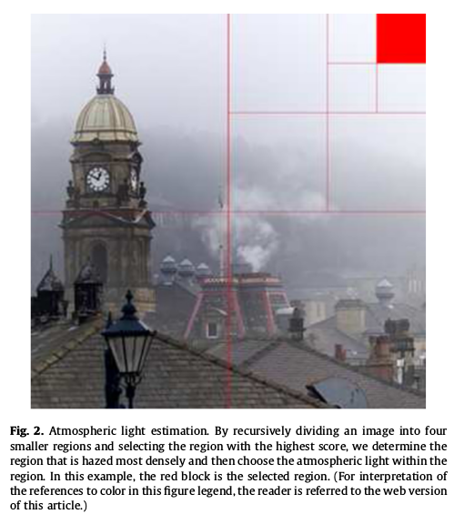

# 视频实时去雾算法   

> 论文原文: ["Optimized Contrast Enhancement for Real-Time Image and Video Dehazing"](http://dx.doi.org/10.1016/j.jvcir.2013.02.004)  

直方图均衡化和边缘锐化通过拉伸直方图可以提高图像的对比度, 但是这些方法并没有考虑到图像深度和雾的厚度是成正比的.   

本文并不是基于暗通道去雾进行改进, 而是基于深度估计的场景辐射度恢复.   

## 0. 算法思路  

- 设计一个 cost 函数来减少最大化对比度过程中的像素失真;  
- 通过最小化 cost 函数来为每一个 block 找到一个最优的场景深度;   
- 对于 video dehaze, 假设相邻两帧之间场景中目标的辐射度是不变的, 因此给之前的 cost 增加一个时间一致性 cost;  
- 另外还设计了一个并行计算方法来加速;   

## 1. Haze model    

基于大气光学, 可以对雾中观测到的彩色图像建模:   

$$\tag{1}
\textbf{I}(p) = t(p)\textbf{J}(p) + (1 - t(p))\textbf{A}
$$

其中:   
- $\textbf{J}(p) = (J_r(p), J_g(p), J_b(p))^T$ 是在像素点 p 处的原始图像颜色(r, g, b);    
- $\textbf{I}(p) = (I_r(p), I_g(p), I_b(p))^T$ 是在像素点 p 处观察到的图像颜色(r, g, b);    
- $\textbf{A} = (A_r, A_g, A_b)^T$ 是全球大气光照, 即大气周围的环境光照;   
- $t(p) \in [0,1]$ 是反射光的传输率, 也叫透射率, 由场景中的点和相机的距离决定, $t(p)$ 和场景深度成反比;   

$$\tag{2}
t(p) = e^{-\rho d(p)}
$$

其中,  
- $d(p)$ 是像素点 p 距离相机的场景深度;   
- $\rho$ 是衰减系数, 和天气状况有关, 一般选择 1 表示典型的有雾天气;   

从式子 (1) 可以这样直观的理解: 对于带雾图像, 如果透射率 $t(p)$ 越大, 观察到的颜色中应该是原始图像颜色起主要作用, 看到的图像还比较清楚; 反之, 透射率越小, 观察到的颜色中应该是全球大气光照起主要作用, 看到的图像就是一片雾;   

由此可见, 这里的全球大气光照也是很重要的一个量, 特别是在场景点的深度比较大的情况下.   


## 3. Static Image Dehazing - 单张图片去雾    

去雾算法流程图:   

```flow 
st=>start: Input Hazy Image 
e=>end: Output Dehazed Image 
op1=>operation: 估计全球大气光照
op2=>operation: 估计 block 的透射率
op3=>operation: 修正透射率
op4=>operation: 去雾
st->op1->op2->op3->op4->e 
```

在估计 block 的透射率时, 我们假设一个 block 中像素的场景深度是相同的. 然后我们会为每个 block 找到一个最优透射率使得最终去雾后的图像的对比度最大化.  

另外, 在增强对比度的同时, 保证由于像素截断引起的像素值失真最小化.   

然后我们使用边缘保持滤波器和滑窗来将块的透射率修正为每个像素点的透射率, 这样就不会出现光晕现象.   

在已知透射率和全球大气光照的情况下, 恢复带雾图像.    

### 3.1  全球大气光照估计   

因为雾会导致图像颜色变亮, 一般认为图像中最亮的颜色就是全球大气光照 $\textbf{A}$.   

但是这样会将比雾亮的目标颜色当做大气光照.   

因为: `含雾区域的像素值的方差通常都很低`, 因此可以利用这个事实来进行 $\textbf{A}$ 的估计.     

另外, 我们提出了基于四叉树的层级搜索, 如下图所示:  



分两步进行:   
1). `首先`将输入图像分为 4 个矩形区域, 计算每个区域的均值和标准差之差作为 score, 然后选择最高的区域继续进行 4 分切割, 直到矩形区域达到我们预先设定的区域 Size 后, 得到一个 Size x Size 的区域;    
2). `然后`在这个区域内根据 $\|(I_r(p), I_g(p), I_b(p)) - (255, 255, 255)\|$, 选择使这个式子值最小的像素点作为全球大气光照值. 通过减去 (255, 255, 255) 来选取像素可以得到很高的大气光照亮度.   

### 3.2  最优透射率估计   

假设场景中的深度是局部相似的, 也就是一个给定区域内的目标的场景深度值可以看做是相同的. 那么对于一个 32x32 的 block 来说, 如果找到一个透射率值 t, 就可以得到:   

$$
\textbf{I}(p) = t·\textbf{J}(p) + (1 - t)·\textbf{A}
$$

$$
\frac{\textbf{I}(p)}{t} = \textbf{J}(p) + \frac{1}{t}\textbf{A} - \textbf{A}
$$

$$\tag{3}
\textbf{J}(p) = \frac{1}{t}(\textbf{I}(p) - \textbf{A}) + \textbf{A}
$$

图像中一个带雾 block 的对比度通常会很低, 如果估计的透射率 t 越低, 恢复后图像的对比度的增量就越大. 因此我们可以通过最大化 block 去雾后的对比度来得到 t 的最优估计.   

**常用的对比度优化函数**:
(1). Mean Square Error(MSE) 对比度   
$$\tag{4}
C_\text{MSE} = \sum_{p = 1}^N{\frac{(J_c(p) - \bar{J}_c)^2}{N}}
$$

其中,   
- $c \in \{r, g, b\}$ 表示 R/G/B 索引;    
- $\bar{J}_c$ 是 $J_c(p)$ 的均值, N 是 block 中所有像素的个数;  

把(3)式 带入式(4), $C_\text{MSE}$ 可以被重写为:   

$$\tag{5}
C_\text{MSE} = \sum_{p = 1}^N{\frac{(I_c(p) - \bar{I}_c)^2}{t^2N}}
$$

(2). Michelson 对比度   

$$\tag{6}
C_\text{Michelson} = \frac{J_\text{c,max}(p) - J_\text{c,min}(p)}{J_\text{c,max}(p) + J_\text{c,min}(p)}
$$

把(3)式 带入式(6), $C_\text{Michelson}$ 可以被重写为:   

$$\tag{7}
C_\text{Michelson} = \frac{I_\text{c,max}(p) - I_\text{c,min}(p)}{I_\text{c,max}(p) + I_\text{c,min}(p) + 2A_c(t-1) }
$$

(3). Weber 对比度   

$$\tag{8}
C_\text{Weber} = \frac{J_\text{c,object}(p) - J_\text{c,background}(p)}{J_\text{c,background}(p)}
$$

把(3)式 带入式(8), $C_\text{Weber}$ 可以被重写为:   

$$\tag{9}
C_\text{Weber} = \sum_{p = 1}^{N}\frac{|J_\text{c}(p) - \bar{J}_\text{c}|}{N\bar{J}_\text{c}}
$$
可以看到公式(9)和公式(4)很相似.   

**说明**:  
我们在本论文中采用了 MSE 对比度, 但是另外两种对比度测量在去雾中也和 MSE 对比度同样有效.   


