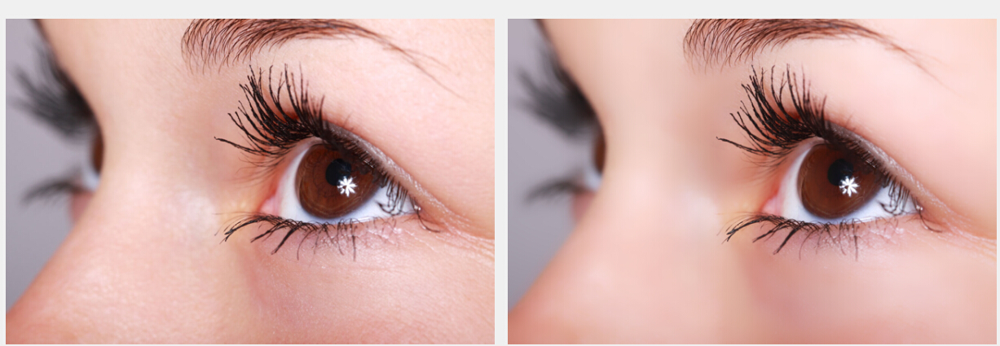

# 基于局部均方差相关信息的图像去噪 

[TOC]

## 论文核心思想   

在 1979 年 Lee 发表的论文《Lee Filter Digital Image Enhancement and Noise Filtering by Use of Local Statistics》中，提出了基于局部信息去除加性噪音、乘性噪音及加性乘性混合噪音的方法.   

经过仔细的学习和编码，发现其去除加性噪音的方法效果非常好，具有现在一些 EPF 算法类似的边缘保留功能，并且其运算并不复杂，可以应用到类似于磨皮这种项目中。   

简单的算法描述如下，对于一幅 `N*M` 大小灰度图像，用表示(i,j)位置处的像素值，那么在 `（2*n+1)*(2*m+1)` 窗口内部的局部平均值及局部均方差可表示为：    

> $$ m_{ij} = \frac{1}{(2n+1)(2m+1)}\sum_{k=i-n}^{n+i}\sum_{l=j-m}^{m+j}x_{kl}  \quad\quad(1)$$
    
及   

> $$v_{ij} = \frac{1}{(2n+1)(2m+1)}\sum_{k=i-n}^{n+i}\sum_{l=j-m}^{m+j}(x_{kl}-m_{ij})^2     \quad\quad(2)$$ 
    

加性去噪后的结果为：    

> $$\bar{x_{ij}} = (1-k)m_{ij} + k_{ij}     \quad\quad(3)$$

其中：    

> $$k = \frac{v_{ij}}{v_{ij} + \sigma}      \quad\quad(4)$$

式（4）中 $\sigma$ 为用户输入的参数。    

就是这么个简单的过程，能平滑图像但同时保持边缘基本不受影响，比如下图的结果：    

   

这个优良的性质让其能在图像磨皮方面发挥一定的作用。

## 算法效率  

再来看看这个算法的效率如何。由上面的计算公式可以看到，其主要的计算量是局部均值以及均布均方差，均值的计算优化方式很多，比如典型的 `累计积分图`。而关于均布均方差的优化，推荐大家看这里：http://fiji.sc/Integral_Image_Filters，其核心的推导公式为：    

$$
{\text{Var}}(X)={\frac  {1}{n}}\sum _{{i=1}}^{n}(x_{i}-\mu )^{2}\quad {\text{and}}\quad \mu ={\frac  {1}{n}}\sum _{{i=1}}^{n}x_{i} $$

展开为:   

$${\text{Var}}(x)={\frac  {1}{n}}\sum _{{i=1}}^{n}\left(x_{i}^{2}-2x_{i}\mu +\mu ^{2}\right)$$

$$={\frac  {1}{n}}\sum _{{i=1}}^{n}x_{i}^{2}-{\frac  {1}{n}}\sum _{{i=1}}^{n}2x_{i}\mu +\mu ^{2}$$

$$={\frac  {1}{n}}\sum _{{i=1}}^{n}x_{i}^{2}-{\frac  {1}{n}}\sum _{{i=1}}^{n}2x_{i}\mu +{\frac  {1}{n^{2}}}\left(\sum _{{i=1}}^{n}x_{i}\right)^{2}$$

$$={\frac  {1}{n}}\sum _{{i=1}}^{n}x_{i}^{2}-{\frac  {2\mu }{n}}\sum _{{i=1}}^{n}x_{i}+{\frac  {1}{n^{2}}}\left(\sum _{{i=1}}^{n}x_{i}\right)^{2}$$

$$={\frac  {1}{n}}\sum _{{i=1}}^{n}x_{i}^{2}-{\frac  {2}{n^{2}}}\left(\sum _{{i=1}}^{n}x_{i}\right)^{2}+{\frac  {1}{n^{2}}}\left(\sum _{{i=1}}^{n}x_{i}\right)^{2}$$

$$={\frac  {1}{n}}\sum _{{i=1}}^{n}x_{i}^{2}-{\frac  {1}{n^{2}}}\left(\sum _{{i=1}}^{n}x_{i}\right)^{2}$$

$$={\frac  {1}{n}}\sum _{{i=1}}^{n}x_{i}^{2}-\left({\frac  {1}{n}}\sum _{{i=1}}^{n}x_{i}\right)^{2}$$

$$={\frac  {1}{n}}\left(\sum _{{i=1}}^{n}x_{i}^{2}-{\frac  {1}{n}}\left(\sum _{{i=1}}^{n}x_{i}\right)^{2}\right)$$
Both sums can be generated from two Integral Images over I({\vec  {x}}) and I({\vec  {x}})^{2} respectively.

经过这样的推导，可以看到局部均方差也可以通过 `累计积分图` 快速实现，同时程序的效率和局部的半径参数无关，因此，效率非常高。    

我个人在这个的基础上，从编码角度进一步进行了优化，对于一幅 `30W（500*600）` 像素的彩色图像处理时间约为 20ms（I3的笔记本CPU）。   

上述公式是针对灰度图像进行的，对于常见的 RGB 彩色图，只要对 R/G/B 三通道分别进行处理就 OK 了。   

有了上述基础，经过个人的摸索，对于磨皮应用，这个算法的两个参数（1）半径可取：`max(Src->Width, Src->Height) * 0.02`， 用户输入的 $\sigma$ 可取 `10 + DenoiseLevel * DenoiseLevel * 5`，其中`DenoiseLevel` 为磨皮的程度参数，范围从 1 到 10，越大磨皮越厉害。 

正如我在文章[《一种具有细节保留功能的磨皮算法》](http://www.cnblogs.com/Imageshop/p/3576818.html)中提出的一样，磨皮算法需要考虑眼睛头发等非肤色部位不被过分处理，一种简单的处理方式就是用非常简易的颜色判断来决定是每个像素点是否为需要处理的部位，比如我在实际的处理中就简单用了如下的方式：    

```cpp
for (Y = 0; Y < Height; Y++)
{
    LinePS = Src->Data + Y * Src->WidthStep;
    LinePD = Skin->Data + Y * Skin->WidthStep;
    for (X = 0; X < Width; X++)
    {
        // 皮肤识别有很多算法，但没有一个能完美的包含所有的皮肤区
        // 域，我认为宁愿多处理一些非皮肤区域，也比少处理更合理些
        if ( LinePS[0] >20 
             && LinePS[1] > 40 
             && LinePS[2] > 50
           )
            LinePD[X] = 255; // 经验数据
        LinePS += 3;　
    }
}
// 以上处理得到的是硬边界，直接使用会到底结果图有较为明显的痕迹，因此可使用模糊平滑下   
```

为了让识别的区域边界不是特别生硬，需要对识别区域进行一定的处理，一般就是用羽化算法，标准的羽化算法是高斯模糊，但是高斯模糊有浮点计算，一种替代方式就是用方框模糊来替代，实际上两种方式得到的结果在视觉上是没有太多的区别的，但是｀方框模糊｀只有整数运算，效率上会高很多。　　　

这样的识别处理后，把处理后图和原图进行Alpha混合，这样即保留了磨皮的光滑区域，又能保证头发等部位不被平滑掉。　　　

```cpp
for (Y = 0; Y < Height; Y++)
{
    LinePS = Src->Data + Y * Src->WidthStep;
    LinePD = Dest->Data + Y * Dest->WidthStep;
    LinePM = Mask->Data + Y * Mask->WidthStep;
    for (X = 0; X < Width; X++)
    {
        Alpha = LinePM[0]; 
        if (Alpha != 255)
        {
            InvertAlpha = 255 - Alpha; // AlphaBlend的混合过程,使用　255 减去原值来提高速度
            LinePD[0] = Div255(LinePD[0] * Alpha + LinePS[0] * InvertAlpha);    // Blue分量
            LinePD[1] = Div255(LinePD[1] * Alpha + LinePS[1] * InvertAlpha);    // Green分量    
            LinePD[2] = Div255(LinePD[2] * Alpha + LinePS[2] * InvertAlpha);    // Red分量
        }
        LinePS += 3; // 移动到下一个像素，24位                
        LinePD += 3;
        LinePM++;    // 移动到下一个Mask值
    }
}
```

在处理完成后，从视觉角度考虑，整体图还是有点模糊，这个时候应该进行了适度的 ``锐化`` 来增强图像的整体锐度，最合适的是 `USM锐化`，但是 `USM锐化` 是基于高斯模糊的，因此又非常耗时，这个时候可以考虑用最简答的领域锐化方式来处理，比如借助于下面的卷积矩阵，就能获得不错的视觉效果。   

|-1|0|-1|
|---|--|--|
|0 |8|0|
|-1|0|-1|

考虑到这个算法对每个像素的亮度值的改变并不是很大，对于彩色图像，如果能够转换到其他的包含亮度分量的颜色空间后，只对亮度进行处理，然后在转换回来，应该对视觉的影响不大，这样去除颜色空间的转换时间，可以提高三倍的速度，是相当可观的.  

常见的包含亮度的颜色空间有 LAB,HSV,YUV,YCbCr 等，其中 YCbCr 和 RGB 的转换公式非常简单，没有浮点计算，对整体的效率影响不大，因此可以选用这个空间。   

再者，经过实验，发现也可以把 `锐化` 操作放在对亮度处理这步，而不是放在最后，这样，锐化操作也只需要处理一个分量，同样能提高效率。   

下面是处理函数的流程：
```cpp
/// <summary>
/// 实现图像的磨皮。
/// <param name="Src">需要处理的源图像的数据结构。</param>
/// <param name="Dest">需要处理的源图像的数据结构。</param>
/// <param name="DenoiseMethod">磨皮的算法，0为双边磨皮，1为均方差磨皮。</param>
/// <param name="DenoiseLevel">磨皮的程度，有效范围[1,10]，数据越大，磨皮越明显。</param>
/// <param name="WhiteMethod">美白的算法，0为Log曲线美白，1为色彩平衡磨皮。</param>
/// <param name="NonSkinLevel">美白的程度，有效范围[1,10]，数据越大，美白越明显。</param>
///    <remarks>原图、目标图必须都是24位的。</remarks>

IS_RET __stdcall SkinBeautification(TMatrix *Src, TMatrix *Dest, int DenoiseLevel, int WhiteMethod, int WhiteLevel)
{
    if (Src == NULL || Dest == NULL) 
        return IS_RET_ERR_NULLREFERENCE;
    if (Src->Data == NULL || Dest->Data == NULL) 
        return IS_RET_ERR_NULLREFERENCE;
    if ( Src->Width != Dest->Width 
         || Src->Height != Dest->Height 
         || Src->Channel != Dest->Channel 
         || Src->Depth != Dest->Depth
       ) 
        return IS_RET_ERR_PARAMISMATCH;
    if (Src->Channel != 3) 
        return IS_RET_ERR_NOTSUPPORTED;
    if ((DenoiseLevel < 1 || DenoiseLevel > 10)) 
        return IS_RET_ERR_ARGUMENTOUTOFRANGE;
    if ((WhiteMethod != 0 && WhiteMethod != 1) || (WhiteLevel < 1 || WhiteLevel > 10)) 
        return IS_RET_ERR_ARGUMENTOUTOFRANGE;

    IS_RET Ret = IS_RET_OK;

    TMatrix *Skin = NULL, *Y = NULL, *Cb = NULL, *Cr = NULL, *YY = NULL;
    unsigned char *Table = (unsigned char *)IS_AllocMemory(256, true);        
    Ret = IS_CreateMatrix(Src->Width, Src->Height, Src->Depth, 1, &Skin);   // 分配皮肤区域的内存
    if (Ret != IS_RET_OK) 
        goto Done;

    Ret = IS_CreateMatrix(Src->Width, Src->Height, Src->Depth, 1, &Y);
    if (Ret != IS_RET_OK) 
        goto Done;

    Ret = IS_CreateMatrix(Src->Width, Src->Height, Src->Depth, 1, &Cb);
    if (Ret != IS_RET_OK) 
        goto Done;

    Ret = IS_CreateMatrix(Src->Width, Src->Height, Src->Depth, 1, &Cr);
    if (Ret != IS_RET_OK) 
        goto Done;

    Ret = IS_CreateMatrix(Src->Width, Src->Height, Src->Depth, 1, &YY);
    if (Ret != IS_RET_OK) 
        goto Done;

    // 第一步： 将RGB转换到YCbCr空间
    Ret = RGBToYCbCr(Src, Y, Cb, Cr); 
    if (Ret != IS_RET_OK) 
        goto Done;

    int SpaceError = 10 + DenoiseLevel * DenoiseLevel * 5; 

    // 第二步：对Y分量进行加性噪音的去除
    Ret = LeeAdditvieNoiseFilter(Y, YY, max(Src->Width, Src->Height) * 0.02, SpaceError);        
    if (Ret != IS_RET_OK)  
        goto Done;

    // 第三步：对处理后的Y分量进行锐化
    if (Ret != IS_RET_OK)  
        goto Done;

    // 第四步：将图像从YCbCr空间转换会RGB空间
    if (WhiteMethod == 0)
    {
        for (int V = 0; V < 256; V++)
        {
            //  Table[V] = .........
        }
    }
    else if (WhiteMethod == 1)
    {
        for(int V = 0; V < 256; V++)
        {
            //  Table[V] = ............
        }
    }

    // 第五步：在RGB空间对磨皮后的图进行美白处理
    Ret = Curve(Dest, Dest, Table, Table, Table);
    if (Ret != IS_RET_OK)  
        goto Done;

    // 第六步：分析图像大概的皮肤区域
    Ret = GetRawSkinRegion(Src, Skin);
    if (Ret != IS_RET_OK)  
        goto Done;

    // 第七步：对全局磨皮、美白后的图和原始图按照属于皮肤区域的程度进行混合
    Ret = BlendImageWithMask(Src, Dest, Skin);
    if (Ret != IS_RET_OK)  
        goto Done;

    Done:;
        IS_FreeMatrix(&Skin);  
    // 注意释放内存
    IS_FreeMatrix(&Y);
    IS_FreeMatrix(&Cb);
    IS_FreeMatrix(&Cr);
    IS_FreeMatrix(&YY);
    IS_FreeMemory(Table);

    return IS_RET_OK;
}
```

第五步的美白处理如果放在对亮度分量的处理过程中，图像整体会有所偏色，似乎有一种肤色红润的效果，但是对部分图像会感觉颜色不自然。   

各部分耗时比例见下图，测试图像大小是500*600。   

|序号|函数名|用时（ms）|百分比（%）|
|---|---|---|---|
|1|RGBToYCbCr|2|10|
|2|LeeAdditvieNoiseFilter|7|35|
|3|Sharpen|2|10|
|4|YCbCrToRGB|2|10|
|5|Curve|1|5|
|6|GetRawSkinRegion|4|20|
|7|BlendImageWithMask|2|10|
|8|合计|20|100|

各种效果比较如下：   

原图　　　　　　　　　　　　　　　　　　　　　　　　　　　　　　                                     　　磨皮后的图


删除第三步后的图                                                                                                                删除第六第七步后的图


　　这个算法最大的优点是整个过程的任何函数都没有浮点计算，这对于某些硬件来说是很重要的，但是一个缺点是优化后的算法不能并行，在我的I3笔记本电脑上30W的像素处理时间20ms，完全能实现实时效果。

有兴趣的朋友可根据我的描述自己实现，测试程序： 快速磨皮。

可调参数如下界面所示：


****************************作者： laviewpbt   时间： 2015.7.27    联系QQ:  33184777 转载请保留本行信息**********************