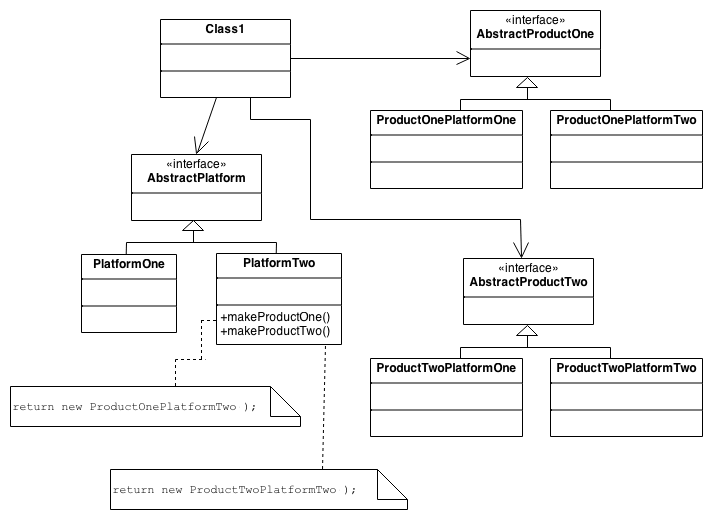
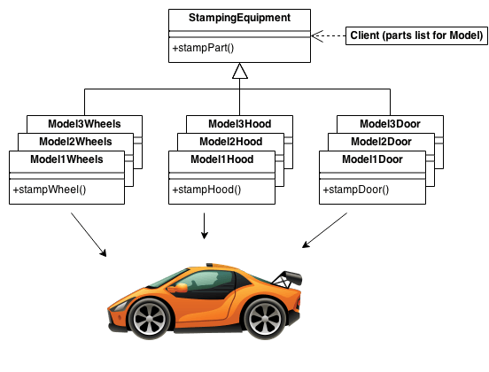

# Abstract Factory - 抽象工厂类     

> 把很容易变化的地方用一个单独的类来做这个创造实例的过程,这个就是工厂.   

> Factory Method 和 Abstract Factory 模式很类似, 但 Factory Method 的重点不在定义新的具体类上.   

## Intent 意图   

当创建一些相关的(或者独立的)对象时, 不需要指定具体类.   
 
比如一个层级结构包含许多 "platforms", 构造一些列具体的平台 "products" 时, 使用 new 的问题就比较多.       

## Problem

如果想要一个应用程序的可移植性好, 就需要封装平台相关的代码.  这些 "platforms" 可能有: windowing, linux, database 等等. 一般来看, 这样的封装工程化很差, 并且会使用很多的  #ifdef 分支语句使得代码看起来很乱(like rabbits throughout the code).     

## Discussion

通过使用一系列的中间层, 它们将这些相关的(或者独立的) "products" 对象的实例化操作抽象出来, 而不是直接指定要床架的具体类.   

"factory" 对象就担负起了创建所有这些相关的(或者独立的) "products" 对象的任务. Clients 不会直接创建 "platforms" 相关的具体 "products" 对象, 这个操做被 "factory" 完成了.    

这种模式使得在程序中使用不同的 product 变得简单, 因为具体 product 对应的工厂类在程序中只会出现一次 - 也就是它初始化的时候. 因此, 程序只要在初始化的地方改变不同的 product 即可.   

具体 product 工厂类是继承自抽象工厂(abstract factory)的.    

因为具体 product 工厂类提供的服务是很普遍的, 因此, 通常的做法是将它们实现为单例模式.    

Because the service provided by the factory object is so pervasive, it is routinely implemented as a Singleton.

## Structure

Abstract Factory 为每个 product 定义了一个方法. 每个具体的 Factory (继承 Factory 后得到的) 都封装了 new 操作符, 特定 platform 的具体 product 类.     

每个 platform 通过继承 Factory 类得到具体的 product 类.   

## Example

Abstract Factory 就是为了在指定具体类的情况下提供一个接口来创建特定对象.  

这种设计模式是在日本汽车的钣金件冲压设备的工作方式中发现的. 冲压设备(machinery)就是一个创建汽车零件的抽象工厂. 使用相同的冲压设备(machinery)来冲压出不同型号的右手门, 左手门, 右前挡板, 左前挡板和引擎盖等等. 通过使用转子来改变不同的冲压模具, machinery 制造的具体的车类就可以在 3 分钟内改变.    

## Check list

1. 各个 product 独立但创建时很不舒服(或者很麻烦).   
2. 将各个独立的 product 和 product 类建立映射关系.   
3. 定义一个 factory 接口, 它包含一个所有 product 都需要的方法.   
4. 为每个 product 定义一个继承 factory 的类, 将 new 操作符相关的东西全部封装到这个类内部.   
5. Client 不应该有 new 操作, 直接使用对应的 factory 类的来创建 product 对象.   

## Rules of thumb

Sometimes creational patterns are competitors: there are cases when either Prototype or Abstract Factory could be used profitably. At other times they are complementary: Abstract Factory might store a set of Prototypes from which to clone and return product objects, Builder can use one of the other patterns to implement which components get built. Abstract Factory, Builder, and Prototype can use Singleton in their implementation.    

Abstract Factory, Builder, and Prototype define a factory object that's responsible for knowing and creating the class of product objects, and make it a parameter of the system. Abstract Factory has the factory object producing objects of several classes. Builder has the factory object building a complex product incrementally using a correspondingly complex protocol. Prototype has the factory object (aka prototype) building a product by copying a prototype object.   

Abstract Factory classes are often implemented with Factory Methods, but they can also be implemented using Prototype.   

Abstract Factory can be used as an alternative to Facade to hide platform-specific classes.  

Builder focuses on constructing a complex object step by step. Abstract Factory emphasizes a family of product objects (either simple or complex). Builder returns the product as a final step, but as far as the Abstract Factory is concerned, the product gets returned immediately.  

Often, designs start out using Factory Method (less complicated, more customizable, subclasses proliferate) and evolve toward Abstract Factory, Prototype, or Builder (more flexible, more complex) as the designer discovers where more flexibility is needed.   

