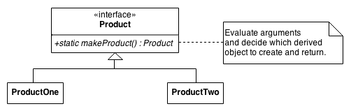
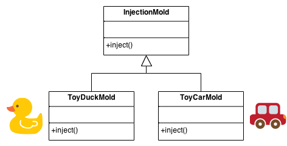

# Factory Method  

> Factory Method 和 Abstract Factory 模式很类似, 但 Factory Method 的重点不在定义新的具体类上.   

## Intent   

到底要实例化哪个对象, 将来会不会增减新的实例化对象.  这时候考虑用一个单独的类来做这个创建实例的过程, 这就是 Factory 模式.   

同时第一次感受到面向对象的三大法宝(封装, 继承和多态)是如何将程序的耦合度降到最低, 同时使程序达到易维护, 可复用, 可扩展, 灵活性更好的状态.   

定义创建一个对象的接口, 但是让子类去决定要实例化哪个类. Factory Method 让一个类的初始化操作延迟到其子类中进行.  

定义一个 virtual 的构造函数.    

new 运算符的滥用.     

Define an interface for creating an object, but let subclasses decide which class to instantiate. Factory Method lets a class defer instantiation to subclasses.
Defining a "virtual" constructor.
The new operator considered harmful.

## Problem

A framework needs to standardize the architectural model for a range of applications, but allow for individual applications to define their own domain objects and provide for their instantiation.

## Discussion

Factory Method 会像实现一个算法的模板那样创建对象. 一个父类定义了所有的标准和通用的方法( virtual 修饰最终的那个 creation 函数), 然后委托子类去实现详细的创建过程. 

Client 最终会使用子类.   

Factory Method 可以通过简单的操作就使一个设计更加的可定制化, 其他设计模式需要定义新的类来实现, 而 Factory Method 只需要一个 new 运算符.   

一般创建对象的时候会将 Factory Method 作为一种标准方式来使用. 但是如果说这个类的实例永远不会变, 或者实例化操作很容易被子类 override (例如初始化操作), 这时就没必要使用 Factory Method.   

Factory Method 和 Abstract Factory 模式很类似, 但 Factory Method 的重点不在定义新的具体类上.   

Factory Method is to creating objects as Template Method is to implementing an algorithm. A superclass specifies all standard and generic behavior (using pure virtual "placeholders" for creation steps), and then delegates the creation details to subclasses that are supplied by the client.

Factory Method makes a design more customizable and only a little more complicated. Other design patterns require new classes, whereas Factory Method only requires a new operation.

People often use Factory Method as the standard way to create objects; but it isn't necessary if: the class that's instantiated never changes, or instantiation takes place in an operation that subclasses can easily override (such as an initialization operation).

Factory Method is similar to Abstract Factory but without the emphasis on families.

Factory Methods are routinely specified by an architectural framework, and then implemented by the user of the framework.

## Structure

The implementation of Factory Method discussed in the Gang of Four (below) largely overlaps with that of Abstract Factory. For that reason, the presentation in this chapter focuses on the approach that has become popular since.

Scheme of Factory Method

An increasingly popular definition of factory method is: a static method of a class that returns an object of that class' type. But unlike a constructor, the actual object it returns might be an instance of a subclass. Unlike a constructor, an existing object might be reused, instead of a new object created. Unlike a constructor, factory methods can have different and more descriptive names (e.g. Color.make_RGB_color(float red, float green, float blue) and Color.make_HSB_color(float hue, float saturation, float brightness)

The client is totally decoupled from the implementation details of derived classes. Polymorphic creation is now possible.

## Example

The Factory Method defines an interface for creating objects, but lets subclasses decide which classes to instantiate. Injection molding presses demonstrate this pattern. Manufacturers of plastic toys process plastic molding powder, and inject the plastic into molds of the desired shapes. The class of toy (car, action figure, etc.) is determined by the mold.

## Check list

修改其中一个不会影响到另外几个.   
增加运算算法也不会影响其他的代码.   
如果是界面程序, 将业务逻辑和及界面逻辑分离.   

If you have an inheritance hierarchy that exercises polymorphism, consider adding a polymorphic creation capability by defining a static factory method in the base class.
Design the arguments to the factory method. What qualities or characteristics are necessary and sufficient to identify the correct derived class to instantiate?
Consider designing an internal "object pool" that will allow objects to be reused instead of created from scratch.

将所有的构造函数都设置为 private 或 protected.    
Consider making all constructors private or protected.

## Rules of thumb

Abstract Factory classes are often implemented with Factory Methods, but they can be implemented using Prototype.  

Factory Methods are usually called within Template Methods.  

Factory Method: creation through inheritance. Prototype: creation through delegation.  

Often, designs start out using Factory Method (less complicated, more customizable, subclasses proliferate) and evolve toward Abstract Factory, Prototype, or Builder (more flexible, more complex) as the designer discovers where more flexibility is needed.   

Prototype doesn't require subclassing, but it does require an Initialize operation. Factory Method requires subclassing, but doesn't require Initialize.  

The advantage of a Factory Method is that it can return the same instance multiple times, or can return a subclass rather than an object of that exact type.  

Some Factory Method advocates recommend that as a matter of language design (or failing that, as a matter of style) absolutely all constructors should be private or protected. It's no one else's business whether a class manufactures a new object or recycles an old one.   

new 运算符是有隐患的. 创建一个对象和请求一个对象是不同的, 而 new 运算符只是创建一个对象, 而不会封装其创建过程. Factory Method 强制将对象的创建过程封装起来, 这样创建过程和请求对象的过程就没有耦合了.   