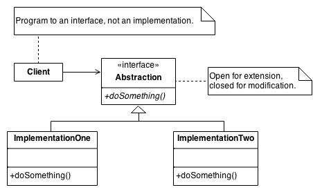
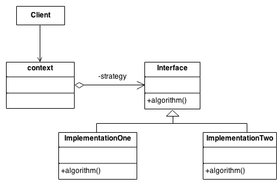

# Strategy

## Intent

定义了算法家族, 然后分别封装起来, 让它们之间可以相互替换. 此模式让算法的变化不会影响到算法的客户.   

算法本身就是一种策略, 最重要的是这些算法是随时都可能互相替换的. 因此这是变换点, 而封装变换点是面向对象很重要的一种思维方式.   

Define a family of algorithms, encapsulate each one, and make them interchangeable. Strategy lets the algorithm vary independently from the clients that use it.
Capture the abstraction in an interface, bury implementation details in derived classes.

## Problem

One of the dominant strategies of object-oriented design is the "open-closed principle".

Figure demonstrates how this is routinely achieved - encapsulate interface details in a base class, and bury implementation details in derived classes. Clients can then couple themselves to an interface, and not have to experience the upheaval associated with change: no impact when the number of derived classes changes, and no impact when the implementation of a derived class changes.

A generic value of the software community for years has been, "maximize cohesion and minimize coupling". The object-oriented design approach shown in figure is all about minimizing coupling. Since the client is coupled only to an abstraction (i.e. a useful fiction), and not a particular realization of that abstraction, the client could be said to be practicing "abstract coupling" . an object-oriented variant of the more generic exhortation "minimize coupling".

A more popular characterization of this "abstract coupling" principle is "Program to an interface, not an implementation".

Clients should prefer the "additional level of indirection" that an interface (or an abstract base class) affords. The interface captures the abstraction (i.e. the "useful fiction") the client wants to exercise, and the implementations of that interface are effectively hidden.

## Structure

The Interface entity could represent either an abstract base class, or the method signature expectations by the client. In the former case, the inheritance hierarchy represents dynamic polymorphism. In the latter case, the Interface entity represents template code in the client and the inheritance hierarchy represents static polymorphism.

## Example

A Strategy defines a set of algorithms that can be used interchangeably. Modes of transportation to an airport is an example of a Strategy. Several options exist such as driving one's own car, taking a taxi, an airport shuttle, a city bus, or a limousine service. For some airports, subways and helicopters are also available as a mode of transportation to the airport. Any of these modes of transportation will get a traveler to the airport, and they can be used interchangeably. The traveler must chose the Strategy based on trade-offs between cost, convenience, and time.

## Check list

Identify an algorithm (i.e. a behavior) that the client would prefer to access through a "flex point".  
Specify the signature for that algorithm in an interface.  
Bury the alternative implementation details in derived classes.  
Clients of the algorithm couple themselves to the interface.  

## Rules of thumb

Strategy is like Template Method except in its granularity.
State is like Strategy except in its intent.
Strategy lets you change the guts of an object. Decorator lets you change the skin.
State, Strategy, Bridge (and to some degree Adapter) have similar solution structures. They all share elements of the 'handle/body' idiom. They differ in intent - that is, they solve different problems.
Strategy has 2 different implementations, the first is similar to State. The difference is in binding times (Strategy is a bind-once pattern, whereas State is more dynamic).
Strategy objects often make good Flyweights.